# 实现在线简历（上）

## ★引子

- 年后要出去找工作
- 前几天刚看完了有关[CSS布局](http://zh.learnlayout.com/)的内容，所以需要一个实战项目好好巩固一下

## ★目标

- 不光是学习CSS和HTML，还得顺带去学一学如何去写简历，如需要我们的简历呈现出什么内容？……

总之就是：

1. 基本的网页布局
2. 简历如何去书写


## ★分析与准备工作

### ◇简历模板

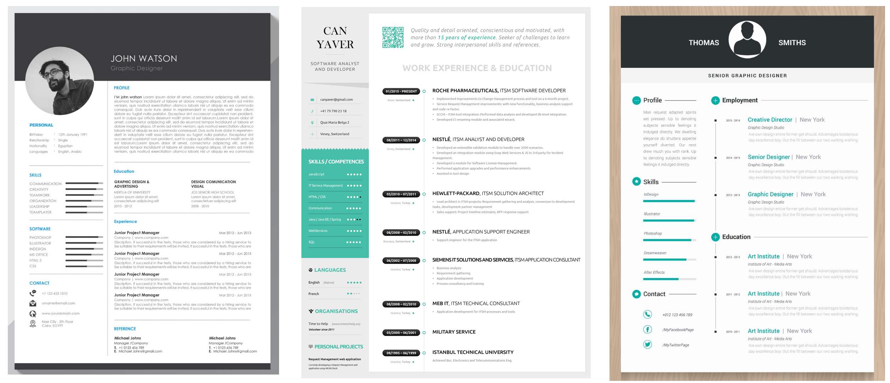

选择第二个，不需要做得一模一样，根据我们的实际情况来……

总之我们想要做一个跟第二个差不多的在线简历，然后我们该如何去设计这个简历？要展示哪些内容让我们显得更专业？换句话说，一个是技术上的，一个是非技术上的！

### ◇分析

#### 结构

这是一个典型的简历页面

那么其中分为几块呢？

1. 个人信息（姓名、联系方式如手机、邮箱、学历、学校、博客地址……）
2. 技能（掌握哪些语言？掌握程度？……）
3. 应聘职位（如前端工程师……）
4. 掌握的语言（由于是非技术类的，可能不太一样，可以替换成个人的自述等等……）
5. 一个二维码（可以搞成是加我们的微信，或者一扫码就可以看到在线版的简历……），其旁边那部分内容也可以简单的介绍一下自己……
6. 工作经历和项目经历，在这里直接就是工作经历、工作时间、地点、公司名称，然后一些具体的细节，而对于我们来说就有一些不太一样，和前端职位相对应的话，我们可能需要做一些调整，如工作经历、教育经历和项目经历……

#### 怎么做？

1. 简历的整个背景是灰色的，而它的中间则是白色的，然后它杵在页面的中间，所以这是一个典型的居中布局（用一个div，然后设置宽度，或者是最大宽度，然后`margin: 0 auto;`即可）
2. 居中布局之后，里面分为两大块，一个是侧边栏，一个是主要区块。换句话说，内部就是一个典型的两栏布局。还有就是左侧是固定宽度的，由于是左右，那么我们就可以使用浮动，当然我们也可以使用flex布局或者是grid布局，当然我们这次选择的是传统布局，即浮动
3. 知道是分为两块之后，然后就从上往小去写我们的东西

可见整个页面被我们圈圈画画就画完了！画完之后，我们心里大致有个底之后，就可以开始写了！

### ◇开搞

> 边写边穿插写CSS和HTML的套路！

#### 写页面的雏形

##### 简单的描绘一下轮廓

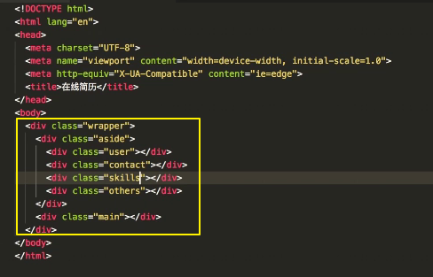

##### 第一点套路

关于命名规则：

> 可以用HTML5新出的语义化标签，如aside、main标签
>
> **➹：**[`<main>`标签 - HTML（超文本标记语言） - MDN](https://developer.mozilla.org/zh-CN/docs/Web/HTML/Element/main)
>
> 也可以都写个class
>
> class的名称全都基本上是小写的！如果比较长，那就用中横线去做连接，如 `skills-area`，而不是去用驼峰，当然有些人习惯用驼峰也可以
>
> 总之这其实就是所谓的编码规范了，而所谓的编码规范就是去定一个规则，然后你一直去遵守它就行了，所有人也一直遵守它就行了
>
> 所以如果有些人习惯这样写，那也没有关系，只要你遵守这个规范，然后你去发扬它也可以！
>
> 只不过用小写的话，个人觉得：
>
> 1. 好看
> 2. 这是谷歌的编码规范，很多大公司都有在采用，所以我们就直接按这个规范去用就行了！
>
> 还有一点就是关于名称的问题：直接根据它的功能去命名即可！，如这一块是干嘛用的？如用户的个人信息，可以叫`user`，也可以叫 `personal-info`
>
> 如果英语不好，那就使用翻译工具，然后挑一个看起来比较短的一个单词就行了，千万不要写一个叫 `cebianlan`侧边栏这样一个拼音出来！

关于元素的其它附加属性：

> 1. 很少出现有id ，总之基本上我们写HTML的时候，很少出现id，一般都会给很大的区块加个id，如aside和main，或者是某一个特殊的按钮，如提交等加一个id……
>
> 总之在正常情况下，我们用样式去操控我们页面的元素时候，全都用class……

#### 下一步干嘛？

可以继续写html，也可以因为看不到样式、看不到效果而感到着急，为此可以先去写样式：

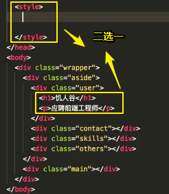


关于样式，正常情况下是写外置的样式，即写一个CSS文件然后引入，或者是一些经过工具处理的样式，为了简单起见，我们主要是演示如何去写页面，所以我们就不去做一些工程化的东西

总之，可以边写样式边写HTML，两边同步进行，没有谁先谁后的问题，就看你个人心情啦！

#### 写样式

##### reset

写样式套路：

分为几个部分去写样式，而不是一上去就直接写，如直接就去搞user里的h1里样式……

你需要先去写一些基础的样式

那这其中有什么套路呢？

第一步：对我们页面的CSS做一个reset，即样式的重置，如做得简单粗暴一点就是：

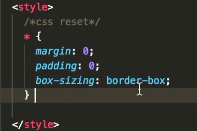

让外边距和内边距都设为0，毕竟很多元素都有默认样式，比如body上有默认的8px的外边距，还有诸如p、h1~h6等都有默认的外边距，还有有些元素都有内边距……有些情况下，这些边距可能会影响我们元素的宽高或者是边距的计算，所以很多情况下，简单起见都设为0了！然后后面再单独去搞样式设，当然，你也可以一开始不要那么粗暴，然后后面需要什么就加上什么，就像这样：

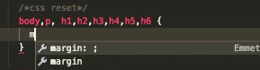


当然你也可以去引入一些诸如normalize.css或者是reset.css，其实做得事情都差不了多少，只不过做的会更细

**➹：**[normalize.css与reset.css区别 - w3ctech](https://www.w3ctech.com/topic/1804)

关于 `box-sizing:border-box;`是干嘛的呢？——关于元素的大小计算是以边框作为一个元素的计算，总之就是写宽高用起来更方便一点，换句话说就是挤压内容咯！

除了做这些一些reset以外，有时候还得做其它reset，如a链接：

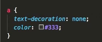

因为a链接默认点完之后有颜色，而且默认也有下划线之类的样式……如果设计稿说是要下划线的，那么你也可以不用去去掉……

还有ul的点的默认样式，如果不需要那就去掉，如果需要那就不去掉好了！

总之CSS最上面这一块就相当于去设置标签的一些基础样式

##### common

> 写通用的样式

通用样式有什么呢？

第一个就是UI组件，举个例子来说，由于我们这个页面比较简单，没有什么特别的组件，而所谓的组件就是它这个东西可以复用，如果做一个红色的很好看的按钮，然后这个网站很多地方都用到了这个按钮，那么你是不得把这个按钮的样式给抽离出来呢？把这个按钮的样式给抽离来之后，然后就写一个class……那么后面你在用它的时候，你就直接写个class就可以了！换句话说是，这就是我们从整个页面、从这个设计稿中抽离出来的UI组件

对于当面我们这个设计稿来说，也没有什么UI组件，毕竟没有什么复用的东西，不过我们还是可以从中挑一个的，如这个黑黑的东西，毕竟这个家伙貌似用得比较多……

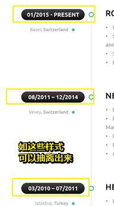

，

那么这个黑黑的东西该起个什么名字好呢？——看起来像个药丸……我们可以使用翻译工具看看它的意思，查找得知，它叫pill……

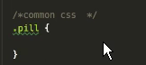

具体样式我们一会儿再加，先把这个位置给留在这里！

除了这些之外，我们可能还有一些，比如说定义我们页面的宽度，叫`layout`，为啥要起这个名字呢？——都是一些套路，你一开始先不要去管，用习惯了你自然就会用了！

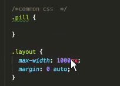

后面我们用到了浮动布局，由于没有用flex之类的，所以我么需要写一个 `clearfix`，来用于清除浮动

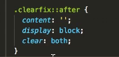

**➹：**[学习CSS布局 - fe-learn-2018](https://ppambler.github.io/fe-learn-2018/CSS/02-%E5%AD%A6%E4%B9%A0CSS%E5%B8%83%E5%B1%80.html#the-clearfix-hack)

我想此刻的你，肯定会觉得所写的这一堆东西一点用都没有哈！毕竟你无法看到相应的效果，其实我想告诉你的是，这些东西太套路了，由于是套路，为此就先写出来了！等到后面我们就可以去用了！

如果后面你发现还有一些很泛的，很多地方都会去用的，那么你都可以把它加到这里！

那么下面这一块，就可以开始写我们当前页面的样式了，而当前将要去写的样式就是这些HTML元素的具体细节了！

##### page

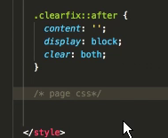

## ★具体搞page css

### ◇定义整个页面的基调（body）

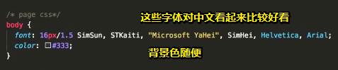

> 不是纯黑的color

1. 利用CSS继承，这样一来后面所需要设置的关于font之类的样式就设置得很少了……
2. 如果不一样那就单独再去设，如字体更大，行高更高……

总之基调一定要设！千万不要选中一个元素，给它加一堆，再选中一个元素，然后又给它加一堆，毕竟这比较麻烦哈！

> 字体设置的具体内容参照：head first html and css那本书

### ◇wrapper

接下来希望当前的页面是固定宽度居中的

根据之前写好的layout选择器，把它添加到wrapper身上就好了

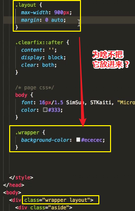

放进去写也没有什么问题，而分开的好处是什么呢？就是更清晰一些，如我们这个layout就专门用于页面的宽度的，比如说我们可以把它改为其它1000px，还是其它的都行！

这就像是一个国家，谁都可以管理这个国家，但是我们把它分成几个职能，如layout专门去管司法的，而wrapper则是去管理政府事务的，然后凡是政府事务的我们都放到wrapper里去管，而凡是涉及到页面布局的，我们都放到这个layout里去管！

那么最终又有这个效果，也有那个效果！总之就是做了个分离，然后页面表现最后又重聚了！

> 元素就像是个国家，class中的每一个名字就是一个个有特别任务自身的人一样，有些管布局的，有些管具体样式细节的，如字体颜色相关的、盒模型相关的……
>
> 最后站在这个国家的角度来看，或者说是元素的角度来看，才是一个完整的效果！

这样做，还有一个好处就是：

当我们后面要做响应式的时候，我们需要控制layout就可以控制整个页面的宽度了！而不用再去管wrapper里面的东西了！即便它们俩对应的是同样一个元素！

根据设计稿，还得搞一下外边距，注意不要把layout中设置的margin给覆盖了

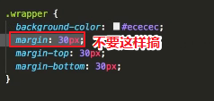

接下来，根据设计稿里的东西往下走！

### ◇aside

如何实现两栏布局——左侧和右侧？

> 站在整个页面的角度来看，一个wrapper是一栏
>
> 站在wrapper的角度来看，其里面的aside和main则是两栏

最简单的方式是使用浮动，至于还有什么圣杯布局，双飞翼布局的简化版都是比较老的姿势了，那我们都没有这样去用了，毕竟我们用flex布局之后就更简单了！当然用float也挺简单的！

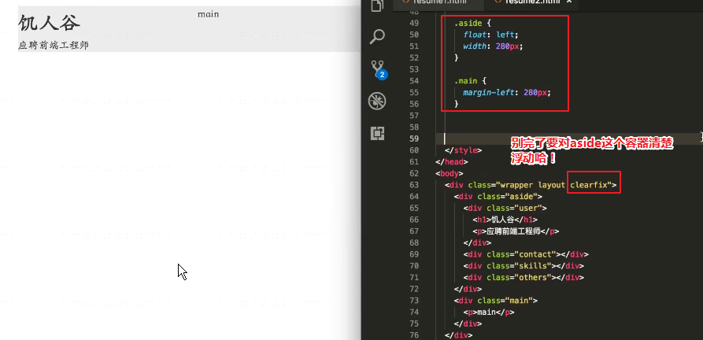

#### user

主要是搞文本居中、字体大小、盒模型之类的

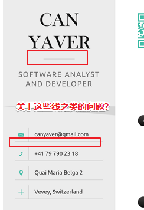

我们需要想下面这样做吗？

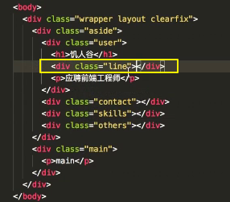

然后给这根线加个样式？——没有必要，而这也引出了我们写CSS的另一个原则：
比如说我们去写CSS的时候，先不要去管这些细节，如线、那个背景的阴影三角之类的……先不要去管，我们先去看主体的内容，然后看看效果一一对应的HTML元素，之后就看看能不能用伪元素去代替这根线？如果能用伪元素去代替的话，那么就最好了，毕竟我们这样去看HTML的DOM结构的话，就很简洁了！

总之让页面的内容和我们的HTML标签一一对应，而不是无端端地多出一个标签也不知道是干嘛用的……或许你会更进一步地方向说「哦！原来是代替页面上的某一个效果的，如这根线……」

所以我们那就看看能否用h1的伪元素来看看能代替这跟线，实在不行的话，那就再加标签呗！

所以伪元素有啥用呢？——就是可以多当一个标签用的，类似于叫CSS写HTML标签，而不是交由我们开发者来做

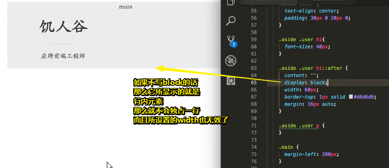

接下来实现小小几何图形背景

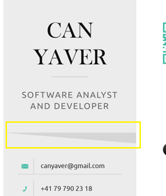

当然可以用图片（直接截图就好了），不过这有点丑，所以看看能否用标签弄出来呢？标签也可以，既然用标签也可以，那用伪元素肯定也行哈！

那找谁的伪元素呢？——可以找p的伪元素，也可以找user的伪元素

那么如何做呢？——想想我们之前所学过的用标签做三角形

如果不会的话，那就先从简单的开始

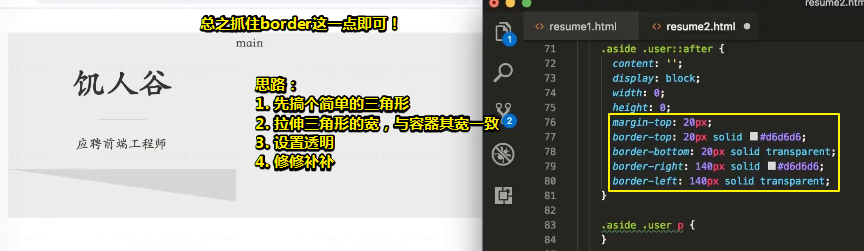

#### contact

> 来到个人信息


我们可以分析出，这是一个列表，因为可以看到这是一行一行的，或许你会问「这不是表格吗？」，额……如果用表格的话那也忒复杂了！

确定好是列表之后，就用语义化的标签改造原先的div呗！

每一列前面是个图标，而且是单色的，既然如此，那么就会有两种选择来弄这个图标，一种是字体图标，一种是svg图标！

如果这个图标是彩色的，即多种颜色、很炫的图标，那么我们只有一种选择，那就是svg图标！千万不要用图片，如背景图片，CSS sprite 图这些鬼东西……因为这些都是过时的旧技术哈！毕竟太老了，如所谓的精灵图，就是把多个小图片 弄成是一张大图之类的！讲真，这些又麻烦，又老哈！

总之，我们用字体图标就行了！

那么选择谁家的字体图标呢？——用阿里的iconfont就好了

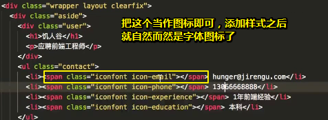

> 我们先用 `<span class="iconfont icon-email"></span>`占个位置

关于在iconfont上选图标的问题，正常情况下，在公司里是设计师给出来的！

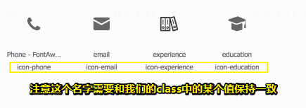

> 可以调整图标大小

如果需要用到颜色，那就选颜色，然后用png下载即可！然后就可以把它当作是图片去展示了！

之后我们勾选某个按钮，然后点击生成相应的代码，如果是svg的话，那就用Symbol就好了，而在这里我们用的是 Font class

然后可以把生成的CSS代码直接，拷贝到我们自己的CSS文件里面，而不是引入一个来自其它网站的CSS资源URL，当然你还可以把其中涉及到字体库链接内容，给下载下来，然后放到我们自己的项目里去！

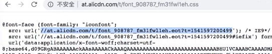

不过为了简单起见，我们直接用它的线上地址即可！

有了图标之后，我们需要去完善细节

> 写HTML遵循一个原则：标签能省则省，尽量地省，如我们看到的设计稿，就只有图标和字，没有考虑其它细节！但是目前这里边有根线哈，所以我们得想想能否用现有的标签来把它画出来！

其中一根线用border-bottom即可！另外一根线，由于文字身上没有标签，那么我们只好给其旁边的span，即iconfont加个边框！

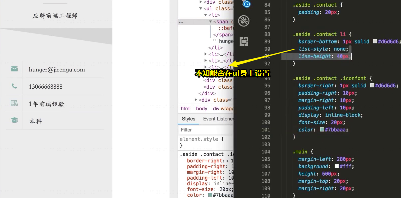

#### skills

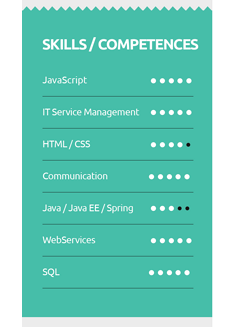

关于这个锯齿？——由于感觉不太好看就不去实现了，如果非要做的话，可以用svg把尖角给画出来，当然你也可以用小图片，如果是半圆形的话，我们倒是可以用CSS去实现……

然后下面的则是做成进度条的形式……

HTML结构：

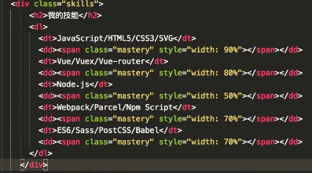

为什么要这样去写？

1. 这里的标题比我们那个名字大标题，要更小一点，所以在这儿用了h2，当然你用h1也没事
2. 关于dl dt，你也可以用其它的，如写一个div，然后其中写一段文字，有一个p，然后再有另外一个东西。至于用dl dt的原因是它们像是一个标题，然后下面是一些信息……

为什么要写技能？

1. HR懂这些关键字，好去筛选简历
2. 机器也会帮你筛选

如何实现进度条？

1. 一个div加个圆角，作为背影。如dd就是背影
2. 再用一个div绝对定位（ 不一定需要绝对定位）覆盖上去，然后用不一样的颜色，而且没有背影那么宽。如span就是掌握情况
3. 再对span加个宽度

> 一般我们不建议在HTML里面写CSS，不过有些情况例外，如当前这个情况就是例外的情况，为什么这么说呢？
>
> 如果你不这样写的话那么你就得写好几个选择器，然后分别给上不同的宽度了，万一变化了，又要去改CSS，万一要新增几个技能，又得去改CSS
>
> 而直接写在元素身上的话，就很便于去调控了！毕竟可以直接用JS去选择这个元素，然后修改这个进度条……

#### others

同contact的做法

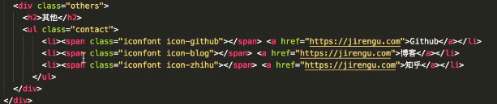

效果：

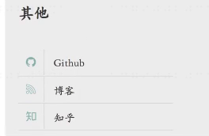

### ◇main

#### 分析

左侧已经写好了，那么右侧该展示什么信息呢？

一般来说左侧展示的是个人资料，而右侧则是说服面试官的硬货，那么其中有哪些东西呢？

第一个：

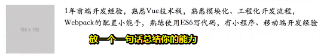

> 这个头像放的是你的微信，方便HR去扫！

面试官根据这一句话，发现我们公司不就是需要这些吗？然后就有兴趣了！

关于教育经历：

如果是一本以上就写出来吧，如果不是，如大专、二本、本三，那就本科或者大专即可！

HTML：

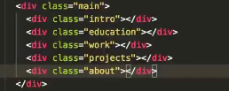

如果个人评价太长了，那就放在左侧最下方！

如果你咩有工作经历，那么你可以把工作经历给去掉！

如果你的工作经历有，但是不相关，你可以把这个工作经历放到项目的下边，个人评价的上边，然后一句话带过

所以就看情况啦！

如果你的工作经历像若愚老师这样的，你可以写得很详细……如这样：

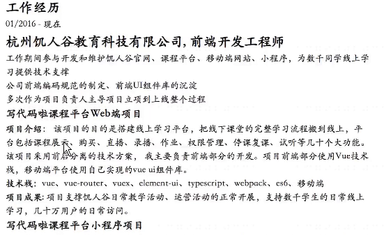


#### intro

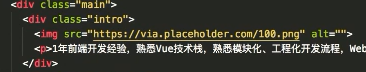

头像图片：<https://via.placeholder.com/150>

设计稿中，因为有15年开发经验所以加粗了，而我们1年的则没有必要加粗了！

外边距合并问题：

1. 对wrapper搞一个 `overflow:auto;`

还有其它的解决方案……


#### education

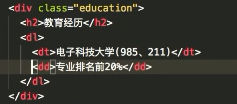

为啥要用dl dt dd?？——因为有些同学是有双学位的或者是有本科和硕士的！所以dt写的是学校，而dd则是写我的介绍！这样一来就不用那么多div了，从而也无需加那么多class了！

总之，随你便啦！都可以，即不管你是用语义化标签，还是万能的idv和span……

当我们对intro 添加了清除浮动（其儿子图片浮动了，影响了education）之后，会发现你解决了一个bug，又引出了一个更大的bug（教育经历的显示跑到最下边去了）……就像这样：

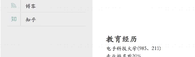

如何能让这两块东西（intro、education）互不影响呢？——我们之前有学过BFC的概念，如果我们给一个元素加了个盒子，这个盒子是有了自己独立的渲染空间，那么当你intro clearfix之后，就不会感知到外面的东西了，即和外面就隔绝了

那么如何创建一个BFC？把intro自己给包裹住呢？不受外边层的影响呢？

可以 `display:inline-block;`、浮动、绝对定位、overflow之hidden、auto等之类的都可以……

```css
.main .intro {
    overflow: auto;
}
```

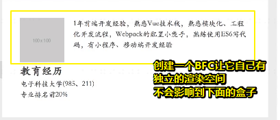

这就是我们之前为什么要学BFC的概念的原因所在哈！显然是为了解决我们日常开发中所遇到的实际问题！

如果不用浮动的话，那就走另外一条路，用flex就好了！

……

在写它的样式的时候，发现dl dt dd，并不好写，所以改了HTML：

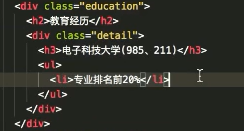

如果还有什么的 奖学金情况的话，可以继续添加li哈！

#### work（工作经历）

分析——如何去写？

时间，公司名称，职位，然后下面是一些细节

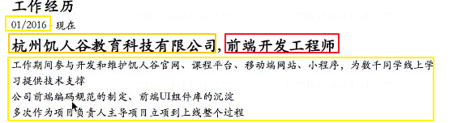


如果你在一个公司里边，你不知道干什么，你就可以根据上述这个描述去主动做一些事情，比如说公司的前端编码规范的制定多简单啊！即制定一个规范然后大家一块用，然后推荐一些，难道这不就是自定义规范吗？

而前端UI组件库你会不会呢？——我们毕设项目里面都有，你把它推广一下，或者你不用推广，自己用起来

换句话说，你的这个简历相当于自己立下一个flag，我后面自己在学得过程中，自己去实现它！或者我按照这个东西去学习！

关于描述的最后一点，作为项目负责人，其实在公司里边，这种机会是很多的，毕竟一个项目并不是一个完整的产品，可能某个需求的改版上线，都可以是一个小的项目，我建议如果你在公司的话，多去主导一个项目，毕竟后面你在跳槽的时候，去写简历的时候，就不只是去写我会了什么技术了！

总之工作经历先介绍工作内容，然后再介绍工作的主要项目！

#### 项目经历

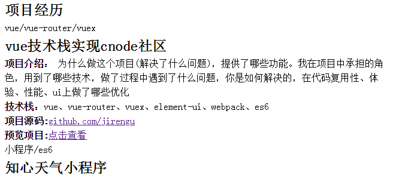

接下来，看看我们项目的写法：

1. 项目介绍
   1. 为什么做这个项目？
   2. 提供了什么功能？
   3. 在项目中承担了什么角色？
   4. 用到了什么技术？
   5. 如果做的是自己的项目的话，你做的过程中遇到了什么问题？是如何去解决的？然后在代码的复用性、体验性以及性能方面你做了哪些优化？如果是公司的项目的话，那么这一点你可以不用去写，也可以去写！

6. 技术栈
7. 项目源码
8. 预览项目

关于技术栈：这些东西一般是公司里面在用的，而且是比较新的技术，如果你的项目有用到，最好说出来！

如：

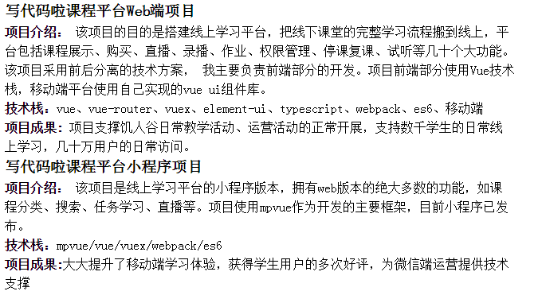

关于项目成果，一般都要写点什么，不管是从数据上表现也好，还是从收益上表现也好，你肯定能说出一两句话来！

这样一来，你去写你的项目的时候就感觉很丰富

换句话说，你一个项目至少给我写个4行~6行的项目介绍

千万不要一句话概括，如「我用vue实现了cnode社区，然后包括了什么什么功能，就这样完了……」，如果你这样做了，即你字数写得越少，就表示你的项目越简单……就表示这个东西不是你做的或者是表示说你这个东西是抄的！或者说这个东西做得很弱，没有什么技术深度

所以说字数和你的项目的用心程度和难度是成正比的！当然你也不要写得太详细了，如一个项目写一页，这显得有点太过了！

 前面这点内容是有关工作经历的写法

下面这点，则是言归正传，写写项目经历

关于这里的项目就是我们的毕设啦！

为啥要项目介绍呢？——因为面试的时候，肯定会问到哈，你先把它写出来，面试的时候，就能看到你的字就很好地去讲了，否则突然问你「你做这个项目过程中遇到什么问题呀？」，然后你说「没问题」，这样就不好了呀！

#### 个人评价

如：

> 痴迷新技术，喜欢承担有技术难度的工作，爱分享，善于知识总结梳理

这些都是作为一个程序员特别重要的技能，当然你还可以写得多一点哈！

## ★之后的打算

1. 把项目经历的UI给弄出来
2. 再做一点响应式，这样一来在手机上展示也很漂亮了！因此，我们也可以直接拿去用了！

做好了那几个项目，然后写多几个项目，那么找个10k以上的工作也是没有问题的！

如果再有点工作经历放上去就更好了，如果你个教育经历又很漂亮，写多一点，拿几个奖学金，那就很完美了！


## ★总结

- 用了语义化标签之后，就很少用到class了……如dl/dt/dd。之所以不需要对这些标签加上class，很明显是因为我们可以很容易地找到这些元素，如果全都是div的话，那么我们肯定是要做区分的，即要加很多很多的class，所以这就是我们使用语义化标签的好处，并不是说「为了机器便于阅读」「为了人便于阅读」，而是给自己去省事哈！
- 慢工出细活，慢慢就好看了！看视频操作确实很慢，等会儿自己做就很快了！
- 关于这个在线简历，并不需要写JS，如果有那个写JS的时间还不如把这时间放在其它项目上！

- 这节课的主要目的并不是教大家怎样去写HTML和CSS，主要是教大家如何去写简历，特别是简历内容这一块，如不知道如何去写项目，不知道如何去描述项目，

## ★Q&A

### ①行内元素的宽高问题？

- 块级元素(block)特性：
  总是独占一行，表现为另起一行开始，而且其后的元素也必须另起一行显示;
  宽度(width)、高度(height)、内边距(padding)和外边距(margin)都可控制;
- 内联元素(inline)特性：
  和相邻的内联元素在同一行;
  宽度(width)、高度(height)、内边距的top/bottom(padding-top/padding-bottom)和外边距的top/bottom(margin-top/margin-bottom)都不可改变（也就是padding和margin的left和right是可以设置的），就是里面文字或图片的大小。

那么问题来了，浏览器还有默认的天生inline-block元素（拥有内在尺寸，可设置高宽，但不会自动换行），有哪些？
答案：`<input> 、 、<button> 、<texterea> 、<label>`。

**➹：**[为什么有些行内元素可以设置宽高 - 简简和单单 - 博客园](https://www.cnblogs.com/wangrongxiang/p/5392826.html)

**➹：**[a span都是行内元素，设置宽高不是需要将其转化为块级元素吗？_慕课问答](https://www.imooc.com/qadetail/64938)

**➹：**[爱创课堂每日一题八十一天-行内元素和块级元素的具体区别是什么？行内元素的pad-12854747-51CTO博客](http://blog.51cto.com/12864747/2054862)

### ②如何实现锯齿形边框？


**➹：**[css3锯齿形边框效果代码实例-蚂蚁部落](http://www.softwhy.com/article-8273-1.html)

**➹：**[两种纯CSS的方式实现优惠券上的锯齿效果 - 胡飞飞的学习笔记 - CSDN博客](https://blog.csdn.net/holmofy/article/details/79648343)

**➹：**[html - css3怎么实现锯齿边框？ - SegmentFault 思否](https://segmentfault.com/q/1010000011009516)

### ③关于上下线连接起来的做法？


不是line-height的作用，而是inline-block的作用！

line-height只是把空间给撑出来而已！

如果写不出来，大不了再加个标签，也没问题

如果用flex布局会更简单！

由于我们并咩有用flex，只能用老方法去拼凑，只要拼凑出这个效果即可！

### ④什么时候用float？

当有左和右的时候：

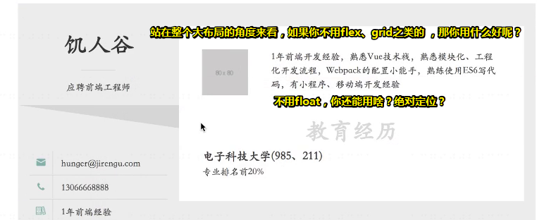

千万不要想着用`display:inline-block`

### ⑤关于在线版的pdf化？

1.  `Ctrl+p`
2. 如果导出来的结果不太好的话，那么你也可以用word导出来，然后调整一下，再把word弄成为pdf即可！

3. 还有勾选背景图形：

   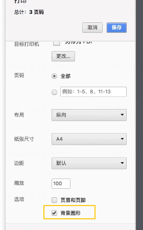