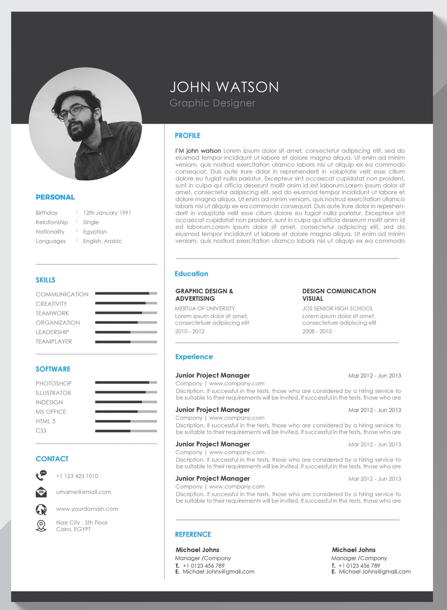
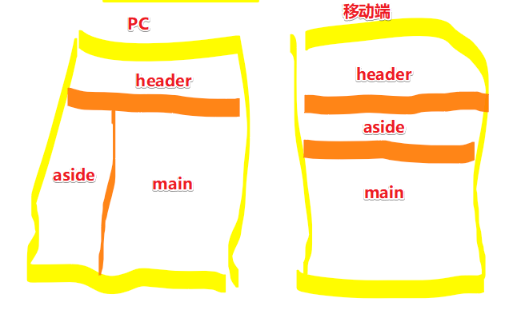

# 使用Flex实现在线简历

## ★概述

要做的效果：



修改建议：

1. 该简历文字行间距太小，文字看起来太紧凑了，建议中文增大行间距
2. 上部分留白太多，建议缩小
3. 个人头像尺寸太大，看起来很自恋，建议缩小
4. 四周的阴影很有质感，建议实现
5. 一定不要忘了手机适配！

能学到什么？

- HTML 与 CSS 静态页面相关的知识
- 使用Flex做布局
- 学会使用svg icon
- 学会使用简单的移动端适配
- 最重要的是学会如何去写一个简历

页面分析（即这个在线简历做好之后，会长成什么样子）：

1. 简历不可能撑满整个屏幕，所以需要在页面里边划一块以区域，用于写简历的内容，说白了，就是常见的把整个页面居中操作呗！
2. 页面的框架搭建，即使用传统的浮动的布局，还是flex布局等
3. 是否需要兼容移动端？PC上看到的，和手机上看到的是否一样呢？由于大部分人是用手机看的，因此针对该简历页面我们需要在手机上做一些优化！
4. 细节处理

## ★How（布局）

### ◇技术预研

- 添加 `meta:vp`：作用让页面在移动端显示不是特别的小，也不是特别的大
- HTML5标签：（各自代代表什么含义）
  - header：代表一个title，一个大标题，一个块
  - aside：侧边栏
  - main：页面里边独一无二的大区块，即主要的区块，需要注意的是一般页面就只有一个大区块，说白了，同一个页面里边不要出现两个main标签

> 关于HTML5的其它标签，你可以查看[HTML 元素参考 - HTML（超文本标记语言） - MDN](https://developer.mozilla.org/zh-CN/docs/Web/HTML/Element)，然后看看它给出的使用建议！

- `width`和`max-width`：在声明一个页面主体宽度的时候，如果不考虑移动端，那就用前者，如果考虑，那就后者，因为不会出现水平的滚动条哈！


### ◇做法

1. 写页面结构：期望整个页面是居中布局，因此需要搞个`div#page`包裹器用于包裹整个页面。
2. 分析页面有哪几部分（有三部分）
   1. 头部（header）：头像可属于header部分，也可以属于侧边栏这部分，这随你决定，目前暂且认为是侧边栏这部分，即任务头像是从aside偏移上去了
   2. 侧边栏（aside）
   3. 主要内容区块（main）

``` HTML
<div id="page">
  <header></header>
  <aside></aside>
  <main></main>
</div>
```
3. 分析以上标签，看看能否很方便的实现设计稿里边的效果，如果不是很不方便实现的话，那就再加一些东西去处理！如这样：

``` HTML
<div id="page">
  <header></header>
  <div class="content">
    <aside></aside>
    <main></main>
  </div>
</div>
```
用一个div把aside和main包裹一下，而之所以这样做的原因是，把header和「aside+main」当作是两块区域来处理，说白了，就是把下边那部分区域当作是左右两部分来看待！

当然，我们要遵循一个原则是「标签能省则省」，如果3个标签就能很好的语义化表示我们页面的内容，那么就不需要添加多余的标签了，除非自己真得无法实现页面效果的时候，然后再去添加标签！

4. 页面结构有了，那么接下来你可以选择两条路中的一条路来走：
   1. 细化：如细化header
   2. 布局：把页面大致的布局给展现出来，以此来对页面整体有一个粗浅的认识，如写header的样式，先加个高度和背景色，然后就可开始下一个元素的样式书写了，而不是一看到一个元素就把它的内容给填充了！同理，aside则是「宽度+背景色」，main则是「高度+背景色」，写好之后，就是看看我们所写的大致布局跟设计稿所呈现的到底对不对，如果是对的，那就去填充header、aside、main的内容，如果不对，那就去调整一波呗！

5. 选择第2条路。由于整个页面，就一个区块，所以最好还是用 `div.layout`，而不是 `div#page`这么一个表示比较大的选择器！

``` CSS
.layout {
  max-width: 900px;
  margin: 0 auto;
}
```
有了这个大的布局，那就可以开始搞它的儿子们了。

6. header：直接简单加个高度，后边会用padding来填充高度，目前只需要关注整个大框架就好了！
7. aside+main：左右布局，不用浮动来搞，而是用flex！处理mian的高度（`min-height`）有个技巧，那就是利用calc函数，通过「100vh-header高度」可以让main元素得到可以充满屏幕的剩余的高度，而aside会根据 `align-items` 的默认值 `stretch`（表示如果项目未设置高度或者设为 auto，将占满整个容器的高度）来确定其高度，所以main有多高，那么aside也会有多高！话又说回来，为啥不写死高度呢？——因为main的内容是无法确定的！当然，如果内容超过给定的最小的高度，那就是main的这是高度了！总之，main的高度要么是「视口高度-header高度」，要么是内容的真实高度（出现滚动条）！
8. 响应式：在移动端里边显示页面，不需要两栏的效果，毕竟屏幕很窄啊！因此，我们需要做个处理，即添加媒体查询！

``` CSS
@media (max-width: 768px) {
  aside {
    width: 100%;
  }
}
```
如果设备独立像素（DIP）的宽度最大为768px，简而言之就是小于或等于这个768px，那么就会应用下边的样式。

完成以上步骤，效果如下：



至此，页面的大致布局就ok了，ok之后，那就是填充细节了，那么细节好做吗？——挺好做的，结果基本上就是标题、段落，特别点的就分两栏。

> 复杂的页面，经过以上的一系列处理，就变得简单很多了。

## ★How（填充细节）


