# Vue 入门

## ★引子

我想看看「 Vue 入门」是怎样一个讲解姿势！

## ★ Vue 学习路线

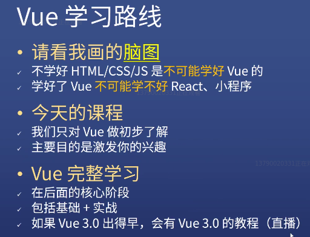

### ◇ Vue 脑图

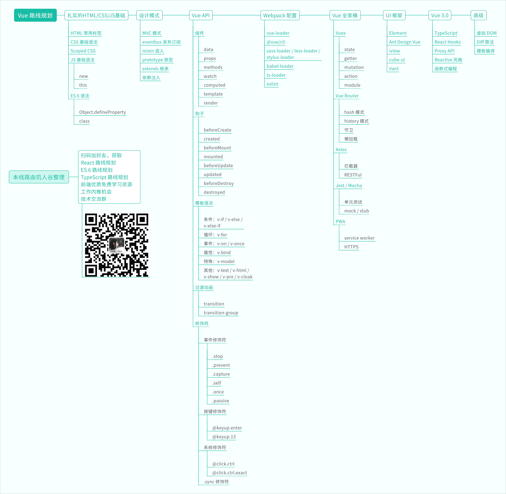

### ◇前置知识

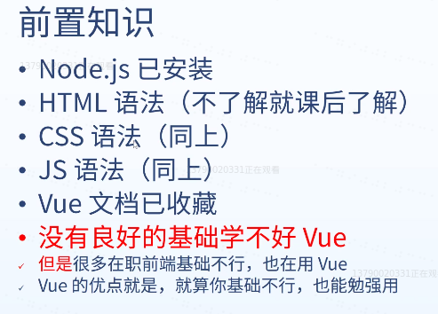

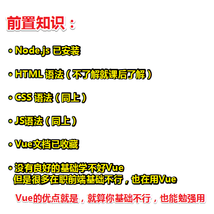

关于看 Vue 文档：

- 有基础教程、深入教程（深入了解组件）、动画教程、工具和工程的教程、规模化的教程……
- 如果你是靠 Vue 吃饭的 ，那么你得从头看到尾，直到看到「深入响应式原理」这一章，不然，你的Vue基础肯定是存在问题的。（==我只看到基础教程之「Class 与 Style 绑定」，但是之前有看视频教程过了一遍基础教程==）

### ◇解释一下 Vue 脑图

> 如果一个高级前端，ta说ta对Vue很了解的话，那么ta就应该知道脑图里边所提到的所有东西

- 扎实的HTML/CSS/JS基础（语法和细节都得很清楚）

  - HTML 常用标签（如知道div、span、p、section等这些标签就可以了，总之这部分内容学起来很快，不重要）
  - CSS 基础语法（也学习很快，大部分满足即可，不需要学得很深入）
  - Scoped CSS （Vue提供的一个特殊的CSS）
  - JS 基础语法（特别去理解 `new`、`this`这两个关键字是啥意思 ）
  - ES 6 语法（除了了解上边默认的ES3或者是ES5语法以外，你还得了解最新的ES6语法，而其中有两个你必须得知道的就是 `Object.defineProperty` 和 `class`）

  反正这一部分是最难的，当然，如果这一部分没有达到要求也是可以看后面的。

- 设计模式

  - MVC
  - 发布订阅
  - 混入
  - 原型
  - 依赖注入

  这些东西必须要了解，如果不了解的话，Vue的文档会教你了解，如混入和依赖注入，直接看Vue提供的示例即可，它会告诉你它们是什么

- Vue API

  - 有27个

  这一部分内容需要你自己去做笔记理解，如data是干嘛的、props是干嘛的……大概写4篇博客即可！需要注意的是千万不要死记硬背哦！因为这真TM多！

- Webpack 配置

  学会Vue文档之后，其实这还不够呀！你还得学Webpack才行，因为现在前端如果你不会webpack的话，那么基本上你什么项目也搭不起来！

  那么对于Webpack我们需要知道什么东西呢？——需要几个loader和几个工具。

  其中vue-loader是最重要的一个loader。

  还有工具则是 `@vue/cli`和 `eslint`

  总之对于这些loader和工具，你都得有个初步的了解，当面试官问到你的时候，你能说出它们的作用以及如何去配置，那么你就能拿到满分了，不然，如果面试官问你「babel-loader怎么用？」，你说不会，那么你就GG了，基本上就是送命题了。

  总之，说白了，对于这些而言，<mark>会使用才是王道，原理倒是可有可无</mark>

- Vue 全家桶

  - Vuex（最重要，需要弄懂5个概念）
  - Vue Router（4个概念）
  - Axios（2个概念）
  - Jest/Mocha（2个概念）
  - PWA （2个概念）

  最后一个PWA不重要，前面4个重要性依次递减。

  以上提到的15个概念，都弄懂了，那么Vue 全家桶你就会用了。

至此，你掌握了从第一个阶段到这第五个阶段的知识，那么你就是Vue的掌握者了，即你已经完全掌握Vue了，即Vue的所有功能你都会了，而这时候你会发现一个神奇的一幕，那就是你不需要去学习算法和数据结构，而这也是前端的一个特点，即前端的框架使用者是不需要学会算法和数据结构的，那么什么时候需要学会算法和数据结构呢？

这得到最后一部分「高级」阶段！

等你走完了前五步，即Vue基本都会了，那么你会发现按钮要自己做、对话框要自己做等等，于是，你就得去用一些UI框架了

- UI框架

  - Element UI
  - Ant Design Vue
  - iview
  - cube-ui（滴滴出的）
  - Vant

  在这5个当中随便选一到两个去了解就可以了。

  来到这一步，你就是一个Vue的快速开发者了，即你开发得特别快，什么东西只要通过组合一下子就能搞定了，说白了，就是生产力特别得高，而这也是Vue风靡的另一个原因！（之前是中文文档对开发者友好）

  总之，一旦你学会Vue它所有配套的全家桶，然后再找一个UI框架，那么你做什么页面都是超快的！

接下来还有两个部分，而这两个部分是给高级前端准备的！那么这有多高级呢？工资20K以上的前端需要去知道的！

- Vue 3.0（目前还未发布）

  - TypeScript（一定要学会，因为Vue3.0使用它把之前的版本给重写了）
  - React Hooks（借鉴了React Hooks的API风格，所以要学它，而学了它之后，你对Vue3.0也会学得更好。一个尴尬的地方是，以前用2.0的人，如果不学React，那么ta可能对新的语法还不如它的敌对方React用得更好！至此，引发了一个争论，有人说不需要借鉴React的，也有人说只要是好的就应该去借鉴。）
  - Proxy API（JS 新出的API）
  - Reactive 风格（这是一种编程风格，可以去了解一下）
  - 函数式编程（了解）

  如果你想要在Vue3.0发布的时候，就马上学会使用它的话，那么你需要先学会以上这个5个东西才行！

  总之，这5个东西，都可以单独作为一个话题去了解它们（搜一些博客、做些总结）。而知道了这5个东西之后，那么  在Vue 3.0发布前，你就学会了Vue 3.0了

- 高级

  - 虚拟DOM
  - Diff算法
  - 模板编译

  什么叫高级，如果你答对这些题，那么你就可以进BAT之类的公司了，以上三个点就是常问点。

  只要这个阶段才会涉及到数据结构和算法，之前的那几个阶段都不会涉及到！

  总之 ，学到Vue 3.0这个阶段，其实你对工资就已经很满意了，而学到后面，就越学越难了

以上，就是对Vue学习的一个大概线路规划了！

总之，就是从基础的，到对设计模式的积累，再到 Vue API 的学习，这3部分，属于初学者要学的；  第四部分是稍微难一点的有关工程化和工具的配置以及使用的知识。

前边4个是入门。

会Vue全家桶就可以找工作了。

而后边3个部分，是涨薪用的方法！

讲完学习路线以后，就来到「动手干」这步了。

注意，千万不要把文档拿到手就先去看，而是可以先尝试着去做一两个小项目来练练手。

## ★动手干

> 通过做一个小项目来让我们对Vue有一个深切的理解！

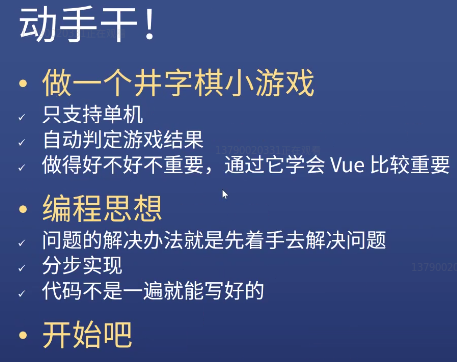

### ◇Vue的读音


> wu：上牙齿咬住下嘴唇

上面读音是正确的，而下面那个则是接地气姿势！

 建议大家遇到读错的，并需要告诉ta纠正过来，毕竟这只是一个习惯的问题 ——习惯把东西分开读！比如说一个应用，中国人习惯叫 「A - P - P」，其实是连起来读的ap

总之，这些习惯无法纠正，中国人喜欢一个字一个字的读，而外国则是连读姿势！

### ◇做什么？

做一个井字棋的小游戏。（小时候在地上常玩的游戏，用根树枝或用手指，在地上（有泥土的）画个井字，然后填入× or √）

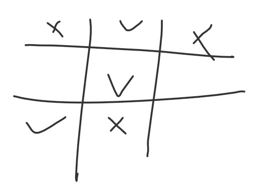

玩法介绍：

三个点连成一线即赢，而且这有必胜的策略——先占角，那么赢得几率就是大于对方的

➹：[井字棋的最优策略竟是先占角！ - 科学人 - 果壳 科技有意思](https://www.guokr.com/article/4754/)

### ◇需求与描述

1. 只支持单击，不支持联机（因为是入门，所以无须搞那么复杂）
2. 自动判定游戏结果（只要× or ○连成一条线，就断定x胜还是○胜）

作为入门者来说，一般来说，做得的一个项目都是做得不好的，但是这其实做得好不好并不重要，重要的是「你在做的过程中，你不停地去查Vue的文档，然后通过文档去理解这个API」

### ◇编程思想

- 尝试去理解芳芳在写的代码过程中用到的一些思想，如「芳芳是如何解决问题的？是如何分步实现这个入门项目的？代码又是怎么一遍遍被芳芳重写改写的？」

> 做完这个项目，再回过头来看吧！

### ◇使用 @vue/cli 创建 vue 项目

1. 创建一个目录 （vue-demo-1），使用vscode打开

2. 如何初始化这个目录？——使用Vue官方提供的一个小工具 vue-cli，而不是parcel、webpack……

3. 找到vue-cli的官网，直接CRM大法（安装「`yarn global add @vue/cli`」以及测试安装是否成功 `vue --version`）

4. 在当前目录创建 `vue create .`，而不是创建一个新的目录 `vue create hello-world`

   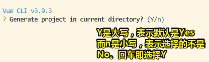

   回车后，不要自动选择eslint，因为它很烦，会阻碍你入门。

   因此，我们选择第二个，即手动选择各种特性（上下移动选项，空格表示选中），我们只要Babel即可，其它的都不要，即便功能少，但对于初学者而言，学起来更方便。

   再摁回车。接下来会提示你，是用分开的配置的文件，还是把所有的配置文件写到package.json里边（选择它推荐的，即直接回车即可）

   接着又问你「是否保存刚才的选择，以备你之后的项目用？」——选择no

   接着又问「你是打算用yarn还是npm？」——显然是yarn啦！这是芳芳的经验之谈，没有为什么。（如果没有装yarn或npm是不会让你选择的，总之这是需要检测到，检测到有二者，就让选择！）

   全部选完后，它就会去安装一些需要用到的工具

   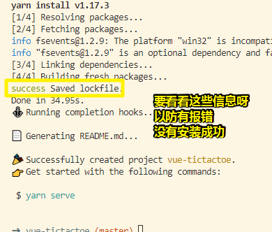

   安装成功后多了很多目录和文件。

5. vue/cli也行相比parcel没有那么智能，但是它的功能是更强大的

以上就是用vue/cli创建一个vue项目的姿势了。

接下来根据安装成功后的提示：

1. 启动http服务：`yarn serve`

   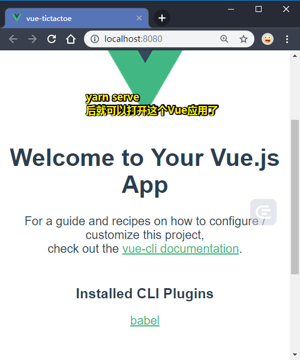

小结：

1. 用到了哪些命令：
   1.  `yarn global add @vue/cli`（默写下来，就像是小学时背古诗默写古诗一样，写个十几遍就好了），这个操作让我们的终端有了 `vue`这个命令
   2.  `vue create hello-world`：如果没有创建项目那就用这个，如果已经有个目录那就用 `vue create .`呗
   3.  `yarn serve`：运行这个命令来开始开发，即所谓的实时预览
2. 如果没有装`yarn`，可以改成是`npm`。但我还是非常推荐你装一下 `yarn`，当然，也有可能过几年 `yarn`也不流行了。毕竟，目前的前端变化时真得快呀！总之以后哪个流行还是得用哪个！（铁打的前端，流水的工具）
3. 接下来就开始写代码了！

➹：[介绍 - Vue CLI](https://cli.vuejs.org/zh/guide/#cli-%E6%9C%8D%E5%8A%A1)

## ★ Vue 组件

### ◇如何写代码？

CRM大法

在用vue/cli创建一个vue项目的过程中，无疑是用到了CR姿势，那么接下来就是M了。

而这个M就需要芳芳指导了。

1. 先去看src目录，打开main.js（为啥要先看这个文件呢？因为JS里边有一些不成文的规定，如HTML的第一个文件一定是index.html，同理就是style.css、main.js or app.js，反正这几个文件都是需要你首先要看的，而Vue也是遵守这个规定的）

2. 分析main.js这个文件，如：

   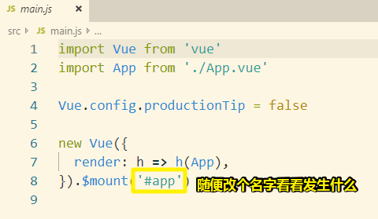

   而这就是M了。

   > `App`这个组件的template，是会替换挂载点的，这就是为啥App.vue的root元素会有个 `id="#app"`的缘故了：
   >
   > 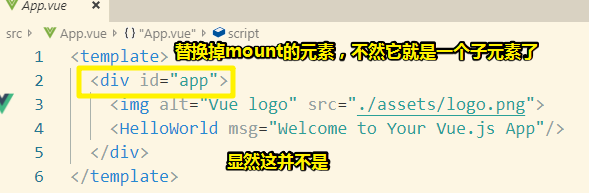

以上就是CRM的M的好处了，可以让你在不知道任何东西的情况下，去学会改代码！

接下来分析，为啥页面会显示内容？——显然这是来自于 `App.vue`这个文件

打开这个文件，会提示你装个 Vetur 的插件，可以让这个文件高亮、语法提示等等。

接着，就是对这个文件，进行删除、修改、添加等操作了，于是分析得出 `template`就是我们写的HTML内容，`script`就是我们写的JavaScript，`style`就是我们写的CSS

而它们的顺序可以随意，但是有一个不成文的规定就是先 `template`、接着是`script`、最后是 `style`，反正这样写就是有好处的，至于什么好处，你换个乱得顺序写多了，就知道了。

如果你不知道哪些目录和文件是可以被删掉的，那么那就直接分析删掉呗！反正之后可以创建回来。

- 删掉assets和components目录，反正可以从垃圾回收站回收

### ◇没有思路？

你叫我做一个这样的井字棋？

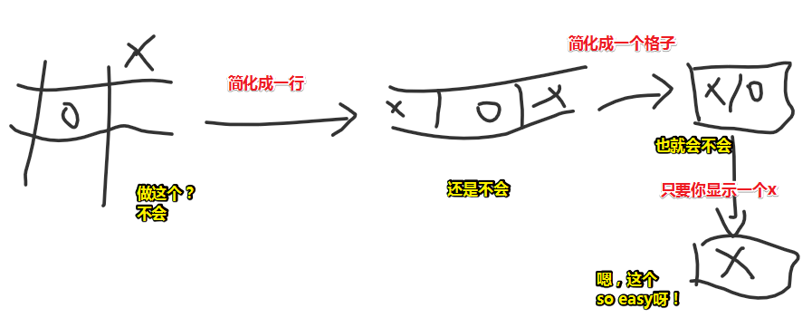

> 图中你会做的那一步是最简化的需求了，如果还不会做，那就去补一些基础知识了。

当你拿到一个复杂的东西的时候，你需要做的是能不能简化、再简化这个东西到自己会做为止？

那么之后，就是不停地加东西就好了。

### ◇点击一个div，变成一个×

如何点一下就出现一个东西？——不知道

那就先让它出现一个东西吧！ ——`<div>×</div>`

如何让它没有呢？——有关 `if……else`，直接抄Vue官网给出的代码

```vue
  <div id="app">
    <div v-if="true">x</div>
    <div v-else>○</div>
  </div>
```

让数据是动态的？——使用data（对象值 or 一个函数值）

点击一下就变？——使用事件监听

默认是空的，点击一下空就显示`×`

```vue
<template>
  <div id="app">
    <div v-if="a">x</div>
    <div v-else v-on:click="a = true" >空</div>
  </div>
</template>

<script>

export default {
  name: 'app',
  data() {
    return {
      a: false
    }
  }

}
</script>
```

不想出现多余的div？——使用template标签，需要注意的是，template标签上不能绑定事件，毕竟渲染到页面的元素就已经消失了，即无法点击。当然，你是可以加 `v-if`和 `v-else`的

```vue
<template>
  <div class="cell" v-on:click="a = true">
    <template v-if="a">x</template>
    <template v-else></template>
  </div>
</template>
```

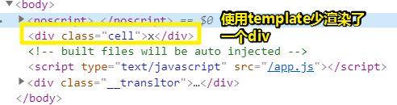

给上一定的样式，发现字体不居中：

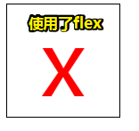

这是字体设计的问题，可以搞两个div交叉起来居中

总之，之所以没有居中是因为CSS没写好的缘故，还有字体设计这个不可变的因素的缘故。

当然你也可以这样写死（依赖元素的宽高以及字体大小）：

```css
box-sizing: border-box;
padding-bottom: 20px;
```

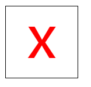

目前，只搞了一个div。照理说，我们应该从后往前逐渐加东西的，但是我们在这里直接就打算搞9个div出来：

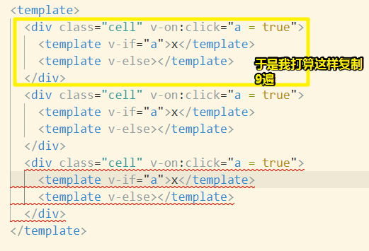

结果报错了，因为：

> The template root requires exactly one element.eslint-plugin-vue

在Vue里边说到了，template里边只能由一个root元素，而图中出现了3个root元素，所以我们需要把它们三个给包裹住，这样就不会报错了。

```vue
<template>
  <div>
    <div class="cell" v-on:click="a = true">
      <template v-if="a">x</template>
      <template v-else></template>
    </div>
    <div class="cell" v-on:click="a = true">
      <template v-if="a">x</template>
      <template v-else></template>
    </div>
    <div class="cell" v-on:click="a = true">
      <template v-if="a">x</template>
      <template v-else></template>
    </div>
  </div>
</template>
```

总之，只能写一个root元素是Vue这个框架的规定呀！

可是，即便添加了root元素，还是出现了一个我们不需要的结果：

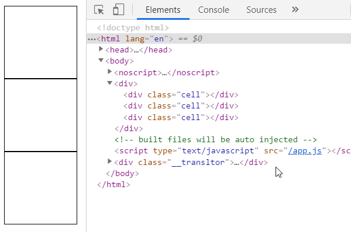

那就是为啥点一下，这三兄弟都变`×`了？

其实，这个用脚趾头想也只知道啊！——这3个cell都监听了click事件，但是它们都依赖着data里边的a属性，任意一个cell被点击了，这个a属性值都会被改变，于是这3个cell就都显示了。

所以，有啥办法可以让它们三都是独立的呢？

一种傻逼办法：

- 搞三个属性呗，如a1、a2、a3，可是假如有100个cell呢？（虽然最终是9个），那岂不是这个data对象有100个这样意义一样的属性？或许你会用数组，但template里边还是的要 `a[0]/a[1]……`这样

  ```vue
  <template>
    <div>
      <div class="cell" v-on:click="a[0] = true">
        <template v-if="a[0]">x</template>
        <template v-else></template>
      </div>
      <div class="cell" v-on:click="a[1] = true">
        <template v-if="a[1]">x</template>
        <template v-else></template>
      </div>
      <div class="cell" v-on:click="a[2] = true">
        <template v-if="true">x</template>
        <template v-else></template>
      </div>
    </div>
  </template>
  
  <script>
  export default {
    name: "app",
    data() {
      return {
        a: [false,false,false]
      };
    }
  };
  </script>
  ```

  我测试了一下这种姿势，结果发现但我点击cell的时候，数组a的元素值是有发生变化的，但是cell元素就没有响应式的渲染x了。

  官方给出的vue的[数据响应原理](https://cn.vuejs.org/v2/guide/list.html#%E6%B3%A8%E6%84%8F%E4%BA%8B%E9%A1%B9)：直接给数组某元素赋值 和 通过length改变数组长度都是不能触发setter从而触发视图更新的。

  所以我们不能这样赋值：`v-on:click="a[0] = true"`

  而是这样：`Vue.set(this.a, 0, true)`，详情看：[③](#san)

另一种先进性姿势：

- 组件化，这可是体现了Vue的先进性呀！

简而言就是，把一个 Cell div 做成是个组件。

于是就创建了一个 `Cell.vue`，一般来说是大写比较好，用于告诉他人这是个组件，不过写小写也没事哈！

那么这个Cell组件的功能是啥呢？——就是我们刚刚实现的功能。

组件搞好之后，就是在App.vue里边使用了它，使用它的姿势也很简单：

1. 导入Cell组件， `import Cell from './Cell.vue'`

2. 注册为App.vue的局部组件 ：

   ```js
   export default {
     name: "app",
     components: {
       Cell, //这个语法很奇怪，这是ES6的新语法哈！
     }
   
   };
   ```

> 可以直接使用自闭合标签 `<Cell />`

至此，就可以实现与第一种傻逼姿势那样的效果了。

而这就是组件化啦！即把一个功能做成是一个组件，然后这个组件就是独立的，如果需要用到多个组件，那就引用多次呗，总之每个组件之间互相没有关系哈！

所以每个Cell都有一个自己的a，即你点这个Cell，另外一个Cell的a不会随着变化。

> 注意，可以这样来 `import Cell from './Cell'` ，`Cell.vue`的 `.vue`可以省略掉，因为Webpack有个配置，可以自动的按某个顺序去找
>
> 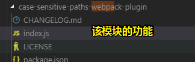
>
> 反正，加不加都行，总之优先找 `.vue`文件，接着是 `.js`，最后是 `.json`，反正这是有顺序的找的。

### ◇搞9个div

- 用到了flex布局，一行即是一个flex容器


按照芳芳的经验来说，一个新人用JavaScript而不是Vue来写这个是相当之难的，因为如何隔绝两个组件之间的变化是件麻烦事，如使用9个变量，控制着9个Cell，而且还得用上面向对象，组件通信等知识，总之，使用了Vue的组件姿势就可以让我们很简单的就能做到了，

### ◇点×之后，得是○才行

老是×的话，就没法玩了

所以如何让x是一个可变的东西呢？——搞个text属性 `text: 'x'`，template里边的`x`值是文本插值姿势 `{{text}}`

既然，x是可变的了，可是如何随着用户点击的不同次数而让text的值为 `○` or `x`呢？——这是这个项目最复杂的地方，而其它部分，倒是很简单。

---

## ★Vue 组件通信

### ◇一些疑问

1. 为什么一个Cell就一个文件就可以展示点和不点两种状态呢？——因为每一个文件都有一个data，即每一个文件都有个a和text。所以当我们点第一个Cell的时候，是第一个a变成true，点第二个Cell，则是第二个a变成true……如此类推，而这就是组件化的好处了，它可以复制自己，说白了就是有分身，每个 `<Cell />`都是用了相同的代码，但是它们其实是不同的对象。

   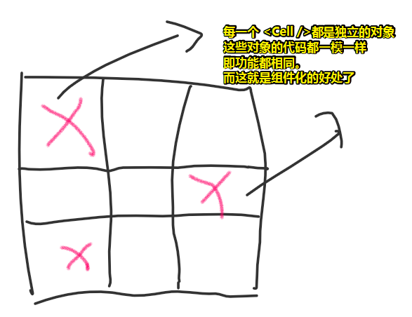

2. 有人问「能否加个按钮，来判断下一次点是○还是x？」——不需要加按钮啊，直接根据点击的顺序来即可！

3. 能实现在线游戏吗？就是用户加入两人房间，然后各自点击，进行真实对战—-需要后台支持，学了nodejs就行，你把游戏地址发给好友，你点一下，好友收到信息，好友点一下，你收到信息，当然棋盘上的逻辑是差不多的，只不过信息的传递上是不一样的。

4. 没有yarn就用npm，只不过yarn相较于npm来说，要好用一点点。

### ◇如何让Cell知道每次该显示什么？（一次×一次○）

> 简单来说就是怎么让组件知道自己该显示什么

- 根据自己已有的基础，自己搞了一遍：

  - 用到了eventBus
  - 让9个Cell实例，都监听同一个xx事件，然后各自都维护一个属于自己的callback，而该callback可以维护自己当前实例的状态。

  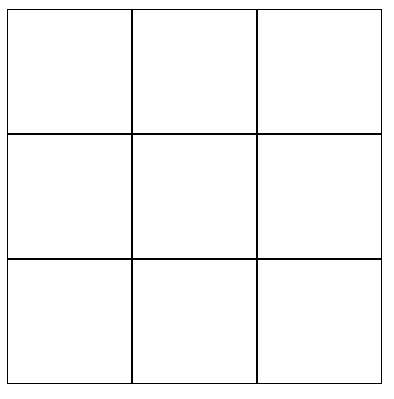

  - 哪个组件实例先监听了xxx事件，那么它的callback就会先执行。因为，根据事件中心的原理，有个数组专门是用于来存储各个实例传过来的callback，如父组件App和9个Cell都监听了xxx事件，那么就会有10个callback push到eventBus的某个专门用来存储callback的数组变量，谁先执行监听，那么就谁先push到该数组里边。

    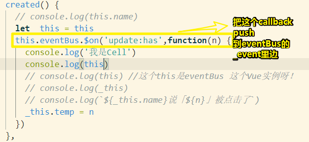

    this的结果：

    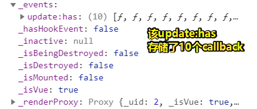

- 接下来就看看芳芳是如何针对入门者讲解组件通信的？

想象一下，有这么一个场景：

1. 你（体育委员），面前站着9个学生，让他们报数12121……

   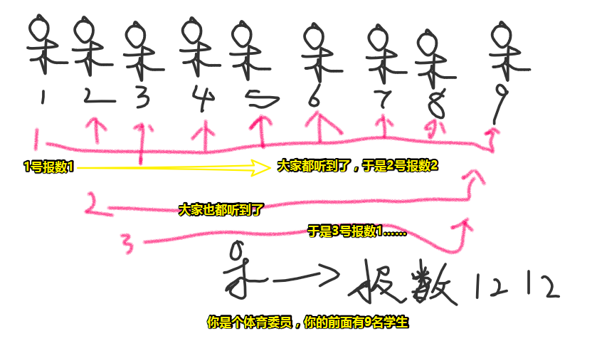

   人类可以通过空气这个介质传递声音（或者可以通过肢体动作报数），可两个Cell之间是没有传递的通道的，即没有传递的介质

   所以咋办呢？

<mark>当你在写代码的时候，如果你遇到问题，你应该求助于日常生活，你需要想象出一个场景，而这个场景需要跟你目前所面临的场景非常像，然后你就想作为人类是如何解决现实中所面对的问题的，然后你就把这个东西模拟到代码里边，而这就是代码对于人类生活的抽象，总之，这叫做求助于生活</mark>，如

假设每个学生都被板子给隔绝掉，就它们之间听不到对方的声音，也看不到对方，那么如何才能让他们报出准确的书呢？——我们知道，他们都能看到体育委员，所可以通过体育委员告诉这9名学生该报什么数

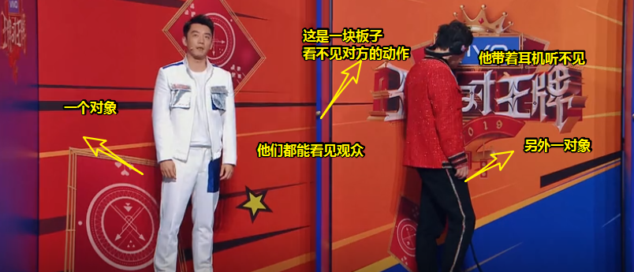

而我们的App，就可以充当像体育委员这样的角色了

开搞：（外面指的是App.vue的template里边的 `<Cell />`标签，而里面指的是 我们构造的`Cell.vue`组件里边的内容）

1. 如何知道xxx学生报了一个数字？——体育委员需要监听9个同学，xx同学报数，得通知体育委员「我报了个数字1」，代码实现思路：App.vue的template的Cell标签上写上监听事件，而Cell组件里边得触发App.vue监听的事件
2. 两种配套姿势（缺少其中一样都不行，不过，写在Cell标签身上的属性有个别属性是例外的，如 `class`、`style`等）：
   1. 在Cell标签上监听了事件，那么Cell组件里边得通过原生事件（如 `click`事件）间接触发 `emit`事件
   2. 在Cell标签上写上了属性，那么Cell组件里边得写上`props`选项

可见有了生活中的例子之后，理解这代码实现简直是手到擒来的事……

如果没有例子，就觉得，这代码TM怎么这么抽象啊！

很多人之所以学不会编程就是理解不了抽象，但是不是所有人都能理解抽象的

那么什么是抽象呢？——你在高中时，有9门功课需要同步学，其中数学这门课是极其抽象的，如线性代数等，这种抽象有50%的人是理解不了的，所以很多人的数学成绩是怎么学都提高不了的，而这就是因为这太抽象了，那么难道这辈子就学不会数学了吗？——很简单，你只需要把抽象的东西变成是具体的东西就好了，毕竟人类很容易理解具体的东西，而抽象的东西是很难理解的。

> 我高中物理是真得菜的抠脚，考过8分。而且一直都学不好，不管怎么努力。
>
> 我看了一个答案说到，是因为生活阅历太少的缘故、还有诸如出现知识断层的缘故
>
> 我还记得第一次坐车到县城里读高中时，我居然不知道有需要买票这种操作……然后人生的第一次逃票就这样发生了……
>
> ➹：[为什么有些人学不好物理？ - 知乎](https://www.zhihu.com/question/30488725)

3. 接下来text的值得是根据传过来的n属性确定的，所以需要用到计算属性，然而GG了（点一次9个都得随着变化），于是这种方案直接×掉。（芳芳写代码是非常简单的，随便想一个方法去用，用之后发现不能用，那就删掉呗，然后再想）

4. 不使用计算属性，而是通过click事件去改变：

   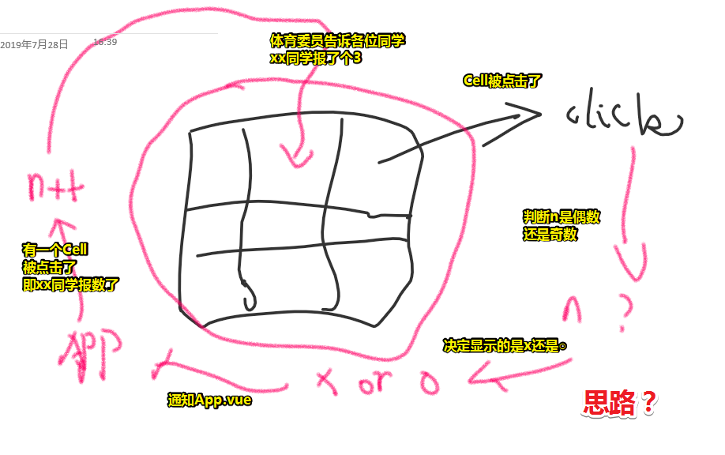

5. 解决重复点的bug——text的初始值为空字符串即可

接下来看看，如何判断用户是否赢了？目前只做到 了能填○和×，但是不能知道赢没赢！

总之，我们目前实现了，依照顺序，下一个格子该填×还是○的功能。

---

## ★判断玩家胜利

> 满足某个条件，就能说谁赢了

- 注意点

  - `@click="onClickCell(0)"`里边可以加其它参数，这其实是一个语法糖，正确姿势是 `@click="() => onClickCell(0)"`，注意 `onClickCell(0)`不会直接调用，它会等 `click`事件触发后，才会调用，不要认为看到了 `xxx()`这种姿势，这个xxx就会马上被调用

  - 子组件可以传参数给父组件，父组件： `@click="onClickCell(0,$event)`；子组件：`this.$emit("click",this.text)`，注意这也是成对出现的。 `$event`的值就是 `this.text`的值，如果你这样 `@click="onClickCell(0,null,$event)`，那么 `this.text`的值就是第三个参数的值，说白了 `$event`就是个占位符，用于接受子组件传过来的值。

    如果 `@click`不是自定义事件，而是原生的`click`事件（说白了用再原生标签上），那么特殊变量 `$event`就是原生DOM事件对象。

    总之 `$event`就是一个用于接收 `$emit()`里边的数据的这么一个特殊变量

    对了，如果你不喜欢这种写法，我建议你去学react，反正选择Vue或者React是喜欢与不喜欢的问题

  - 可以用循环生成 `<Cell />`标签，这样就不用写那么多次的自定义属性和自定义事件了。

  - 这节课虽然叫Vue入门，但是几乎覆盖了Vue的所有内容

  - 在处理map的时候，需要用到 `Math.floor()`这个API，如 `this.map[Math.floor(i/3)][i%3]= text`

  - 一个技巧：

    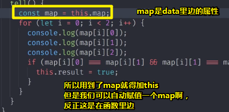

- 思路

  - 谁能判断谁赢？Cell吗？——它不能与其它Cell通信，它们看见对方，也听不见对方。所以只有一种判断可能，那就是体育委员能看到每个Cell，即能判断谁输谁赢！

  - 那么体委该如何判断呢？——直接是无法判断的，因为App不知道目前点击的是哪个Cell，更不用说它的内容是`×`还是`○`了

    - 给每个Cell编一个号，让App知道哪个Cell被点击了
    - 确定被点击的Cell的内容，Cell的内容是组件自己根据n的值去推测的，而App是不知道的，所以Cell组价需要告诉App我这个Cell的内容是×还是○

  - 记忆点了哪个Cell以及其里边的内容是啥？——使用二维数组来记忆（`map`）。然后把它放在data 里边吧！当然，你也可以放到其它地方去。（`[[1,2,3],[4,5,6],[7,8,9]]`，一维是行，二维是列，所以这是3行3列9宫格）

  - 根据二维数组这个数据结构，设计算法让点击哪个Cell以及对应的内容给push进去。使用不完全归纳法，即举几个例子推出之后的都是如此，如点了第0个Cell，那就把它放到 `map[0][0]`，同理 2 即是 `map[0][1]`……8即是 `map[2][2]`（以0作为计数的起点）

    可以理解成这样：

    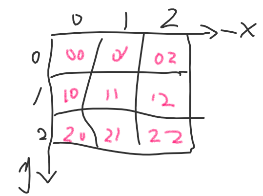

  - 代码实现map值的抽象化：（不然就是繁琐姿势赋值 `x`还是 `o`了）

    - 一维：click哪个格子与行数是倍数关系，即0是3的几倍？4是3几倍？7是3的几倍？
    - 二维：click哪个格子与行数是余数关系，0%3为0，1%3为1……（余数计算规则一：一个数除以另一个数，要是比另一个数小的话，商为0，**余数**就是它自己。）

  - 确定代码的效果：直接在页面用文本插件打出来就好了，反正数据是响应式的，即你点击一个Cell，二维数组的结果也会随着显示

  - 有了有相应值的map，那么这有啥用呢？——可以单纯的直接用数学上的判断胜负，即如果……那么……于是，写了个tell函数，表示说出结果，或判断结果

    - 先来机械化的横向判断：注意JS不能连等，而是用 `&&`，还有别忘了，不能是一行3个null情况，即只要一个Cell不是null值就好了。
    - 竖向搞一遍
    - 对角线搞一遍

    还有更简单的写法，但是为了照顾新人，最好还是让代码一目了然。

  - 还能优化？——赢了就不能点了，不过日常生活中，赢了，你还是能继续 `x` or `o`的。

  - 告诉谁赢了？——让结果等于 `map[i][0]`之类的就好了。

  - 阻止继续下棋？——很简单。写个声明做个标记 `finished`，然后把这个标记传给所有的Cell，如果标记为true，那么点了Cell就直接return了。所以这个标记，可以作为props传给Cell组件。

- 小结

  - 判断棋盘胜利：

    1. 声明一个map，它是一个二维数组（3*3）
    2. 获取用户点击的序号i，以及内容
    3. 把内容填到map对应的格子里边
    4. 怎么填？——需要自己设计算法，主要用到了倍数关系（i与3的一维）、余数关系（i与3的二维）
    5. 调用tell函数判断谁胜谁负

    以上就是原理和实现过程了。接下来就是优化这个棋盘。。。

## ★样式优化

> 代码优化就不搞了，就搞一下样式优化

- 样式优化

  - 简单搞个居中就好了（使用flex）
  - 棋盘上边显示第几手
  - 棋盘下边显示目前胜负状况

- 小结

  - 这是一个最简单的井字棋了，毕竟没有写多少JavaScript和CSS，而且判断胜负的逻辑也很粗暴，当然，你可以去优化它！
  - 通过这个井字棋，我们学会了很多Vue的特征：
    1. 绑定事件
    2. `$event`的传参
    3. `props`、`data`、`methods`、`computed`……
    4. `v-if`、`v-else`
    5. 如果打算去优化可以使用 `v-for`，直接根据定义好的 `map`变量去生成棋盘，毕竟这跟棋盘有一一对应的关系

  - 愿你能通过做这个小游戏，能对Vue产生兴趣

  - 接下来干啥？——部署到github上去

    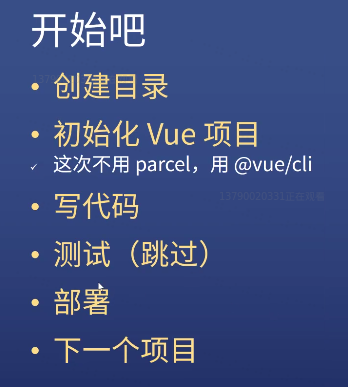

    之后就是开始下一个项目了

- 重点

  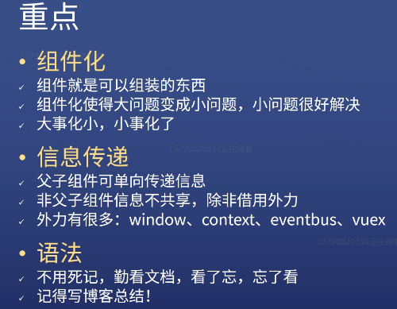

  - 组件化？——组件啥意思？编程领域的「件」可以理解成东西、物件。如组件（可组装的东西）、硬件（硬东西）、软件（软东西）、中间件（中间的东西）。通过大白话解释，你会发现这些词语都好傻，就相当于是啥也没说，毕竟你没有告诉我这有啥用。总之，它们都是抽象的概念，只要符合xx，那就是yy，如你放在中间的东西，那么就可以叫做中间件，它们并没有特殊的含义，仅仅就是一个东西有了不同的外延就有了不同的概念，就像是都是车，但有火车、单车……总之，组件是东西的外延，中间件也是东西的外延，但它们或多或少都有各自独一无二的特征存在，如组件就是可组装的、中间件就是放到中间的……

  - 组件化就是把一个东西变成可组装的东西，如Cell组件，，没用Cell组件之前，一堆的div，用了之后，一个Cell组件就有完整的功能，然后把一个个Cell当成是一个功能强大的DOM来使用。

    从这个角度来看，组件里边的HTML，可以看做是构成这个组件的最小粒度单元。而我们使用组件化思维开发页面，那么组件就是一个页面的最小粒度单元了。

  -  本来做个棋盘，发现做不了，于是就做个格子，格子做好了，就把格子合起来，而这样棋盘也就出来了。

  - 信息传递：Cell和Cell之间是不能信息传递的，但是Cell和App之间是可以信息传递的，因为它们是父子关系呀！如单向传递使用props，然而Cell是无法传数据给App的，只能通过`$emit`往上传一个事件才行，不能直接传一个值；如果不是父子关系的组件，想要共享信息，那么可以使用外力，如eventbus、vuex。还可以把App这个父组件作为外力，如一个Cell把信息传给App，然后App把这个Cell传给另一个Cell。

  - Vue的语法特别多，不需要去死记， 写项目时去看文档就好了，不断地在忘和看之间徘徊。对了，一个项目写完了之后，你要用博客总结一下才行，或者发到github上，这样面试官问你的时候，直接把链接甩到他脸上去即可！总之，面试官问你这个API是干嘛的，而你忘记了，那么你就把博客甩给他，只要该博客是你写的就ok了。

## ★总结

> 总结一下目前对Vue使用，给了我们一些什么样的启发

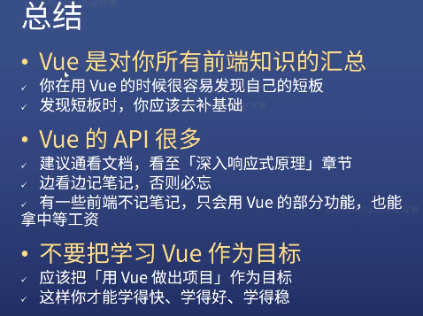

- 什么不会补什么，如使用Vue你会发现需要用到HTML、CSS、以及ES6的高级语法

- 芳芳见过一个工资挺高的前端，只会用组件，不会用什么filter、指令什么的，一样拿高工资。

- 芳芳要求很高，希望你能把所有东西都看了，但是你能记住50%，那么你其实就可以去找工作了。

- 这是芳芳的一个学习体会：

  如果你把学习Vue作为目标的话，那么你什么也做不好，你应该把用 Vue 做出一个项目作为目标，如井字棋，做出来之后，就发到github上呗！而这，你就可以比其它人学得更快，而且更好，更稳。

  反正就是去做一个东西，如你做完了井字棋，那就五子棋呗、象棋等，只在做棋这方面，你就得做很深了，对了，建议你不要做围棋，因为判断谁赢谁输很难呀！

-  对Vue一个夸奖：

  

  如果你能把Vue用得很好，摸清它的设计思路，那么这会对你有很大的帮助。

- 下一节看React入门，对于芳芳来说，这些东西都差不多，芳芳所有的学习方法都是CRM，即抄、运行、改，再抄、运行、再改，改的过程中不懂，再看文档，而通过这样的学习姿势，你可以很快的学习任何框架

  > 我可没有这样的功力，我得有一定基础认识才行。

## ★部署到GitHub

- 做法：

  1. 创建一个仓库

  2. 可以上传文件，也可以直接上传已存在的git仓库

  3. 整个项目上传上去后是无法使用的，毕竟我们之前需要 `yarn serve`才能访问，为了能够预览，我们需要在本地 `yarn build`一下，即打包一下，一般都是把dist作为部署目录的

     ➹：[部署 - Vue CLI](https://cli.vuejs.org/zh/guide/deployment.html#github-pages)

  4. 根据部署操作，需要创建一个 `vue.config.js`文件，不然部署上去是无法访问的：

     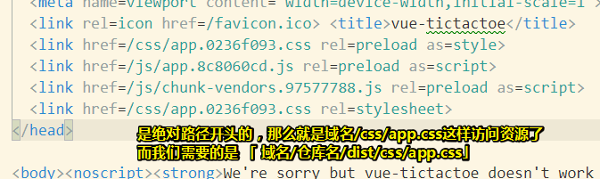

     所以这个配置文件，就是用于添加 `仓库名/dist/`这个路径前缀的

  5. 怎么配置  `vue.config.js`文件？

     1. 在根目录创建它

     2. 内容是啥？——直接抄：

        ```js
        module.exports = {
          publicPath: process.env.NODE_ENV === 'production'
            ? '/my-project/' //默认是生产环境用的，即部署时用的
            : '/' //这个则是默认测试时用的
        }
        ```

        那么怎么改呢？——缺啥补啥

        ```js
        module.exports = {
          publicPath: process.env.NODE_ENV === 'production'
            ? '/vue-tictactoe/dist/' //有dist就加dist，没有那就算了
            : '/'
        }
        ```

     3. 重新build，检查看看dist目录下的index.html结果：

        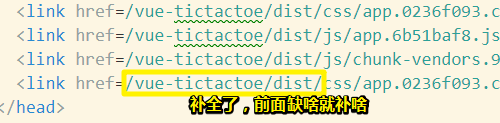

     4. 使用脚本 `deploy.sh`部署：（在根目录下创建该文件）

        ```bash
        #!/usr/bin/env sh
        
        # 当发生错误时中止脚本
        set -e
        
        # 构建
        yarn build
        
        # cd 到构建输出的目录下 
        cd dist
        
        # 部署到自定义域域名
        # echo 'www.example.com' > CNAME
        
        git init
        git add -A
        git commit -m 'deploy'
        
        # 部署到 https://<USERNAME>.github.io/<REPO>
        git push -f git@github.com:ppambler/vue-tictactoe.git master:gh-pages
        
        cd -
        ```

        使用脚本部署，不需要 加`dist/`了。因为我们是把dist目录下的内容上传到 `gh-pages`里边去了。

        预览：[vue-tictactoe](https://ppambler.github.io/vue-tictactoe/index.html)

- 注意点：

  - 如果路径配置都对了，而页面还是没有出来，那么你得留意这是不是资源的缓存问题，毕竟两次提交之间的短时间内是有缓存的，所以可以禁掉缓存或者 `C+f5`
  - 做得任何一个项目都得在手机上看一下，因为现在是一个手机时代，我们平时上网都是用手机上的，而面试官也是用手机上的，如果面试官发现在手机上看有问题，那么肯定就不会继续往电脑上看了。
  - 有人喜欢不加 `index.html`，但其实加上比较好！尤其是部署到github上，因为不加上的话，那么访问的就是 `README`的HTML版了。

- 小结部署过程：

  1. 创建 `vue.config.js`（加路径前缀）和 `deploy.sh`（自动部署）

  2.  `yarn bulid`会产生一个dist目录，即 `distribution`发行之意，即把我的代码发行一次，其中 `dist/`里边的代码会根据 `vue.config.js`里边的配置进行一下路径的配置

  3. dist目录下的内容可以放到任何一个地方去，如github上、后台的服务器……反正这个目录里边的东西是一个完整可用的网站

  4. 用户体验：在仓库地址，写上预览地址，这样他人在看这个项目的时候就会直接打开这个预览地址，看到项目的运行情况了。

     总之你得考虑他人的行为：访问仓库地址，看到预览地址4个字就会点击链接跳转、打开网站后第一眼看到的是啥内容、看到之后又会点击什么、然后点击之后又会得到什么……

以上就是一个把Vue产生的代码部署的到github的过程了。

## ★总结

- 另外一种学习姿势：

  - 抄一遍
  - 改思路，那么代码逻辑也要改
  - 或者思路不变，用另外一种写法
  - 或者不断优化代码……添加功能……
  - 把通用思路抽离出来并总结之，让该思路不局限于该组件、方法，Vue，甚至是编程语言（可以认为是苹果到水果的抽象归纳）

  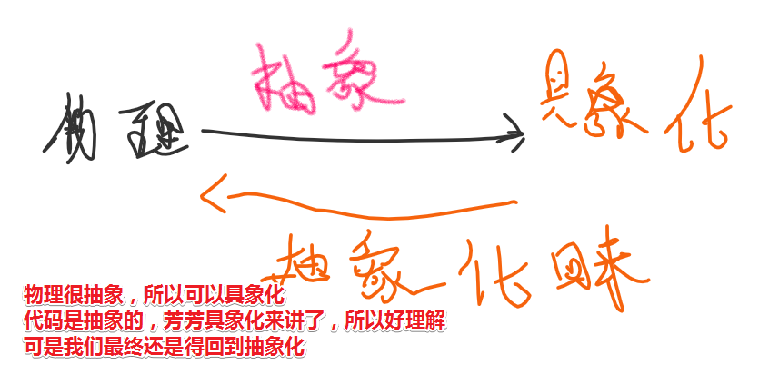

  总之不好理解，那就具象化；不过之后，你还得回过头来抽象化！

- 看懂代码，和自己徒手写一次，是两回事，有些人一直在说在看源码什么的，有种你TM的就手撸一个出来。

  在我看来即便你能看懂，但是过几天你TM又会忘记掉，除非你能把你从源码当中里边学到的知识应用到日常写代码中去，否则都是扯淡！

  对了，话又说来，我到底何时才能做到心中无语言啊！或许一辈子的做不到……

- 定义一个组件，其内边的选项参数什么的可以当做是这个组件的内涵，而我们注册的有一个个组件实例什么的可以当作是该组件的一个个外延。

- `cd -`：返回进入此目录之前所在的目录

  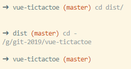

  

  


## ★Q&A

### ①高亮markdown语法？

> 引子：==使用Typora是能看到背景色为黄色的，但是在github pages上浏览是看不见的==

文字样式：

```html
<font face="黑体">我是黑体字</font>
<font face="微软雅黑">我是微软雅黑</font>
<font face="STCAIYUN">我是华文彩云</font>
<font color=#0099ff size=3 face="黑体">color=#0099ff size=3 face="黑体"</font>
<font color=#00ffff size=4>color=#00ffff size=4</font>
<font color=gray size=5>color=gray size=5</font>
```

效果：


<font face="黑体">我是黑体字</font>

<font face="微软雅黑">我是微软雅黑</font>

<font face="STCAIYUN">我是华文彩云</font>

<font color=#0099ff size=3 face="黑体">color=#0099ff size=3 face="黑体"</font>

<font color=#00ffff size=4>color=#00ffff size=4</font>

<font color=gray size=5>color=gray size=5</font>


黄色高亮：

```html
<mark>我的背景底色为黄色</mark>
```

<mark>我的背景底色为黄色</mark>

按照自己的习惯封装一下：

```html
<font color=Tomato size=4>Tomato色的文字</font>
<mark bgcolor=Tomato>Tomato</mark>
```


<font color=Tomato size=4>Tomato色的文字</font>


<mark bgcolor=Tomato>Tomato</mark>


关于bgcolor这个属性不起作用呀！于是这样来：


```html
<table><tr><td bgcolor=Tomato>背景色是Tomato</td></tr></table>
```


<table><tr><td bgcolor=Tomato>背景色是Tomato</td></tr></table>

不够一般用 `<mark></mark>`就足够了。

接下来就是使用搜狗输入法的 <mark>自定义短语设置</mark>了：


<mark>我的天呀</mark>


<font color=Tomato size=4>我的天呀</font>


<mark> </mark>

<font color=Tomato size=4>Hello World！</font>

可见，在Github pages上浏览，只有 `<mark></mark>`是起作用的。

➹：[CSDN-markdown 文字样式设置（字体, 大小, 颜色, 高亮底色） - 走过的都是未来 - CSDN博客](https://blog.csdn.net/thither_shore/article/details/52181464)

### ②判断本地有没有安装yarn？

1. `yarn --version`

发现没有，于是安装它：`scoop install yarn`

安装的是 `1.17.3`稳定最新版

我之前用npm全局安装了vue-cli：

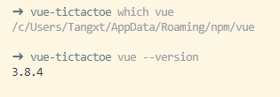

芳芳视频里是用yarn安装的vue-cli，版本是 `3.9.2`。（我早想不用npm作为包管理器，因为当你需要在npm上发布包的时候，需要把淘宝源的设置给注释掉： `//registry=https://registry.npm.taobao.org/`（`~/.npmrc`） ）

于是我全局卸载了 npm 姿势安装的vue-cli：`npm uninstall vue-cli -g`

然而却没有删掉，即便我用管理员权限打开终端卸载它也无用！

就这样，我开始了搜索之旅：

➹：[am unable to uninstall vue cli · Issue #1241 · vuejs/vue-cli](https://github.com/vuejs/vue-cli/issues/1241)

这删除姿势是这样的：`npm uninstall -g @vue/cli`

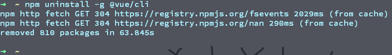

而它删除的内容：

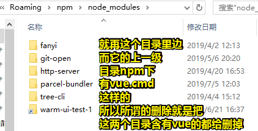

难道vue-cli官网是错的？

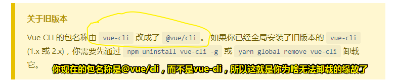

因此你这样安装的：

```bash
npm install -g @vue/cli
```

那么卸载就是这样的：

```bash
npm uninstall -g @vue/cli
```

没办法，谁叫自己没有用过 `vue 2.x`的vue-cli呢？

那接下来就用yarn安装吧：

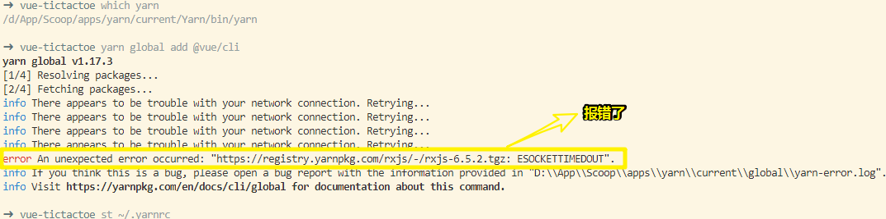

根据这个 ： [rxjs-compat-6.2.2.tgz: ESOCKETTIMEDOUT · Issue #6115 · yarnpkg/yarn](https://github.com/yarnpkg/yarn/issues/6115)

于 `.yarnrc`里边配置一下即可（ `code -r ~/.yarnrc` ）：

```
network-timeout 600000
```

> 600000ms = 10min

这下终于可以了：


芳芳的是3.9.2版，我们安装的时候，可以指定版本号安装：

```bash
yarn global add @vue/cli@3.9.2
```

指定版本的目的：以防止看视频的时候，因为版本不一致的问题，导致程序运行没有预期效果的出现。（所有技术视频都会存在这个版本问题，毕竟工具时不时就更新了，而视频可能是1年前的、2年前的……）

总之，这是一个非常重要的细节！不然，同样的代码跑不起来，那就真得是让人觉得可以从入门到放弃了。

### <a id="san">③不用组件创建cell的姿势？</a>

```vue
<template>
  <div>
    <div class="cell" v-on:click="xx(0,true)">
      <template v-if="a[0]">x</template>
      <template v-else></template>
    </div>
    <div class="cell" v-on:click="xx(1,true)">
      <template v-if="a[1]">x</template>
      <template v-else></template>
    </div>
    <div class="cell" v-on:click="xx(2,true)">
      <template v-if="a[2]">x</template>
      <template v-else></template>
    </div>
  </div>
</template>

<script>
import Vue from 'vue'
export default {
  name: "app",
  data() {
    return {
      a: [false,false,false]
    };
  },
  methods: {
    xx(indexOfItem,newValue) {
      Vue.set(this.a, indexOfItem, newValue)
    }
  }
};
</script>
```

### ④关于对矩阵简单认识？

矩阵的最初目的，只是为线性方程组提供一个简写形式。

线性方程：


能不能简洁点？


可见，我们需要求出两条直线的交叉点。

➹：[理解矩阵乘法 - 阮一峰的网络日志](http://www.ruanyifeng.com/blog/2015/09/matrix-multiplication.html)

### ⑤如何让二维数组可以响应式变化？

- 思路
  - 把二维的拆成一维的，然后一个个赋值

```js
let temp = map[Math.floor(i/3)] //第几行？——只看一个数组
temp[i%3] = z //第几列？——哪个元素
_this.$set(map,temp,z) //第xx行
```

```
_this.$set(map,map[Math.floor(i/3)],map[Math.floor(i/3)][i%3])
```

关键还是得理解 `$set`这个API的原理

我理想的情况应该是：`_this.$set(map[Math.floor(i/3)],map[Math.floor(i/3)][i%3],z)`

然而咩有 `temp[i%3] = z`这行代码效果也出不来

而且数据的响应式也有卡顿现象

➹：[vue.js - Vue如何动态改变二维数组的值 - SegmentFault 思否](https://segmentfault.com/q/1010000012929421)

### ⑥关于概念和定义？

这种解释：

> 任何一个概念或定义，从逻辑的角度来，它必须要思考四个方面，也即，它的内涵，外延，歧义，以及它的含糊度。

还有这种：

> 我认为每一个概念或定义，是需要时间与实践证明，以及当下环境所衍生出来的。而实践证明所得为内涵，其概念所具有的含糊性与歧义，甚至矛盾，却恰好使其外延，具有着一切可剖析的不可能的可能性。当你把不可能证明了可能，那你将创造一个新的概念！就好比爱因斯坦说没有什么速度比光速快，如今这一伟大的真理被推翻，人们心中就会生成一种新的概念！总之，内涵就是拥有的，外延就是未知的，将外延成为其内涵，就是一个新的概念！每一个定义都是对未知的一种探索与证明，做了，也许你会再看到新的东西

➹：[如何理解概念，内涵与外延？ - 简书](https://www.jianshu.com/p/0df57190299e)

➹：[ 逻辑学中「外延」与「内涵」是什么意思？ - 知乎](https://www.zhihu.com/question/22267682)

