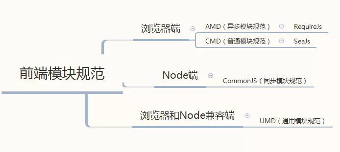
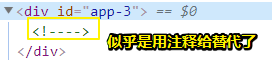

# 课后习题

## <a id="yi">①Vue 安装 & 介绍</a>

- 安装：<https://cn.vuejs.org/v2/guide/installation.html>
- 介绍：<https://cn.vuejs.org/v2/guide/index.html>

### ◇Q

啥叫 UMD 版本？——盗用一张图：

➹：[理顺8个版本vue的区别 - 前端进阶 - SegmentFault 思否](https://segmentfault.com/a/1190000014310246)

➹：[什么是前端模块规范AMD，CMD，CommonJS和UMD？ - 简书](https://www.jianshu.com/p/00ee4e45c0cd)

➹：[关于AMD,CMD,CommonJS及UMD规范 - 推酷](https://www.tuicool.com/articles/nueqi27)

➹：[JavaScript Modularization Journey](https://huangxuan.me/js-module-7day/#/)

➹：[模块系统 · Issue #240 · seajs/seajs](https://github.com/seajs/seajs/issues/240)

➹：[前端模块化开发那点历史 · Issue #588 · seajs/seajs](https://github.com/seajs/seajs/issues/588)

➹：[前端模块化开发的价值 · Issue #547 · seajs/seajs](https://github.com/seajs/seajs/issues/547)

### ◇A

1. Vue (读音 /vjuː/，类似于 **view**) 是一套用于构建用户界面的**渐进式框架**

2. 要想在页面的模板里边渲染Model里边的数据的话，你可以是用大胡子语法哈！

3. 为模板绑定动态动态属性的几种姿势：

   1. 有双引号的： ` :title="message"`、` v-bind:title="message"` 
   2. 没有双引号的：`:title=message`、`v-bind:title=message`

   当然，单引号也行，但不推荐！毕竟这是一种约定哈！

4. 关于v-if这个指令：

   1. 其值为false的元素就不会显示在页面里边

   2. 而且DOM结构也不含有该元素：

      

   总之，我们之所以看不见该元素，是因为该元素没有出现在 DOM 结构中

5. 关于v-for指令的值：

   1.  `todo in todos`
   2.  `todo of todos`

   可以用`in`，也可以用 `of`，在vue里边它们俩没啥区别，不过一般js `for in` 是遍历 key, 而 `for of` 遍历 value。

   ➹：[javascript总for of和for in的区别？ - SegmentFault 思否](https://segmentfault.com/q/1010000006658882)

6. 当你对模板里边的某个元素绑定了事件的话，那么你得把回调函数扔到选项对象里边的`methods`属性里边才行！否则则会报类似这样的错误：`ReferenceError: reverseMessage is not defined`

7. Vue不 支持 **IE8 及以下**版本！所以Vue支持IE9及以上！不过就目前而言，兼容性无须考虑哈！

8. Vue 2.5 有哪几个构建版本？

   1. 一个同时包含编译器和运行时的版本（简称为完整版）
   2. 一个只包含运行时的版本

   注意，可没有一个只包含编译器的版本，毕竟咩有运行时版本的话，这代码有个屁用啊！

9. 关于不同版本的说话：

   1. 如果你需要在客户端编译模板 (比如传入一个字符串给 template 选项，或挂载到一个元素上并以其 DOM 内部的 HTML 作为模板)，就将需要加上编译器，即完整版
   2. 当使用 vue-loader 或 vueify 的时候，`*.vue 文件`内部的模板会在构建时预编译成 JavaScript。你在最终打好的包里实际上是不需要编译器的，所以只用运行时版本即可。
   3. 运行时版本相比完整版体积要小约 30%

10. 文档说我们可以通过哪些方式将 Vue 引入我们的页面中？

    1. CDN
    2.  webpack
    3.  Rollup
    4.  Browserify
    5.  Parcel

---

