# 框架搭建 & 持续集成（上）

## ★课程简介

### ◇注意

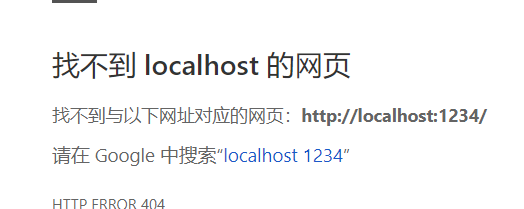


 如果出现上面图中的问题，请看下面👇

视频中使用 `npx parcel --no-cache` 命令，请自行改成 `npx parcel index.html --no-cache`，不改会出问题。

视频中使用 `npx parcel --no-cache` 命令，请自行改成 `npx parcel index.html --no-cache`，不改会出问题。

视频中使用 `npx parcel --no-cache` 命令，请自行改成 `npx parcel index.html --no-cache`，不改会出问题。

### ◇注意

如果你安装 node-sass 失败，那么请直接百度或者谷歌搜索「node sass 安装失败」

### ◇目录

1. 需求分析
2. UI 设计
3. 写代码
   1. 搭建框架
   2. button.vue
   3. icon.vue
4. 单元测试

我们需要通过 button 作为例子，来说明如何把这个项目的框架搭建起来。

### ◇注意

如果你在使用 WebStorm，请

1. 将 WebStorm 升级到 2018 版以上

2. 关闭 WebStorm 的 Safe Write 功能：

   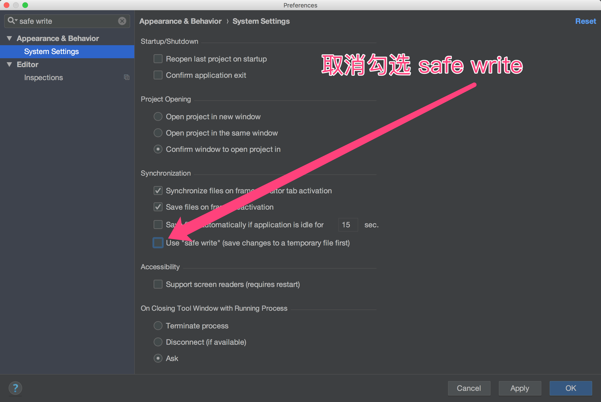

---

## ★🚨 parcel 报错怎么办（文章）

### ①No entres found 报错

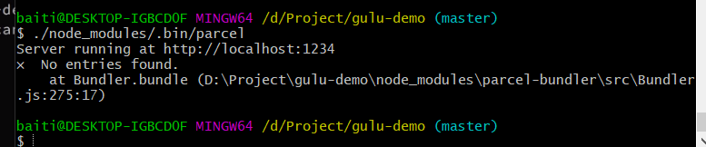

在 parcel 后面添加 index.html 即可

比如：

```
./node_modules/.bin/parcel 改成./node_modules/.bin/parcel index.html
npx parcel 改成 npx parcel index.html
```

### ② ERERM 报错

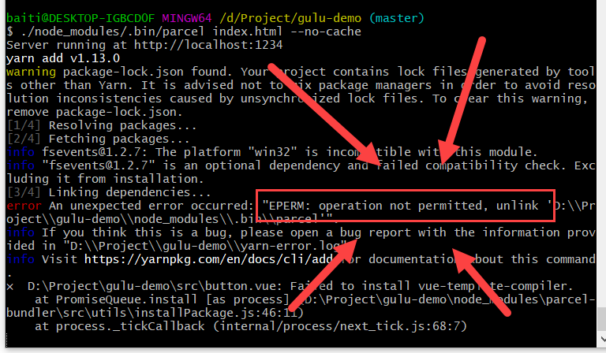

改用全局安装的 parcel 试试运气吧：

```bash
npm i -g parcel
parcel index.html --no-cache
```

## ★🚨 npm 报错怎么办？（文章）

如果 npm 报错，就改用 yarn 试试吧

```bash
rm -rf node_modules
yarn install
```

你没有安装 yarn? 自己去 yarn 官网下载安装包安装

## ★讲义（文章）

### ◇软件

- node 8
- npm 6，需要给 npm 配置淘宝源：npm config set registry <https://registry.npm.taobao.org/>
- 先不要用 yarn 以及 cnpm，只有在 npm 出问题的时候你再重试 yarn 和 cnpm。
- Windows 用户请先安装 Git Bash，教程见[这里](https://jscode.me/t/git-bash/97)

### ◇写给 Windows 用户的话

如果你目前在使用 Windows，那么需要注意一些事情：

1. 我们的工具大部分是命令行工具，如果你是 Windows 用户，那么你在使用这些工具的时候可能会遇到一些小问题。

   如果遇到命令行报错

   1. 首先你应该把报错的关键信息复制到 Google 看看有没有人遇到相同的问题，再看看他们是怎么解决的
   2. 如果你搜不到解决方案，可以在群里问我，但是要注意，请提供给我详细的报错信息（截图或复制到 jsbin.com）

2. 在看视频的过程中，有的时候你复制我运行的命令，发现命令报错，

   1. 你可以看完整节课的视频后再自己运行，因为很有可能我在后半段解决了这个问题
   2. 也有可能是 Windows 的问题，请在群里问我（记得截图）

### ◇代码

直播的时候写的代码：<https://github.com/FrankFang/frank-test-1>

设计稿：<https://yuque.com/u29422/gulu/197281/measure>

### ◇预先运行

1. 如果你的 npm 版本不到 6，就把 npm 升级到 6 以上： `npm i -g npm`
2. [设置 node-sass 的淘宝源](https://github.com/lmk123/blog/issues/28)
3. 如果还有问题，请尝试删除 node_modules 目录然后重新 `npm i` 。
4. 如果还有问题，请运行 `npm cache clean --force`

### ◇难点

1. Windows 安装 node-sass 容易失败
   - 可以看看[别人如何安装](https://www.google.com.hk/search?q=windows+安装+node-sass)
   - 可以把代码中的 `<style lang="scss">` 改为 `<style lang="less">` 使用 less 来写 CSS，语法跟 SCSS 差不多，但是安装起来快很多。

### ◇作业

这一课的作业需要你自己把 parcel + vue 的框架搭起来。详细请看课后题。

### ◇预告

下节课讲

1. 自动化测试
2. 发布我们的第一个轮子

### ◇UI

[语雀链接](https://yuque.com/u29422/gulu/197281)

### ◇知识点

1. parcel
   1. [官方推荐的配置](https://cn.vuejs.org/v2/guide/installation.html#Parcel)
2. scss
3. Vue 单文件组件
4. WebStorm 的快捷键
5. CSS变量和:root选择器
6. Vue.component
7. 插槽（slot）
8. $emit
9. props
10. Headless Chrome
11. Mock
12. npm scripts

## ★需求分析

**①用例图**

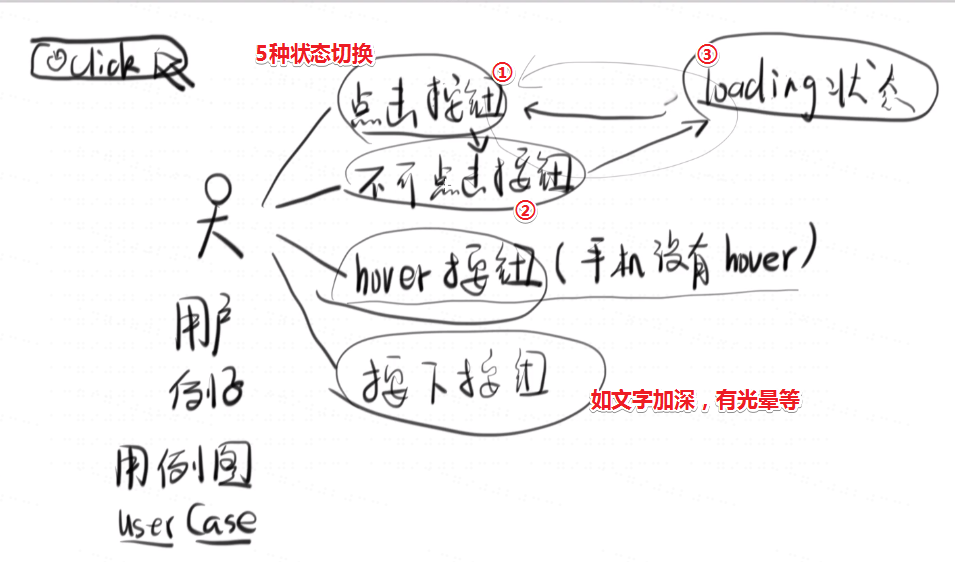

可以参考[按钮 Button - Ant Design](https://ant.design/components/button-cn/)这个UI轮子！

轮子做得再好一点的话，会有很多种状态……图中给出了5种需求，其实还有2种需求，如点击按钮会弹出一个二级菜单，还有按钮可以分成是一组的，如：

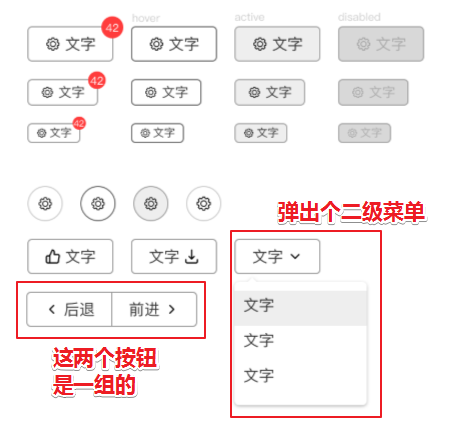

当然还会有其它需求！

**②画个按钮**

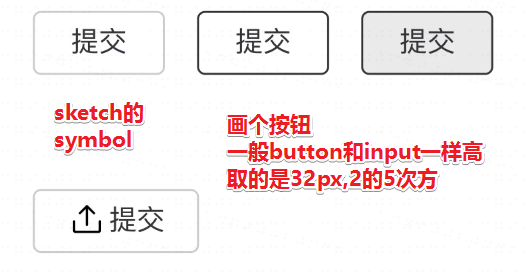

> border为1px
>
> border-radius为4px
>
> 按钮的宽高：
>
> 一般来说按钮的高度要与input的高度一致，不然你左边放一个input，然后右边放一个button，如果一个高一个矮，那成何体统啊？
>
> 言归正传，它的高度一般是32px，为什么是32呢？因为我们喜欢它是8的倍数呀，而8是2的三次方！你看浏览器默认字体高度为16px，也是8的倍数呀！当然，你用10的倍数也行，如30px、40px这样！
>
> 当然我们这里的字体为14px！
>
> 画出框后，添加文字，弄成是字14，行高14，然后弄成是绝对居中的恶，只要有两个线垂直交叉就好了，然后摁下alt键看看，它与button之间的关系是不是绝对居中的！
>
> 接着就是弄，不同状态的按钮了，状态的不同一般体现在样式上，如边框的颜色，字的颜色的
>
> 关于symbol，在墨刀上就是右键的这个：
>
> 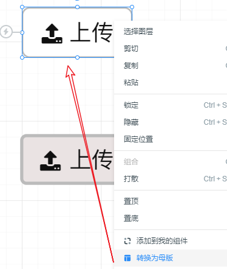
>
> 使用母版的好处，从这个母版复制而来的组件，一旦母版修改了样式，它们也会跟着变，适用于某一天觉得按钮不好看，然后批量更改所有按钮！而不是一个个改！因此一个按钮能成为母版，一般它就是最基础的样式了，即所有按钮都必须要有的样式，接着再对个别按钮进行个性化的修改！

我自己稍微弄了一个：


技巧：

选中某个组件（如A），摁下alt键，移动光标，移到某个组件身上（如B），你会发现A与B之间存在的间距大小：

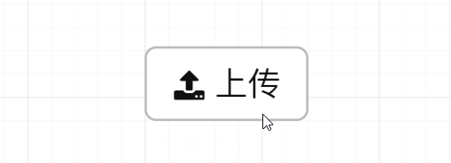

这样就解决了我之前用肉眼观察图标与文本内容之间的间距，然后调节它们俩

还有一个需要注意的是，在让按钮的内容（包括图标）左右居中的时候：

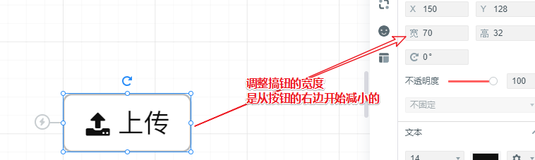

而我们摁的左右键是，调整X的大小，如果按钮与图标以及文本不是一组的话，那么你调整按钮的X大小的话，那么内容就会错位了！

每次的平移，即摁一下左键或者右键都是1px

小结：

以上操作并不会写UI轮子的重点，你只需要知道这些东西是很简单的就画出来的就好了！

➹：[原型设计工具“MockingBot 墨刀”深度使用吐槽 - ZFreet CHeung](http://www.zfreet.me/post/mockingbot-prototyping-tools-feedback.html)

➹：[墨刀(modao.cc)为什么这么难用? - 知乎](https://www.zhihu.com/question/62806376)

## ★项目初始化

### ◇具体流程

①由于项目是需要跟人家合作的，因此合作的地方需要放一个仓库，代码放在github上的话，相当于是开源的，由于是公司的代码，所以这是不可取的！因此如果在公司的话，使用公司自建的gitlab，或者是收费的brackets这个网站，当然github也有收费版的私有仓库，芳芳的官网代码和小程序代码都是放在上边的！

②声明软件许可，搞个LICENSE文件，告诉别人你这个东西是怎么开源的：


选择MIT，这个是最广泛的，对商业公司最友好的！

这个文件在github上创建就好了，会有写模板配置供你选择哈！弄好之后，别忘了，在本地仓库`git pull`一下

> 这个步骤需要点击很多次绿色的，以及需要删掉一个分支

➹：[如何选择开源许可证？ - 阮一峰的网络日志](http://www.ruanyifeng.com/blog/2011/05/how_to_choose_free_software_licenses.html)

③你要用什么第三方的东西？——装个npm就好了，然后 `npm init`一下

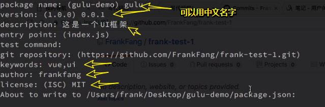

④考虑我们要用什么样的底层代码？——用vue呀！

```bash
#从npm6开始 npm i --save vue的--save就是默认的。i是install的简写
npm i vue
```

⑤开发工具的选择，使用webstorm，而不是vim！毕竟用vim的话，我们看着头都晕了！

⑥添加 `.gitignore`文件，毕竟刚刚装了个vue！

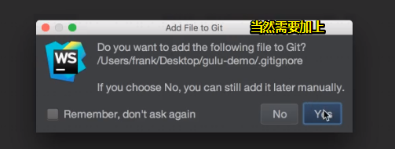

然后问你需不需要自动生成`.gitignore`文件：

选择不要，接着：

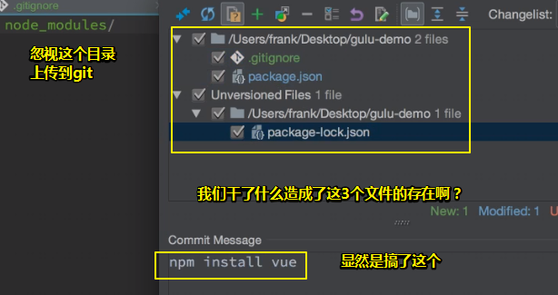

查看文件变化，可以放大，也可以点击文件来看：

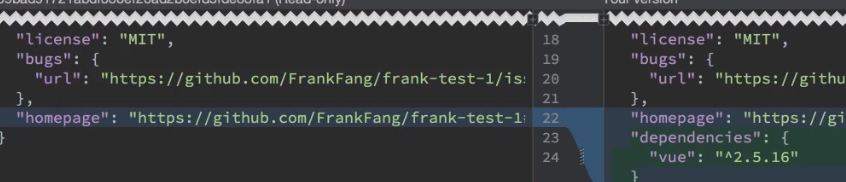

最后，就点个commit这个，或者commit and push都行，一般就点个commit即可！

如果push失败的话，那就直接打开gitbash，用命令行push吧！芳芳也不知道为啥会失败！反正能提交就好了！

以上，我们做了安装vue以及用webstorm控制git的提交，以及加了`.gitignore`文件

⑦创建一个index.html，设置为 `zh-Hans`，中文简体！添加title，引入vue，测试一下能否使用

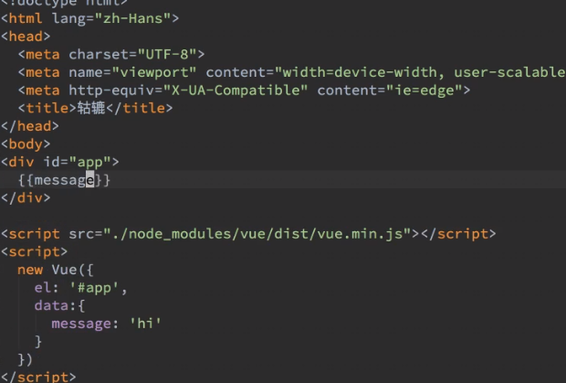

预览这个页面，直接点击那个浏览器logo即可！

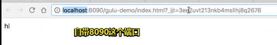

设置8090端口：

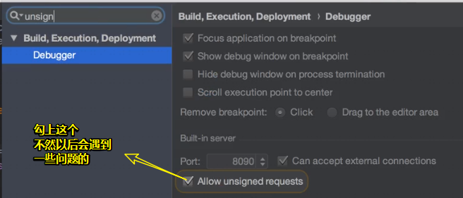

**⑧创建button组件**

创建一个button.js，由于我们现在还没有任何打包工具，所以我们只能靠最原始的方式，那就是用JavaScript来写啦！

写代码过程中webstorm提示报错：

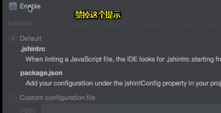


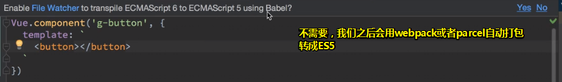

> 这个按钮里边有个hi文本

webstorm自带提示有个g-button标签！

然后你把这个文件引入到index里边，这个g-button标签就变成button了：

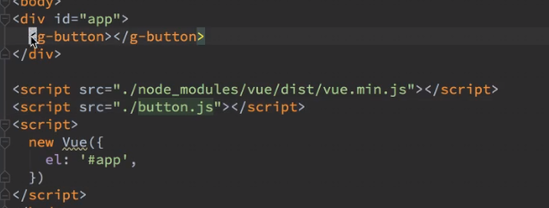

> jbutton有个梗，那就是鸡巴疼，Java或jQuery经常用j作为前缀，这样用中文听起来就很非常得不和谐了！

**⑨对button添加基本样式**

先对网站搞个默认样式，而且还要在README里边声明：

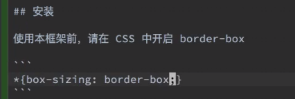

关于border-box，目前IE8这个浏览器也支持了，所以并不会有不满足这个border-box的浏览器出现！

关于按钮字体大小？

如果你直接写我们画图时所规定的14px的话，那么这样做是有很大bug的！

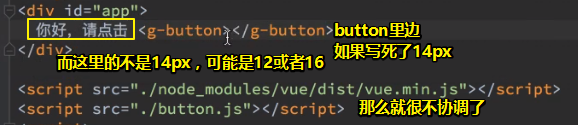

所以咋办呢？

可以让用户自己设置，有两种方法可以做到：

1. 让用户自己写的CSS覆盖你。但这样覆盖会很麻烦，最好还是使用变量
2. 使用变量，如果用户想改按钮的字体大小的话，那么直接改全局变量就好了，如14px，改成14rem都行！

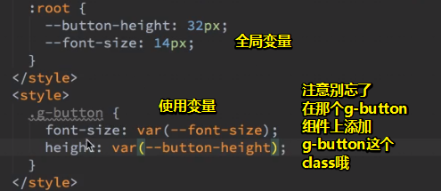

至此，字体的大小和按钮高度就由用户所设置的变量来决定的！用户想改多少就改多少！

> webstorm对重复声明的CSS会高亮：
>
> 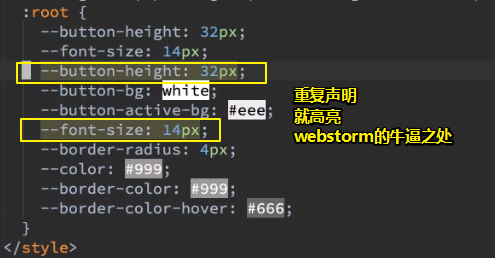
>
> 既然重复了，那就删掉好了！

一个细节：

千万不要写死按钮的宽度，这是很不好的做法！总之，你直接 `padding:0 1em；`就好了，上下0，左右各空一个字，这个按钮就显得很正常了！

关于缩写，因为background太长了，于是用了bg，而且看到bg的话，我们一般都知道它是background

样式写好后，就测试：

当我们摁下按钮之后，有一个默认的蓝色outline，目前我们并没有为这个focus做样式，但我们后面可能会做，所以在这里我们先把它给去掉，不然，现在就显得太丑了！

测试没有bug之后，就对照我们的设计稿，看看是不是一致的：

设计稿：

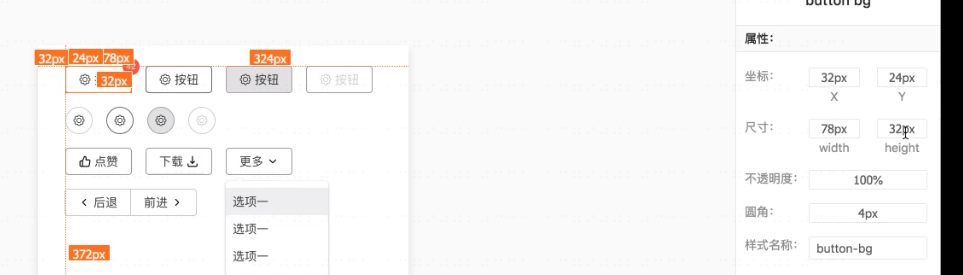

按钮高32，宽78

对比我们用CSS弄的按钮，高确实是32，但宽就不一致了，这是为什么呢？因为我们没有弄icon啊！因此我们需要加上icon之后再去测试是不是78的宽，但就目前而言，至少我们按钮的高度是一致的！

➹：<https://www.yuque.com/u29422/gulu/197281/measure>

提交这次更改，毕竟我们做了一个初步的最基础的样式！

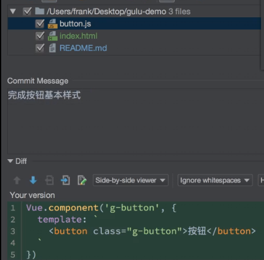

提交之前，有个代码分析：

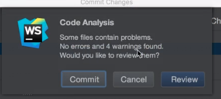

没有错误，但有4个警告，点击review一下：

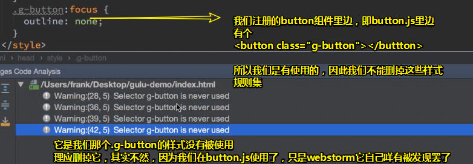

看了警告，不能动，于是跳过就好了，直接commit！

至此，我们完成了一个最基本的功能了！

通过以上学习，我们学会了什么？——两个知识点

1. 使用CSS变量，来使用户可以自由操作按钮的样式，如果浏览器不支持的话，当然，还会有其它办法，我们先是了解这个知识点即可！
2. 如何使用component？——Vue.component，然后声明一个字符串的名字，然后后边借个template即可！

做了以上操作之后：

在chrome上的效果：

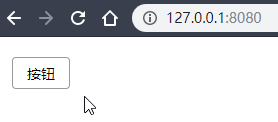

在edge的效果：

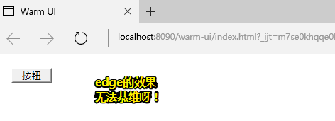

而使用ie的话，直接就是无法显示：

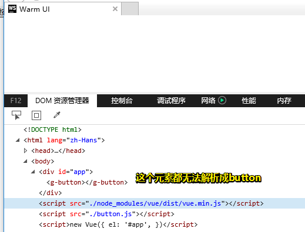

而edge（我的是14版本的，<https://caniuse.com/#search=var()>，IE都GG了，edge的话要16-17以上才完全支持！）：

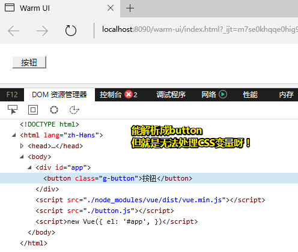

**⑩按钮的变化**

为什么要安装parcel？

Vue最大的优点就是可以使用单文件！如button.vue就是表示一个button啦！

而目前代码所存在 的毛病是：

1. js写在一个单独的js文件里边

2. html是写在js文件里边的template属性里边的

   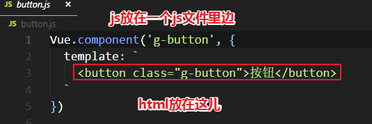

3. 样式写在index.html里边

   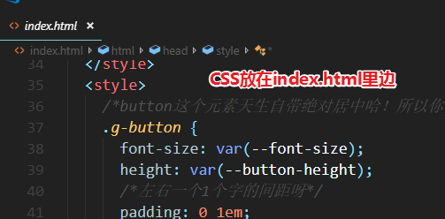

可见我们要完成一个button组件，需要把html、js、css放到三个地方去！

可见这很复杂呀！

而vue的牛逼之处就在于，它可以用一个文件就能表示这三种语言了！

而且如果你不借助任何的构建工具的话，你是做不到的！

因此，问题来了。我们该选择什么样的东西来作为我们的构建工具呢？

目前最著名是webpack！

不过，webpack比vue还复杂呀！

就目前而言，先用parcel吧！这个工具比较简单，不过轮子做到后边，这个工具就不够用了！因此之后会转为webpack！

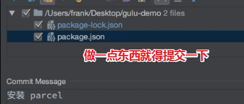

接下来就使用打包工具来重新做了！

按照parcel文档的说法，很简单：

1. 创建一个src目录

2. 把所有的JavaScript文件都放在src目录里边，其实就只有index.html里边所写的JavaScript，因此我们需要创建一个app.js：

   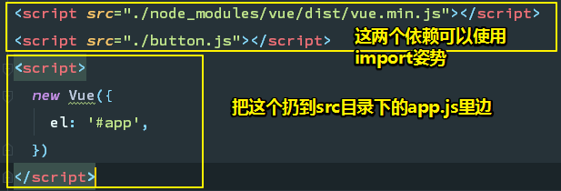

   至此我们的index.html只依赖一个js，就是app.js啦！

   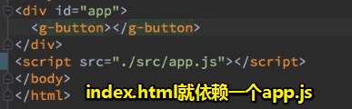

   至此，这个app.js就是我们整个应用程序的入口了，然后在这个app.js文件里边去依赖其它的东西即可！

   在依赖之前，需要重构我们之前的button.js，即重写成一个单文件button.vue

3. 单文件组件就只有3个东西：template（这里边用于写HTML）、script（用于写js）、style（用于写CSS）

   

4. 把原先的东西拷过来：

   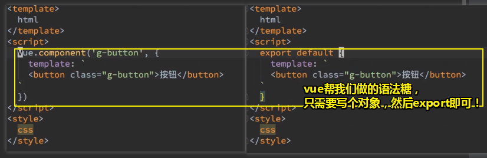

   总之，script就只做了一件事，`export default`接着一个对象！

   一般来说，我们还得对这个对象添加个name属性，这个name有啥用呢？之后用到的时候，你就知道有啥用途了！

   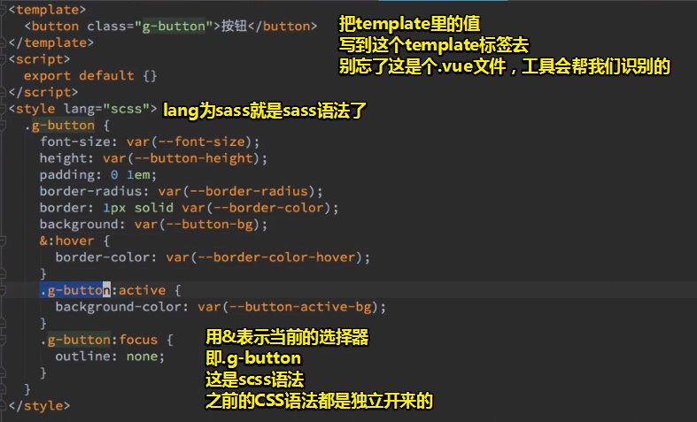

   改动完之后，才去打包！

   删掉button.js

5. 进行了以上步骤之后，index.html里的g-button标签没有人会认识它！因此我们需要在app.js里边把vue给引进来。可以使用import语法，之前我们是用script标签引进来的，而现在则是用新语法了！

   接着需要声明一下这个g-button，至此一个全局的g-button组件也就有了！

   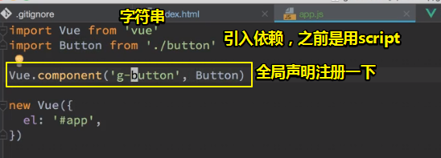

6. 测试，能否运行成功：由于我们安装了parcel，通过它来测试一下即可！

   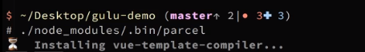

   回车之后，parcel它就会自动去安装我们所需要用的所用东西（如vue-template-compiler、）了，只需要等待即可，不需要任何配置！总之，无须操心！

   由于我们用了了scss，所以它会自己取安装node-sass，需要注意的是，这个安装sass的过程很容易失败！搜索node-sass安装失败即可！

   东西安装好后，就重新运行一下刚才那个命令！

   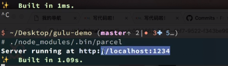

7. 结果报错了：

   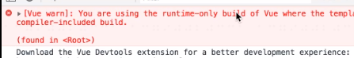

   在做工程处处理的时候，我们最容易遇到问题就是报错了，根据报错信息，我们可以知道vue的版本有问题，根据官网介绍，

   

   我们直接在package.json里边添加这一行即可：

   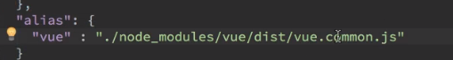

   添加这句话的意思是说，不要使用默认的runtime版，而是这个完整版！

   然后重新运行，而这次运行需要重新加个参数才行，不然那会坑死你：

   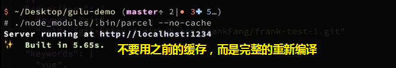

   结果：

   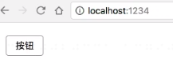

   至此，我们成功地将代码从最原始的JavaScript版本变成parcel版本了

8. 我的测试：

   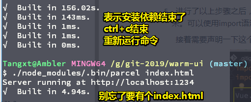

### ◇小结

1. parcel版本：把button.js变成为button.vue（html，js，css），把所有的依赖通过import来做！之前是用了两个script标签。声明组件g-button，初始化页面的相应的app！app这个div看到g-button这个标签就问vue「你认不认识这个g-button按钮」

   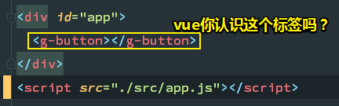

   额……vue表示「这个按钮我认识呀！它要渲染成我声明的那个Button」

   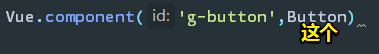

   看到这个Button，首先处理template里边的内容，替换成真正的按钮标签，然后再页面中添加CSS，至于JavaScript之后再说！

2. 我们通过预览可以看到，我们写的scss代码都变成了css文件了，这是parcel帮我们做到的，即自动把css变成是一个link！

3. 通过这个button，我们学会了另外一个新知识，这叫做单文件组件，这是vue的一个重要功能！它的特点是把js、css、html放到一个文件里边去！至此，我们就能很轻易的就知道了这个按钮长啥样，样式是啥，功能有哪些了！

   这个button.vue引入方式：在app.js里边全局声明注册一个组件即可！

4. 我们没有配置parcel，开箱即用！这是它最好的一个地方了！不过，在做单元测试的时候，不配置这个，真得是搞不定哈！而且改动文件，可以自动编译刷新页面！

5. `:root`的兼容性问题！你想知道一个东西有没有兼容问题？请到 <https://caniuse.com/#search=root> 里边查看，每个前端工程师都应该把这个网址给背下来！

   它表示的是根组件之意，其实就是html标签！但是有的地方由于有这个shadow dom，所以它有的时候不表示html，总之如果发现有兼容性问题的话，那就改成是html即可：

   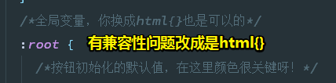

   如果你把 `:root`改为 `.g-button`的话，那么那些css变量只能在g-button这个作用域里边使用了，而 `:root`是全局的！如果改成是 `.g-button-2`的话，现在那些默认样式可以GG了！

   测试局部变量的元素影响范围，其实无须测试的，因为全局的 `:root`也是可以影响后代的，而局部的，同样也是可以影响后代的：

   [demo](./demo/01-css变量可以对后代元素有效吗.html)

6. 我以为：

   

   

   这个name属性值，是动态刷新后的结果！这等价于我们之前的那种注册组件做法！

7. 关于代码的提交：

   

   每次提交，你都要说清楚自己做了什么，这样才是高质量的提交！

   

   提交之前，看看那些文件需要ignore一下，不要把那些不该上传的东西上传！

   这个多出来的cache来自于parcel编译的过程中所产生出来的缓存！由于需要一个地方放置，所有就放在这个.cache目录里边了

   而这个缓存显然我们不想上传上去！

   dist目录目前不需要，之后会需要！

   

8. 查看远程仓库上git的历史：

   借助一个工具就可以做到，而且很好用：

   

   使用，在项目的根目录下git open即可！

   如果远程仓库出现，依赖有问题的话，如果建议升级，那么很有可能会有bug，因为这个东西的依赖情况不明确呀！

   

   总之，npm有个包有安全性问题的话，那就真得很难解决了！由于没有时间去分析，目前可以容忍这个问题！

9. 简单运行项目： `npx parcel --no-cache`，这表示在当前目录npx自己找这个parcel，开发者表示不记得路径了！如果出现了缓存，建议把缓存目录给删掉！

   

   不然，每次都得加 `--no-cache`

   去掉缓存后，需要重新编译

   还是得加上 `npx parcel index.html`

10. 平时commit都写中文！如果你的同事都是写中文的，都是中国人，那么干嘛要写英文呢？即便你写了英文，也写不好，除非你英文特别6！

## ★总结

- sketch有iconfont的图标库：

  

  而墨刀则咩有加入iconfont图标库！一般我们都需要自己从网上下载，然后添加进去！

  所以在我搜索upload这个图标的时候，只有那么几种选择！而不像是这样：

  

  ➹：[墨刀 - 教程: 带你玩转墨刀](https://modao.cc/tutorials/6892)

- 要做出一个非常强壮的程序，那么webstorm在这个过程里边会占据一个很大的功能，毕竟它的功能保证你的代码非常好！

- 2019-04-28，下午4点，刚看完了「闪光少女」这部电影，讲真，掉眼泪了！我一直在想我为什么要学编程呀？起初，我之所以学习完全是因为以防脑子生锈啊！可是学着学着，新鲜感开始逐渐没有了，而且学习难度也越来越大了，我开始想放弃了！可是放弃真得是由我说了算吗？还是他人说了算呢？不不，不管是他们，还是我，都说了不算，这个算不算只能由「前端」说了算，或者故事中的「扬琴」说了算，你一直一来都把一个习以为常的事情都当作是无生命的或者说是无感情的，你说你不想打篮球，可是初中那几年，篮球对你的意义是什么？你知道吗？对，那是存粹的喜欢，可以把所有空闲时间都交给篮球，可如今呢？你不再打篮球了，也不再做一些自己曾经很喜欢的事儿了……对，你在成长，开始变得斤斤计较，开始衡量这样做到底值不值得，但你有没有想过有些东西，根本就不是为了回报而去做的呀！而是，只是、仅仅为了存粹的喜欢、存粹的享受它所带来的乐趣呀！篮球可没说我们还是分手吧！前端同样也没有说我们还是分手吧！扬琴也没说我们还是分手吧！

  我之前一直不懂音乐可以给我带了什么，但现在我似乎有点懂了，比如说有好几条线路可以抵达目的地，其中有许多捷径，而你走了一条弯弯的路，你说其他走捷径的是不是一定比你先抵达目的地呢？非也，因为只要有音乐，你就能鼓起勇气继续走下去了，而不是因为先天的不足，导致后天因为自以为是预先看到的所谓结果，而变得停滞不前……

  说多无益，总之，当你实在想放弃的时候，请勿忘初心（打篮球很有趣，因为有偶像詹姆斯；学编程是为了让脑子不生锈……）！还有就是放不放弃不是你说了算，也不是他人说了算，而是那个你一直坚持，一直喜欢的东西说了算！

- 关于搭建一个前端项目的架子。当你拿到一个空目录之后，怎么变成一个项目，这中间需要考虑哪些事情，需要做哪些事情，都会在这个项目课里边讲到，当然，一下子考虑完是不可能，先把重点需要考虑的给说一下先！

## ★Q&A

### ①关于用户体验？

用户的消费决策：要提升自我认知，不然自己消费决策失败的这个几率就非常高了，因此一定要认清自己的需求哈！别让买回来的东西吃灰！

➹：[用户体验（用户使用产品、系统或服务过程中的主观感受）_百度百科](https://baike.baidu.com/item/%E7%94%A8%E6%88%B7%E4%BD%93%E9%AA%8C/1994)

➹：[什么是用户体验？如何评价用户体验的好坏？ - 知乎](https://www.zhihu.com/question/19682869)

### ②Webstorm简单使用？

1. 俩下shift，弹出个搜索快捷键命令等的搜索框，类似于vscode的 `Ctrl+shift+p`

   接着搜索VSC：

   

   如果不满意，这里边的快捷键是可以改的

   点击它，会有这样的一系列操作给你：

   

   总之，这里边所展示的就是你当前可用的所有git操作

2. 设置 `Ctrl+Alt+s` ，修改快捷键

   

   如果存在快捷键冲突的话：

   

   然后两个选线，要么remove（移除原先那个），要么leave（两个都留着），如果选择leave，那么这时很不好好的，一般我都会点移除

通过这两个东西，就可以查找一切的快捷键，后边会越来越多操作，但就目前而言已经够用了！


如果你不在commit里边写点内容的话，是无法commit的！

LF设置：


### ③简单了解一下CSS变量？

为什么会出现？也就是说它要解决的问题是什么？

1. 一些颜色在CSS文件中多次出现，并被重复使用
2. `#00ff00`表示啥颜色，根本就不知道

它出现之后带来的好处：

1. 统一处理颜色，类似于「母版」一样，而且相较于 LESS 或 Sass 类似的预处理器来说，带来一些预处理器的便利，并且不需要额外的编译
2. 变量名称本身就包含了语义的信息。CSS 文件变得易读和理解。特别是同样的颜色出现在不同的文件中的时候

做法：

1. 声明一个 **全局** CSS 变量：

   ```css
   //声明
   :root {
     --global-color: #666;
     --pane-padding: 5px 42px;
   }
   //使用
   .demo{
      color: var(--global-color);
   }
   ```

2. 声明一个局部变量： 

   ```css
   //声明
   element {
     --main-bg-color: brown;
   }
   //使用
   element {
     background-color: var(--main-bg-color);
   }
   ```

关于 `--`表示变量的那些事儿：

`$foo`被 Sass 用掉了，`@foo`被 Less 用掉了。为了不产生冲突，官方的 CSS 变量就改用两根连词线了。

还有一个`var`功能符：

`var()`函数用于读取变量。

➹：[使用CSS变量 - CSS（层叠样式表） - MDN](https://developer.mozilla.org/zh-CN/docs/Web/CSS/Using_CSS_custom_properties)

➹：[CSS 变量教程 - 阮一峰的网络日志](https://www.ruanyifeng.com/blog/2017/05/css-variables.html)

➹：[小tips:了解CSS/CSS3原生变量var « 张鑫旭-鑫空间-鑫生活](https://www.zhangxinxu.com/wordpress/2016/11/css-css3-variables-var/)

➹：[[译] 关于 CSS 变量，你需要了解的一切 - 掘金](https://juejin.im/post/5ab835225188255572085af4)

### ④再次理解声明式编程和命令式编程？

声明式编程的思想：你就等着吃饭就好了，也就是把做菜那些事儿交给专业的人来干，或许你会认为这跟代理模式很类似，但它们俩所处理的问题粒度是不一样的，声明式编程如同「告诉你驾驶技术」，而代理模式则是「告诉你如何抢火车票」，前者能解决的问题更多，而后者相对来说就少得多了！

因此它有以下好处：

1. **声明式编程让开发者的工作简化了**（一个人操心总好过一群人操心）
2. **声明式编程减少了重复工作**（专业的事情就交给专业的人去做）
3. **声明式编程留下了改进的空间**（xxx贡献了一个超级会员卡，在某电商网站上买东西一折优惠，那就大家集中起来一起买，一起用呗！）
4. **声明式编程提供了全局协调能力**（预算100万，不能超，要充分利用。请交一个人去控制这些预算！总之，多人一起搞的话，就会出现各种各样的问题了）

> 我模糊记得这样一句话，说是加上一层东西就能解决很多问题！在这里加了一个中间人，事情就变得好处理很多了！

命令式编程的思想：买菜，做菜，上菜，吃饭，总之，凡事都亲力亲为

➹：[从年会看声明式编程(Declarative Programming) - 知乎](https://zhuanlan.zhihu.com/p/26085755)

➹：[声明式编程和命令式编程有什么区别？ - 知乎](https://www.zhihu.com/question/22285830)

### ⑤在使用webstorm这个开发工具中，关于一些配置的处理，如tab空格是2个还是4个等？

`EditorConfig`是一套用于统一代码格式的解决方案，很多项目都有用到，比如`Bootstrap`、`jQuery`、`Underscore`和`Ruby`等等。

它是什么？

> `EditorConfig`可以帮助开发者**在不同的编辑器和IDE之间定义和维护一致的代码风格**。`EditorConfig`包含一个用于定义代码格式的文件和一批编辑器插件，这些插件可以让编辑器读取配置文件并依此格式化代码。`EditorConfig`的配置文件十分易读，并且可以很好的在VCS（`Version Control System`）下工作。

`EditorConfig`文件使用INI格式，而不是json格式呀！

➹：[【译】EditorConfig介绍 - AlloyTeam](http://www.alloyteam.com/2014/12/editor-config/)

➹：[不起眼的 .editorconfig - 简书](https://www.jianshu.com/p/fac7dde906cc)

➹：[.editorconfig · 只为遇见更美的你/Vue-admin - 码云 Gitee.com](https://gitee.com/chenyp/Vue-admin/blob/master/.editorconfig)

### ⑥使用parcel？

1. 新学一个东西，先去它的[官网](https://parceljs.org/getting_started.html)！然后直接看代码！不要看那些文字介绍！

2. 一般不需要全局安装，parcel-bundler是一个包的名字！

   

   ```
   npm i -D parcel-bundler
   ```

   关于  `-D`，我们之前安装vue的时候是没有这个参数的，那么现在我们安装parcel为啥需要这个 `-D`呢？

   因为vue这个包是要给用户使用的，所以我们就不加这个参数了

   而我们这个包是给开发者使用的，所以需要加上！

   而D顾名思义就是 Developer开发者之意

   即便你全局安装，也是只能开发者才能用的！

3.  不需要 npm init，之前关于第三方工具的选型已经npm init过了！

### ⑦关于package-lock.json？

把安装的第三方工具版本给lock起来