# 框架搭建 & 持续集成（下）

## ★课程简介

### ◇注意：Windows 用户运行 `npm run dev-test` 时会出现 BUG

1. 从这节课开始，你需要用 `npx parcel index.html --no-cache` 来开启项目（可以把这个命令写到 `npm start` 里）
2. Windows 用户运行 `npm run dev-test`时会出现 BUG，貌似是因为 Windows 不支持 `&&` 符号，解决办法是：将 dev-test 对应的命令  `parcel watch test/* --no-cache & karma start`分别运行，运行方式如下：
   1. 新开一个 Git Bash 窗口运行 `npx parcel watch test/* --no-cache`
   2. 再开一个 Git Bash 窗口运行 `npx karma start`

### ◇npm publish 遇到 403 怎么办？

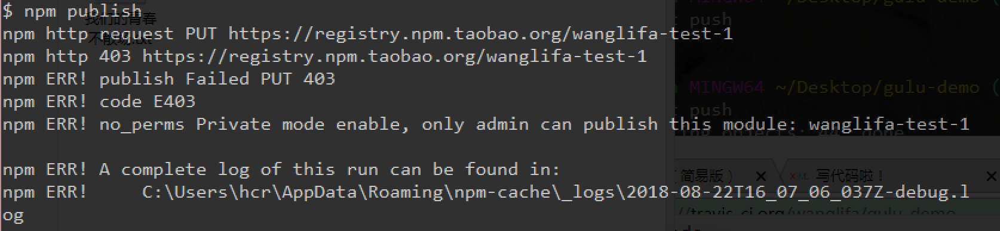

首先看log里面有没有 taobao 字样（截图中有）

* 如果有这说明你没有切换到 npm 原始源，那么你只需要用 `npm config delete registry` 删除淘宝源，然后再 publish。
    publish 成功之后再切换回淘宝源 `npm config set registry https://registry.npm.taobao.org`
    如果嫌切换不方便，可以安装 [nrm](https://github.com/Pana/nrm) 来快速切换源。
* 如果没有 taobao 字样，继续往下看

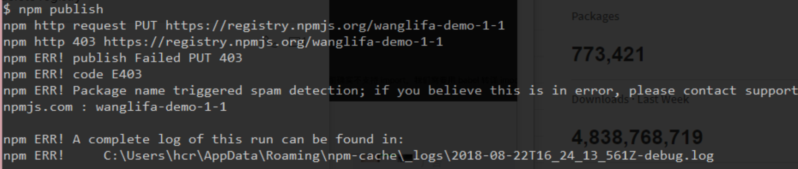

看看 log 里面有没有「spam detection」字样

* 如果有
    这说明你的 package name 看起来像是 spam（垃圾邮件），你需要换一个更正常的名字。比如 `china-number-one-haha`
* 如果没有
    可能是你的 pacakge name 已经被人注册了，换个 name 试试

### ◇目录

1. 自动化测试
2. 持续集成
3. 重写所有代码
4. 发布 npm 包
5. 完善 README

## ★警告：npm link 在 Windows 上会抽风

如果你 npm link 之后项目报错，你就不要再用 npm link 了

你只需要每次改完代码后 npm publish ，然后再在另一个地方 npm install [xxx@0.0.x](mailto:xxx@0.0.x) 即可。

## ★自动化测试

### ◇使用 Karma + Mocha做单元测试

1. Karma（`[ˈkɑrmə]` 卡玛）是一个测试运行器，它可以呼起浏览器，加载测试脚本，然后运行测试用例
2. Mocha（`[ˈmoʊkə]` 摩卡）是一个单元测试框架/库，它可以用来写测试用例
3. Sinon（西农）是一个 spy / stub / mock 库，用以辅助测试（使用后才能理解）

### ◇<a id="yi">步骤</a>

1. 安装各种工具
   `npm i -D karma karma-chrome-launcher karma-mocha karma-sinon-chai mocha sinon sinon-chai karma-chai karma-chai-spies`

2. 创建 karma 配置

   ```js
   // 新建 karma.conf.js，内容如下
   module.exports = function (config) {
     config.set({
   
       // base path that will be used to resolve all patterns (eg. files, exclude)
       basePath: '',
       // frameworks to use
       // available frameworks: https://npmjs.org/browse/keyword/karma-adapter
       frameworks: ['mocha', 'sinon-chai'],
       client: {
         chai: {
           includeStack: true
         }
       },
   
   
       // list of files / patterns to load in the browser
       files: [
         'dist/**/*.test.js',
         'dist/**/*.test.css'
       ],
   
   
       // list of files / patterns to exclude
       exclude: [],
   
   
       // preprocess matching files before serving them to the browser
       // available preprocessors: https://npmjs.org/browse/keyword/karma-preprocessor
       preprocessors: {},
   
   
       // test results reporter to use
       // possible values: 'dots', 'progress'
       // available reporters: https://npmjs.org/browse/keyword/karma-reporter
       reporters: ['progress'],
   
   
       // web server port
       port: 9876,
   
   
       // enable / disable colors in the output (reporters and logs)
       colors: true,
   
   
       // level of logging
       // possible values: config.LOG_DISABLE || config.LOG_ERROR || config.LOG_WARN || config.LOG_INFO || config.LOG_DEBUG
       logLevel: config.LOG_INFO,
   
   
       // enable / disable watching file and executing tests whenever any file changes
       autoWatch: true,
   
   
       // start these browsers
       // available browser launchers: https://npmjs.org/browse/keyword/karma-launcher
       browsers: ['ChromeHeadless'],
   
   
       // Continuous Integration mode
       // if true, Karma captures browsers, runs the tests and exits
       singleRun: false,
   
       // Concurrency level
       // how many browser should be started simultaneous
       concurrency: Infinity
     })
   }
   ```

3. 创建 test/button.test.js 文件

   ```js
   const expect = chai.expect;
   import Vue from 'vue'
   import Button from '../src/button'
   
   Vue.config.productionTip = false
   Vue.config.devtools = false
   
   describe('Button', () => {
     it('存在.', () => {
       expect(Button).to.be.ok
     })
     it('可以设置icon.', () => {
       const Constructor = Vue.extend(Button)
       const vm = new Constructor({
         propsData: {
           icon: 'settings'
         }
       }).$mount()
       const useElement = vm.$el.querySelector('use')
       expect(useElement.getAttribute('xlink:href')).to.equal('#i-settings')
       vm.$destroy()
     })
     it('可以设置loading.', () => {
       const Constructor = Vue.extend(Button)
       const vm = new Constructor({
         propsData: {
           icon: 'settings',
           loading: true
         }
       }).$mount()
       const useElements = vm.$el.querySelectorAll('use')
       expect(useElements.length).to.equal(1)
       expect(useElements[0].getAttribute('xlink:href')).to.equal('#i-loading')
       vm.$destroy()
     })
     it('icon 默认的 order 是 1', () => {
       const div = document.createElement('div')
       document.body.appendChild(div)
       const Constructor = Vue.extend(Button)
       const vm = new Constructor({
         propsData: {
           icon: 'settings',
         }
       }).$mount(div)
       const icon = vm.$el.querySelector('svg')
       expect(getComputedStyle(icon).order).to.eq('1')
       vm.$el.remove()
       vm.$destroy()
     })
     it('设置 iconPosition 可以改变 order', () => {
       const div = document.createElement('div')
       document.body.appendChild(div)
       const Constructor = Vue.extend(Button)
       const vm = new Constructor({
         propsData: {
           icon: 'settings',
           iconPosition: 'right'
         }
       }).$mount(div)
       const icon = vm.$el.querySelector('svg')
       expect(getComputedStyle(icon).order).to.eq('2')
       vm.$el.remove()
       vm.$destroy()
     })
     it('点击 button 触发 click 事件', () => {
       const Constructor = Vue.extend(Button)
       const vm = new Constructor({
         propsData: {
           icon: 'settings',
         }
       }).$mount()
   
       const callback = sinon.fake();
       vm.$on('click', callback)
       vm.$el.click()
       expect(callback).to.have.been.called
   
     })
   })
   ```

4. 创建测试脚本

   在 package.json 里面找到 scripts 并改写 scripts

   ```json
   "scripts": {
        "dev-test": "parcel watch test/* --no-cache & karma start",
        "test": "parcel build test/* --no-minify && karma start --single-run"
    },
   ```

5. 运行测试脚本

   1. 要么使用 `npm run test` 一次性运行

      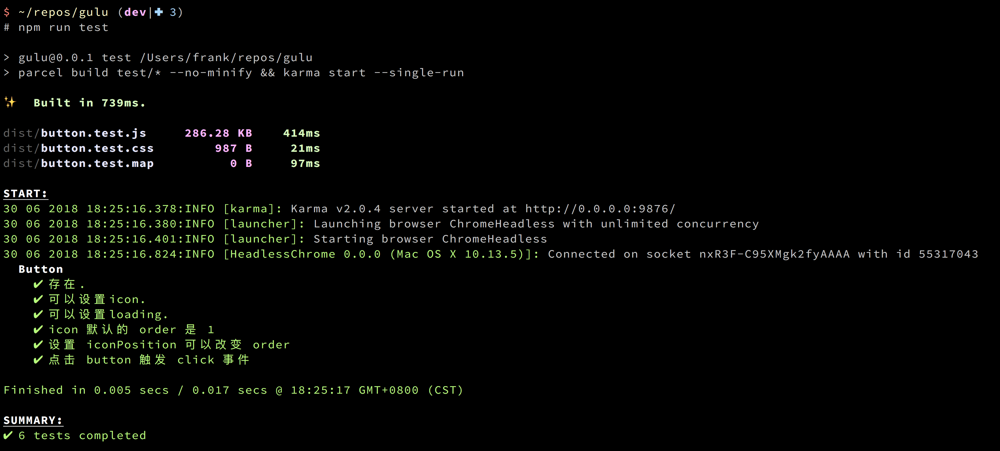

   2. 要么使用 `npm run dev-test` 进行 watch 运行

      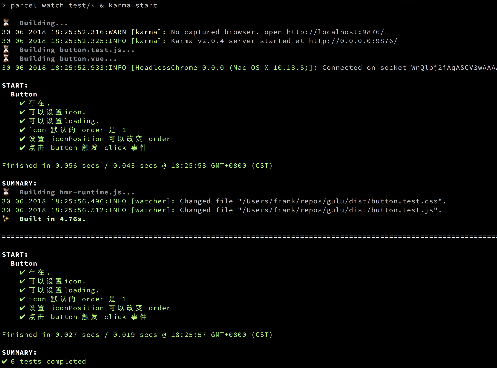

### ◇成果

如此一来，你开发的时候新开一个命令行窗口运行 `npm run dev-test` 就可以实时查看测试结果。
如果你只想看一次结果，就只用运行 `npm run test`

## ★发布 npm 包

### ◇确保你的代码测试通过了

`npm run test` 全部是绿色（原谅色）才行。

### ◇上传代码到 npmjs.org

1. 更新 package.json
   1. 在 package.json 里将版本号改为 0.0.1，等我们做完了再改成 1.0.0
   2. 创建 index.js，在 index.js 里将你想要导出的内容全部导出
2. 去 <https://www.npmjs.com/> 注册一个账户
3. 确认一下邮箱（必须）
4. 在 gulu 项目根目录运行 npm adduser
   - 如果错误提示里面含有 [https://registry.npm.taobao.org](https://registry.npm.taobao.org/) 则说明你的 npm 源目前为淘宝源，需要更换为 npm 官方源
5. 运行 npm publish

### ◇使用自己的包

1. 预测其他使用你的包的人会怎么使用
   - 使用 vue-cli
   - 使用 webpack
   - 使用 parcel
2. 分别使用这些方式来使用自己的包（我们只以 vue-cli 为例）
   1. 使用过程中我们发现报错说 import 语法有问题，那时因为 node 目前确实不支持 import，我们需要用 babel 转译 import
      1. 你可以要求使用者自己用 babel 来转译
      2. 你也可以转义好了再给他用
         - `npx parcel build index.js --no-minify` （本来不应该加 --no-minify 的，奈何不加会有 bug，HTML 压缩把 slot 标签全删了）
         - 将 package.json 的 main 改为 dist/index.js
3. 使用 npm link 或者 yarn link 来加速调试
   1. 你每次修改源码之后，有两条路让别人得到最新效果
      1. 更新 package.json 里的 version，然后 npm publish。别人通过 npm update xxx 来更新。
      2. 如果你只是为了本地调试，可以在项目目录使用 npm link，然后在使用之处运行 npm link xxx，就是最新了

## ★持续集成

我们一开始要自己打开 Chrome 测试我们的代码
后来使用 Karma 可以做到一行命令测试我们的代码

想一想，还能不能再自动化一点。

这就是持续集成

---

## ★这次课讲什么？

> 这次课让上节课的代码变得非常的完善

这次课讲什么？（很多都咩有接触过）

1. 自动化测试
2. 持续集成
3. 重写所有代码（这一部分讲真很不喜欢，但是不得不这样做）
4. 发布 npm 包（让别人可以使用我们的轮子，只要安装了这个包就可以使用20多个轮子，目前只做了一个button轮子）
5. 完善 README

如果你的前端生涯未经历过以上过程，那么这次课是非常重要的！

之后的课，大都重复前4节的课！因为都是重复造轮子哈！

## ★使用Karma做自动化测试

### ◇为什么需要自动化测试

> 本来芳芳的自动化测试用的是 puppeteer（这个安装下载特别大），奈何GG了。
>
> ➹：[自动化测试 · FrankFang/frank-test-1@05084aa](https://github.com/FrankFang/frank-test-1/commit/05084aa2afd48681d909f5ec9060cfee28e64d36?diff=unified)
>
> ➹：[大前端神器安利之 Puppeteer - 前端 - 掘金](https://juejin.im/entry/5a3aa0e86fb9a045076fd385)

目前的单元测试做法：通过打开浏览器，刷新页面就测完了。

简单说一下我们做了哪些几个测试：

1. 测试按钮含有icon：生成一个vm，把vm挂载到内存里……
2. 测试假如loading存在，icon是否还会显示？
3. ……

可见单元测试使得我们可以通过代码来测试我们所写的代码是不是对的！

我们知道，所写的5个测试，每次都得打开浏览器刷新页面才能看到测试结果。

自动刷新，我们借助parcel可以做到，可是自动打开浏览器可以做到吗？

### ◇如何让电脑自动打开浏览器？自动点刷新呢？全都自动化呢？

> 只需要输入一行命令，就可以知道我们的代码到底有没有问题！
>
> 接下来，我们要做什么呢？
>
> 把我们打开浏览器，然后加载JavaScript，然后看出没出错的这个过程，完全自动化哈！

#### 做法

> 参考 [①](#yi)

1. 安装各种工具：

   1. Karma，可以运行我们的测试，如它可以自动呼起浏览器，自动加载测试脚本，自动运行我们的测试用例，简而言之，它就是一个测试运行器
   2. Mocha，咖啡的名字，摩卡咖啡，可见JavaScript老是跟咖啡过不去！它是一个单元测试库，当然也有人认为它是个框架，它可以用来干嘛了？可以用来写测试用例！
   3. Sinon，是一个 spy / stub / mock 库，用以辅助测试（使用后才能理解）

   > 或许以上3个工具你都不懂，但是这没有关系呀！因为它们都是工具呀！既然它们是工具，那么只需要照着芳芳的做法过程做一遍，那么你就学会了，无须知道中间的原因是什么！
   >
   > 请设置好淘宝源！如果需要下载很久，那么肯定是在package.json里边添加了什么东西：
   >
   > 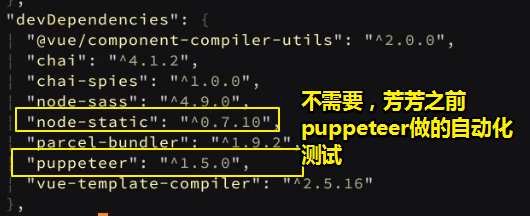
   >
   > 也就是npm会自动的去读依赖安装，即便你没有显示说安装它们，换言之，先把安装版本写到 `devDependencies`里边去，然后去安装咩有安装过的！

   安装结果：

   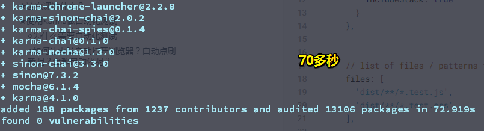

2. 创建karma配置（可以简单认为karma就是一个可以帮我们打开浏览器的的工具）

   在root目录里边，创建一个 `karma.conf.js`文件，文件名必须一样，不然会报错哈！

3. 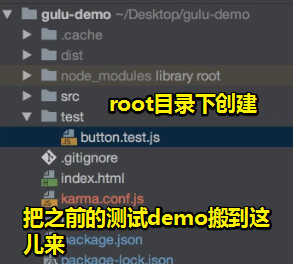

   创建test/button.test.js

4. 创建运行测试用例的脚本，之后会解释这个脚本为何意，先跑通这个过程再说！这个脚本的步骤过程还挺复杂的，如果直接讲是听不懂的，还是得先看到效果之后才去讲，才比较好！

   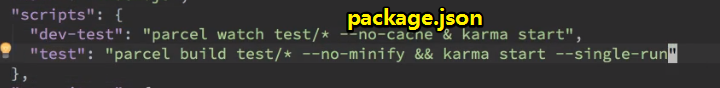

5. 运行测试脚本 `npm run test`

#### 解释以上过程做了什么？

> 即 `npm run test`做了什么

1. 把js打包一下
2. 打开chrome
3. 在chrome里边输入网址，运行网页
4. 测试用例试运行完毕后，就自动关闭那个chrome浏览器
5. 然后把浏览器的输出显示到终端里边

以上就是这一句话所做的事情了。

然而报错了：

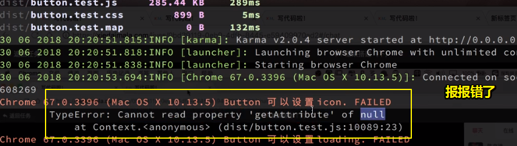

这个报错是芳芳故意而为之的！根据错误信息，我们来来看看button这个组件是怎么写的：

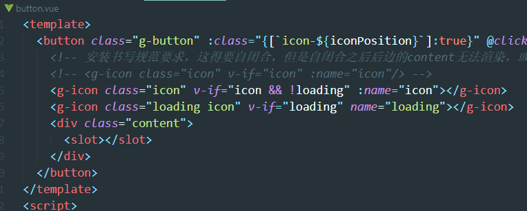

我们直接用了`g-icon`这个自定义组件，而使用这个自定义组件有两种方式：

1. 全局注册

   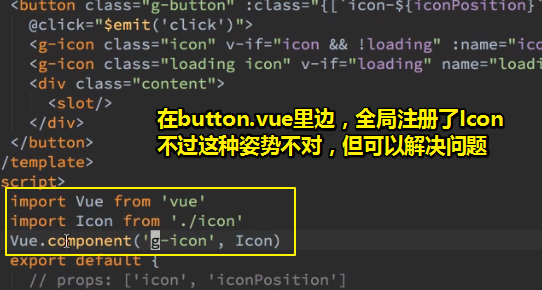

   > webstorm使用技巧：如果单词拼写错了，会搞个绿色波浪线；如果import过来的变量没有被使用，那么 `import Icon from ‘./icon’`是咩有被高亮的，呈现为灰色

2. 局部注册

做了上边那个1步骤之后，请清掉缓存，不然依旧会报错，为什么要清呢？没有理由，经验之谈，做多了，就会这样：
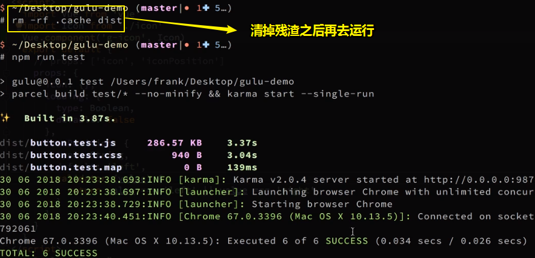

再次说说这个清掉缓存的方案是如何产生的：

1. 代码没有错，就是莫名出现这样的错误：

   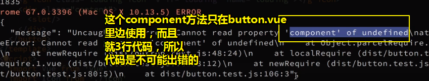

2. 那么是哪里出错了呢？搜索结果，然后没有找到答案。

3. 之后大概花了10多分钟，用了7、8种方法，发现把上次打包的东西给删掉，然后重新打包就好了

这就是为什么芳芳要输入 `rm -rf .cache dist`的原因所在了！这是很多书都不会讲的内容！

> 所以很多时候，你写代码遇到了问题，不是因为你代码写不好，是因为你尝试得不够多！

知道结果很简单，但实际上却不是这样的！

回顾一下，我们是如何解决bug的？

在button.vue里边，把icon组件注册为全局组件即可！

然而在button.vue里边注册全局是不太好的行为，虽然这可以注册！

于是。我们就使用另一种方法，来解决这个问题了，即局部注册icon组件！

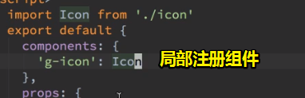

告诉button，你里边的g-icon对应是我写的icon.vue这个组件

再次运行 `npm run test`

然而还是报错，于是又运行 `rm -rf .cache dist`之后，再`npm run test`

结果跑通了

难道我们每次修改了一下button.vue的内容，都得 `rm -rf .cache dist`一下吗？这未免也太麻烦了吧！

话说，能不能不删啊！

可以啊，修改一下脚本即可（追加`--no-cache`）：

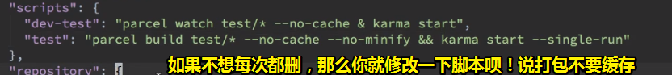

以上，我们就跑通了项目了！

我的测试结果：

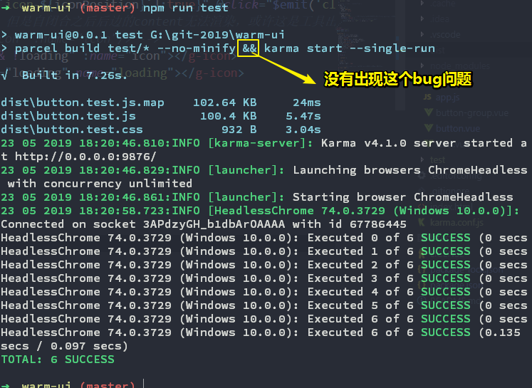

### ◇回顾自动化测试，做了哪些事情才能到达我们想要的效果

现在，我们就可以看到一个自动化测试的结果了！而这个时候，我们再来解释自动化测试的过程就很好理解了。

我们运行 `npm run test`实际上会调用什么呢？

①看我们在package.json里边写的test命令，毕竟run了一下test，即运行一下test命令哈！

②那么test做了什么呢？

1. 首先运行 `parcel build test/* --no-cache --no-minify `

   `test/*`表示test目录下所有的一级文件

   然后后边加两个参数表示，不要缓存，不要minify。不要缓存好理解，而不要minify呢？也好理解，因为如果不加就会出错，总之这两个参数都是试出来的！而且这两个参数，芳芳并没有看到哪个文档说必须要加这两个参数的，总之，你不叫就会出bug。可见，现在的parcel不是那么完善，后面我们会改成其它的构建工具！

   所以这句话的整体意思就是，**让parcel去打包test目录下的所有一级文件，而且不要缓存，不要最小化（不要压缩）**

   如果你单独在终端运行这个命令，请加上npx，因为我们并咩有全局安装parcel！

   > 终端使用技巧，由于需要单独运行该命令，所以需要添加npx，而这个npx处于开头，可以ctrl+a让光标定位到开头，ctrl+e定位到结尾，注意这是windows下的做法！

   目前的目录结构：

   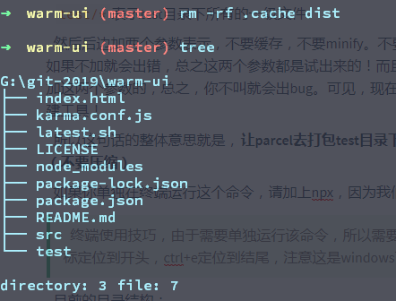

   单独运行这个命令的结果：

   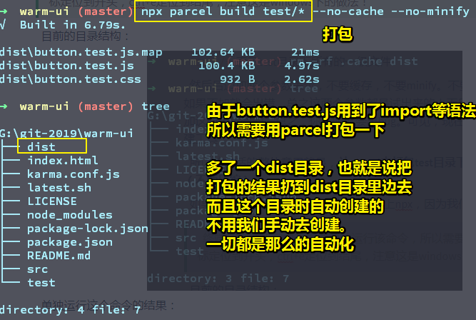

   话又说回来，这打包做了啥？或者说为啥我们需要用parcel去打包呢？因为我们用了一些语法，比如说 `import Vue from 'vue'`这一句浏览器是不认识的，至少目前浏览器是不认识的，所以当浏览器执行到这儿：

   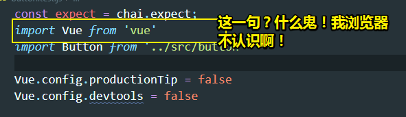

   所以，打包会把vue的源代码给拷进来！

   然后把vue做成一个变量暴露出来！

   总之，这句代码会被parcel打包成把vue的源代码拷过来这么一个事情！同理button也是如此！

   所以为啥要打包呢？因为这些语句浏览器以及node都不认识呀！所以需要把它们翻译成浏览器所认识的才行呀！

   查看打包效果：

   没有打包：79行代码

   打包之后：10191行代码，为什么多了这么多行代码呢？因为大部分都是vue的源码啊！总之打包出来的代码都是parcel自己翻译的，无须去理解这里边的代码是啥意思，毕竟这没必要呀！总之打包这个过程就是把浏览器不懂的变成懂的！

2.  `karma start --single-run`

   来到这一句了！这表示karma启动，然后只运行一次哈！

   那么karma该如何启动呢？

   > 再次回顾一下我们在做什么，在做自动化测试哦！
   >
   > 那么怎么做的呢？只要运行 `npm run test`即可
   >
   > 然后 分析 `npm run test`做了什么！
   >
   > 1. 把test目录下一级文件打包
   > 2. 运行karma

   karma如何运行呢？这就需要在另外一个文件里去描述了，这个文件叫做karma.conf.js ，表示karma配置js

   查看该配置文件中一些特别配置：

   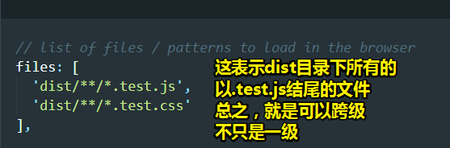

   > `**`表示可以跨级

   需要注意的是 ，虽然我们的单元测试代码 `button.test.js`没有css，但是我们还是得写上 `'dist/**/*.test.css'`，如果你不写的话，那么运行 `parcel build test/* --no-cache --no-minify && karma start --single-run`是会报错的，报错如下：

   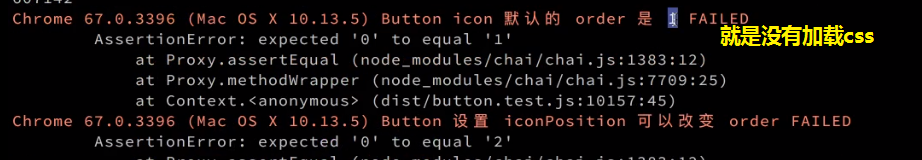

   由于没有加载默认的CSS，那么涉及CSS测试的单元测试，那就GG了。

   可是这个CSS是来自哪儿的呢？

   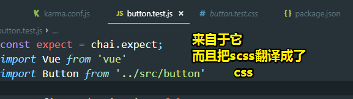

   可见，parcel在打包的时候，会把该文件button.test.js里边的js和css分开！

   这样一来就方便我们去引用了！

   所以说parcel并咩有把整个button.vue文件打包成js哈！

   所以如果你不加 `'dist/**/*.test.css'`上这句话的话，那么所有跟样式相关的测试用例，全部都会挂！

   接下来：

   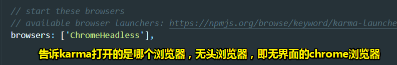

   注意，选择哪个浏览器打开，都是需要装插件的：

   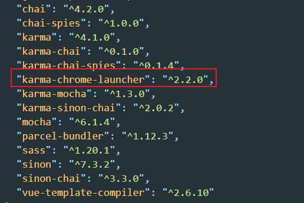

   不是说你想用啥浏览器打开就用啥打开！我们在这里默认打开的是chrome

   总之知道该配置文件的两个即可！

### ◇小结

1. 运行 `npm run test`

   1. 打包
   2. 启动karma
   3. karma去启动chrome
   4. 运行完测试用例就关闭chrome
   5. 退出chrome

   以上就是我们目前的自动化过程了！

2. 我们看了哪些文件：

   1. package.json：

      ```json
      "test": "parcel build test/* --no-cache --no-minify && karma start --single-run"
      ```

   2. karma.conf.js：

      ```js
      files: [
          'dist/**/*.test.js',
          'dist/**/*.test.css'
      ],
      browsers: ['ChromeHeadless'],
      ```

3. 接下来看我们的测试用例 `button.test.js` 该怎么写，这个问题很重要！

---

## ★使用Mocha&Chai做单元测试

> 接下来看看我们的测试用例 `button.test.js` 是怎么写的！

### ◇之前的单元测试代码

在此之前，先来看看引入Mocha&Chai之前，我们的测试用例是怎么写的

写了6个测试用例，每个测试用例都是个block：

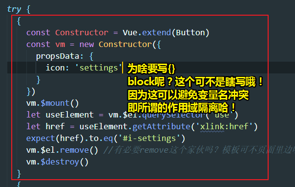

咩有必要说如果不写 `{}`，那么变量名就会冲突了，那就就会报错，而是直接说作用域隔离就好了！

总之我们写单元测试，一定要做的就是：

1. 作用域隔离
2. 断言

而其它的则可有可无，总之这两个一定要有，只是它们看起来比较简陋，只是使用了一个 大括号`{}`就把测试用例给隔离了和 使用了chai库的expect方法就搞了断言

之后，我们还引入了一个叫间谍的库——spy

然后用spy也进行了一次断言！

### ◇高级写法的单元测试代码

而现在的高级写法也是一样的！

1. 隔绝每个单元测试，我们用的是it，每个it就是一个新的测试用例！而隔绝的方法是通过函数来隔绝！

   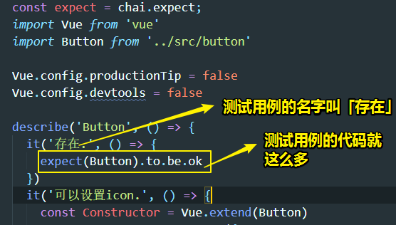

   箭头函数里边的代码基本上跟之前的测试代码一样！

   对了，我们之前的测试代码也可以取名字，可以用注释，或者没有意义的字符串，就像这样：

   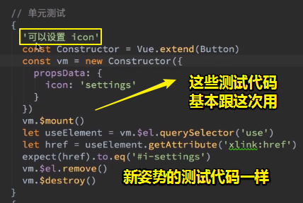

   总之，相较于旧姿势，新姿势的代码思路几乎咩有区别，而且代码几乎差不多，只是以前用 block`{}`，而现在则变成了`it`

### ◇describe和it

BDD，行为驱动测试，我们的高级写法测试代码或许是BDD，又或许是TDD，但是这不重要啊！形式上好看，能测试代码不就好了吗！

我们描述（describe）了button的一系列行为、属性，如它（it）能做什么，它有什么……

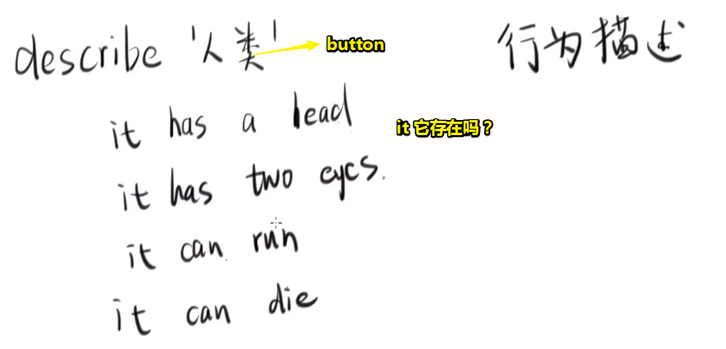

### ◇详解最后一个测试用例的fake函数

关于最后一个测试用例：

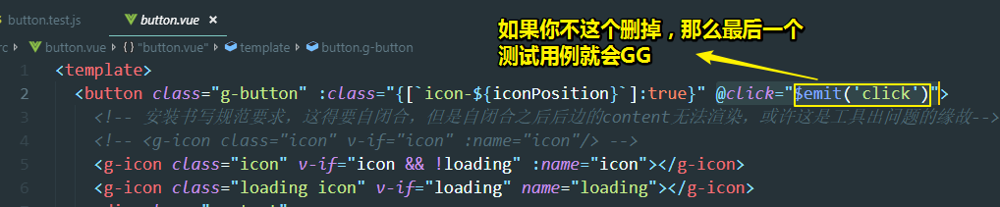

结果：

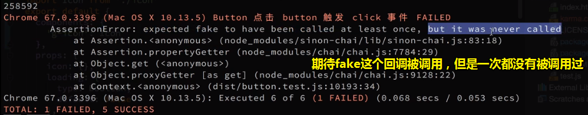

可见，有了单元测试，你看那英文的报错信息，就很容易就能知道我们的代码哪里写错了！

为什么需要fake？

假如你这样写的话：

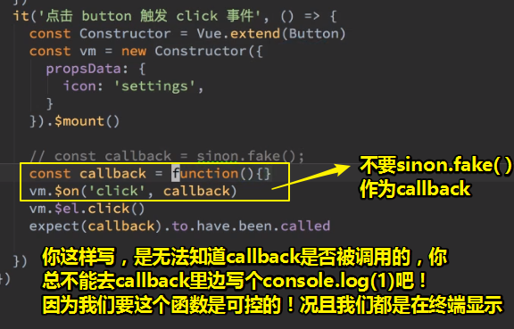

为了测试的严谨性，你不能再callback里写出上这样的代码：

```js
expect(1).to.eq(1)
```

因为这个断言是不可控的，换言之，我写个错误的断言也是可以的，但实际上我们触发的函数确实被调用了啊！我们自己所写的代码咩有问题，但是测试用例就是出错了！所以说我们必须要用个mock函数——它不是一个真正触发被执行的函数，但是它知道要被触发的函数式否被调用了！

总之，用到mock函数的原因是因为我们想我们的断言是可控的、严谨的！

我们要检测一个函数是否被调用了，用原生JavaScript写是很难的，我们借助了sinon这个库是很容易就可以做到的！而fake这个api的原理就像是callback被调用之后，会有个标志位存储callback被调用的标志，配合chai这个断言库，就很容易做到检测一个函数式否被调用了！

总之 `sinon.fake()`这个假函数有个特点就是，知道自己有没有被调用，被调用时传了什么参……

假如你的expect这样写的话：

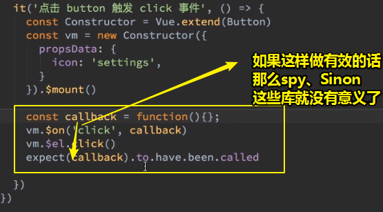

> 我们安装了哪些库？
>
> 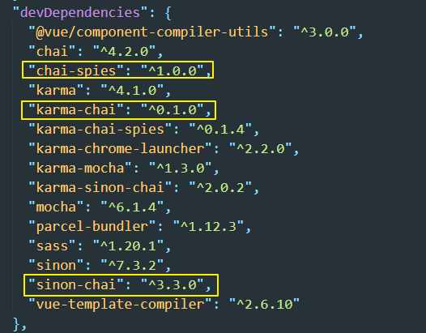

结果：

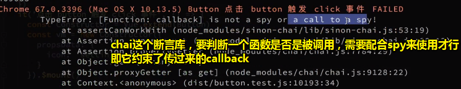

总之，没有使用这些mock函数库的话，那么chai.expect是不知道所传过来的普通callback `functon(){}` 是否被调用的，毕竟chai.expect也是代码啊，它可不会像我们肉眼那样可以查看控制台有没有log输出！对于它而言，就是一个函数表达式参数而已啊！除非你是个fake()，是一个假的函数，让我来大概猜测这个fake()的执行原理：

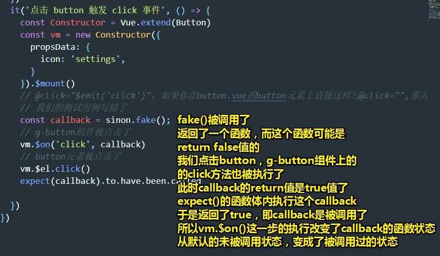

> 突然感觉写测试用例，真得很容易理解我们当初所写的代码到底是在做什么，如为什么要自定义一个icon属性、一个loading属性、一个iconPosition属性、还有为啥需要为button元素上添加@click方法
>
> 这一切的答案都能在测试用例中找到，因为我们这样做了，写了这样的代码:
>
> 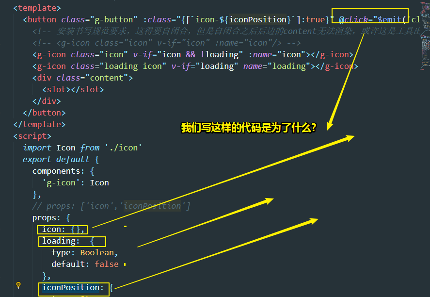
>
> 而当用户写了这样的代码：
>
> ```vue
> <g-button icon="settings" icon-position="right" :loading="loading3" @click="loading3 = !loading3">按钮</g-button>
> ```
>
> 我们就能预期用户在页面上得到了什么样的输出！
>
> 即用户的代码是输入
>
> 组件库的开发者是写函数的人
>
> 而单元测试是判断开发者所写的这个函数是否如期望般的运行，只要拿到函数的输出，就能99%（看你的测试用例写得好不好）预测到页面的最终呈现了！
>
> 总而言之，单元测试就像是你写代码时的思路一样！
>
> 再看BDD：行为驱动开发，你所有的开发是因为你要满足用户的某个行为
>
> 用户写了这样那样的组件标签，并写上了这样那样的自定义属性，并添加了这样那样的@click行为等
>
> 然后我们根据这样的行为，就用代码实现这样的行为会有怎样的预期效果！
>
> 讲真，我还是不理解BDD和TDD的区别！
>
> 难道TDD指的是用户所写代码层次上的描述？而BDD则是代码层面上的思路描述？即BDD这种测试用例在描述上是非常通俗易懂的！
>
> ➹：[TDD与BDD的差别 - Lucas](http://ilucas.me/2016/03/07/difference-between-tdd-and-bdd/)
>
> ➹：[一文告诉你ATDD,TDD,BDD的区别 - 简书](https://www.jianshu.com/p/80929aa1d20c)

话又说回来，fake函数相当于我们之前spy，但是写法上更加简洁：

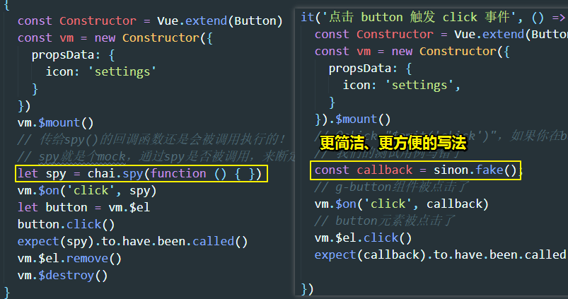

### ◇回顾

回顾三个文件：

1. 在package.json里边写上test
2. 在karma.conf.js里边写上要载入的css和js，以及指定浏览器
3. 在button.test.js里边，用BDD写单元测试，用it隔开每个测试用例，而其中的测试用例内容，用断言来写，而这断言能预测我们的描述行为即可！

### ◇断言该如何写？

> 为啥可以想 `.to.equal('#i-settings')`、`.to.eq('1')`、`.to.have.been.called`这样写？
>
> 这看起来像是神来之笔呀！无法预料呀！

我怎么知道我该如何写测试用例？

#### 两步走

1. 记住一个最万能的语句：

   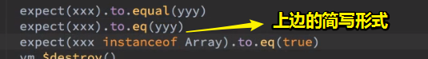

2. 高级点的语句：

   回顾我们选择Expert风格的断言：

   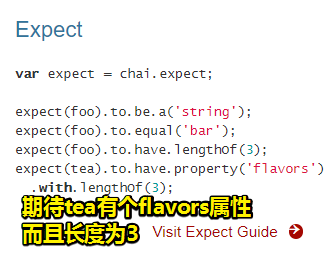

   查看BDD风格的expect：

   ➹：[Expect / Should - Chai](https://www.chaijs.com/api/bdd/)

#### 解析BDD风格的expert API

**①无须理会虚词**

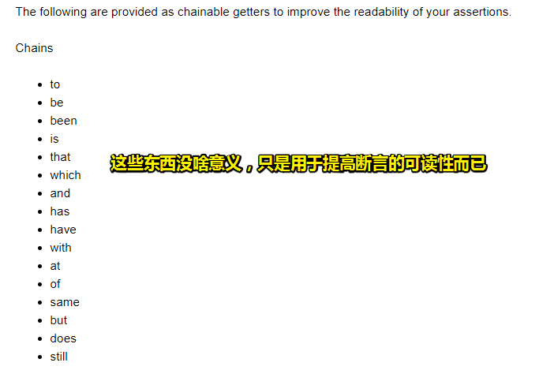

它们的存在就是为了让我们的断言语法变得更好看而已！

总之它们都是虚词，你爱写不写都行：

```js
expect(Button).to.be.ok
//这样写也行
expect(Button).be.ok
```

**②not不是一个虚词**

它表示相反的！

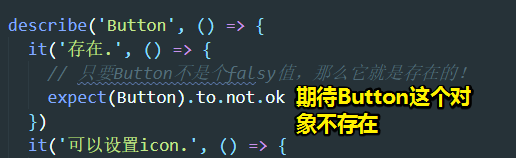

结果：

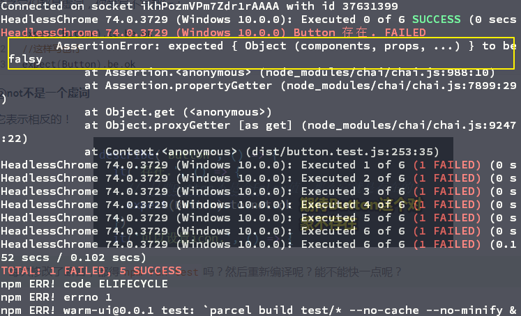

> 每次修改了断言，都得`npm run test`吗？然后重新编译呢？能不能快一点呢？

接下来，不会一个个讲了，直接讲最难的

**③deep**

深相等

```js
expert([1,2]).to.eq([1,2]) //断言错误，显然这是两个不同对象，毕竟地址不同，如 [1,2]==[1,2]也是错的
expert([1,2]).to.deep.eq([1,2])//断言正确，深入进去看呀，元素一致即可
```

总之，不用deep就是比较地址是否一致，用了deep就是比较里面的东西是不是相等！

关于深拷贝和浅拷贝：[js 深拷贝 vs 浅拷贝 - 掘金](https://juejin.im/post/59ac1c4ef265da248e75892b)

**④own**

这个对象是拥有的xxx属性是否是自己的？还是继承的

**⑤`.a(type[, msg])`**

期待一个值是类型的，虚词用a或者an都行

> 这种只看意思，不看语法的表达真好！下次翻译的时候，只需知意即可！无须理会为啥要这样写！

⑥ `.NaN`

为啥有这样的测试用例呢？

根据自己的基础知识可知，NaN是不等于NaN的！

```js
expert(NaN).to.eq(NaN) //测试失败
```

为了以防这种情况出现，才有了这种情况：

```js
expect(NaN).to.be.NaN; //测试通过
```

这就是我们为啥不得不为NaN单独写的断言缘故了！毕竟期望的值是NaN

⑦ `.exist`

```js
expect(Button).to.be.ok
//下面这种姿势更好,直接明白「断言这个Button是存在的」
expect(Button).to.exist
```

之后会遇到奇奇怪怪的断言，所以剩下的API之后说！

记下来我们来讲一下优化！

就是说我们每次改测试用例代码，都得运行一下 `npm run test`

难道你就不能我一改你就自动运行 `npm run test`呢？

不要我等好几秒呢？

那么问题来了「如何做到每次改代码，不用重新build？」

---

## ★使用TravisCI做持续集成

### ◇`npm run dev-test`

> 接下来，看看如何在改代码之后，不需要再重新打包。

这需要用到watch：

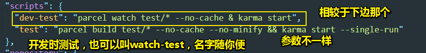

不需要 `--no-minify`，不过这有bug呀！ 运行 `npm run dev-test`会测试两次：

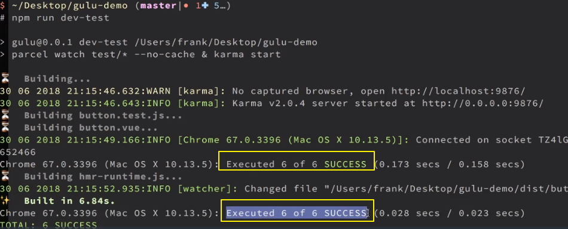

为什么会这样呢？因为有个时间差呀！

首先我们运行了watch命令，然而watch命令第一次运行也是需要打包的！在它还有打包完的时候，karma其实就已经启动了，karma启动完之后就会马上去测试，，于是第一次测试就开始了，等watch运行完第一次编译之后，karma发现文件变了，于是它又运行了一次测试！至此，即便运行多次也没事，毕竟这跟我们的测试脚本没啥关系哈！

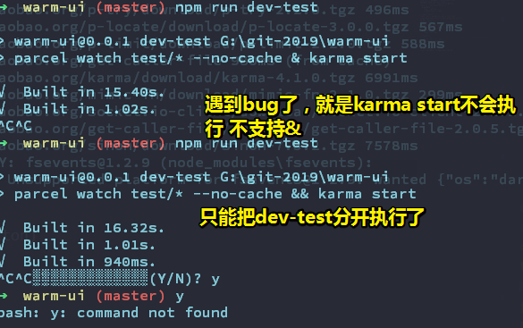

> 不是&和&&的锅！

由于windows执行  `npm run dev-test`，咩有启动karma，所以只好这样了：

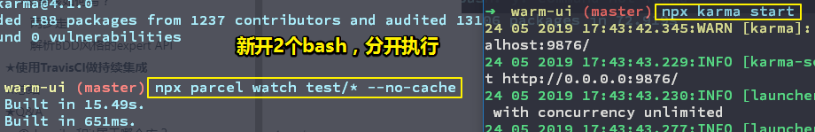

> webstorm使用技巧：离开文件编辑焦点，会自动保存，不需要自己手动保存，好让watch触发！

简单理解一下这个过程：

我们没有改button.test.js的东西，但是改了button.vue里边的东西，所以这就是自动的依赖检查了，而这中间的过程很复杂，当然，我们不需要管这过程是咋样的，只需要知道，我们一旦改了代码，parcel就会重新打包代码，只要重新打包代码，karma就会重新测试！

所以你可以认为这类似管道这样的东西，把parcel打包的输入，交给karma去运行测试，输入一变，karma也会作出测试的反应！

> 只要发现都是绿的结果，那么就说明了「你的代码运行」符合你之前所有BBD的预期！

其实，单元测试很容易就做出来了，但是为啥就有很多新人不会去做这件事情呢？

因为没有人对你提出要求啊！其实这东西并不难啊！

难的就是有没有人告诉你什么叫单元测试、什么叫断言、什么叫spy、什么叫mock……

然后还有什么叫做测试运行器，如karma之类的！

**而这些东西，你只要会一次，那么你这一辈子都会知道，然后你会一直去用它，保证你的代码质量**

目前看看我们的自动化测试做得怎么样（没有对比就咩有伤害）：

1. 以前需要测试一下，就刷新一下

2. 现在只需要不停地写，写完了之后，就看一眼终端这个位置：

   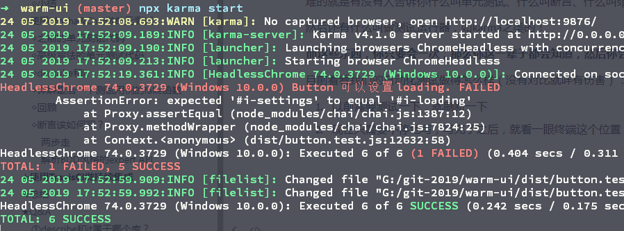

   看看我的代码有没有问题

### ◇还有优化吗？

话说，这还有优化的余地吗？

我们要运行这行命令  `npm run dev-test`才能去进行测试

程序员有一个特点就是「懒」

所以，我懒得连一行命令都不想敲了！

所以来到了最后一步优化，就是能不能做到「什么都不运行，就能自动帮我们的代码进行测试呢？」

话说，这个可以做到吗？——确实可以做到，有以下这么几种方法：

1. 雇一个人帮我运行，但是这费钱啊！
2. 雇一个机器，这个机器每天把我的代码拷过来，然后运行这个测试用例！

思路选择第二个

如何雇一台机器呢？——很幸运的是，有免费的机器可以供大家使用！

目前流行的机器有两个：

1. Travis ci（持续继续服务），可以看看阮一峰的文章，当然，这其实不需要看，你只要用一遍就好了！github上喜欢用这个，没有数量限制，能做几个项目就几个项目
2. circle ci，跟上边的差不多，但是功能更强大，而且有数量限制！一次只能运行一个项目，如果项目多了，就得交钱！

commit提交：

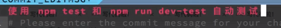

### ◇Travis ci 怎么做？

> 很简单！

先把完美的结果做出来，然后再告诉你怎么做，每一步是什么意思！

#### 做法

1. 于根目录下创建 `.travis.yml`文件，并粘贴这几行代码：

   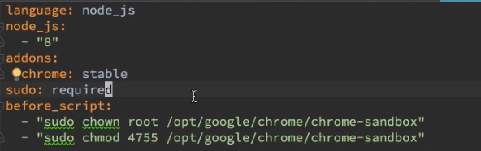

   先不提交

2. 到Travis ci上用github登陆

   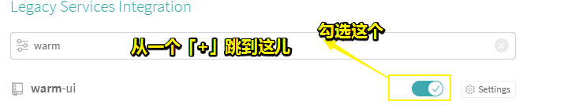

   勾选之后，Travis就接入完成了！

3. commit：

   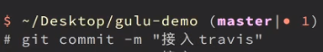

4. 打开travis ci首页，看看测试代码做了什么：

   1. 开机

   2. 安装chrome（用chrome测试的）

   3. 克隆代码

   4. 安装node8、npm、nvm

   5. npm install

   6. npm ls：列出所有依赖

   7. npm test，不需要写run

      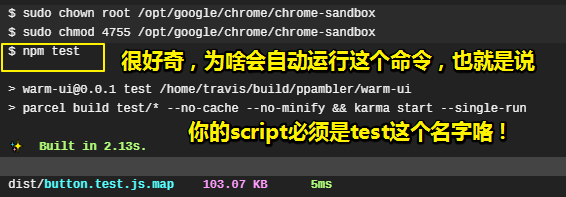

      > 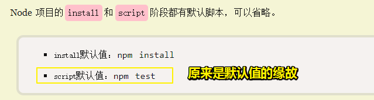

   8. 报错了（chrome起不来，不是代码问题。是配置问题），解决姿势：

      

5. 再次看测试效果：

   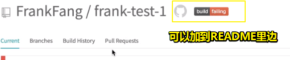

6. 如果测试失败了，会给我们发一份邮件！

   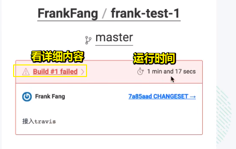

   如果由测试失败状态变成成功，就会发一封邮件过来！如果再次测试，还是成功则不会发邮件，只有测试的状态改变才会发邮件！只有这样才能知道我们的代码现在的是好的，还是坏的。

7. 什么时候会触发自动测试？只要你一push代码，即只要远程仓库代码有更新，就会自动去跑测试代码！

#### 解释.travis.yml里边的配置

1. 语言是nodejs，因为我们测试的时候，跑的是npm，而npm哪来的你呢？nodejs给的啊！

2. nodejs的版本，同时支持多个版本，如8910三个版本

   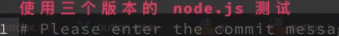

3. 测试需要用到chrome这么一个软件，Travis ci 非常智能，给我们提供了一个插件，我们只需要chrome然后版本号即可！版本是稳定版的，这个最多人用，简单来说，选择最多人用的那个版本即可！

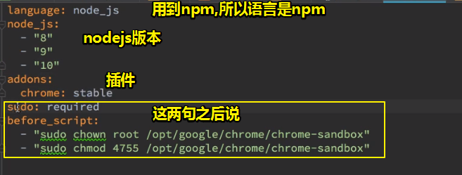

> 所以语言是nodejs
>
> 最后那两个点是英语水平的体现，会英语就能理解了！

关于为啥要测试多个nodejs版本的解释：

好处是目前我们的测试代码支持nodejs8，而且我很想未来nodejs升级之后，还能无痛的变成nodejs9测试

所以测试的时候，每次都测未来的两个稳定版本

目前node的稳定版是10：


所以可以测试10、11

以上就是持续集成了，但是我们只做了持续集成的一部分，即只做了**持续测试**

即只要测试了，我就持续测试

那么持续集成包括哪些部分呢？（一般只做了持续测试）

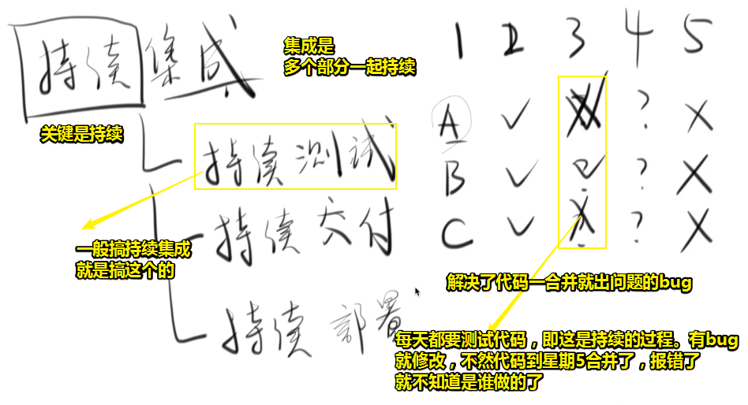

➹：[持续集成服务 Travis CI 教程 - 阮一峰的网络日志](http://www.ruanyifeng.com/blog/2017/12/travis_ci_tutorial.html)

> 这个教程会让你了解钩子和周期的概念，对理解vue有帮助！
>
> 钩子：在某个阶段之前执行什么。假设目前有一个袋子，袋子里边有很多材料，那么钩子会使用袋子里边的材料，然后钩子运行结束后，还会添加新材料到袋子里边，那么下一个钩子的执行，相较于上一个钩子，就会多了很多材料。
>
> 生命周期：从开始到结束。

总之，系统做了持续集成的话，该系统就会比较稳定了！而不会出现一合并全都是bug！

解释后边两句：

理论上不需要加，但是不加就会报错

为什么这样说？这是搜索出来的结果，搜索告诉我只做了上边那几步的话，那么加上后边这两步就不会报错了！

总之，这两句代码是抄的，我也不知道为啥会这样！

接下来要讲的内容是发布我们的代码，让别人可以用我们的代码！

## ★使用npm发布自己的包

现在我们的代码只能自己用

但是，我们写了这么好的自动测试和持续集成以及这么好的UI，而一个人用显然太可惜了。

所以，我想要全世界的前端程序员都可以用！

那么接下来要讲的就是「如何让你的代码可以被全世界的程序员所引用？」

### ◇做法

#### ①确保你的代码测试通过了

> （如果你的代码没有测试通过，就发给别人的话，那么这就是一个非常容易被骂的行为了。）

举个栗子来说，如vuejs的测试用例

来到vuejs的[github](https://github.com/vuejs/vue)：

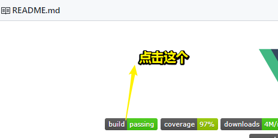

> 这个标如何生成，之后会说到

测试结果：

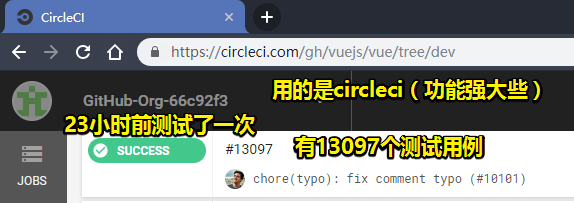

可见这vue需要不停地被测试呀！

查看测试结果，即点击 `#xxxx`

然后，点开 `npm run test:cover`

你会发现：

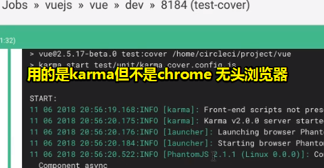

为啥用的是phantomJS（虚构的JS）呢？因为无头浏览器处的太晚了，而当年只有phantomJS能用，所以只好用它了，而它也是个无头浏览器，但是内核不是chrome的！

接下你会看到一堆英文如should什么的来描述测试用例，当然我们用中文写也没事，毕竟中文也是字符哈！

这下，你就知道为啥vue会这么流行了吧！因为它的质量是有保证的！

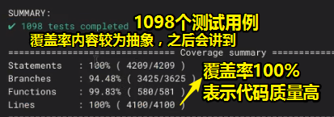

目前我们只做了unit测试，所以只看vue的unit测试，看看它的测试代码是如何写的：

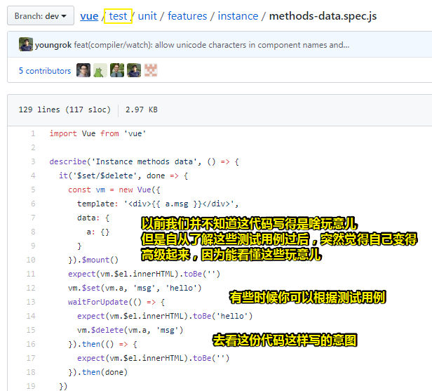

对这个测试用例的人肉代码测试：[demo](./demo/02-人工代码验证vue的一个测试用例.html)，偶然了解了`vm.$nextTick()`的用法！

➹：[Vue全局API总结 - 个人文章 - SegmentFault 思否](https://segmentfault.com/a/1190000011512960)

➹：[vue.js - vue里设置innerHTML的问题 - SegmentFault 思否](https://segmentfault.com/q/1010000014559911)

➹：[判断JS对象是否拥有某属性 - snandy - 博客园](https://www.cnblogs.com/snandy/archive/2011/03/04/1970162.html)

➹：[vue-unit - npm](https://www.npmjs.com/package/vue-unit)

> `waitForUpdate()`这个API来自于vue-unit这本玄功秘籍！难怪会测试通过哦！我们并没有显示引入某个对象，然后使用这个API，因为这个文件自己会根据配置文件自己去找！

所以说，这些东西其实都不难啊！只不过没有人告诉我们应该怎么做单元测试，而且告诉我们怎么做的时间，也不过几个小时就能讲清楚了，可见前端是很容易装逼的！毕竟有些东西没有做过是真得不懂的，一旦你一直没做过的话，那么人家就可以拿「我会做单元测试」来对你装逼，毕竟你是真得不会做啊！然而这实际上你只需要花上个几小时弄清楚就能让人家闭嘴了，就能打他脸了！所以这何乐而不为呢？而且你也不用因为自己是真得菜！

总之，**你得保证你的测试全部通过，如果有问题的话，请不要发布你的代码！**

> Vue所做的单元测试所用的库跟我们的不同（如vue没有用chai，而是jasmine，而我们用了chai），但是所做的意思都一个样，没啥区别！反正都是那个意思！这是姿势稍微有点不一样而已。
>
> 目前，前端的单元测试语法基本上是相通的，只是稍微有点小的区别而已！

#### ②确保你的代码上传到了 npmjs.org

> 这个该怎么做呢？

我们知道现在的前端主要是通过npm来装别人的代码的！

所以你要分享你的代码给别人用的话，那么你应该把代码上传到npm，然后那个人再通过npm下载你的代码！

做法：

1. 进入package.json，改一下你这个项目的版本号！不要写成是 `1.0.0`（采用语义化版本SemVer命名方式 )，因为写成这个版本表示你整个框架都已经写完了，然后你发布了第一个大版本！所以目前我们最好改成是  `0.0.1`，即表示一个非常初级的版本，总之你就**改一下版本号**。

   

2. 你需要告诉npm你要导出的文件是哪些？

   于是，我们新建一个index.js，而这个index.js就是默认的我们的程序入口，而这个入口里边，你要写上你要导出的所有东西，那么我们要导出哪些东西呢？

   1. 目前我们写了三个组件，那么这3个组件就是我们需要导出的！
   
      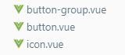
   
   2. 确定要导出的文件之后，那就开搞了，那么这如何导呢？
   
      1. 引入 `import` 这3个文件到`index.js`里边，即把这3个文件加载到 `index.js`里边去
      2. 导出它们，即`export`
   
      总之，先加载这3个文件，即导入到`index.js`里边，然后把这个`index.js`作为入口文件再导出去。至此，这个index.js就写完了，简单来说就是「把你需要导出的组件一个个挑出来」，**需要注意的是，不要一下导出所有组件**
   
      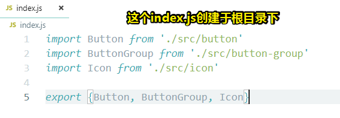
   
      > 可以把这个index.js抽象为1个设备独立像素，即1个CSS像素！
   
3. 到package.json加个叫 `main`的key，当然，默认已经加了。总之，你必须保证 `main`的值与入口文件 `index.js`文件名一致

4. 上传，那么怎么上传呢？

   1. 到[npm官网](https://www.npmjs.com/)注册一波，就像是玄幻小说里边，到玄功殿里边登记一下，然后你就可以上传你的玄功秘籍啦！

      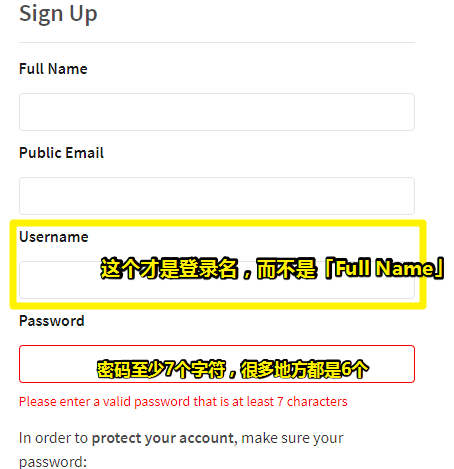

      > 关于这个密码，请注意不要用chrome浏览器自动给的密码，因为之后我们会在命令行手动输入这个密码，由于chrome的密码太过复杂了，所以你懂的。

   2. 注册好之后，会给你发一份邮件，需要注意的是，你一定要打开那份发过来的邮件，以确定这个邮箱是你的！不然，凭空写一个人家的邮箱地址的话，显然是GG的行为。总之，请点击那份验证邮箱的url，不然你是不能上传的！

   3. 在当前项目运行 `npm adduser`，即把user加到这个项目里边去

      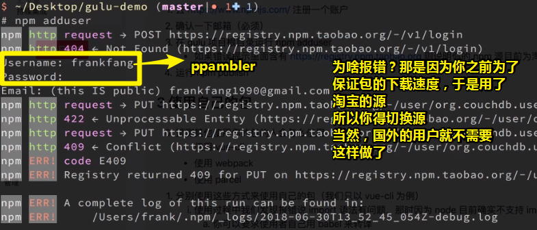

      那么如何切换源呢？

      先 `npm config list`一下，然后这样：

      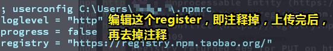

      编辑 `.npmrc`这个文件，即注释

      之后再来一遍 `npm adduser`

      出现 `Logged`二字即登录成功！

      

      > 注意，登录密码不要输错了。还有一点你需要注意的是，修改了 `.npmrc`文件，就重启一下Bash。

   4.  接下来是上传，即`npm publish`，即把你的代码变成公开的！在回车之前，你最好到package.json里边改一下项目名 `name`（如果名字很辣鸡，是不给你上传的，如 `wram-ui-20190615`，当然，你可以改成 `warm-ui-test-1`），以免出丑（这名字人家搜索不到），毕竟功能没多少，等功能有了之后，再换个好一点的名字

      **注意，在publish之前，先把之前所做的更改给提交上上去，不然会出问题哈！**

      遇到的问题：[⑧](#ba)

   5. 测试，到一个xx目录，运行一下 `npm i wram-ui-test-1`

      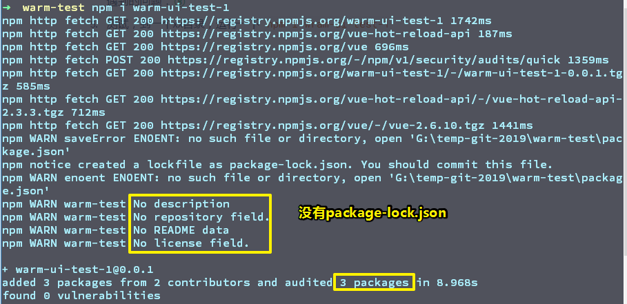

      我们上传了所有代码：

      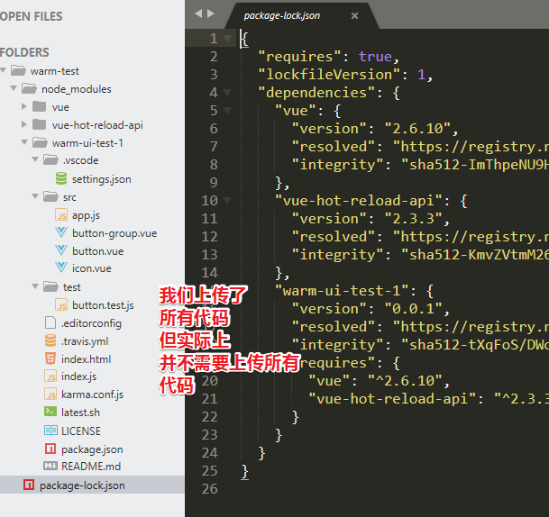

      目前就把所有代码都上传了，之后会讲「如何把没有用的代码给废弃掉！」

#### ③使用自己的包

> 确定自己的代码别人是否能用

虽然已经上传成功了，但是我们无法确保我们的代码对于别人来说是否能用

所以，我们要自己使用一下自己的包，以此来确保别人也能使用

那么如何确保呢？

1. 猜测别人是如何用我们自己的包的。

   我们知道这个包是一个基于vue的轮子，那么用我们这个包的人肯定是使用vue的用户啦！所以我们就猜vue的用户会怎么使用我们的代码！

   猜测TA有三种姿势使用我们的包：
   
   1. 使用vue-cli
   2. 使用webpack
   3. 使用parcel
   
   理论上来说，我们这是三种情况都要测，但在这里我们就只测vue-cli，毕竟它比较方便

开搞（模拟其它人使用这个包的心路历程，用户做什么你都得考虑到）：

1. 假设我是xxx用户

2. 我想使用 `warm-ui-test-1`这个包

3. 由于我是vue的爱好者，所以打算用vue-cli

4. 到[官网](https://cli.vuejs.org/zh/guide/)看看vue-cli是如何使用的：

   1. `npm install -g @vue/cli`（由于之前切换了npm源，安装起来会比较慢，所以请改回淘宝源，当然，你也可以用[cnpm](https://cnodejs.org/topic/552212ba01b6c9310d8e9959)，直接切换为cnpm命令就好了，而当你发布的时候就用npm）

      > 我没有切换npm源，我用代理直接下载这个包。花费的时间大概5min左右
      >
      > 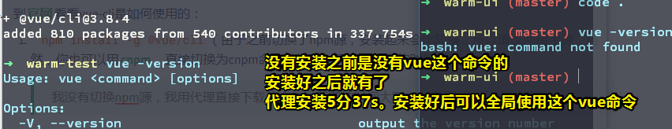
      >
      > 注意，npm安装这些包，都是基于node去发请求的。还有如果之前已经全局安装过 `vue-cli`，那就不用安装了
      >
      > ➹：[vue-cli3.0搭建与配置 - 简书](https://www.jianshu.com/p/9b7350f9f943)

   2. `vue create hello-world`（配置（babel or eslint）选择默认的，即直接回车。默认是使用功能yarn这个工具，所以还要测yarn，可见，在模拟用户行为的这个过程里边，需要考虑用户的方方面面，而不是说把轮子代码写好就行了，毕竟代码是最简单的一部分）

      > 使用该命令的话，如果你在 Windows 上通过 minTTY 使用 Git Bash，交互提示符并不工作。
      >
      > 所以你得 `winpty vue.cmd create hello-world`这样才行
      >
      > 当然，你可以设置别名：`alias vue='winpty vue.cmd'`
      >
      > 然后 `source .bashrc`一下使更新后的 bashrc 文件生效，当然重启bash也行
      >
      > 注意，在执行这步之前，最好先切换为淘宝源，不然安装时间挺久的。而且我安装默认的是npm

   3. 项目创建好后，小白根据提示：

      ```basg
      cd hello-world
      yarn serve
      ```

   4. 小白打开第一个应用，即 `yarn serve`，注意：npm的是 `npm run serve`

5. 小白想使用我们写的组件

6. `npm i warm-ui-test-1`（没有写多少代码，但是安装挺久的，毕竟vue有挺多依赖的），然而报错了，因为小白用的是yarn，由于yarn和npm是不能混着用的，不然可能会出错。所以你得先 `yarn install`一下，然后 `yarn add warm-ui-test-1`

   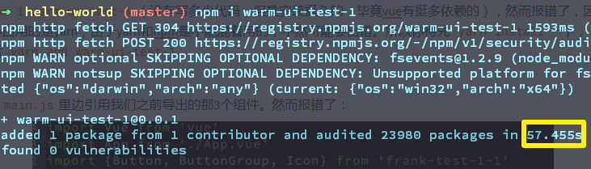

7. 在 `main.js`里边引用我们之前导出的那3个组件。然而报错了：

   当我做了这样的操作：

   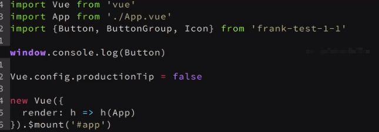

   结果：

   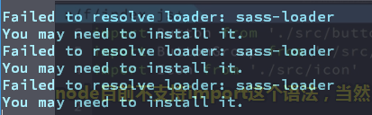

8. 为啥会报错？

   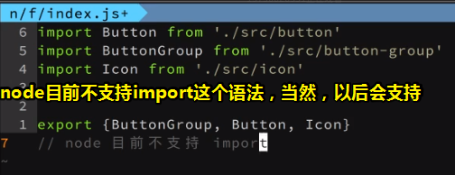

   这样一来我们使用import、export语法导出轮子和用户使用轮，即import轮子就矛盾了呀！所以我们不应该直接把import的语法暴露给用户，而是用babel把它们变成可执行的JavaScript，然后再暴露出去！

   总之，我们目前遇到的问题是「用户无法使用我们的代码！」

9. 解决方案：用户有两种选择或者写轮子的我们有两种选择

   1. 让小白自己使用babel自己转译，即自己取配webpack等，配好了就可以转译了。然而这种做法对于写轮子的人来说，这是一种大忌呀！毕竟，你直接提供一个非常好的，可以直接用的版本才是更好的！
   2. 写轮子的人自己转

10. 写轮子的人自己转：

    1. parcel有一种用法是可以指定要编译的文件，而不是整个项目。由于编译好的文件会放到dist目录里边，所以你要修改一下 package.json里边的main值 `dist/index.js`

       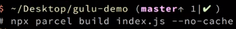

       > dist目录里边都是打包后的残余垃圾，而且我们gitignore了，不过我们发布npm包的话，它会一起发布上去的！

       然后git push一下，commit字段为：`dist/index.js`

       再次发布，你需要修改一下版本号（改为0.0.2），不然会发布失败！ 

       git push一下，commit字段为：`bump version`，表示升级版本之意

11. 小白需要更新包：直接 `yarn add warm-ui-test-1`

12. 测试成功，拿到一个组件对象，然后我们试着把它加到代码（不要加到main.js，毕竟无法体现效果）里边：

    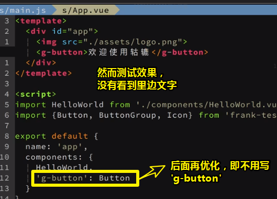

    编译index.js的时候加个这个就没事了（毕竟slot被吃掉了）：

    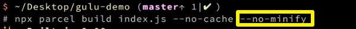

    编译好之后，更改版本号，然后可以直接发布版本号，不用再git push一下

    然而这样做实在是 弟弟 行为啊！修改一点东西，就得重新发布npm包，给xx用户测试一下！

    小白用户，再次 安装该轮子包。

    再次测试，拿到想要的结果了。

    

可见，每个工具的使用都会有些奇奇怪怪的bug，你需要花很多时间去解决它的bug，所以工具越复杂，你越难把这个东西做好，所以尽量选择简单一点的工具。比如为啥使用parcel打包的时候需要 `--no-minify`?

解决没有样式这个问题：

回顾打包的过程：

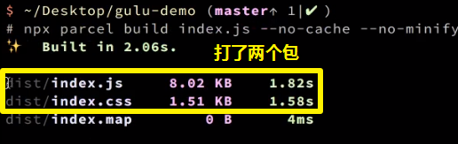

因此，我们需要手动引入这个CSS

那么能否自动引入呢？——一般不需要自动引入，不然，你把这两个文件放在一起的话（把css放到JavaScript里里边），会显得很大，而分开来会有缓存。

那么我们该怎么办呢？

让小白自动引入：

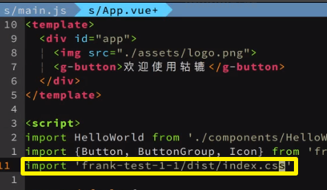

测试结果：


之前我们写轮子用到的颜色是来自于我们自定义的：


所以，我们需要在文档里边说明「如果你需要组件有颜色，请把 `html{--button-height: 32px;……}`这段代码给抄过去」

可见，我们目前的轮子代码，是有很多处不完善的，尤其是当你以使用者的角度去看的时候，你会发现自己写的button还是这么烂啊！总之，你要做好一个button需要很多精力呀！

解决颜色问题：

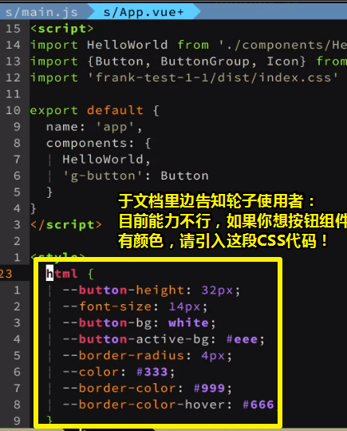

效果：

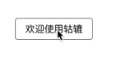

目前，我们磕磕碰碰的完成了：

1. 我们上传代码
2. 用户
   1. 自定义颜色
   2. 引入自己想要的组件
   3. 引入组件的CSS

### ◇小结

1. 我们没有写代码，还是再做工具链的配置。
2. 这个发布过程只要在大公司里边写轮子的人才会看到。写轮子的程序员很幸福，毕竟不需要写业务，只要安心的去做为社区服务这件事就可以了，而且还会被社区认可！（这样的公司很少，目前只有阿里）
3. 确保测试用例通过，当然，并咩有测试覆盖100%通过！
4. 上传代码到npm.js，就是两个命令的事儿，注意不要上传到淘宝那里去，毕竟淘宝没有供你注册npm的用户呀！
5. 请以使用者的角度去想、猜测「使用者会如何使用我们写的包」。 测试出的问题，你都得要解决，而且这些问题的出现是没有边界的，总之没有一本书会告诉你，别人用你的代码会出现什么问题！那么你只能自己去测了。
6. 测试出的问题
   1. 没有转译
   2. 打包时需要加 `--no-minify`，不加会有bug
   3. 样式问题
7. 全局样式（用户引入的那段CSS代码 `html{}`），使用CSS变量兼容性并不好，而且这样的语法，很多人也不知道，之后会改成sass。
8. 目前，在开发中还有一个很大的困难，那就是每次改一行代码我都得要上传到npm。接下来会讲，「如何不上传代码到npm，就能测试我们的代码被别人用的时候会不会出bug。」简单来说，就是不上传代码到npm上，就能有类似上传到npm的这样的测试使用体验！

## ★npm link的使用

### ◇一个理念

很少有人会专门说起这个理念，那么这个理念是什么呢？

那就是：

> 解决问题的关键是「**加快**解决问题的效率」


那么这是啥意思呢？

自小听过一个故事，或许这个故事是在讲人类是如何如何聪明的

但是自打当了程序员以来，我从这个故事里边悟到了一个不一样的规律

这个故事是这样的：

很久以前，有一个富豪，偶然经过某处地方，看见了两座悬崖，就像这样：

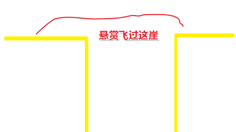

由于自己很喜欢飞行物，于是就进行了悬赏说「谁能做一个飞行物，能越过这个悬崖，就能得到这笔非常非常丰厚的赏金」，当时，并咩有所谓的热气球，更不用说所谓的滑翔伞了。

当这个消息一出来之后，世界各地的飞行爱好者就从四面八方赶过来了。

他们想了各种方法试图飞过悬崖，当然，聪明的人还是有的，其中有个人就拿到了这笔赏金！

那么这个人是怎么飞过去的？

这个人他根本就不知道怎么飞过去，但是他解决了一个问题，那就是「他所做的飞行物材料非常容易改造」，而这意味着他制作的飞行物要最终飞过这崖需要失败很多次

他第一次飞失败了，然后他就总结为啥会失败，比如翅膀太长了或者翅膀角度不对

第二次又失败了，但是没有关系，继续改造

……

做了接近100次之后，他就成功了

从第一次失败，到最后的成功，用了才3个月

而别人做一次飞行物，就得用一个半月

所以回到之前说到那句话：

> 有的时候解决问题的关键是「你要**加快**解决问题的效率」

其实，**这个问题是怎么解决的，大家都不知道，但是如果你解决问题的频率更快，那么你得到最终正确答案的几率也会更大！**

或许中文会有对应成语……

总之，通过这个例子，你可以好好感受一下芳芳所总结出来的这个规律

其实在学芳芳的系统班课程的时候，我就模糊知道了这个规律，即不停地试，有时候我也不知道为啥这问题就解决了，但是就是解决了，其中的原理，有些知道，有些并不知道，你可以说我「知其然，不知其所以然」（我认为这句话并不是绝对的贬义）。**但不管怎样，问题就是解决了。**

### ◇解决造轮子的效率问题

我们其实并不知道如何写这个轮子才是最好的，但是如果我们能够加快造轮子的效率，就会有更大的几率到达最好的状态！

目前的效率瓶颈：

1. 每次改代码，然后publish，xx用户就得重新安装一下这个包。那么我们能不能先调好之后，才给xx用户使用呢？

做法：

1. 改动代码，随便改动你的轮子代码

2. 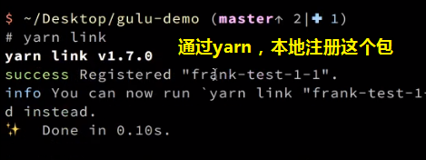

   我的测试效果：

   

3. xx用户得到最新的代码，即更改后的代码（注意：必须是本机的用户）：

   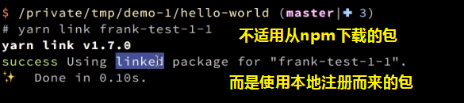


至此，我们就省去了「上传轮子和用户下载轮子」这一步。

可见，我们的开发效率又加快了一点。

测试icon组件：

出问题了，因为用户咩有引入iconfont.cn，之后会解决

注意：每次更改了组件代码，都得要重新打包一下index.js：

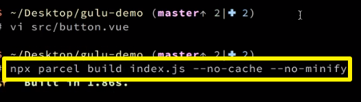

小结：

1. 两次link之后，造轮子这边修改代码之后，就重新打包。结果就是，xx用户无须重新下载就能用最新改动的代码，而造轮子的我们也无须publish。可见我们不需要找一个xx用户就能测试我们的轮子到底好不好用了。

### ◇我自己的测试

1. xx用户使用 `console.log()`测试组件是否被引入了：

   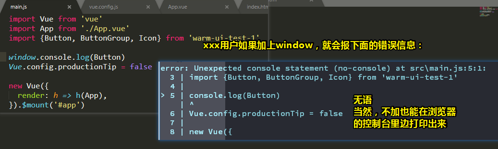

   这是eslint报的错误

2. warm-ui作者修改了组件代码之后，需要重新编译index.js一下，才能直接给xx用户使用最新的代码。当然，前提是轮子作者已经 `npm link`，xx用户已经 `npm link warn-ui-test-1`，这两条命令执行一遍即可！而编译index的那个文件需要经常执行。

   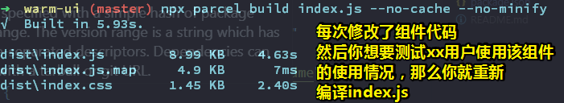

   至此，解决了publish的问题。极大的提升了测试轮子使用有无bug的效率。

3. xx用户使用我们发布轮子：

   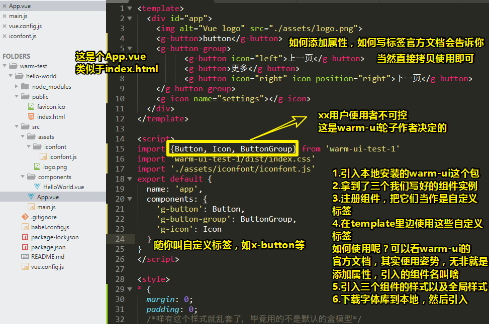

   注：我理解错了呀：

   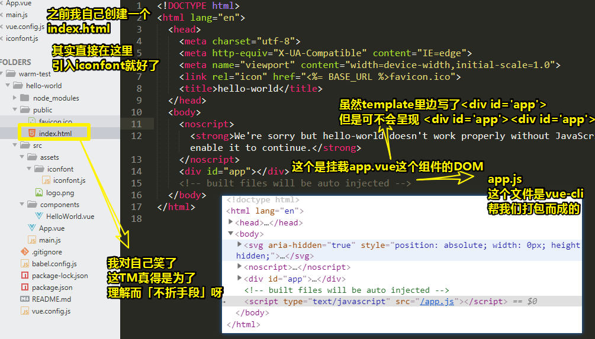

   > 注意，页面里边的 `id='app' `来自于`App.vue`里边的 template标签里边的`id='app'`，如果你去掉了id属性，那么页面呈现的就是没有id属性的
   >
   > 简而言之，app.vue里边的template内容替换了index.html里边的 `<div id="app"></div>`，可以看做这是个占位符，当然你也可以直接添加class属性，但是就是不能改id属性app值为其它的值，如xxx，不然app.vue找不到挂载点。
   >
   > 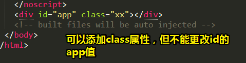
   >
   > 总之，保证index.html有 `id="app"`，咩有它app.vue就找不到挂载点。
   >
   > 保证app.vue有 `id="app"`，咩有它，那么整个页面都没有app这个id，即便index.html有 `id="app"`也是白搭。
   >
   > 总之，这两个都写上呗！

   效果：

   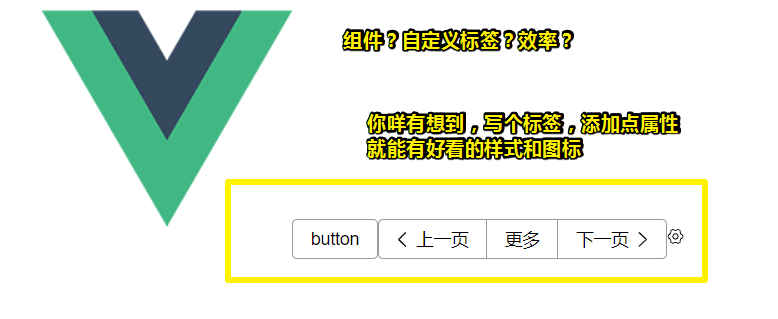


### ◇回顾

1. 目前完成了一个轮子，但其实是三个（button、icon、button-group），不过它们都是相关的
2. 造一个轮子用到了非常多的知识

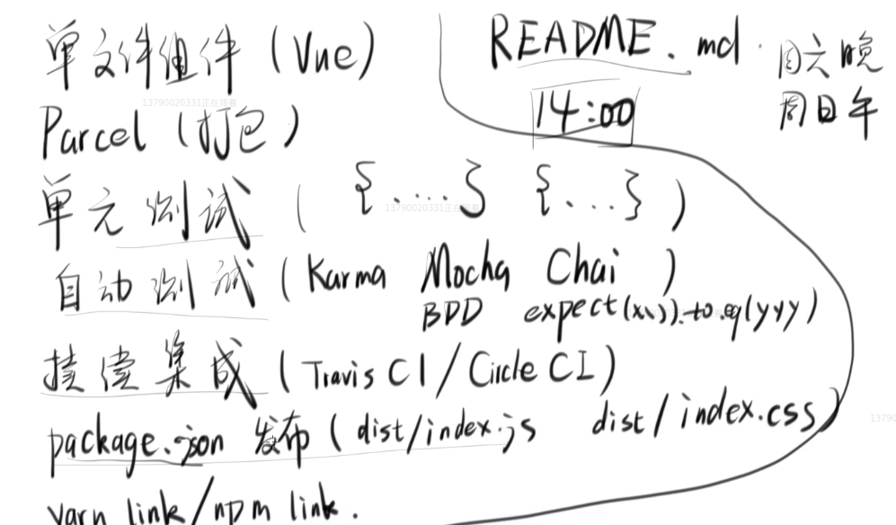

> 小的知识点就不回顾 了，直接回顾大的知识点

1. 做了一个单文件组件，这全都属于vue的知识，而在我们这节课里边属于非常小的一部分

2. 使用parcel打包

3. 单元测试，没有用任何工具，直接使用一个大括号，然后测试、关闭……再写个大括号、测试、关闭……这种测试方式是可以的，但是不太直观

4. 自动测试，使用karma作为测试运行器（打开浏览器，然后进行测试）、使用Mocha作为测试框架（它提供了describe和 it，使我们可以实现BBD风格的测试写法，请回想之前的测试代码画面）、使用chai来做断言库（使得我们可以写出这样的语法 `expert(xx).to.eq(yyy)`）。

   这3个库一定要会用，当然，你不需要去了解它的细节，会有即可

5. 持续集成：其实我们只用了持续测试，可见，我们的知识点还是整个工程化里边很小的一部分。我们使用功能的Travis CI，而Vue用的是Circle CI，之所以用前者，是因为好配置，当然，它们俩差不多，区别就是语法配置不一样罢了。

6. 如何去写package.json？为啥要写它呢？——因为写了它之后，我们才能发布我们的轮子包。那么package.json里边写什么呢？告诉用户我们输出的所有JavaScript是 `dist/index.js`，而CSS是 `dist/index.css`

   有人建议这个两个放在一起，但是这不太灵活，而分开则灵活一点，所以这是个权衡的问题。

7. 最后讲了如何用`yarn link`来加快我们造轮子的过程，如果要测npm的话，你就把两边的命令变成npm即可！这是一样的。

以上就是需要去关注的大型的知识点

之后的内容就比较轻松了，直接按照上边的节奏搞就可以了

那么要讲的内容有哪些呢？

1. 如何写README？——如加上测试结果，展示给使用者！
2. 写完README就写其它轮子，而其它轮子显然要好写得多，毕竟我们整套框架已经搞起来了。我们不需要改什么，我们唯一要做的就是添加不同的测试用例，然后它会自动测试，自动持续集成，然后还是用同样的方法发布，同样的方法模拟xx用户使用该轮子包去测试

总之，这节课就把我们整个轮子课的知识脉络给串起来了。

这节课的效果检测：

1. 做的东西能发布出来
2. xx用户可以使用vue-cli来使用我们发布的包

**做到了这两步，我们整个轮子课已经完成了一半，当然剩下的一半，那就是继续撸轮子代码啦，即写一个个基于vue的UI组件。**

---


## ★总结

- 「为什么」就像是一根线一样，串联起了那些游离的知识点。为什么上节课做了单元测试之后，还要做自动化的单元测试。因为「懒」啊！我们不想打开浏览器，刷新页面，然后运行我们的单元测试。我们只想在终端敲下一个命令就能把这些活儿给做了。

- 每做一步，都有其目的存在。芳芳所讲的内容，都是一个小问题接着一个小问题来讲，最后把整个大问题都解决了。或者先把整个大问题解决了，然后分小点讲解是如何解决的！

- 所谓的捷径指的是比之前那种姿势要快一点，可以说捷径无止境……买教学视频是走捷径吗？是走捷径啊！不买教学视频看书也是走捷径吗？也是走捷径啊！只是前者相较于后者更捷径啊！或者说是，其实并没有所谓的捷径，只是方式方法不同而已！

  或许编程真得没有捷径！

- 上传带宽，当你在直播的时，是需要上传带宽的，而你git push时也是需要上传带宽的，所以后者会很慢！

- 框架搭建好了，那么接下来就是加快节奏写轮子了。

## ★Q&A

### ①describe和it属于哪个库？

属于Mocha这个库！

你可以看到我们button.test.js这个文件，这个库我们并没有引入，因为它是自动引入的！

总之BDD行为驱动测试是由Mocha这个库搞的

而expert断言则是由chai这个库搞的！

### ②什么叫持续集成？

很多东西，你只有做了，你才会知道它是什么

如果直接用文字描述说一遍，是很难描述的，毕竟这有图形界面啊！

### ③无头浏览器？

头，指的是chrome的界面，无头浏览器即没有界面的浏览器，毕竟我们测试的时候不需要用眼睛看哈！只看log即可！所以要界面有何用呢？

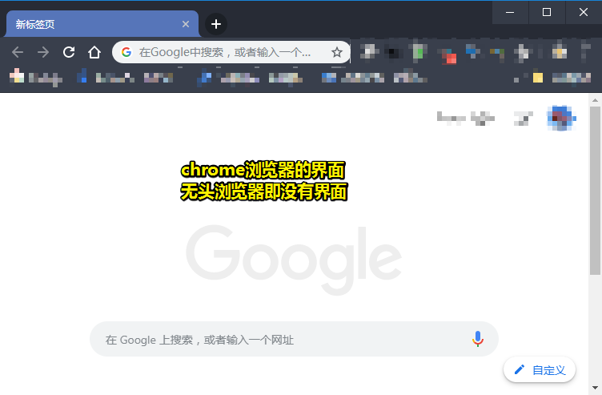

### ④有没有windows 服务的ci？

需要单独去弄，因为windows不是开源的，如果Travis ci装的是windows是要给钱的

况且nodejs是跨平台！不需要用windows的系统！

### ⑤没有no-minify？

是会报错的，因为parcel是会压缩代码的！

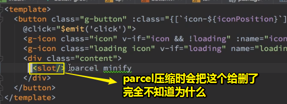

所以。后边我们肯定是不会用parcel的！

现在就加着先，毕竟parcel很方便，不用配置哈！

毕竟webpack现在讲的话，得讲好几节课，而且有各种各样的问题！

### ⑥npm 与 node 的关系？

**node.js是javascript的一种运行环境，是对Google V8引擎进行的封装**。是一个服务器端的javascript的解释器。

包含关系，nodejs中含有npm，比如说你安装好nodejs，你打开cmd输入`npm -v`会发现出啊线npm的版本号，说明npm已经安装好。

引用大神的总结:

> 其实**npm是nodejs的包管理器（package manager）**。我们在Node.js上开发时，会用到很多别人已经写好的javascript代码，如果每当我们需要别人的代码时，都根据名字搜索一下，下载源码，解压，再使用，会非常麻烦。于是就出现了包管理器npm。大家把自己写好的源码上传到npm官网上，如果要用某个或某些个，直接通过npm安装就可以了，不用管那个源码在哪里。并且如果我们要使用模块A，而模块A又依赖模块B，模块B又依赖模块C和D，此时npm会根据依赖关系，把所有依赖的包都下载下来并且管理起来。试想如果这些工作全靠我们自己去完成会多么麻烦！

➹：[nodejs和npm关系 - weiyastory的博客 - CSDN博客](https://blog.csdn.net/weiyastory/article/details/54379805)

➹：[nodejs中npm深入理解 - guangbing8877的博客 - CSDN博客](https://blog.csdn.net/guangbing8877/article/details/60471721)

### ⑦关于版本号的那些事儿？

➹： [论版本号的正确打开方式 - Taobao FED - 淘宝前端团队](http://taobaofed.org/blog/2016/08/05/instructions-of-semver/)

➹：[版本号命名指南](http://wsfdl.com/devops/2016/09/27/%E7%89%88%E6%9C%AC%E5%8F%B7.html)

### <a id="ba">⑧You do not have permission to publish ？</a>

在publish之后的报错信息：

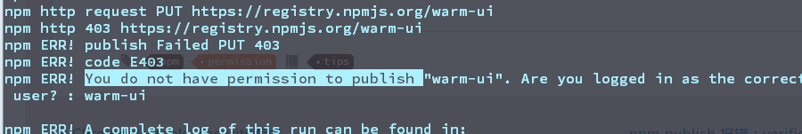

`hava permission` 没有权限，说明你发布的这个包在npm上已经被注册过了，你需要在package.json中改个名字。

还有：

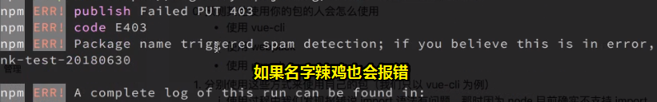

还有：因为代理问题

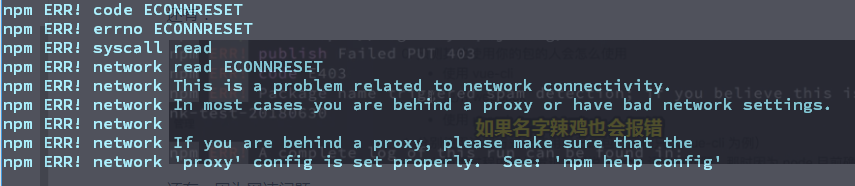

处理（使用proxifier这个软件，前提是你使用了shadowsocks科学上网了）：


结果：


➹：[npm publish 报错：You do not have permission to publish - zj-john's blog](https://zj-john.github.io/tips/cjc9zvmn20001tgf0a4v48mz6.html)

### ⑨ `vue init <template-name> <project-name>`和 `vue create hello-world`创建vue项目的不同？

后者相较于前者要快很多！而且目录结构要简单很多！

➹：[Vue-cli 安装和目录结构解析 - 简书](https://www.jianshu.com/p/4fd1c942762d)

➹：[vue-cli3.0搭建与配置 - 简书](https://www.jianshu.com/p/9b7350f9f943)

### ⑩Vue-cli 项目目录解析？

```
|-- build                            // 项目构建(webpack)相关代码
|   |-- build.js                     // 生产环境构建代码
|   |-- check-version.js             // 检查node、npm等版本
|   |-- dev-client.js                // 热重载相关
|   |-- dev-server.js                // 构建本地服务器
|   |-- utils.js                     // 构建工具相关
|   |-- webpack.base.conf.js         // webpack基础配置
|   |-- webpack.dev.conf.js          // webpack开发环境配置
|   |-- webpack.prod.conf.js         // webpack生产环境配置
|-- config                           // 项目开发环境配置
|   |-- dev.env.js                   // 开发环境变量
|   |-- index.js                     // 项目一些配置变量
|   |-- prod.env.js                  // 生产环境变量
|   |-- test.env.js                  // 测试环境变量
|-- src                              // 源码目录
|   |-- assets                       // 资源目录 
|   |-- components                   // vue公共组件
|   |-- store                        // vuex的状态管理
|   |-- App.vue                      // 页面入口文件
|   |-- main.js                      // 程序入口文件，加载各种公共组件
|-- static                           // 静态文件，比如一些图片，json数据等
|   |-- data                         // 群聊分析得到的数据用于数据可视化
|-- .babelrc                         // ES6语法编译配置
|-- .editorconfig                    // 定义代码格式
|-- .gitignore                       // git上传需要忽略的文件格式
|   |-- .postcssrc.js                // 通过JS插件装换样式的工具 
|-- README.md                        // 项目说明
|-- favicon.ico 
|-- index.html                       // 入口页面
|-- package.json                     // 项目基本信息
```

### ⑪错误：无法创建子进程: 没有可用的终端 (-1)？

直接把打开的所有bash给关了，然后再打开！


### ⑫ 执行`npm run serve`报错 `No ESLint configuration found.` ？

```JavaScript
// vue.config.js
module.exports = {
  chainWebpack: config => config.resolve.symlinks(false)
}
```

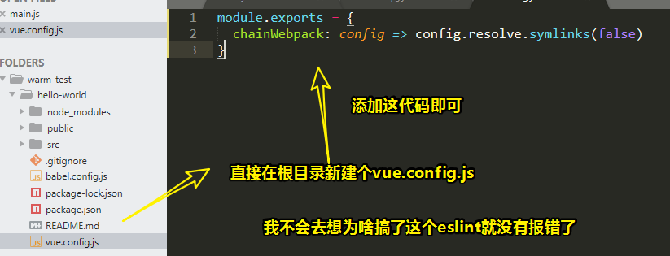

➹：[Module build failed. No ESLint configuration found. · Issue #2948 · vuejs/vue-cli](https://github.com/vuejs/vue-cli/issues/2948)

### ⑬在vue项目里边引入外链iconfont？

使用vue-cli为我们创建的vue项目，并没有index.html文件，即便自己创建了，预览首页的时候，也不是该文件。

而是那个 `App.vue`，即页面入口文件，它是个root组件，就像下边这图所展示的那样：


> 这个App.vue就是处于最上边那个节点，倒过来就是一颗树的根，即根节点。

我查了import的语法，它并不能引入外链的JavaScript啊！只能下载到本地然后再引入：

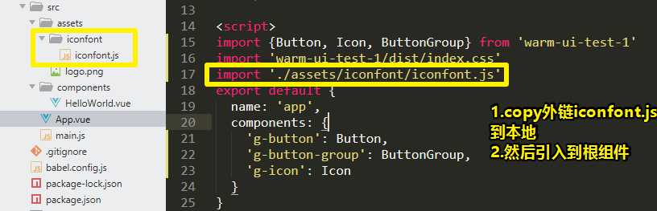

其实，publish目录下边有个index.html文件，不然，这个App.vue是怎么挂载到页面上的？难道是石头蹦出来的吗？

别忘了，我们是在搞单页应用呀！

➹：[ES6神奇的import...from...命令 - 简书](https://www.jianshu.com/p/c0be35475e54)

➹：[javascript - vue单页面文件中怎么引用外部链接中的js方法 - SegmentFault 思否](https://segmentfault.com/q/1010000015394351)

➹：[import - JavaScript - MDN](https://developer.mozilla.org/zh-CN/docs/Web/JavaScript/Reference/Statements/import)

⑭⑮⑯⑰⑱⑲⑳