# 框架搭建 & 持续集成（中）

## ★添加icon

> 今天的任务：**把button全部实现，重点是单元测试！**

### ◇测试之前的代码能否正常运行

运行之前的代码，直接用webstorm打开页面，结果报错了：

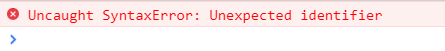

于是我们用了log大法（工具类知识，会用即可）：

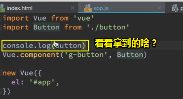

> 我们的代码就注册了一个全局组件而已

结果：

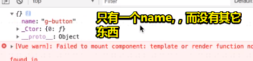

由于我们这个代码过于简单，且代码量少得可怜，所以不应该是我们代码的问题，而是很有可能是工具的问题，即parcel的问题：（估计是缓存的问题）

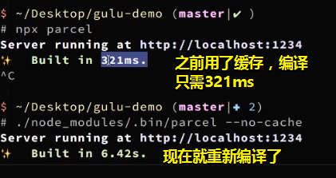

清空缓存重新编译后，结果按钮也就出来了！报错信息什么的也不复存在了！

总之，确定代码没有问题的话，那么你就开始怀疑工具的问题，而且强烈认为这一定是工具的问题哈！毕竟我们这个代码实在是够简单的，是不可能出错的！

### ◇开搞

按钮里边的两个字应该传进去，而现在我们的代码所呈现的是写死的状态，即写死在button里边

接下来我们要做什么（根据样式，即设计稿来决定做啥）：

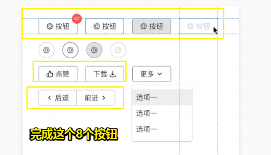

1. button里边的「文字」二字是可以直接传进去的
2. 搞icon
3. 搞两个放在一起的button

总之就是把8个按钮（除了那个下拉选择按钮）以及其样式做出来即可！

#### 处理文字

如果没有插槽，你把g-button当作是普通元素来使用的话，直接添加内容是没有效果的，因为此刻的作用域是属于`#app`的！为了可以让我们的g-button元素能像button元素一样使用，于是我们使用了slot，即插槽！

至此：

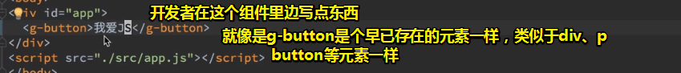

slot的作用就是把「我爱JS」这样的内容放到一个槽里边，这类似于暗黑破坏神里边的每个武器（button组件）都有一个镶宝石的地方，这个：

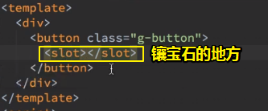

而我们宝石（我爱JS）就是从那个 g-button标签里边镶进去的！

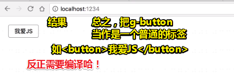

#### 添加icon

设计稿中的icon，前端是搞不出来的，除非这是个简单，可能有点丑陋的icon，所以别想着自己去做一个icon出来！

因此，我们需要借助别人的工具，即去iconfont.cn里边找一些漂亮的icon出来！

关于icon的选择，尽量选简洁一点的！

**①图标选择好后，需要修改一下它们：**

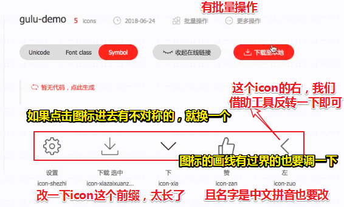

**②项目编辑操作：**

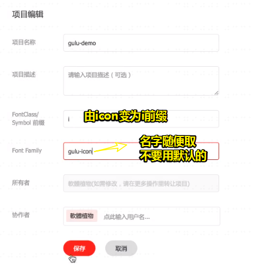

**③图标修剪：**

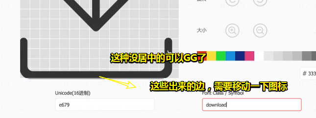

还有一个细节：

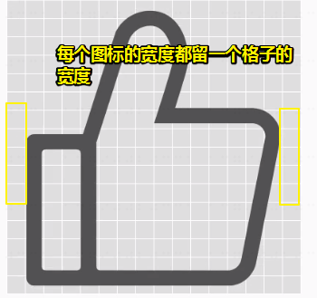

处理「右」这个图标，如果我们直接去搜一个「右」图标的话，那么很有可能是跟这个左图标是不匹配的！

因此，根据这些图标是svg做的，即它们是可以编辑的，于是我们就把它下载下来，然后顺时针旋转个180°，接着就是上传到iconfont所对应的项目里边即可！

关于svg的编辑软件：Photoshop、sketch等都可以，在线编辑器都行，当然你用css也行！

**④上传到iconfont.cn：**

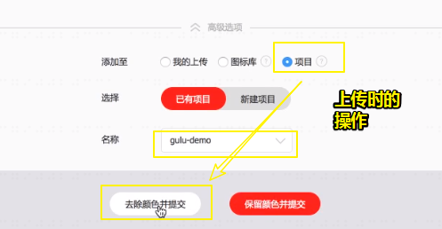

**⑤批量取色和生成代码：**

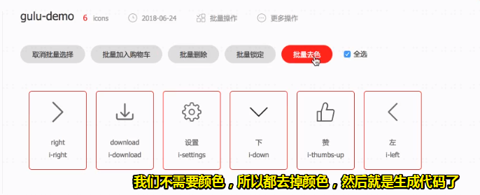

做完之后，我们拿到的JavaScript代码：

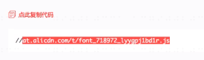

那么这个JavaScript代码怎么用呢？——可以查看帮助文档：「[代码应用](https://www.iconfont.cn/help/detail?helptype=code)」里边的「symbol引用」，看完这个小节，你就知道怎么用了！

需要注意的是，你拷贝的JavaScript代码是我们项目生成的那个，而不是文档里边所给出的那个！

至此，我们就把该JavaScript代码放到我们的index.html里边，你可以随便放：

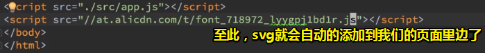

效果：


以上的操作，归根到底就是想办法生成这个JavaScript，然后当浏览器解析到这个JavaScrip的时候，就会生成一个svg标签到页面里边去了！

> 以上是工具方面的知识，所以你只需要知道会用即可！

如何使用我们添加到页面上的那些图标？——可以参考文档

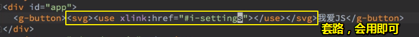

效果：

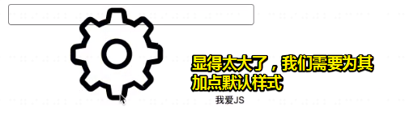

如何加默认样式呢？——为svg加个class属性，然后添加样式即可，需要注意的是这个可不是全局样式哈！所以不要把这个样式写到那个有 `*{padding：0；margin：0；}`的style标签里边去：

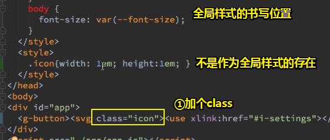

此刻，这个svg图标就咩有那么高和那么宽了：

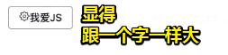

> 以上就是对svg图标的引入方式的操作
>
> 回顾以前的做法，我们用的是雪碧图，而这个技术就目前而言早就过时了！
>
> 目前，我们用icon都不用雪碧图了！
>
> 关于em：1em与当前元素的字体大小相同（更具体地说，一个大写字母M的宽度）

话说，为什么我们要写em，而不是px呢？——因为我们的icon默认跟字一样高！而且我们不想管字有多高！或许你会说用这个不也行吗？

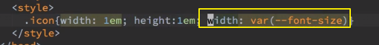

我们不需要这样做，我们只需要这个跟字体一样宽就好了，而高呢？在iconfont里边，所有图标的比例都是1:1的，所以你写一样的值就好了！

总之，这像个接力赛一样，A号选手接默认的棒，B号选手接A的棒，而不是把默认的棒给接了！

格式化代码，让代码好看起来：

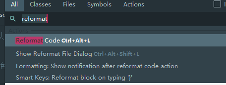

目前的结果：

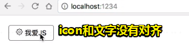

这是CSS最恶心的一个地方，CSS已经发展了这么多年了，但是简单的两个文字对齐都很难很难做！

#### icon动态化，父子通信

在说文字对齐之前，我们需要先来想一个问题「我们想要让svg图标与`我爱JS`这个图标对齐，我们应该在哪里写样式呢？」

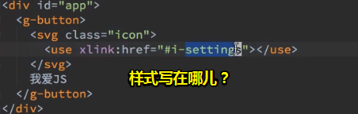

我们应该在外面写样式，还是在按钮里边写样式呢？——额，表示懵逼，不理解你在说啥！

简单来说，就是假设我们不是写button的这个人（A），而是用这个button的人（B），你觉得B会在乎icon和文字是否对齐这个事儿吗？

显然，不会啊！B会认为「这个button组件应该帮我解决好啊！你凭什么要让我自己想这个问题，然后让我自己去解决呢？」

也就说，你要换位思考，去想想、去揣测一下使用这个button组件的人是怎么去想的！

举个栗子来说，有个开发者B在用你这个库，他会觉得这种写法

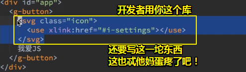

忒他妈蛋疼了，我不想写这么多字呀！

其实唯一重要的就是那个 `settings`，用于指明B想要哪个icon

因此，我们需要把这一坨东西写到button组件里边：

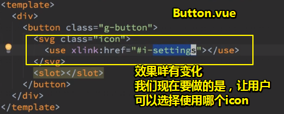

因此，我们需要让B传一个参数进来。那么Vue是如何接收外部的传参的呢？——使用props

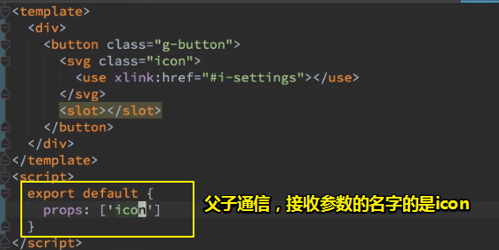

让icon跟随B所传的参数动态变化起来：

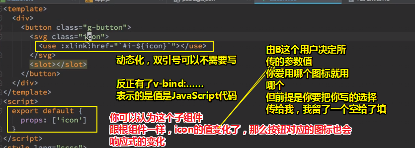

用户的使用姿势：

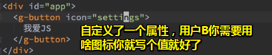

> 第一次这样写很难接受，写熟了就很好懂了！
>
> icon属性似乎就只是个控制样式或者元素显示为何物的这么一个东西的存在！

不过，这有一个bug啊！即用户咩有传icon，也就是说它没有写icon属性，然后页面所呈现的效果还是有svg：

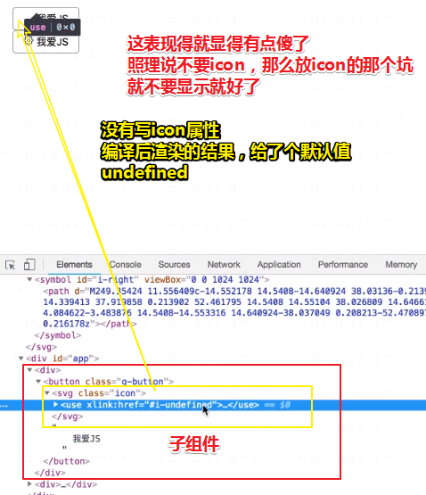

所以，你不能默认用户B会传个参数给你，因此你得想办法把这个svg给隐藏起来才行哈！

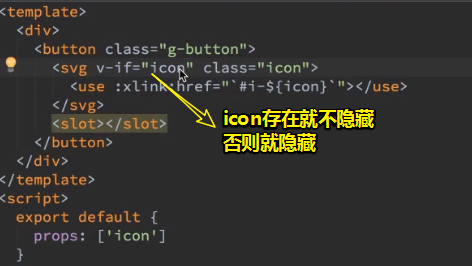

当icon这个变量存在的时候，我才会出现svg，反之，则不出现！

目前的效果：


#### icon位置处理（if-else）

如果用户B想把icon放到文字的右边，那么这该怎么做呢？也就是说，我们现在需要加一个什么样的参数，可以让B选择把icon放到左边还是右边呢？或者说两边都有！

此时，我们该如何思考呢？而这就涉及到需求的分析问题了。

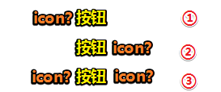

需求分析如下：

1. 排除两边都有icon的可能，毕竟如果两边都有的icon的这样一种情况，是很不常见的！当然，如果你非要做，也很简单，叫用户自己加一个就好了！
2. 左或者右这个需求是很常见的，可以做！

思路：

1. 在button组件里边，添加一个很直观的变量，用于接收用户传过来的参数—— `iconPosition`（只有两个值可取——left和right）

   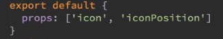

2. 假设用户传了个right过来，我们该如何让svg跑到右边去呢？有两种做法，第一种是 `if-else`：

   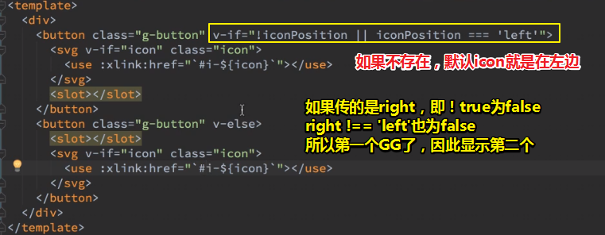

   话说，这种写法到底好不好呢？如果是新手的话，这勉强还可以，但是如果说你想尽量做得好一点的话，那么这是不ok的！毕竟，这里得重复代码忒TM多了！

   那么我们该如何优化呢？——先一点点的来优化

3. 优化代码：

   判断语句有点复杂，由于left是默认值，所以我们换过来写会简洁很多：

   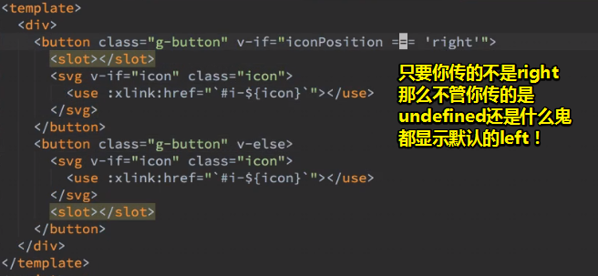

   可见，我们简化了判断语句，但是还是存在重复的代码哈！根据这样一个原则「只要重复，就会有bug！」，为什么这么说呢？因为有时候你**改了上边那一处某个位置的代码，然后忘记了下边那一处代码同样的位置也需要改**，如那个  `:xlink:href`的值！

   那么我们该如何解决呢？——**我们尽量用CSS来做样式相关的东西！即使用CSS来做！**

测试：

1. 在根组件里边再次添加个g-button组件，而这次多追加一个属性—— `icon-position`（webstorm会有提示你加横杠），或许你会问，这个属性名跟我们在button组件里边定义的props数组里边所添加的 `iconPosition`变量不一致啊？HTML规范里说到，这里必须要用中划线写，而Vue会自动的把这种规范写法转成是大写的！

   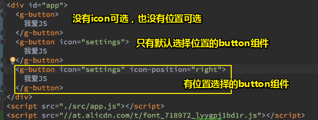

#### icon位置处理（CSS姿势）

icon默认是左边，而icon的左右控制我们交给CSS来做，而不是用JavaScript来控制！

做法（写法有点复杂）：

第一步（添加动态的class）：

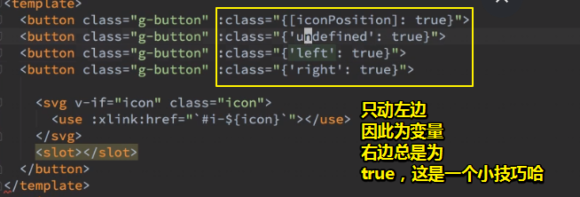

> 喜欢用对象姿势处理class，需要注意的是，这个key是 `[]`包裹的，这种语法我没有在vue文档中看到！这种写法很不常见！反正我们这样写了，不管你传啥参数，结果都是 `{‘xxx’:true}`
>
> 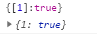
>
> 当然，如果你不理解的话，可以这样 ： `[iconPosition]`，不过一般我都是喜欢用对象姿势的！

结果：

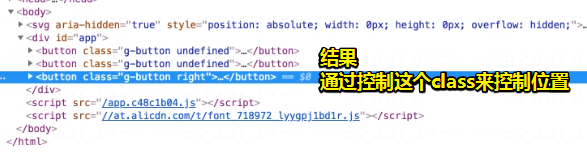

由于`right`给人的感觉就像是为该元素添加右浮样式一样，因此我们需要这样 `icon-right`，显然，这让人认为icon在右边！

至此，我们就可以通过这个class来用css来控制icon的位置了。

第二步（写CSS）：

思路：如果g-button它有个叫`icon-right`的属性，那么我们就让svg，即它的class为`icon`，让它的`order`为2，即排到第二位那边去！

> 请在你的脑海中注明：g-button即button带有class为 `g-button`的button

不过，我们需要对g-button `inline-flex`一下才行！这样一来，这个g-button就变为一个弹性盒了！对了，你还要对它绝对居中，毕竟弹性盒有它另外一套世界的物理规则！

---

webstorm小技巧：

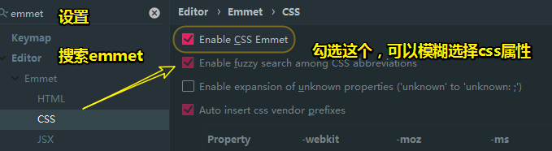

> fuzzy（模糊的）

测试：`jfc:c`、`ali：c`……

这个只有webstorm能做到！

---

对了，我们还得处理默认的icon顺序，我们无法对slot标签添加class属性，应该添加了，那么该属性是会不见的，我也不知道为什么会这样，于是我们对slot标签套了一层div（保险一点）或者span，

至此，icon默认在左边（ `order:1` ），按钮文字内容在右边（ `order:2`）

如果这个按钮有个  `icon-right`的话，那么就置换一下它们的`order`值就好了

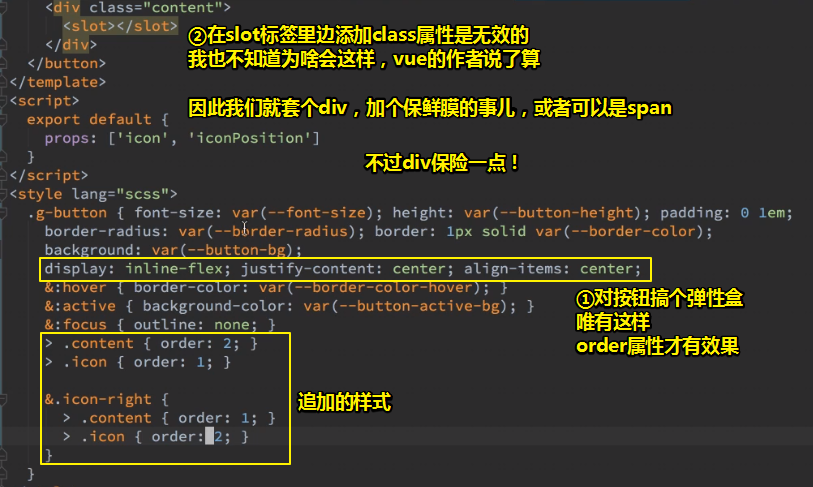

> 不要想着用css的direction或者是mode改变文档流顺序，不然，我们的字也会从右往左写哈！毕竟我们的用户肯定是从左往右看字的。总之，我们只是换两边而已，所以不需要direction改变文档流顺序！

效果：

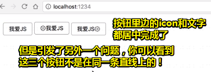

小结——如何解决icon可以放左边，也可以放右边的问题

1. 引入一个叫 `iconPosition`的属性
2. 用户可以写（right、left），也可以不写（这个暂时还没有处理）
3. 如果是right，那么另外一套CSS就启动了，默认那套left的CSS就GG了
4. 关于class的控制，代码很简洁，但是中间用到的技巧很多，总之这代码的存在，就是告知你button有这么一个类，可以是icon-left、icon-right、icon-undefined……任选其中一个，然后就通过css间接控制按钮里边的icon和内容的表现 了，如位置的互换

大部分人都会用JavaScript的if else 姿势来做，而我们用css是很多人没有想到的，毕竟大部分人都很怕CSS哈！

为什么我们前端会怕css呢？因为CSS太贱了，还记得我们显示效果的那个bug吗？就是那个「按钮」不在同一条直线上的问题，之前是咩有这个问题的，但是我们用了flex之后，也就是用了其它css之后，似乎毫无道理的，引发了另外一个bug！

这三个按钮都一样，就是icon左还是右的不同，在这里，我要给大家一个忠告：

>  遇到CSS问题，不要去深究为什么。

一般来说，如果内联元素对不齐，那么有一种很简单的解决姿势（经验之谈）就是：

直接在内联元素里边加个 :

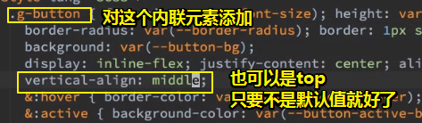

效果：

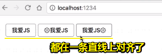

此时，我想你会觉得这很神奇，然后会问「为什么」

但是，我之前说了**不要去深究为什么**。反正**遇到上下不对齐的**，全部统一加那个`vertical-align:middle;`就好了。如果还对不齐的话，那就很麻烦了！只能问或者重新写样式了，或者用JavaScript的if else姿势！

> 如果你非要纠结这个也行，这其实是inline元素引起的，而所有的inline元素都有这样的毛病。

#### 完善按钮细节

①icon和字之间的空隙，这个得**根据设计稿来**！如果设计稿咩有表明，那么你可以用**逼近法**来做，即做出来之后，看我们**按钮的整体宽度是不是和这个设计稿的宽度**一致！反正，目前按钮内容（包括icon和文字）是绝对居中的，调整icon和文字的间隙，即调整整个button的宽度！

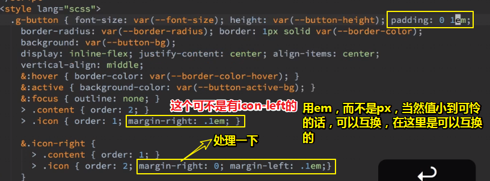

改间距的细节：

1. 请确保按钮里边的文字和设计稿一致
2. css样式层叠的，请注意icon在右边时，默认也会有个margin-right，因此你得把这个给弄成0才行哈！
3. 1px的误差是允许的，毕竟按钮里边的文字是可大可小的！

提交：

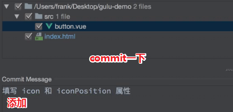

> 做了以上操作之后：
>
> 你要时刻想着假如自己是一个UI组件库的使用者，自己会如何使用，即有怎样的输入，然后又会有怎样的输出（这个输出是自己脑子里边所预期想要的结果——页面所呈现的结果、不合法的输入要在控制台里边有错误提示）
>
> UI组件库的作者：把函数体给写出来！（这个写需要涉及到工具类知识、语言特性知识、框架特性知识、抽象类知识）

②处理`icon-undefined`

> 48:45

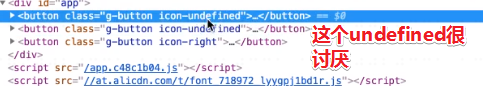

如果用户咩有传参数，那么我们需要给iconPosition一个默认值—— `left`

所以，我们该怎么做呢？——此时，就得引入props的新写法了

这种写法不用数组，而是用对象：

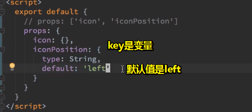

可见，这种写法，对用户的传参控制力度更高！

接下来，我们深入一下这个需求，万一有个人手贱，想让icon在上边，于是他就写了个`up`，即传了个`up`参数过来作为icon的位置！

所以，这该咋办呢？我们想要用户传的只能是left或者right，而不是一个无厘头的up啊！

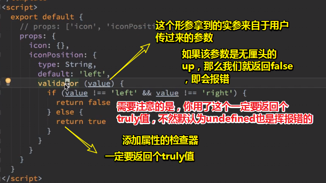

传了个up的结果（即便报错了，但是icon还是默认显示在左边）：

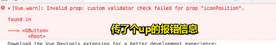

而且这个报错结果，只能靠自己去检查！如果有100个button组件，那就真得是蛋疼了！

我在想：如果没有传，只写属性，不写值或者属性都不写，那么会执行默认的left，还是直接去检查器里边检查，然后报错呢？（我测试了一下，如果你没写位置属性，那么默认就是left，而且不会报错；如果你写了位置属性，且是空字符或者是其它值都会报错，总之不是left或right的值都会报错，但是页面会默认显示icon在左边，因为我们写了正确了的icon属性，**其实props里边的icon同样需要判断**！因为用户很有可能写错了icon！如把settings写成了setting）

> 当你有需求的时候，再去了解这些玩意儿，你就知道它原来是为了这个场景而去设计的这么一个功能！
>
> 但是，当你在学vue的时候，直接说这个东西有啥用？然后就说，会有这样一种需求，可这时的你是不确定会有这种需求的，即持有怀疑的念头哈！
>
> 芳芳所讲的这个点，正是我之前苦苦所想的「为什么」，即这个特性之所以被设计出来是为了解决什么问题的。你看这个属性检查器，就是为了解决用户乱传参数给子组件的问题！

优化代码：

我们可以看到return的值是根据判断条件决定的，我们只需要return个取反值就好了！


结果：


在webstorm看来这是最简化的了，但是通过我们人类的分析，这其实还是可以再 简化的：


> 回顾一下惰性求值：
>
> 
>
> 而我们的`value===‘left’`的返回值只有true或false，所以这整个表达式的返回值只有true或false！

可见，我们一开始所写的代码总是会有优化的空间存在

或许，你会想「还可以优化吗？」——不用优化了，代码只剩一行了，还优化个屁啊！这个优化水平已经很高了！

commit提交一下：


#### 添加icon.vue

> 56:42

我们在button.vue里边的icon是为button服务的，可是假如用户需要在button外边使用icon呢？如这样：


这个过程我们之前做过一遍了：


我们之前说过「**重复就是bug，如果两个代码是一样的，你最好把它放到一起！**」

所以我们应该再写一个组件哈！

因此，我们要把这些代码放到一个组件里边，也就说所谓的「**组件化**」！

> 为什么需要组件化？芳芳再次告诉了我组件化存在的意义！
>
> 如果记不住这个意义，那就重复多遍，直到记住位置，当然，如果需求场景不同，会记得更深刻一些，如icon组件等其它组件之所以存在的原因！

开搞：

1. 创建个icon.vue
2. 添加3个标签template、script、style（windows下scss比较难装，如果装不了，那就装less吧！）
3. 拷template代码，不要if else；拷icon的css代码，你会发现，你不知道之前为css写的icon代码放到哪儿去了，这就是为什么要把css代码放到同一个文件里边的原因了！
4. 为了防止 `class="icon"`的`icon`值跟其它icon的名字冲突，所以我们就加个 `g-`，即 `g-icon`，表示这个是gulu这个轮子的icon，我的叫warm ui，但是为了与芳芳的代码一致，我就用了一样的g，而不是 `w-icon`

icon.vue：


于button.vue里边使用这个icon.vue：

那么怎么用呢？——用全局姿势，即同button组件一样，全局注册一个icon组件：


来到button.vue里边：


之前用户写的svg标签可以改一下了， `g-icon`标签渲染的结果就是用户所想要的结果：


至此，我们可以在button里边方便的使用icon，也可以在button外边方便的使用icon了！

commit提交：


好了，以上6个字概括之——「**这叫做组件化**」

不过这还存在一个问题，就是我们在button.vue所写 `.icon`class，这个class是给我们的icon用的，如果你不把它重新给到 `g-icon`身上的话，那么button里边的icon就咩有在右边的情况出现了！


> 如果子组件的props写了个class，那么这个class值会被传过去吗？
>
> 还是根据这个的说法「vue定义组件时，不能指定名称为 'class' 或 'style'的属性，因为这两个是'保留字'。」，
>
> 然后猜测这个class就是作用到svg身上的？
>
> 我测试了一下，在子组件身上写的class特性会被作用到其template里的root元素身上！同理v-if等指令也是如此！除非特性是属于props！

commit：


#### 自闭合标签

webstorm有强迫症，觉得标签应该自闭合才行


commit：


至此，到目前为止，我们的代码得到了更进一步的简化！

#### 添加icon loading

这还是icon的一个细分。它是这么一种情况：

我们点击某个按钮的时候，该按钮里边的icon会一直不停地转！即按钮被点击，icon变成一直在转的这么一个状态！

做法：

1. 加个菊花，去iconfont.cn里边找个让自己顺眼的菊花icon

   

2. 让菊花转动（使用CSS动画）：

   定义一个动画：

   

   为`g-icon`组件添加class特性：`class=“loading”`

   添加css样式，让动画动起来：

   

   需要注意的是，如果你的icon图标选择得不好看的话，最终所呈现的效果也是不太如自己所愿的！

   

   至此，我们的菊花图就有了，接下来需要让这个菊花icon代替这个settings icon

   即，假设这个按钮的icon是设置图标，那么我们点击这个按钮，该设置图标就会消失不见，然后变为这个菊花转动loading状态！

   commit：

   

   小结一下以上添加菊花过程：

   1. 先声明一个动画spin
   2. 让这个icon元素spin一下这个动画，2s的频率滚一圈，且无限滚到地老天荒，而且需要匀速保持，不能卡机！

---

## ★添加loading

### ◇课间问题

**①对齐：**

图标和文字对齐是通过flex布局解决的，主要是 `justify-content`和 `align-items`的功劳！


总之，一个样式是让按钮内部的东西居中对齐，还有一个是让按钮外部的对齐！

**②em：**

关于对em的使用没有什么规律可言，即你在任何时候都可以用em，只要它不出bug即可！而em的意思就是跟字一样大，那么什么东西应该要跟字一样大呢？字和字之间的空隙，如你说两个字之间的空隙是用像素px好，还是em好？当然是用em好呀！毕竟如果两个字都是100px的话，如果只空4px的话，那么这显然是说不过去的！因此，我肯定是会去空半个字的，总之，**字和字之间空的距离应该是用字来衡量的**！

或许，你会问「那一个容器之间的宽度应该用什么来衡量？」一般来说是用px，或者是rem。

总之这个东西跟字很贴近就用em，否则就不用em。当然，你用像素也行！

还有一个问题「em能让大小在组件内缩放吗？」——没有啥缩放的，根据你的意图写代码即可！

> 这是在说，你需理会用户浏览器网页的时候，缩放网页对吧！或许网页放大了会让网页变丑，如布局错误等，但是这并不是我们所要关注的，而且似乎所有的网页也不会去考虑这个问题！
>
> 网页缩放并不会改变元素的font-size、盒子模型大小……它只是让我们把元素看得更仔细而言，经此而言，所缩放，无须管，你只处理默认的缩放为100%的视口就好了！如果用户手贱搞成是500%的，那么浏览这个网页时所看的内容少得可怜，而且出现了很长的横向滚动条。
>
> 总是，网页的缩放，让我们的页面的可视区域或多或少的发生了变化，可能内容显得小看得更多，可能内容显得大，看得更少，如果想浏览全部内容需要拖动滚动条！
>
> 不管怎样，你使用了em这样的单位，放大后，元素的所表现出来的样式，会好看一点，虽然本质上代码没有变化，但是形式上是有变化的：
>
> 
>
> ➹：[从事前端的你，网页的缩放，适配以及移动的适配你懂多少？……-前端范](http://www.cssfan.cn/502.html)
>
> ➹：[[Web前端问题]避免浏览器缩放导致布局混乱问题 - 心得 - UI设计者-中国UI设计师成长平台](http://www.shui-mai.com/upload/?/question/77)

**③关于svg的icon：**

你可以看一下 `//at.alicdn.com/t/font_1181189_zk7owlrbqi8.js`这个js内容！

简单分析一下：

1. 声明一个svg标签字符串
2. 把这个字符串放到div里边
3. 然后把svg搞定body元素里边，作为其第一个子元素

所以这个JavaScript代码的完整逻辑就是，把这个svg雪碧图字符串弄到body的最前面


所以说，这没有什么图片可言，那么也就没有什么请求图片可言了，而是把这所有的svg都打包到一个js文件里边，然后只需要发一个请求只能拿到所有的svg，这类似于我们之前的精灵图（把小图片放在一起，然后只需要请求一张图片就可以了，这对网页的性能来说是有很大的提高的）

相较于精灵图技术，iconfont.cn所提供的这种技术显然好太多了！icon不限量，使用起来极其方便！

> 我在想我上传到github上笔记，预览的时候，肯定是需要请求很多张图片的，不知有没有这样一种工具可以把在同一url之下的图片打包成一张，然后自动就可以读取一张一张的，就像是精灵图一样，通过background等css属性来做到……

svg默认不展示，如果我们想要展示icon，需要这样使用它：


> 偶然的关于为啥 `.icon`的样式是写在button.vue里的style里边，而不是icon组件本身的 分析：
>
> `.g-icon`控制svg大小，默认的样式，无须依赖其它组件而存在的天然样式。可以直接在 `#app`里边使用
>
> `.icon`控制字和icon之间的间距，以及icon位置是左还是右！即那个`order`属性。这个是在button组件里添加的样式，因为button组件需要管理这些样式行为！这些样式的存在是为button组件而生的。同理，`.loading`也是如此：
>
> 

如果你想对icon变颜色是很简单的：


> use元素在SVG文档内取得目标节点，并在别的地方复制它们。它的效果等同于这些节点被深克隆到一个不可见的DOM中，然后将其粘贴到use元素的位置，很像HTML5中的克隆模板元素。
>
> ➹：[use - SVG - MDN](https://developer.mozilla.org/zh-CN/docs/Web/SVG/Element/use)

总之，svg引入图标的姿势比以前的都要好很多！

不过，这是个工具类知识，你会用即可，不要去深入理解！当然，如果你对svg有兴趣的话，这是可以深入理解的！不过，如果你只是想放一个icon，怎么做都行，如用100*100的图片转也行，随便你。但是用icontfont配合svg这种方式是最方便的！

> 以前用icon不是引入字体库然后靠类名吗？现在都用svg了么？这样也能改变颜色么
>
> 现在已经不用iconfont了。虽然这个也叫做icontfont，但是这个实际上用的是svg，而目前大公司都用svg，一般小公司都会落后个几年，用一些诸如 `font-class引用`的姿势！
>
> 总之，你就用 `symbol引用`姿势吧，这才是未来的主流，它可以支持多色图标了，不再受单色限制等等

### ◇开搞

#### 处理loading

如果icon是loading那就展示loading，如果不是那就不要展示！

做法：

1. 对button.vue的props加个属性，而这个属性用于控制loading的展示

2. 关于这个loading，其类型是布尔，默认 值是咩有loading，即为false，还有个validator，这个可以加也可以不加，毕竟我们这个是布尔类型的，要么是true，要么是false，如果你传其它类型的是会自己报错的！因此我们不加validator也是可以的！

3. 用户测试使用：

   

4. 分情况处理loading的展示：

   1. 如果g-button只有 `：loading`属性：

      

   2. 还有icon属性：没有loading才出现这个icon（需要注意样式loading类与文字挨得比较紧）

      

   3. 除了有icon属性，还有icon-position属性：

      你会发现loading icon 始终在左边！

      解决办法很简单， `class="loading icon"`即可！我们要让loading也是一个icon，也就是说，这个loading icon和其它icon是互斥的，而且是在同一个位置出现！你看它们俩的`v-if`就明白，它们俩没啥区别！至于为啥独立开来写？那时因为其它icon无须旋转啊！

5. 如何变成不loading？——点击按钮就变成不loading状态！

   

   > 一个小技巧：`@click`里边的代码可以这样解读「如果我以前是true，那么点击一下就是false，反之亦然」

   原先我们的 `：loading="true"`是写死的状态，所以我们需要一个变量才能点击一下、变化一下！于是我们就得在app.js里边，为根实例添加一个data属性，然后搞个loading1属性，默认为false值！

   虽然做了以上操作，但是点击按钮的时候一点反应都没有哦！为啥会这样呢？

   因为 vue并不知道点击那个地方才算是点击啊！

   

   所以我们需要主动的触发这个click事件，原生的标签button，vue是知道的，毕竟只有一个button标签，即点击一个button，肯定知道点的是button，但是现在g-button映射了很多个元素呀！谁知到你点击的是谁

   所以我们需要对button添加 `@click`，当button被点击的时候就触发一个click事件，那么是谁触发呢？当前这个button组件实例触发，只要template里边的button元素被点击了，那么就相当于整个组件要触发一个click事件。

   

   点击按钮，触发x方法执行，然后x触发一个click事件！

   简写代码，把x里边的函数体（只要一句代码）拷贝到上边去：

   

   > vue里边规定：在template里边写东西的时候，不需要加 `this.`的。所以可以删掉它！所以最后你会得到一个很简洁的写法—— `@click="this.$emit('click')"`
   >
   > ps： `$emit('click')`的click可以是其它方法名，如`xxx`，只要与g-button上的`@xxx`一致就好了！如这样：
   >
   > 
   >
   > 猜测它的运行逻辑：点击了button元素，触发了click事件，执行函数，通过 `$emit()`这个API可以在`#app`里边找到为g-button上绑定的click方法。反正都是得执行一个函数！不管你用什么姿势都行，而这种姿势在我看来，就当作是个黑盒子理解即可，我无须具体知道这个过程是如何实现的！
   >
   > 如果用了this，我的还会报错呀！

6. 同理其它按钮组件同样的测试：

   用户写的代码：

   

   data里边的值：

   

   其实，我并咩有得到很好的理解。我看了一下这个：

   ➹：[组件基础 — Vue.js](https://cn.vuejs.org/v2/guide/components.html#%E7%9B%91%E5%90%AC%E5%AD%90%E7%BB%84%E4%BB%B6%E4%BA%8B%E4%BB%B6)

   如果我要理解上方代码的逻辑，会是这样一种情况（为了自己理解，自圆其说一下）：

   我们在g-button组件上写的click方法其实不同于我们之前在原生元素上写的click方法，g-button组件的click可以变成是xxx、yyy等都行。我们在其template里边的button写上了  `@click`，当我们点击页面的button时，会触发这个click，但是g-button上的click没有被触发，也就是说它**没有执行loading1的取反操作**。我们需要借助button元素的click，间接去通知g-button上的click方法执行。这也就是说 **g-button标签可以像处理 native DOM 事件一样通过 `v-on` 监听子组件实例的任意事件**。回过头来说，为啥会有这样的机制？因为g-button所映射的template里边的元素忒多了，不像只有一个button元素那样存粹，点击它就是它！你点击g-button就是一对多的点击了，假如这里边每个元素都有click事件，难道每个元素都得触发一遍自己的click吗？所以把g-button当作是button来触发事件，这是很不合理的。于是我们可以**反其道而行之**，通过template里边的button元素，去通知g-button上的方法执行，从而实现了类似点击一下，触发一个事件执行的效果！

   总之，一句概括之「自定义标签，也可以像p、button等这样的原生标签那样可以绑定事件，只是事件的触发，需要借助原生标签被点击的间接触发」

   完成这个通知过程需要借助 **vue内建的 `$emit` 方法**才行！这给我的感觉就像是g-button组件是个父组件，其template里边的button像是个子组件！即子父通信

7. commit提交：

   

可以看到，一个小小的功能，居然要费我们那么多的代码！

---

#### 整理代码

芳芳写css代码的习惯：

1. 一开始写就竖着写

2. 写完之后，就横起来，好处是一眼就可以看到我有哪些选择器！如果竖着的话，那么一屏都看不完有哪些选择器！

   

   vscode有相应的快捷键可以处理！

#### 一组按钮（组件的组合）

需求：当两个按钮放在一起的时候，我们需要让这两个按钮给合并起来


那么这个该怎么做呢？

先从使用者的角度思考，假如你不是开发者，而是使用者，那么你会这样写：


开搞：

1. 创建button-group.vue文件，并在该文件里边写上那3个标签

2. 直接往template标签里边添加个slot标签，然后全局注册这个button-group组件，搞个映射。运行起来，然而报错了，因为slot并不能作为组件的root元素呀！因为它可能含有多个节点呀！如我们上边那样的使用姿势，直接使用了两个组件

3. 嵌套一层div即可：

   

目前页面表现：


处理样式：

1. 搞得一行里边去，使用 `inline-flex`

2. 和周边的内联元素对齐：`vertical-align:middle`

3. 这组按钮内侧的两个border搞成是方的，而不是默认圆的：先格式，后按需追加：

   

   > **`:first-child`**表示在一组兄弟元素中的第一个元素。
   >
   > 最初定义时，所选元素必须有一个parent。而从选择器 Level 4 开始，parent不再是必须的。

4. 有多种方法可以做到：

   在此之前，先多加个按钮，以便更好地理解接下来所说的这种方法：

   

   > 可见这种选择器就在这种场景被使用到了！不然我们就得这样搞，把所有的button组件的左边框都none掉，然后对第一个按钮特别搞上左边框。
   >
   > 不选头不选尾： `ele:not(:first-child):not(:last-child)`
   >
   > ➹：[css3 - css中如何让第一个和最后一个不被选中? - SegmentFault 思否](https://segmentfault.com/q/1010000006894619)

   然而这样做了还是有bug：

   

   > 在我们写CSS的时候，一旦发现一个方法错了，那么你就不要管为什么，直接马上把代码给删了

5. 使用margin姿势，解决上面的bug：

   

   > 元素默认的z-index是0。
   >
   > 关于relative：
   >
   > 由于元素默认是static的，那么 `top`, `right`, `bottom`, `left` 和 `z-index `属性无效。
   >
   > 所以它的存在就很合理了，而且它不改变页面布局，而absolute则会改变页面布局
   >
   > ➹：[position - CSS（层叠样式表） - MDN](https://developer.mozilla.org/zh-CN/docs/Web/CSS/position)
   >
   > 我放大来看，有点bug：
   >
   > 
   >
   > 然而，过一会儿，又没事了……无语了，难道是缓存？CSS布局计算的缓存？

6. 关于按钮文字与图标不对齐，可能是图标上下不对称

commit一下：


为什么说还有bug呢？——因为你遇到的奇葩用户还不够多！

比如说：用户在使用这个button group组件的时候，如这样：


那么结果就是，我们之前所写的样式被破坏了：


所以我们得阻止用户瞎搞啊！

那么我们该怎么阻止呢？

> 这似乎咩有办法可以阻止啊！毕竟如果用户非要瞎搞，那么你又有什么办法呢？

引入一个新的API——mounted（当button-group这个组件出现在页面中的时候，会触发的这么一个函数）

> 可以通过打log测试，这个函数什么时候执行，如每次页面刷新，button-group组件出现之后，它都会执行

那么，我们可以用它来干啥呢？

可以检查button-group组件的儿子呀！


> this是当前这个button-group组件实例！

所以我们可以这样 `this.$el`，拿到button-group.vue的template被编译过后的HTML：


最终代码：


> 如果用户看到警告了，还不管，那么就算了，反正只是样式的问题！如果想管的话，那就看看自己哪里写错了！
>
> 总之，我们可以做一些职能的判断，让用户知道自己写错了！

commit：


问题：

**①关于scoped？**

目前还没有遇到相需求，遇到再说。如果一开始就说的话，你就遇不到bug了，而遇到bug了，就知道这个属性之所以被设计出来的原因所在了！简单来说就是知道「为什么要用scoped？」

**②来自iconfont的js，难道不需要下载到本地吗？**

说实话，阿里巴巴的服务器比自己本地的服务器要稳定得多！所以为啥要用自己的呢？

而且过去的几年，iconfont的服务器只挂过一次，而xiedaimala则挂了10多次 了！

**③CSS需要用什么规范吗？**

目前芳芳的CSS的代码，并没有用什么规范！

整体风格是以简洁为主，能用子选择器就用子选择器！

而且现在代码太少了！无须用规范，当CSS代码超过一千行，你再考虑CSS规范吧！

而现在考虑这么复杂的东西，没必要！

#### 修复一个样式bug


commit：


webstorm小技巧：


#### 去掉之前的测试代码

这里利用webstorm提供的一个功能：


查看刚才编辑过程中的所有本地历史！


可见webstorm是没有办法被替代的！

其它的是编辑器，而webstorm则是智能的IDE。

commit一下：


接下来，就来做一下单元测试，「什么是单元测试？」，这是大家很感兴趣 的话题！

## ★单元测试与 Mock

### ◇概述

这是重头内容，也是我们接触得很少的内容！

如何做？——目前不引入任何的框架，而是徒手用一些简单的库来写一些单元测试！之后再改成框架版的单元测试！

使用的库是[chai](https://www.chaijs.com/) ，它是一个BDD/TDD 断言（assert）库

### ◇BDD/TDD/Assert

- BDD（Behavior-driven development）：行为驱动开发，你所有的开发是因为你要满足用户的某个行为，比如说用户可以点击某个按钮，你就得做到用户可以点击某个按钮。或许你会认为这是理所当然，但这不是理所当然的，因为BDD是（前端领域）最近才有的概念……

- TDD（Test-Driven Development）：测试驱动开发，它是以什么而写的呢？——产品经理写了需求，然后根据需求翻译成测试的这么一个用例，就是我们之前画得那些测试用例，然后你把这些用例给实现了，那么你的开发也就完了，总之我们的目的就是让测试通过！而行为驱动开发的目的则是通过自然语言书写的东东来开发！

- Assert：断言，顾名思义，「我主观认为……是对的」就是断言了！为什么会说「自己主观认为」呢？因为根据自己的经验以及知识觉得应该是这样的！总之，一般而言，99%的情况下，自己是对的，但是如果自己的断言错了的话，那么就会证明你的程序有潜在的bug！那么这个时候，你就得去看看你的代码了！

  举个例子来说：

  

  那么这有啥用呢？之后会说到！

> 把BDD和TDD这两个东西的英文和中文给背下来！面试官问你的时候就说这个好了！至于区别，就去看看维基百科即可！毕竟，没有权威的说法，这些东西都发展得很晚，所以也没啥权威的！


➹：[单元测试到底是什么？应该怎么做？ - 知乎](https://www.zhihu.com/question/28729261)

➹：[TDD并不是看上去的那么美 -- 酷 壳 - CoolShell](https://coolshell.cn/articles/3649.html)

➹：[如何编写测试用例？ - 知乎](https://www.zhihu.com/question/51558124)

➹：[TDD 与 BDD 仅仅是语言描述上的区别么？ - 知乎](https://www.zhihu.com/question/20161970)

### ◇断言

目前只有一个很弱的断言库，那就是console.assert

#### console.assert

这个库，或者说API，它只能判断一个东西是真是假！

当我们需要判断一个东西是不是字符串的时候，使用它写起来代码来就很麻烦了。


前面这种姿势，判断一下需要写 `typeof`

后面这种姿势写法，很符合英文的书写习惯，而且还有点BDD的感觉，而BDD说了一个很重要的概念，那就是用自然语言描述这个需求，然后这个需求只要测试通过了，那就ok了。

而chai.js就是提供了后面这种姿势写法的这么一个东西！

总之，它就能让我们的断言更加方便。

#### chai.js


它给了3种形式的断言：

- assert：之前说到的第一种姿势，读法是「我断言foo的等于bar」，这种写法不好看
- Should：读法「foo应该是一个字符串」，读法要点是把英文一个字一个字的蹦出来就好了，这种写法读起来很自然，但是它有个问题，那就是把我们的foo对象给改掉了，如**多了一个should方法，本来它是没有的**
- expect：目前，**它的写法形式上是最直观**。读法「我期望（expert）foo是一个字符串」。

话又说回来，不是说好的单元测试吗？怎么现在还没说到单元测试啊！

已经说了呀！已经说了怎么做单元测试了，就是**通过断言来做单元测试**呀！

### ◇单元测试

如何做断言？

1. 安装chai（该库很小）

   

2. commit一下，「安装 chai」

3. 使用（在app.js里边使用）：

   不要管app.js里边的代码，先放在那儿，之后会优化

怎么做单元测试？

Vue的文档里边有写：

➹：[单元测试 — Vue.js](https://cn.vuejs.org/v2/guide/unit-testing.html)

#### 测试Button的icon


> **querySelector()**这个方法来自Element这个构造函数，很多时候我们都是用document来调用这个方法的。返回值是匹配到的第一个 html元素！
>
> button是组件实例：
>
> 
>
>  `$mount`是关于生命周期的实例方法！
>
> 语法是： `vm.$mount( [elementOrSelector] )`
>
> 如果没有提供 `elementOrSelector` 参数，模板将被渲染为文档之外的的元素，并且你必须使用原生 DOM API 把它插入文档中。
>
> 这个方法返回实例自身，因而可以链式调用其它实例方法。

做法：

1. 先来个block `{}`作用域

2. 思考Button组件是个什么东西？——显然它是一个对象呀！

   

   而这存在一个问题，那就是我们无法通过对象来实例化一个东西，所以我们需要把这个对象改成一个函数，即一个构造函数。

   那么如何拿到关于button实例的构造函数呢？很简单，使用全局API—— `extend()`

   ```js
   const Constructor = Vue.extend(Button)
   console.log(Constructor)
   ```

   结果：

   

   至此，我们就可以用过这个函数，去构造一个button组件出来了！当你把这个实例放在页面里边，就是之前所看到的g-button了。

3. 如何把动态生成的按钮放到页面里边去呢？

   1. 在 `#app`里边创建一个 `div#test`
   2.  `button.$mount('#test')`：把button实例挂载到一个元素上（可以不放到页面里边，直接在内存里也行，即`button.$mount()`）

   **之前我们是直接把按钮写在页面里边，而现在则是通过JavaScript把按钮写在页面里边！**

4. 如何传自定义属性？

   

   你看文档就知道了。使用一个propsData属性即可！

   那么如何传里面的slot呢？即按钮里边的文字内容，你得知道怎么传吧！

   这个问题之后会解决。目前只处理自定义属性！

5. 接下来，就是测试我们在页面里边动态生成的按钮，能否如我们所期望的那样展示了！如我们对该按钮设定了其icon为settings，那么其在页面所展示的就是有该icon的按钮了！

6. 如果测试用例通过，那么控制台是没有报错的！否则会有一堆红色字眼：

   

7. 测试用例，需要根据你的设置，然后去检查结果是否满足自己的设置，如果满足了，那么你的代码就没有问题了。如你设定了icon是`settings`，那么你的主观判断就要去判断页面上的这个按钮的icon是不是`settings`
8. 单元测试就是：你去传一个输入，然后从输出里看跟你输入的东西是否匹配，如你输入一个 `icon:settings`，那么你得到应该就是 `#i-settings`了，如果匹配成功，那么代码就是对的！总之单元测试就是放一个输入，得到一个输出是否匹配。而这个输出的结果是需要自己去预期的！

接下来要测试什么？

这个选择，直接看输入参数就好了。


#### 测试button同时出现icon和loading

> 预期的效果：同时出现，选在loading。

做法，同上，需要复制构造函数的创建，这看起来很烦，当然，之后会优化这些重复代码。


#### 测试button的order

> 默认icon的order为1，如果写了2，那就是2了


> `Node.remove()` 方法，把对象从它所属的DOM树中删除。

1. 涉及到样式的测试，我们必须要把元素挂到页面上去才行，如果不在页面的话，那么页面就不会渲染这个元素，那么这样一来，css就不会加载到这个button上边了

2. 关于div放在哪儿？我之前认为一定得放在 `div#app`里边，确实如此呀！然而 `$mount()`该实例方法可以把组件给编译了然后添加到页面里边，所以无需放到 `div#app`里边 。当我们把button挂载到这个div里边之后，也就是说button出现在页面里边，既然出现在页面里边，那就会有样式，而有样式就可以获取到svg标签计算过后的样式！（order是作用到 `.icon`，而 `.icon`是svg标签本身）

3. css的所有属性值都是字符串

4. 默认是1对吗？那么如果给个iconPosition，那么测试的结果是不是变成字符串2呢？（经常性的需要验证一下是否测试是能进行的，如给个字符串1，看看是不是报错的？不然随便给的值都是正确的，那么岂不是测试代码出错了？）

5. 由于我们需要把按钮mount到页面里边，那么页面就会显得很乱了：

   

   > 渲染到页面的按钮，都是经过编译的原生HTML。所以你不放到 `div#app`里边也行

   所以我们需要打扫卫生，如果单元测试通过，那就把元素从页面删掉（曾经出现过，但是一闪而过，会看不见，所以 不用担心被用户看见这个按钮）、把button这个对象给删掉！同理，之前的测试也需要这样写，不然，内存就被占用了。如果报错了，那么打扫战场的那两句代码就不会运行了，这样一来不用打开控制台就知道我们所写的程序有bug了。

> 用vm（view model）表示button实例的变量名，即表示vue的实例，不然用button会误以为它是一个button元素！

#### 触发click

> 我们的按钮应该能监听click


> 我们想要的不是回调函数代码被执行，而是回调函数是否被调用了！

commit：


需要引入一个库，来做第5个的测试用例。

那么这个库是什么呢？——[chai spies](https://github.com/chaijs/chai-spies)

spy，间谍，我们派一个间谍去监听那个函数

那么怎么用呢？

1. 安装

   

2. 用法（看文档）

   引入：

   

   最终代码：

   

最终的测试代码是如何写出来的？

1. 之前用的是匿名函数表达式，而现在则是用个间谍函数spy，spy()里边的函数随便写，就是你要去间谍的那个函数，也就是伪装成的那个spy匿名函数，我们实际上执行的是spy()里边的函数参数，但是它被间谍给监听了，所以间谍就代替了它的位置，这个时候我们期望button 被click的时候，那么间谍spy就已经被调用了

> 反正我从形式上理解这代码就好了！

以上叫做函数的一个mock，不要问mock是什么，写多了，你就知道mock是什么了

简单 来说，有的时候，那些东西我希望是受我控制的，而不是用真正的函数

至此，我们就能够确保用户点击这个button是可以触发的！

至此，按钮的5个功能已经测试完毕，当然，还有其它功能，目前还没去写！
commit一下：


### ◇小结

- 目前这种单元测试不够酷，每次写一个单元测试，运行一下，都需要刷新页面，而且还要打开parcel，打开控制台！这样未免显得太傻逼了吧！那么能不能自动化，通过一行命令就搞定了呢？

  接下来就解决这个问题

  那么如何解决呢？——自动化测试！

## ★练习题

### ①你的仓库有哪些文件？

> 请使用 git、GitHub 和 npm 初始化一个仓库，要求：
>
> 1. 在 GitHub 上有一个远程仓库
> 2. 仓库中有一个 package.json
> 3. 仓库中有一个 LICENSE 文件
> 4. 仓库中有一个 README.md 文件
> 5. 仓库中有一个 index.html 文件
>
> ---
>
> 1. 我已完成，且满足所有要求
> 2.  我已完成，但未满足所有要求
> 3.  未完成

### ②搞个button组件

> 请使用 parcel 来启动你的应用
>
> 要求：
>
> 1. 安装 parcel-bundler
> 2. 创建 src/app.js 文件
> 3. 创建 src/button.vue 文件
> 4. 在 index.html 中引用 src/app.js 文件
> 5. 在 src/app.js 中引用 vue 和 src/button.vue
> 6. 使用课程中学到的知识让 `<g-button></g-button>` 变成 `<button>按钮</button>`
> 7. 访问 [http://localhost:1234](http://localhost:1234/) 可以正常查看按钮

g-button标签一种映射，而且可以在其身上添加自定义属性以及自定义事件。

### ③搞个icon组件

> 请创建 src/icon.vue，要求：
>
> 1. 你的组件可以把 `<g-icon name="settings"></g-icon>`
>
>    转变为
>
>    ```vue
>     <svg class="icon">
>         <use xlink:href="#i-settings"></use>
>     </svg>
>    ```
>
>    即可。

走一步，变3步！name相当于使用者传的参数！

### ④为 button 添加一些功能

> 完善 src/button.vue，要求：
>
> 1. button 的样式与 [gulu 的设计稿](https://www.yuque.com/u29422/gulu/197281)基本一致
>
>    1. 高 32px
>    2. 内容左右居中，上下也居中
>    3. 文字大小跟设计稿一致
>    4. 按钮边框颜色跟设计稿一致
>    5. 按钮被 hover 后跟设计稿一致
>    6. 按钮被按下时有样式变化
>    7. 按钮里的 icon 可以设置左右位置
>
> 2. 按钮被点击时会触发 click 事件，即
>
>    ```vue
>    <g-button @click="xxx"></g-button> 
>    ```
>
>    这个按钮被点击时，xxx 会执行

添加icon是个功能，icon位置选择也是个功能……

我们能点的是button这个原生标签，要想触发组件标签g-button，需要触发button上的click事件，然后执行 `$emit(click)`，以此间接触发g-button上的click事件执行！这个click名字随意，只要与传给`$emit()`的事件名或者说是方法名一致即可！

### ⑤给 button 添加测试用例

> 给 button 添加测试用例，测试用例不需要自动化，直接写在 app.js 里即可。
>
> 参考答案：
>
> ```js
> import Vue from 'vue'
> import Button from './button'
> import Icon from './icon'
> import ButtonGroup from './button-group'
> 
> Vue.component('g-button', Button)
> Vue.component('g-icon', Icon)
> Vue.component('g-button-group', ButtonGroup)
> 
> import chai from 'chai'
> import spies from 'chai-spies'
> chai.use(spies)
> 
> const expect = chai.expect
> // 单元测试
> {
>   const Constructor = Vue.extend(Button)
>   const vm = new Constructor({
>     propsData: {
>       icon: 'settings'
>     }
>   })
>   vm.$mount()
>   let useElement = vm.$el.querySelector('use')
>   let href = useElement.getAttribute('xlink:href')
>   expect(href).to.eq('#i-settings')
>   vm.$el.remove()
>   vm.$destroy()
> }
> {
>   const Constructor = Vue.extend(Button)
>   const vm = new Constructor({
>     propsData: {
>       icon: 'settings',
>       loading: true
>     }
>   })
>   vm.$mount()
>   let useElement = vm.$el.querySelector('use')
>   let href = useElement.getAttribute('xlink:href')
>   expect(href).to.eq('#i-loading')
>   vm.$el.remove()
>   vm.$destroy()
> }
> {
>   const div = document.createElement('div')
>   document.body.appendChild(div)
>   const Constructor = Vue.extend(Button)
>   const vm = new Constructor({
>     propsData: {
>       icon: 'settings'
>     }
>   })
>   vm.$mount(div)
>   let svg = vm.$el.querySelector('svg')
>   let {order} = window.getComputedStyle(svg)
>   expect(order).to.eq('1')
>   vm.$el.remove()
>   vm.$destroy()
> }
> {
>   const div = document.createElement('div')
>   document.body.appendChild(div)
>   const Constructor = Vue.extend(Button)
>   const vm = new Constructor({
>     propsData: {
>       icon: 'settings',
>       iconPosition: 'right'
>     }
>   })
>   vm.$mount(div)
>   let svg = vm.$el.querySelector('svg')
>   let {order} = window.getComputedStyle(svg)
>   expect(order).to.eq('2')
>   vm.$el.remove()
>   vm.$destroy()
> }
> {
>   const Constructor = Vue.extend(Button)
>   const vm = new Constructor({
>     propsData: {
>       icon: 'settings',
>     }
>   })
>   vm.$mount()
>   let spy = chai.spy(function(){})
> 
>   vm.$on('click', spy)
>   // 希望这个函数被执行
>   let button = vm.$el
>   button.click()
>   expect(spy).to.have.been.called()
> }
> ```

测试用例的书写：根据使用者所传的参数来决定如何测试组件的功能。简单来说，用户的输入（如  `<g-button icon="settings"></g-button>`里边的`icon="settings"`），是否可以得到一个我们开发者所期望的输出或者说是结果（如button的表现中有个settings icon 出现）！

目前我不知道如何测试slot。


## ★总结

- 当我想回顾之前学习vue时所作的笔记，我发现我看不懂我当时所写的笔记了！回想起芳芳所讲过的学习技巧：「忘记了，就去官网看！」，因此，我放下了笔记，转而去看官网的内容，如插槽的用法！

- 关于框架特性，也是需要我们去深入了解的，这就是我为啥买了一本叫「深入浅出vue.js」的书！

- 编辑svg的工具，我用了这个<https://c.runoob.com/more/svgeditor/>，它可以让我们的svg图形旋转

- webstorm去掉自动保存：

  

- 关于对button组件的使用，它打破了你对HTML元素的认识，我们写一个类似 `g-button`这样的标签，如果你加上`icon`属性的话，那么这个元素所表现的效果是很好看的，它有自己的样式，有icon等……或许这就是组件的意义吧！它可以存在于我们web应用里边的很多个页面，一份代码就可以在多个页面里边使用了，而不是每个页面都得写一份同样的代码：

  

  此刻，组件给我的感觉就是你不需要写很多HTML了，如svg标签，而且你可以统一管理这些组件，这样一来网站就更容易维护了！

- 字体类型会影响icon和按钮内容对齐：

  

  对button添加宋体字体可以做到基本对齐！

  其实除了字体的影响以外，这个icon svg也会有影响：

  

  我想了想，我似乎陷入了一个误区，那就是我以为图中的图案才是icon，其实整个正方形就是svg呀！这就是为啥我向下移动这个settings icon就会有文字对齐的感觉了！

  > svg是整个图，use代表的只是图案！
  >
  > 关于icon和文字的对齐，请加上这个CSS：
  >
  > ```css
  > .icon {
  >     width: 1em;
  >     height: 1em;
  >     vertical-align: -0.15em;
  >     fill: currentColor;
  >     overflow: hidden;
  > }
  > ```
  >
  > 芳芳的没有给 `vertical-align`

  可以把icon和文字丢到那个拼音格子里边比较：

  

  由于字体设计不是我们前端写CSS能够决定的，所以这似乎就是一个无解的问题了！

- 除了在 `#app`里边使用诸如button、icon等这样的组件，我们还可以在button组件里边使用其它组件（如icon组件……），其乐无穷也：

  

- 我在观察这个菊花图转动的时候：

  

  还有一点就是，我们到目前至，处理样式方面的，用的都是class，而不是id！如处理这个菊花图旋转用的是 `.loading`

  话又说回来，为啥我要加样式呢？如果不加样式，那么这个菊花icon就不会旋转，如果没有 `.g-icon`，那么这个菊花icon就不会是这样的大小了，我们使用CSS很重要的一点就是改变元素的外观，这一点和JavaScript是独立开来的，JavaScript只是作为一个控制class切换的这么一个角色的存在，而它的控制切换行为依赖于UI库使用者传了什么参数过来！

  总之最终页面所呈现的，让我们所看见的，仅仅只是HTML和CSS！或许HTML（DOM元素）会动，但感官上来说，它就是一些元素在跳舞而已，至于跳什么舞，由用户决定！可以是事件监听，可以是默认的轮播、可以是由css引导的css动画的等等……

  一句话概括之「浏览网页的用户关注的仅仅只是输入和输出，而这个过程发生了什么，就不是他们闲得蛋疼去关心的事儿了！」

  如我去京东商城买东西，选择了10本书，加入购物车，结账，使用优惠卷，支付，订单支付成功。这个过程我们都是在网页里边操作的，很符合线下的操作，而我们抽象一层来看就是：

  

  > 好看且好用的网页，这就是前端的魅力！

- 单对单的理解知识还行，可一旦串联起来就不理解了！我想我需要做大量项目，以及时刻想着多个知识点一起搞事情会出现什么情况！

- 突然感觉去理解框特性背后的设计逻辑也是一件让人觉得蛋疼的事儿，有一点很重要的是「没有需求场景，即没有做项目，然后看文档去使用，去测试那些特性，就像是没有灵魂的机械操作！」有了需求和场景，你才会知道你现在写的代码是为了解决什么问题的。如点击g-button组件，需要触发它绑定的`xxx`方法，如何做呢？为其template里边的button元素绑定click事件，然后通过 `$emit('xxx')`去通知`xxx`方法的执行！反正我们只是想要这个xxx方法执行就好了！具体它是怎么通知它执行的，真得不是我一个菜鸡就能弄明白的，你得看vue的源码啊！问vue的作者你是如何实现的！

- 我还是觉得用vscode写代码更有感觉！

- 使用者：

  在`#app`里边为组件标签添加的class属性，会作用到映射到的root元素：

  

  如果你写了zzz属性，而且它不是作为props的一份子的话，那么它也会显示：

  

  毕竟，它们是Vue的框架特性！所以说我们可以在该组件标签上添加class，用于覆盖该组件默认的样式！


## ★Q&A

### ①前端有很多知识点，那么我们该如何把这些知识点都掌握好呢？

答案是： 不要妄图把所有知识点都掌握好！

前端的一个特点就是非常的宽泛，像后端呢？可能就更集中一点了，就那一圈知识点，但是需要很深入去理解它们！而前端我们就需要知道很多点了！

大部分知识，我们可以分为三类知识：

- 工具类（特点是大概过一年就全都没有用了）：webpack……

  现在很火的一些东西全都属于工具，假设有一天出了一个新工具比webpack还好用的话，那么webpack就是辣鸡了！所以说这种工具是更新特别快的！

  总之，一句话概括这类知识的学习就是「**知道怎么用就行了！**」，贯穿它们的学习的靠「**猜**」

- 语言特性（不会去刻意讲，用到的时候说，用不到的时候就不说）：Promise、async……

  对于这类知识，我们要深入了解才行！

- 抽象（靠时间堆积，慢慢地去迭代学习）：代码如何组织、写代码时想什么做什么的流程（如第一步做啥、第二步做啥、第三步做啥……）、设计模式、迭代……

  关于这类知识，我们会通过迭代的姿势去讲，去理解，而迭代就是从一个「基本的点」，然后过几天再升一个级，如走台阶一样……像是语言特性这类知识，就是直接一条线一下子深到最下面去了，把它所有的用法全都给了解了，而且**不要分开学**，即「学一点Promise的内容，然后过几天再学一点……」这样的不断深入！

总之，工具类随便学，只要会用即可！

一图概括之：


> 我最近看的JavaScript忍者秘籍2就是这样，涉及到语言特性，那就是不断深入干到底呀！如讲一个函数需要讲4个章节，155页的内容！
>
> 之前学习的parcel，就是安装，然后打包运行测试即可！
>
> 至于抽象类的知识，就是做项目了！

当然，后端的知识也是可以这样学的！

如果涉及到学习其它领域所有知识的套路的话，总结起来就是：

1. 对知识分类，针对每一类知识作出不同的学习策略！
2. 输出，如博客、项目……总之就是输出的结果，可以让我们能赚到钱、能帮助到人家、能让自己变得更好等等！

ps：我们上一节课所学的内容：

1. parcel
   1. [官方推荐的配置](https://cn.vuejs.org/v2/guide/installation.html#Parcel)
2. scss
3. Vue 单文件组件（着重学，相当于是vue的框架特性、同语言特性一样，同样是需要深入了解的）
4. WebStorm 的快捷键（愿意记就记，不愿意记那就算了）
5. CSS变量和:root选择器（属于语言特性，需要深入了解）
6. Vue.component（框架特性，需要深入了解）

### ②em单位的好处？

➹：[EM单位的好处是什么？ - 知乎](https://www.zhihu.com/question/23660843)

➹：[CSS: em, px, pt, cm, in…](https://www.w3.org/Style/Examples/007/units.zh_CN.html)

### ③ `aria-hidden="true"`？

使用icon图标的时候都有这个属性

```html
<svg class="icon" aria-hidden="true">
    <use xlink:href="#icon-xxx"></use>
</svg>
```

在屏幕阅读器看来，这个表明图标不需要朗读出来，只是单纯作为修饰之用！

➹：[aria-hidden="true"是什么意思 aria代表什么？_慕课问答](https://www.imooc.com/qadetail/62014)

➹：[Iconfont-阿里巴巴矢量图标库](https://www.iconfont.cn/help/detail?helptype=code)

### ④什么叫内容分发？

这个知识点涉及到[vue官方文档](https://cn.vuejs.org/v2/guide/components-slots.html)对插槽的概述：

> Vue 实现了一套内容分发的 API，这套 API 的设计灵感源自 [Web Components 规范草案](https://github.com/w3c/webcomponents/blob/gh-pages/proposals/Slots-Proposal.md)，将 `<slot>` 元素作为承载分发内容的出口。

这段话很官方，所以我看不懂，于是我看了下面一段描述，我就很明白了：

> 为了**让组件可以组合**，需要一种方式来**混合父组件的内容与子组件自己的模板**。这个过程被称为 **内容分发** (或 “transclusion” )。Vue实现了一个内容分发 API，参照了当前 Web 组件规范草案，使用特殊的 `<slot>` 元素作为原始内容的插槽。本文将详细介绍Vue内容分发slot

内容分发形容的是一段过程，你只要实现了这个过程，那么这就做到了内容分发！

如果把子组件比喻成小霸王学习机：


我们要实现玩游戏（或者说是内容分发）这么一个过程，那么黄色的游戏卡就是我们往子组件里边插入的内容了！

不管怎样，实在无法理解这种操作的话，可以从形式上的理解它！毕竟这个框架特性就是如此的，vue作者制定的规则如此，那就只能如此了呀！总之，你这样做了，就有这样的结果！写熟了就见怪不怪了！

> 一句话概括之「内容流向了我们在子组件template所定义的slot元素！」

➹：[一篇看懂vue.js内容分发 - 挚爱JavaScript - SegmentFault 思否](https://segmentfault.com/a/1190000007591093)

➹：[Vue内容分发slot - 小火柴的蓝色理想 - 博客园](https://www.cnblogs.com/xiaohuochai/p/7392384.html)

➹：[什么是内容分发？ - 知乎](https://www.zhihu.com/question/57497243)

### ⑥关于子组件自闭合？

好例子：

```vue
<!-- 在单文件组件、字符串模板和 JSX 中 -->
<MyComponent/>
<!-- 在 DOM 模板中 -->
<my-component></my-component>
```

我们在button.vue里边引入了icon组件，所以该`g-icon`标签应该自闭合才对，但是自闭合之后，其后边跟着的标签无法渲染哈！


我不是很理解这个 「在 DOM 模板中」为何意

是在 `#app`里边吗？还是在单文件组件里边的template里边？

➹：[风格指南 — Vue.js](https://cn.vuejs.org/v2/style-guide/index.html#%E8%87%AA%E9%97%AD%E5%90%88%E7%BB%84%E4%BB%B6-%E5%BC%BA%E7%83%88%E6%8E%A8%E8%8D%90)

### ⑦为什么要做单元测试？

介绍怎么做单元测试的书很多，这里主要解答：**为什么**单元测试。

客观来说，单元测试和使用版本控制系统（GIT,SVN）是一样重要的。

我们知道，**代码的终极目标有两个，第一个是实现需求，第二个是提高代码质量和可维护性。**

而**单元测试是为了提高代码质量和可维护性，是实现代码的第二个目标的一种方法**。

> 关于可维护性：代码的可维护性是指增加一个新功能，或改变现有功能的成本，成本越低，可维护性即越高。

**场景 1：Hello World**

> 任何一个伟大的程序员都是从最简单的代码开始写起的，假设你的第一个程序是 Hello World，任何一个语言实现这个程序都只需要不到 5 行代码。
>
> **这个程序需要单元测试吗？**，我们看看这个程序是否实现了软件的两个目标：
>
> 1. 需求很简单，输出 Hello World，这个程序完全满足需求。
> 2. 只有 5 行代码的 “软件” 无论是代码质量，还是可维护性，都相当高，你想要把  Hello 改成 Hi 真的很轻松。
>
> 既然我们已经实现了代码的目标，要不要使用单元测试是无所谓的，同样这么简单的代码也没人会使用 GIT 或 SVN。
> **代码量：5 行**

**场景 2：简单计算器**

> 接下来你写了一个相对更复杂的程序，一个简单计算器。
> 这个程序实现了数字的加减乘除，整个程序共写了大概 50 行代码。
>
> **这个程序需要单元测试吗？**
>
> 1. 需求是对数字进行加减乘除，这个程序满足了需求。
> 2.  你的代码风 格很好（你已经了解到代码风格很重要），你使用了缩进，良好的变量命名，逻辑也清晰，代码的质量和可维护性仍然相当高，如果你想**增加一个 “求 x 的平方” 功能，你轻而易举就可以做到。**
>
> 这个时候让你去写单元测试，你仍然会觉得那纯粹是浪费时间。
> **代码量：50 行**

**场景 3：图书管理系统**

> 你想要做一个真正的实用系统，给学校开发一个图书管理系统。
> 你相信这个系统的代码量比起计算器会很多（可能会有 1000 行）。
> 你从书上**看到有这样一些方法可以简化你的开发工作**：
>
> 1. **工具库**（类似你家里的工具箱），使用工具库带来的好处是非常明显的，假如你要实现 “返回一个数字数组中的最大值”，你只需要使用某个工具库的 Max() 函数，只需要 1 行代码，而不是 10 行代码自己实现。
>
> 2. **MVC 框架**，虽然比起工具库更复杂，需要花更多时间学习，但 MVC 框架带来的好处也非常明显，轻而易举调用数据库（Model），实现简单的 UI 界面（View），实现了类似 “书名为空的书不允许添加到数据库” 的一些逻辑（Controller）。
>
>    你最终很好的实现了这个系统，基于 MVC 模型，你的代码被很好的分割成了很多小的独立的模块：4 个 Controller，2 个 Model，4 个 View。并且在工具库的帮助下，代码量得到了缩减，每个模块大概只有 50 行代码（等同于一个简单计算器的代码量）。
>
> **这个系统需要单元测试吗？**
>
> 1. 你实现了对图书的添加、删除、修改、借阅，你很好的满足了需求（校长表 扬了你）。
> 2. 得益于框架与库的使用，你的代码被很好的模块化了，每个模块都像一个 “简单计算器” 那样简单，增加新功能，或修改现有功能似乎也没有什么大麻烦，虽然会出现一些小 bug，但很快就修复了，代码质量和可维护性都比较高。
>
> 既然你又实现了代码的目标——“完成需求，高代码质量和可维护性”，那好像也没 “单元测试” 什么事，毕竟写它要浪费额外的功夫，而且也没感觉到有多少好处。
> **代码量：500 行**

**场景 4：大型库存管理系统**

> 你被一家 IT 公司雇佣了，你通过了面试，进入了一个即将开启的项目——为一家大的电商公司做一个库存管理系统。
> 项目初期一切都很顺利，技术上和你做过的图书管理系统差不多。
>
> 首先你了解了客户的需求，然后根据他们的需求，使用你已经掌握的 MVC 框架和一些库，实现了他们的需求。你写了 30 个 Controller， 50 个 Model，50 个 View，每个模块的代码都达到了大概 150 行，总代码达到了惊人的 20000 行！
>
> 你觉得自己很了不起，能 hold 住这么多代码，这完全是得益于你的高智商，以及工作努力。客户很满意，老板也很满意，你的自我感觉也很不错。
>
> 并且你发现了比单元测试更好的东西，**面向对象编程**（OOP），或**函数式编程**（FP），无论是哪一种，你发现你可以把一个模块里的 150 行堆砌在一起的代码再提取成 1 个对象的 15 种方法，或者 15 个独立的函数（具体怎么提取，你得看相关的书籍），OOP 或 FP 像 MVC 模型一样，成功的把你的代码分割成了更小的组成部分，每个方法或函数里代码都只有 10 行左右，你**几乎回到了 “Hello World” 时代**。
>
> **你需要单元测试吗？（你能保证你的系统没有 BUG 吗？）**
>
> 这个复杂系统是由 1950 个函数和方法组成，如果想要确定系统整体没有 BUG，就等同于确定组成这个系统的 1950 个函数和方法没有 BUG。
>
> 而单元测试就是做这个事情的，显而易见，如果你写了单元测试，并且每个函数都通过了，你就可以骄傲的说：**这个系统没有 BUG!（当然这是代码的角度，而非功能和产品的角度）**

**结论**

> **虽然，从绝对的角度说，单元测试很重要，但是，从相对的角度来讲，小的代码量，简单固定的需求，个人开发，一锤子买卖等等都会让单元测试显得不那么重要，并且你一直开发的很舒服，这就是为什么有的人感受不到单元测试的重要性（这种情况下的确也许不用写单元测试）。记住，单元测试的威力更多不是体现在新代码的编写上，而是对已有代码的更改。**但程序员的智慧是有限的，系统的复杂度却是无限的，随着更大挑战的到来，当系统的复杂度超过了你的逻辑，记忆能力，你必须依靠别的工具来帮助你减少问题。（宇宙中最复杂的系统就是宇宙本身了，假设宇宙是上帝写的系统，上帝可能太聪明了，所以可能没写单元测试，虽然你也是你软件系统的创建者，但你不是上帝）
>
> 如果你现在在做一个较大的项目，这个项目的需求很多，所以你一直在开发，你遇到了这样的痛苦状况：
>
> 1. 客户总能在使用中找出 BUG
> 2. 每次代码的改动，都会导致一些意想不到的 BUG 出现。
>
> **这个时候，单元测试可以挽救你。**

**问答**

**①即使我看了单元测试的书，也一头雾水，不知道怎么测试我的系统：**

> 这种情况可能是你代码本身导致的，首先你要写具有 **“可测性”** 的代码，这意味着你不能写面向过程的，流水式的，几百行逻辑堆一起的代码（也叫意大利面代码，就像一盘意大利面一样搅在一起的代码。），你要学一些模块化技巧，**面向对象**和**函数式编程**理念，还有很多其它具体方法，比如能用本地变量，就不要用全局变量等等，让你的代码具有可测性，这些知识的学习应该放在单元测试之前。

**②不是有 UI 界面吗，点来点去就可以测试了啊：**

> 你完全可以这样做，直到你觉得这么枯燥的事情真的应该交给电脑去做，或者功能越来越多，你只点击你认为影响到的功能，但总会有那些你认为不会影响到的功能也被影响了，你又懒得全部点一遍，单元测试是在你每次改完代码后自动执行，获得反馈只要几秒，并且会把所有功能跑一遍。

**③我们项目有专职测试人员啊，写单元测试的必要还大吗：**

> **单元测试是检查代码粒度的 bug（一般是以函数和对象的方法为粒度）**，你可以依赖测试人员，但如果你不想在修改自己一个月前写的代码时自己把自己弄到吐血（或者把别人弄到吐血），最好在当初就写好测试代码，这个工作的责任完全属于程序员。外国已经有很多资深程序员论证了，**不论你的单元测试代码质量有多高，覆盖面有多全，单单是你去做这一件事，就可以很大程度的提高你的功能代码的质量，以及大幅减少 BUG 的存在。**

**④需求变了，函数和测试函数均要变，所以没必要写单元测试**

热心群众回答：

> 需求变了，函数要跟着变，对应的测试函数当然也要变，但写单元测试的目的不是说需求变了测试函数可以完全不用变，而是保证新的更改不会影响其他函数不会影响整个程序。

作者回答：

> 函数变了，对应的测试函数不通过，这是理所当然的，**单元测试更重要的是让你监测那些你认为不会影响的函数。**
>
> 因为需求变了，某个函数要跟着变，可偏偏这个函数不光给这个需求用着，还给另外一个需求用着，但是你给忘了！所以你改好了一个需求，却把另一个不用改的需求给弄坏了。
>
> 也不是函数变了，测试函数就必须变，有一种情况叫重构（重构也是服务于代码的第二个目标：提高代码质量和可维护性），**重构一个函数必须是改变其内部代码，对外部不造成任何影响，想当然，重构的前提就是必须要有单元测试，否则我们怎么知道没有影响到其它地方。**

➹：[单元测试到底是什么？应该怎么做？- coolhappy的回答 - 知乎](https://www.zhihu.com/question/28729261/answer/163637881) 

题外话：

关于单元测试：

> 软件工程术语 Unit testing 中的 Unit（单元）有多种含义，差不多就是程序模块（Module）的意思。
>
> 你的程序主要是由一个个的 Class 组成的，一个类或一个对象当然也是一个单元，而**比类更小的单元是类的方法（函式）**。如果你的类中的基本单元——如某些方法不能正常工作，在某些输入条件下会得出错误的执行结果，那么如何保证你的类/对象乃至整个应用软件或系统作为一个整体能正常工作呢？所以，简单说，单元测试（优先）的目的就是**首先保证一个系统的基本组成单元、模块（如对象以及对象中的方法）能正常工作，这是一种分而治之中的 bottom-up 思想。**

 bottom-up ：自下而上

> Top-down（由上而下）和Bottom-up（由下而上）是两种设计与解决问题的技巧。
>
> 1. 前者对问题先有一个整体的概念，然后再逐步加上设计细节，最后让整体的轮廓越来越清楚。
> 2. 后者则是先将解决问题可能所需的基本元件、方案给准备好，然后再将这些基本元件组合起来，由小而大最后得到整体。
>
> 给我的感觉就像是
>
> 1. （俯视）描绘轮廓，然后加深笔墨，如同我看视频时先看个大概，然后仔细攻克理解
> 2. （仰视）以点到面，逐个击破，先画圆、线、三角形……
>
> 很多时候，我就是看轮廓，看整体，然后逐个击破的这样解决问题。也就是top-down之后，再Bottom-up。即所谓的分而治之！

➹：[用中文解释一下 Top-down strategies 和 bottom up strategies。不要复制。_百度知道](https://zhidao.baidu.com/question/223278031.html)

➹：[搞笑谈软工: Top-down和Bottom-up设计方法](http://teddy-chen-tw.blogspot.com/2014/03/top-downbottom-up.html)

### ⑧bottom-up processing 和 top-down processing 区分？

> 举个通俗的例子，你看到一段英文，里面的字母或者单词你都认识，这是bottom-up processing，也就是说你需要收集视觉信息，听觉信息等感觉信息，你的大脑基于这些信息加工后明白是怎么回事。
>
> 但是你能读懂这段英文所表达的意思，这就是top-down processing，在这个过程中你不仅需要加工感觉信息，还需要根据你的智力和经验等去理解它的意思。
>
> ➹：[bottom-up processing 和 top-down processing 区分？ - Shasha的回答 - 知乎](https://www.zhihu.com/question/53033702/answer/545104762)

看来很多时候，我之所以未能理解这个句子是因为仅仅只是bottom-up，就是无法把单个单词（单元）组合成一个完整的句子，然后去理解它，简单来说就是上下文你不知道，整个整体轮廓你也看不全。

总之如何把基本的单元组合成一个有意义的、有功能的个体是我需要花大量时间去刻意练习的。即多做项目！

### ⑨E2E测试？

我们不写E2E测试。如果写，那么你就是时间太多了。我们的这个UI库，只需要写单元测试即可！毕竟我们没有大型的需求！

据芳芳所知，国内大型公司只有最关键的步骤会做E2E测试，比如说「下单」，像其它的步骤一般都不会做这样的测试，如登录注册等，都是通过人肉做测试的！

那么为啥我们要做单元测试呢？

因为如果不做单元测试的话，那么我们这页面几十个button，几十个组件难道每个都要重新点一遍吗？这样就很蛋疼了呀！为啥要用人肉？用程序跑一遍不就好了吗？

如用户在 `#app`里边使用了g-button标签，然后它搞了个icon属性，我们需要测试这个icon值是否有效？那就用程序单元测试呗！

总不能去用肉眼观察「使用者写了一个g-button标签，而且写了30个，我需要看看页面所表现的所有按钮模样是不如我所预期的那样表现？」


