# 简单轮子：文本输入框

## ★课程简介

### ◇UI

<https://yuque.com/u29422/gulu/197282>

### ◇代码

<https://github.com/FrankFang/frank-test-1/blob/button-and-input/src/input.vue>

### ◇注意

1. 从这节课开始，你需要用 `npx parcel index.html --no-cache` 来开启项目（可以把这个命令写到 `npm start` 里）

2. Windows 用户运行 `npm run dev-test` 时会出现 BUG，解决办法是：

   将 dev-test 对应的命令 `parcel watch test/* --no-cache & karma start` 分别运行，运行方式如下

   1. 新开一个 Git Bash 窗口运行 `npx parcel watch test/* --no-cache`
   2. 再开一个 Git Bash 窗口运行 `npx karma start`

## ★如何书写README（遇到一个BUG）

### ◇收尾工作

> 上节课遗留了一些问题，通过README归纳一下

#### 如何写一个规范的README？

> webstorm技巧：
>
> 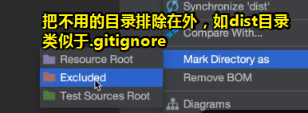
>
> 注意，不要在你的代码以及README里边出现公司的密码以及你的密码、服务器密码之类的

那么如何写呢？

看看[vue](https://github.com/vuejs/vue)是怎么写的，然后你就尽量去模仿它即可，如

1. logo

2. 一堆标签

3. 浏览器兼容性

4. 谁支撑着Vue，如尤雨溪等，以及谁捐钱了，如xx机构，可见vue作者不需要在公司呆着就有收入了，毕竟有人或机构捐钱供其开发vue框架

5. 介绍

6. 生态系统：vue周边的一些工具

   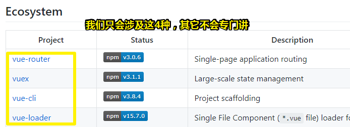

7. 文档

8. 问题

9. 提问（issues）

10. 变更记录：第一个版本有哪些东西，第二个版本有哪些东西……都要写在这里边

11. 如何取得联系方式

12. vue的源代码贡献者：主要是尤雨溪在编辑，但实际上全世界都有很多程序员在参与

所以可有我们这个UI库的README的大致结构：

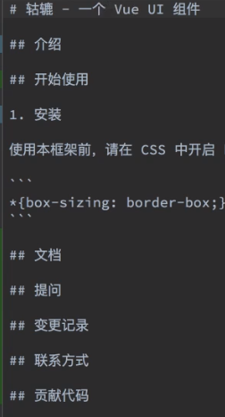

至此，我们要写哪些内容基本上就弄完了

### ◇开搞

1. 得到持续集成的标（搜索关键字：travis ci badge）：[Embedding Status Images - Travis CI](https://docs.travis-ci.com/user/status-images/)

   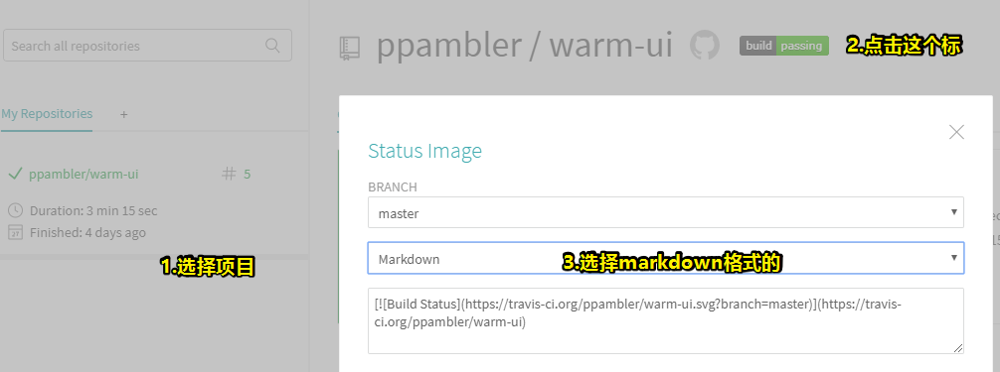

   [](https://travis-ci.org/ppambler/warm-ui)

   commit：`更新 README.md`

   使用 `git open`打开我们的当前项目的github

   那么除了加这个标以外，还能加哪些标呢？——搜索「npm badge」（badge：标记、徽章）

   找到一个标的集中营：<https://shields.io/category/analysis>，shield（盾牌、护照、盾形奖牌）

   总之，当你知道一个标怎么加之后，那么剩下的其它标的做法，也就轻而易举了

2. 介绍一下我们这个项目。目前做个简单介绍就好，如 「这是我在学习Vue过程中做的一个UI框架，希望对你有用。」

3. 开始使用：

   1. 添加样式：

      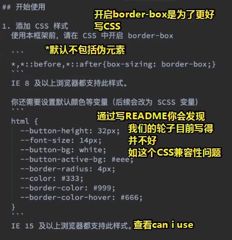

   2. 安装

      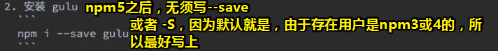

   3. 引入：

      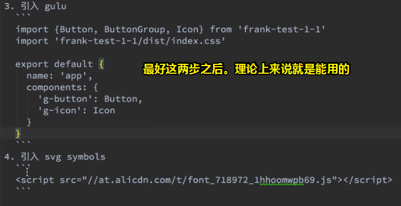

      如何让用户不需要引入svg symbols，就能用svg图标呢？——很简单，你帮它引入即可

      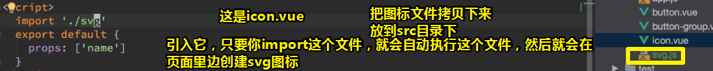

      

## ★遇到xxx问题的解决思路？

问题：[③](#san)

这个思路一般是看不到的，只要遇到了才能讲，没有遇到的话说了你也不懂！

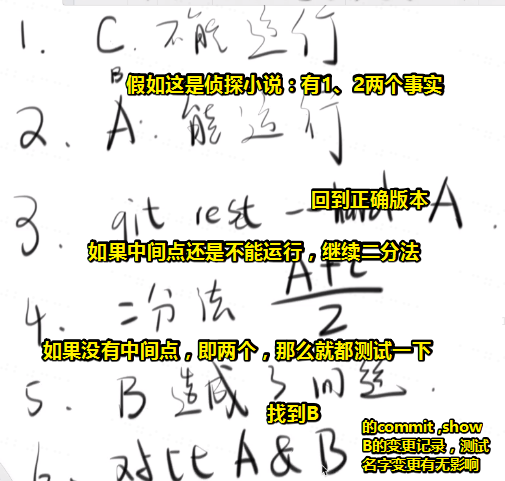

还做了添加一个index.js文件这样的变更，突然想起来nodejs作者说到一个坏的设计——index.js作为入口文件，于是怀疑是index.js的问题。

然后测试，果然是它的问题。

> 使用变量A、B这样来替代一个个版本，来讲解解决这个问题的思路

由于我们经常习惯性的 `npx parcel`这样

所以我们可以这样：

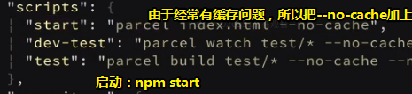

> 我在想是 npm start 而不是 npx start
>
> 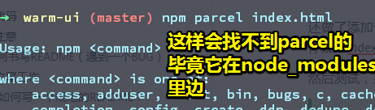
>
> 相当于是 执行了parcel index.html
>
> 难道npx 可以默认不写？即执行npm start 相当于是`npx parcel index.html`
>
> 而npx的作用之一就是让项目内部安装的模块用起来更方便
>
> 如之前：
>
> ```bash
>  npm install -D mocha
>  node-modules/.bin/mocha --version
> ```
>
> 现在：
>
> ```bash
> npx mocha --version
> ```
>
> 其原理很简单，就是运行的时候，会到`node_modules/.bin`路径和环境变量`$PATH`里面，检查命令是否存在
>
> 由于 npx 会检查环境变量`$PATH`，所以系统命令也可以调用。
>
> 所以我们可以这样：
>
> ```bash
> # 等同于 ls
> $ npx ls
> ```
>
> 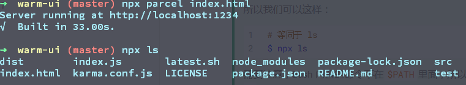
>
> 需要注意，Bash 内置的命令不在`$PATH`里面，所以不能用。比如，`cd`是 Bash 命令，因此就不能用`npx cd`。
>
> ➹：[npx 使用教程 - 阮一峰的网络日志](http://www.ruanyifeng.com/blog/2019/02/npx.html)

接着，我们运行一下测试用例 `npm run test`看看能否跑通

查看最近一个版本的改动 `git show HEAD`

修改一下README（有关iconfont的引入），然后commit：`去除对 iconfont 的依赖`

接下来做另外一个轮子（第二个）——input

那么怎么做呢？

还是根据以前的思路来做一下这个需求：

1. input有哪几种用例以及有哪些状态

---

## ★input组件需求分析

### ◇分析input有哪些用例

> 或者说是使用场景
>
> 可以参照：[输入框 Input - Ant Design](https://ant.design/components/input-cn/)

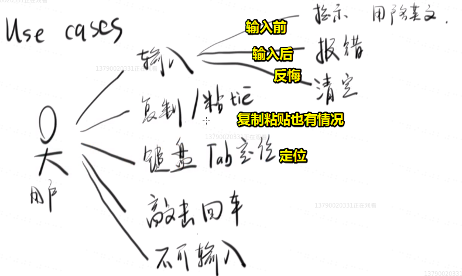

目前先收集这些需求，等我们在做的时候，大脑就有个大概的map了，即我们要完成这个input组件的过程中，即中间要走的路需要关注以上这么几个点。

### ◇一个input有哪些状态？

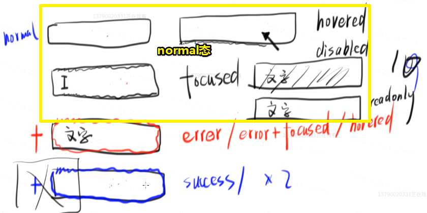

1. 最典型的就是直接一个input框，告诉你这个框可以输入内容
2. focused状态，输入内容时，或者说按tab键定位到该input时，会有阴影之类的
3. hovered状态，鼠标移到input框上边，就搞点阴影
4. disabled状态，虽然你能看到文字，但是就不能给你输入
5. readonly状态，这个状态对于大家来说其实很模糊，而且我们经常性的和disabled状态给搞混起来了，即很难分得清此时的input是disable状态还是readonly状态。稍微解释一下，这个状态，其实很简单，就是我输入了文字，但是不能改。总之，其实它们俩其实没有啥区别，如果说有区别的话，那么disabled状态就是更强调你不能动这个input。（这个状态在页面期间，可以通过JS更改）
6. 错误状态，有5种情况：error（红色阴影）、error+focused（在error的状态下聚焦）、hovered（在error状态下hovered）……。其实说白了，上面1、2、3情况，就是输入前和输入时的状态，而错误状态则是输入结束后的状态
7. 成功状态，同样是，success、success+focused、hovered……

> 目前，我们在考虑有哪些状态的时候，就先都考虑完，至于要不要做，就看我们自己的时间了

总之正常情况下有15（3*5）种状态。

分别是：

1. normal态/error态/success态
2. hovered态
3. focused态
4. disabled态
5. readonly态

我们要完成哪些状态呢？

success这一类状态就不用写了，因为这normal态太像了，只需要改个颜色就好了

总之，我们一定要完成10个状态，即normal态和error态这两大类

> 有人说到warming态，其实理论上来说，这跟error态差不多。只是颜色变了而已，如变成黄色
>
> 而success态，则是绿色的、原谅色的……

### ◇UI

> 看一下我们的UI能否满足我们以上所说的那么15种状态

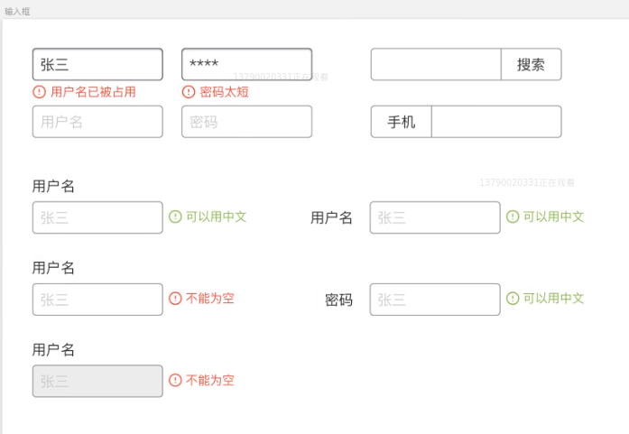

芳芳的设计想法：

> 左上角的是normal态，然后有个错误提示，即所谓的离开输入框后有个异步请求校验或者提交后报错

1. 有的时候我们需要一个很简洁的的输入框，即咩有label，然后加个提交按钮即可。加入输入不合法，那就报错呗，即最左上角那种
2. 更简洁的，一个input+按钮。它们俩之间没有空隙，跟我们之前的group-button组件一样，总之，就TM合在一起。
3. 有的时候需要做复杂的组件，如在input框的上边或左边有个label，然后默认会有个提示文字。当然如果错误了，其提示内容，可以放在input框的下边（假如一行放不下），总之，这应该是可以配置的

今天的内容看起来不多

但实际上做起来，其实这可能要比button还要复杂很多

毕竟，我们在分析状态的时候，它的状态要比button多

---

## ★写input样式

### ◇开搞

1. 在src目录下，新建一个input.vue，并写上基本的结构，即那3个标签呀——template、script、style：

   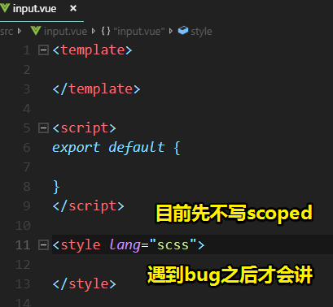

   如果你从未遇到过咩有加上scoped后出现的bug，那么直接告诉你加上这个scoped，是会让你缺少一个知识的

2. 先写一个最简单标签

   > 去掉之前在app.js里边写的测试代码以及全局注册input组件
   >
   > 
   >
   > 目前先用最朴素的姿势来弄

   一个bug，我们知道input是没有子元素的，即它是自闭合的，那么我们在使用g-input标签理应是自闭合的才对，然而这样做却出错了，为啥会不行呢？为啥现实和理想中的情况会不一致呢？

   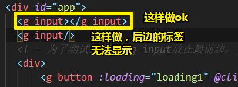

   总之问题是：为啥自闭合不行呢？

   因为vue的文档里边说得很清楚了，当然，vue文档里边说到这个点其实是很不起眼的，但是很容易导致莫名其妙的bug出现。总之，这里边大概是说「**vue的模板使用的语法是HTML，而不是说它是XML语法**」

   我们这样做 `<g-input/>`其实是XML语法，因为这个语法允许我们自闭合呀，而HTML语法是允许自闭合的，或者说vue会优先认为自定义标签应该是不闭合的，由于我们这个是自定义标签，所以你还是老老实实写上闭合吧！

   而且你在单文件组件的template里边，也不能写自闭合。还有你只写这样也不行 `<g-input>`

   总之，你用自定义标签，那么你就加上结束标签

   > 以上介绍并不好理解，具体解释参考这个：[⑤](#wu)

   ➹：[html自闭合标签加斜杠问题？ - 知乎](https://www.zhihu.com/question/33300917)

3. 开始写样式

   scoped出现的缘故：之前写button组件的时候，我们都是用 `g-button`这个class来写的，而这样做也是为了防止其它人写自己的样式时与我们为button组件所写的样式冲突，当然，这只是一厢情愿罢了，毕竟你无法避免人家真得会用 `g-button`这个class

   所以这个时候scoped就出现啦！

   那么scoped它是什么呢？——它表示有范围的

   不过，在使用它之前，还是先来测试一下没有它的版本，然后写样式会出现什么效果吧！

   1. 写个包裹器warpper（input组件的root元素，而warpper这样的class显然很大众），毕竟我们还有其它的元素

   经过测试，即点击某个组件咩有加scoped的样式，你会发现它是咩有 类似 `data-v-xxxx`这样的唯一id的，或者说是唯一属性。

   简单来说，我们编译单文件组件里边的样式的时候，是打包成一个CSS文件

   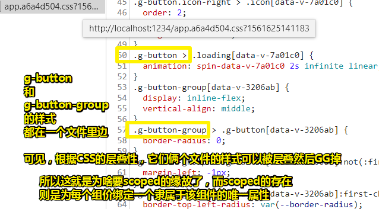

   而又了scoped之后，那么你使用这些组件自定义标签就会有有意唯一的类似id标识的属性。当然该组件标签的子元素也会有。而且一种组件只会有一种唯一属性，而其它组件则各有各的不同。

   总之，你如果用了scoped，那么在当前.vue组件里边的style标签里边，就可以随便写类，再也不用加什么 `g-button`这样的 `g`  前缀了，即为xxx组件写的样式，决定不会跟另一个组件冲突。

   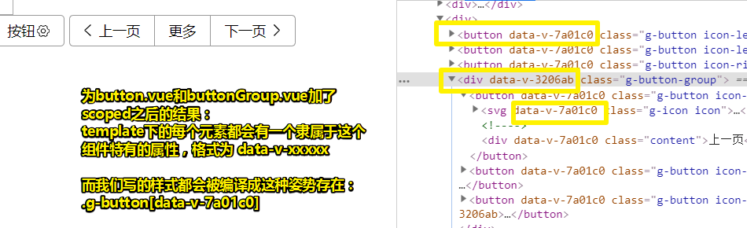

   总之，通过一个scoped属性，可以让其style标签下所有的选择器都是独特的。

   是否推荐它在每个vue组件里边都加上这个呢？——非常推荐。都加上就最好了。

   不过，加了之后，会有一个缺点。之后会说到。

   言归正传，一个组件最重要的其实是它的CSS（需要不断地调，费时间），不然，不好看的话，也就没有用了，这也是为啥直播写CSS的缘故了，不然芳芳就直接把CSS都写好，然后直接给你看就好了。

   在边写CSS，边看设计稿的过程中，其实我们前端最好有两个屏幕来写那是最好的了。

### ◇搞input的样式

1. 主要是搞内阴影，让用户知道focue到input的时候定位到哪儿元素。别忘了我们的template是套着一个div的，所以这是块级元素，我们应该把它改成是行内元素。

2. 为g-input添加value属性时，意味着要在input组件绑定prop对象里边添加一个叫value的key。然后让input标签v-bind一下

3. 搞disabled状态：默认不是disabled态。在vue里边，自定义标签传入disable有两种姿势：

   1.  `<g-input value="xxx" :disabled="true"></g-input>`

      这种姿势是有冒号的，表示true值是JS变量，而你不写冒号的话，则表示这个true是一个字符串值

   2. 推荐这种姿势：`<g-input value="xxx" disabled ></g-input>`

      这种是简便写法，毕竟在HTML的语法就是这样的，你有这个属性那就是true了。没有就是false了。

   颜色的调节技巧：本来是000的，但是为了看起来淡一点，于是变白点，就变大的点，如aaa、ccc这样

4. readonly态：其实芳芳一直觉得没有必要做两个，但是HTML5规范是有两个的。于是就做两个了。默认也是false值。

   测试之后，可以看到它与disabled态的区别：

   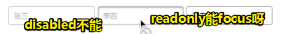

   当然它们俩都无法输入任何内容

5. error态：

   关于有无error类的写法：

   ```vue
   //error为true那么error类就存在
   <div class="wrapper":class="{'error':error}"></div>
   or 简写姿势：
   <div class="wrapper":class="{error}"></div>
   ```

   需要注意的是，如果这个input是error态的话，那么你focus上去的话，请另写一套样式。因为这会与之前normal态所写的focus样式叠加起来有点不和谐，如内阴影，应该也是红色的才对吧！而不是灰白色的

6. 为input组件引入icon组件。

   你在input的template里边使用了小写icon标签，那么它对应的就是icon组件了。

   > 我很好奇为啥是小写的icon标签，因为我们引入icon的时候
   >
   > ```vue
   > import Icon from './icon'
   > {
   >   components: {
   >     Icon
   >   }
   > }
   > ```
   >
   > 或许HTML标签语法本来就不允许大写的。

   icon什么时候出现呢？当为error态的input出现时就会出现。关于其HTML的写法有三种姿势：

   1. 一般你会这样写：

      ```vue
      <icon v-if="error" name="settings"></icon>
      <span v-if="error">{{error}}</span>
      ```

      但是这种姿势我们需要写两遍啊！

      如果你不想写两遍，那么可以这样（用个div来做）：

   2. 这样搞：

      ```vue
      <div v-if="error">
        <icon name="settings"></icon>
        <span>{{error}}</span>
      </div>
      ```

      而这样做无形增加了一个div标签，这其实是得不偿失的。毕竟我们并不需要多一个标签，而且加了这个标签之后，我们反而还要去加一些CSS。如 对div`display:inline-block;`一下，才能让它报错提示信息与input同处一行。当然，这看起来很繁琐。那么我们能否把div去掉，同时还可以写`v-if`呢？

   3. 这样搞：

      ```vue
      <template v-if="error">
        <icon name="settings"></icon>
        <span>{{error}}</span>
      </template>
      ```

      表示我想加个 `v-if`，但是我不想加个`div`

      而浏览器的渲染结果就是：

      ```
      input
      svg
      span
      
      而不是：
      
      input
      div
      	svg
      	span
      ```

      总之这样做了之后，就没有多余的div了。

7. 目前我们的icon并不够。如我们需要一个表示error态的input感叹号图标

   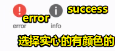

   然后我们再批量取色。

   毕竟我们可以用代码来加颜色。

   更新了iconfont.js之后，再次copy，然后更新本地的iconfont.js

   接着就是对error态的icon和错误信息居中，以及wrapper的不是最后一个子元素 `.wrapper > :not(:last-child)` 有一个0.5em的外边距，当然你也可以 `.wrapper > *{}`这样来，但没有前一种姿势简洁

### ◇小结

我们做了什么？

即我们为input写了哪几种状态

如：

1. disabled态
2. readonly态
3. 默认态（normal态）、hover态和focus态
4. error态，然后后边接着一些字，目前只做一个

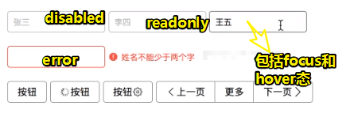

> 我测试的显示效果：
>
> 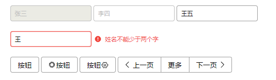

话说，提示如何做呢？

就加一个叫tip的input，它跟error的地位是等同的

之后会说到

总之我们目前的样式是ok的

接下来我们要做input它的事件

那么input有哪些事件呢？

它有很多事件，所以我们需要监听很多很多事件。

可是我们**真得需要**监听那么多事件吗？

---

## ★测试驱动开发

### ◇change事件

input最著名的事件就是change事件啦！

别忘了提交之前的代码，每当你要做一件重要事情，或者完成了一件重要的事情，那么你就得commit一下，而这也保证了我们能够很容易回到某个版本。

commit：`添加 input.vue 及其样式`

> app.js之后会删掉，但目前为了测试组件代码还是很有用的

change事件的触发：你在输入内容的时候不会触发，只要鼠标离开当前input框后才能触发

如何打出我们对input框输入的内容：

```vue
<input :value="value" type="text" :disabled="disabled":readonly="readonly"
@change="$emit('change',$event)">
```

这就是  `$event`的缘故啦

简单来说，input标签它本身是有change事件的，所以当用户change之后，就会触发一个事件对象 给自定义标签 `g-input`，而这个对象在vue里边是通过 `$event`来表示，而这个就是原生浏览器触发的change事件。

我们可以把这个change事件透传给下一个监听，即不对这个change事件做任何操作，然后直接通过change事件把 `$event`发送出去

总之，我们监听的g-input和input.vue里边的input可不是同一个input。

总之，你最好把input.vue的名字改了，如改为 Input.vue

简单小结一下：

> 使用：`<g-input value="王" @change="inputChange"></g-input>`
>
> change是事件名，`inputChange`是事件触发后要执行的回调函数，该回调函数的逻辑在其对应的vue实例里边的 `methods:{inputChange(e){}}`里边。
>
> ➹：[事件处理方法](https://cn.vuejs.org/v2/guide/events.html#事件处理方法)

1. 原生input触发了一个change事件

2. 我监听原生input change事件，然后借此触发了一个我们在g-input写的自己的change事件

3. 我们监听的g-input的change事件是我们自己的自定义标签

4. g-input的change事件被触发之后，就会去执行

   ```js
   methods:{
     inputChange (e){
     console.log(e.target.value)
   }
   ```

   这个在app.js（挂载点是 `#app`）里边写的inputchange函数

5. 那么inputChange里边的参数是哪儿来的呢？就是我们触发原生input change事件时所传的 `$event`

6. 那么 `$event`这个玩意儿是怎么来的呢？——浏览器给我的呀！浏览器告诉用户在change的时候所有的相关信息，然后再把这相关信息透传给外面的g-input标签。

   总之，这就是一个透传的关系啦！

   > **透传**，即透明传输（pass-through），指的是在通讯中不管传输的业务内容如何，只负责将传输的内容由源地址传输到目的地址，而不对业务数据内容做任何改变。

   我只要把 事件对象传给g-input的change方法就好了，我不管中间的路有多么曲折，只要起点和终点确定好就行了。

7. inputChange的第一个形参，叫啥也没关系，比如xxx，毕竟它是个形参呀！

8. 假如我这样做 `@change="$emit('change',$event, 'hi')"`

   那么 这个 `‘hi’`参数就是 `inputChange (e,xxx){}`的第二个参数啦！

9. 所以我们可以知道`$emit()`这个API的详细参数名，如第一个是事件名 `change`、第二个则是传给事件接收者的第一个参数、第三个则是传给事件接收者的第二个参数，然后如此类推的无限下去……

   但是一边来说，没有必要传第三个参数啦……因为只要一个事件对象就好了

   > 注意 `$event`的参数位置要一一对应。不要把 `$event`放到第三个位置里边，然后外边则用第二个参数来搞事。

同理，其它事件如input、foucs、blur等也是一个套路的写法。

不过，与其些代码去测试，还不如写测试用例去测试呢

### ◇测试用例——input、focus、blur

> 目前先写这3个事件。

第一个测试（套个路）：

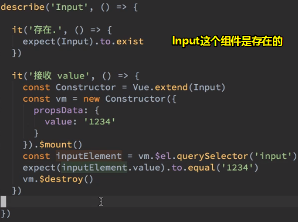

一个调试： 

我想知道inputElement所表示的DOM：

`console.log(inputElement.outerHTML)`

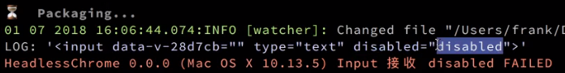

如果你在测试的过程中，拼错了单词，如这样：

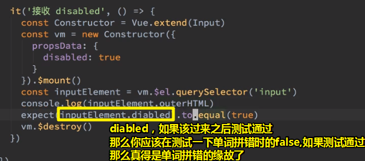

> 该过来：改过来
>
> 按我认为，改过来测试通过了，那就真得测试通过了。为啥还要测试一次单词拼错为false呢？

readOnly测试：

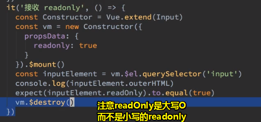

> 注意：有的时候，你的测试通过了，可能是你的代码写错了，所以我们一般建议是先主动错一次，然后再对一次。以保证测试用例是运行的了。不然我直接写个百分比正确的测试用例，岂不是无效的测试？

分组一下：

为什么？

之前我们一直在测试props里边的东西，即用户在自定义标签里边所传的我们所自定义的属性值。而这样做显然测试数量显然比较多，于是我们直接分个组——props

怎么做？

直接套一个describe就好了，如这样：

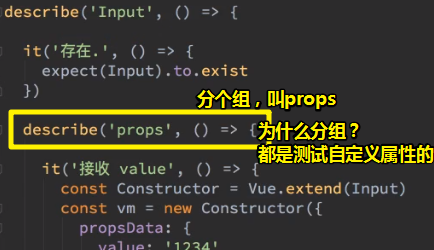

需要注意的是，你得写个错的，才能保证测试用例代码是真得运行了。然后再改回来。

总之，我们在无形中分了个组——props组，之后再测events组

从中也可以看出，我们写这个input组件的逻辑是怎样的，如先搞props（搞一个自定义属性，就搞一个样式），再搞events

### ◇什么是测试驱动开发？

把测试先写完，如果测试错了，我就写代码，如果测试没错，就写下一个测试代码。

### ◇测试事件处理

这个有点难度！

#### 提炼重复代码

我们可以看到之前的测试代码，你会发现有很多重复代码，正所谓事不过三，过三就提炼。

所以我们需要把这些代码给提炼出来

那么这该如何做呢？

看一下[mochajs的官方文档](https://mochajs.org/#hooks)——找到：

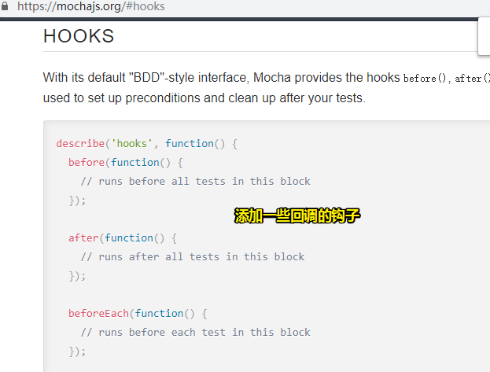

how：

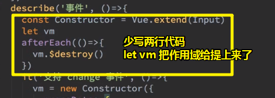

`afterEach`：runs after each test in this block，每个单元测试用例执行完毕后就执行一下`afterEach`里边的callback。而这也体现了所谓的  `When`，即何时执行。

#### 如何or怎样支持change事件？（How）

1. 使用spy函数呀
2. 只要触发了，就出触发spy函数

之前测试button的时候用过这种姿势

之前我们知道可以手动触发click事件，那么如何手动触发change事件呢？

```js
// Assuming we're listening for e.g. a 'change' event on `element`

// Create a new 'change' event
var event = new Event('change');

// Dispatch it.
element.dispatchEvent(event);
```

➹：[javascript - How can I trigger an onchange event manually? - Stack Overflow](https://stackoverflow.com/questions/2856513/how-can-i-trigger-an-onchange-event-manually)

为了用户传过来的value，所以需要验证我们用JavaScript所创建的事件，其传的event对象有哪些属性：

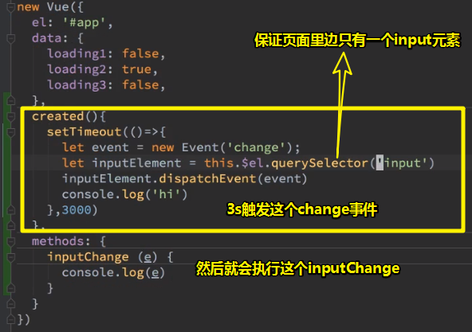

> 3s后 `$el`是可见的

created：[⑧](#ba)

效果以及JS产生的事件与用户自己触发的事件的区别：

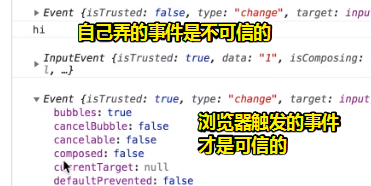

除了 `isTrusted`的值不同，其它属性的值都相同

所以可有测试代码：

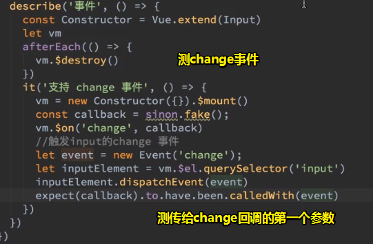

➹：[domenic/sinon-chai: Extends Chai with assertions for the Sinon.JS mocking framework.](https://github.com/domenic/sinon-chai)

同理，其它事件的单元测试也是如此。

所以这就是所谓的测试驱动开发（TDD）啦！

只要我们的测试都通过了，那么我们的代码全都写完了，可见这是件极有意思的事儿。

或许在写测试用例的过程中，出现很多bug，但是只要你修复了就ok啦！

优化测试用例代码？——因为80%都相似

如何优化？——直接使用数组遍历即可

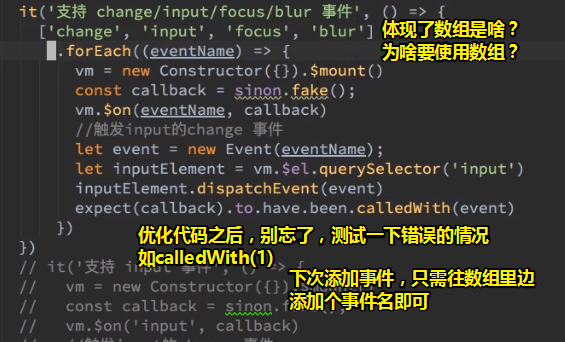

> 我在想：那个vm被destroy了吗？确实被destroy了，因为vm是在describe里边的局部变量呀！

不管怎样我们节省了许多代码

commit：`添加 input 的测试用例`

---

## ★让input支持v-model

### ◇如何写TDD?

第一次接触TDD或多或少都会有些不适，总之，就是不知道该怎么想TDD应该怎么写

其实做法很简单

1. 通过描述方法把所有功能都说一遍，如描述Input这个组件，它有哪些功能，如可以接收value值等等

### ◇解释 `karma.conf.js`

话又说来，我们的 `input.test.js`并没有引入 `chai`和 `describe`/ `it`这两个API

那么为啥我们就能直接用了呢？

因为我们一开始是通过`karma.conf.js`打开无头浏览器，然后这无头浏览器自动引入 `mocha`和 `sinon-chai`

既然引入了，那么就会有那两个API了

mocha提供了describe和it，它们都是直接挂载到window上边的全局函数。所以你也就不需要自己手动引入了

然后就是sinon-chai了，它表示同时引入sinon和chai，sinon它是用了做fake的，而chai则是提供了expect

话说，sinon和chai是如何体现合作的？

你只要引入了 `sinon-chai`就会在chai的expect上边添加一个叫calledWith的函数

总之，sinon提供了fake，chai提供了expect，sinon-chai提供了calledWith

可见，它们分工都很明确，如果你搞不懂它们，那么就各自查阅文档，看看这些API都来自于哪些库

总之，打开无头浏览器之后，引入karma、mocha、sinon、chai、sinon-chai

接着还要引入测试用例，如编译过后的测试用例js和css，即dist目录下边的内容

还有：

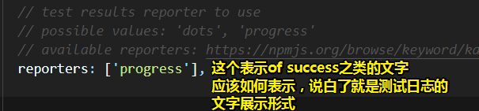

所以可以搞一下好看样式的reporters：

1.  `npm install karma-junit-reporter --save-dev`
2. `reporters: ['junit']`

➹：[karma-runner/karma-junit-reporter: A Karma plugin. Report results in junit xml format.](https://github.com/karma-runner/karma-junit-reporter)

如果你测试发现不好看，直接把安装的 `karma-junit-reporter`从 package.json里边删掉即可！

小结一下：

1. karma负责打开浏览器
2. mocha：提供describe和it
3. chai：提供expect
4. Sinon：提供spy，题外话sinon的翻译，西农表示「特罗亚战争中帮助把木马运进城的人」，可见这是「间谍」
5. sinon-chai：提供calledWith

### ◇双向绑定

Vue很早之前是支持双向绑定的，但是后来就不支持了

#### How

> 告诉你怎么用？然后让我们的组件也支持双向绑定，目前我们的组件只支持传参和事件，并不支持双向绑定

**①原生input标签是这样做到双向绑定的**

在How之前，先来看看什么叫双向绑定

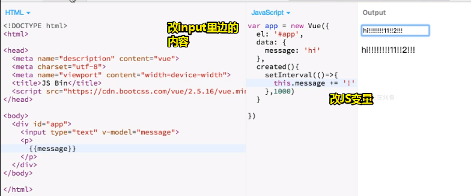

1. 用户的输入会绑定到JS变量，即用户输入的内容即JS变量的内容
2. 如果你用JS去改变量，那么用户的input框里的内容也会变

总之，改input框里边的内容JS变量会变，改JS变量的内容，input框也会变，那么这就是双向绑定啦！

> 为啥Vue现在不支持双向绑定了？目前来看不是支持双向绑定吗？它应该不是MVVM框架吧

**话说，我们的input组件如何才能做到这一点呢？**

那就得看你看文档看得好不好了

为什么Vue能做到双向绑定呢？

实际上是因为Vue其实不支持双向绑定，它是做了一个语法糖，当你写 `v-model`的时候，相当于写了两个东西

1. 你绑定了input的value
2. 你监听了input事件，而input事件执行的是 `message=$event.target.value`

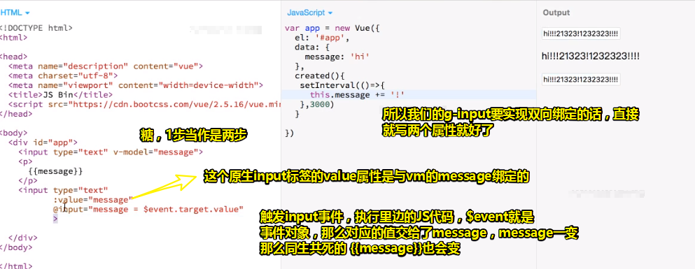

目前，我们的g-input都支持 `:value`和 `@input`这两个属性

所以，我们可以直接实现所谓的双向绑定

测试：

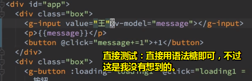

> button +1表示更新message的值，g-input的value值也会跟随着变化

我以为要写两步，没想到写一步就行了。（value不需要写了，因为v-model包含value）

小结：

- g-input要实现双向绑定：

  1. 要接收一个叫value的props

  2. 触发一个input事件，事件名必须叫input，而这是vue的作者规定的

  3. 传递给g-input的input函数，其第一个参数必须是value的值，即 `$event.target.value`，如

     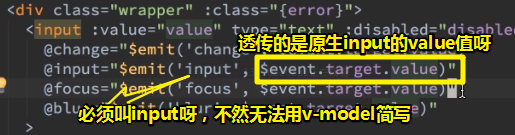

总之，你要你的input组件支持v-model只需要两句：

1. `:value="value"`
2. `@input="$emit('input',$event.target.value)"`

今天的作业：写出一个支持v-model的input，然后测试用例与芳芳一致，通过即可，通不过就继续搞到通过

回到单元测试，因为我们的测试已经挂了，毕竟我们为了做双向绑定，透传的参数时 `$event.target.value`，而不是原先的 `$event`

由于我们模拟的 event对象，并没有target属性，所以你不能这样：

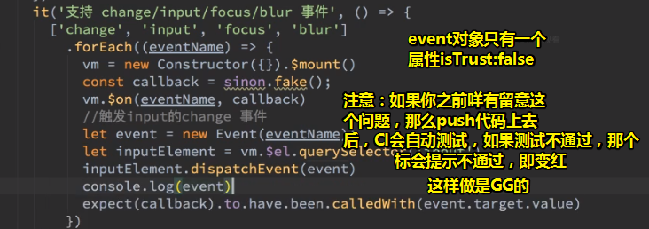

或许你打算这样：

```js
event.target={
	value:'hi'
}
```

自己给target一个value值，然而target是个只读属性呀

➹：[CustomEvent - Web API 接口参考 - MDN](https://developer.mozilla.org/zh-CN/docs/Web/API/CustomEvent)

所以我们如何才能给event添加target呢？

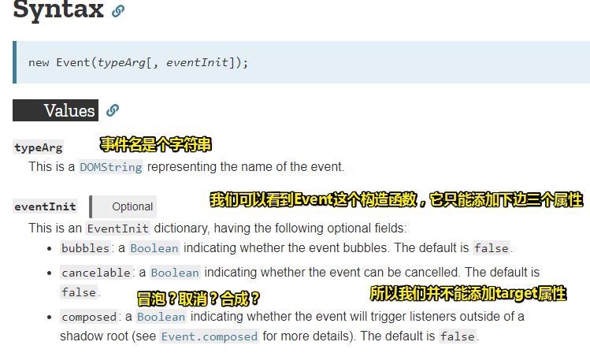

➹：[Event() - Web APIs - MDN](https://developer.mozilla.org/en-US/docs/Web/API/Event/Event)

> 我想打出event继承而来的属性，于是我这样做了 `console.dir(event)`，结果node不支持dir
>
> 注意这是在终端里边打的，也就是这 是node来执行的，
>
> 这就是为啥之前你在浏览器的控制台里边log event ，然后可以看到event很多继承而来的属性，而在终端里边只能看到 `{isTrusted: fasle}`，如
>
> 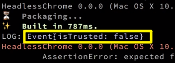

所以咋办呢？测都无法测了，谁叫我不知道如何为自定义事件添加target属性呢！

既然如此，只能问overflow stack了——「js new event set target」

➹：[dojo - How to set target property when simulating mouseclick in javascript? - Stack Overflow](https://stackoverflow.com/questions/27108094/how-to-set-target-property-when-simulating-mouseclick-in-javascript)

根据这个答案：

```js
dojo.query(".mybutton").forEach(function (node) {
  var target = dojo.query(".myclass").parents("#" + node.id)[0];
  var event = new MouseEvent('click', {
    'view' : window,
    'bubbles': true,
    'cancelable': true
  });
  Object.defineProperty(event, 'target', {value: target, enumerable: true});
  dijit.byId(node.id)._doEvent(event);
});
```

的

```js
Object.defineProperty(event, 'target', {value: target, enumerable: true});
```

➹：[数据的监听 - xdmala](https://ppambler.github.io/xdmala/04-%E8%BD%BB%E9%A1%B9%E7%9B%AE/02-%E5%AE%9E%E7%8E%B0%E4%B8%80%E4%B8%AAMVVM%E6%A1%86%E6%9E%B6/01-%E6%95%B0%E6%8D%AE%E7%9A%84%E7%9B%91%E5%90%AC.html#objectdefineproperty%E7%9A%84%E7%94%A8%E6%B3%95%E6%96%87%E7%AB%A0)

所以可有：

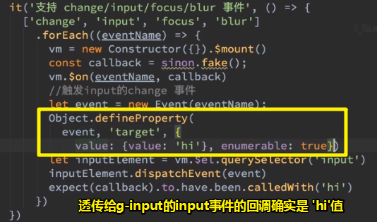

回顾一下我们做了什么：

1. 为了兼容v-model，那么我们之前的测试用例是用不了的，即原先是`calledWith(event)`
2. 而如今为了兼容，于是得 改为 `calledWith(event.target.value)`，即透传给 g-input的input事件的是用户往input里边输入的值
3. 然而我们的event缺少value这个值，即它的target属性是只读的，你不能对它进行赋值之类的修改（浏览器里边会自动补全even的值，如有value属性，但我们测试是没有这个value的）
4. 使用 `Object.defineProperty`这个API。用于破除target是只读属性的限制。然后模拟出一个hi数据即可，都是些假数据，无须理会数据是否规范。

> 有人问能否在构造event对象的时候，更改target值。而芳芳的回答是「你自己去试一下，反正我现在已经搞定了，我就不想试了」，我在想，很多时候我们已经有一个结果出来，为何还有多此一举去尝试一下那种无厘头的行为呢？毕竟官网已经给出了答案，我们在自定义而过一个事件的时候，只能确定是否冒泡等这样的custom（自定义），如这样：
>
> ```js
>  var event = new MouseEvent('click', {
>     'view' : window,
>     'bubbles': true,
>     'cancelable': true
>   });
> ```
>
> 你说如何在构造函数里边搞事情？难道这个构造函数API是你自己设计的？
>
> 总之，不要做一些无厘头的测试，因为这样的测试真得很费时间，而且也不会提升什么，毕竟都是解决同一个问题。不要想着以前做数学卷时的数学题的多种写法，毕竟在编程世界里边，DRY原则很重要。

`commit：让 input 支持 v-model 双向绑定`

push之后，CI会自动测试一遍，所以本地忘记测试了也没事，毕竟测试不通过，会给我们发邮件，而且如果测试失败的话，没有把它修复的户啊，那么我们的README图标就会更新为红色：

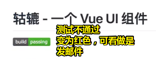

所以不用担心本地测试遗忘了。

---

## ★测试题

写出一个 input.vue 组件，使它通过以下测试：

```js
const expect = chai.expect;
import Vue from 'vue'
import Input from '../src/input'

Vue.config.productionTip = false
Vue.config.devtools = false

describe('Input', () => {

  it('存在.', () => {
    expect(Input).to.exist
  })


  describe('props', () => {
    const Constructor = Vue.extend(Input)
    let vm
    afterEach(() => {
      vm.$destroy()
    })
    it('接收 value', () => {
      vm = new Constructor({
        propsData: {
          value: '1234'
        }
      }).$mount()
      const inputElement = vm.$el.querySelector('input')
      expect(inputElement.value).to.equal('1234')
    })

    it('接收 disabled', () => {
      vm = new Constructor({
        propsData: {
          disabled: true
        }
      }).$mount()
      const inputElement = vm.$el.querySelector('input')
      expect(inputElement.disabled).to.equal(true)
    })
    it('接收 readonly', () => {
      vm = new Constructor({
        propsData: {
          readonly: true
        }
      }).$mount()
      const inputElement = vm.$el.querySelector('input')
      expect(inputElement.readOnly).to.equal(true)
    })

    it('接收 error', () => {
      vm = new Constructor({
        propsData: {
          error: '你错了'
        }
      }).$mount()
      const useElement = vm.$el.querySelector('use')
      expect(useElement.getAttribute('xlink:href')).to.equal('#i-error')
      const errorMessage = vm.$el.querySelector('.errorMessage')
      expect(errorMessage.innerText).to.equal('你错了')
    })
  })
  describe('事件', () => {
    const Constructor = Vue.extend(Input)
    let vm
    afterEach(() => {
      vm.$destroy()
    })
    it('支持 change/input/focus/blur 事件', () => {
      ['change', 'input', 'focus', 'blur']
        .forEach((eventName) => {
          vm = new Constructor({}).$mount()
          const callback = sinon.fake();
          vm.$on(eventName, callback)
          //触发input的change 事件
          let event = new Event(eventName);
          Object.defineProperty(
            event, 'target', {
              value: {value: 'hi'}, enumerable: true
            }
          )
          let inputElement = vm.$el.querySelector('input')
          inputElement.dispatchEvent(event)
          expect(callback).to.have.been.calledWith('hi')
        })
    })
  })
})
```


## ★总结

- 边听直播，即看着芳芳讲代码，其实一般是跟不上的。

- **你要知道为什么，才能心安理得的做什么**。刚刚做菜的时候，我才悟出了这个道理，那么这是怎么悟出来的呢？

  我租住的顶楼最近几天，水龙头流出来的水很少，之前做菜，水龙头流出的水量大，就一直是边开水，边洗菜，而如今水量小了，显然这种做法很不合理，即很费时间。于是我就买个桶，用于隔天晚上来蓄水，这样第二天起来做菜就快很多了。其实这个做法，在老家的时候就是这样干的，只是当时没有意识到这样做的好处，即你理所当然的接受了这样的做法，说白了，就是你不问为什么的就接受了老家那种做菜姿势。

  如果你知道了为什么，那么从你搬来这里的那一刻起，你就会明白，准备一个蓄水桶，会提高第二天的生活效率。

  很多时候，我们并没有「时间」去理解这样做的缘故，即why。

  但其实理解了why，你才能踏实得做些什么，毕竟我们或多或少会对未来的不可知而产生焦虑。

  当然，有些东西，你只需要知道怎么用即可，而它的why，并不需要我们去理解、去知道，如一些工具的使用。如我会开摩托车，那么我需要去了解其发动机的原理吗？不需要呀！如果坏了，就交给人家修就好了。简单来说，你可以付出金钱，把人家的能力当作是自己的能力来用，即所谓的「借力打力」。

  总之，有些东西是需要理解为什么的，而有些东西不需要理解为什么，但它们都有共同点，即学以致用。

## ★Q&A

### ①.zshrc？


 `$1`就是函数参数，如：

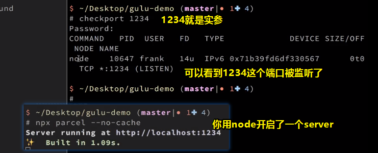

被node这个程序或者说是进程给监听了

至此，我不需要之前的  latest.sh 了，因为我可以这样提交：

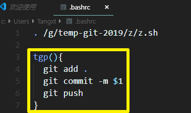

如果参数含有空格，那么你就加双引号

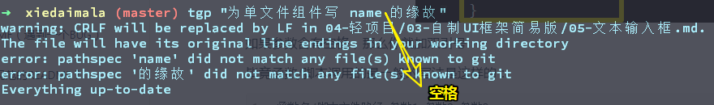

毕竟函数/脚本调用的最一般的写法是这样的：

```bash
函数名/脚本文件路径 参数1 参数2 参数3
```

➹：[SHELL与空格 - hyman.lu - CSDN博客](https://blog.csdn.net/gg_18826075157/article/details/78077602)

然而这做了，还是不行呀！依旧会报错

于是，继续找寻答案

发现了这种：

```bash
myFunction()
{
  echo "$1"
  echo "$2"
  echo "$3"
}
```

然而我测试了一下，还是不行

➹：[Passing a string with spaces as a function argument in bash - Stack Overflow](https://stackoverflow.com/questions/1983048/passing-a-string-with-spaces-as-a-function-argument-in-bash)

然而，最高票那么多赞，显然是我的bash有问题呀

于是，我们不用source .bashrc了

而是关掉bash，然后重新打开

而代码是这样的：

```bash
function tgp(){
  git add .
  git commit -m "$1"
  git push
}
#or
tgp(){
  git add .
  git commit -m "$1"
  git push
}
```

这两种姿势都行呀！

效果：

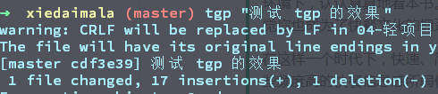

再次测试：

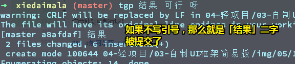

对了，单引号有空格也行。

### ②如何杀死node进程？

```bash
killall node
```

Mac下也是这样做

➹：[ubuntu - How to kill a nodejs process in Linux? - Stack Overflow](https://stackoverflow.com/questions/31649267/how-to-kill-a-nodejs-process-in-linux)

### <a id='san'>③睡了一觉之后，发现啥也没做，结果用npx启动server之后，浏览器访问无效之后？</a>

你可以：

1. curl一下：

   

   发现咩有结果

2. 猜测是否端口冲突，于是杀死所以node进程，再来一遍：

   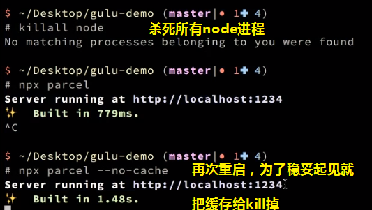

3. 是否是系统代理问题

4. 查看是否有node在监听1234端口

5. 换个浏览器

6. 删掉node_modules，重新下载npm包

7. 最终姿势：重启机器

不管怎样，很多时候你无须搞清楚为啥会这样，也许是你开的xxx程序把1234端口给怎么了。

然而重启机器之后，依旧无用

而这个时候，你需要注意的时候，一旦出现类似这样的问题，你就得先提交代码，这样你之前写的代码就不会消失了


commit之后，在执行这个命令，保证了我们的代码还能回来，不然一旦马虎了，代码也就GG了

回退之后， 请 `npm i`一下

保证之前安装的依赖

此时，倒是可以能访问server了

但是有点小问题

于是开始猜测我们之前是做了哪一步才会出现这样的问题

通过git log查看我们知道，我们使用二分法回到之前的版本，当然，你可以使用bisect这个工具来做到


➹：[Git 二分调试法，火速定位疑难Bug！ - 掘金](https://juejin.im/post/5a39dbfe6fb9a044fc44e0ea)

然而在`npm i`一下，结果又回到了之前无法在浏览器访问这个url的问题

当然，此时，我们又缩小了范围


nodejs的作者曾经说过一个问题：

他之前曾经把index.js文件当作是入口文件

即当我们运行 `npx parcel`的时候，首先找的文件是 index.js

简而言之，这命令等价于 `npx parcel index.js`

然而实际上我们要的是 `npx parcel index.html`

错误原因知道之后，就回到之前最后提交的那个版本


芳芳也不知道为啥要这样做，但是自己猜测就是ok的，而这样做确实成功了

总之，nodejs留了一个坑，而parcel又没有提示这个坑

总之，这个错误来自于我们需要导出我们需要的文件之后，就出错了，之前没有index.js这个文件之前是ok的，有了它之后就GG了

> 很多时候，你需要靠灵感来解决这些bug，如nodejs作者把index.js当作是入口文件

以上所有分析，都是芳芳的猜测

反正提高问题的解决效率，就能很快解决问题了

当然，如果你要证实这些分析，你要去看parcel代码了，去看看没有参数的时候会干嘛，如是找index.js还是index.html？

### ④为啥我们要在声明一个组件的时候，要写name呢？

大部分时候写这个name是没有用的，当然，在调试的时候，就有区别了。

```vue
<template>
  
</template>

<script>
export default {
  name: 'xxx'
}
</script>

<style lang="scss">

</style>
```

那么有名字和没名字的区别是怎样的呢？

很简单，你安装个vue开发者插件就知道了

安装后之后，刷新页面，重新打开开发者工具，你就会看到一个叫Vue的面板

可以看到：


关于name的值：

一般是按照我们所写的自定义标签名来，毕竟可以一一对应

如果写了 `name:"x-input"`，那么显示的结果就是 `XInput`

如果你不写，那么就根据你所写的自定义标签来大驼峰化了

而我们写单文件组件时的组件名，一般也是大驼峰命名，即如果你是input.vue，那么通常来说应该是Input.vue才对

而name则是与单文件组件名一致，这样文件名与调试时所呈现的组件名也就是一致的。

总之，name是用来调试的，方便你知道这个组件是什么，不然，就是拿变量名，即很容易被人随意的改。


所以可有：


总之，照理说，我的自定义标签应该改为  `w-input`哈！

但为了方便抄芳芳的代码，我只好用 `g-input`了。

小结一下，name的作用：

1. 帮助你在使用vue开发者工具时的标签命名
2. 还有一个作用，其实也跟开发时有关系，当然，这个以后遇到了再说。

### <a id="wu">⑤字符串模板和HTML模版的区别？</a>

字符串模板与非字符串模板(DOM模板或HTML模板)

字符串模板：

```js
Vue.component('c-first',{
 template: '<div>c-first用在了字符串模板中！</div>'
});
new Vue({
  el: '#app',
  data: {
    htmlStr: '<cFirst>c-first的使用算字符串模板</cFirst>'
  }
})
```

HTML模板：

```html
<div id="app">
  <div v-html="htmlStr"></div>
</div>
```

再看这个规则：

> **在单文件组件、字符串模板和 JSX 中没有内容的组件应该是自闭合的——但在 DOM 模板里永远不要这样做。**
>
> 自闭合组件表示它们不仅没有内容，而且**刻意**没有内容。其不同之处就好像书上的一页白纸对比贴有“本页有意留白”标签的白纸。而且没有了额外的闭合标签，你的代码也更简洁。
>
> 不幸的是，HTML 并不支持自闭合的自定义元素——只有[官方的“空”元素](https://www.w3.org/TR/html/syntax.html#void-elements)。所以上述策略仅适用于进入 DOM 之前 Vue 的模板编译器能够触达的地方，然后再产出符合 DOM 规范的 HTML。

好例子：

```vue
<!-- 在单文件组件、字符串模板和 JSX 中 -->
<MyComponent/>
<!-- 在 DOM 模板中 -->
<my-component></my-component>
```

在我的测试里边单文件组件里边同样不能用自闭合标签啊！然而照理说是可以写自闭合标签的。


哎，不管了，反正我就死写闭合标签

反正，挂载点——DOM里边，你写的自定义标签一定要闭合。

➹：[风格指南 — Vue.js](https://cn.vuejs.org/v2/style-guide/index.html#%E8%87%AA%E9%97%AD%E5%90%88%E7%BB%84%E4%BB%B6-%E5%BC%BA%E7%83%88%E6%8E%A8%E8%8D%90)

➹：[Vue文档中的字符串模板和HTML模版的区别？ · Issue #5 · GeekaholicLin/fragment](https://github.com/GeekaholicLin/fragment/issues/5)

### ⑥SCSS语法？

1. 声明一个变量：`$height:32px;`
2. 

### ⑦什么是串口透传？

> 透传：透明传输。就是不管所传输的内容、数据协议形式。只是把需要传输的内容当成一组二进制数据完美地传输到接收端。不对要传的数据做任何处理。
> 就像《非常人贩》里的斯坦森那样，他**不管后备箱里送的到底是货物还是毒品、是猪肉还是女人……只负责把货物送到目的地。**
> 串口透传这个词汇一般出现在串口模块中，串口模块接上MCU用透传方式把MCU要发的数据发送到接收端，串口模块不会对MCU要发送的数据做任何处理。

➹： [作者：陈俊直](https://www.zhihu.com/question/22272677/answer/20836054)

### <a id="ba" >⑧created这个API的执行时机？</a>

> 实例已经创建完成之后被调用。在这一步，实例已完成以下的配置：数据观测(data observer)，属性和方法的运算， watch/event 事件回调。然而，挂载阶段还没开始，$el 属性目前不可见。

➹：[关于Vue实例的生命周期created和mounted的区别 - 劝君惜取少年时 - SegmentFault 思否](https://segmentfault.com/a/1190000008570622)

### ⑨回顾单元测试？

➹：[單元測試：Mocha、Chai 和 Sinon - Summer。桑莫。夏天](https://cythilya.github.io/2017/09/17/unit-test-with-mocha-chai-and-sinon/)

### ⑩chai变量哪儿来的？


来自儿：


karma需要对chai进行处理，不然如果你自己引入的话，是无法接受处理过后的chai的结果的

### ⑪再看MVVM？


View是HTML+CSS+模板文件，ViewModel是JS+runtime+compiler，Model是Java/C#+业务逻辑处理+CRUD+数据库（MySQL、Oracle、MongoDB）。

以代码来解释：
Vue 的 View 模板：

```html
<div id="app">
    <p>{{message}}</p>
    <button v-on:click="showMessage()">Click me</button>
</div>
```

Vue 的 ViewModel 层（下面是伪代码）：

```js
var app = new Vue({
    el: '#app',
    data: {     // 用于描述视图状态（有基于 Model 层数据定义的，也有纯前端定义）
        message: 'Hello Vue!',  // 纯前端定义
        server: {}, // 存放基于 Model 层数据的二次封装数据
    },
    methods: {  // 用于描述视图行为（完全前端定义）
        showMessage(){
            let vm = this;
            alert(vm.message);
        }
    },
    created(){
        let vm = this;

        // Ajax 获取 Model 层的数据
        ajax({
            url: '/your/server/data/api',
            success(res){
                // TODO 对获取到的 Model 数据进行转换处理，做二次封装
                vm.server = res;
            }
        });
    }
})
```

> 我没有想到vm就是ViewModel呀！也就是我们写的JS代码

服务端的 Model 层（省略业务逻辑处理，只描述对外接口）：

```json
{
    "url": "/your/server/data/api",
    "res": {
        "success": true,
        "name": "IoveC",
        "domain": "www.cnblogs.com"
    }
}
```

不管怎样，mvvm意义是 实现了数据驱动开发

还有关于对Model层分划分，一般对前端而言是来自于VM的data属性，简而言之，是经过二次封装的Model，或者是直接赋值的。

我经常听到芳芳说Vue不是mvvm框架，而mvvm的核心是双向绑定，也就是说Vue之前支持双向绑定，而目前就不支持了，既然咩有了双向绑定，那么mvvm也就咩有了。可是input通过 `v-model`做的双向绑定难道不是真正的双向绑定吗？

或许我得说Vue是渐进式框架，而不是mvvm框架，因为双向绑定只是占了Vue的一小部分功能而已。就像是你不能因为某个人的小缺点，就说它这个人不好，总之你说Vue是mvvm框架，简直是对Vue赤裸裸的侮辱，毕竟老子vue可是前端界里边的框架三巨头之一呀，你说我只是个mvvm框架，那就是赤裸裸的瞧不起人了啦！

➹：[前后端分手大师——MVVM 模式 - DOM哥 - 博客园](https://www.cnblogs.com/iovec/p/7840228.html)

➹：[简单理解MVVM--实现Vue的MVVM模式 - 知乎](https://zhuanlan.zhihu.com/p/38296857)

➹：[vue是mvvm框架吗？ - 知乎](https://www.zhihu.com/question/311967891)

### ⑫一种input之双向绑定循环现象？

> 两个输入框AB他们双向数据绑定，如果A改变，B也跟着改变，此时B改变了导致A也跟着改变，A改变B跟着也改变.…….这样会导致无线循环啊？这个是怎么解决的？


两个输入框是不会出现这种问题的。

因为Vue只要发现当前的value是跟你要变的value是一样的，那么它就不会变，这就是vue的dom diff过程

> 按照我的理解，message是啥，那么AB就是啥啦！你改A那么也就是改message，只要message变了，那么两个AB都得变，当然，如果你说要扯到dom diff，那么你不断地重复赋一个相同的值，那么视图层的并不会有半点变化。

不过，如果出现精度问题的话，确实会出现循环的情况，当然字符串并没有精度问题


你输入1.99999……在JS里边，对message可能会有精度化计算

总之，我们往input里边输入的内容都是字符串，MDN里边有说到：

> `value` 属性是一个包含了文本框当前文字的[`DOMString`](https://developer.mozilla.org/zh-CN/docs/Web/API/DOMString)。默认是 空字符串

➹：[`<input type="text">` - HTML（超文本标记语言） - MDN](https://developer.mozilla.org/zh-CN/docs/Web/HTML/Element/Input/text#Value)

总之，就是不会循环啦！

### ⑬这段代码的意思？？


如果你通过 Babel 和 webpack 使用 ES2015 模块，那么代码看起来更像：

```vue
import ComponentA from './ComponentA.vue'

export default {
  components: {
    ComponentA
  },
  // ...
}
```

注意在 ES2015+ 中，在对象中放一个类似 `ComponentA` 的变量名其实是 `ComponentA: ComponentA` 的缩写，即这个变量名同时是：

- 用在模板中的自定义元素的名称
- 包含了这个组件选项的变量名

> 在template里边，你可以是 `<Icon></Icon>`或者 `<icon></icon>`

➹：[组件注册 — Vue.js](https://cn.vuejs.org/v2/guide/components-registration.html#%E5%B1%80%E9%83%A8%E6%B3%A8%E5%86%8C)

### ⑭`vm.$on`？


我们用JS代码使input元素触发了change事件，而不是用UI的方式。这意味着根据我们对input组件的定义，那么：


期待callback的参数是我们的event对象。（`$event`自己会读change事件对象）

说白了，input组件的监听change事件的回调所拿到的参数 就是 event对象啦！

> vm实例可以自己触发自己的自定义事件，如
>
> ```js
> vm.$on('test', function (msg) {
>   console.log(msg)
> })
> vm.$emit('test', 'hi')
> // => "hi"
> ```
>
> 关于change事件时如何在UI触发的？
>
> -  input输入框的onchange事件，要在 input 失去焦点的时候才会触发；
> - 在输入框内容变化的时候不会触发change，当鼠标在其他地方点一下才会触发；
>
> 我聚焦到input里边，此时未输入任何东西，一旦我不聚焦input，就会触发change事件，说白这个事件的触发并不是因为input里边的内容改变了，而是聚焦的问题。
>
> 而oninput 事件在用户输入时触发，它是在元素值发生变化时立即触发；

➹：[API — Vue.js](https://cn.vuejs.org/v2/api/index.html?#vm-on)

➹：[创建和触发 events - Web 开发者指南 - MDN](https://developer.mozilla.org/zh-CN/docs/Web/Guide/Events/Creating_and_triggering_events)

➹：[change - 事件参考 - MDN](https://developer.mozilla.org/zh-CN/docs/Web/Events/change)

➹：[input输入框的input事件和change事件 - baoyadong - 博客园](https://www.cnblogs.com/xuzhudong/p/8630610.html)

⑮⑯⑰⑱⑲⑳

