# 简单轮子：网格系统（下）

## ★重构与重写

我们之前 基本实现了 row 和 col 的功能。

由于全是CSS，以致于并不知道如何测，所以就不写关于它的单元测试了，毕竟眼睛直接看效果会好使很多。

接下来，大概一半的时间写基本思路；剩下的一半时间就是把之前所写的代码给删掉，然后重写。

那么哪种情况下要重写代码呢？或者说哪种情况下要重构？

简而言之，就是判断依据是啥？

### ◇重构与重写的区别？

#### 误区

很多人不理解重构，而这些人都把重构理解成了重写。

而且很多人认为重写仅仅就是把某个功能的代码全部给删掉，然后再重写一遍（行为上的重写），即认为改一点代码不算是重写，算是重构。

> 其实对代码的一种遗忘，然后再回忆理解，也是一种精神上的重写。当然，如果你记忆力牛逼，当我没说。

#### 区别

- 重构就是通过一些**微小的调整**，使你的代码变得更好，并且持续的去做微小的调整，而这就是重构啦！而其中的重点就是「微小的调整」
- 重写就是**大调整**

#### 一个重写场景

很多时候我们在做工程师的时候，会遇到这么一个情况：「由于时间很仓促，所以我们急急忙忙地写完了代码，然后第二天就发布了，同时我们知道代码很烂，但是我们安慰自己说『这没有关系，等我们有空了，我就会把我的烂代码给重写一下』，或者说是重构一下，这都无所谓」

总之，「一旦我有空了，我就会去改代码 」这句话或多或少会对自己或者其它人说过。

如果真得说过这样的话，那么你就真得完全错误的理解了重构和重写

因为只要你说了「一有空就去做什么」，而这一定就是重写啦！而不是所谓的「重构」

毕竟，当你积累了一大堆的问题之后，这个时候再去写的话，这是很难写的。

此时，你只能删掉，然后再重写。

毕竟，你不可能把历史的bug、这么错综复杂的代码给理清楚。

#### 一个重构场景

什么情况下我们才叫真正的重构呢？

你只要记住一句话即可「重构是每天都要做的事情」

而重写则是「隔一段时间做」，这跟你要改的代码多少没有关系，你不能说改一小点代码就不是重构了，当然，这说法是大概率是这样的。

#### 什么时候重构，什么时候重写

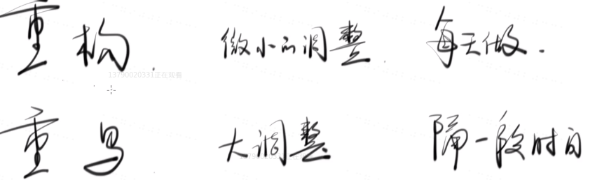

- 重构：每天做。如果不每天做，那么就是骗自己，即所谓的「一有空就去做」
- 重写：隔一段时间做。你骗自己，那就是费时费力的重写。

**为啥重构要每天做？**

你完成一个小功能，你就应该重构一下代码，再完成一个小功能就再重构，不存在什么我完成10个、100个功能之后再重构，毕竟你这个时候你都不知道你7天前做了什么功能，所以你还要重构什么呢？你还得要重想一遍代码呀！所以，这时候你会发现这不是重写吗？我TM以前写的代码都忘记了，让我再想一遍当初的逻辑，这岂不是相当于是全部重写一遍代码？

> 所谓的重写并不是说你改了多少行代码，而是说你对这段的代码已经遗忘了，你想「重构」一下这段代码，其实，这个实际上，你TM是在重写啊！因为你需要重新理解或者重想一遍代码的逻辑，即便你修改这段代码的代码量并没有多少。

总之，不要去做重写这件事情，也不要相信自己会去做这件事情。

### ◇哪些代码需要重构？

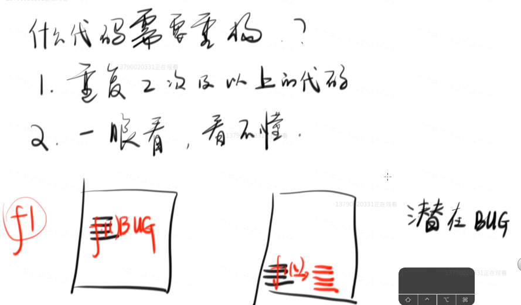

#### 特征

有一些很明显的特征：

1. 重复2次及以上的代码
2. 一眼看，看不懂的代码

#### ①重复2次及以上的代码

解释一波：

什么叫「重复2次及以上的代码就需要重构」呢？

比如说，你发现有一个功能经常写，于是你在A文件写一次，B文件再写一次。


那么什么时候会出现bug呢？

突然有一天，你发现这4行代码有bug，于是你发现B文件有这4行代码。于是你就更新了B文件的这4行代码，如添加一行新的代码，此时这个功能是5行代码。

你以为这样就完事了，但其实你忘了还有一个地方，如A，也用到了这4行代码。

不要觉得自己不会忘记自己曾经所写的代码，比如我现在就忘记了button组件是怎么写的了。

总之，没有人记得上一个功能是在哪个文件写的，所以说遗忘是件很正常的事。

所以，这就有bug了呀，一旦你两个地方，只改了一个地方，那么另一个地方就有bug了。（如果用户出问题了，就不要说忘了改了）

解决方案：

- 一旦出现了相同的两段代码，那么你就把它们给提取出来，封装成一个函数，A文件需要该函数，就引入进来，然后传入相应的参数。同理，B文件也是如此。如果需要更新，那么只需要更新这个函数即可。

总之，**重复两次及以上的代码，如果你不改，那么很有可能会因为需求变更，而变成1/2的bug，1/3的bug等等**……

> 两处重复，改一处，那么总体上看，就会出现1/2的bug

有人问到「多少行代码算重复？3行？5行？」——这得看重复次数，即使是一行代码也算重复，毕竟即使是一行代码你也可以变成一个函数，如DOM API 选择一个元素。

总之，具体问题具体分析，没有具体行数说这就算是重复了。（直接看芳芳操作就好了）

#### ②一眼看，看不懂的代码

什么叫一眼看，看不懂的代码呢？

举个栗子你就明白了，如这个：

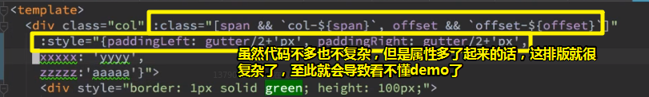

所以这个时候，我们就需要减轻眼睛的负担，让用户一眼就知道，我们在干什么

那么如何让用户知道呢？

很简单，你只需要加个中间变量就好了！

比如说 `:style`，其实这TM就是个对象而已，为啥不把它放在vm里边呢？

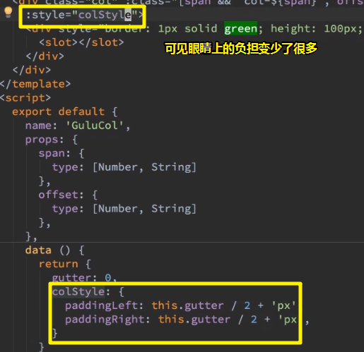

所以，有的时候重构并没有任何的逻辑优化，只是为了让用户能一眼看出来「这是什么玩意啊？这个对象colStyle是什么玩意儿啊或者说这个对象有几个key或者说这个对象到底是一个什么样的结构？」，反正就不需要做逻辑优化。

然而，你这样改了很有可能是有bug的，也就是说「**重构是有风险的，任何一个小重构都会有风险**」

就拿上边这个小重构的来说，你把它放在data里边，意味着，col一开始只会去读一次data里边的colStyle，毕竟这是个对象呀（引用地址没变）！简而言之，如果后面的this.gutter变了，colStyle它是不会变的

如果你想要「只要this.gutter一变，colStyle就变」，那么你应该用的是computed的属性，这在vue的文档里边说得很清楚

> - 对于任何复杂逻辑，你都应当使用**计算属性**。
> - **计算属性是基于它们的响应式依赖进行缓存的**。（依赖的this.gutter变化了，就会重写求值，即重新执行一遍函数，如果没有变化，就不会执行函数，直接拿到结果）
>
> **➹：**[计算属性和侦听器 — Vue.js](https://cn.vuejs.org/v2/guide/computed.html)

话说，gutter是什么时候变化的呢？——是在mounted之后才传进来的，而写成data的话，那么就只会在created的时候去读一次，之后就不会再读了。

至此，我们小重构一波，这个template模板也好看了很多，

同理，`:class`也要重构一波，毕竟也很长，而且还有 `&&`

而做法，也是用个中间变量，把它们给提取出来。


对了，你还得把内联的style给去掉，毕竟这显得很奇怪，当然我们这里添加的div只是为了做标记测试负margin而已，所以你可以无痛去掉它。

同样row组件里边的也要改一下。

至此，我们这两个组件看起来就显得很舒服了。

关于col里边的scss ，虽然看起不舒服，但没有办法，毕竟scss的语法就是有点丑。

总之，这两个组件，唯一除了css有点丑以外，都很好。

`commit：重构 row 和 col`

小结：

- 我们的重构就是把复杂的变成简易的
- 代码该是多少行数还是多少行数，不过清爽看很多
- 我们在学重构的时候，就不要一开始学什么原则，而是学一些小例子，于是你就会知道原来可以这样重构，可以那样重构，然后就ok啦

### ◇为啥需要computed的属性？

如果一个属性是根据另一个属性变的，那么你写在data里边是不会变的。

你应该写在computed里边，而这才会变。

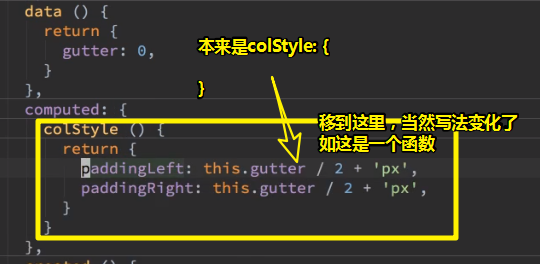

总之，computed的好处就是gutter变了，colStyle也会变，而这也是**使用这个属性的经典场景**

总之，一个属性是根据另一个属性变的，那么你就不能把它放在data里边，而是放在computed里边。

### ◇提取变量法

如果要给我们这次的重构姿势叫个名字的话，那就叫做提取变量法，即把一个复杂的东西，取一个变量名，然后你用的时候就简单一点，即用个变量即可。

---

## ★手动测试

### ◇模仿淘宝布局

通过模仿这个布局，从而来测试我们的row和col组件。如果有bug，那么久fix bug；如果写着写着觉得还是不咋方便，可以自己追加功能，如添加align属性

### ◇注意点

- 命名： `topbar`、`logo-search-qrcode`……有种几列的感觉

- 为g-row添加了个align属性，用于控制col是左对齐、居中对齐、还是右对齐，其样式用的是 ` justify-content`。注意如果col还是 `width:50%;`的话，那么这个样式就看不到我们想要的效果了，所以你要去掉它。

- g-row的子元素一定是g-col（如果不是g-col，那么g-row就咩有意义了），而g-col的子元素也可以是g-row，即可以嵌套着用。这样一来，我们不需要写其它的布局CSS了，只需要使用组件提供的样式即可，只要你能合理的添加组件提供的自定义属性就能很简单的做到。

- 做响应式图片的姿势，如果图片显得过大，那么你可以用 `max-width:100%`；如果一个图片溢出了容器给定的高度，那么你可以给个 `min-height:50px`这样，即给个最小高度。

- 如何判断一个图片是否居中，请把图片变小，如直接在元素身上设置width属性为50。不然图片显得过多会让你误以为是居中的，如这样：

  

- 在做logo的时候，不要logo-wrapper写在我们的自定义标签身上，因为这很有可能会有样式冲突：

  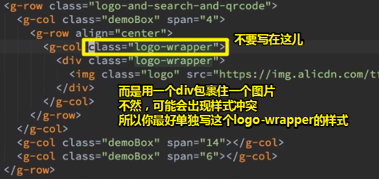

- 所有的线性、横向都可以用g-row。理论上用这种row和col重复嵌套的方式可以实现所有的布局

  

- 1px没对齐的那个问题，之后会讲

### ◇小结

- 如果我们想要去模仿淘宝的布局，使用row和col组件是有可能做到的，而且大部分布局都不用写CSS。小部分居中什么的，可以用我们的组件（row上的align属性），也可以自己写CSS，因为用我们的组件可能要4行，而你自己写CSS只要2行。

- 接下来说说如何做响应式

- `commit:添加 row 的 align=left/right/center 属性`，我们把width的50%给删掉了，而且还添加了align这么一个对齐方式

  > 请一句话描述清楚你做了什么。总之，你不要不说就直接提交了，当然，你也不要描述得太多

  

---

## ★工程师与设计师之间的权衡

### ◇什么是响应式

#### 举个栗子（画图演示）

我们经常会遇到响应式，比如说在PC上面或者说是在大屏幕上面，我们的布局可能是左边一个logo，右边4个导航这样的左右结构：

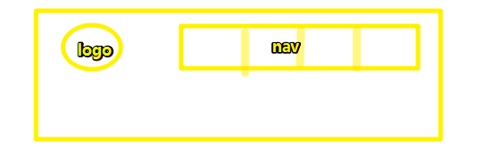

但是一旦到手机上面了，你就不能这么做了，即左右结构这种姿势肯定是不行的

毕竟设计师肯定要求说到手机上，比如说是这样子的：

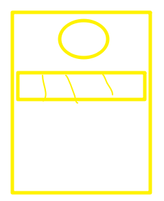

那么这种上下布局该怎么做呢？

#### 我们要做什么

我们注重通过改造我们的组件来实现上边这么一个需求。即屏幕大的时候是左右结构，屏幕小的时候是上下结构，而这就是响应式啦！

或许你会问「能否更复杂一点？」——更复杂不行呀，只能说改变位置……

比如复杂点的这样：

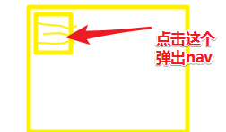

如果想做成这个样子，简单来通过我们的CSS是做不到的，你需要单独去写样式，而我们这个组件能满足的就是「横的变成竖的，竖的变成横的」或者说「本来是1/3，然后你想变成1/2」

总之，我们这组件只能做到仅仅是宽度和相对位置的改变，但是如果你想要添加行为的话，我们是做不到的。

> 需求：PC上左右结构；手机上上下结构。

### ◇一个问题

> 这是个号问题，大部分人都不会想到这一点

有人说「引入栅格后样式被组件给限制了，只能按照组件规定的搞事情，而这意味着我们写样式变得不灵活了，毕竟grid这样的布局，可以简单用flex和float就能做到了」

其实，我们引入栅格就是为了不灵活

### ◇灵活 与 限制

#### 是什么

这是一个抽象的话题。

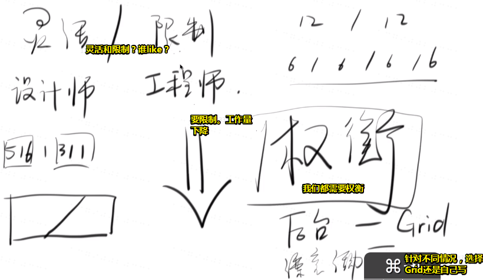

灵活是设计师想要的需求，而「限制」则是工程师想要的需求

假设我们现在是个工程师，然后xxx告诉你「我们页面的所有布局都可以通过几个数字来描述，你说你开心不？」比如说左右结构就是 `12/12`，平均4列的则是 `6/6/6/6`……

可见，只需要把这些数字写到代码里边，效果就出来了，你说你能不开心不？

而设计师如何才能让自己感到开心呢？

很简单，想怎么设计就怎么设计，如左右结构 `左516，右311，中间空个1px`、水平的两个元素的高度可以相等，也可以不相等、当然，你还可以设计成这样的布局：

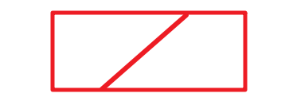

而这对于设计师来说是很开心的，可是对于我们工程师来说「就哭死了……」

所以说，工程师永远都想限制设计师，而设计师则是永远都不想被工程师给限制，即互相唱反调。

总之，如果你是工程师的话，你一定要去限制设计师，这样你的工作量就会大幅度下降了，毕竟你不需要再给每个页面重新去想这个CSS该怎么写了，只要复用以前的组件就好了。

所以这个叫什么呢？——就是所谓的权衡啦！

#### 什么时候灵活 ，什么时候限制

什么时候用我们的grid组件呢？

如果你是做后台管理的时候就用Grid，为什么会这样说呢？——因为后台管理是内部人员用的，而好不好看无所谓呀！

但是如果你是做一个新的产品，比如你需要做个漂亮的活动页，那么你就不要做grid了。

因为如果你做的活动页都是一格一格的话，那么谁会有兴趣买你的东西呢？

所以这也体现了所谓的权衡啦！

总之，权衡这东西跟程序员无关，都是具体场景具体分析。

不管怎样，你一定要搞清楚「什么情况下，我们需要灵活，什么情况下，我们需要去做限制」

### ◇小结

- 我用grid组件，你设计师凭什么要求我不用？——而这时候，你应该想「用不用，这主要看用户喜不喜欢」，如果用户不在乎长什么样子，那么你就用Grid，而这样一来，你一天就能写10个页面了；但是如果用户非常在乎页面炫不炫，那么你一天写10个页面，那就是不可能的事了，而10天写一个页面倒是可能的了。

- 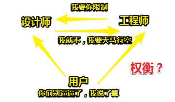

  在我看来，设计师是最需要做权衡的活儿，毕竟假如用户说页面要好看，那么设计师肯定会很快想到好看的页面设计，可是工程师不干了，表示「你TM设计得太灵活了，你是要整死我，是吧？」

  总之，设计一个页面既能满足用户想要的效果，又能满足前端程序员的工作量干少点，真是件要权衡的事儿……

  我偶然看到这样一句话：

  > 优秀前端是如何处理需求的:
  >
  > 有需求  =>  能不能不做这个需求 => 能不能把这个需求推给别人 => 找别人的库 => 自己写

  果然，想要我自己写？——不好意思，我真得很懒，我始终秉持着DRY原则

- 接下来回到响应式

---

## ★实现响应式

### ◇响应式的历史

### ◇参考其它UI库的响应式

### ◇设计API，看看怎么用？

### ◇注意点

- 在做媒体查询的时候，利用CSS层叠性，把适配大屏幕的媒体查询放到最后边，因为如果该媒体查询触发的话，就会覆盖之前小屏幕的width值。

- xxl、lg等这样的命名表示看不懂为何尺寸的屏幕，所以我们最好改成我们能看懂的，比如 `iphone-pc`、`iphone-narrow-pc`等这样的

- 在做移动端适配的时候，用的是简单但繁琐的姿势来做的，至此出现了很多重复代码，而重复意味着潜在的bug，所以我们不得不去重构它！注意，千万不要过几天之后再去「重构」，毕竟这时应该叫重写了。总之，如果你发现你一直在复制代码的话，那么这说明你该重构了。

- 让代码看起来的更简洁：

  ```js
  let validator = () => {}
  //简洁姿势：
  let o = {
  	validator,
  }
  //实际为(这种姿势表示很傻逼)：
  let o = {
    validator: validator,
  }
  ```

- 扩展语法：添加数组元素的不二法门。如 `[1,2,...[3,4,5]]`，结果为`[1, 2, 3, 4, 5]`，原理是遍历`[3,4,5]`，然后逐个push到数组里边去。注意，如果你 `[1,2,...(xxx && ['hello'])]`这样，假如xxx是个falsy值，如`undefined`，那么这个短路运算就会返回个 `undefined`，而`undefined`值显然是不可遍历的，所以此时就会报错。因此你得这样写（三目运算）： `[1,2,...(xxx ? ['hello'] : [])]`

- 如果你这个UI框架的定位是移动端UI的，那么在做一行布局的时候，就是默认的24/24，上下结构分布，但移到PC上时，就是12/12，左右结构。

- 如果只写iPhone、pc适配，那么ipad的适配应该选iPhone的还是PC的呢？——这是一个权衡问题呀！如果你的框架定位就是移动端的，那么选择iPhone无可厚非，即一行两个col的话，那就上下结构呗！否则你也可以选择PC的左右结构。

### ◇开搞

#### 添加phone属性（Object类型）

#### 如何让样式在PC上时和在手机上时是不一样的？

#### 适配其它移动设备


---

## ★总结

- 功能实现了，就马上commit，如之前 `基本实现了 row 和 col 的功能`
- 千万不要把无用代码提交到代码库里边，因为这很无聊，如`console.log()`等……
- 如果你隔了一段时间重想了某段代码，而你打算重构这段代码，而这TM的其实是在重写啊！
- 可以去模仿一个淘宝布局，看看我们目前所写的row和col组件有哪些功能上的不足，如添加了一个align属性，相应的添加了对应的样式。
- 


## ★Q&A

### ①Vue，props的validator的`['xxx','yyy'].includes(value)`语法？

这是自定义验证函数。

`includes()` 方法用来判断一个数组是否包含一个指定的值，如果是返回 true，否则false。

如果该验证函数返回的是true，那么就是验证通过了。

**➹：**[JavaScript Array includes() 方法 -菜鸟教程](https://www.runoob.com/jsref/jsref-includes.html)

**➹：**[Prop — Vue.js](https://cn.vuejs.org/v2/guide/components-props.html)

### ②一行为啥要考虑分24份呢？

这是行业规则，设计师定的。

非要说理由的理由，那么就是它很好处理

比如说，24 除以 2、3、4、6、8、12都是整除的

相比其它如21等就不咋地了

> 其实是960可以分割成以下宽度的整数倍：
>
> ```
> 2, 3, 4, 5, 6, 8, 10, 12, 15, 16, 20, 24, 30, 32, 40,
> 48, 60, 64, 80, 96, 120, 160, 192, 240, 320, 480
> ```
>
> 当你弄成是24的时候，你会发现24*40是960px
>
> 这里的40是gutter的宽度 + Column的宽度
>
> 当然，我们的col用的是百分比宽度1/24，即24个格子加起来的总体宽度，就是我们的页面宽度。也就是说，40是可变化的。而gutter会根据设备独立像素来做响应式的变化。
>
> 突然觉得，用百分比当作当作是格子的宽度，意味着，在你看设计稿的时候，看的是这个元素占了一行的24分之几。就拿这个为例：
>
> 

总之24能大概率的得到整数，即它的约数有很多。当然还有12、16的

**➹：**[超全面！栅格系统及其在后台设计中的应用总结 - 优设网 - UISDC](https://www.uisdc.com/grid-system-and-application-in-background-design)

**➹：**[栅格 Grid - Ant Design](https://ant.design/components/grid-cn/)

**➹：**[栅格系统，以及为什么需要栅格系统 - 简书](https://www.jianshu.com/p/cb0ecb763373)

### ③有gutter和无gutter的应用场景？

有gutter：

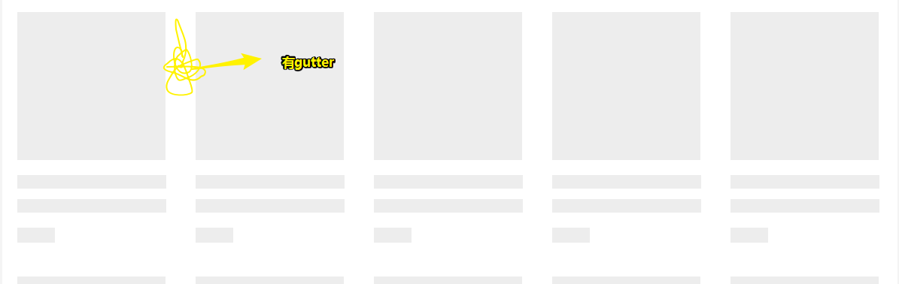

无gutter：


> 其实这里应该是有1px的gutter。

### ④关于灵活？

> 我认为CSS很灵活，正因为这样的灵活，让我们所写的CSS多了许多的不确定性。而这种不确定性，让我觉得CSS是真得难。

难道我们程序员就一定喜欢限制一点的东西？可是如ES6的解析赋值这样的语法，让我们在赋值给一个变量的时候，显得特别灵活啊！

难道我们程序员喜欢先有限制，后有灵活？

像是JavaScript相较于Java这样就很灵活了，可是灵活过后，又出现了像是typescript这样的限制

总之，我认为灵活与否，限制与否，似乎都不是我这渣渣程序员能决定的，能决定的是语言的创创造者、框架的创造者、组织机构等等，而像我这种垫底的程序员，是无法接触规则的制定的，只能接受规则和适应规则，而且99%的人都是如此。

讲真，我是真得佩服那些创造规则的人。

当然，我们制定的这个UI组件库，也可以算是一个小小的制定规则的人。

**➹：**[为什么 Web 前端开发不抛弃 HTML 和 CSS，用纯 JavaScript 开发？ - 知乎](https://www.zhihu.com/question/21445727)

**➹：**[为什么 CSS 这么难学？ - 知乎](https://www.zhihu.com/question/66167982)

### ⑤max-width？

max-width 属性用来给元素设置最大宽度值. 定义了max-width的元素会在达到max-width值之后避免进一步按照width属性设置变大.

[`max-width`](https://developer.mozilla.org/zh-CN/docs/Web/CSS/max-width) 会覆盖[`width`](https://developer.mozilla.org/zh-CN/docs/Web/CSS/width)设置, 但 [`min-width`](https://developer.mozilla.org/zh-CN/docs/Web/CSS/min-width)设置会覆盖 [`max-width`](https://developer.mozilla.org/zh-CN/docs/Web/CSS/max-width).

> 一旦触发了max-width，那么该元素的宽度就是这么大了。

<script async src="//jsfiddle.net/Ambler/ahu4v9k2/embed/html,css,result/"></script>

再次理解：

css中，min-width是用来限制元素的最小宽度，max-width用来限制元素的最大宽度，也就是说**当元素的width大于max-width,或者小于min-width。就被它们的值所代替**，尤其适用于网站的自适应。

以下为它们的区别和联系：

1. min-width,max-width的权重高（当元素设置了这2个属性的时候，即使在width后面使用了!important，如果元素实际宽度没在min-width,max-width的范围内，也不会显示width中的值）

   ```css
   /* 我权重高，important来了也不行，显示得依旧是600*/
   div{
       min-width: 600px;
       width: 400px !important;
   }
   
   /* 显示得依旧是400px*/
   div{
       max-width: 400px;
       width: 600px !important;
   }
   ```

   当然，如果你在范围之内：

   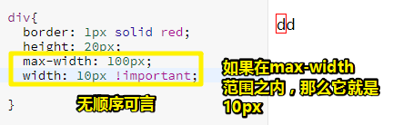

2. min-width与max-width值的大小出现冲突

   当min-width的值大于了max-width的值的时候，元素最终的宽度显示min-width的值。

   ```css
   /* 显示的是600px */
   div{
       max-width: 400px;
       min-width: 600px;
   }
   ```

3. 利用max-width可以实现元素逐渐变宽的效果。

   当我们不知道元素的具体宽度，可以结合transition来实现动画延迟效果，如下：

   <script async src="//jsfiddle.net/Ambler/o5ke4frx/embed/"></script>

同理，min-height和max-heigth也同样类似， 在不知道元素具体区域宽高的时候，使用这些属性能很好让网站实现自适应效果

**➹：**[max-width - CSS（层叠样式表） - MDN](https://developer.mozilla.org/zh-CN/docs/Web/CSS/max-width)

**➹：**[原生js给DOM元素添加一个或者多个类的方法总结 - 涂涂 - CSDN博客](https://blog.csdn.net/qq_34645412/article/details/78925962)

**➹：**[理解css中min-width和max-width，width与它们之间的区别联系](http://www.fly63.com/article/detial/561)

### ⑥我一直都弄错了解析赋值？

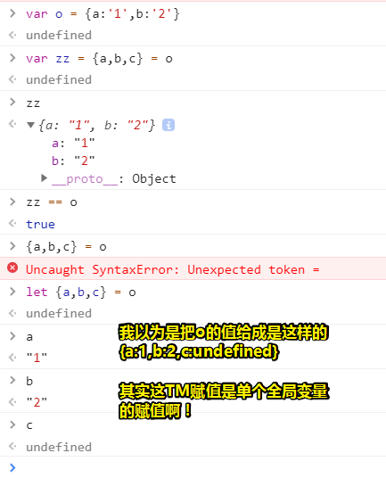

### ⑦简单理解扩展运算符？


