# 简单轮子：网格系统

## ★课程简介

网格系统

1. 什么是 Grid
2. UI
3. 代码
4. 测试

## ★讲义

### ◇什么是网格系统/栅格系统？

[知乎问答](https://www.zhihu.com/question/19602912)

就是把一个 div 分成 N 个部分（N = 12,16,24...），每个部分无空隙或者有空隙。
完。

### ◇设计图

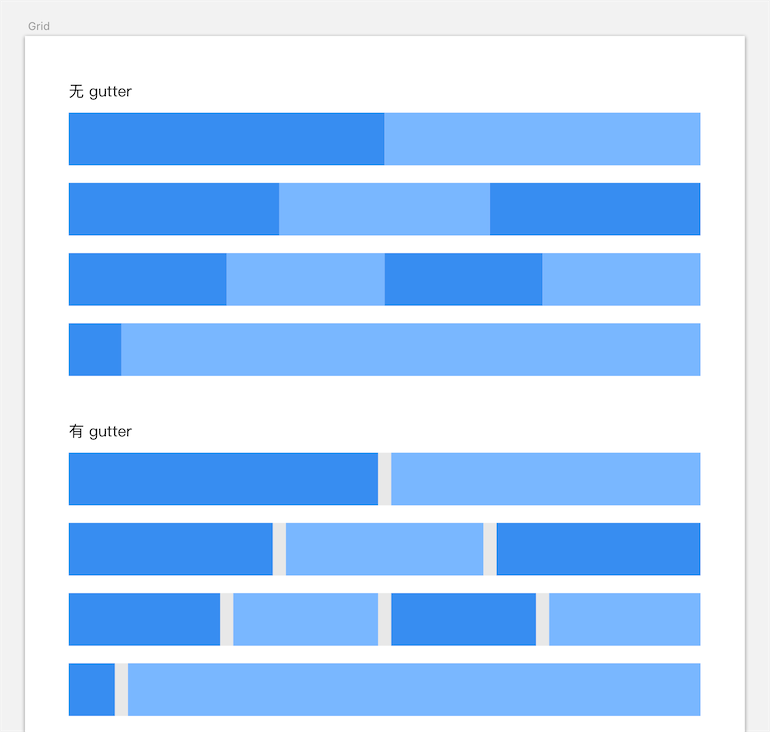

[语雀链接](https://yuque.com/u29422/gulu/228198)

### ◇代码

[链接](https://github.com/FrankFang/frank-test-1/tree/grid/src)
请注意看 row.vue 和 col.vue，已经对应的 test 文件

### ◇测试

[代码](https://github.com/FrankFang/frank-test-1/blob/grid/test/row.test.js#L14)

这次测试多了一个知识点：done 的使用

---

## ★网格系统

### ◇回顾前几节课

01、02、03这三节课不记得讲了什么，也没有啥关系，你只需要记住一句话即可，而这句话需要在你的工作生涯里边反复的去理解，最终你会发现这句话是多么的真实。

那么这句话是什么呢？——那就是：

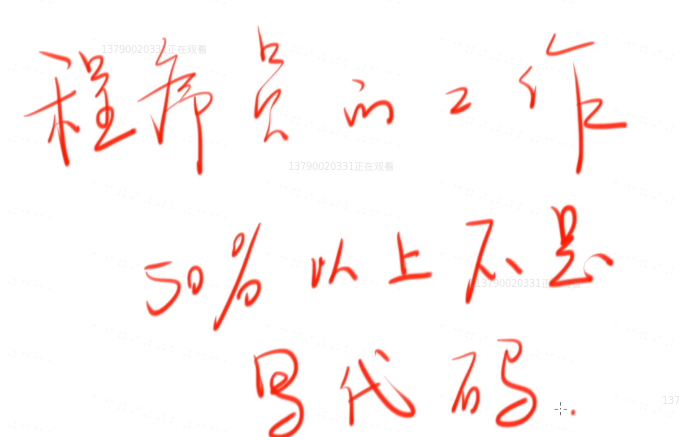

> 是工程师的工作，而不是程序员的工作

这句话就是前三课里边的核心内容啦！

可是，不写代码，我们能干嘛呢？

1. 你可以回顾一下我们整个网站的开发流程

你就会知道，剩下的不是写代码的50%工作是在讨论需求、跟UI设计师扯皮、跟后台设计师协商设计接口、测试……

这4项内容一定要超过工作内容的40%，至此，你才是一个合格的程序员，或者说应该是工程师（我们要做的东西是工程，你可以看到应聘岗位都叫前端工程师，而不是前端程序员），毕竟程序员主要是写程序的。

总之工程师和程序员的区别是：**工程师大部分的工作不是写代码，而程序员主要是写代码。**

越到高级你会发现，一开始你有90%的时间在写代码，后来80%、40%、30%，最后你做到高级程序员，你会发现我只需要有10%的时间在写代码就已经非常不错了，即**一周能有一天写代码的时间就已经非常不错了，而这就叫做高级程序员啦，毕竟TA要关心很多其它的事情。**

话又说来，前三节课所讲的内容是50%以上的时间不是在写程序，而45课则是告诉大家「如果你要从0开始搭建一个稍微大型一点的项目，你要考虑哪些东西？」

比如你要用哪些工具、哪些测试框架、以及我要如何去分我的目录之类的……

接下来的几节课就专心写代码吧！不用去管那些配置之类的问题了，总之之后就不停地写代码就好了。

### ◇什么是网格系统？

在一些地方也可以叫栅（读zha吧，如果你喜欢可以读shan）格系统

那么它是什么呢？——你可以到知乎里边搜搜

但其实它并没有明确定义，当然，我们自己可以给它一个定义：

> 就是把一个 div 分成 N 个部分（N = 12,16,24...），每个部分无空隙或者有空隙。

网格系统是**Web设计师**的一个方法论，注意这不是前端的一个方法论

我们以淘宝为例，看看淘宝是否使用了网格系统，当然它或许不是一个非常典型的网格系统，但是我觉得它应该也是用到了：


我们可以用眼睛来看看淘宝首页的结构是怎样的，如

从上往下看（分析）：

1. 左右结构
2. 左中右结构
3. ……

在CSS里边有个特别简单的规则，在CSS grid （未来的语法）出来之前，CSS只有两种布局，一种是横向布局，一种是纵向布局。

你可以看到左右结构是横向布局，如果你把左右两部分当作一个整体，把左中右这三部分同样当作是一个整体，那么这两个整体之间就是上下布局啦！

而每个上下布局里边就是左右和左中右结构啦！

而左中右的中，又是上中下这样的纵向布局！


除了这横向和纵向两种布局方式以外，就没有其它布局方式了。

而我们的网格系统主要研究的是「如何做横向布局？」

继续分析淘宝首页：


> 有种木桶效应的感觉，如果一个div针对水平另一个div来说是短板，那么这个短板很有可能是因为上下结构而来的。
>
> 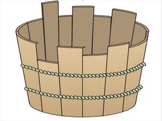

经过分析之后，你可以发现，CSS的所有布局方式都可以简化为横向布局和纵向布局

可是我知道这个又能怎样呢？

呵呵，知道这个之后，你就可以进一步去想想「我能不能把这种东西简化成一个组件呢？然后以后所有的横向布局和纵向布局都可以通过这个组件搞定！这样一来，就不用自己去想这些布局该如何写了」

于是，我们就借鉴了一个设计师的概念——栅格系统

而前端可没有这个概念，这个概念可是设计师发明出来的

### ◇看看芳芳的设计图

**➹：**[Grid · 轱辘 · 语雀](https://www.yuque.com/u29422/gulu/228198)

无Gutter：

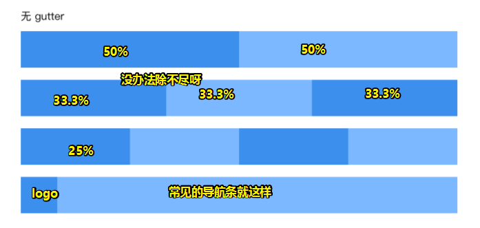

水平div之间是没有空隙的，而这个空隙在英文里边叫做Gutter（中间有一条小沟）

如果你想要让它们俩中间有空隙，那么就是这样：

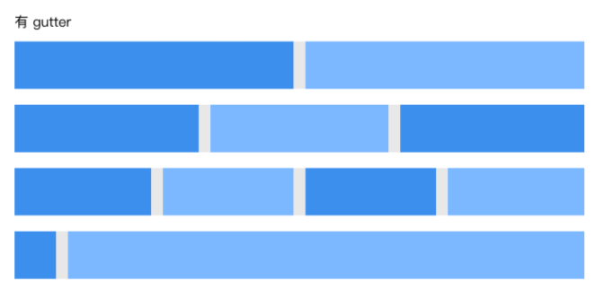

那么我们现在要做一个什么样的东西呢？——能实现左右布局，而且可以有空隙，也可以没有空隙，而这就是我们的目的啦！
在这里用例就不用画了，即那些所谓的交互。毕竟它就是一种CSS布局而已

既然如此，那么我们只好想想这API应该怎么设计了？

### ◇API设计

> 这API该如何设计呢？即这自定义元素的DOM该如何写呢？

假设一个用户使用你的组件，你觉得他会怎么使用？

当然，你可以去参考一下各个大牌的UI厂商是怎么做的：

**➹：**[组件 - Element](https://element.eleme.cn/#/zh-CN/component/layout)

**➹：**[栅格 Grid - Ant Design](https://ant.design/components/grid-cn/)

**➹：**[栅格 Grid - Ant Design Vue](https://vue.ant.design/components/grid-cn/)

芳芳主要参看ant design 是怎么做的

分析如下：

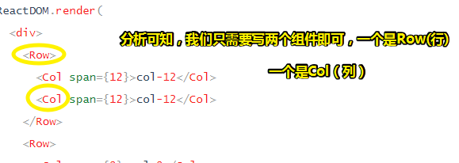

而ele则是这样的：

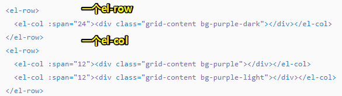

> 如果你发现打开ele很慢，那么你就打开network看看是哪个请求慢了

不管怎样，一般我们在设计轮子的时候，一定要防止「其它的轮子做成是圆的，而你的轮子则是做成方的」

通过对比，我们打算仿制的是ant design的

接下来，让我们来想想我们应该做成什么样的：

1. 做个左右结构，左边50%，右边50%。

   ```vue
   <g-row>
   	<g-col></g-col>
   	<g-col></g-col>
   </g-row>
   ```

   上边这种姿势并不好，因为你内置自动计算为50%，可是假如是40% 和 60%呢？这该怎么自动计算？
   所以我们设置了这样一个规则，默认整体的宽度为24，当然，也有人搞为12和16的，不过这都没有24好算。

   如果左右50%，那么一个div的跨度（span）就是12了。

   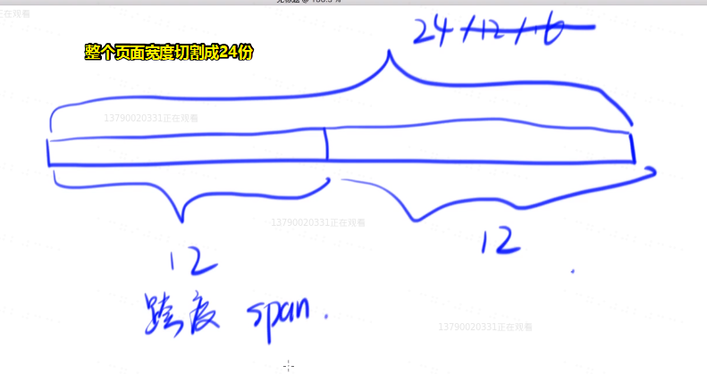

   所以你应该这样（表示我各占一半）：

   ```vue
   <g-row>
   	<g-col span="12"></g-col>
   	<g-col span="12"></g-col>
   </g-row>
   ```

   同理，其它的也是如此。

2. 如果一列有三个，那么写三个g-col，跨度（24/3）都为8。

3. 如果logo占用1/12，那么就是2和22啦

4. ……

通过上边这样的语法，就可以表达无gutter这样的布局。

那么有gutter，即row div 里边有空隙呢？

在这里我们可以看到，其实每个空隙都是相等的，如果空隙不相等，是比较难弄的，当然，我们只满足相等的即可！

那么相等的gutter该怎么写呢？

直接写到g-row里边：

```
<g-row gutter="12">
	<g-col span="12"></g-col>
	<g-col span="12"></g-col>
</g-row>
```

同理，其它的g-row的gutter也是12，而不是8、6之类的。

到此为止，我们已经把一个简单的需求——把如何设计API给写完了，即不用去想用例（交互），只需要想用户怎么用就好了

有人问到「栅格有什么用呢？我工作中并没有用到。」

做出来之后，你就知道有什么用了，比如做个淘宝布局，用我们这个栅格布局，那是分分钟的事儿啊！

> 如果轮子的UI设计跟ant design、ele等重复了，你说会侵权吗？
>
> 或许他们并咩有打算说自己的这么一个框架可以用20年，所以就先这样设计一下呗！你爱重复就重复……

既然API写好了，那么接下来我们就可以开始写组件了。

## ★git branch & git checkout 的使用

在正式开始写组件之前，来稍微学习一下一个知识点：「git branch如何使用」

根据芳芳的实际工作经验来说：

1. 发现一些老员工反而不会用这个命令，毕竟他们以前主要用的是svn，而git branch 他们有点难理解，毕竟一旦你习惯了某种姿势做一件事，那么再转过来，其实是件很困难的事儿

   总之，如果你一开始用的是git，那么你就会对git branch理解得更好一点。

   像是芳芳就是很理解git branch怎么用了，也很经常用。但是理解svn的branch就不怎么好理解了，而且也不敢用，毕竟怕自己用错了，而git就可以随便用啦！

### ◇ git branch的用法？

为啥需要？

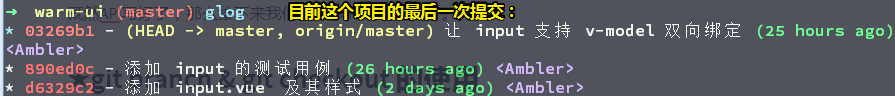

> HEAD：在git里边表示当前所处的提交名字，即最开头的

如果我们在原来的基础上继续写这个布局组件的话，那么这就会有一个很大的问题呀！

比如说，我们把所有组件都写完以后，那么这提交大概有几百次吧，那么当你回顾这个布局组件的提交过程时，显然，不知道在哪写提交记录是属于它的啊！

所以我们能否把每做一个阶段的代码都给保存一份呢？

形象点来说就是，你从出生到现在23岁，你每过一个生日都给你照张相，那么当你老了的时候，你就会想「我10岁时是长啥样的？」，于是你就拿出了一张自己10岁时的照片，一看「嗯，老太婆，你看我当初是不是风华正茂？」

芳芳是这样的比喻的：master是一个代码宇宙。建一个分支branch1，即把宇宙分裂开来！branch1是为当前的glog做了一次备份，之后我们继续在master里边提交代码。而branch1始终不变。

How？

新建一个branch分支（名字是button-and-input）：

```bash
git branch button-and-input
```

简简单单的一句话，就完成了芳芳所说的宇宙分裂。

总之，这句话执行了，此时还是处在master分支里边，代码啥的都咩有变化，说白了就是声明了一下宇宙一分为二了，一个叫master，一个叫button-and-input


此时你并没有切换分支，还是在master里边，于是，你创建了两个文件测试一下branch（button-and-input）里边会不有刚刚提交的新纪录：

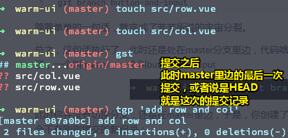

目前这个button-and-input分支还在本地，所以我们需要把它push到远程分支里边去，那么这该如何push呢？

很简单，直接这样：

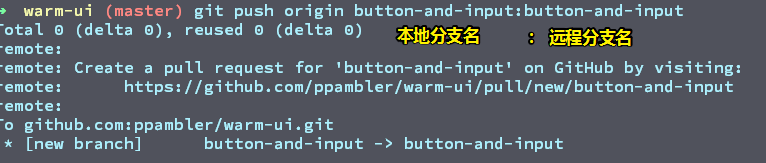

这句话说的是把本地的分支push到远程分支里边去。相当于到远程里边做了一个备份。

我们可以看到，这该命令之后，log出来的信息表示啥也没干，而远程仓库有个新的分支

远程仓库效果：

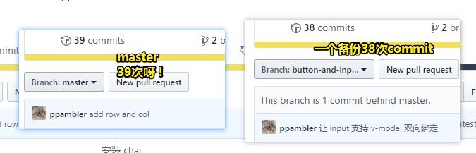

> 突然感觉github的存在就是让本地仓库可视化了。

我们在远程仓库里边很容易就能切换到另一个宇宙了，那么本地仓库切换宇宙呢？

同样很简单：

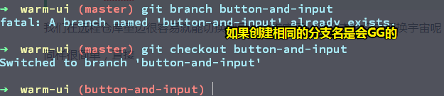

此时它的glog：


此时HEAD在button-and-input这个宇宙的里边，而且指向的是这个提交

所以当你切换到这个分支以后，你所看到的代码并咩有看到在你创建这个分支之后，而master又更新了最新的代码。

总之，你看到这个分支，是历史代码，这个代码未来会发生啥事情你都不知道，除非你切换到了master里边去。

一图胜千言：

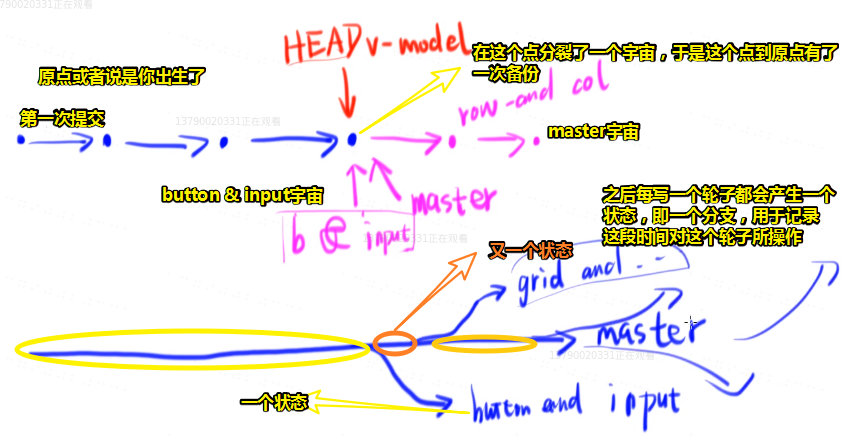

> 之后会分裂十几次。

小结（回顾操作方法）：

1.  `git branch`：新建分支
2.  `git push orgin 本地分支名:远程分支名"`：把本地分支提交到远程分支里边去
3.  `git checkout`：切换分支

之后会讲到merge

**➹：**[创建与合并分支 - 廖雪峰的官方网站](https://www.liaoxuefeng.com/wiki/896043488029600/900003767775424)

> 我们本地分支是可以继续提交代码的，可是合并分支到master里边会出现啥情况呢？

有人问「为啥芳芳要讲Git呢？」——在芳芳看来，涉及到什么就讲什么

ps：有人说到

> 你这么做的话，以后的分支都会带着以前的组件呢，这个分支没有做到每个分支只有一个组件

确实如此啊！可是每个分支都得基于前一个分支才能正常运行起来啊！如果你打算单独拎出来一个组件那也没事儿。

---

## ★用Vue钩子实现基本功能

之前介绍了git branch的使用，那么现在就回到正题啦！

> 关于webstorm的版本，请用最新版的。如芳芳目前的2018版对Vue的支持是非常好的（旧版本支持得不好），当然目前是2019年，那你就用2019年的版本咯！

### ◇完成 row 和 col 的雏形

建议一开始不要用row，不然，会让我们的问题变得复杂。

#### 不用自定义标签怎么做？

> 在index.html里边写完样式之后，再放到组件里边去

1. 写好dom结构，如：

   ```html
   <div id="app">
     <div class="row">
       <div class="col"></div>
       <div class="col"></div>
     </div>
   </div>
   ```

   之后会改成自定义标签的形式

2. 写样式。

   先写col的样式，如给定宽高，不过宽度是百分比，而高度是px

   如何让这两个col div变为左右结构呢？——使用flex啊！而不是float，毕竟现在的浏览器都支持flex了。

   关于左右结构：两个div的宽度都为50%

3. 同理做三列的也是如此，而且无须修改div的宽度值。即不用改为33.3%这样的

4. 四列也是如此。可见。flex很容易做到这一点，不需要加什么就可以做到了。

   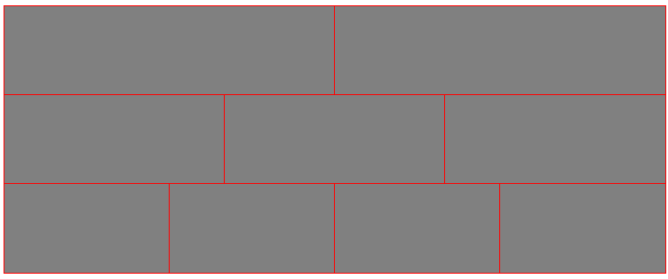

就目前而言，似乎比不用自定义组件还要好，可是当你做下一个需求——左边占1/12，右边则是11/12时，你会发现这种姿势需要自己主动去计算，毕竟现在不是平均分配啊！

```html
.col[data-span="2"] {
	width: 8.333333%;
}
.col[data-span="22"] {
	width: 91.666667%;
}
<div class="row">
	<div class="col" data-span="2"></div>
	<div class="col" data-span="22"></div>
</div>
```

> 一般保留6位小数。

而这仅仅是一个2和22的跨度，假如人家写1和23、3和21这样呢？

那么我们岂不是还要写：

```css
.col[data-span="1"] {
	width: 4.166666%;
}
.col[data-span="3"] {
	width: 12.5%;
}
……
.col[data-span="24"] {
	width: 100%;
}
```

也就是说我们为了两栏布局、通栏布局、三栏布局等这样，需要写24次这样的样式。而且每次都得自己计算一遍跨度数字所对应的宽度。

你说这样是不是有点傻啊！


这时你就应该想到去用Sass啊！而不是继续是用CSS。

可见，在这种变态需求的折磨下，你会觉得Sass是多么的有用啊！那是真得香啊！真想唱一句「多么痛的领悟！」


**➹：** [demo](./demo/06/01-网格.html)

所以接下来我们就改成组件的写法，并引入Sass。（这下你该知道why了吧！）

#### 使用组件和Sass

**①注意点**

1. 使用scoped之后，template的class不需要加前缀了，因为有了它会自动加个hash，表示跟其它组件元素区分的这么一个依据。如不需要这样 `class="g-row"`，而是直接这样 `class="row"`

2. 我们在row.vue里边使用了slot，之后会检查这个slot到底是不是合理的col。

3. 使用自定义标签，注意，需要完标签里边写上内容，才会有样式。我也不知道为啥会这样，原生标签就不会出现这种情况。

4. 程序员默认使用i是从0开始的，如果不是从0开始的，那么我建议你用n。参考sass的for each语法

5. 一般来说，组件在JS里边用大写，如你在引入组件的时候：

   ```js
   import Row from './row'
   Vue.component('g-row',Row)
   ```

6. 快速删除整个style标签，定位到style标签范围，直接输入dat (delete at tag)，这可能是vim的快捷键，当然在vscode里边，你可以 先折叠demo `Ctrl+shift+[`，然后再用鼠标选中删除。

7. webstorm的重构语法（定位到单词，鼠标右击，重构），修改某个位置的变量名，则其它位置的同一个变量名，都会一起修改。如 `$class: col_;`它表示的class前缀对吧！那么我们最好把它叫做 `$class-prefix: col_;`

8. JS的模板字符串语法，即插值是这样的 `${xxx}`，而SCSS则是这样的 `#{$xxx}`，SASS里边，所有*变量*以`$`开头

9. 之所以写span，即跨度，是为了不对称（一行里边的div可以是不同宽度的div）。

**②如何使用Sass把24个跨度对应的宽度样式给做出来呢？**

很简单，用Sass的for each即可做到

根据CRM，直接搜索 「scss for loop」，我们用的可不是sass语法。

**➹：**[html - For loop in SCSS with a combination of variables - Stack Overflow](https://stackoverflow.com/questions/10570400/for-loop-in-scss-with-a-combination-of-variables)

**➹：**[SCSS Loops - CSS-Tricks](https://css-tricks.com/forums/topic/scss-loops/)

直接抄例子：

```scss
$class: col_; //class前缀

      // loops through 100 times
      @for $i from 1 through 100 {

        // for each $col_#{i} 
        .#{$class}#{$i} {

          // set the background-color to cornflowerblue and 
          // each time lighten the color slightly
          background-color: darken(cornflowerblue, 0% + ($i / 2));
        }
      }
```

修改例子：

```scss
.col {
$class-prefix: col-;
@for $n from 1 through 24 {
  // .col.col-1,这个#可不是.#col-1,类似于JS的${xx},$class就是css变量，而xx则是JS变量
    &.#{$class-prefix}#{$n} {
      width: ($n / 24) * 100%; //这是乘以100%，而不是加100%，这是芳芳猜的，并没有看文档，当然，这是猜正确了
    }
  }
}
```

效果（4句代码搞定）：

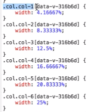

> Sass的功能之一：可以通过程序批量生成同一类特征的CSS代码。

**③如何让我们的`g-col`自定义标签可以使用跨度 `data-span="22"`？原生标签可以直接写属性，可自定义标签可不能直接写呀？**

很简单，直接让col组件接受一个props为`span`的家伙就好了呀！

```js
export default {
	name:'GuluCol', 
	props:{
		span:Number
	}
}
```

> 按照之前的理解 `span:Number`是错的，然而运行成功了
>
> 显然，这是另外一种写法，根据芳芳的说法是，这不是一种标准的写，而标准的写法是这样的：
>
> ```js
> export default {
> 	name:'GuluCol', 
> 	props:{
> 		span: {
>       type: Number
>     }
> 	}
> }
> ```
>
> 这是vue的作者考虑到「用户会不会只想写类型，而不想写default之类的」，所有才有了另一种写法。

使用：

```html
<g-row>
	//会报错：因为传过去的是字符串2
  <g-col span="2">1</g-col>
  <g-col span="22">11</g-col>
</g-row>
<g-row>
  //加上个冒号表示，传过去的2是个数字2，说白了加冒号表示『』里边的是JS代码
  <g-col :span="2">1</g-col>
  <g-col span="22">11</g-col>
</g-row>
```

然而加上冒号并不方便，很多人都会忘记加。所以如何保证不写冒号也能不报类型错误呢？

```js
export default {
	name:'GuluCol', 
	props:{
		span:[Number,String]
	}
}
```

这表示，你可以传数字或者字符串都行。可见我们也像Vue的作者那样（考虑props不传default值），考虑用户会如何使用我们的组件。

那如果我加了冒号，还想写字符串呢？

```html
 <g-col :span="'2'">1</g-col>
 <g-col :span="`2`">1</g-col>
 <g-col :span='"2"'>1</g-col>
```

总之，外边的双引号是HTML的引号，不属于JS代码这样的内部内容，甚至你可以把这两个双引号给删掉，但是建议最好不要这么干，因为这不规范，而且很没有意义。而双引号里边的「」是JS的「」，所以传过去的内容就表示字符串哈！

搞清楚HTML的引号和JS的引号，你就能面对有冒号的属性，去表示字符串值了。

写上属性之后，就得给相应的CSS了：

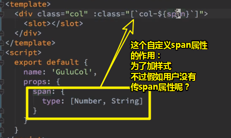

> 使用数组的形式添加class，数组元素即为class类名。回顾冒号，『』的内容是JS代码。

目前我们基本上就实现了网格系统（说白了实现了自定义标签的做法），但是这还有一个bug，之后会说到。

至此，我们就实现了第一个最基本的需求：「把一行分成24份，你想占多少份，你就写个span即可」

小结：

1. 写对称的：不用写span
2. 写不对称的：要写span

`commit：row 和 col 的雏形完成`

---


## ★总结

- 为啥要写个网格系统组件？——那是因为在grid布局出来之前，CSS的所有布局方式都可以简化为横向布局和纵向布局，那么我们为何不把这种布局方式抽象为一个组件呢？这样一来，不用每写一个页面都得重新写一遍布局了。

- 为啥g-col需要span属性？——那是需要跨度；为啥g-row需要gutter属性？——那是需要间隙。

- 为啥要`git branch`？——我只想回顾有关布局组件实现的提交历史。而不是master里边的几百个commit。

- 我似乎养成了一套学习姿势：先why，后how，最后what。为啥要 `git branch`（线）？如何做到 `git branch`（面）？ `git branch`到底是啥（点）？（我以前总把完成一个项目当前是线，可这其实是面啊！即如何完成一个项目，需要用到知识点的what，然后就是组装知识点的how，而如何组装how需要知道知识点的why才行。）

  我之前了解过黄金圈法则，但是你问我为啥需要黄金圈法则呢？当时我是不知道的。而你现在问我，我可能会说「它可以让我对一个知识点记得更牢固一点。但是目前我并不能通过这个知识点做到举一反三。」

  不管怎样，我发现自己是进步了，这是件可喜的事儿，而这也是我之所以学习编程的缘故之一。

- 当我看视频的时候，应该先过一遍，即要把它要讲的知识点给罗列出来，具体是如何理解的，不需要去写，总之就是写个知识点的标题。来到第二遍，把理解的过程给写一遍（抓住why和how）。第三遍，可以可无，比如「直接copy芳芳的代码」就是无，或者「你牛逼一点自己不看芳芳的代码，自己撸一遍」就是有。

- 关于布局，如果不破坏布局的话，可使用 `box-sizing:border-box;`

## ★Q&A

### ①为啥是xxx-xxx(g-row)？

关于g-row（为啥要加 `g-`），因为Vue官方建议自定义标签，最好是这样格式的 `xxx-xxx`，而这样可以避免万一哪一天「HTML6」出来了，然后自带了一个叫row的标签，这样一来岂不是跟我们的冲突了吗？所以我们应该尽量避免这种简单单词情况的发生，即我们要加个前缀 `g-`。可以看看ant design的vue实现：


React可没有这种打算，或许可以使用大写以作区别

至于为啥叫col，那是因为程序员习惯了叫col为列，即我们这个是习俗的叫法，所以入乡随乡，就叫它col好了。而它的全称是column（列、栏）。难怪叫通栏，二分栏……

### ②如果在vm所对应的view（挂载点）里边写style标签？

场景是这样的：

```js
new Vue({
	el: '#app'
})
```

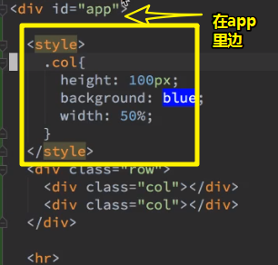

这个点Vue并咩有说

我们的vm初始化的el是 `#app`

即 `div#app`这个div是被vue初始化的div

而这意味着，你不能在这里边写style标签。

可见这是一个规则呀！vue说不行，那就是不行的。

所以我们要让样式生效的话，只需要把style标签拿出去就好了。就像这样：

```html
<style></style>
<div id="app"></div>
```

总之，我们无意发现了Vue的一个规则：

1. 不能再template里边或者vue初始化的div里边加上一个style标签。不然，你加上就会帮你删掉。

芳芳也不知道文档为啥会这样做。

### ③Sass？SCSS？

Sass 有两种语法。 第一种被称为 SCSS (Sassy CSS)，是一个 CSS3 语法的扩充版本，这种语种语法的样式表文件需要以 `.scss` 扩展名。第二种比较老的语法成为缩排语法（或者就称为 "Sass"）， 提供了一种更简洁的 CSS 书写方式。 它不使用花括号，而是通过缩排的方式来表达选择符的嵌套层级，I 而且也不使用分号，而是用换行符来分隔属性。使用此种语法的样式表文件需要以 `.sass` 作为扩展名。

**➹：**[Sass 参考手册 - Sass 中文文档](http://sass.bootcss.com/docs/sass-reference/)

### ④4个div css设置宽度50%，怎么显示的结果还是一行，而且宽度都是均等的25%，难道flex里宽度一样就会在一行里边平分是吗？

> 这个问题，表明了CSS确实没怎么学好。

这问题，换言之就是：

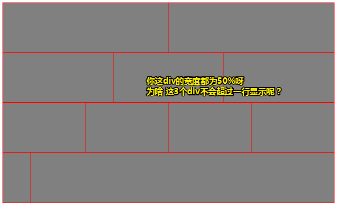

芳芳表示，学习这个轮子课默认你CSS已经是学习得非常好了，但是你既然提出来了，还是得要回答一下。

> 可见在教学的过程中，老师有自己的听课前提，但是这个标准是可以改的，总之就是有问必答啦！

解释：

```html
  <div class="row">
    <div class="col"></div>
    <div class="col"></div>
    <div class="col"></div>
  </div>
```

row这个flex容器默认是不换行的，即 `flex-wrap: nowrap;`

如果你改为 `wrap`的话，那么：

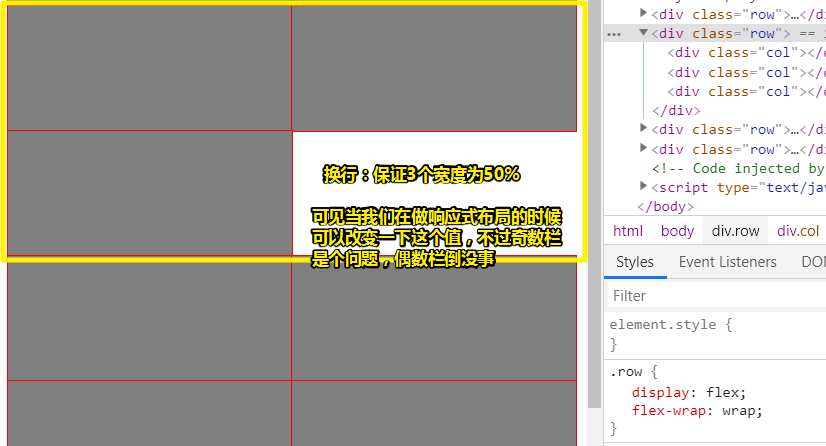

既然，你使用的是默认值，那么该flex容器，也不敢自动换行。

形象点来说：

一般来说，火车上有两种座位。

1. 两个座的
2. 3个人座的


假如第三个人跟其它人并不熟，即不给你挤一挤的机会，那么CSS代码如何做到不收缩（默认不换行）呢？


当然如果你换行了，那么横向滚动条也没有了。

总之：

1. 子所以出现挤一挤的原因（不换行、妥协）：是不换行的缘故

2. 不想挤一挤（不换行，不妥协）：那就每个col都 `flex-shrink:0;`一下，即col不管怎样都是50%的宽度。

   其实从另一个角度来说， `flex-shrink`的默认值是1呀，表示如果空间不足，那么该col将等比例缩小，注意负值对该属性无效。

其实一个前端如果CSS没学好，是挺缺乏竞争力的。


