# 简单轮子：默认布局

## ★完善测试用例

### ◇注意点

- 在测试响应式，请这样来：

  

  > 表面上看2row，实际上是一个row，因为一个col占了1/3。而这里是一个row里边有6个col。
  >
  > 把屏幕尺寸大小当作是「JavaScript操控class的存在与否」一样。

- 一定要注意：元素身上的class名不要写错了，或者css里边的class名不要写错了，总之你写了个class，那么就得有与之相对应的css，不然，效果就不出来了，而这样显然是有bug的。像我就把 col元素的class为`col-narrow-pc-8`这样的搞成是 `col-narrowPc-8`这样的，起初没有留意到，还以为样式之所以不出现是浏览器缓存的问题呢！

- 我们的响应式弄得很简单，基本上就是布局方面的响应式，如在pc上，一行是3个div，而在手机上则是一行一个div。

- 一次很无厘头的错误：

  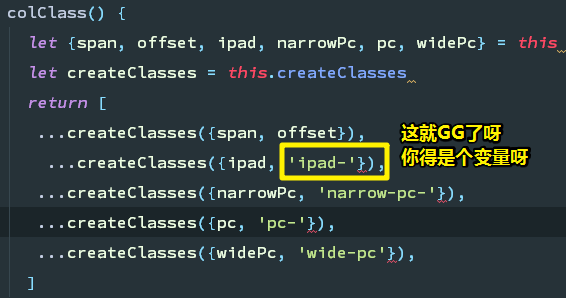

  可以理解为模式匹配，左边是变量，而且可以给个默认值。

  况且一个对象得key会是直接一个字符串key吗？

  ➹：[变量的解构赋值 - ECMAScript 6入门](http://es6.ruanyifeng.com/#docs/destructuring)

- 在写row.test.js的时候，如果你要让异步代码有效的话：

  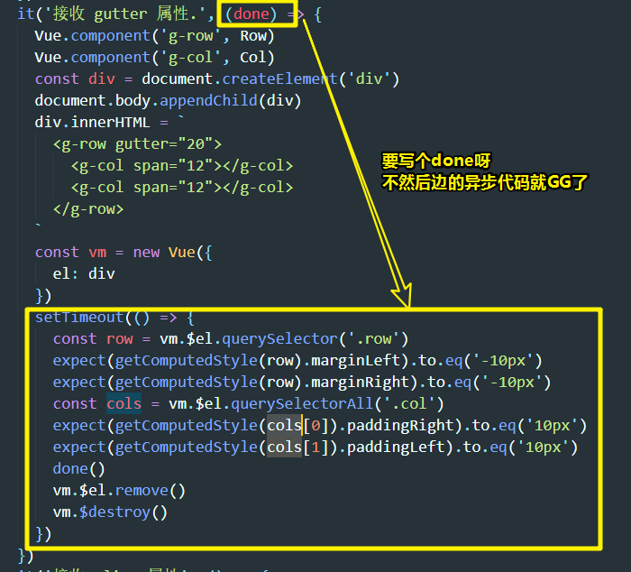

  > 不写done，意味着异步代码里边的回调不会执行，毕竟该页面已经关闭了。
  >
  > 测试gutter属性，对父组件和子组件的影响，算是比较麻烦了。总之，子组件也会受到父元素身上的属性影响的话，那么得用异步代码了，不然是子组件的style是咩有更新的，就像这样：
  >
  > ```html
  > <div data-v-db6887="" class="row" style="margin-left: -10px; margin-right: -10px;">
  >   
  >   	<div data-v-ba2854="" class="col col-12" data-v-db6887="" style="padding-left: 0px; padding-right: 0px;"></div>
  >   
  >   	<div data-v-ba2854="" class="col col-12" data-v-db6887="" style="padding-left: 0px; padding-right: 0px;"></div>
  >   
  > </div>
  > ```

  `vm.$el`为何物？

  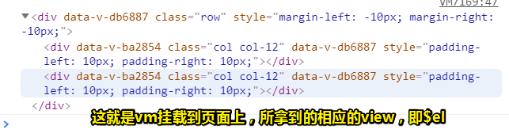

  

- 重新理解单元测试对代码的理解：

  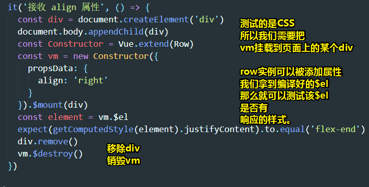

  > 不需要异步代码是因为，该align属性只作用于父组件，毕竟它就是flex容器哈！该row实例mounted到页面上就是这样编译过后的模板：
  >
  > ```html
  > <div data-v-db6887="" class="row align-right"></div>
  > ```
  >
  > 我稍微看了一下 `vm.$mount`这个API：
  >
  > - 它是把div这个元素给替换了，而替换的内容是Row.vue里边的模板呀！我之前以为这个模板是作为div这样元素的子元素而存在的。
  >
  > - 如果不写参数，那么模板将被渲染为文档之外的的元素，而且之后你打算挂载到文档里边的话，得使用原生 DOM API 把它插入文档中才可行：
  >
  >   ```js
  >   // 或者，在文档之外渲染并且随后挂载
  >   var component = new MyComponent().$mount() //返回实例自身
  >   document.getElementById('app').appendChild(component.$el)
  >   ```
  >
  >   这次是插入，而不是替换。
  >
  > ➹： [API — Vue.js](https://cn.vuejs.org/v2/api/index.html#vm-mount)
  >
  > - `Node.remove()` 方法，把对象从它所属的DOM树中删除。
  >
  > ➹： [demo](./demo/07/01-测试vm-mount这个api.html)

  再次 `vm.$el`

  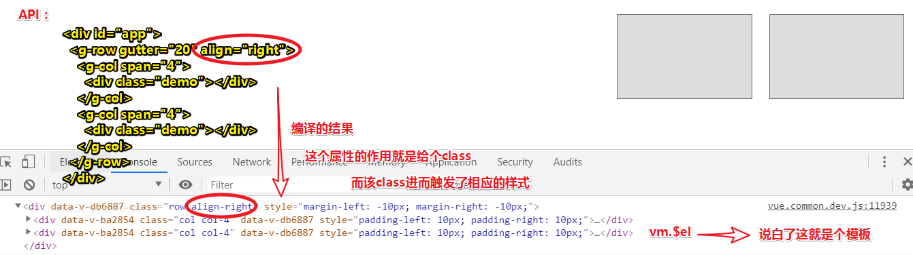


### ◇How？（移动端优先）

#### 解决「用户咩有写`:ipad`等自定义属性，然后样式选择」的问题

1. 写phone样式（默认就是这个样式），不写媒体查询之类的

2. 搞适配，只写 `min-width`，如ipad是 `≥576px`，那么其媒体查询就是 `@media (min-width: 576px) {}`

   同理，其它适配也是如此

3. 适配的样式是从小屏幕到大屏幕这样写下去的。

4. 测试

而这种做法，也有一种称呼——Mobile First（移动端优先），即你写一个样式，如果没有说是应用到哪个地方（元素）的话，那就往移动端走呗！那么为啥要这样做呢？因为全球市场70%、80%用得都是手机流量啊！很少会有人用电脑去浏览购物网站等……总之，一定要移动优先呀！


#### 重构代码

什么时候重构呢？

1. 代码很重复，就可以选择去优化，当然，你也可以不去，总之这得看你有咩有时间
2. 代码看不懂，那就一定要去优化了，这可不管你有没有时间

分析要优化代码的逻辑：

1. 用户使用自定义标签的姿势：

   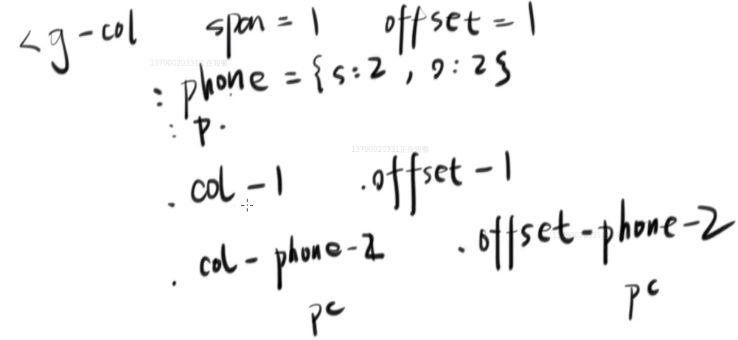

   用户写一个phone属性，就至少多一个相应的class……

2. 要重构的代码：

   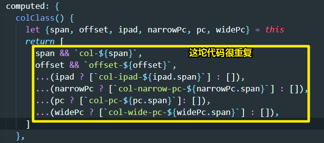

3. 重构后的代码：

   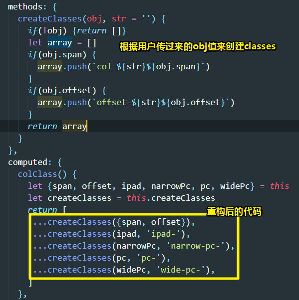

   > - `str = ’‘` ：默认给个空字符串值，这是为默认为phone样式所准备的
   >
   > - 如果用户没有写诸如 `:ipad`、`:narrowPc`等这样的自定义属性的话，那么就是说用户不想做ipad、narrowPc等设备的适配，既然如此那就直接返回一个空数组，即不需要添加相关的class了。
   >
   >   那如果用户写了的话，还得判断有没有写offset、span等属性，如果都没有写那就返回一个空数组呗。如果都写了，或者只写其中一个，那么就push到数组里边，然后返回呗！
   >
   > - 需要注意的是，数组的元素得是字符串哈！毕竟vue的语法规定，是字符串元素的话，就直接追加class名到元素的class属性里边了。

**总之，我们写自定义属性，就是为了产生相应的class。**

接下来，手动测试，看看重构后代码有没有bug。比如你在 `g-col`身上写了 `:ipad={span:12,offset: 2}`这样的自定义属性，那么就看看编译过好的元素身上有没有 `col-ipad-12`、`offset-ipad-2`这样的class。

其实这种测试理应就使用单元测试来做 的，毕竟要测试这5个逻辑一样的自定义属性，用手动测试的话，显然太繁琐和费时间了。

对了，我们来个做是适配的媒体查询的CSS，也是可以重构一波的，如可以再套一个循环，但就目前而言，再套一个的话，会显得很复杂。

### ◇小结

1. 我们实现了row和col的哪些功能？（基本实现成这样就ok了）
   - 横向24列布局
   - col之间可以加空隙
   - col是响应式的，如一行有6个col，在pc上看起来就是1行有6列，而在手机上看起来，则是有6行。

### ◇How？（row、col单元测试）

#### 思路

1. 看看row、col组件需要接受几个参数，如row只有两个参数：`gutter`和 `align`，而col则有：`span`、`offset`、`ipad`、`narrowPc`、`pc`、`widePc`

2. 看看它们有咩有事件之类的，没有就不需要测了

3. 抄袭之前的测试用例，然后删掉多余的测试代码：

   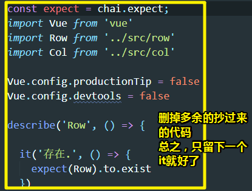

4. 如果遇到需要测试CSS的代码，那么同样是回顾之前测试CSS的姿势，如 `gutter`属性就需要测试CSS了。

#### 测试row

测试row的gutter属性（**单元测试其实非常不适合测CSS**）：

1. 需要测试它的CSS。注意，你不能mount到页面的body上边，因为你会替换掉它，所以你可以用JavaScript创建一个div，然后append到body上，在mount到该div上，这样我们的row编译好的模板就会显示到页面上。

2. 由于row需要用到col，所以我们需要引入col组件，这时，如果你这样做了：

   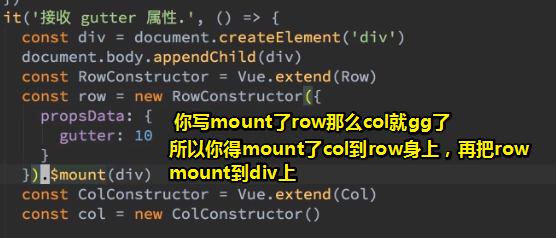

   那么如何先mount子组件到父组件呢？如果在HTML里边是很好写的，如：

   ```vue
   <g-row><g-col></g-col></g-row>
   ```

   可我们是在JavaScript里边写啊！所以how？——谷歌一下「vue add children」，然而找到的都是HTML姿势，而从这也可以看出vue的官方文档并咩有想象中覆盖那么广那么全。

   自己动手猜测着写：

   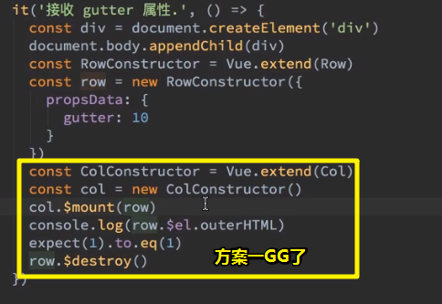

   还有一种瞎着写的姿势（这个自己没有去测试，大概也GG了）：

   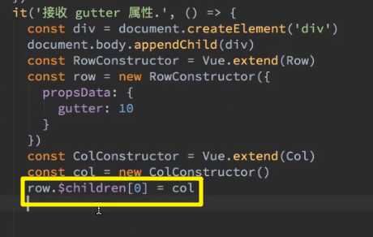

   我自己想到的傻屌姿势（成功了）：

   思路是：父组件的template的root元素有个id属性，先把该template挂载（`$mount(div)`）到页面上，然后就是通过id属性获取这个dom元素，接着就是把子组件实例挂载到内存里边，然后子组件实例就可以被`appendChild`到该DOM对象里边了。

   ➹： [demo](./demo/07/02-动态往父组件里边添加子组件.html)

3. 如何动态的往row里边创建一个col？即如何通过JavaScript把一个组件放到另外一个组件里边去。

   既然没有想到用JavaScript姿势来做，那么就用HTML的姿势来做吧！

   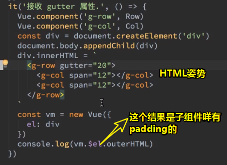

   outerHTML的结果：

   ```html
   <div data-v-db6887="" class="row" style="margin-left: -10px; margin-right: -10px;">
   
   	<div data-v-ba2854="" class="col col-12" data-v-db6887="" style="padding-left: 0px; padding-right: 0px;"></div>
   
   	<div data-v-ba2854="" class="col col-12" data-v-db6887="" style="padding-left: 0px; padding-right: 0px;"></div>
   
   </div>
   ```

   

   > 时机：你打印的时候没有，不代表等会儿也没有，你看我们后来就push了个元素，然后它就变了。
   >
   > 而这种变化可以说是异步的过程

4. 从异步代码里边拿到outerHTML的结果：

   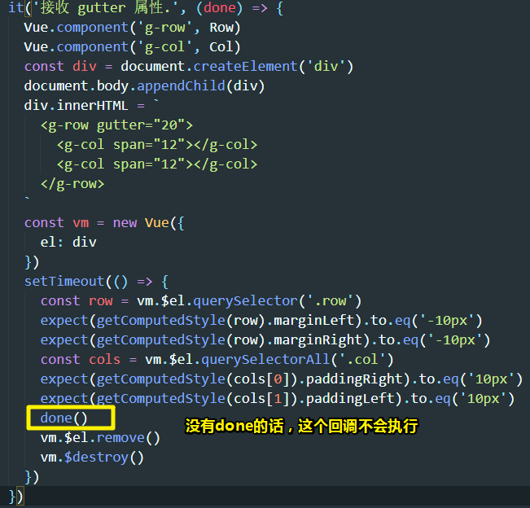

   > 为啥没有done，这个回调就不会执行？——这个测试框架默认就是这样的，done的作用类似打了个断点。

5. 为啥需要延时测试这个 `outerHTML`?

   这涉及到Vue的渲染过程：[④](#si)

   经过怀疑之后的理解：

   > 大致理解这个过程：
   >
   > 在new Vue的过程中，意味着需要执行一轮生命周期了，即需要编译模板。
   >
   > 然后：
   >
   > 1. created row
   > 2. created col1
   > 3. created col2
   > 4. col1 mounted（作为col的子元素存在）
   > 5. col2 mounted（作为col的子元素存在）
   > 6. row mounted （这个执行会upadate col 的 gutter值，从而computed重新执行）
   >
   > 由于mounted的执行是异步的
   >
   > 所以此时vm拿到的就是没有执行mounted，但执行了computed的结果了，且渲染了元素的结果了（执行了appendChild，但是组件实例并没有执行mounted的结果，mounted钩子需要等同步代码执行完毕后再执行）
   >
   > 如果我这理解没有错的话，那么mounted的执行并不是等价于appendChild的，而是created之后，就会根据情况（ `div#app`编译模板时自己的去created和appendChild（HTML姿势），另一种则是JavaScript姿势主动去`$mounted`，`$mounted` 之前会先appendChild，这就是为啥我会访问到`vm.$el`的值，不然就是undefined值了）去mounted，HTML姿势是异步mounted的，而JavaScript姿势则是同步的。
   >
   > 算了，反正都是猜测的……知道怎么测试这种情况就好了。

6. done的意义：（我算是理解了done吗？我似乎只是给了一个理解它的理由罢了！或者一个较为深刻点的记忆罢了）

   不加done，表示这个函数里边的函数体代码都是同步的代码，遇到异步的代码也认为是同步的，即执行完同步代码就到下一个 `it`了。如果你加了done，那么就表示函数体里边存在异步的代码，类似于告诉测试框架「等会儿再跳到下一个`it`呗！」，注意这个等会儿最多是2000ms，即2s。一旦异步代码完成后，就可以调用done通知测试框架说「没有异步代码了，可以安心的跳到下个it了」

   我不知道这个`done()`的顺序是怎样的，我认为这个`done()`应该类似 `break;`的作用才对呀，一旦它调用了，那么后边的代码应该也不会执行，然而测试得知，也有执行了。

   如果你不写 `done()`的话，那么会这样：

   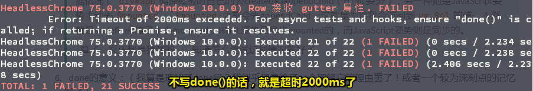

   `done()`作用类似于「告知测试框架没有异步代码了，执行顺序的异步回调，就执行下个it吧！」

   总之，如果测试里边存在任何的异步的，你都需要加个done参数，然后在异步任务完成之后，请调用 `done()`，即通知测试框架 异步任务完成。

7. 小结这个gutter测试用例：

   1. 不知道如何造HTML结构——HTML姿势
   2. 打不出来`padding:10px`——需要异步测试
   3. `done()`的使用姿势
   4. 别忘了，要destroy一下，不然会影响到后续的测试。而且也要把页面上的元素的给remove掉，不然，同样也会影响到后续的测试，毕竟打开的是同一个页面呀！可不是一个it就对应着一个页面这么奢侈。

---

**测试row的align：**

很无聊的测试，因为同样需要测CSS，可再无聊也要测啊！

1. 分析有没有异步代码。即这个align属性的作用有没有用到钩子，如果咩有那就不需要写done了

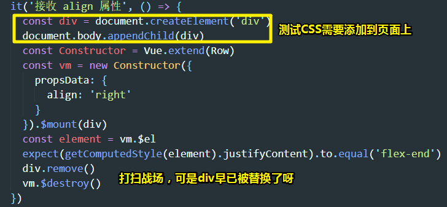

#### 测试col

有很多属性需要测试，可见真TM繁琐呀！这就是为啥很多程序员并不喜欢写测试代码的原因所在了，即需要不断的造一下结构类似的东西。

而写测试代码的难度就在于造东西。

做法类似，就不再叙述了。

注意点：

1. 用到了DOM对象的classList这个API，还有contains这个API
2. 我们这样的测试是先人工测试一遍，然后再写代码测试。之前测试input的时候，是先写测试代码，再写代码实现。前者的测试代码不容易出错，而后者的测试代码则容易出错。

### ◇小结

1. 开一个窗口作为测试，一个作为serve，一个作为写命令行，总之开发一个项目需要打开3个终端
2. 我们写得这个row和col组件花费了挺多时间的，当然，这主要是CSS的锅！至于其它代码的逻辑并不难，如row就改一下class和style，而col同样如此，虽然只改两个地方，但也写了挺多代码的。
3. 开始下一个组件：默认布局

---

## ★布局组件

### ◇注意点

- `vm.$options.name`：拿到[vm实例](https://cn.vuejs.org/v2/api/index.html#vm-options)的选项对象里边的name属性值，一般配合mounted使用。

- 关于[vue动画](https://cn.vuejs.org/v2/guide/transitions.html)：使用transition标签，并且只允许使用一个子元素，如果想作用于多个子元素的话，请为子元素们加上 `key`。

  ```vue
  <template>
      <transition name="slide">
        <div class="sider" v-if="visible" key="close">
          <slot></slot>
          <button @click="visible=false">close</button>
        </div>
        <div class="sider-show" v-else key="show">
          <button @click="visible=true">show</button>
        </div>
      </transition>
  </template>
  ```

- 我们无法确定用户给了sider组件有多宽，所以我们这里实现的滑动动画是限制性的。如果让用户自行设置这个的话：

  ```css
  .sider {
    background-color: #333;
    width: 150px;
  }
  /* 这个滑动动画，目前最好让用户来设定，即你不需要在sider组件里边写这个了 */
  /* sider是150px的width，那么margin-left就是-150px */
  .sider.slide-enter, .sider.slide-leave-to {
  	margin-left: -150px;
  }
  ```

  然后sider组件里边没有写这个的话：

  ```css
  .slide-enter, .slide-leave-to {
    margin-left: -150px; //这个得根据用户设置sider的宽度来确定
  }
  ```

  那么sider组件里边的show按钮的出现就是没有动画的，也就是说动画只作用于close按钮了。

  为啥会这样呢？——因为用户是这样写的：`.sider.slide-enter`，而我们的template里的close按钮是没有 `class="sider"`的，所以我们还得加上这个：

  ```css
  .sider-show.slide-enter, .sider-show.slide-leave-to {
  	margin-left: -150px;
  }
  ```

  这样一来，效果才有了。

  总之用户需要自行加上这个：

  ```css
  .sider.slide-enter, .sider.slide-leave-to {
  	margin-left: -150px;
  }
  .sider-show.slide-enter, .sider-show.slide-leave-to {
  	margin-left: -150px;
  }
  ```

  如果可以的话，我倒是希望用户能自己传个width参数过来，然后我们通过JavaScript改变这个`margin-left`值。

### ◇How？

1. 创建5个组件：

   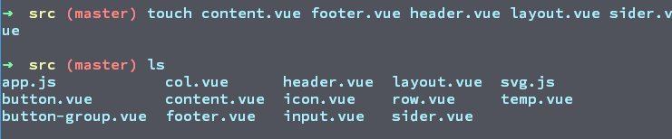

2. 完成基本功能：

   1. 当我看到这API：

      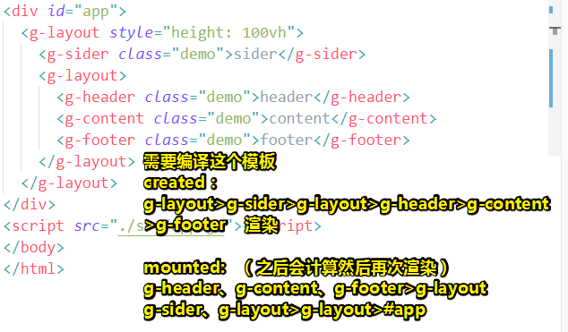

      如果这些组件没有写mounted，那么created，然后appendChild，基本上就确定了这个 `#app`的最终渲染形态式咋样的了。（从外到内created，然后从内到外append。如果子组件有mounted的话，那么就会把这个钩子的回调push到任务队列里边去，等第一次 `div#app`这个DOM 渲染完毕后，再按顺序去执行mounted的钩子）

      编译后DOM 且 mounted 后的结果：

      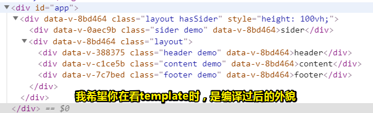

      > 当在分析样式时候，就带着这个编译好的DOM，去分析就好，有哪些class就有哪些样式被应用上去了，当然，别忘了CSS的层叠性以及规则权重问题。

   2. 假如layout组件下有个儿子sider组件，那么我就会为layout追加class：

      

   3. 样式分析：

      layout组件下有子元素为sider组件的话，那么layout组件就会带个绿帽——`hasSider`，那么此时layout组件这个flex容器的item的排布就是水平的；如果咩有的话，那么就是垂直的。需要注意的是layout组件永远吃掉同级的剩余空间，还有content组件也是如此。

3. 为 sider  添加简单动画

   利用 Vue 提供的 transition 这个标签即可做到。

以上为看一遍视频后，照着芳芳提供的代码撸一遍之后的理解。

效果：


---

###  ◇How？（详细点）

这个默认布局轮子，相比网格系统这个轮子并咩有简单很多，毕竟实现这轮子的重点还是CSS。

#### 需求

直接看其他UI框架做的layout组件就好了，如ant-design、ele-ui……

从中可以看到：

1. 上中下
2. 上中下，但中间分左右，边栏左边
3. 同上，但边栏在右边
4. 左右结构

基本上所有的网站都逃不了这常用的4种布局。如淘宝就是1、2这两种……

 如果每写一个页面，都得重新写布局的话，那岂不是很繁琐？

所以我们能否把这常用布局做成是组件的形式呢？

分析ant-design给出的组件代码API，我们可以照葫芦画瓢设计出用户要使用我们组件的API.

#### API设计（说白了就是DOM模板）

第一种姿势：

```html
<g-layout>
  <g-header></g-header>
  <g-content></g-content>
  <g-footer></g-footer>
</g-layout>
```

有sider？

```html
<g-layout>
  <g-header></g-header>
  <g-sider><g-sider>
  <g-content></g-content>
  <g-footer></g-footer>
</g-layout>
```

这种API设计对用户来说是好使的，可是我们开发者就不好写CSS布局代码了，我们一般都是让左右结构在套一层div的。

> 所以这得考虑API设计的应用性，如果真得是这样设计的话，那么我们开发者是真得难以应付啊！

那么如何设计左右布局的API呢？——直接参考ant-design和element的做法呀！

于是，可有：

```html
<g-layout>
  <g-header></g-header>
  <g-layout>
    <g-sider><g-sider>
    <g-content></g-content>
  </g-layout>
  <g-footer></g-footer>
</g-layout>
```

这是一种嵌套姿势，只要是左右布局，那就嵌套一层 `g-layout`呗，当然，你可以看 `g-layout`为一个无意义的div。

总之，就是多个div一起的，那就嵌套一层 `g-layout`

同理，可有：

第三种姿势：

```html
<g-layout>
  <g-header></g-header>
  <g-layout>
    <g-content></g-content>
    <g-sider><g-sider>
  </g-layout>
  <g-footer></g-footer>
</g-layout>
```

第四种姿势：

```html
<g-layout>
  <g-sider></g-sider>
  <g-layout>
    <g-header></g-header>
    <g-content></g-content>
    <g-footer></g-footer>
  <g-layout>
</g-layout>
```

接下来，就是写CSS实现以上所提到的4种布局了。

#### 写CSS

1. 根据API的设计，我们需要生成5个组件

2. 先搞第一个布局（上中下）。

   让组件使用者自己变高组件，而不是我们自己去弄。

3. 搞第二个有sider的布局。

   这个需要参考其它框架的思路来做，从中可以知道思路——让框架自己取探测 `g-layout`下有没有子元素 `g-sider`，如果发现有，那么就得在`g-layout`身上加上class，即加上样式啦！。

   如何检测？——需要判断用哪个回调，即要么是created，要么是mounted。

   总之我想要的是发现子元素有sider之后就得再layout身上加上一个class？——所有咋做呢？——直接两个都试一下呗！

   经过之前的认识，显然是在mounted里边的，毕竟vue是先造爸爸，然后再造儿子，最后再让儿子塞到爸爸里边去，然后爸爸再塞到页面里边去。

   总之，mounted能确保你的children已经mounted了，但created则不能，除非vue是先把儿子造出来，然后再爸爸造出来之前已经mounted爸爸了，可这显然是不合逻辑的。

   组件的name作用：第一个作用是给开发工具一个名字，不给的话，那就是标签名了，所以最好还是给上；第二个作用则是识别组件实例到底是啥名字。

   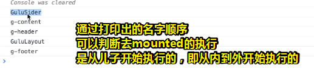

   关于为layout组件添加class，请用vue的姿势去加，而不是原生JS的姿势。

   总之只要探测到layout组件，有子组件sider，注意不要说是子元素，因为子元素都是编译之后的div，那么就完父组件，即layout组件的template下的root元素身上追加一个classs值 `hashSider`

   总之，这是一个很套路的做法，涉及到看儿子的操作，那就不停地在mounted里边看，而不是在created里边看。

   接下就是为 `hasSider`这个class写上相应的样式了，如弄成是左右结构的 `flex-direction: row`。注意只要弄好结构，宽度什么的先不用去管。

4. 第3种布局，只需要调换一下模板的DOM位置就行了。
5. 第4种布局，也是判断有咩有sider子组件。

grid组价和layout组件放一起讲的缘故是因为它们俩的思路非常相。

#### 为sider添加slide动画

自己根据需求来加！如关闭sider等

关于transition，它是用于包裹那些需要动画的元素。

transform和margin-left的区别：

- transform是跳一个大格子变的
- margin-left则是慢慢的变。

代码如下：

```css
    .slide-enter-active, .slide-leave-active {
      transition: transform .5s;
    }
    .slide-enter, .slide-leave-to {
      transform: translateX(-100%); 
    }
```

效果：

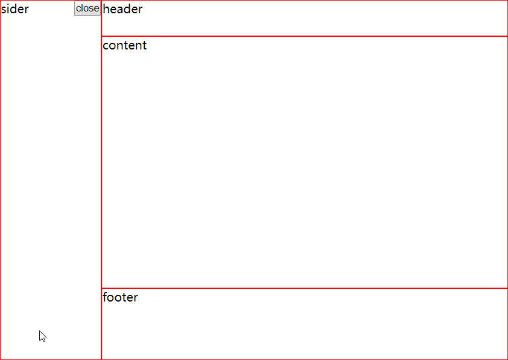

而margin-left则是这样的：

```css
    .slide-enter-active, .slide-leave-active {
      transition: all .5s;
    }
    .slide-enter, .slide-leave-to {
      margin-left: -150px; 
    }
```

效果：

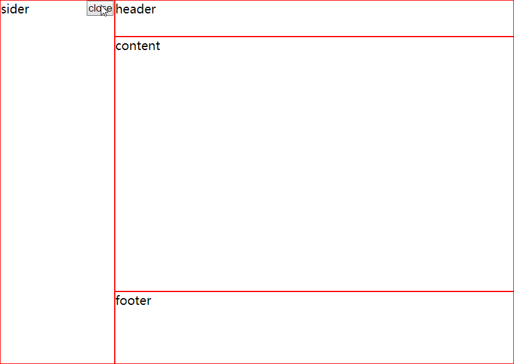

为啥要区分它们俩呢？——因为它们俩又关动画卡顿的问题.

➹： [demo](./demo/07/04-transform和marginLeft于动画之间的区别.html)

言归正传，vue提供了JS姿势的动画，这能解决用户自行设定sider宽度的问题。

> 芳芳会在中级部分讲解动画部分。

➹：[进入/离开 & 列表过渡 — Vue.js](https://cn.vuejs.org/v2/guide/transitions.html#JavaScript-%E9%92%A9%E5%AD%90)

我们的sider组件自行设置了slide动画，如果用户发现该动画有问题，请自行覆盖该class：

默认姿势：

```css
.slide-enter-active, .slide-leave-active {
  transition: all .5s;
}
.slide-enter, .slide-leave-to {
 	margin-left: -150px; //这个得根据用户设置sider的宽度来确定
}
```

用户自行覆盖姿势：

```css
.sider.slide-enter, .sider.slide-leave-to {
	margin-left: -150px;
}
.sider-show.slide-enter, .sider-show.slide-leave-to {
	margin-left: -150px;
}
```

小结一下做法：

1. 为xx元素加个transition标签

2. 为transition标签起个名字，如 `name="slide"`

3. 写样式，如：

   ```css
   .slide-enter-active, .slide-leave-active { //用于确定动画时长
     transition: all .5s;
   }
   .slide-enter, .slide-leave-to { //确定开始状态和结束状态
    	margin-left: -150px; //这个得根据用户设置sider的宽度来确定
   }
   ```

4. 如果用户对 `margin-left: -150px; `不满意，那么用户可以自行设定：

   ```css
   .sider.slide-enter, .sider.slide-leave-to {
   	margin-left: -200px;
   }
   ```

如果你想做得更好看，可以把 `close`按钮变成是 `x`icon内容的按钮。

这个需求目前不需要做，之后做遇到特别的需求做比较好一点，因为这会让你了解为啥要用 `x`icon的按钮。

### ◇小结

- 这个组件比所有组件都简单，但是它的结构比较复杂，毕竟用到了5个标签呀。而且还用到了一个mounted回调，而这个回调里边还有用到 `vm.$options.name`这么一个属性，而这个属性平时是很难用到的。

- 下一节课讲啥？——Toast组件。

  那么什么是Toast组件呢？——随便找一个流行的UI框架看看是啥情况不就好了么！

  如果诸如ant-design、element-ui等都没有的话，那就去一个最全的<https://framework7.io/>里边看看咯！

  ➹：[Toast - Framework7 Documentation](https://framework7.io/docs/toast.html)

  > 没有Vue和React版本的Toast组件。

  可见，该组件就是可以让我们从四面八方弹出一个div，而且这div里边有icon、多行文字、还有关闭按钮等

  为啥要教Toast这个名字呢？

  在美国电影里边，经常会出现，一个叫吐司机的电器，即用来烤面包的东西，或者你看「大雄与多啦A梦」的时候也经常会出现吐司机：

  

  > 注意，这是可以弹出来的，并不是只能用手自己去拿。

  总之，我们往吐司机里边塞入吐司，一旦加热好了，那么就会从吐司机里边弹出来了，而我们网页上这个行为也类似吐司机的行为，所以美国就把它叫做toast了。

  除了做这个toast组件以外，还做一个tab组件。（一周做两个）

  总之，我们在芳芳讲解这些组件的制作过程时，先去看看其他UI框架是怎么做的，如API的设计是怎样的？

  如：

  ➹：[标签页 Tabs - Ant Design](https://ant.design/components/tabs-cn/#header)

  它的tab可以：

  1. 常见的tab切换
  2. 禁用 xx tab
  3. 可以为 xx tab添加 icon
  4. 切换 tab 的形态
  5. 加上额外的行为按钮
  6. 改变tab的size（其实没啥必要）
  7. 改变位置
  8. 关闭tab
  9. 添加tab
  10. ……

  可见tab组件的需求还蛮多的，而且API也很多。

  当然，element的vue姿势也可以去了解一下。（基本一样）

- 每个前端团队都会自己做自己认为的tab
- 总之，你接下去要做的：
  1. 回顾一下grid组件和layout组件。
  2. 预习一下toast组件和tab组件的需求，不需要你去写代码，看一下需求是咋样的即可！

---

## ★总结

- 难怪一般为pc设计的设计稿都在992~1200之间。

- 始终注意不要把老师的理解给抄了

- 更改看视频方式：第一遍（1.5倍或1.8倍）看就大致理解了，然后直接开始抄代码（进一步理解，并记录一些理解注意点）。第二遍（2倍）就写上如何做到的，然后记上一些处理细节、为什么这样做等，总之是加深理解、验证自己的理解。

- 以后用写代码啦的app来看视屏，因为浏览器上看有地址栏、插件之类的。这就是为啥会有app的原因了。所以说知道一个东西之所以诞生的原因（存在痛点）是很重要的，当你遇到了这个痛点，那么你大可使用这个实现方案。然而写代码啦这个app也咩有实现我想要的效果，我觉得这是我屏幕小的缘故呀！

  之后我想了想，截取一尺寸大小适中的图片，然后贴上去就好了。（用到的工具有picpick「制作图片填充颜色的」、Snipaste「贴图的」、shareX「录制gif」）。`win+b`可以打开隐藏的任务栏，之前一直用 `win`

  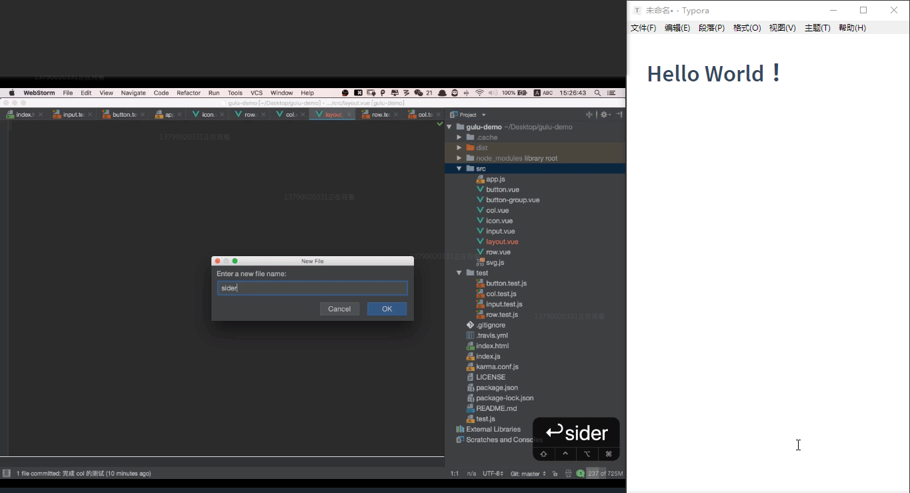

  


## ★Q&A

### ①JavaScript 里 创建 出来的DOm对象 怎么销毁它？

引子：

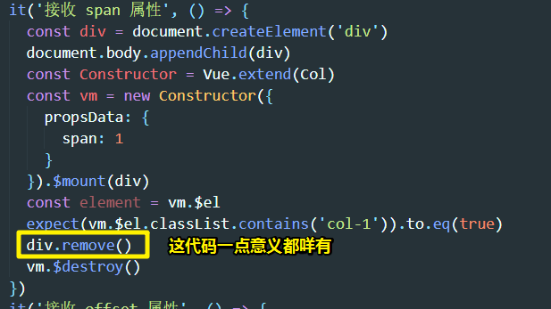

咩有API可以做到，自己被JavaScript的垃圾回收机制给回收掉。

而页面上的dom元素，倒是可以用 `xxx.remove()`这个API，DOM树里边的xxx元素给移除掉。

所以要让 `div.remove()`有意义的话，你得拿到Col组件的template的根元素，然后才能 `remove`掉。

➹：[JavaScript 里 new 出来的对象 怎么销毁它？ - 知乎](https://www.zhihu.com/question/21628109)

### ②只弄了两套设计稿，一套pc，一套手机，你说在ipad下看这个网页是应用哪套样式啊？

1. 你可以不管
2. 也可以让响应规则往下走

分析第二种做法：

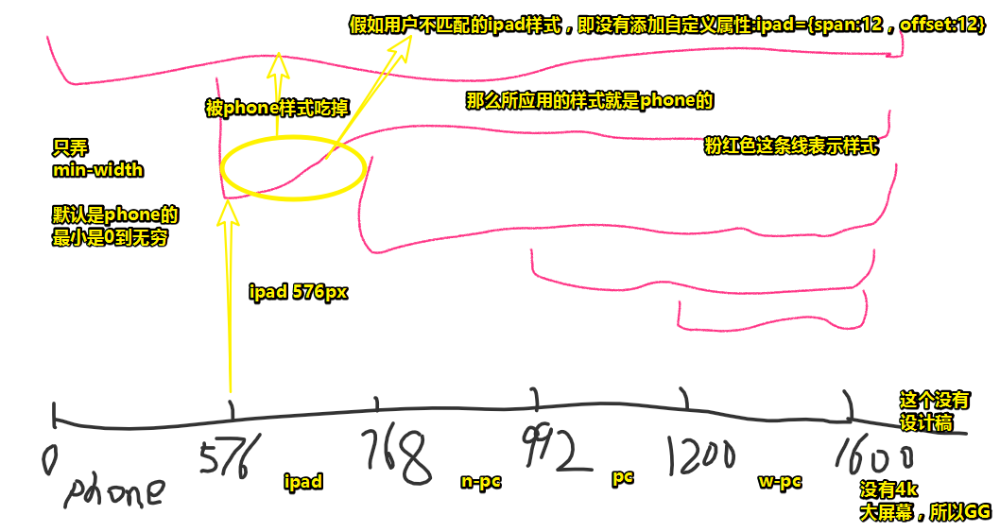

> 粉红色线表示「样式应用的屏幕尺寸范围，其中phone所对应的这种样式应用最广泛」，思路主要是利用了CSS的层叠性。

1. 找到[断点](https://ant.design/components/grid-cn/#Col)——屏幕尺寸断点（一般太宽的如xxl是没有设计稿的，所以我们不需要做适配）

2. 假如一个断点范围内就写一个与之相应的样式（有最大值和最小值），如有5个断点范围，那就写5个。可是这样会有bug，毕竟这个规则写得很死呀！比如说，咩有写ipad样式，那么ipad就真得没有被适配的样式了。

   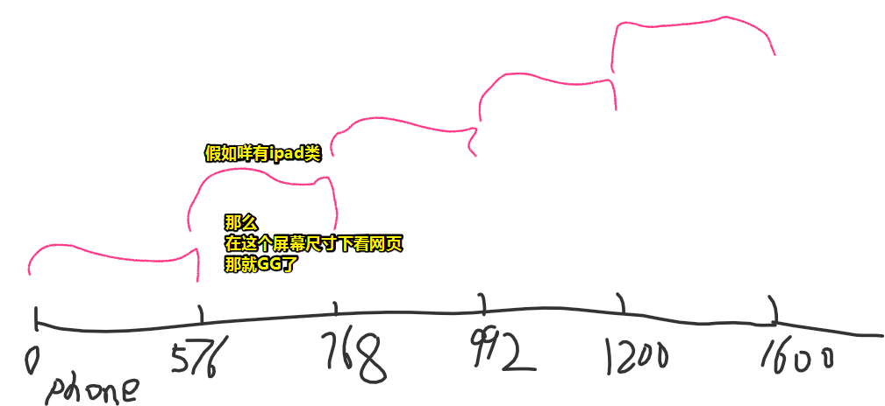

3. 只给一个最小值。例如，假如屏幕尺寸是580px的话，那就会应用ipad的样式了，而默认的phone的样式会被层叠掉。同理，如果是780px的话，那么就属于n-pc的范围了，于是就会应用n-pc的样式。当然这前提是，col标签有5个需要适配的类，可是如果用户咩有写ipad类呢？即没有ipad样式，那么580px就会往下走选择phone的样式了。（退而求其次姿势）

理解这个图之后，你就能从形象上理解这个适配代码了：

```scss
.col {
    $class-prefix: col-;
    @for $n from 1 through 24 {
      &.#{$class-prefix}#{$n} {
        width: ($n / 24) * 100%;
      }
    }

    $class-prefix: offset-;
    @for $n from 1 through 24 {
      &.#{$class-prefix}#{$n} {
        margin-left: ($n / 24) * 100%;
      }
    }
 
    // 适配5种屏幕尺寸的设备：
    // 默认是all类型的，我认为不同屏幕尺寸下可以不用24个格子，可以选择16、12这样的

    // sm
    @media (min-width: 576px) {
      $class-prefix: col-ipad-;
      @for $n from 1 through 24 {
        &.#{$class-prefix}#{$n} {
          width: ($n / 24) * 100%;
        }
      }
      $class-prefix: offset-ipad-;
      @for $n from 1 through 24 {
        &.#{$class-prefix}#{$n} {
          margin-left: ($n / 24) * 100%;
        }
      }
    }

    // md
    @media (min-width: 768px){
      $class-prefix: col-narrow-pc-;
      @for $n from 1 through 24 {
        &.#{$class-prefix}#{$n} {
          width: ($n / 24) * 100%;
        }
      }
      $class-prefix: offset-narrow-pc-;
      @for $n from 1 through 24 {
        &.#{$class-prefix}#{$n} {
          margin-left: ($n / 24) * 100%;
        }
      }
    }

    // lg
    @media (min-width: 992px) {
      $class-prefix: col-pc-;
      @for $n from 1 through 24 {
        &.#{$class-prefix}#{$n} {
          width: ($n / 24) * 100%;
        }
      }
      $class-prefix: offset-pc-;
      @for $n from 1 through 24 {
        &.#{$class-prefix}#{$n} {
          margin-left: ($n / 24) * 100%;
        }
      }
    }

    // xl
    @media (min-width: 1200px) {
      $class-prefix: col-wide-pc-;
      @for $n from 1 through 24 {
        &.#{$class-prefix}#{$n} {
          width: ($n / 24) * 100%;
        }
      }
      $class-prefix: offset-wide-pc-;
      @for $n from 1 through 24 {
        &.#{$class-prefix}#{$n} {
          margin-left: ($n / 24) * 100%;
        }
      }
    }

  }
```

### ③git 时光穿梭？

> - `HEAD`指向的版本就是当前版本，因此，Git允许我们在版本的历史之间穿梭，使用命令`git reset --hard commit_id`。
> - 穿梭前，用`git log`可以查看提交历史，以便确定要回退到哪个版本。
> - 要重返未来，用`git reflog`查看命令历史，以便确定要回到未来的哪个版本。

由于我是看完一个视频，就把这个视频所涉及到的提交都给完成了。

然而当我回顾这个视频的时候，我需要知道当初的代码是怎样的，于是，我需要对提交历史的版本进行时光穿梭：

1. 查看提交的历史版本 ： `git log`，alias为 `glog`。

2. 确定要回到过去的历史版本：

   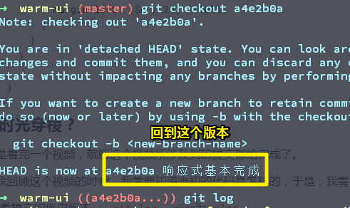

3. copy好这个版本你所需要的代码。
4. 然后 `git checkout master`即可回到原先的最新版本

> 你可以git branch 一下，并没有增加新的分支。

这种姿势比较粗暴简单，另外一种姿势这是直接这样：

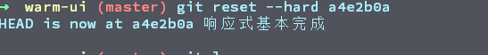

回到之前的最新版本，需要知道它的id。

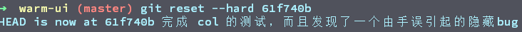

➹：[版本回退 - 廖雪峰的官方网站](https://www.liaoxuefeng.com/wiki/896043488029600/897013573512192)

➹：[git 切换到之前的版本上 - zhyh1435589631的专栏 - CSDN博客](https://blog.csdn.net/zhyh1435589631/article/details/51970944)

➹：[常用 Git 命令清单 - 阮一峰的网络日志](http://www.ruanyifeng.com/blog/2015/12/git-cheat-sheet.html)

### <a id="si">④vue的渲染过程？</a>

JavaScript姿势的mount过程是同步的：

```js
let div = document.createElement('div')
document.body.appendChild(div)
```

Vue基于性能的考虑是异步触发mounted钩子的：

```js
let div = document.createElement('div')
let child = document.createElement('div')
div.appendChild(child)  //这会异步触发child的mounted
document.body.appendChild(div) //这也会异步触发div的mounted
```

以上4句代码是同步的，而mounted钩子的触发则是异步的，为啥说是异步的呢？

假如不是异步的，child的mounted钩子假如有200行代码，需要执行6s，那么`div.appendChild(div)`就会触发其mounted钩子执行，而这执行时间需要6s，那么接下来的代码（div的渲染）显然就需要等6s后才会执行了，所以Vue会优先去完成div的渲染，然后再按顺序执行mounted钩子：


既然如此，我们那个测试代码：

```js
let div = document.createElement('div')
let child = document.createElement('div')
div.appendChild(child)  //这会异步触发child的mounted
document.body.appendChild(div) //这也会异步触发div的mounted

console.log(div.outerHTML) //这个会先于mounted执行，因为这是同步代码呀！
```

我测试了一下，发现这真得是异步的吗？

➹： [demo](./demo/07/03-mounted的执行是异步的.html)

这很有可能是我主动mounted过程。

如果交给 `div#app`来搞会不会是异步的呢？

### ⑤如何让浏览器像app那样打开网页？

1. 找到chrome的快捷方式

2. 右击，属性，修改目标：

   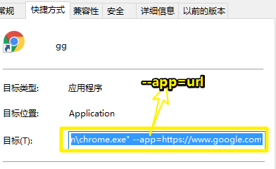


