# 简单轮子：Toast 组件

## ★课程简介

- 代码
  <https://github.com/FrankFang/frank-test-1/blob/toast/src/toast.vue>

- UI
  <https://yuque.com/u29422/gulu/244946>

- 需求

  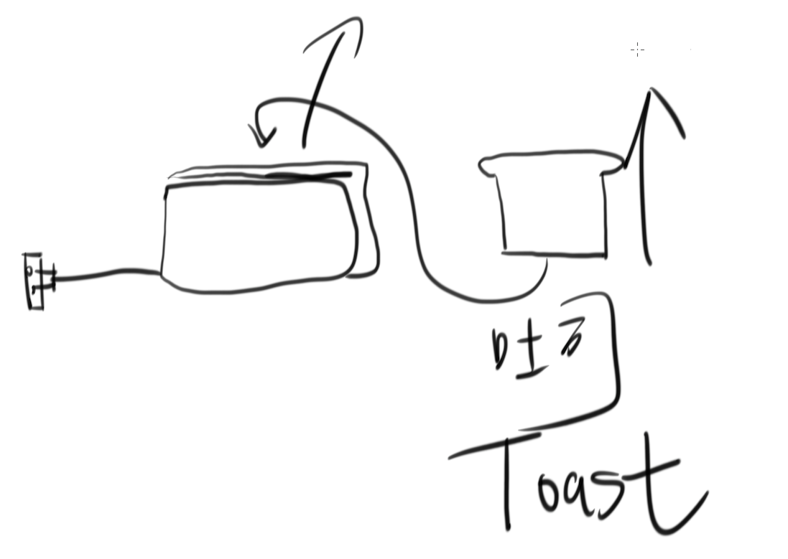

  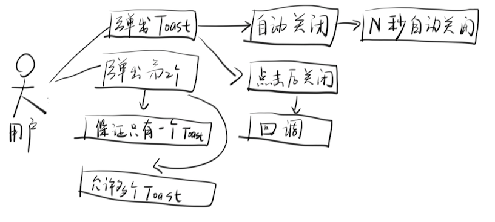

## ★需求分析

### ◇注意点

- 所有样式相关的都不要写在JavaScript里边，除非你有强烈的动机要去写！如组件开发者是否需要帮助用户设置toast的宽高？——不需要，让用户自行设置样式

- 前端在设计UI时，主要考虑的是可用性，如toast的关闭按钮是`×`还是直接一个大大的关闭按钮，前者很有可能用户无法点击到，而后者则可以点击到，虽然后者较为丑点，但是可以轻松被点击到。

  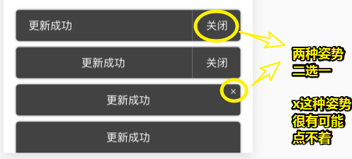

- 芳芳设计的UI组件样式可以自行配色

- 用户要如何使用这个Toast？即如何调出一个Toast？——用户的做法（点击某个东西触发一个回调咯）：

  ```js
  new Vue({
  	methods: {
  		showToast() {
  			//this.$toast('当前功能不稳定，如果遇到 bug 请关闭该功能')
  		}
  	}
  })
  ```

  我们应该为用户封装一个叫 `$toast`的API，当然，如果你怕用户记不住的话，你可以把它叫做 `$msg`

  那么我如何才能做到 `this`上边有个 `$toast`呢？即如何改造`this`呢？——可以使用 Vue提供的`install`API，而该API甚是常用，比如常用于开发插件！

  根据对比其它UI框架，发现用户不需要自行去 `use`插件，而是框架自己帮用户`use`的，所以我们也要这样来！

  当然，还有一种更简单的做法，那就是改`Vue` 这个Class的`prototype`：

  ```js
  import Vue from 'vue'
  Vue.prototype.$toast = function() {
  	console.log('我是 toast')
  }
  
  ```

  注意，在toast.vue里边，你要使用`Vue`，那么你得导入 `Vue`这个class（除了输出变量，还可以输出函数或类（class））

  这样一来，只要是个Vue实例，那么就能使用 `$toast`这个API了。

## ★初步实现

### ◇注意点

- 使用webstorm的时候注意exclude一下，不然会很慢

- 工程问题（在工程项目中会实际发生的问题，这可不是你通过分析就能分析出来的）。如「用修改 `prototype`的姿势去为每个vm添加 `$toast` 」

  这种姿势其实是很有问题的：

  1. 我们无法确定用户引入的 vue是哪个版本的，假如是 `import Vue from 'vue2'`呢？毕竟这是用户自行配置的——即便你认为这不99%不可能发生，但是根据墨菲定律，小概率事件必然会发生，所以你不得不防。

  2. 我们无法确定用户是否自行为`Vue`旗下添加了 `$toast`这个API，如果添加了，那么就会被我们覆盖，当然，如果你这样做的话：

     ```js
     if(Vue.prototype.$toast === undefined) {
       Vue.prototype.$toast = function() {
         console.log('我是 toast')
       }
     }
     ```

     也是不行的。假如它确实不存在，那么还是不能解决我们强行修改的问题呀！总之，这样做的姿势是「侵入性太强」的做法，而这有可能会造成bug。

  可见，我们改造this的这种姿势是违反工程的，如我们无法确定用户引入vue的姿势是我们所想的那样（假如用户是 `import Vue from ‘vue1’`，那么 `import Vue from 'vue'`就是无效的）、无法确定能不能修改全局Vue的prototype……

  所以我们只好用插件姿势，而这也是为啥用插件的原因所在了。

  那么这插件是干嘛的呢？——正如vue的文档所说，你应该写一个插件，然后让用户主动的去使用你，而这才是正确的方式！

- 在写轮子的时候一定要考虑一个定律——墨菲定律：

  

  如果你不相信这个事件，那么你就存在侥幸心理，即自己骗自己，而程序不同人类社会活动，程序它本来就意味着逻辑严谨紧密的，所以只要存在小概率事件，你都得把它给解决掉！

- `install`姿势：

  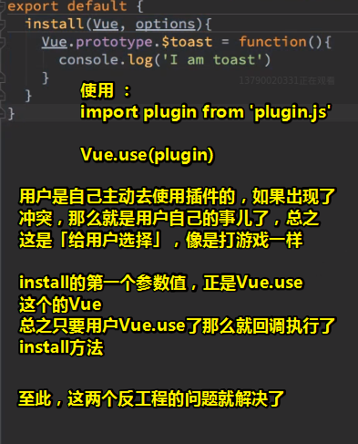

  以上就是告诉了你为啥要使用插件的姿势去做这件事了

- 接下来就是看看如何写这个 `$toast`API。

  - 简单姿势：一个`alert`，但这很丑

- 优化：

  - 把alert变成是一个div

    - 不用vue很简单，但是如果不用vue的话，那vue有啥用呢？

      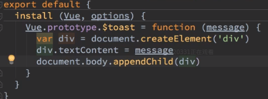

    - 生成一个toast组件放到body里边（使用JavaScript动态创建一个toast组件，或者说是toast实例）：

      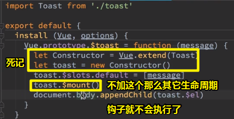

      >  `toast.$mount()` 可以让toast实例出现在内存里边，但没有出现在页面里边，所以我们需要把它append到页面里边。
      >
      > 不加 `toast.$mount`的话，那么toast组件所有的生命周期钩子都不会执行，如 `toast.$el`啥也没有。
      >
      >  `toast.$slots.default`是给Toast组件里的 `<slot></slot>`放默认的内容的，而且是 <mark>数组姿势</mark>
      >
      > <mark>注意 `toast.$slots.default`一定要放在 `$mount`的前面</mark>
      >
      > 
      >
      > 芳芳在写这个时候曾经写过博客介绍过，但是也忘记了，所以博客的作用是为了让你回忆的！
      >
      > 只看代码很简单，但是你得弄懂这背后之所以这样写的原因，如为啥 「 `toast.$slots.default`一定要放在 `$mount`的前面」?

- 为动态生成的toast组件加样式：

  - 移动屏幕的中间（用到`translateX(-50%)`，之前我用的是 `top: calc(50vh - 0.5em);` 这样的姿势，显然前者要好很多，因为我无法确定这个div是否有padding之类的）
  - 文字居中（搞成是flex容器）
  - box-shadow等可以从芳芳的设计稿抄
  - 字与边框的间距，一般是4的倍数或8的倍数

- 目前初步达成了，接下来完善功能

效果：

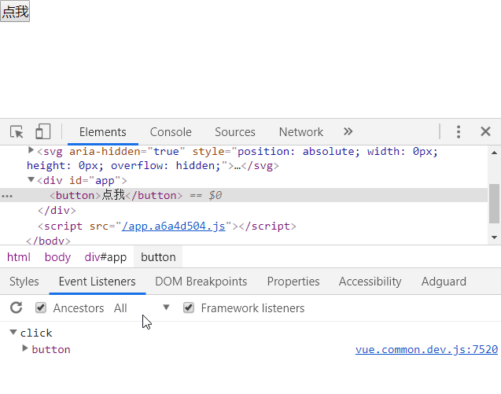

## ★更多需求

### ◇自动关闭

- 如何关闭自己？——把自己搞没掉即可，即 `this.$el.remove()`（让元素从页面上被remove掉），当然你也可以用CSS姿势把自己给搞没掉，但是最好的方式是把自己彻底搞没掉，然后 `this.$destroy()`（把元素绑定的一些事件都给取消掉，反正它做了很多对内存友好的事儿，总之就是让组件死掉哈！）

<mark>芳芳的代码实现起来是很少的，但这是他尝试了很多遍的结果</mark>

做法：

1. 定义两个属性——`autoClose`（默认true）、`autoCloseDelay`（默认5s）
2. 在mounted里边，设定定时器
3. 5s后执行定时器里的callback，即执行close方法——`remove()` 和 `$destroy()`

### ◇不要自动关闭

- 一个很重要的结论：如果你的default值是个对象或者是数组，那么你得用函数姿势return一个对象或数组

  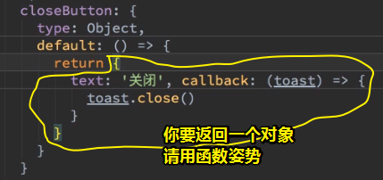

  那么为啥会这样呢？——因为不这样的话，会出现复用性的问题：

  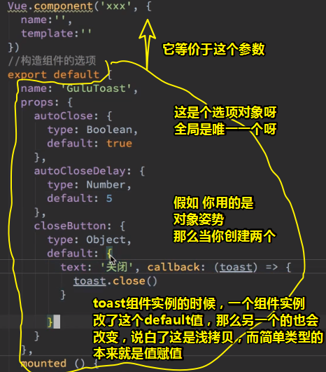

  总之，你要搞清楚我们导出的是构造组件的选项，而你在利用这个构造选项创建组件实例的时候，都是引入同一个构造选项对象呀！所以`closeButton`用的default值是简单的一个普通对象的话，那么就是引用拷贝，即浅拷贝，而这样就会有bug的风险了，而函数姿势return一个值，是一个新的对象！总之，你不这样做，那么请后果自负

- 在芳芳提出怎么做的时候，请你先在脑海里边想一想该怎么做，而这样积累下来，差距就会逐渐拉大了。如：

  

- 芳芳上课提到的debug姿势都得记下来，如再created钩子里边log一下 `this.closeButton`，看看所传的两个属性也没有追加到vm实例里边去——突然觉得之所以用对象作为默认值，那是因为里边的key与key之间是配套使用的！

- if……else判断一个变量存不存在，即为防御性编程——防止你的代码出现问题！

- 用户在传closeButton过来的时候，还可以使用组件提供的callback参数，它可以访问组件实例里的某些功能。

  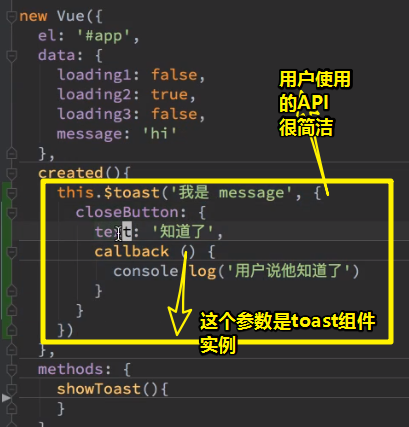

  这是一个较为高级点的需求——用户想要callback能做点其它事情，如既然我能使用 `$toast`这个API，那么我传过去的callback，能不能使用 toast实例的一些methods呢？——因为是用户定义的callback函数，所以toast组件里边的是可以主动回传一个toast实例过去的。

做法：

1. UI：作为装饰用的竖线div
2. 如果用户传了`closeButton`（需要给个text和callback），那么就会展示这个按钮UI；如果用户点击了按钮，那么就执行 `onClickClose`

自动关闭和主动关闭是共存的，默认是50s后就自动关闭，而自动关闭前，用户可以主动去关闭它，而点击关闭，就可以调用开发者给的callback。

总之，整体来看，我们都是围绕用户会怎么使用，然后不停地去想办法解决这个需求！

> 整体代码没有超过30行

一个提问而来的需求：

用户传过来的text是有标签的，如需要加粗……

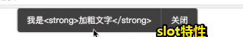

`<slot></slot>`是个单独特性，它可无法使用 `v-html`，即无法这样 `<slot v-html></slot>`

---

## ★完善功能

### ◇我想传有HTML标签的字符串

> 经过权衡，折中的选择了一个办法

1. 使用一个假的slot，即不用 `<slot></slot>`了
2. 传HTML是一个比较危险的办法，所以让用户自行决定传不传HTML，因此我们只需要添加一个props即可！默认是不解析HTML的

### ◇关闭二字竖着显示

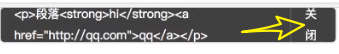

父元素是个flex，所以子元素搞成是默认不缩的 `flex-shrink:0;`

### ◇文字很多会很丑

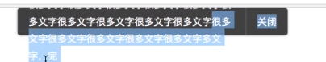

造成这种现象的原因是「高度不能自适应」

解决字的容纳问题：

1. 永远不要写死高度，可以改成是 `min-height`

然而这导致了另外一个bug，那就是子元素的 `height:100%;`（那根线）咩有办法根据父元素算了。不要问为什么会这样，它就是如此你有啥办法呢？

可以使用绝对定位，但是这线的位置变了。

所以使用JavaScript姿势。

主要用到 `$refs`这个属性

我们在mounted里边获取父元素的高度，然而这存在时间差的问题，即这是异步的，于是我们用了 `$nextTick()`这个办法拿到了父元素高度：

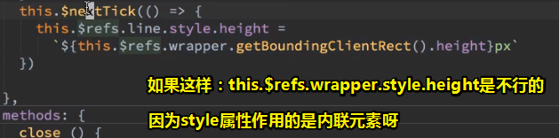

>  `this.$refs.wrapper.style` ：返回一个 [`CSSStyleDeclaration`](https://developer.mozilla.org/zh-US/docs/DOM/CSSStyleDeclaration) 对象，表示元素的 内联[`style` 属性（attribute）](https://developer.mozilla.org/zh-CN/docs/Web/HTML/Global_attributes#style)，但 <mark>忽略任何样式表应用的属性</mark> 。 通过 `style` 可以访问的 CSS 属性列表。
>
> 所以你是无法读取到元素的height值的，我们一般通过这个属性来向DOM上加上内联的css属性，而不是修改自己原来写好的css属性
>
> ➹：[demo](./demo/08/02-style属性能访问啥.html)
>
> 似乎是没有动态创建组件，并咩有出现异步情况！反正如果出现时间差的问题，那就异步执行一下呗！

➹：[HTMLElement.style - Web API 接口参考 - MDN](https://developer.mozilla.org/zh-CN/docs/Web/API/HTMLElement/style)

➹：[javascript - js中动态修改style属性的问题 - SegmentFault 思否](https://segmentfault.com/q/1010000005862366)

总之，`min-height`并不是说它是有高度的！所以儿子为百分比单位高度是不知道爸爸有多高的！

由于这个方法太tricky了，所以显得并不是很好呀！即看懂，所以我们应该重构了。

### ◇重构

说白了是封装成两个函数呗——

### ◇如何加padding？

为提示信息追加一个div，然后再加上padding，不然，如果你加到父元素身上的话，那根线是会有间隙。

其实这想想也是很有道理的：

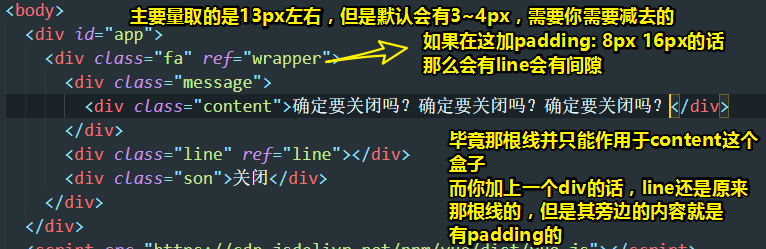

> 我发现字体变大了，父容器的高度也变高了，但是那根线却咩有随着变高到一定程度，说白了，mounted执行一遍就GG了。
>
> 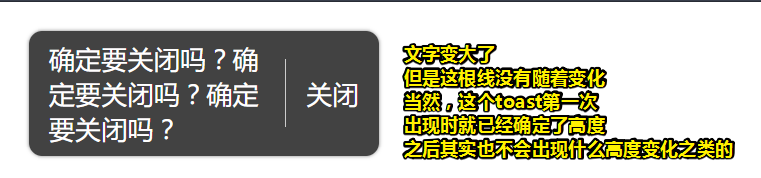

总之，CSS是最没有逻辑的，所以请不要问我为什么，多写多练就好了。

### ◇效果

弹出3s后自动关闭：


主动关闭（为了效果明显，我设置自动关闭为6s，总之，如果你在6s之内不点「关闭」按钮，那么6s一到也会自动关闭）：

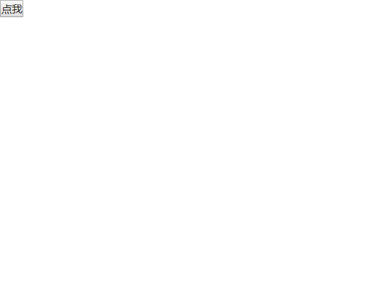


## ★重构

> 根据用例图对比我们已经实现的功能！

- 上下的中间叫middle，左右的中间叫center

- 兼容性不好也是反工程的一种体现

- includes这个API不支持IE，所以我们用了indexOf，因为它能支持IE9，总之谁兼容性好就用谁呗！

- 何时使用computed这个计算属性？——xx属性不是真实存在的，而是我们根据某个props属性计算出来的！

- 动态的key：

  ```js
  {
  	[`positon-${this.position}`]: true
  }
  ```

  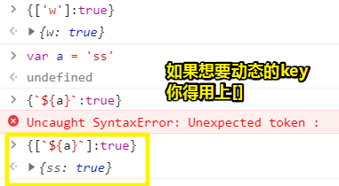

- 数组的indexOf：该方法返回在数组中可以找到一个给定元素的第一个索引，如果不存在，则返回-1。第一个参数为要查找的元素，找到就返回索引，找不到就返回-1。所以只要返回 `>=0`的值，那么就可以断定xxx元素是在数组里边的。

### ◇让toast出现在上中下

1. 添加postion属性
2. 通过postion的值去修改toast的样式

总共10行代码，而CSS代码严格上来说不能算是代码，而template的可以算是代码！

效果：

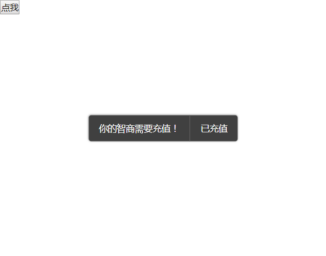

### ◇用户持续点击，toast该咋办呢？

<mark>**①如果已经有一个toast，那就把之前的给干掉，然后再创建新的**</mark>

1. 如何知道之前的在哪儿？——找到你创建Toast的代码

2. 重构了创建Toast的代码——创建函数，提取形参，解析赋值形参

3. 如何知道这是新创建的Toast？

   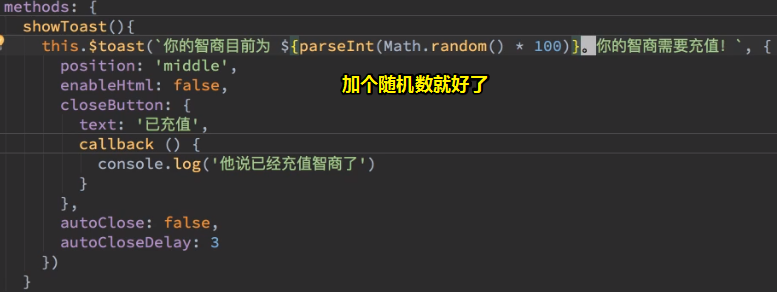

效果：


`commit：实现了只能有一个toast的功能`

实现多个toast的之后再做，因为目前来看这性价比不高，而实现动画的则性价比更高！

<mark>**②实现动画，因为toast的弹出和消失是很突兀的**</mark>

1. 直接使用CSS实现即可！

2. 如何做进入的动画？

   1. 声明一个动画然后加到toast上边，然后写上初始的状态和结尾的状态

3. 使用transform会出现跳跃现象！

   

额为的优化：

由于我们第一次出现toast时是不需要close的，所有我们搞了个回调，即第一次出现不会去close。

> webstorm有个功能是，你在提交的时候，如果做了两个不相关的操作，是可以把它们俩独立分开来提交的，即由一次提交变为两次提交：
>
> 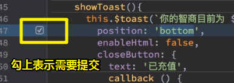

跳跃现象出现的原因：

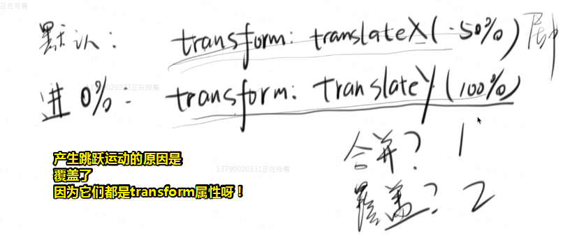

解决姿势：

1. 可以不用 `transform:translateX(-50%);`来做居中，但这是最好的居中方式，如果换一种的话，得浪费很多脑细胞去想怎么居中
2. 不要用CSS来做这个动画
3. 还有其它办法吗？——使用两个div，外面居中，里面做动画

在添加一层div的时候，如果你没有写子代选择器是没有问题的！但是使用了flex会GG—— `&`的好处可以让你在嵌套div的时候，直接复制粘贴即可，而不需要修改选择器。

> 芳芳在编程的时候有个习惯是「这是对的吗？」，（你要做出判断选择吗？）不需要，直接说「当它是对的先，如果出bug了，那就当它错呗！」

有人说到「可以在动画的两个帧上，都加上 `transform:translateX(-50%);` 」

我们并不知道为toast加动画时，它是怎么居中的。

总之，如果按照这种写法的话，那么你就得永远背下一个规则：「我每次加动画的时候，都得加上 `transform:translateX(-50%);` 」，你必须背下来，不然这就是bug了。

而如果像出现这种「必须背下来，不背下来就会出现bug的代码」，那么这个代码本身就是bug。

总之，不要去背这样的东西！

> 或许有些东西需要去背？比如内联元素不对齐的问题，然后`vertical`之类的……
>
> 或许这个动画出现的场景并不多，即性价比不高，背下来也就是bug咯！

还是出现了bug——测试toast居中的情况，没有真正的居中，这个你可以把vh的高度减小即可看出来：

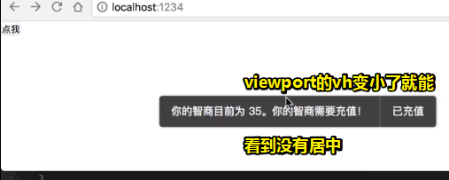

可见，这是toast的上边沿居中

解决姿势：


<mark>总之，你在修改 `.warpper`的样式时，需要你去看原来的样式，毕竟这是互相影响的。</mark>

测试top/middle/bottom的效果：

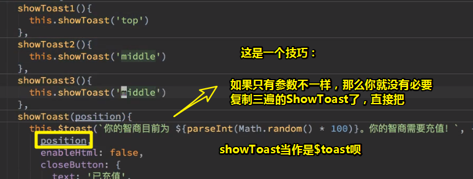

<mark>**③优化toast为bottom时，左下角和右下角是方的，而这是根据设计图而来的**</mark>


<mark>**④再优化，为top的toast应该是从上往下出现的，而不是像为bottom的toast从下往上出现的**</mark>


关于动画的时间，我们需要做一个变量，一般它的值建议是300ms或者是250ms。

效果：

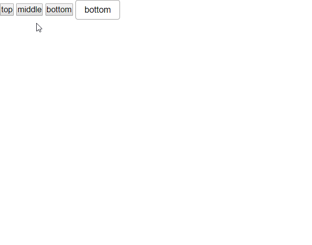

`commit：优化三种动画`

## ★测试用例

### ◇测出来了一个bug——传到秒数没有传进去

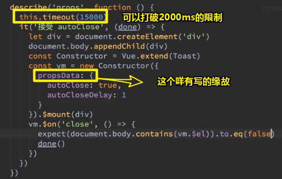

> 1s后，触发vm的close方法，而close里边有个 `this.$emit('close')`，所以 `close`事件被执行了，此时toast元素已经 `remove`了
>
> 可见，这代码技巧性十足啊！

本来这代码是这样的：

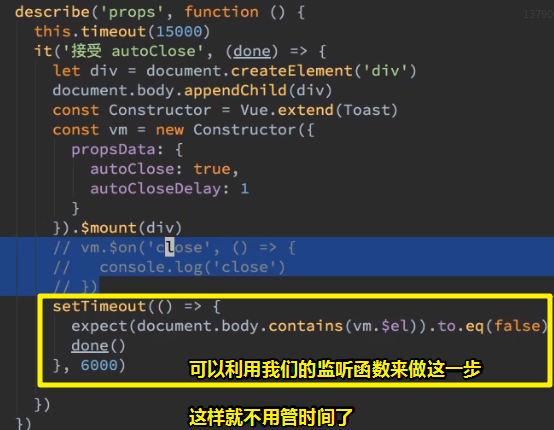

### ◇因测试而改造参数

> 传了autoClose，又得传autoCloseDelay有点冗余了，能不能只写一个参数呢？即autoClose即表示要自动关闭，也表示多少秒后自动关闭

- webstorm关于if ……else的重构操作很牛逼啊！

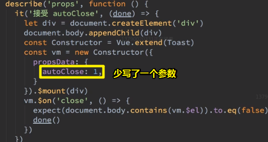

### ◇测试——我想要主动关闭

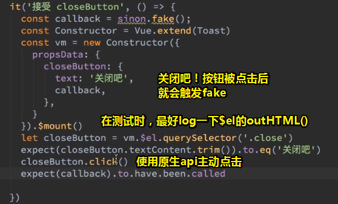

> `console.log(vm.$el.outerHTML)`

测试这个的时候，出现了警告呀！

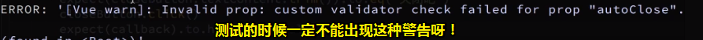

这来自于 `autoClose`的默认值为 `true`，其实这应该是Number类型呀，比如 `5`这样

### ◇测试——接受 enableHtml

这个测试思路来自于，如果选择器能选到该元素，那么就是作为一个元素而存在的。

> 每次测试都得要搞一个错误的结果才行，不然有时候测试代码是错的也通过了。

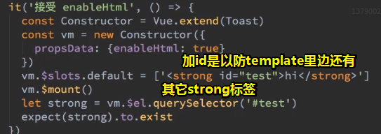

### ◇测试——接受 position

思路：就看有没有相应的class在元素身上

> 如果你使用watched姿势测试的，很容易会出现错误的，如果出现错误最好重启一下！


`commit:完成测试用例`

之后会讲到测试覆盖率，目前只是把属性和事件测一测就行了。

## ★总结

- 了解到了什么叫「工程问题」，而遇到这些工程问题，最好就是交给用户来背锅！
- 测试时最好log一下组件实例的 `$el.outerHTML`
- 做了什么？——自动关闭toast、主动关闭toast、怎么弹出toast
- 咩有做可以弹出多个toast，因为目前来看，这性价比不高
- 关于主动关闭的按钮，点击该按钮会执行一个callback，而这个callback可以高级点，比如可以拿到组件实例的`this`值，这样就可以访问组件实例的method，而这样一来，但用户点击关闭，执行该callback就会有更多的功能更多的操作了。
- 愈发觉得学习应该先学习核心的，其次再是根据项目推动去学习一些边角料知识点。
- 之前是在自定义标签上写自定义属性，而这次则是作为一个函数的参数，来写自定义属性。
- 作曲与编曲的关系，就像HTML和CSS的关系一样，没有编曲，那么演唱出来的歌曲就没有想象中那么富有表现力。总之，简单来说，作曲者是给了骨架，而编曲者则是给了血肉。
- 关于优化的细节，如果我没有任何产品经验的话，只凭感觉自己去调的话，那么这是没有尽头的。所以你最好就是点到为止。

## ★Q&A

### ①为什么在写 `.vue`文件时，把 `script`标签写在 `style`标签前面呢？

因为CSS是最不重要的！

而且我们很多时候写CSS都喜欢换行，导致CSS代码所占行数过多。

可见，如果把 `style`标签写在前面的话，那么我们写`script`的时候，就得每次回顾CSS代码了。

毕竟 更新JavaScript和HTML代码的频率要比CSS高得多！

所以为了减少肉眼负担，提高书写代码效率，只好这样做了。

### ②为啥用vue的姿势去动态创建toast实例，而不是用原生JavaScript姿势去创建呢？

换言之，是create一个组件好，还是create一个div好？

如果你用了vue，请一定优先create一个组件而不是一个ui。

一个明显的好处是，我们的组件可以使用 `@click`这种方式绑定事件

而div姿势，则是需要这样 `div.addEventListener('click',callback)`，可见这真TM麻烦啊！

总之，你既然引入了vue，那就用vue吧！毕竟你既然引入了vue，为啥不去充分使用它呢？

### ③remove可不可以不写？

不写的话，destroy并不能够把元素从页面中移除！

所以这需要自己删掉呀！

> 这是测试出来的结果！

### ④再看生命周期图？


➹： [demo](./demo/08/01-再看Vue生命周期.html)

➹：[vue 生命周期函数 - weixin_43208813的博客 - CSDN博客](https://blog.csdn.net/weixin_43208813/article/details/91077805)

➹：[2019.7.15 - 7.21 中你学到什么？ · Issue #1 · KieSun/today-i-learned](https://github.com/KieSun/today-i-learned/issues/1)

### ⑤关于Vue的插件？

为啥需要插件？——因为我需要为 Vue 添加全局功能

如：

1. 我需要添加 Vue 实例方法，而这可以通过把它们添加到 `Vue.prototype` 里边实现。
2. 我想搞个库，它可以提供自己的 API，同时为Vue提供一个或多个全局功能。如 [vue-router](https://github.com/vuejs/vue-router)

那么如何使用插件呢？

通过全局方法 `Vue.use()` 使用插件。它需要在你**调用 `new Vue()` 启动应用之前**完成

```js
// 调用 `MyPlugin.install(Vue)`
Vue.use(MyPlugin)

new Vue({
  // ...组件选项
})
```

`Vue.use(MyPlugin)`相当于是 `MyPlugin.install(Vue)`

如何开发一个插件？

1. 暴露一个 `install` 方法
   1. 第一个参数是 `Vue` 构造器
   2. 第二个参数是一个可选的选项对象

如：添加实例方法

```js
MyPlugin.install = function (Vue, options) {
	// 4. 添加实例方法
  Vue.prototype.$myMethod = function (methodOptions) {
    // 逻辑...
  }
}
```

测试：

搞一个可以创建Toast组件的插件：

```js
 let plugin = {
  install(Vue,options) {
    Vue.prototype.$toast = (message) => {
      let Constructor = Vue.extend(Toast)
      let toast = new Constructor()
      toast.$slots.default = [message]
      toast.$mount()
      document.body.appendChild(toast.$el)
    }
  }
}
```

使用：

```js
Vue.use(plugin) //plugin.install(Vue) or plugin.install(Vue,options)
```

> 消息传递：
>
> `person.cut('jj')`：
>
> 1. 给 persom 对象发送了一个 cut 消息
> 2. person 对象会响应这个消息
>
> 这是函数调用姿势，下边这个是另一种语言的语法
>
> Smalltalk ：`person cut: 'jj'`
>
> 所以 `plugin.install(Vue)`：
>
> 1. 给 plugin 对象发送个 install 消息
> 2. plugin 对象会响应这个消息
>
> `plugin install: Vue`
>
> 假装理解 `Vue.use(plugin)`：
>
> ```js
> class Vue {
> 	static use(xxx) {
> 		return xxx.install(this)
> 	}
> }
> Vue.use(plugin)
> ```

➹：[插件 — Vue.js](https://cn.vuejs.org/v2/guide/plugins.html)

### ⑥ `toast.$slots.default = [message]`？动态为组件的插槽赋值？

➹： [demo](./demo/08/03-测试slot.html)

➹：[细谈 vue - slot 篇 - 掘金](https://juejin.im/post/5cced0096fb9a032426510ad#heading-1)

ps：

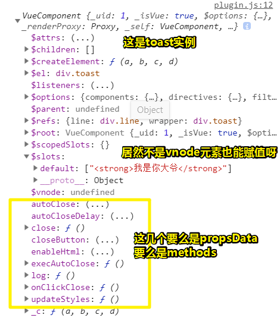

### ⑦ `transform: translate(-50%, -50%);`的作用？


一般都是配合定位来搞事情的。

### ⑧关于合并参数的理解？

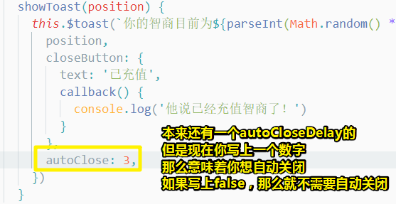

总之，写一个数字3相当于是两层意思，一层是我想要自动关闭，另一层是3s后关

### ⑨凡是用到了JavaScript，就得单元测试吗？

如：toast元素里边的那根线的高度，我们是根据JavaScript计算出来的

```js
  describe('CSS', function () {
    it('line 的高度', (done) => {
      const Constructor = Vue.extend(Toast)
      const vm = new Constructor({
        propsData: {
          position: 'middle',
          closeButton: {
            text: '已充值',
            callback() {
              console.log('他说已经充值智商了！')
            }
          },
          autoClose: false,
        }
      }).$mount()
      let line = vm.$el.querySelector('.line')
      let toast = vm.$el.querySelector('.toast')
      document.body.appendChild(vm.$el) 
      setTimeout(()=>{
        expect(line.style.height).to.eq(`${toast.getBoundingClientRect().height}px`)
        done()
        vm.$el.remove()
        vm.$destroy()
      })
    })
  })

```

测试是通过了，但是报错了：

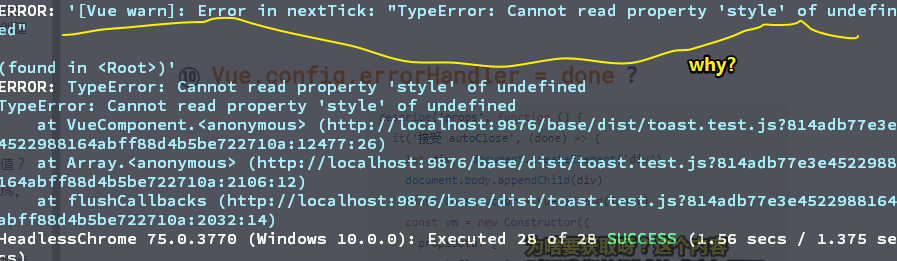

表示找不到解决方案。

➹：[Vue单元测试探索 - 掘金](https://juejin.im/post/5b308f5e6fb9a00e5d798c3c)


### ⑩ `Vue.config.errorHandler = done`？

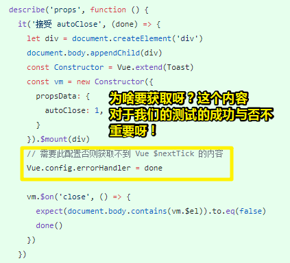

➹：[fix(toast): 添加toast的测试用例 · zyqq/wheel@cf74c2b](https://github.com/zyqq/wheel/commit/cf74c2b981d509a386e10b3bbb759425945b54b3)

> 是在测试代码里边使用了Vue.nextTick才配置好吧！

