# 简单轮子：Tab组件（下）

## ★Tabs测试（上）

- 注意点
  - `.vue`里边的name属性是来自于options的，而props的name是可以直接 `this.name`的
  - left不能做3D加速，而transform是可以的
- 可交互区域——点击item的区域
- 使用JS做动画——切换每个item时的下边框是滑动的
  - 触发自定义事件时需要告知每个item和pane是哪个item，以及改item的DOM是啥

### ◇注意点

- item触发了自定义事件，它可以传递当前vm实例给监听了该事件的tabs-item的callback，说白了，监听事件的callback可以接收多个参数，而触发事件的也可以传递多个参数，而这是一一对应的。之前我一直以为只能穿一个参数，如果传过个参数的话，只能用数组了，就像是apply这个API一样。

- 如果你学过用户交互设计的话，那么你会非常在乎可交互区域这一点。

- 很多时候，芳芳写CSS的调试技巧是border大法，用于观测这个元素的边界在哪儿，而知道边界了，那么对元素添加padding、margin、flex等就有很明确的指引了。

- 在写CSS的时候，你得脑海里边必须有这样的认识，即默认状态下，元素的样式为几何，有交互后，元素的样式又是为几何？

- 关于item下的边线，你可能会用`before` 或 `after`来做，但我建议你还是单独用一个元素来做，因为这样它才能滑来滑去。让线动起来，对于CSS来说是无计可施的，于是只好用JS了

- 子元素写了绝对定位，那么不要忘记了还得给父元素一个相对定位，这可以说是配套使用的

- 如何知道线需要动在哪里呢？——让head知道就好了，但是head只知道，哪个item被点击了，无法断定这个item的位置，所以需要利用 `getBoundingClientRect`这个API获取当前被点击的item的位置。

- 有些时候，为了做一个动画效果，需要为监听自定义事件的callback多传一些东西

- 页面初始化状态时，也是需要让线动起来的。

- 多重循环里边最好不要出现重名的形参：

  ```js
      this.$children.forEach((vm)=>{
        if(vm.$options.name === 'WarmTabsHead') {
          vm.$children.forEach((childVm)=>{
            if(childVm.$options.name === 'WarmTabsItem'
              && childVm.name === this.selected) {
                this.eventBus.$emit('update:selected', this.selected, childVm)
            }
          })
        }
      })
  ```

  不然：

  

  总之即便是形参的命名，也要有语义表明传过来的值是什么！

- `$options`：来自于`export`出来的选项对象，我们通常都会有这样的代码：

  ```js
  export default {
    name: "WarmTabs",
    props: {
    	name: {
    		type: String
    	}
    }
  }
  ```

  而props里边的name，可以不用 `vm.props.name`取到这个值，直接 `vm.name`即可

  而根下边的name属性，则是需要通过 `$options`才能取到！总之都叫name，只是巧合罢了，没有啥特殊含义！

- `webstorm：`修复上次的commit的，修复好后，提交之前点一下 `Amend commit`就好了，这样上次的提交就会多了这些用于修复的代码！总之，点了它，git的提交历史，不会多了这次提交。

- 每次点击item都会知道哪个元素被点击了，然后根据这个元素，就把线移到它的下边去！那么这个该怎么移呢？——`getBoundingClientRect`这个API可以拿到元素的宽高、left、top，宽可以确定线有多宽，left可以确定线应该移动到哪个item的下边，而这一切都是我们能获取到item这个元素为前提的！

- 让线平滑的滑动，而且它的宽度变化也是平滑的，所以这得用CSS搞动画了。

  ```css
  transition:left 1s,width 1s;
  transition: all 1s; //简单起见的做法
  ```

- transform可以做硬件3d加速，而left则不能，不过由于用了width，你加不加速都是很慢的！

- 提交的时候很多人都是用fix什么的，其实这很不好！

- 我们的组件里边写了个props `disabled`，而外边则不用写 `disabled=true`什么的，直接写个 `disabled`，那么它传过去就是true的值了！如果元素是disabled，那么你即便点击了这个元素也没啥用！因为此时的callback直接返回了呀！disabled了的元素其实也可以被选中，只是需要用到JavaScript，我们用户直接用鼠标肯定不行，但是JavaScript行啊！

- 目前大部分功能已实现，直接就是测试！

### ◇我要做什么

- 增大 tab item 可点击区域

  - 为啥要增大？

    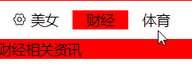

    你会发现这些item的上空白和下空白是无法被点击的，而这就是不可交互的体现，而这种体验对用户并不好，所以我们需要增大

  - 思路

    - 修改CSS——tabs-head有多高，那么tabs-item就有多高

  - How

    - 每个item的高度为100%
    - 让item的文字内容垂直居中：item flex容器化，再搞个 `align-items: center;`就好了，它的左右居中是用padding 1em搞出来的
    - 删掉item的爸爸，即tabs-head的 `align-items: center;`，毕竟不需要它去上下居中，如果不删，就是冗余了

  - 效果：

    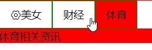

- 触发 update:selected 事件的时候添加一个 item 数据

  - why？

    - 我想要切换item的时候有个下划线边框效果，而这个只能用JS来做了，可是我们该如何确定点击哪个item就会滑到哪个item下边呢？也就说这涉及到每个item距离viewport的left的问题，而这个距离问题需要我们得到每个item的样式数据才能解决。

      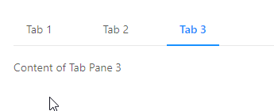

  - 思路
    
    - 很简单，在item触发自定义事件的时候，传一个this过去给head的callback就好了。不过需要注意的是，tabs模板创建好后，还需要默认触发一下自定义事件，而这个在mounted执行就好了，毕竟此时的mounted能访问所有子组件，然后就把默认选中的item交给head的callback就好了。
  - How？
    - 在head的template新增个叫 `line`的div，毕竟我们能页面能看到它！然后对它就是一顿绝对定位操作，不过我们只给了bottom这个属性，至于left属性为啥不给，你之后就明白了
    - 点击item时需要触发自定义事件，然后传个this给head的callback
    - 页面没有进行任何交互时，即默认某个item是被激活的，此时这个默认的状态，也是需要通知head触发callback，而这个触发在tabs的mounted里边进行，毕竟此时这个钩子能访问儿子和孙子了，通过两次遍历筛选找到了那个默认的item实例，至此，head的callback也拿到了默认被激活的item实例了

- 完成 tab 切换动画

  - 思路

    - 通过`getBoundingClientRect()`拿到item的外联样式，通过 `style`属性修改item的内联样式，至此，就完成对line样式（width和left）的更改了。
    - width决定了item有多宽，其下划线就有多宽
    - left决定了下滑线距离父元素左边的距离

  - How？

    - 在head的mounted里边监听自定义事件，毕竟它的callback里边需要用到 `this.$refs.line.style.width`这样的API，也就说head的template需要挂载到页面后，才能访问到line这个div元素的style属性，而如果是created的话，显然是不行的。
    - 搞点transition 过渡动画，让样式的变化不会那么突兀

  - 效果：

    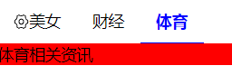

- 完善tabs的样式

  - why？——还能为什么，太丑了呗！

  - 思路

    - 处理一下那个「actions」按钮的样式，比如垂直居中，左右有间隙……
    - 总之，就看ant-design的ui就好了

    你会发现多一个head和body，样式写起来是真得方便！

  - How？

    - 处理actions按钮
    - 处理item的文字颜色
    - 处理head的底部边框与line是重合的，line是2px，而head是1px
    - 为item添加hover……

  - 效果：

    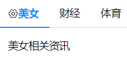

- 支持 disabled 功能

  - why？——需求决定，咩有为什么

  - 思路：（外面：组件标签；里面：`.vue`这个文件，即组件的内部构造）

    - item标签上只要写有 `disabled`属性的，那里面的disabled就是true值，通过disabled的是true or false，来决定该item是否有disabled这个class
    - 根据元素有无disabled这个class来选择合适的样式

  - How？

    - 某个item组件标签写有disabled属性，那么它就会有disabled这个class
    - 当我们点击该被disabled的item时，直接返回，而不是继续触发自定义事件，而没有触发该事件，也就没有所谓的下划线了。
    - 为disabled添加一些样式

  - 效果：

    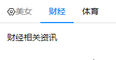

---

## ★Tabs测试（下）

### ◇注意点

- 如果你不写测试，那么你这个轮子就没人用了

- `$children`只能获取到子组件，不能获取到子元素，所以咩有子组件的话，那么它就是个空数组 `[]`

- 你在mouted里边抛出一个错误 `throw new Error('tabs的子组件应该是tabs-head和tabs-nav，但你没有写子组件！')`，那么在测试代码里边是异步报错。——而这个「期待异步报错」，没有找到方案解决

- 在做工程的时候，很多地方需要你面临这样的选择——你是要功能还是要时间，如果你要功能那就花时间，你要时间，那就少做点功能。

- 关于 `console.warn` 这个函数，有些浏览器是咩有的，所以在使用它的时候，最好 `console && console.warn && console.warn('dadadada')`一下，用于确定`console`和 `console.warn`存在之后，再去 `console.warn()`

- 测试能测的，不能用代码测的就放弃，反正还有手动测试。

- 当你测试的东西，需要到子元素的话，那么 可以用 `div.innerHTML`去构造需要的DOM，而这个DOM可以用我们手动测试时写的DOM，然后删掉多余与测试无关的属性和HTML就好了

- 一旦涉及到异步，测试就会特别麻烦！所以你在做复杂的项目的时候，异步是非常需要避免的！如何推测是不是异步？——使用setTimeout+done，如果成功了，那就证明这是异步的操作，如测试 `selected`属性

- 二分log法，专门用来解决哪段代码是我们预期执行但没有被执行的操作：

  

- 出现bug是一定 可以解决的，有很多时候都是因为细小的问题而造成的bug，但是让你自己去找是找不到的，你需要另一个人帮你看才行

- 只写it不写其它的，也会测试通过：

  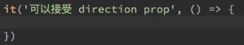

- 在测试的时候，如果你没有什么异步代码就不要写done，不用会报诸如超过2000ms的错误……

- 为了让代码可测试，所以我们往轮子代码里边追加了一些**服务于测试代码**的代码

- `'' && 6`：返回的是空字符串；`'' || 6`：返回的是6。前者第一个值为falsy值，那么就返回第一个值，而后者则是第一个值truly值就返回第一个值。反正它们俩最终结果出来了，那就不用计算了，即所谓的短路运算。


### ◇我要做什么？

- Tab组件是否存在

- 子组件只能是 tabs-head 和 tabs-body（这个测试放弃）

  - why？
    - 用户使用了 `g-tabs`标签，然后直接写个div，而不是我们想要的 `g-tabs-head`和 `g-tabs-body`
  - 思路？
    - 在index里边写上错误代码。然后再测试代码里边模拟用户这个过程
    - 处理用户的错误使用，意味着你在测试代码里边要期待什么
    - 搜索chai 关于期待报错误的API
  - How？
    - 由于咩有找到「期待异步报错」的解决方案，于是这个测试就被GG了。
    - 这个测试就不写了，我们直接修改代码，给黄色警告而不是红色错误，反正，这是在告诉用户，你不按我的文档来，那么出现的问题就自己解决。——这是有一种权衡的方案（要时间，少做功能）

- 接收 selected 属性

  - 思路？
    - selected这个class的添加是异步的
    - 在构造 `innerHTML`的时候， `:selected='xxx'`，表示xxx是个变量，而这个变量，我们在`app.js`里边的data里边并没有写，即我们并咩有定义它，所以它是 `undefined`值，因此，千万不要写 `:`这个哦！
  - How？
    - 构造一个HTML
    - 使用 `nextTick`处理异步操作
    - 追加done

- tabs-item 接收 name 属性

  - why？——反正写了props就得要测

  - 思路？

    - item元素必须依赖一个eventBus，如果咩有那就无法渲染：

      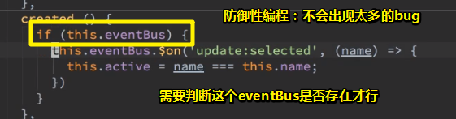

    - item是强依赖tabs的，因为需要eventBus，不过对于测试来说，只要不报错就好了，反正没有用到它

    - 使用JavaScript的原生API `getAttribute`

  - How？

    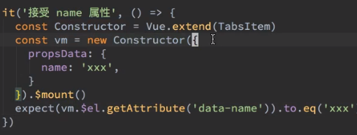

- tabs-item 接收 disabled 属性

  - 思路？

    - 该属性不同name属性，因为该属性是功能的，如无法被点击

      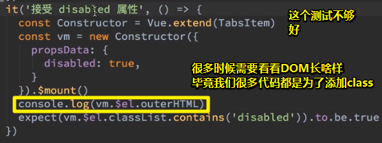

    - 搞个假的回调，用到了Sinon

    - 让轮子代码可测试：

      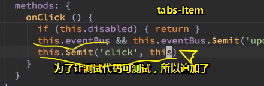

      因为我们item强依赖tabs，即eventBus是不能用的，为了判断disabled为false时，callback是执行了的，所以搞了个模拟`this.eventBus`执行的代码。而disabled为true时，这个模拟代码咩有执行，意味着eventBus也没有执行！

  - how？

    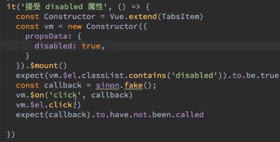

- 后面的自己测（这是个坏习惯，因为很有可能你不打算再测了。实事确实如此！）

## ★总结

- 上传代码的时候，请把项目的serve给关掉！
- 关于tabs组件，目前就写到这样就好了，等之后完全UI库之后，再逐个改进！

## ★Q&A

### ①元素是absolute的，只写bottom，是否就够了？

如果用户给absolute至少指定了`left/right`中的一个，则水平方向的相对特性丢失，垂直方向上继续保持相对特性；如果用户给absolute至少指定了`top/bottom`中的一个，则保持水平方向上的相对特性，垂直方向上的相对特性丢失。例如：

```html
<div class='box'></div>
.box{
    position: absolute;
    right: 0;
}
```

此时，元素水平方向相对特性丢失，具有了绝对定位特性，而垂直方向的定位依然保持了相对特性。

➹：[【前端Talkking】CSS系列——CSS深入理解之absolute定位 - 前端Talkking - SegmentFault 思否](https://segmentfault.com/a/1190000014736711#articleHeader8)

### ②如何叫编写可测试的代码？

我们的代码用在测试的时候，某些场景下是不那么好测试的，如dom元素的查找

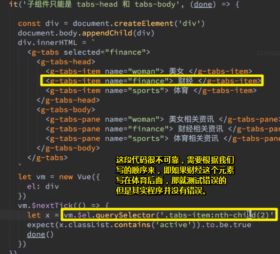

如何让我们的代码变得可测试一点？——加个标记就好了

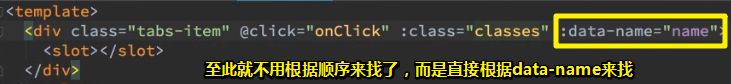

### ③测试覆盖率？

程序员在写代码总是觉得写测试代码是很花时间的，那么就会倾向于不去测它！

那么这样会不会有问题呢？——肯定会呀！

芳芳会在终极部分告诉我们「如何去避免程序员这个惰性？」

之前芳芳讲到过，一个框架的厉害之处在于「它会让你写不出低质量的代码」

而我们现在就是在写低质量的代码，因为我们这测了一部分代码，没有测完呀！而这是全靠自觉的

万一有程序员出现我们这种不自觉情况的话，我们该怎么办呢？——可以通过一些制度来强制ta必须写完。

而这就是框架的优点了。

关于测试覆盖率，我们之后会引入这个工具，该工具会看你测的代码和你写的代码是否是百分之百全部覆盖的，如果不是100%，那么就写到100%为止！而不到100%就不让你通过！

目前，就不测有关tabs的其它组件了，用于留个坑之后填！

### ④v-if和UI任务的那些事儿？

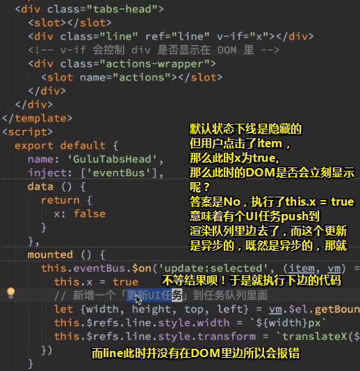

那么如何把把下边代码放到更新UI任务执行后才执行呢？——使用nextTick啊！

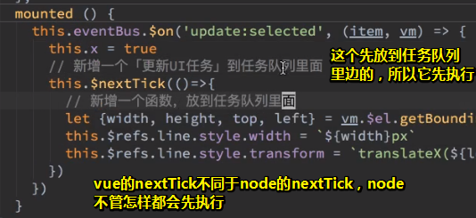

> 我们想要是用transform，但还是咩有解决页面刷新，线从left为0的位置滑到最终目标的位置。而使用left的话则不会

虽然使用了left性能差些，但是bug更少，代码更少，总之这是需要权衡的

当然，如果你能接受transform那种滑动倒是可以的！

### ⑤纯CSS禁止鼠标点击事件？

```css
.disabled {
    pointer-events: none;
    cursor: default;
    opacity: 0.6;
}
```

用于解决元素是disabled状态，但还可以响应鼠标事件（如click事件）的问题！

➹：[用纯CSS禁止鼠标点击事件 – WEB骇客](http://www.webhek.com/post/css-pointer-events-preventdefault.html)

➹：[disabled - Mozilla 产品与私有技术 - MDN](https://developer.mozilla.org/zh-CN/docs/Mozilla/Tech/XUL/Attribute/disabled)


