# 简单轮子：Tab 组件

## ★课程简介

代码链接： <https://github.com/FrankFang/frank-test-1/tree/tabs>

UI：<https://www.yuque.com/u29422/gulu/268970>

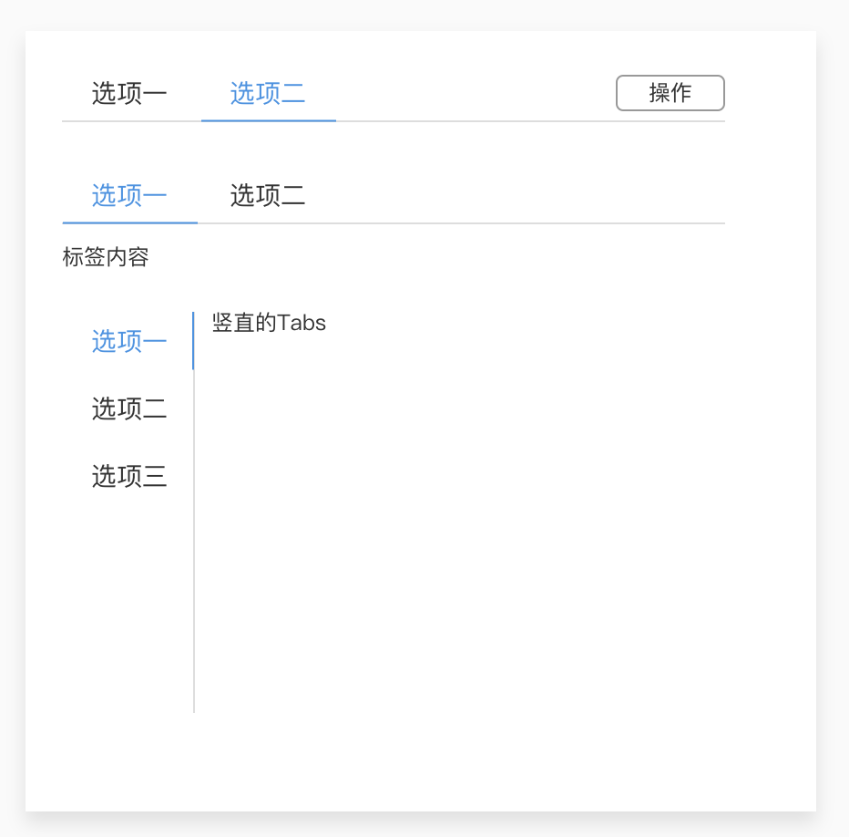

## ★最近反馈的问题解答

1. github发现 了潜在的隐患，这是因为我们的代码用了很多其它的库的缘故（可以查看package.json的依赖和开发依赖字段以及package-lock.json）。

   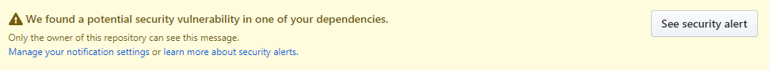

   隐患缘由：

   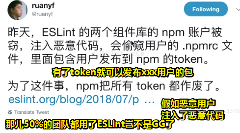

   因此所有人都需要重新登录，然后换个token后，这些包才是有保障的！不然，该包风险就很大了。

   > `.npmrc`文件下会有个缓存的token

   解决方案：

   要么点击去看隐患代码，看看能不能解决（需要更lodash版本为最新之类的，但是我找不到是那个库依赖了它，万一更新了，导致整个项目都蹦了？）；要么就是dismiss，即风险自担。

   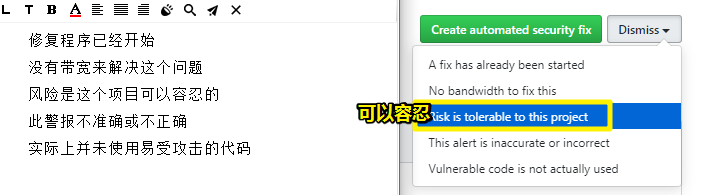

2. 用了cnpm的话，那就把它卸载掉吧！因为该工具的维护目前并不活跃呀！总之，你就设置淘宝源即可！而cnpm没有使用价值了

3. 如果项目是用npm这个包管理器来init，那么就不要随便改成是yarn这个包管理，不然这是很容易出问题的！

4. `parcel watch test/* --no-cache & karma start`，window不支持 `&`，即无法让终端同时运行二者，你可以打开两个终端，分别使用 `npx`来执行它们。改成两个 `&&`也是不行的，因为 `&`和 `&&`意思是不一样的。

5. 如果你想学命令行，那就装个深度系统或者是Ubuntu系统…毕竟windows的功能太差了

6. vue有没有好的文章推荐？——芳芳觉得搞清楚官网文档就非常好了，当然，你就关注那个点，然后 就如「vue 响应式数据」这样去搜索文章呗！

7. 如果遇到使用工具的报错信息，那么就复制报错信息到google上搜索

## ★解决bug的思路

> 如何解决突然出现的bug？（如 `npm run test`发现一个测试用例不通过）——不用问人，因为这有亘古不变的debug办法

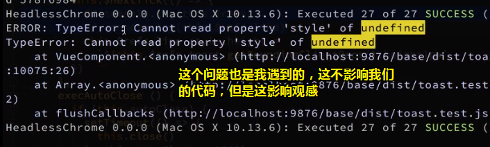

分析：

1. 在1万多行的位置？——显然这是parcel打包后的结果，因此我们并不知道报错点在哪儿，但是我们知道这跟 `toast.test.js`这个文件有关

   我的是在这行：

   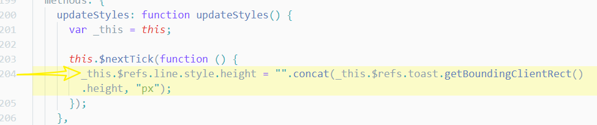

2. 可以看到可能是我们的 `this.$refs.line`为undefined，因此我们需要通过log大法看看它是什么，当然，你也可以用debug，但这忒TM麻烦了。

   > 通过报错信息提示，定位到有bug的代码

3. 分析产生bug的原因：二分法确定是哪个测试用例报错了，然而，令人无语的是，单独打开每个测试用例都不报错，但是全部打开就报错了。——存在缓存的问题，其实是第二个测试用例的问题呀！

   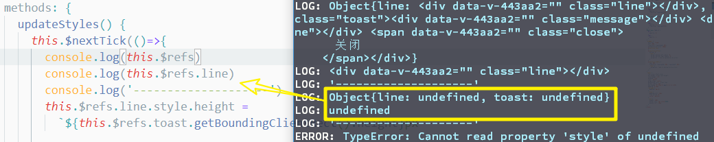

   > 在 `$nextTick`执行前，是你在mounted里边log `this.$refs` 是有的，但执行nextTick之后，就为undefined了，所以可见这中间是存在某种过程导致了（异步执行的时间差），`this.$refs`消失了

4. 分析

   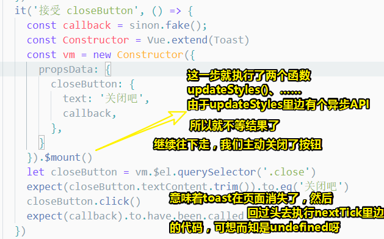

5. 解决bug——搞个定时器执行后边两行代码即可：

   ```js
   let closeButton = vm.$el.querySelector('.close')
   expect(closeButton.textContent.trim()).to.eq('关闭吧')
   setTimeout(()=>{
     closeButton.click()
     expect(callback).to.have.been.called
     done()
   })
   ```

   测试，发现这个bug消失了。可见这是我们测试用例写得不周全呀！而且也可以看到，nextTick的回调先于setTimeout的回调先执行呀！

> 总之，你得分析清楚，这个测试用例的代码执行是如何走的，比如哪个函数先执行后执行。总之注意时间差的问题，即异步那些事儿。

小结：

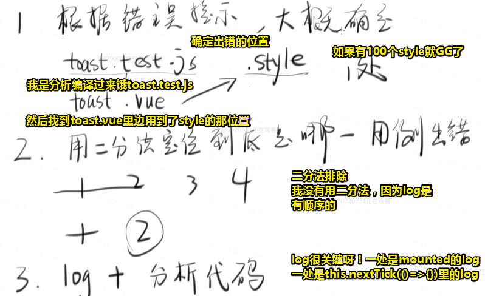

---

## ★需求分析

### ◇我想造个轮子？

做每一个轮子之前都要经历这4步，如果少了任何一步都会出现很大的问题：

1. 需求
2. UI
3. 代码
4. 测试

大部分程序员只管代码，导致ta做的需求有问题、UI有问题，或者说测试不通过

总之，你自己一定要把这4个都得过一遍

有的时候需求不是你写的，但你也要看一遍

UI不是你做的，你也要核对一下

测试虽然有帮你测，但你自已也要测一下

而这样才算一个完整的开发流程

### ◇Tabs的需求

1. 需求：

   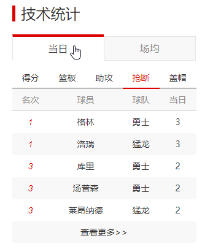

   你切换得分，就展示得分相关的内容；你切换篮板就展示篮板相关的内容……

2. 分析这个需求（画个用例图就好了）：

   一分析得知，就是个tab的切换，似乎就没有了。

   当你想不到任何分析的时候，那就去参考业界的，有很多人认为抄袭是很可耻的，但是在软件工程里边有个原则就是，尽量让你的东西跟业界里的差不多，比如360的杀毒软件，和QQ的安全管家，你看它们俩是不是差不多的？而这样做的原因是为了减少用户的学习成本呀！

   所以抄袭人家是怎么做的轮子并不可耻呀！

   分析ant-design的tabs：

   - 可以禁用tab，不过这个tab挺鸡肋的，如果在做后天管理系统时，需要权限的话，才能访问这个tab的话，那倒不如不显示这个tab嘞！
   - 字体放大就不做了，让用户自己用CSS调吧！
   - 有好几个需求，我们就挑了4个需求来做，其余的需求，有时间可以自行去做

   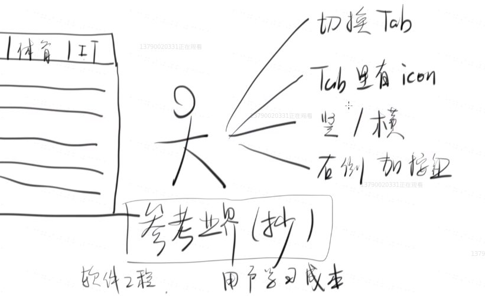

   

3. 分析要做需求的UI，直接抄ant-design的UI就好了

4. 其它人如何用你的tabs？

   1. element-ui的姿势：

      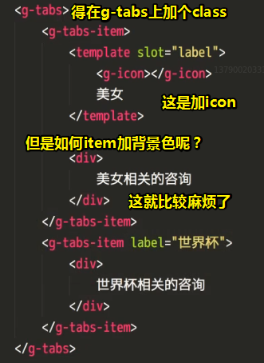

   2. 芳芳提供的姿势（代码复杂点，但结构清晰）：

      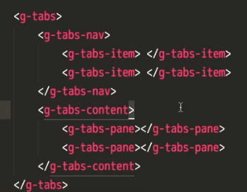

      为了让我们的代码好写，所以需要加上个name属性，而这是权衡出来的结果，反正你如果因为需要取个名字而犯难的话，那么我劝你还是不要用这个库了：

      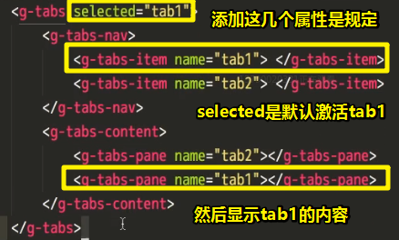

   为啥选择第二种？——因为保证了层次结构：

   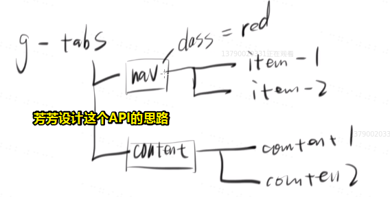

   而element-ui则是父子关系层次结构：

   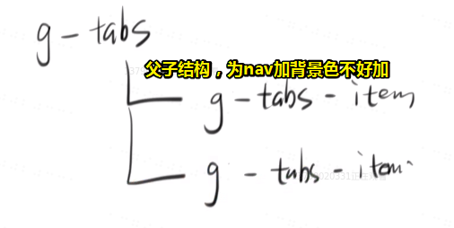

   总之各有各的好处咯！随你喜欢

   以上是芳芳所规定的API，而我们也可以规定自己所想要的API

5. 想好怎么用之后，就可以开始想想怎么用代码做了，当然，这tab的组件会稍微有点复杂哈！

---

## ★创建五个组件

> 想好别人怎么用我们的组件，就可以开始写组件了。

1. 根据设计的API，需要搞5个组件，即一个标签一个组件
2. 从最外边那个组件（tabs）开始写（当你不知道要写啥的时候，就直接写那3个标签即可）
   1. 写个root元素，即div
   2. 根据设计的div，我们需要把内容插进去，因此用到 `<slot></slot>`，如果不写这个，那么Vue就会删掉用户写上的子元素
3. 写tabs-header（也可以叫tabs-nav，算一个好记的就可以了）。
   1. 我们为root元素写上了class `tabs-header`，这里的中划线表示父子关系
4. 写tabs-item（都以tabs为前缀好了，写代码最烦的就是起名字了，如果名字起得好，代码就好看了，而名字起得烂，就很容写错代码了，总之你要花点时间起名字）。
5. 写tabs-body
6. 写tabs-pane

芳芳起得名字都很规整，多想想自己能否做到这样

接下来用index.hml来做测试，这个文件最后最终都会被删掉哈！

还有app.js这个文件最后也会被删掉，目前来看虽然import了很多东西，但并不需要去优化它哈！毕竟我们人的精力是有限的，该优化的地方就去优化，不该优化的（最终都是被删掉的），那就无脑的去抄就好了，如 `import`组件，注册组件，而不是什么都要去优化。

> 关于vim的学习，芳芳都学了好几年。而如果学会了，那么这代码就写得贼快了。

注意：**由于HTML的风格是head对应body，header对应footer，所以那个tabs-header组件，最好改为tabs-head。**

至此，tabs-head、tabs-body、tabs-item、tabs-pane，都是4个字母结尾的，这让处女座的人看起来是非常舒服的！

当然，你不改也没有任何关系，随你喜欢。

此时的API：（你会发现element-ui那种设计是有它的道理的，即更简洁，而芳芳的则是为了结构更为清晰，所以各有千秋呀！）

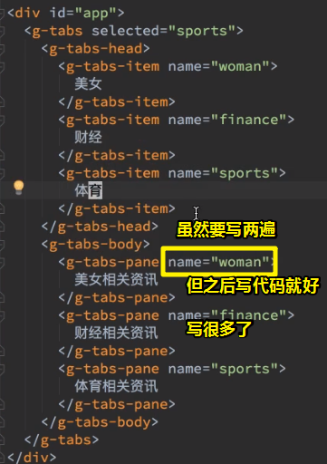


- 规定输入参数以及需求：

  - tabs组件只有一个参数，好不好呢？——显然这不好呀！因为我们需要tab切换呀！一旦tab切换，那么selected的值也要变啊！于是我们加了个事件监听，可是为啥要加事件监听呢？

    那是因为：子组件是不能改父组件的任何值的，如果用户要改变一个tab，那么不能在子组件里边改，而是一定要通知爸爸 `#app`去改，为啥要这样呢？——因为selectedTab是 `#app`的数据呀！所以这不能由别人改。

    因此，就必须要有一个事件了。

    ➹： [②](#er)

  - 方向（决定tabs是竖着还是横着）：tabs

  - disabled（禁用）：tabs-item

  - 添加icon：只需要加个icon标签即可

  - 额外的按钮：tabs-head，需要多加一个插槽，[③](#san)

其它诸如删除或添加tabs就不做了。

目前的API结构：

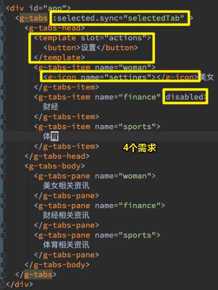

`commit:添加 tabs 相关组件，添加基本 props`

---

## ★依赖注入和eventBus

### ◇上一节的反馈？

- 没有想到需要用到 `.sync`，关于这个你习惯就好了，因为所有造轮子的人都需要知道 `.sync`什么时候去提供，总之，目的就有一个，那就是给用户吃一颗糖，让它甜一甜。当然，不用 `.sync`也是可以做到的，那么这就需要写一个绑定，然后再写一个事件监听了，而这就很麻烦了

- 添加 `g-tabs-head`的目的，就是为了让用户可以在其身上添加class：

  ```html
  <g-tabs-head class="frank"></g-tabs-head>
  ```

  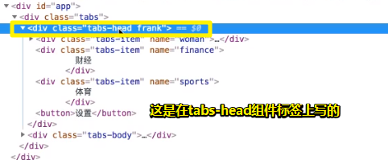

  文档里边说了：如果你给了一个自定义标签一个class，而本身的template又有class，那么vue默认是合并的，而且只有两个属性是这样的——Style和class，其它属性则是直接覆盖。至此，我们就很容易就可以给tabs-head添加一个背景色了，可见这要比element-ui要好，毕竟这是一种无侵入的、比较好改样式的API。

### ◇想想怎么做Tab切换？

#### 画个图搞清楚逻辑

- 组件的结构（目前是126结构）：

  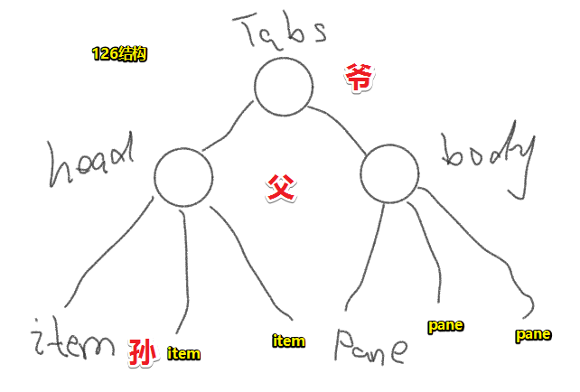

- 爷爸孙通信：爷看到了 `selected=item1`，那么就把 `item1` 交给 `t-head`和 `t-body` 这个儿子， 同理， `t-head`都把 `item1` 传给了它的 3个儿子 `t-item`，这些 `t-item`们会识别 这个信息是不是给自己的，如果是自己的那就亮一下呗！不是，那就不亮呗！

  总之关键点，在于都传。

  总之，这是我们在有赋值的时候，如何去表示被选中的逻辑。而这个传递过程，我们的代码也有类似这样的传递过程

- 如果用户点击了第二个item2，那么应该发生啥事情呢？

  - 兄弟组件之间是没有办法通信的，即item1和item2是没啥关系的，即item2要点亮，请item1熄灭吧！这是做不到的。

  总之，这需要做5件事：

  - 自己亮起来
  - 哥哥你熄灭吧
  - pane2亮起来吧
  - pane1你也要熄灭哦
  - 爷爷，你的 `update:selected`事件要被触发哦！触发后就得让selected值变为 `item2`哦

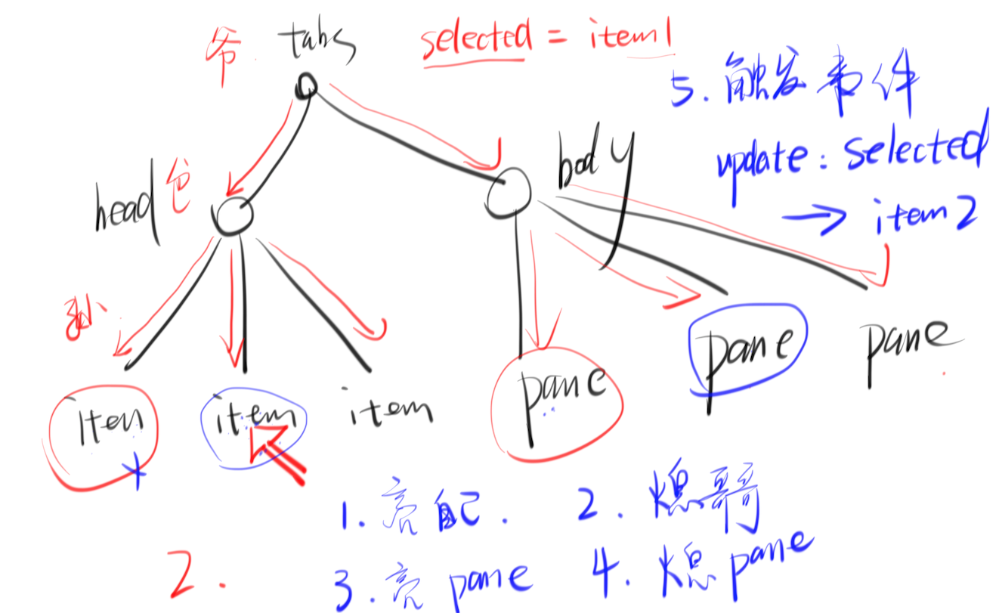

> 这就是理解数据结构的好处了——这图就是一个颗树啦！

#### 逻辑清楚了，那就想代码细节呗


1. item2如何通知pane2？——我通知爸爸，爸爸通知我爷，爷通知我二叔，二叔通知我爷的二孙子**亮灯**。与此同时，通知我爸时，爸通知大哥**熄掉灯**

   可见这样的通知路径是有点复杂的，即又上又下，蹦蹦跳跳的，难道就不能直接打个电话通知一下吗？非得搞得像层层汇报一样

   所以能不能简单点啊？——添加个第三者就好了，而这第三者也叫做  `EventHub`（事件中心），有些地方也把它叫做`EventBus`（事件总线）

2. 怎么个中心法？——item出现一些变化，就直接通知给事件中心。而事件中心则通知所有节点，注意这是所有节点啊，而不是相关的节点。

   虽然需要通知很多节点，但是这变简单了许多，而这本质上就是一个发布订阅模式，即谁变了，就发布一个事件，而其它节点就只管订阅就好了。

   > 是不是说只有订阅用户，事件中心才会把item2触发的事件通知给订阅用户？我之前认为是，事件中心通知给所有节点哦！

   这种方式看起来，咩有比之前那种粗暴姿势（通知爸爸爷爷，然后爷爷通知二叔……）简单点，但是写起代码来就要简单很多了。毕竟item2只需要发布一个事件，然后其它所有组件节点只需要订阅这个事件就好了

可见，我们有两种姿势完成通信：

1. 「爷爷爸爸儿子之间的亲密谈话」
2. 「事件中心」

你说哪种好呢？——通过芳芳讲解知道，是第二种比较简单啦！

但是，如果你信邪的话，你也可以试着走走第一种怎么做，芳芳期待了不信邪，因为这样你就可以走一些弯路了，而你走的所有弯路都会变成你的经验。


### ◇搞个事件中心出来

> 需要提供（provide）一个事件中心（Vue的文档里边写了有怎么提供）

那么这该如何提供呢？——让tabs组件来提供（话说，让tabs组件来提供好吗？——因为不知道tabs组件能否拿到写在自己身上的事件中心）：

**第一次尝试：**

1. 需要在tabs组件里边引入Vue

   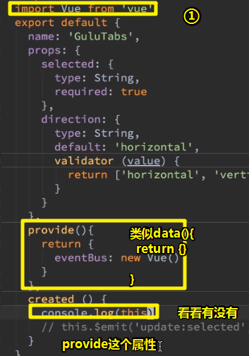

2. 结果发现没有这个provide的属性，即我们无法访问写在自己身上的事件中心。简单来说，就是自己提供的东西，自己访问不到

**第二次尝试：**

1. 所以我们还得再加一层中转——用data做中转

   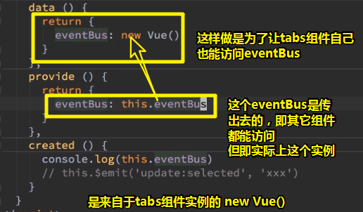

   > 突然发觉为啥，要用tabs作为事件中心了，因为tabs组件是爷爷呀！即它只有一位爷！
   >
   > 总之，eventBus就是一个Vue的实例，仅此而已，而它之所以能让爸爸组件、孙子组件访问到，那是因为我们provide了。
   >
   > provide是个特殊的API，或者说是特殊的对象选项。

2. log一下this有哪些值：

   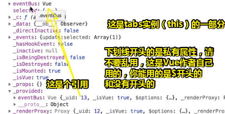

   provide出去的eventBus是来自于data里边的eventBus属性的引用。

3. 只要我们在爷爷这个组件上写上`provide:{eventBus}`的话，那么它所有的子孙后代就都能访问到这`eventBus`，说明`provide`这个属性是唯一一个可以跨组件都可以调用的属性，而其它的属性都是只提供给儿子，不提供孙子（如props属性），总之，**只有provide是任何后代都可以访问的**

   ➹：[vue 父子组件间通信 - 个人文章 - SegmentFault 思否](https://segmentfault.com/a/1190000014381699)

### ◇让后代访问eventBus

儿子tabs-head表示想要访问：

1. 写个inject属性，即注入（不注入是没有eventBus的，反正你注入了，所有后代都会有的）：

   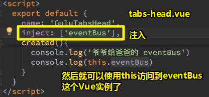

孙子tabs-item表示也想试试：

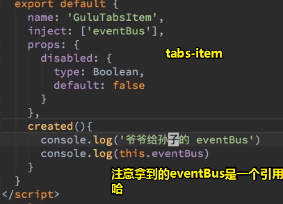

同理，其它的爸爸儿子都这样搞，因为它们都需要知道那个item被选中了。

测试（xx item 被点击了，所以xx item需要通知所有人）：

> name属性，可以是Number类型的，因为方便给个1234这样的名字

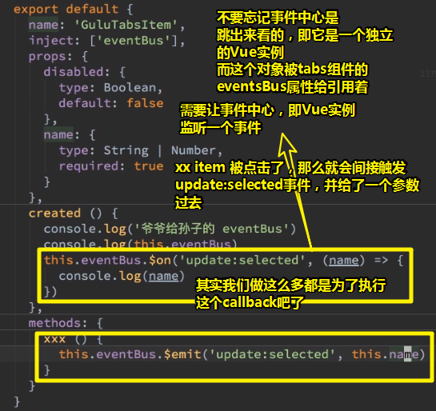

> 必须要给name属性

所有后代组件都得监听这个 `update:selected`事件

> 为啥所有后代组件都得监听呢？——这不是同一个Vue实例对象吗？
>
> 难不成这类似于订阅 `update:selected` 事件？
>
> 如果某个组件咩有监听的话，那么是无法收到xxx item被点击的信息？

总之，自己触发，自己监听，都得写上，毕竟，有时候不是你自己触发的，而是其它item触发的，那么`xxx()`就不会执行，而 触发的事件的callback就会执行；也有写时候，自己触发，同时也执行自己写上的callback。

> 再次自以为是的理解每个后代组件都得监听这个 `update:selected`事件的原因：
>
> - 儿孙后代们啊！请订阅这个事件
> - 儿孙后代们啊！订阅了这个事件，你们都能写上自己想要的callback了
>
> 或许你会怀疑，为啥绑定在同一个eventBus，即Vue实例的 `update:selected`事件，会执行不同的callback？
>
> 或许这是因为，`inject`这个API所起到的作用，它可能为每个callback都搞了标识之类的。

效果：

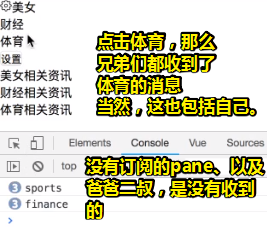

同理，其它组件也要订阅监听：

> log测试完毕，就得删掉，千万不要留在代码里边。

至此，我们就完成了谁该亮的操作了。

`commit:注入eventBus,在每个组件上监听update:selected事件`

> 注入的是事件中心必须是Vue对象吗？——不是的，你用原生JavaScript搞得也行，只是，我们使用Vue更方便罢了。
>
> 我们还可以用Vuex这个插件来搞这样的事情。

### ◇一个问题

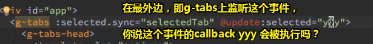

这是不会执行的。

很多用Vue的人会有这样一个误区——总觉得这是事件更其它原生的DOM事件一样，你在哪儿触发，就会冒泡到上边去给其它监听了该事件的元素执行callback。

至此，你一定要记住的一个重要的原则是：

- Vue的事件是不会冒泡的，你在哪儿触发的事件，就会在哪儿触发它的callback

话又说回来，eventBus是哪儿来的？——在tabs.vue里边的data的eventBus的属性的 `new Vue()`

而监听 `update:selected`这个事件的是g-tabs元素呀！

而g-tabs是啥呢？——它是一个Vue组件，即我们监听这个事件的是Vue组件，而不是 `new Vue()`在监听，而它们俩是没有关系的。

那么g-tabs组件如何触发这个事件呢？——

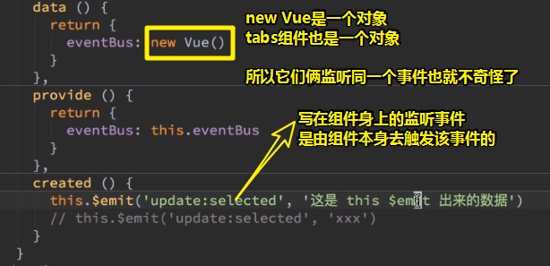


那如果我用eventHub呢？——那么就是另外一个事件系统了。

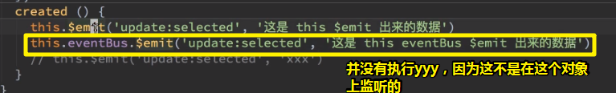

结果：

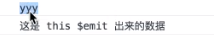

第二行啥事都没有发生。

结论：

1. 你得知道你触发的事件是在哪个对象上触发的，不是说名字一样那就都可以，毕竟一个可以在this上边，一个也可以在this的`eventBus`上边
2. 其实我们只是想调用 `update:selected`事件的callback罢了。
3. 其实每个对象都可以触发不同的事件，总之事件是要看在哪个对象身上触发的。

再问：「我在tabs-head里边能触发yyy吗？」

> 学造轮子会让你更好地学习Vue，因为你能研究更细的东西

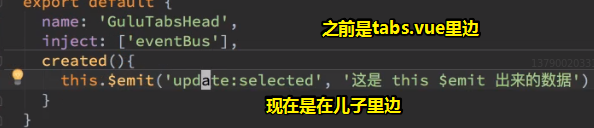

> 我认为这不会，因为这TM不会冒泡啊！

结果，不会。因为Vue的事件系统是不会冒泡的。


如果儿子是div，那么点击该div，那么点击事件时会传到它的爸爸身上的，因为这叫做事件冒泡啊！

但是如果g-tabs-head里边触发一个同名的事件，那么这是不会自动冒泡到它的爸爸身上的。

那么能不能冒泡到爸爸身上呢？——一般来说，请不要这样做。如果你非要这样干，也是有办法的：

component-child:

```
this.$root.$emit('foobar',{...});
```

component-parent:

```
this.$root.$on('foobar')
```

➹：[javascript - How to bubble events on a component subcomponent chain with Vue js 2? - Stack Overflow](https://stackoverflow.com/questions/42029150/how-to-bubble-events-on-a-component-subcomponent-chain-with-vue-js-2)

但是芳芳认为这不太好，因为有需求的时候再说比较好，而现在说，并不知道这到底好不好，而现在没有需求，那就先不这样用咯！

> 我认为这是真得不好呀！因为假如事件冒泡的了，那么事件的callback该什么时候执行呢？
>
> 假如template是这样的：
>
> ```html 
> <div id="app">
> 	<g-tabs @xxx="yyy">
> 		<g-tabs-head>
> 			<g-tabs-item><g-tabs-item>
> 		<g-tabs-head>
> 	<g-tabs>
> </div>
> ```
>
> g-tabs-head在created这个钩子里触发了xxx事件，然后冒泡到g-tabs身上，执行yyy这个callback
>
> 可是g-tabs-item的编译，会不会被阻止呢？——照理说应该会阻止。
>
> 测试得知，不会阻止：
>
> ➹： [demo](./demo/09/vue事件冒泡.html)

###  ◇小结

1. 详细讲解了Vue事件。其中需要注意两个点：
   1. 事件是在哪个对象上被调用的，即被触发的。总之，你在哪个对象上调用，那么你就只能在哪个对象上监听了。如你在eventBus上监听的事件，那么你只能在eventBus这个对象上触发事件了。除此之外，就没有其它地方可以监听了。
   2. 事件不会冒泡，你在子标签上触发的事件不会自动传到父标签上边，那孙子就更不用说了。

---

## ★如何切换Tab？

### ◇为啥一个new Vue()就能构造出一个eventBus呢？

我们知道某个东西想要成为一个事件中心，只需要满足这3个条件即可：

1. 触发一个事件
2. 监听一个事件
3. 取消监听一个事件

而`new Vue()`恰好都满足：

```js
//平时我们new Vue()是这样用的：
var app = new Vue({
	created() {
		//this.$emit()
		//this.$on()
    //this.$off()
	}
})

//可以直接拿出去使用
app.$emit()
app.$on()
app.$off()

// 那么把app当成是一个eventBus，岂不是手到擒来的事？
eventBus.$emit()
eventBus.$on()
eventBus.$off()
```

总之，一个对象能满足上边提到的三种接口，那么它就是一个事件中心了。

`new Vue()`这样，啥参数不传，那是因为我们只想要借用它的三个接口摆了！其余的接口一概不用。

总之，就是因为 `new Vue()`的行为完全跟eventBus一样，所以 `new Vue()`才能成为一个事件中心，如果不这样用它，那么我们就得自己去构造一个事件中心了。

而这也有一种称呼——基于行为的开发。

> “当看到一只鸟走起来像鸭子、游泳起来像鸭子、叫起来也像鸭子，那么这只鸟就可以被称为鸭子。”——鸭子测试
>
> 当你看到一个对象，可以触发事件，监听事件，取消事件监听，那么就可以把它看做是一个事件中心了
>
> ➹：[鸭子类型 - 维基百科，自由的百科全书](https://zh.wikipedia.org/wiki/%E9%B8%AD%E5%AD%90%E7%B1%BB%E5%9E%8B)

ps：事件系统和事件中心是不是一回事呢？似乎满足监听事件，和触发事件就可以构成一个事件系统了。

> Vue文档里提到「在组件通信里，每个Vue组件（Vue实例）都是一个独立的事件中心」

如果你这样做：

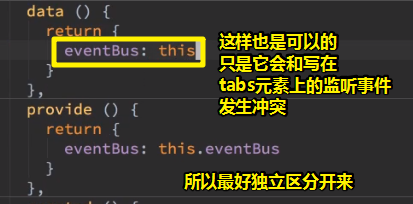

总之，我们要搞一个跟外界隔离的eventBus，尽量不要混在一起！（具体详情看看之前的「两个对象都能监听同一个事件」）

> 突然明白监听事件，需要给上callback；触发事件需要给上回调的需要的参数。
>
> 之前的原生事件，都是浏览器提供给callback一个事件对象参数的。

### ◇写样式

`webstorm：`模糊搜索

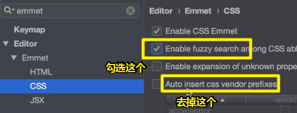

#### 注意点

- tab和tab之间的间隙，用em，因为这关系它们之间隔了几个字

- slot上边是不能加class的，所以需要加个 `action-wrapper`（包裹器），为啥不叫 `action`呢？因为需要区分 `slot`的name：

  ```html 
  <div class="action-wrapper">
  	<slot name="action"></slot>
  </div>
  ```

- 在tabs-head里边，flex item都左对齐（`justify-content: flex-start;`），而其中有一个flex item有这个 `margin-left:auto;`，那么该item就会跑到右边去。原理？——我也不知道为啥，芳芳也是抄人家的，所以我们就抄芳芳的，这可谓是知识的薪火相传


### ◇默认pane是隐藏的，只有激活时才出现（决定active的归属）

话说，这激活怎么做呢？——有两种姿势可以做到

1. 作为tabs-item的props的一个属性。默认是false，即未激活状态
2. 作为data的一个属性

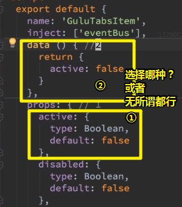

很多面试官经常会问到「data和props有啥区别？」 （这个知识点很重要）

小白：都是数据呗！还能有啥区别啊！

芳芳的选择是data，既然有选择，那么就会有为什么。

解释一下为什么：

什么时候用props呢？——如果你需要用户（是前端开发者，而不是普通用户）传值，那么你就把值放到props里边，因为props是你的输入参数啊！就像是你写一个函数这样：

```js
function xxx(prop1,prop2) {}
```

而data则是函数内部维护的变量：

```js
function xxx(prop1,prop2) {
	var data1
	var data2
}
```

所以它们俩的区别是：props需要用户传值，而data则不需要用户传值

既然data不需要用户传值，那谁传值给它？——自身维护值呀！

总之，active是true还是false，外界不用告诉我，我组件本身自己知道，就像是这样：

```js
 function xxx(prop1,prop2) {
     var data1 = prop1
     data1 = 2
     var data2
 }
```

虽然我的data1可能从你的prop1里边拿，但是最终我还是自己去维护，如 `data1 = 2 `这样的另外一个值，而不是用户说啥值就得是啥值

<mark>总之，props就是形参，而data就是局部变量，而组件其实就是一个函数。</mark>

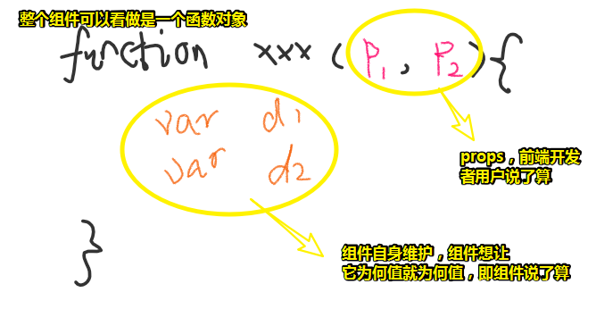

> 有这么一个「公式」：程序 = 数据结构 + 算法
>
> 在Vue组件里边，主要维护的全局数据的似乎就只是props和data，而像是computed等这一类的都是基于它们二者搞事情的。
>
> ➹：[怎样反驳「程序 = 算法 + 数据结构」的言论？ - 知乎](https://www.zhihu.com/question/28026777)
>
> 题外话：
>
> ```
> 程序 = 算法 + 数据结构
> 软件 = 程序 + 软件工程
> 软件公司 = 软件 + 商业模式
> 
> 往往软件工程的质量直接决定软件的质量，商业模式的优劣决定了一个公司的成败
> ```
>
> 感觉软件工程这专业起到承上启下的作用呀！就像是前端夹在UI和后端之间
>
> ```
> 文学 = 字 + 标点
> 所以，研究字和标点就能写出好的作品。
> ```

所以，接下来分析active需不需要用户传？——我们在设计API的时候，就没有想过要用户传，而是让name属性传给tabs组件的selected属性，进而控制其它tabs-item组件和tabs-pane组件的active。

 总之，用data可以方便我们组件自己去修改active的值，而且用户也不用在意这个值，甚至 `app.js`也不知道有 `active`这么一个状态

总之，如果你不想要外界（指的是在`div#app`里边使用tabs组件这样的API）知道，那就用data呗！当然，你硬要用props也行，随你喜欢呗，反正这是思考角度的问题，如我思考的并不是能不能做到，而是在想着是自己组件维护还是用户自己闲得蛋疼自己去维护。

而这就是芳芳为啥选择data的原因所在了。

### ◇默认知道谁被选中了，那么如何选中它呢？

①使用事件

②在tabs组件mounted（不要用created，因为只要mounted才能保证tabs的子元素都被创建好了）之后，就让eventBus触发 `update:selected`事件

```js
  mounted() {
    this.eventBus.$emit('update:selected', this.selected)
  }
```

告诉事件中心，用户选中了 `sports`（默认选中这个），那么其它（如tabs-item和tabs-pane这样的子组件）监听了 `update:selected`事件的，就会触发它们自身的callback了。

③回顾这个过程：

   1. tabs组件的props的selected收到了 `sports`这个用户传过来的值

   2. tabs组件在mounted之后就给所有的子孙说一句话「各位子孙，体育被选中了，大家看着办吧！」

      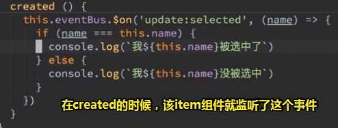

   3. 可见这就是所谓的发布订阅呀！总之，这TM就是村长广播了一个事件（马冬梅上台领奖），让所有子孙们都听到了，然后子孙们自己都判断一下自己是不是叫马冬梅？——是的，就上去领奖呗！「注：村里就只有一个马冬梅，毕竟一条村的人都是亲戚，总不能二叔的儿子叫xxx，三叔的儿子也叫xxx吧！」

      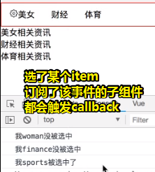

> 之所以叫发布订阅，那是因为程序的行为很像发布订阅。
>
> 关于监听：
>
> ```js
>   created() {
>     this.eventBus.$on('update:selected', (name) => {
>       this.active = name === this.name
>     })
>   },
> ```
>
> 按理说eventBus全局只有一个，所以callback理应也只有一个才对，但是我猜测，可能是inject的缘故，让每个callback都按顺序pusn到一个 `update:selected`事件队列里边去了。
>
> 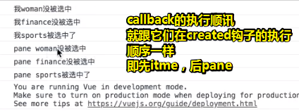

### ◇active的值可以更改后，那就搞样式呗

- 搞样式需要用到计算属性，因为这个样式需要根据active的true or false来决定！

  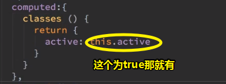

其实tabs-item和tabs-pane里边出现了重复代码，如classes这个计算属性，created里边的事件监听

遇到重复，第一个想到的就是，重复即bug（一处错了，另外一处一模一样的代码可能会被忽视掉），当然，你也可以不优化，这得看你的意愿了。

> `webstorm：`
>
> 定义模板：
>
> 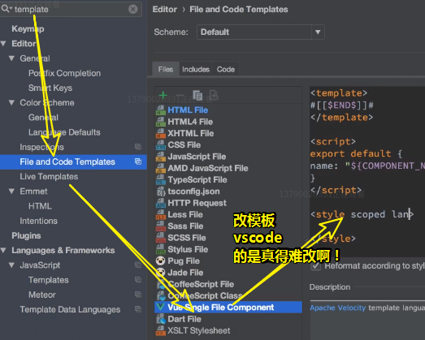

小结一下：

通过一个事件通知子孙组件们自己维护自己的active状态（自觉是王道），万一有一个组件没做好，如pane组件，那么就是轮子开发者的事儿了，毕竟这是我们自己写的pane组件，假如是其它人写的组件，那么谁写的组件就谁负责。

### ◇如何做到pane隐藏？

- 通过active的true or false ，来控制 元素显示与否。做法是`v-if`的使用

➹： [⑨](#jiu)

之后，会通过transition来加动画，目前就做个简单的切换即可！


### ◇效果

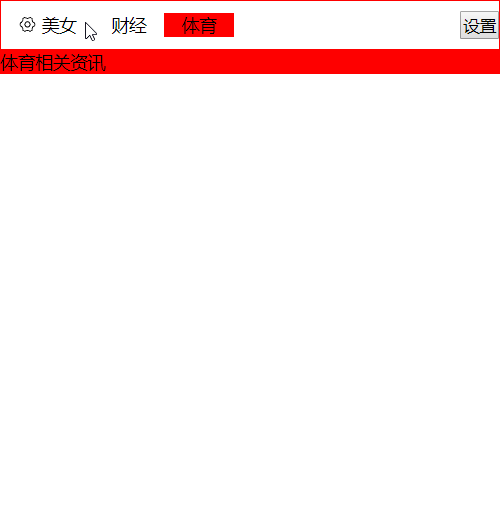

> 其实，就是通过更改active这个class，来切换不同的样式。

### ◇小结

回顾一下我们做了什么：

1. 分析需求，知道用户怎么用（设计API）。于是创建了5个组件
2. tabs：
   1. 接收一个selected属性，该属性是可以 `.sync`的，即可以双向同步的
   2. 接收一个direction属性，用于切换tabs的方向
   3. 提供一个事件中心eventBus（用到了data和provide）
   4. 在mounted里边触发了 `update:selected`事件，用于让tab有个默认的初始值。
3. tabs-head：
   1. 没有任何的props，用于在组件标签上边，加一些本来就可以添加的class、style、name属性等
   2. 总之它没有任何事件和属性（如data），它的存在就是为了搞一个清晰的HTML结构
4. tabs-item：
   1. 它是用作tabs-head的子组件，它较为复杂一点
   2. props：disabled（用于禁用这个item）、name（必须写）
   3. 监听了外部的 `update:selected`事件以及监听了内部的click事件，click事件用于触发外部的 `update:selected`事件
   4. data：用于判断该item是否被激活
5. tabs-pane：
   1. 几乎同上
6. tabs-body：
   1. 同tabs-head一样，都是用于做HTML结构的！

一些疑问：

①组件能不能改自己的props？——不能改！如果改自己的props就相当于是写了这样一个函数：

```js
function xx(obj) {
	obj.a
	return obj
}
```

即接收一个对象，然后把对象的值改了再返回出去。

 那么这样做到底好不好呢？——虽然这没有多大问题，但是我们一般都说「不要改参数传来的东西」，所以Vue也坚持了这个原则，即只要是传进来的东西，你不允许做任何的修改，如果你要改的话，你得这样改：

   ```js
   function xx(obj,n) {
   	obj.a
   	var number = n
   	number.a
   	return obj
   }
   ```

声明一个内部你自己的n，然后自己再去改你自己的东西，总之，你不要改外部传来的东西，因为一旦改了的话，那么这个事情就不好说了，。

说一个题外话：「框架为啥会有这么多规矩？」

➹： [⑩](#shi)

----

## ★总结

- 以后看template，请以树的角度去看，定位到root组件节点（一般都是 `#app`，如果站在tab组件来看，那么tab组件就是root组件了），然后一个个后代子组件实例即是一个个节点。

- 如果能看用英文的vue文档，那就看英文的！而不是切换到中文再去看！当你去文档查看provide和inject时，能不能看懂这还得结合你的需求来！

- 关于事件中心，每个组件都需要inject一下，这就像是留了一个eventBus的电话号码一样！

- 关于flex容器的main轴和cross轴，我似乎可以理解成几何辅助线。

- 在写组件的时候，请把不变的选项对象，写在前边：

  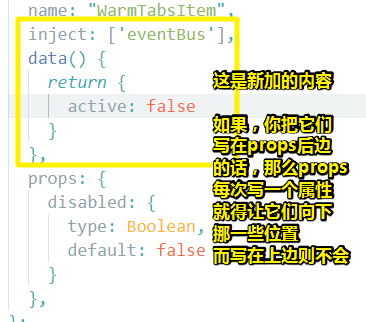

- 在每个注入（inject）了eventBus的组件里边，写上这段代码：

  ```js
    created() {
      this.eventBus.$on('update:selected', (name) => {
        this.active = name === this.name
      })
    },
  ```

  仅仅只是为了让callback能访问该组件里边的一些数据（如修改active的值）吗？而不是说所谓的「订阅」？
  
- `.sync`这部分知识点不是很熟！

- 我之前把Tab组件里边的每个item当作是tab了，其实它们是item呀！


## ★Q&A

### ①framework7的tab？

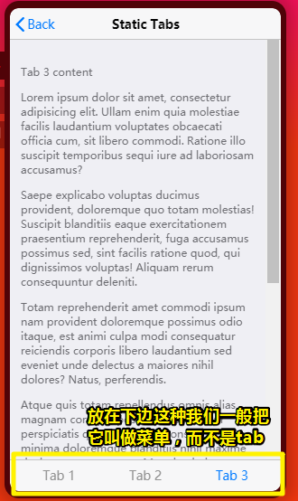

不过framework7做的是真得好啊，可以动画（高级的时候芳芳会讲动画），可以手指滑动，还可以路由等等……

### <a id="er">②tab切换需要触发自定义事件？</a>

当xxx用户，点击 `item` 美女，那么就需要更新 `g-tabs`上的 `selected`值。

为啥需要事件？——因为子组件不能改父组件的数据，这只能由爸爸 `#app` 去改g-tabs上的数据 

事件的名字：

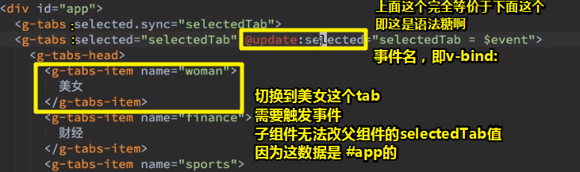

当用户点击美女item，那么就会触发 `update:selected`事件

总之`update`后边接收的是属性的名字。

> 加冒号是表示 `selectedTab`是个变量，而不是字符串

selected值，目前是不需要的，如果不爽，那就给个默认值。

在某个时期，就会触发 `update:selected` 事件，而事件的值目前还不知道。

为了使 `.sync`修饰符有用，我们必须要触发这个事件：


> 要理解这个过程，你需要带着把模板编译后的眼光来看：
>
> 我们点击了tabs-item这个div，显然原生里边这是个click事件吧，然后执行它的callback，而callback里边有我们要触发的自定义事件—— `update:selected`，而这个事件显然也会触发一个callback，而这个callback是干嘛的呢？——比如tabs这个div的selected属性改为「woman」
>
> 以上的理解也是需要前置知识，如了解JavaScript的事件、异步回调等知识。Vue 框架，把我们构建自定义事件这件事变得简单了很多。至于其是如何做到这么简洁的，那就不是我所关心的事儿了。反正这API是Vue作者自行设定，而你只能接受这样的API，接受这样的使用。
>
> 所以请不要理解如何用（直接抄就好了），而是要理解这背后的执行过程（记得更深刻）。
>
> 总之，修改tabs的selected属性值，是tabs组件自己完成的，而tabs-item只是发个通知，并附带个参数给你。

➹：[自定义事件 — Vue.js](https://cn.vuejs.org/v2/guide/components-custom-events.html#sync-%E4%BF%AE%E9%A5%B0%E7%AC%A6)

### <a id="san">③如何在一个组件里边添加多个插槽？</a>

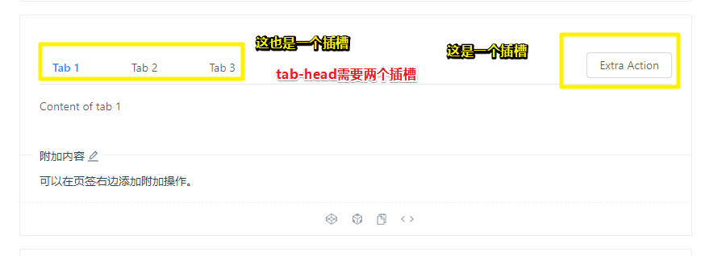

如何让tab-head组件有两个插槽呢？

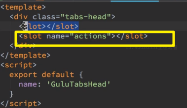

测试多加的action插槽：

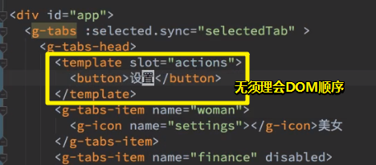

编译后的结果：

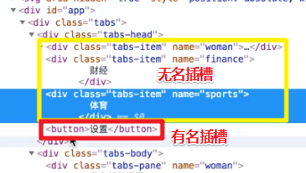

### ④vue实例中出现有下划线开头的属性？

这些下划线开头的属性不要随便滥用，因为这是私有属性呀！而这些属性是Vue的作者自己用的，不是给我们这些框架使用者用的，我们能用的就是 `$`开头的，这些 `$`开头的，就是Vue作者专门给我们用的。

### ⑤芳芳经常性的xxx命名？

如果我们没有想好一个函数应该起什么名字，那么芳芳的习惯就是把它叫做xxx

表示，这是一个看起来就是需要改的名字，而不是随便给点英文单词之类的。

毕竟一看xxx，就是需要改的；而你一看bus，似乎这名字还有点意思哦！

### ⑥如何搞一个事件中心？（涉及到provide、inject）


➹：[API — Vue.js](https://cn.vuejs.org/v2/api/#provide-inject)

### ⑦除了class和Sstyle属性以外，name属性也是可以直接写在组件标签上的？

template：

```
<div id="app">
  <g-tabs :selected.sync="selectedTab">
    <g-tabs-head>
      <template slot="actions">
        <button>设置</button>
      </template>
      <g-tabs-item name="woman">
        <g-icon name="settings"></g-icon>
        美女
      </g-tabs-item>
      <g-tabs-item name="finance" disabled>财经</g-tabs-item>
      <g-tabs-item name="sports">体育</g-tabs-item>
    </g-tabs-head>
    <g-tabs-body>
      <g-tabs-pane name="woman">美女相关资讯</g-tabs-pane>
      <g-tabs-pane name="finance">财经相关资讯</g-tabs-pane>
      <g-tabs-pane name="sports">体育相关资讯</g-tabs-pane>
    </g-tabs-body>
  </g-tabs>
</div>

```

编译后的结果：


不过这个就没有了：

```vue
<template>
  <div class="tabs-head">
    <slot></slot>
    <slot name="actions"></slot>
  </div>
</template>
```

写在插槽的name属性是咩有的，它的作用就是给个名字，所以这也叫具名插槽。

### ⑧回顾组件created和mounted钩子的执行顺序？

```html
<div id="app">
  <g-tabs :selected.sync="selectedTab">
    <g-tabs-head>
      <template slot="actions">
        <button>设置</button>
      </template>
      <g-tabs-item name="woman">
        <g-icon name="settings"></g-icon>
        美女
      </g-tabs-item>
      <g-tabs-item name="finance" disabled>财经</g-tabs-item>
      <g-tabs-item name="sports">体育</g-tabs-item>
    </g-tabs-head>
    <g-tabs-body>
      <g-tabs-pane name="woman">美女相关资讯</g-tabs-pane>
      <g-tabs-pane name="finance">财经相关资讯</g-tabs-pane>
      <g-tabs-pane name="sports">体育相关资讯</g-tabs-pane>
    </g-tabs-body>
  </g-tabs>
</div>
```

created执行后：

1. g-tabs
2. tabs-head
3. tabs-item * 3
4. tabs-body
5. tabs-pane * 3


mounted执行后：

1. item * 3
2. head 
3. pane * 3
4. body
5. tabs


mounted执行完了，意味着整个Vue实例已经初始化完毕了，接着这些组件们都是处于运行阶段了。也就是说item实例先初始化完毕，然后就是head，接着是pane，再接着是是body，最后是tab的。

总之，第一个created的是 `#app`，然后就开始编译模板：

> 把Vue代码中的那些指令进行执行，最终，在内存中生成一个编译好的最终模板字符串，然后把这个模板字符串，渲染为内存中的DOM，此时只是在内存中渲染好了模板，并没有把模板挂载到真正的页面中去。

在beforeMount和mounted之间，是Vue往页面append DOM的阶段。

即页面已经出现这个了：


所以`#app`可以开始执行你的mounted了。总之这个 `#app`root组件是最后一个mounted，也是最后一个菜到达运行阶段的。

> 我之前以为，子组件会先出现在页面里！但其实 `#app`在页面里边了，它们才会在页面里，也就说它们在内存里边一点点append着。所有这就是为啥父元素的mounted能访问到子元素原因所在了。
>
> 
>
> 而`#app`的mounted，也就是能访问到所有的子孙元素了。

➹：[1667867-20190608154311855-1964957884.png (2498×2798)](https://ppambler.github.io/xdmala/04-%E8%BD%BB%E9%A1%B9%E7%9B%AE/03-%E8%87%AA%E5%88%B6UI%E6%A1%86%E6%9E%B6%E7%AE%80%E6%98%93%E7%89%88/img/08/1667867-20190608154311855-1964957884.png)

### <a id="jiu">⑨ `v-if`和 `v-show`的区别？</a>

- v-if是动态的向DOM树内添加或者删除DOM元素；v-show是通过设置DOM元素的display样式属性控制显隐；
- 一般来说，v-if 有更高的切换开销，而 v-show 有更高的初始渲染开销。因此，如果需要非常频繁地切换，则使用 v-show 较好；如果在运行时条件很少改变，则使用 v-if 较好。

有种非黑即白的使用，即了解一个就好了，一个不行，那就选则第二个呗！

不知道tab的切换算不算频繁地切换嘞！

➹：[Vue中v-if和v-show的使用场景 - 知乎](https://zhuanlan.zhihu.com/p/38179618)

### <a id="shi">⑩框架为啥会有这么多规矩？</a>


请问大家「框架是用来干嘛的？」

额……

1. 为了写出更好的代码？——好像所有框架都是为了写出更好的代码额！（等于没说）
2. 为了让代码更好看？——难道有什么东西是为了让代码不好看的吗？（也是等于没说）
3. 提高效率，少写代码，防止出错？——防止出错？——代码的bug是无法避免的

框架的主要目的是「让团队的傻逼也写不出辣鸡代码！」

有很多好的代码，也有很多坏的代码，比如说这个

```js
function xx(obj,n) {
	obj.a = 1 //bad
	var number = n //good
	number = 2
	return obj
}
```

把别人输入的参数给改了，这就是bad的行为了

如果你自己声明一个变量改自己值，如搞个深拷贝什么的，那就是good行为了

那么我们如何防止有些人写出类似这种bad代码呢？——用框架把这些人给框起来，一旦写出了这样的代码，Vue就会把错说「傻逼不要写这样的代码！」

所以框架最主要的目的是「就算你团队里边招了一个傻逼，它也写不出很辣鸡很辣鸡的代码」

这样一来，就可以保证代码的平均质量了，即不至于有的地方很好，有的地方很差！

总之，就是希望所有人写出来的代码都像是一个人写的，即便这个人智力一般，理解能力一般，而他写的代码只要普通人能看懂，傻逼也能看懂，那么这样的代码就是好代码了。

每个人都有一些主观的东西，比如说「xx认为把每个变量声明都写成一行是good行为」、「yyy赞同写成一行……」

每个人都有一些主观的东西，那我们把所有主观好的东西做成一个工具，那么这个工具就应该叫做框架

总之，框架的最终目的就是要框住你 呀！除了提供一个架子以外，你不能逃出这个架子，而如果你逃出来，那么你看到的可能是好的东西，也有可能是坏的东西

框架把好的东西都框给你用了，如Vue经常会说一些推荐你怎么写：

可是，就目前而言，Vue推荐的东西是否足够好呢？——好是好，但是还不够多

而目前真正能算作框架的是Angular，而Vue还是在变成框架的途中

为啥说Angular是一个框架，而Vue不是呢？

因为Angular说该怎么写代码，基本上给了一个非常主观的推荐，比如说：

1. 你应该写单元测试，而Vue则没有告诉你写，而是说「想写就写，不写就拉倒呗！」，但是在Angular里边就用了非常大的笔墨来给你介绍说「单元测试的每行代码该怎么写，如如何测试组件的绑定，如何测试xxx……」，而Vue是没有的

➹：[Angular - 测试](https://angular.cn/guide/testing#component-binding)

所以，Vue现在离框架就差一步，需要一个人（可能不是Vue的作者，可能是一个公司里边非常厉害的团队），告诉所有的Vue使用者「如何是最好的写代码方式」，而这也叫做最佳实践哈！

总之，把最佳实践搞在一起写成一个框架，而它的名字可以叫做 「Vue-Best」之类的

只要你用了Vue-Best，如果你不想写测试，那么不好意思 ，我就报错，不让你发布代码！

反正，你不写，那么你就要用这个框架了

总之，要么写出平均质量的代码，要么就别写代码，不容忍辣鸡代码出现

所以最好的框架，就是能自动检测出哪些代码是有问题的，或许你会问「能不能让框架自己写代码呢？」

哈，这是不行的！毕竟连需求都讲不清楚

总之，至少能给 你一个参考，即不写测试是一定不行的，而这样一来代码质量就会提升

如果有个傻逼程序员说，我不会写测试，那么你就不要写了

➹：[框架，在框住你的思维吗？ - 简书](https://www.jianshu.com/p/37ae462396c8)

