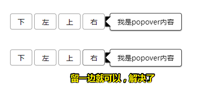
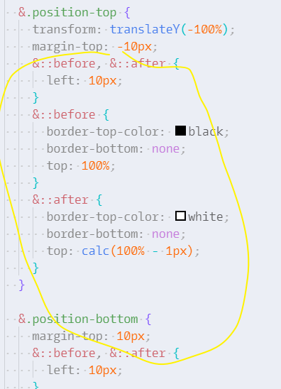
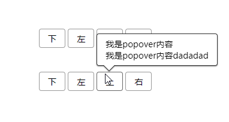
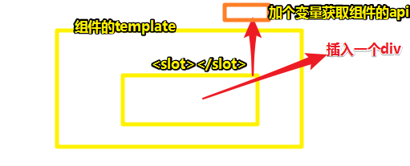
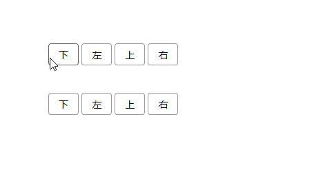

# 简单轮子：Popover 组件（下）

## ★popover测试用例

### ◇一个抖动bug


引起原因：

黑色区域都是body的儿子，而不是button的儿子，所以当用户移到黑色块的时候，就相当于移出按钮了！此时popover浮层隐藏了，但是又回到button元素身上，所以又会显示，然后又隐藏，又显示……所以就抖动、鬼畜了！

解决它：



关于这坨CSS代码，可以用scss遍历生成，但是只有4次，就觉得没有必要了：




### ◇mouseleave（hover）

> 可以去做，也可以不去做，毕竟我们只是个简单的组件，不想搞得太复杂！

1. 当鼠标指针离开元素某个元素区域时，会触发为mouseleave搞的callback
2. 该callback是关闭popover浮层
3. popover浮层消失的时间太快了，我们需要让它慢点，好让当鼠标指针移动popover浮层时它不会消失
4. popover如果是hover状态的话，那么它的open和close是不同于click的！

> 思路（解决即便button与popover浮层之间有空隙也能跳过去！）：
>
> 1. 设置一个时间，比如200ms内就去隐藏popover浮层
> 2. 一旦在200ms内移入popover浮层，那就把这200ms给取消掉！
>
> 总之，这类似于一个防抖的功能！




### ◇让popover浮层支持HTML

默认就支持，因为我们我们是往slot里边填内容的！如可以添加`g-button`按钮

目前动画先不做，之后再做！

### ◇从浮层内关闭浮层

> 一个不是那么流行，但很容易的方法

做法是：传一个API进来，然后给button元素自己调用！

我们在用 `<slot></slot>`的时候，是想让用户传东西给插槽！那么我们插入的东西，能不能获取到插槽传回来的内容呢？

这是可以的哈！



做法：

```html
<slot name="content" :close="close"></slot>
```

注意得是得加冒号呀！不然 `close`这个值就是字符串了

可见，组件内部可以把组件的API传给插槽！

那么插槽如何获取这个close API  呢？

```html
<template slot="content" slot-scope="{close}">
	<g-button @click="close">关闭</g-button>
</template>
```

直接用解构语法拿到一个对象close属性值，而这个close变量就是我们的close方法！

总之，`slot-scope`这个API是一个非常好用的，用于把组件内部的东西暴露给插槽的一个方法！

不过，这种方法虽然很方便，但是不那么好，之后会讲更好的方法！



## ★测试

我们这样写：

```HTML
<g-popover position="bottom" ref="a">
  <template slot="content">
		弹出内容
  </template>
  <button>点我</button>
</g-popover>
```

可以这样拿到popover组件！这是在使用的过程中拿到的，而不是在 `popover.vue`里边所定义的！

在写测试用例的过程中，你会不断地 修修改改，但是请你不要放弃，继续写，因为一旦你放弃了测试用例的代码，那么你整个代码的质量真得就无法保证了！

用JavaScript代码自定义事件触发，而不是UI交互手动触发：

➹： [demo](./demo/10/04-自定义事件触发.html)

关于 `xit`表示，我们跳过了一个组件的测试，因为我们现在没有找到方法去测试它！再加上，我们需要赶时间去搞下个组件，所以目前，先放弃它！

当然，我们手动通过鼠标测试通过了，其实也差不多得了！

> 我们在工作时也是同写这个不会的测试用例一样！
>
> 如果你发现有个东西一直在挡着你，那么你就给自己规定一个时间，如果这个时间之内还未解决，即过去不了的话，那么就先留着呗！反正这个东西也不是特别重要！

之后，会完善它，如加点动画什么的！


## ★总结

- 一般把props写在data上边！

## ★Q&A

### ①元素被移除了，那么还有事件绑定吗？

肯定没有了呀！