# 简单轮子：手风琴组件

## ★课程简介

手风琴组件

代码：

`Collapse` <https://github.com/FrankFang/frank-test-1/blob/callapse/src/collapse.vue>

`CollapseItem` <https://github.com/FrankFang/frank-test-1/blob/callapse/src/collapse-item.vue>

`test` <https://github.com/FrankFang/frank-test-1/blob/callapse/test/collapse.test.js>


UI： <https://www.yuque.com/u29422/gulu/268969>

## ★简单介绍

### ◇功能是怎样的

可以折叠/展开的内容区域。它也被称作 Collapse 折叠面板：

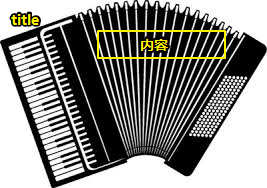

可见，因为该组件有着折叠展开的调调（琴键这块区域就是title啦！而像纸扇子那部分就是展开的内容啦！），所以才叫它手风琴组件

### ◇何时使用它

- 对复杂区域进行分组和隐藏，保持页面的整洁。
- `手风琴` 是一种特殊的折叠面板，只允许单个内容区域展开。

### ◇常见使用场景

- 搜索某个中文词语的意思：

  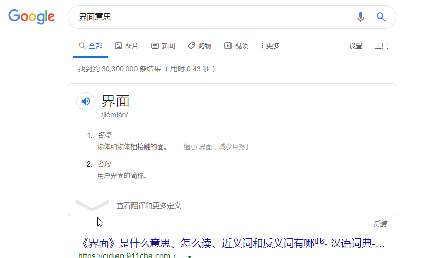

- ……

## ★创建手风琴组件

### ◇collapse 的 基本样式 和 基本功能

- 注意点：
  - 为了让样式更直观，请放大网页到200%，而不是150%、250%；200%这个倍数，边框的显示才是正确的！
  - 边框线的合并需要注意一下！
  - 话说，用 `v-show`会不会好点？如果用 `v-show`的话，样式又得改一下了，而且 `:last-child`的妙用就无法体现出来了！
- API 设计：

```html
<g-collapse>
  <g-collapse-item title="标题1">内容1</g-collapse-item>
  <g-collapse-item title="标题2">内容2</g-collapse-item>
  <g-collapse-item title="标题3">内容3</g-collapse-item>
</g-collapse>
```

- 功能：

  - 点开一个title，显示一个内容；注意，这是可以同时打开多个内容的！

- 思路：

  - 点击title，意味着创建了一个DOM元素，再次点击title，意味着一个DOM元素被移除了
  - 样式参照[ant-design](https://ant.design/components/collapse-cn/)的，注意 `:last-child`这个伪类的巧妙运用！

- 效果：

  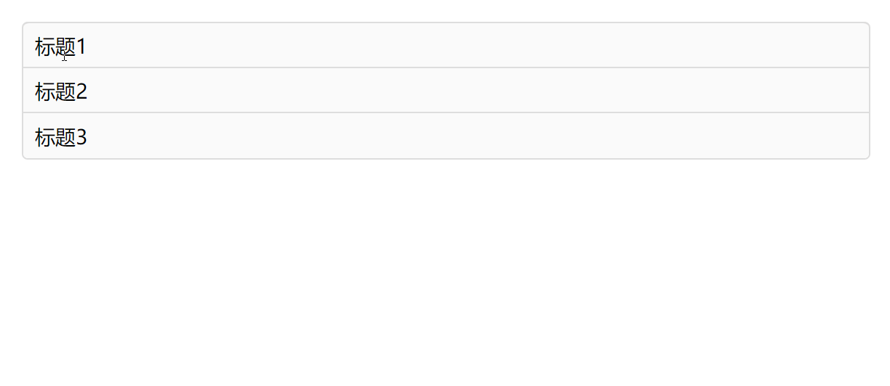

### ◇添加 single 选项

- API如下：

```html
  <div id="app">
    <g-collapse single>
      <g-collapse-item title="标题1">内容1</g-collapse-item>
      <g-collapse-item title="标题2">内容2</g-collapse-item>
      <g-collapse-item title="标题3">内容3</g-collapse-item>
    </g-collapse>
  </div>
```

- 思路：
  - 用户写了个`single`的属性
  - 有个 `collapse-item`被点击了，那么就通知 事件中心，告知其它 `collapse-item`折叠起来！而被点击的，就展开呗！
  - 用到了 `eventBus`，而这是在 `collapse`里边注册的事件中心，用于通知兄弟组件们某个`collapse-item`被点击了

- 效果：

  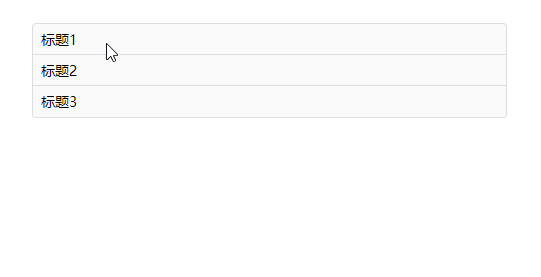

### ◇可以设置默认 selected

- API如下：

```html
  <div id="app">
    <g-collapse :selected.sync="selectedTab">
      <g-collapse-item title="标题1" name="1">内容1</g-collapse-item>
      <g-collapse-item title="标题2" name="2">内容2</g-collapse-item>
      <g-collapse-item title="标题3" name="3">内容3</g-collapse-item>
    </g-collapse>
    {{selectedTab}}
  </div>
```

- 思路

  - `selectedTab`的默认值是 字符串`‘2’`，而这意味着默认展开的是 `内容2`，其余的都是折叠状态！
  - `collapse`的`selected`这个prop与根组件，即`#app`的 `selectedTab`是双向绑定的
  - `name`这个prop的作用，给每个 `collapse-item`起个名字，保证点开一个item，其它的item就会关闭，即处理`single`属性的逻辑！而且该prop同title一样，都是必填的！

- 效果：

  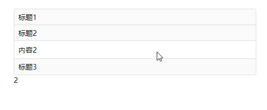

  默认展示就是第二个item，不过这里有个bug，那就是，点击其它item的时候，根组件的 `selectedTab`值没有任何变化！照理说，就是你点击第一个，那么显示的就是 `1`啊！

### ◇selected 改为数组

- 注意点
  - 数组元素可以是变量！
  - `let selectedCopy = JSON.parse(JSON.stringify(this.selected))`，之所以这样写是因为， Vue 不支持我们直接更改 `selected`这个prop！
  - 这是在  `collapse`写的代码： `this.eventBus.$emit('update:selected',selectedCopy)`。儿子们有通过 `eventBus`来 监听 `update:selected`这个事件，而这从形式来看就是父组件通知儿子们更新！这像是父子通信，但这是用 `eventBus`来实现父组件对多个儿子的通信！而通过props那种形式的通信，显然不能做到异步编程！即那是固定死的通信！

- API如下：

```html
 <div id="app">
    <g-collapse :selected.sync="selectedTab" single>
      <g-collapse-item title="标题1" name="1">内容1</g-collapse-item>
      <g-collapse-item title="标题2" name="2">内容2</g-collapse-item>
      <g-collapse-item title="标题3" name="3">内容3</g-collapse-item>
    </g-collapse>
    {{selectedTab}}
  </div>
```

- 我发觉自己只是明白代码是怎么走的！具体为啥会走到这一步，我觉得这就很考验功力了！讲真，看懂源码与手撸一个轮子根本不是一回事！

- 思路：

  - 默认打开两个item，如1和2
  - 点开第3个，那就把1和2给折叠了，然后 `selectedTab`的值就是 `[3]`
  - 点开第3个item，就会触发click事件，执行toggle这个callback，该callback判断当前item的open状态，显然是false啦，既然是false，那就让`eventBus`触发 `update:addSelected`事件，并把 `3`这个值，传给了在父组件 `collapse`里边通过`eventBus`订阅的callback，该callback拿到`3`这个值，首先得深拷贝一下 `selected`这个数组，不然 ，`selectedTab` 不会响应式更新！接着判断 `collapse`组件是否有single这个状态，如果有的话，那就 `selectedCopy=[3]`，接着触发`eventBus`监听的 `update:selected`事件，每个item都拿到了  `[3]`这个值，然后判断一下自己的name值，是否在 `[3]`里边，如果不是，那item就把自己 的 `open`状态改为false呗！接着还得让 `collapse`通知根组件去更新 `selectedTab`的值！

  - 关闭的操作的逻辑大致同上！

- 效果：

  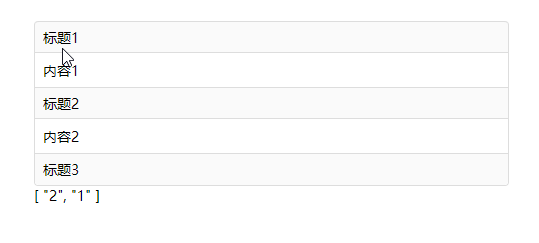

  默认展开1和2，点击任意一个item，都会关闭其它item！

---


## ★总结

- 以怎样的视角去看待这个手风琴组件：可以把Collapse看做是`ul`，而CollapseItem则是`li`。在看这节内容的时候，我刚好看了芳芳的 React 入门课，在这节课我了解到了，组件就是可组合的东西， React 写一个DOM很简单，操作DOM的姿势是原生的，而 Vue 用的是指令呀！ React 添加props很简单，构成一个函数组件即可！至此，我可以把我们写的一个个 `.vue`文件看做是一个个函数，其中props就是形参，即需要接收外边写在自定义标签身上的属性，而data看做是 React 的useState，data它维护了组件的状态，就像是一个局部变量一样！不管怎么说， React 真得很简洁，如语法简洁等，而 Vue 则是有很多约定，如方法需要写在`methods`、在某个组件里边使用xx组件需要注册xx组件等等……我们需要在 `#app`这个root组件里边注册两个组件 `Collapse`和 `CollapseItem`，才能使用这些组件，而 React 很多时候可以把多个组件都写在一起！反正都是函数组件，而 Vue 则是单文件组件！

  总之， React 就是 JS in HTML，而 Vue 则是搞点指令、变量、表达式、单行语句在HTML上。

- 主动去提一个问题比人家给你一个问题要好得多！

- 不管你在思考问题的时候，还是在做什么的时候，你的脑海都得有个大局观才行，不然你很容易迷失在细节里里边，然后就会不知道自己到底想解决啥问题，到底想做什么，到底想要什么结果！

- 我把代码抄了一份，那么接下来就是想想着我们刚刚抄的代码做了什么，最好是分解一下步骤来理解！

  参考：[The Vue Instance - Intro to Vue.js - Vue Mastery](https://www.vuemastery.com/courses/intro-to-vue-js/vue-instance/)

  这个国外视频是如何学习 Vue 的

- 看视频之 「**单枝阅读**」法：

  **1. 这件事与我有什么干系？**（干，第一声）

  **2.作者是如何得到这个论点的？**

  **3.作者又是如何论证的？**

  **4.接受了作者的观点，会引发什么后果（有什么可能的好处和坏处）？**

  总结起来就是四个字：干、得、证、果。

  为啥要看看芳芳的手风琴组件？——为了完成学习任务，然后面试时总得有点亮点吧！

  芳芳这个组件是怎么完成的？其中涉及到某个功能是怎么做到的？——分析逻辑，自己去实现呗！

  芳芳在讲个组件的过程中，说到了一些思想？如单向数据流，那么我需要记住这个点吗？——好处？坏处？

  ➹：[超强的学习能力是怎样练就的？ - 黛西巫巫的回答 - 知乎](https://www.zhihu.com/question/35103080/answer/804116827)

- 对数据操作的控制，不要在多个地方去操作这个`open`状态（如果多了的话，那么你就不知道谁在操作这个 `open`了，总之，你在一个地方操作就好了）！如我们直接把这个状态交给父组件来操控！父组件说关闭就关闭，说打开就打开，而不是子组件维护自己的关闭和打开：

  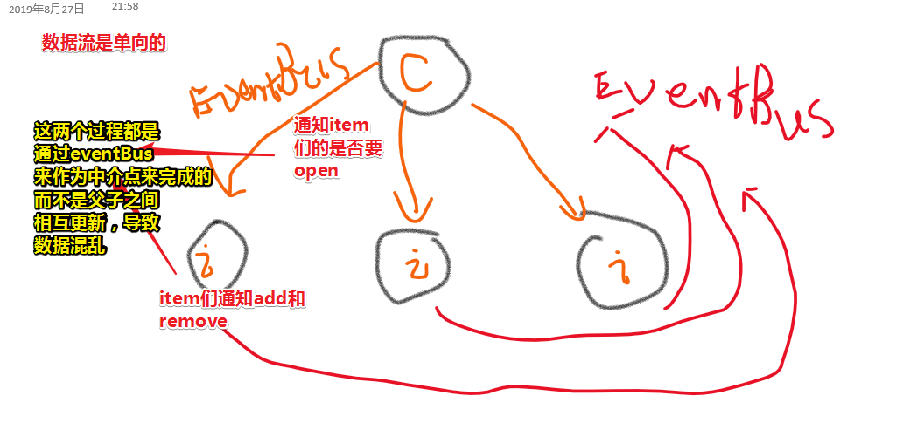

  用一张发布订阅模式的图概括一下：

  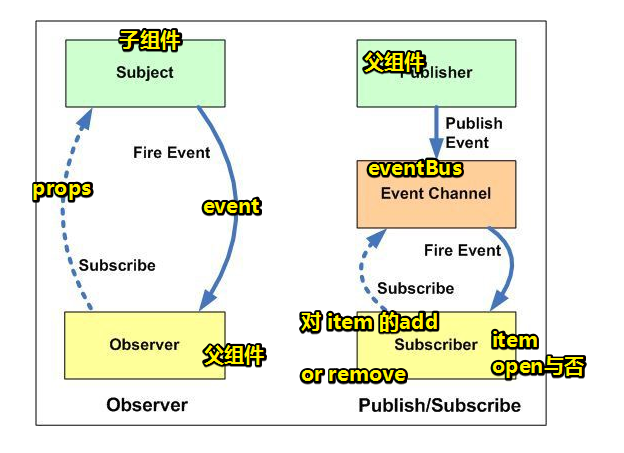

  我发觉手风琴组件对这个设计模式的理解是很好的！

  总之，我们的主要目的就是要更新open的状态！至于，怎么更新就要看你是如何搞事件处理的了！

## ★Q&A

### ①单向数据流？.sync？v-model？

> 引子：这个手风琴组价用到了这个设计模式

1. prop 是单向绑定的：当父组件的属性变化时，将传导给子组件，但是不会反过来。这是为了防止子组件无意修改了父组件的状态——这会让应用的数据流难以理解。（可以使用自定义事件，子父通信）

2. 每次父组件更新时，子组件的所有 prop 都会更新为最新值。这意味着你**不应该在子组件内部改变 prop** 。如果你这么做了，Vue 会在控制台给出警告。 如子组件其中的一个props为 `msg`，那么该子组件里边就不能有 `this.msg = 0`这样的代码，我们知道写好一个函数，其中有这么一条原则，那就是不能直接改传过来的实参：

   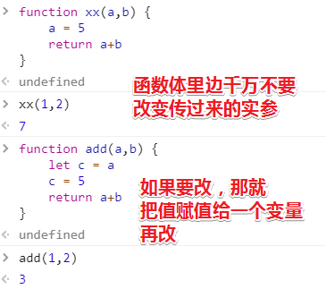

   所以，如果你打算让子组件自己改变父组件传过来的值的话，那么就声明一个`data: {xxx: this.msg}`，类似于上图里边的把一个值赋值给另外一个值，然后你就可以在该子组件里边 `this.xxx = ‘666’`这样修改值了！

   需要注意的是，`this.msg`的值即便发生了更新，`this.xxx`也不会更新，说白了，这是一次性的，赋值一次，就是一生一次copy的值！

   如果想要响应式更新？那么可以computed和watch！

3. 为啥使用 `.sync`的时候，都会用到 `update:xxx`，因为 你剥开`.sync`这个语法糖，你就发现，`@update:xxx`里边的 `update:xxx`就是自定义事件名呀！可以看到事件名 不是 烤肉串拼写发！还有就是，`xxx`一般都是`props`，即写在自定义组件标签上的 `xxx`属性！而使用这种操作，真得就是为了一个简简单的赋值，即儿子要改变传过来的 `xxx`值！进而修改了父组件的状态！这里边不涉及复杂的逻辑，就只是存粹的赋值操作，即改变组件的状态！

4. `v-model`是糖，在原生HTML上使用，如input标签，就是把往`input`里边输入的值交给了当前组件范围区域内的某个状态值！如果你要在自定义组件标签上使用，那么你的自己封装一个  `v-model`，原理很简单，就是简单的子父通信罢了！UI层拿到组件的状态值，在UI层更新组件的状态，进而实现双向绑定！上边第3点是父组件的某个状态值和子组件的某个`props`值的双向绑定！

5. 关于 `$event`：

```html
<g-c6 :msg.sync="appMsg1"></g-c6>
<g-c6 :msg="appMsg1" @update:msg="val => appMsg1 = val"></g-c6>
<g-c6 :msg="appMsg1" @update:msg="appMsg1 = $event"></g-c6>
```

这3行代码是等价的 ，`$event`是个实参，这是 `this.$emit('update:msg', 'hi！这是C6对#app打招呼', 'xx')`的第一个参数值，很多时候，我们会在原生标签上使用它，如：

```html
<button v-on:click="warn('Form cannot be submitted yet.', $event)">
	Submit
</button>
```

```js
// ...
methods: {
  warn: function (message, event) {
    // 现在我们可以访问原生事件对象
    if (event) event.preventDefault()
    alert(message)
  }
}
```

此时的 `$event`就是原生事件对象啦！

> 我突然明白 5w2h 分析法中的 who 的意义，谁在用，即上下文是谁，而不同的上下文，同一个东西，所代表的含义是不同的！
>
> 如 `$event`在原生标签上的 `@click`上用，点击button就会传两个参数调用warn这个callback
>
> 而在自定义组件标签上用，那就是子组件触发 `update:msg`事件时，传给父组件的callback执行的第一个参数！

测试：[详解sync](./demo/11/03-再看v-model和sync.html)、[v-mode](./demo/11/02-sync和v-model.html)

所以 `.sync`和 `v-model`的区别？

> **两者的本质都是语法糖，目的都是实现组件与外部数据的双向绑定。v-model 是 .sync的一种体现。.sync 比较灵活；v-model较单一**
>
> 如 `v-model` 双向绑定的是如value、checked等属性，而`.sync` 可以双向绑定子组件的任何prop属性
>
> 原理：
>
> `sync`和`v-model` 都是通过prop把外部数据下发到组件，组件再通过event把内部发生变化的数据回传回去。

总之，我们想要子组件修改父组件状态，是通过子组件间接触发父组件的方法，然后进行修改的，说白了父组件的状态变化是在父组件内部完成的，然后形式上，是子组件改变了父组件的状态！

➹：[双向绑定 - 廖雪峰的官方网站](https://www.liaoxuefeng.com/wiki/1022910821149312/1109527162256416)

➹：[★【vue】组件的使用（2）Prop依赖，以及.sync用法 · Issue #18 · Kelichao/vue.js.2.0](https://github.com/Kelichao/vue.js.2.0/issues/18)

➹：[表单输入绑定 — Vue.js](https://cn.vuejs.org/v2/guide/forms.html#%E5%9C%A8%E7%BB%84%E4%BB%B6%E4%B8%8A%E4%BD%BF%E7%94%A8-v-model)

➹：[Vue使用.sync 实现父子组件的双向绑定数据 - 简书](https://www.jianshu.com/p/bf3bc4a9cd0d)

➹：[vue.js - 奇怪的 event 对象 - 简书](https://www.jianshu.com/p/b078cfe97c92)

➹：[vue.js - How to write vue .sync in javascript - Stack Overflow](https://stackoverflow.com/questions/50041991/how-to-write-vue-sync-in-javascript)

➹：[vue sync 修饰符 - 掘金](https://juejin.im/post/5b6afe9e5188251b1f228666)

➹：[★javascript - 什么时候用组件的.sync修饰符，什么时候用自定义组件的v-model，两者有什么区别？ - SegmentFault 思否](https://segmentfault.com/q/1010000014636044)

➹：[★自定义事件 — Vue.js](https://cn.vuejs.org/v2/guide/components-custom-events.html#sync-%E4%BF%AE%E9%A5%B0%E7%AC%A6)

### ②UI 控件是啥？

比如按钮、输入框、分页等

说白了就是我们写的UI组件，毕竟控件是组件的一种，全称叫“控制组件”，而且控件一定有UI外型，一定看得到

➹：[iOS - - UI控件基本介绍 - 简书](https://www.jianshu.com/p/fa633f5bd368)

➹：[控件与组件的区别 - btwsmile's blog - CSDN博客](https://blog.csdn.net/ixsea/article/details/6658220)

➹：[这4个最常见的 UI 组件，给你总结了这份使用指南 - 优设网 - UISDC](https://www.uisdc.com/4-common-ui-component-guides)

### ③应用软件界面结构和源码目录结构？

> 界面：
>
> - *名词*，物体和物体相接触的面。 「缩小 界面，减少摩擦」
> - *名词*，用户界面的简称。

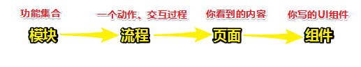

打开微信这个软件，你会看到有「微信」、「通讯录」、「发现」、「我」这四个大模块

拿「发现」这个模块来说，它里边还有小模块，如「朋友圈」、「扫一扫」、「摇一摇」等

每个模块都有各自的功能集合！

关于流程，可以理解为一个动作，如「我要发朋友圈」这个动作，该怎么做呢？

点开朋友圈，点开那个照相机按钮，上传一张图片，配上一些文本内容，然后点击发表，就可以看到朋友圈里边有你刚刚发的消息了！

关于页面，你在朋友圈里边看到的内容就是整个页面！

关于组件，你在朋友圈里边看到的「照相机」可以认为是个上传组件，看到的头像是个头像组件，看到一个朋友的动态，那就是信息列表组件啦！

作为前端开发者，在做工程化的时候，都得模块化开发，如开发一个 Vue 项目，一个单文件组件可以看做是一个模块，对组件的交互可看做是个流程，一个动作！

➹：[应用软件界面结构和源码目录结构 - 简书](https://www.jianshu.com/p/a48594fb3a74)

➹：[Vue项目组织规范 - 简书](https://www.jianshu.com/p/75cf57e53451)

➹：[「介面」和「界面」有什么区别？ - 知乎](https://www.zhihu.com/question/19905127)

### ④约定优于配置？

> 首先 **约定>配置** 不是什么**程序语言**，只是一种方式。
>
> 约定，什么是约定？男生上左边的厕所，女生上右边的厕所，然后按照男左女右的默认约定给厕所配置挂牌。约定就是当没有做任何设置的时候，按照常规的默认设置。
>
> 配置，什么是配置？每次上厕所前，先配置左边的到底是男厕所还是女侧...
>
> 约定大于配置，就是尽量按照**常规**做好默认设置，而不是没有任何设置，必需手动配置方可运行。
>
> 不是说约定就没有配置，约定只是给定了**常规默认设置**而已，可以进行修改配置。
>
> 对于新手，使用默认设置可以快速上手，降低难度。对于熟手，可以调整各类配置，更适应自己的独特需求。

 Vue 给我的赶脚就是约定优于配置！

➹：[如何评价“约定优于配置”的程序语言? - 知乎](https://www.zhihu.com/question/47239663)

### ⑤关于 Vue 的template元素？

平时使用template元素：

```html
  <template id="tem">
    <div id="app">
      <h1 id="title">hello world!</h1>
    </div>
  </template>
  <script type="text/javascript">
    var tem = document.getElementById("tem");//获取template标签
    console.log(tem);
    console.log(tem.innerHTML);  //string类型的返回值
    var title = tem.content.getElementById("title"); //在template标签内部内容，必须要用.content属性才可以访问到
    console.log(title);
  </script>
```

结果页面一片空白，而log的结果是这样的：

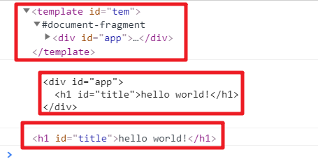

为啥页面看不到内容呢？因为`template`元素的 `display`属性值为 `none`啊！ 布局树上不会出现 `display:none`的元素！

---

关于render树：

> render 树是 HTML 文档的可视化表现，是由可视化元素按顺序展示组成的。换句话说 render 树和 DOM 树上的节点并非一一对应的，那这里有两个概念：可视化元素和非可视化元素。
>
> **非可视化元素**：或是`<head>`元素、或是样式`display:none`的元素。 **可视化元素**：大多数标签，大多数样式，特别说明 `visibility:hidden`也是。

简单了解一下各种树的构建：

1. 处理 HTML 标记并构建 DOM 树。
2. 处理 CSS 标记并构建 CSSOM 树。
3. 将 DOM 与 CSSOM 合并成一个渲染树。
4. 根据渲染树来布局，以计算每个节点的几何信息。
5. 将各个节点绘制到屏幕上。

---

言归正传，template元素的存在意义是啥？或者说它是为了解决什么问题而出现的

> HTML `template` 元素是一种用于保存客户端内容的机制，该内容在页面加载时不被渲染，但可以在运行时使用 JavaScript 进行实例化。
>
> 可以将一个模板视为正在被存储**以供随后在文档中使用的一个内容片段**。
>
> 虽然, 在加载页面的同时,解析器确实处理 `template`元素的内容，这样做只是确保这些内容是有效的; 然而,元素的内容不会被渲染。

说白了就是可以让我把需要进行大量重排和重绘的操作扔到template里边去了，然后通过 JS 一次性创建它们，扔到页面里边显示它们！

在  `.vue`里边使用template：

```vue
<template>
  <div class="collapse">
    <slot></slot>
  </div>
</template>
```

这里最外层template表示api里的`template: '字符串模板'`

如果内存写了template，那么就是要配合`v-if`，`v-for`做分组使用的

比如说：

```html
<div v-if="show">hi</div>
```

这只能显示控制一个元素是否显示

如果你想切换多个元素，那么你可以把一个 `<template>` 元素当做不可见的包裹元素，并在上面使用 `v-if`。最终的渲染结果将不包含 `<template>` 元素。

```html
<template v-if="ok">
  <h1>Title</h1>
  <p>Paragraph 1</p>
  <p>Paragraph 2</p>
</template>
```


➹：[渲染树-理论剖析 - 掘金](https://juejin.im/post/5c6d3d4df265da2dd218c584)

➹：[`template`：内容模板元素 - HTML（超文本标记语言） - MDN](https://developer.mozilla.org/zh-CN/docs/Web/HTML/Element/template)

➹：[HTML5 `template` 标签元素简介 « 张鑫旭-鑫空间-鑫生活](https://www.zhangxinxu.com/wordpress/2014/07/hello-html5-template-tag/)

➹：[API — Vue.js](https://cn.vuejs.org/v2/api/index.html#template)

➹：[条件渲染 — Vue.js](https://cn.vuejs.org/v2/guide/conditional.html#%E5%9C%A8-lt-template-gt-%E5%85%83%E7%B4%A0%E4%B8%8A%E4%BD%BF%E7%94%A8-v-if-%E6%9D%A1%E4%BB%B6%E6%B8%B2%E6%9F%93%E5%88%86%E7%BB%84)

➹：[列表渲染 — Vue.js](https://cn.vuejs.org/v2/guide/list.html#%E5%9C%A8-lt-template-gt-%E4%B8%8A%E4%BD%BF%E7%94%A8-v-for)

➹：[vue中的template标签 - u013594477的专栏 - CSDN博客](https://blog.csdn.net/u013594477/article/details/80774483)

➹：[Vue中v-if和v-show的使用场景 - 知乎](https://zhuanlan.zhihu.com/p/38179618)

➹：[documentFragment和template - 简书](https://www.jianshu.com/p/ebe8e26076dc)

➹：[DocumentFragment 的优化小知识 - 掘金](https://juejin.im/post/590f4eadac502e006cf718c3)

➹：[前端面试题-display:none和visibility:hidden的区别 - 前端の进行时 - SegmentFault 思否](https://segmentfault.com/a/1190000013929168)

➹：[vue.js - template标签在vue组件中扮演怎样的角色？ - SegmentFault 思否](https://segmentfault.com/q/1010000013916280)

### ⑥回流（reflow）和 重绘（repaint）?

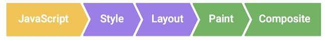


来自若愚老师的总结：

> repaint： 可以把屏幕当成一幅画，只要显示的东西变了就需要重新画一次
>
> reflow: 重新计算位置大小等，重在“计算”，比如加了margin，元素位置都变了，需要重新计算一次。 当然也需要重新画一次

自己的总结：

> reflow，render树到布局树的过程，这是需要计算的
>
> repaint，布局树到渲染到页面的过程！根据给出的数据，依葫芦画瓢直接画就好了！

有这样一个问题，能否「根据子元素的 特定class 写父元素的样式吗?」

这种姿势，css不支持，未来也不会支持，因为这样会在渲染的时候造成极大的性能消耗。毕竟假如爸爸样式改变了，那么继承自爸爸的样式的儿子们，样式也会改变，既然样式改变了，假如这样式涉及计算方面的，那么就会造成极大的重排重绘

➹：[CSS Triggers](https://csstriggers.com/)

➹：[网页性能管理详解 - 阮一峰的网络日志](https://www.ruanyifeng.com/blog/2015/09/web-page-performance-in-depth.html)

### ⑦chrome浏览器开发者的 Elements面板的内容是DOM树吗？

CSS实际上时如何工作的？

当浏览器显示文档时，它必须将文档的内容与其样式信息结合。它分两个阶段处理文档：

1. 浏览器将 [HTML](https://developer.mozilla.org/en-US/docs/Glossary/HTML) 和 [CSS](https://developer.mozilla.org/en-US/docs/Glossary/CSS) 转化成 [DOM](https://developer.mozilla.org/en-US/docs/Glossary/DOM) （*文档对象模型*）。DOM在计算机内存中表示文档。它把文档内容和其样式结合在一起。
2. 浏览器显示 DOM 的内容。


所以说Elements面板的内容就是DOM树咯！或者应该是DOM树和CSSOM树结合的render树

对于 `display:none;`的元素，我们可以在render树里边看到，但是在布局树（计算最终CSS样式才会构建布局树）里边是看不到的。

一般而言：

> 一个DOM节点得到一个LayoutObject。但是有时候LayoutObject没有节点，或者节点没有LayoutObject。
>
> 一个节点甚至可以拥有多个LayoutObject。
>
> DOM节点大多与布局对象1:1，但也有一些例外。如这个元素是 `display:none`、或者这伪元素就没有DOM节点！

总之，就是元素是 `display:none;`的，那么它就是咩有布局对象，没有布局对象，那么在页面就会看不到！伪元素没有DOM节点，用个 `::before`之类表示的，但是我们通过样式计算，是能够在布局树里边生成一个布局对象，因此它是在页面可见的！

所以，当你在看Elements面板的内容时，发现，明明有这个DOM，但是页面就是不显示它，那么很有可能就是样式的问题了！

补充，head元素的display为none，而html元素和body元素都是block！说白了，head元素就是非可视化元素

➹：[编辑样式以及 DOM - Chrome 开发者工具教程 - W3xue.com](https://www.w3xue.com/soft/chromef12/chromef12-edit-cssdom.html)

➹：[CSS如何工作 - 学习 Web 开发 - MDN](https://developer.mozilla.org/zh-CN/docs/Learn/CSS/Introduction_to_CSS/How_CSS_works)

➹：[Life of a Pixel - fe-learn-2018](https://ppambler.github.io/fe-learn-2018/Chrome/01-life-of-a-pixel.html#layout)

➹：[渲染树构建、布局及绘制  -  Web  -  Google Developers](https://developers.google.com/web/fundamentals/performance/critical-rendering-path/render-tree-construction)

➹：[深入浅出动画帧 - 三羊的小站](https://snayan.github.io/post/2019/in_depth_animation_frame/)

### ⑧ `el:last-child`的用法？

`:last-child`有「且」的含义吗？

如果一个元素的结构是这样的：

```html
<div> 
  <p></p>
</div>

<style>
  div > p:last-child {
   	color: red;
  }
</style>
```

p元素是div的最后一个儿子吧！那么 `div > p:last-child`就会匹配

假如结构是这样的呢？

```html
<div> 
  <p></p>
  <div></div>
</div>
```

那还会匹配吗？

不会呀！

言归正传，它的用法如下：

`el:last-child` 的匹配规则是：

第一步，查找 el 选择器匹配元素的所有同级元素（siblings）；（查找p元素的所有同级元素，即这个div元素）

第二步，在同级元素中查找最后一个元素；（找到了div元素）

第三步，检验最后一个元素是否与选择器 el 匹配。（div元素不等于p元素，所以 `div > p:last-child`就不会被匹配到）

总之，`:last-child`选择器用来匹配父元素中最后一个子元素。（关键在于，元素是最后一个的，而不是同类型元素的最后一个！）

而且，`p:last-child`等同于`p:nth-last-child(1)`

➹：[CSS3 :last-child 选择器 - 菜鸟教程](https://www.runoob.com/cssref/sel-last-child.html)

➹：[css - 为什么选择器:last-child没有起作用? - SegmentFault 思否](https://segmentfault.com/q/1010000011647969)

➹：[:last-child - CSS（层叠样式表） - MDN](https://developer.mozilla.org/zh-CN/docs/Web/CSS/:last-child)

### ⑨爷孙通信呀？

我在 `collapse`写了个 `eventBus`，然后测试一下该事件中心能否在 根组件 `inject`一下，结果不行呀！，只有在 `collapse` 的子组件 （如`collapse-item`）或后代子组件里边 才能 `inject`一下！

➹：[vue篇之事件总线（EventBus） - 掘金](https://juejin.im/post/5bb355dae51d450ea4020b42)

### ⑩自定义事件？

写原生事件时是这样的 `@click`，那么自定义事件就是 `v-on:my-event`

为啥自定义事件名是 `kebab-case`，即烤肉串拼写法呢？——因为：

1. 不同于组件和 prop，事件名不会被用作一个 JavaScript 变量名或属性名，所以就没有理由使用 camelCase 或 PascalCase 了
2. `v-on` 事件监听器在 DOM 模板中会被自动转换为全小写 (因为 HTML 是大小写不敏感的)，所以 `v-on:myEvent` 将会变成 `v-on:myevent`——导致 `myEvent` 不可能被监听到。

所以推荐你**始终使用 kebab-case 的事件名**。

> 在 React 里边是`onClick`


### ⑪驼峰拼写法（CamelCase）？

是什么？

> 在英语中，依靠单词的大小写拼写复合词的做法，叫做"骆驼拼写法"（CamelCase）。比如，backColor这个复合词，color的第一个字母采用大写。

什么时候用？

> 这种拼写法**在正规的英语中是不允许的**，但是**在编程语言和商业活动中却大量使用**。比如，sony公司的畅销游戏机PlayStation，play和station两个词的词首字母都是大写的。

为啥叫这个名字？

> 它之所以被叫做"骆驼拼写法"，是因为大小写的区分使得复合词呈现"块状"（bump），看上去就像骆驼的驼峰（hump）。

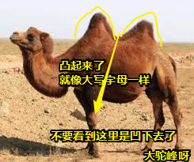

How？

> "骆驼拼写法"又分为两种。第一个词的首字母小写，后面每个词的首字母大写，叫做"小骆驼拼写法"（lowerCamelCase）；第一个词的首字母，以及后面每个词的首字母都大写，叫做"大骆驼拼写法"（UpperCamelCase），又称"帕斯卡拼写法"（PascalCase）。

这种拼写法的流行时间？

> 这种拼写法真正流行，还是在80年代以后，那时正是计算机语言开始兴起的时候。**许多著名的计算机语言依靠单词不同的大小写来区分变量**。在计算机语言中，还有一种"匈牙利拼写法"（Hungarian Type Notation），变量中每个单词的首字母都大写，然后变量名的最前面再加一个小写字母，表示这个单词的数据类型。比如，iMyTestValue这个变量名，就表示它是一个整数变量（integer）。据说，微软公司最喜欢使用"匈牙利拼写法"。

学到了什么？

- 小驼峰：`smallCamel`，`camelCase`
- 大驼峰：`BigCamel`，也叫帕斯卡大法，`PascalCase`
- 匈牙利拼写发： `sOneString`

➹：[骆驼拼写法（CamelCase） - 阮一峰的网络日志](https://www.ruanyifeng.com/blog/2007/06/camelcase.html)

➹：[为什么骆驼背是凸的_百度知道](https://zhidao.baidu.com/question/174557745.html)

### ⑫单向数据流？

什么是组件的状态，状态这个词云里雾里的。具体指什么东西呢？是组件的某个属性，还是某个函数？

状态听起来抽象。

举个例子: 一个弹窗组件的状态有: **显示**和**隐藏**

抽象成数据

```js
state = {
  visible: true // 弹窗是否可见
}
```

然后 **View (视图) = fn(state)**

由状态改变视图，这是单向的，视图发生变化也不会改变状态

总之，状态即数据！

➹：[单向数据流和双向数据流 - 简书](https://www.jianshu.com/p/810464f1a576)

➹：[单向数据绑定和双向数据绑定的优缺点，适合什么场景？ - 知乎](https://www.zhihu.com/question/49964363)

➹：[★为什么前端react，vue框架都是单向数据流？ - 知乎](https://www.zhihu.com/question/315844790)

➹：[深入理解 Vue 单向数据流 - 前端 - 掘金](https://juejin.im/entry/59e8b8a8518825579d131e51)

➹：[★搞不懂“单向数据流” - CNode技术社区](https://cnodejs.org/topic/5b84f9a32a585e4e2f26ff64)

### ⑬ `background-color: lighten($grey, 8%);`？

> lighten() 和 darken() 两个函数都是围绕颜色的亮度值做调整的，其中 lighten() 函数会让颜色变得更亮，与之相反的 darken() 函数会让颜色变得更暗。这个亮度值可以是 0~1 之间，不过常用的一般都在 3%~20% 之间。

它们都是HSL函数，`$grey`的值为 `#ddd`，然后用了 `lighten`这样的函数之后，背景色从`#ddd`这样的颜色变成 `#f1f1f1`

➹：[HSL函数-lighten() ，Sass进阶篇教程-慕课网](https://www.imooc.com/code/8420)

➹：[你的网站可以一键变色吗？ - 知乎](https://zhuanlan.zhihu.com/p/29610065)


⑭⑮⑯⑰⑱⑲⑳