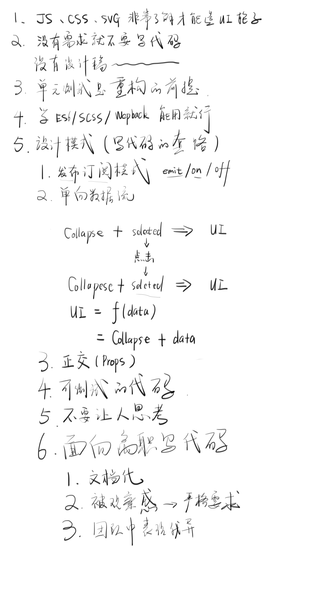
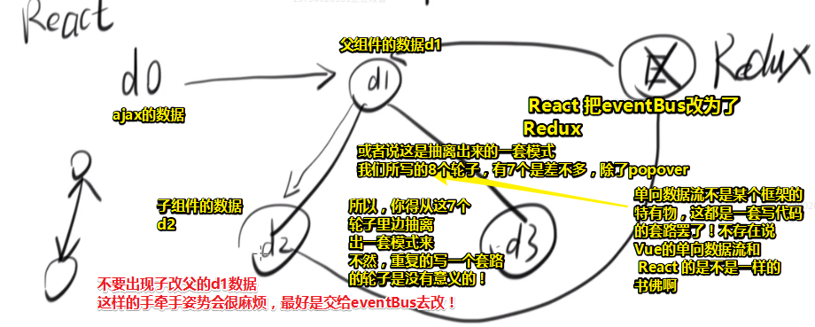
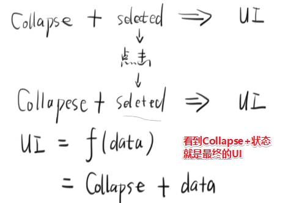
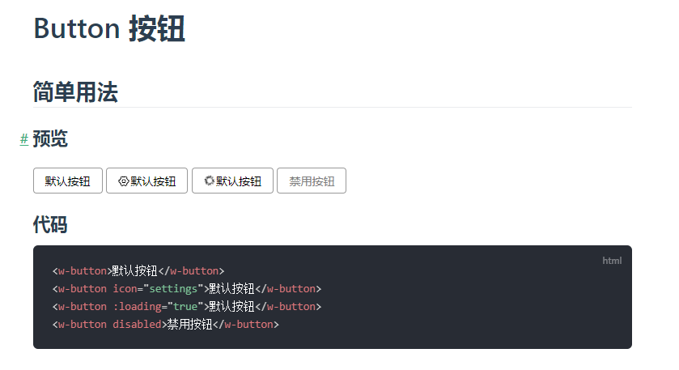
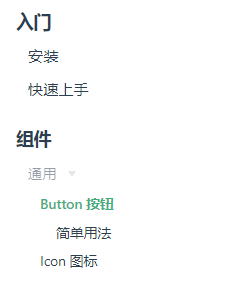
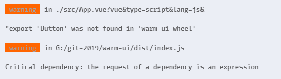

# 自制官网

## ★课程简介

1. Vue 造轮子的基本思路
2. 制作你的第一个官网

本次毕设就到这里了，做完这节课，你就应该可以创建一个自己的轮子的官网了。

问：`npx vuepress dev docs` 报错如何解决？

报错主要是因为 npm 比较傻逼，用 yarn 代替 npm 即可。

1. `rm -rf node_modules`
2. 搜 yarn ，找到官网，按说明安装 yarn（不要用 `npm i -g yarn` 来安装 yarn，因为 npm 傻逼）
3. `yarn install`
4. `npx vuepress dev docs` 不报错

## ★讲义

### ◇总结



### ◇官网

官网：<https://frankfang.github.io/frank-test-1/>

代码：<https://github.com/FrankFang/frank-test-1/blob/doc-1/deploy.sh>

## ★阶段性总结

- 简单轮子：CSS是大头；中级轮子：JS是大头；复杂轮子：适用范围广，需求复杂。

- 没有设计稿和没有需求就不要写代码啊！芳芳刚开始工作的头两年就吃了这个亏！如果xxx叫你写个移动端的页面，但是没有设计稿，那么你唯一要做的就是「不写」，因为不写就是最好的办法，如果非要写的话，那么你就只能加班修修改改了

- 有重写和重构，过一段时间去重构就是重写了！而重构是你写好每个功能都得要做一下的或者说你每天都得重构一下你今天所写的代码！关于单元测试，你写好了单元测试，那么就可以保证重构进行了！因为改了代码之后，还能保证原先功能代码的正常运行，那就没有改坏代码了呀！而且也不需要自己手动写测试代码再次去测试功能是否正常运行成功！

- 不管学什么，你得要记住核心功能，如学习 Vue，它的核心就是响应式等，而 vue-cli呢？只是工具，会用即可！还有在做这个简单的轮子过程中，涉及到的ES6、SCSS等知识，并不多，说白了，就是学会常用的几个就行了，就像芳芳学习 TypeScript 那样，先学习核心的、常用的，搞几个项目，那就可以说学会 TypeScript 了！不需要说这个东西的全部内容我都知道了，然后我才可以说我学会了这个东西！

- 设计模式

  - 发布订阅模式：只要eventBus满足`emit/on/off`这三个API，就可以用上这个模式，emit是**触发或者发布**一个东西，on是订阅一个东西，off则是取消订阅一个东西，一般 `off`这个API不太重要！何时用呢？一般当你需要一个中心化的事件处理器的时候就可以用了！如你平时上微博时关注一个人那就是订阅这个人了，当这个人有内容的时候，就会发布一个消息来通知你，然后你就可以收到该消息了！总之，发布订阅模式一定是有3个角色的，分别是发布者、订阅者、事件中心（eventBus/eventHub）。具体代码例子看参考Tabs组件和手风琴组件！

  - 单向数据流：拿手风琴组件来说，点击某个item，不是让自己改变自己的open的状态，而是通知爸爸去改变自己的open状态；虽然可以自己改变，但这会失去数据单向流的优势，即单向数据流，可以使得整个数据变得非常的简单！当你用到 React-Redux 的时候，你就会发现这很类似，如它有UI组件和容器组件，UI 组件负责 UI 的呈现，容器组件负责管理数据和逻辑。然后映射到我们手风琴组件就是儿子（`CollapseItem`）是UI组件，爸爸（`Collapse`）是容器组件 ！总之，我们在做复杂组件的时候，一定要尽量做到单向数据流，而不是多向数据流！

    

    注意：针对单向数据流的双向数据流，虽然有「双向绑定」的味道，但这不是我们学Vue时所认时的「双向绑定」。

    总之，组件越复杂越要用单向数据流，单向数据流是个抽象概念，不与任何框架挂钩！

    ➹：[Redux 入门教程（三）：React-Redux 的用法 - 阮一峰的网络日志](http://www.ruanyifeng.com/blog/2016/09/redux_tutorial_part_three_react-redux.html)

  - 正交（props），每个轮子的API之间是不会相互影响的！如果你设计的一个prop影响到了另一个prop，那么这个轮子就GG了，所以我们可以抄人家轮子的API，因为它们的API，必然是正交的！（这个模式很关键呀，因为我写代码时候经常性的怀疑，我这样写其它代码会不会受到影响？）

  - 可测试代码：有些代码不是为了业务逻辑的，而是方便我们写单元测试的，如需要某些标志找到某个元素，如`tabs-item`这个组件的 `<div :data-name="name"></div>`

  之后会遇到更多的设计模式，但是一旦遇到了设计模式，我希望你能条件反射到想到，这只不过是写代码的套路、写代码的总结，不要觉得，这很高大尚什么的！

- 其它的设计模式：

toast组件里边有这样一份代码，而这看起来会让觉得很多余：

```html
<div class="wrapper" :class="toastClasses"></div>
```

为啥不这样：

```html
<div class="wrapper" :class="{[`position-${this.position}`]: true}"></div>
```

而是看起来「多余」的这样（即使是一行，也要抽出成一个属性过来）：

```js
{
  computed: {
  	toastClasses() {
  		return {
  			[`position-${this.position}`]: true
  		}
    }
	}
}
```

而这个设计模式就是「不要让人思考」，可见这种模式与大众所知道的23种模式格格不入，但你想想「设计模式」即「写代码的套路」，所以叫它为设计模式也是非常正常的事儿。

 那么什么叫「不要让人思考」呢？

意思就是如果你把一个套路固定下来了，那么你就一直用这个套路，这样大家看你代码的时候，就能预测出你是怎样写代码的了！比如toast组件是这样写，那么其它xxx组件也得这样写！

而这其实也叫「面向离职写代码」

关于「面向离职写代码」它有很多好处：

芳芳曾经就是在某个公司面向离职写代码的！

在芳芳离开腾讯加入阿里之前，去了一个小团队，而当时芳芳进去的时候就知道，最多两年，肯定会离职的！因为，当时给自己定了一个目标，那就是在两年内「把自己提升很多！」

这个时候芳芳就已经是面向离职写代码了，于是就做了一下这么几件事情：

1. 所有东西文档化。

   文档化的意思是今天离职，明天就可以走了，为什么就可以走了呢？因为我所有重要的知识都写在文档上了，我把文档发给你或者把文档链接发给你，那么我就可以走了，而这就叫做「今天离职，明天就可以走」。而不是说离职的时候，再去整理之前代码的文档，而这样就很不好了！

2. 一种感——因为你要离职，所以你希望离职的时候，不要让代码那么难看。所以你一直会有一种被观察感！比如这单元测试很难写，能不能不写呀？此时，你就想想，明天的你就要离职了，还是要写一下吧！不然代码太烂会被吐槽的！总之，这就是让你给自己一个比较严格的要求！比如测试用例，那我就尽量做到80%的覆盖率，然后我的文档至少每个组件我都描述一下，因为有人要看呀！话说，难道不离职，就不这样干了吗？反正工作几年后，这代码又不是我维护，或者这代码一直是我维护的，不会忘记，那我就随便写一下呗！反正我记得，然而实际上，你一个星期之后，你这代码就看不懂了！总之「被观察感」以及「假设有一个人会看你代码」这个是非常重要的！

3. 由于是面向离职写代码，所以你不能让人有一种是觉得你是做得干不下去才走的感觉，如果你是干不下去才走的，那么你这样做就是在祈求公司留你，而不是面向离职写代码！既然你要走，那么你就得在你表现最后的时候走，这样就会让你在团队中有一种表现优异的感觉！芳芳当时就这样，给自己一个期限，然后逼着自己在这个期限里边，给团队做出一些贡献，不然，等自己走了，还是一个平淡无奇的感觉！而这就非常不好了，所以就有一种紧迫感，我必须让自己在两年之内贡献出一个或者说产出一个东西，然后自己再走，这样自己走的时候，就走得非常的心安理得了！

话说，讲这3点，跟我们造轮子有啥关系呢？

一样的，我觉得大家造完轮子就可以走了，如果你可以给一个公司造一个很好用的轮子，其实你接下来有两条路，升职加薪，如果不给升职加薪，那就走呗！因为自己已经用最好的代码帮公司提高了效率了，但是公司还是不给你升职加薪，那么我就得走了。

总之，写完这个轮子有两种可能，要么升职加薪，要么跳槽

以上就是关于我们在代码中的一些设计模式套路！接下来，思考一下文档该怎么写？

> 对自己有严格要求，不要草草了事！

---

## ★制作自己的官网

- 当你打包项目的时候，发现缺少依赖，那么你就在 `package.json`里边添加依赖，然后 `npm init`一下就会安装依赖，如果你不知道依赖的版本，那就写个 `*`，然后根据安装好的依赖再改过来哈！


## ★总结

- 有父子组件的时候，请把父组件当作是最终的渲染UI，而不是还得思考子组件的UI是怎样的，既然你在父组件里边用到了子组件，那么子组件就是父组件的一部分！

  

  

## ★Q&A

### ①写代码时，担心耦合？

谷歌搜索「担心代码 耦合」

➹：[编程思想里面，何谓解耦？ - 知乎](https://www.zhihu.com/question/20821697)

➹：[怎样才能在写代码时没有一种「如履薄冰」的感觉？ - 知乎](https://www.zhihu.com/question/28131885)

➹：[图解7种耦合关系](https://yanhaijing.com/program/2016/09/01/about-coupling/)

➹：[代码中关于耦合性的初步认识 - 掘金](https://juejin.im/post/5a4c838c5188256970785fc4)

➹：[编程原则（Programming Principles） - 耗子的博客](https://mouse0w0.github.io/2018/10/04/Programming-Principles/#KISS)

### ②在做程序员的道路上，你掌握了什么概念或技术使你感觉自我提升突飞猛进？

在学习 Vue 的时候，理解了单向数据流，感觉对  Vue 的使用提升突飞猛进！

➹：[在做程序员的道路上，你掌握了什么概念或技术使你感觉自我提升突飞猛进？ - 知乎](https://www.zhihu.com/question/68611994/answer/298467553)

### ③npm 改 yarn？

1. `rm -rf node_modules`
2.  `yarn install`
3. 删掉 `package-lock.json`，这是`npm5`之后加入了默认锁文件功能，yarn默认也有一个 `yarn.lock`，所以就删掉一个多余的！

为啥要改？

因为我们使用了 vuepress 做官网！

如果之后该轮子项目改为了webpack作为打包工具，那么：

> 如果你的现有项目依赖了 webpack 3.x，推荐使用 [Yarn](https://yarnpkg.com/en/) 而不是 npm 来安装 VuePress。因为在这种情形下，npm 会生成错误的依赖树。

➹：[package-lock.json和yarn.lock的包依赖区别 - 用户与产品 - SegmentFault 思否](https://segmentfault.com/a/1190000017075256#articleHeader7)

### ④使用 vuepress 搭建官网？

1. ` Can't resolve 'sass-loader' in ‘xxx'`

```bash
yarn add -D node-sass
yarn add -D sass-loader
```

2. 要让侧边栏有标题而不是路径需要添加下边这个：

```yaml
---
title: Button 按钮
---
```

一般默认是把文件名当作标题！

3. 展示一个轮子的模板：

说明文档：

~~~markdown
---
title: Button 按钮
---

# Button 按钮

## 简单用法

### 预览

<ClientOnly>
  <General-Button1/>
</ClientOnly>

### 代码

```html
<w-button>默认按钮</w-button>
<w-button icon="settings">默认按钮</w-button>
<w-button :loading="true">默认按钮</w-button>
<w-button disabled>禁用按钮</w-button>
```
~~~

注入的组件：

```vue
<template>
  <div class="button1">
    <w-button>默认按钮</w-button>
    <w-button icon="settings">默认按钮</w-button>
    <w-button :loading="true">默认按钮</w-button>
    <w-button disabled>禁用按钮</w-button>
  </div>
</template>

<script>
import Button from "../../../../src/button.vue";
export default {
  name: "button1",
  components: {
    "w-button": Button
  }
};
</script>
<style>
  .button1 {
    margin-top: 1.5em;
  }
</style>
```

预览效果：



4. 侧边栏模板

```js
{
    sidebar: [
      {
        title: '入门',
        collapsable: false,
        children: [
          '/install/',
          '/get-started/',
        ]
      },
      {
        title: '组件',
        collapsable: false,
        children: [
          {
            title: '通用',
            collapsable: true,
            children: [
              '/components/general/button',
              '/components/general/icon',
            ]
          },
        ]
      },
}
```

效果：



➹：[使用vuepress报错总结 - 简书](https://www.jianshu.com/p/b0714a60b52f)

➹：[javascript - vue2.0中使用scss can't resolve 'scss-loader' - SegmentFault 思否](https://segmentfault.com/q/1010000008965538)

### ⑤在更新文档时，配置适合自己的用户代码片段？

vue：

```json
{
 "doc ui": {
    "prefix": "/docs",
    "body": [
      "<template>",
      "<div class=\"${TM_FILENAME_BASE/(.*)/${1:/downcase}/}\">",
      "",
      "</div>",
      "</template>",
      "",
      "<script>",
      "import Button from '../../../../src/button';",
      "export default {",
      "name: '$2${TM_FILENAME_BASE/(.*)/${1:/downcase}/}',",
      "components: {'w-button': Button},",
      "}",
      "</script>",
      "",
      "<style>",
      "  .${TM_FILENAME_BASE/(.*)/${1:/downcase}/} { margin-top: 1.5em;}",
      "</style>",
    ],
    "description": "Vue UI 轮子的文档"
  }
}
```

markdown：

```json
{
  "vuepress component": {
    "prefix": "/zujian",
    "body": [
      "<ClientOnly>",
      "  <Xxx-Xxx />",
      "</ClientOnly>",
    ],
    "description": "使用 vuepress 插入自定义组件"
  }
}
```

### ⑥用vuepress写文档注意点？

- 如果你发现用vuepress预览的效果与我们在 `index.html`里边测试组价的效果 不一致，那么你就是加上：

```css
* {
  box-sizing: border-box;
}
```

这一点在layout组件那块尤其明显！

- 为vuepress写的组件，最好加上 `scoped`属性，以防在同一个markdown下注入组件，发生样式冲突！（绝逼要加上 scoped 哈！）

- 在为Toast写文档的时候，「上方弹出」的样式无法显示，因此我们在toast组件里边的root组件添加了个 `warm-toast`这个class（有种为文档而写代码的感觉，之前有过为测试而写代码！），而这个class的应用需要写个全局样式：

```css
<style>
.warm-toast {
  z-index: 30 !important;
}
</style>

<style scoped>
* {
  box-sizing: border-box;
}
.toast1 {
  margin-top: 1.5em;
}
</style>
```

这是在单组件文件里边写的，可以写两个`style`标签，一个是`scoped`，一个是全局的，如果把 `.warm-toast`写在 `scoped`里边，那么该样式是无法应用的。

> 注意toast组件是在使用插件时所创建的！而不是作为一个自定义标签而存在的！

- 安装个格式化markdown插件，如

➹：[markdown-formatter/README_CN.md at master · sumnow/markdown-formatter](https://github.com/sumnow/markdown-formatter/blob/master/README_CN.md)

这对展示代码的代码块格式化尤其有效果！

- 解决了Tabs的一个bug，如果Tabs的组件容器，有margin-left，或者padding-left，那么那根线的left计算是有问题的，以下是解决bug后的代码：

```js
export default {
  name: "WarmTabsHead",
  inject: ["eventBus"],
  mounted() {
    this.eventBus.$on("update:selected", (item, vm) => {
      this.updateLinePosition(vm);
    });
  },
  methods: {
    updateLinePosition(selectedVm) {
      let { width, left } = selectedVm.$el.getBoundingClientRect();
      let { left: left2 } = this.$refs.head.getBoundingClientRect();
      this.$refs.line.style.width = `${width}px`;
      this.$refs.line.style.left = `${left - left2}px`;
    }
  }
};
```

- Tabs item 的加粗显示，在vuepress里边，`font-weight`为`normal`状态下不会有偏移，大于这个值就会有明显的偏移，而我们在`index.html`的测试则没有！
- 在写组件文档的时候，如果要覆盖组件的默认样式，可以在自定义组件标签上加class；不叫class的话，也可以看看该自定义组件标签有哪些class，然后根据这些class加权重层叠它们！注意是不加`scoped`的覆盖哦！如

```html
<style>
.tabs-item.active {
  font-weight: normal !important;
}
</style>

<style scoped>
* {
  box-sizing: border-box;
}
.tabs1 {
  margin-top: 1.5em;
}
</style>
```

- 手风琴组件的title和内容的高度比符合黄金比例0.618；手风琴组件的第三个item在vuepress上预览的点击事件被下边的标题给遮住了！然而，popover却没事，难道是插入一个div的缘故？于是我改成这样了（说白了就是样式冲突的问题）：

~~~markdown
<ClientOnly>
  <DataDisplay-Collapse2 />
</ClientOnly>

``` html
<w-collapse :selected.sync="selectedTab" single>
  <w-collapse-item title="title 1" name="1">{{text}}</w-collapse-item>
  <w-collapse-item title="title 2" name="2">{{text}}</w-collapse-item>
  <w-collapse-item title="title 3" name="3">{{text}}</w-collapse-item>
</w-collapse>
```
~~~

解决姿势：把标题也当作是`Collapse2`组件的一部分！

- 改为`yarn`后，node9环境下的CI不行了。根据报错信息，是npm版本的问题：

```yml
language: node_js
node_js:
  - "8"
  - "9"
  - "10"
  - "11"
addons:
  chrome: stable
sudo: required
install: npm i -g npm
before_script:
  - "sudo chown root /opt/google/chrome/chrome-sandbox"
  - "sudo chmod 4755 /opt/google/chrome/chrome-sandbox"
```

➹：[持续集成服务 Travis CI 教程 - 阮一峰的网络日志](http://www.ruanyifeng.com/blog/2017/12/travis_ci_tutorial.html)

- 本地测试包

  - 编译 `index.js`文件，`npx parcel build index.js --no-cache --no-minify`，在编译后的文件 `/dist/index.js`里边的 `parcelRequire`变量添加个 `var or let or const`，不然找不到该变量

  - 设置`package.json`的`main`字段为 `dist/index.js`

  - 设置npm的包安装源为默认的源，然后`yarn publish`一下即可

  - 方便测试姿势：

    - 本地注册包，在 包的目录下， `yarn link`一下即可！
    - `yarn link warm-ui-wheel`，在某个项目里边本地引用该包！
    - `yarn unlink warm-ui-wheel`，取消引用

    注意点。每次更新`index.js`文件，都需要重新打包一下！当然，这不需要重新link，也不需要让项目重新 `yarn serve`

- 发布的包或本地引用的包无法引用组件呀！

  - 我想去看看ES6解析赋值和模块化的知识！




➹：[Critical dependency: the request of a dependency is an expression · Issue #2883 · parcel-bundler/parcel](https://github.com/parcel-bundler/parcel/issues/2883#issuecomment-479638033)

- 使用`nrm`工具，方便切换源。

  - 安装：`npm i -g nrm `

  - 查看是否安装成功：`nrm --version`

  - 列出可选择源：`nrm ls`，其输出结果前面带 `*` 号的表示正在使用的源

  - 切换使用的源：`nrm use npm`

  - 添加一个源：`nrm add <registry> <url>`，reigstry为源名（如`npm`），url为源的路径， home为源的主页(可不写)

    1. URL最后的`/`也可以不带，下面两个URL都是可以的：

       `http://npm.company.com/`
       `http://npm.company.com`

    2. `[home]`参数用于`nrm home`命令，用来查看源的主页。

  - 删除一个源：`nrm del <registry>`，`reigstry`为源名，如 `nrm del company`，注意，`nrm del` 命令不能删除nrm自己内置的源

  - 测试源速度：`nrm test`，如测试 npm 源的响应时间，`nrm test npm`。测试所有源的速度：`nrm test`

  - 访问源的主页：`nrm home taobao`，此命令会在浏览器中打开淘宝源的主页：<https://npm.taobao.org/>

    如果要查看自己添加的源的主页，那么在添加源的时候就要把主页带上：`nrm add company http://npm.company.com/ `，**如果添加源的时候没有写home信息，那么`nrm home`命令不会有效果**。

  - 为啥需要nrm？

    - 查看当前使用的源：`npm config get registry`
    - 设置一个源：`npm config set registry https://registry.npm.taobao.org/`，设置成功后终端不会有任何输出。
    - 安装包使用特定源：
      - 全部使用特定源安装：`npm install --registry=https://registry.npm.taobao.org`
      - 安装一个包使用特定源：`npm i logo --registry=https://registry.npm.taobao.org`

➹：[npm源管理器nrm使用教程 - 个人文章 - SegmentFault 思否](https://segmentfault.com/a/1190000017419993)

> parcel打包后的结果始终无法让其它人使用我们的组件，我看了其它同学发布组件，使用的是webpack的umd！


### ⑦vuepress教程？

➹：[VuePress搭建个人技术文档网站教程 - 个人文章 - SegmentFault 思否](https://segmentfault.com/a/1190000017055963)


### ⑧vuepress文档组件参考？

➹：[快速上手 - 🚲 EchoWheel UI](https://zyqq.github.io/wheel/get-started/#%E5%AE%89%E8%A3%85)

➹：[Xue-ui - 一套小巧的 Vue 组件](https://xue-ui.com.cn/#/introduction)

➹：[Ant Design of React - Ant Design](https://ant.design/docs/react/introduce-cn)

### ⑨发布一个包？

➹：[如何写一个npm包 - 咸鱼老弟](https://xianyulaodi.github.io/2018/02/25/%E5%A6%82%E4%BD%95%E5%86%99%E4%B8%80%E4%B8%AAnpm%E5%8C%85/)

➹：[11 - 如何创建 Node.js 模块 - npm 中文文档](https://www.npmjs.cn/getting-started/creating-node-modules/)

➹：[用webpack写个现代的JavaScript包 - 掘金](https://juejin.im/post/5bfca0e8f265da611204b3ca)

➹：[★构建自己的npm包 简单实现 - 个人文章 - SegmentFault 思否](https://segmentfault.com/a/1190000010398983)

➹：[如何发布第一个属于自己的npm包 - 技术分享 - SegmentFault 思否](https://segmentfault.com/a/1190000013940567)

➹：[手把手发布一个npm包及相关注意事项 - 个人文章 - SegmentFault 思否](https://segmentfault.com/a/1190000016847800)

### ⑩yarn link 在本地测试，或多或少是有问题的？

推荐每次发布，然后再下载测试！（这种姿势也很快！）

测试的姿势，就用parcel测试就好了，使用vue-cli构建的项目使用该ui库会报错呀！

或许是 link 的问题……

➹：[一篇文章解决npm私有包频繁开发调试 - 汤姆C - SegmentFault 思否](https://segmentfault.com/a/1190000015580316)

### ⑪publish包的时候，请忽略一些文件？

创建一个 `.npmignore`，并添加一下内容：

```
/.idea/
/.vscode/
/docs/
/docs-dist/
/src/
deploy.sh
karma.conf.js
.travis.yml
.gitignore
index.html
.editorconfig
/test/
```

*注：node_modules这个目录不需要写，自动忽略的*

还有可以其它姿势可以做到，以上姿势是加入黑名单，还有其它姿势是加入白名单的！

➹：[node.js - npm publish 怎样忽略文件？ - SegmentFault 思否](https://segmentfault.com/q/1010000014502047)

➹：[如何过滤 npm publish 的文件 - CNode技术社区](https://cnodejs.org/topic/58b3aaea7872ea0864fee130)

### ⑫书写贡献者头像？

1. 打开这个 <https://github.com/ppambler/warm-ui/graphs/contributors>
2. 右键打开你看到的头像：<https://avatars3.githubusercontent.com/u/36479648?s=40&v=4>

*注：s=40，表示头像的尺寸为40，默认是60*

### ⑬添加图标？

☀️

➹：[☀️ Black Sun With Rays Emoji](https://emojipedia.org/black-sun-with-rays/)

### ⑭安装markdown-it-task-checkbox？

安装：

```bash
yarn add markdown-it-task-checkbox
```

在`config.js`里边使用：

```js
module.exports = {
	markdown: {
    lineNumbers: true,
    // markdown-it-anchor 的选项
    anchor: { permalink: false },
    // markdown-it-toc 的选项
    toc: { includeLevel: [1, 2] },
    // markdown-it-checkbox 的选项
    checkbox: {
      disabled: true,
      divWrap: false,
      divClass: 'checkbox',
      idPrefix: 'cbx_',
      ulClass: 'task-list',
      liClass: 'task-list-item'
    },
    extendMarkdown: md => {
      // 使用更多的 markdown-it 插件!
      md.use(require('markdown-it-task-checkbox'))
    }
  },
}
```

为啥使用？因为vuepress默认不支持「任务列表」语法呀！

➹：[linsir/markdown-it-task-checkbox: A markdown-it plugin to create GitHub-style task lists with checkbox](https://github.com/linsir/markdown-it-task-checkbox#readme)

⑮⑯⑰⑱⑲⑳