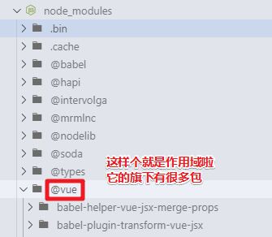
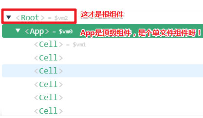
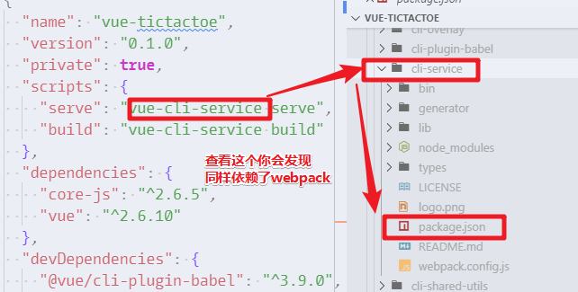
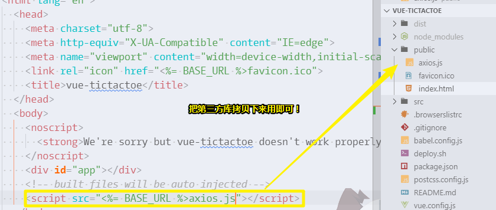

# 项目目录

## ★课程内容

### ◇脚手架

[vue-cli](https://github.com/vuejs/vue-cli)

- 2.9.3 版本的安装

  ```bash
  cnpm i -g vue-cli 
  vue init webpack webpack-template
  ```

- [vuejs-templates](https://github.com/vuejs-templates)「查看有哪些模板可供安装（目前有6个）」

- 3.0.0-beta.10

  ```bash
  cnpm i -g @vue/cli
  vue create vue-zero-config
  cnpm i -g @vue/init
  vue init webpack webpack-template
  ```

- 新的包名规则：[原文](https://blog.npmjs.org/post/168978377570/new-package-moniker-rules)、[众成翻译](https://zcfy.cc/article/the-npm-blog-new-package-moniker-rules)

### ◇项目目录相关

- [babelrc](https://babeljs.io/docs/usage/babelrc/)
- [editorconfig](http://editorconfig.org/)
- [package.json](https://docs.npmjs.com/files/package.json)
- [eslint](https://github.com/eslint/eslint)
- [standard](https://github.com/standard/standard)
- [postcss](https://github.com/postcss/postcss)
- [yarn.lock](https://yarnpkg.com/lang/zh-hans/docs/yarn-lock/)
- [package-lock.json](https://docs.npmjs.com/files/package-lock.json)
- cnpm不支持yarn.lock和package-lock.json

### ◇部分vue-cli文档解读

- [docs](https://github.com/vuejs/vue-cli/blob/dev/docs/README.md)
- [env](https://github.com/vuejs/vue-cli/blob/dev/docs/env.md)
- [assets](https://github.com/vuejs/vue-cli/blob/dev/docs/assets.md)
- [proxy](https://github.com/vuejs/vue-cli/blob/dev/docs/cli-service.md)
- [webpack](https://github.com/vuejs/vue-cli/blob/dev/docs/webpack.md)

## ★脚手架vue-cli

- 2.x 和  3.x 的区别

  - 3.x是0配置的

  - 3.x安装的vue-cli包名是有作用域的，即按照这个格式 `@用户名/包名`写包名，所有可有 `@vue/cli`，关于作用域的具体表现，你可以看到项目的node_modules目录里边：

    

    而之前2.x的，就是单独罗列在node_modulse旗下，而不是在 `@vue`目录里边！

  - 3.x的cli还能使用 `vue init webpack webpack-template`这样的命令，但是你运行这个命令之后，会提示你缺少 `@vue/cli-init`这个模块，具体详情看这个：<https://cli.vuejs.org/zh/guide/creating-a-project.html#拉取-2-x-模板-旧版本>

  总之，就使用 3.x 版本即可！

接下来看看，项目目录的对比

## ★webpack模板目录

### ◇注意点

-  `<Root>`是根组件，而 `<App>`则是除了根组件之外的顶级组件，我之前一直以为 `<App>`才是根组件，谁想这并不是呀！

  

- package.json，是 包描述文件，或者说是模块描述文件，我们所安装的包，其里边的package.json就是标准的包描述文件，那么我们项目里边的package.json算不算标准的呢？简单来说，我们整个项目可以看做是一个大的模块，但是严格上来说并不是，毕竟，发布一个包的时候，里边有些文件是要忽略掉的，总之，项目里边的可以说是基本遵循一个标准的！如`scripts`字段、依赖等……

- 关于配置文件，我们知道，node_modules下有很多包，而这些包，显然都具有一定功能的，之前使用过gulp作为构建工具，开发小程序，所以对一些配置文件的认识还是蛮深刻的，比如，这些配置会被某个包给读取，然后进行相关操作！总之，一个项目里边的文件，总是会有它存在的意义，不会出现平白无故的文件。

## ★3.x的目录

### ◇注意点

- 所谓0配置，并不是说真得咩有配置，而是只是被隐藏掉了，以致于我们无法看到。可以通过项目根目录下的package.json里边的script字段来验证：

  

- public目录和static目录的区别，可以近似等价，但public目录显然要好很多，因为在这里边可以方便地引入网页图标，以及第三方库：

  

- yarn.lock，保证了不同机器上所安装的包版本一致，毕竟有些包指明可以是xx版以上的，所以为了保证所有人用这个包时是明确的版本，而不是A用了1.1，B用了1.2，于是就出现了个yarn.lock，即锁定了某个版本，当你 `yarn install`的时候，就会去看 `yarn.lock`锁定的版本，然后进行安装！总之，就是保证一致的依赖版本！

- 0配置是把 `build`、`config`等目录以及一些配置文件给隐藏掉了

## ★部分文档解读

如果你想在3.x版的cli做代理配置和webpack配置的话，那就在项目根目录下的 `vue.config.js`里边配置一下即可！

## ★测试

- 创建项目
  - 安装脚手架vue-cli
  - 用脚手架创建项目
  - 熟悉项目目录结构

## ★总结

- 2.x和3.x的区别：[demo](./demo/03/webpack模板目录解析.html)

