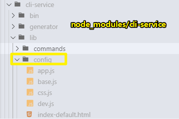
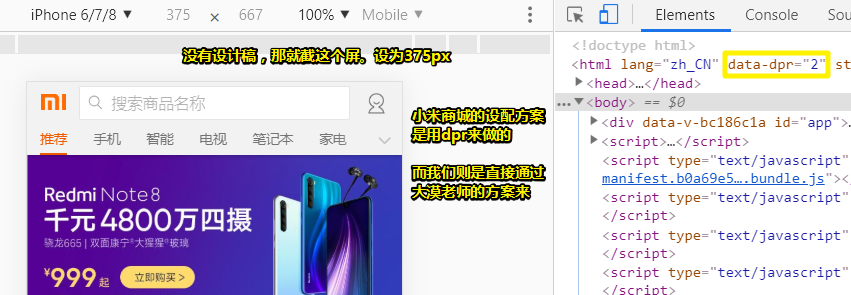
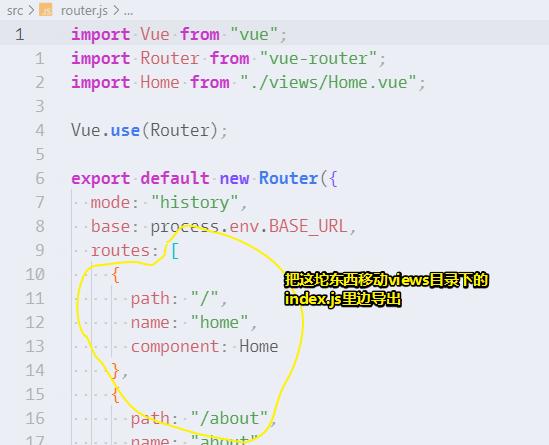
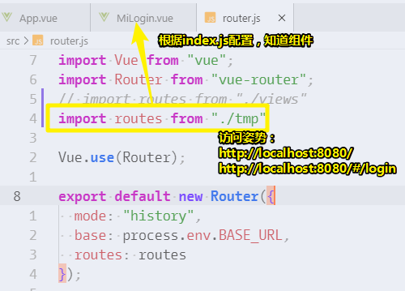
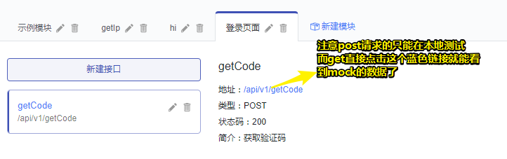
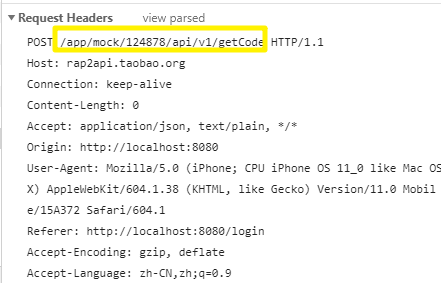
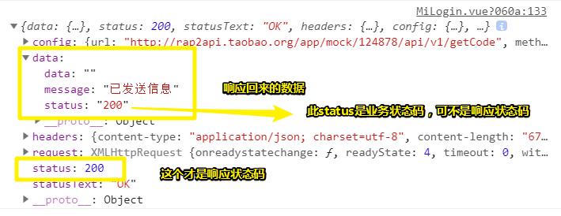
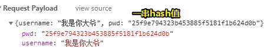
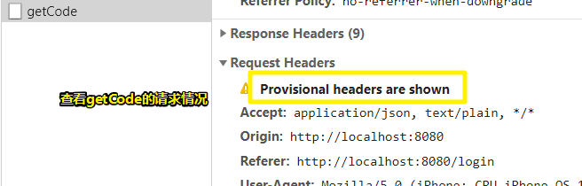

# 登录

## ★课程内容

### ◇vue-cli和vue-loader版本说明

- vue-cli >= 3.0.0-beta.10

- vue-loader >= 15.0.0

  ```bash
  cnpm install -g @vue/cli@3.0.0-beta.11
  ```

| vue-cli版本   | 对应的vue-loader版本 |
| ------------- | -------------------- |
| 3.0.0-beta.9  | 14.2.1               |
| 3.0.0-beta.10 | 15.1.0               |
| 3.0.0-beta.11 | 15.1.0               |

- vue-loader v15和v14：[v14](https://vue-loader-v14.vuejs.org/zh-cn/)、[v15](https://vue-loader.vuejs.org/zh/)、[从v14迁移](https://vue-loader.vuejs.org/zh/migrating.html)
- v15和v14默认webpack配置

### ◇单vue文件组件

- [教程-单文件组件](https://cn.vuejs.org/v2/guide/single-file-components.html)：顶级元素、预处理器、CSS作用域
- 不能使用单文件组件的场景

### ◇[适配方案viewport](https://www.w3cplus.com/mobile/vw-layout-in-vue.html)

- 前身：[lib-flexible](https://github.com/amfe/lib-flexible)

- 安装插件

  ```bash
  cnpm i cssnano cssnano-preset-advanced postcss-aspect-ratio-mini postcss-cssnext postcss-import postcss-px-to-viewport postcss-url postcss-viewport-units postcss-write-svg -D
  ```

- 配置postcss

  ```js
  "postcss": {
    "plugins": {
      "postcss-import": {},
      "postcss-url": {},
      "postcss-aspect-ratio-mini": {},
      "postcss-write-svg": {
        "utf8": false
      },
      "postcss-cssnext": {},
      "postcss-px-to-viewport": {
        "viewportWidth": 375,
        "viewportHeight": 667,
        "unitPrecision": 3,
        "viewportUnit": "vw",
        "selectorBlackList": [
          ".ignore",
          ".hairlines"
        ],
        "minPixelValue": 1,
        "mediaQuery": false
      },
      "postcss-viewport-units": {},
      "cssnano": {
        "preset": "advanced",
        "autoprefixer": false,
        "postcss-zindex": false
      }
    }
  },
  ```

- 添加buggyfill

  ```html
  <script src="//g.alicdn.com/fdilab/lib3rd/viewport-units-buggyfill/0.6.2/??viewport-units-buggyfill.hacks.min.js,viewport-units-buggyfill.min.js"></script>
  <script>
    window.onload = function () {
      window.viewportUnitsBuggyfill.init({
        hacks: window.viewportUnitsBuggyfillHacks
      })
    }
  </script> 
  ```

- 案例(需在微信中打开)：http://sus.test.qi-cloud.com/#/

> 课堂源码：https://github.com/tonyfree/m.mi

### ◇样式处理

- 替换public/favicon.ico
- 引入模块：[normalize.css](https://github.com/necolas/normalize.css)
- 在assets下创建css文件夹，创建reset.css
- 在assets下创建images文件夹，把logo.png移入
- 在assets下创建fonts文件夹，引入[iconfont](http://www.iconfont.cn/)
  （字体图标的三种使用方式）

### ◇路由处理

- 删除App.vue的nav
- views下创建index.js，把路由的routes配置放在index.js中
- 创建tmp文件夹，存放样式组件(不含逻辑处理)
- 在tmp下创建MiLogin.vue组件

### ◇MiLogin.vue组件

- 结构、样式、图片
- reset.css初始化样式优化、字体图标处理
- Vue实例
- 模板语法：插值({{}})、指令(v-bind)、缩写( : @)
- 计算属性
- Class和Style绑定
- 条件渲染(v-if、v-show)
- 事件处理(v-on)
- 表单输入绑定(v-model)
- axios、RAP2
- 优化：函数节流、数据加密、scripts-serve

```bash
cnpm i axios -S
cnpm i blueimp-md5 -S
```

### ◇风格指南

- 单文件组件的文件名是单词大写开头 (PascalCase)
- 单文件组件的顶级元素的顺序
- 实例的选项的顺序(data、computed、methods)
- 元素特性的顺序(条件渲染、普通的绑定或未绑定的特性、事件)

### ◇业务场景

- 登录方式的切换
- 密码是否可见的切换
- 获取验证码
- 登录提交(校验)

### ◇作业

1. 密码不可见切换图标颜色
2. 校验：手机号码合法性校验，非空校验
3. 登录函数节流，局部加载的形式

> <http://element.eleme.io/#/zh-CN/component/button> [https://developers.weixin.qq.com/miniprogram/design/#%E5%87%8F%E5%B0%91%E7%AD%89%E5%BE%85%EF%BC%8C%E5%8F%8D%E9%A6%88%E5%8F%8A%E6%97%B6](https://developers.weixin.qq.com/miniprogram/design/#减少等待，反馈及时)

---

## ★vue-cli和vue-loader版本说明

关于vue-loader：

> webpack loader for Vue Single-File Components

vue-cli版本越高，对于vue-loader的版本就会有要求！

如何找到用3.x的vue-cli的隐性配置？



查看它的base.js，你会看到这配置文件都是链式调用姿势，其中有入口的配置、输出路径的配置、别名配置、vue-loader（15版时需要配置这个）……

## ★单vue文件的简单说明

1. 单文件组件的顶级元素的[顺序](https://cn.vuejs.org/v2/style-guide/#%E5%8D%95%E6%96%87%E4%BB%B6%E7%BB%84%E4%BB%B6%E7%9A%84%E9%A1%B6%E7%BA%A7%E5%85%83%E7%B4%A0%E7%9A%84%E9%A1%BA%E5%BA%8F-%E6%8E%A8%E8%8D%90)： `template`> `script`> `style`；其中前两个可以二选其中一，可以同时出现，但不可出现多个，而最后一个则可以出现多个！
2. [预处理器](https://vue-loader.vuejs.org/zh/guide/pre-processors.html#sass)（babel、Sass等）：在 webpack 中，所有的预处理器需要匹配对应的 loader。Vue Loader 允许你使用其它 webpack loader 处理 Vue 组件的某一部分。它会根据 `lang` 特性以及你 webpack 配置中的规则自动推断出要使用的 loader
3. CSS作用域：指的是你在这个组件写的样式，只对这个组件有作用，不会对它的子组件有任何影响！（有一个场景，如用swiper做左右滑动轮播时，设置作用域会对其下边的分页指示器不起作用！因此需要做些处理！当然，这跟子组件咩有半毛钱关系！）

不使用单文件组件的情景：

对老项目（用extjs、jQuery写的）进行重构，由于是jsp页面，所以前后端分离就不要想了，于是在保留jsp的情况下，用vue+element-ui根据设计稿重构了页面！

而面对这种场景显然不能用单文件组件了，只能在本地引入vue，然后直接写了！而对于页面的结构，都是表单和表格，由于这些鬼东西，或多或少都有点差异，而且又是jsp文件，所以就不能它们组件化了，毕竟该项目给的重构周期只有两个星期。

> 看到jsp就意味着前后端没有分离

总之，你得知道在无法使用单文件组件的情景下，该如何处理这些东东！

## ★适配方案viewport

> 目前出视觉设计稿，我们都是使用`750px`宽度的，那么`100vw = 750px`，即`1vw = 7.5px`。那么我们可以根据设计图上的`px`值直接转换成对应的`vw`值。在实际撸码过程，不需要进行任何的计算，直接在代码中写`px`。

资料查看：

➹：[amfe/lib-flexible: 可伸缩布局方案](https://github.com/amfe/lib-flexible)

➹：[如何在Vue项目中使用vw实现移动端适配_vw, Layout, 布局, Vue, mobile 教程_w3cplus](https://web.archive.org/web/20180925022436/http://www.w3cplus.com:80/mobile/vw-layout-in-vue.html)

效果：

你使用px单位写样式，那么会自动转化为vw单位的！

关于移动端的设计稿，一般是750px，如果咩有750px的设计稿的话，那就直接看这个




> 我没有想到做移动端适配居然是这样做的，亏我一直认为写移动端页面很难！

## ★样式处理

- 网站图标正常来说是`16*16` or `32*32`
- 要引入哪些字体图标？——校验输入值的警告图标、密码可见和不可见的图标
- 为啥要用svg图标？——有些时候，iconfont提供的图标，并不能满足我们的场景，即不能通过图标表达我们的意境，因此需要制作svg图标，而svg，修改颜色，大小，甚是方便。

## ★路由处理

- node里边对模块循找的一个优先级顺序：如果发现有index.js文件，那就找着了，如果咩有那就去找package.json里边的main字段，所对应的值！（举个栗子，换个方式处理路由，如把路由配置置于一个文件里边），总之如果你引入的是一个文件夹，那么就会自动去找index.js文件，如果同时存在package.json，那就会优先去找其里边的main字段所对应的值。

做法：

1. 屏蔽掉 `App.vue`里边，默认给的路由跳转，如果要跳转的话，还是用tab切换哈！

2. 路由配置方式处理：在`views`目录里边创建一个 `index.js`文件，然后添加路由配置内容：

   

   总之，把router.js文件下的路由配置单独拿出来扔到 `view/index.js`里边去了

3. 创建 `src/tmp/`：该目录是用于放模板的，那放啥模板呢？——**没有进行业务逻辑处理的组件模板**！，说白了就是其里边的组件，是咩有`script`标签的，就只有`template`和 `style`
4. 创建 `tmp/MiLogin.vue`，根据规范，得大驼峰写法！
5. 按照`views`的做法，我们需要在 `tmp`下，同样创建一个 `index.js`，用于暴露组件，做路由配置！

> 内容看到这里，我突然好像变得厉害了，因为我一直搞不懂移动端适配，以及路由 配置是个怎么样的开发流程啊！

## ★登录实现

上一节的路由处理，所带来的便利之处：



这样，我们页面的聚焦就只有login页面了！

> 突然觉得，创建了一个放置组件不写业务逻辑的tmp目录，是很好的idea啊！因为这真得是「结构、样式」与行为分离了，而这也理解了，为啥单文件组价里边，可以不同时写template和script了。
>
> 我只能说老师牛逼了！

在实现业务的时候，都是拷贝一份tmp目录下的组件，然后添加业务逻辑，说白了，写页面，先写HTML和CSS，然后再追加业务，即 JS 。

注意点：

- 很多时候，需要用flag来作为状态的切换，一般操作就是取反。而这也体现了数据驱动的设计理念
- 计算属性，根据某个data的key的变化，而变化。

- 频繁的切换DOM，那就用v-show，如果只有一次，那就用v-if。
- 关于mock数据：其中有个status的字段，表示业务状态码，而它的值有很多，如101、103等，而这会根据你实际的业务场景，会有权限什么的，如手机号设置为黑名单，已注册什么的……
- `"serve": "vue-cli-service serve"` ==》 `"serve": "vue-cli-service serve --open"`自动打开页面。
- 一个组件即是一个页面呀！

## ★分析一波登录页

> 分析这个元素所触发的事件效果，只需要关注当前页面的UI发生了什么变化即可！无须再次关注新出现的UI会有哪些事件！
>
> 总之，你之为当前所看到的页面元素作出分析，而不是还得针对新出现的元素作出分析！


> 直接从思维导图里边，导出图片，有1M多，压缩之后250kb

➹：[02 分类拆解法简介： 助你马上起飞的编程方法论-慕课专栏](https://www.imooc.com/read/40/article/560)

编码实现：


注意点：

- 使用了scss写CSS贼方便
- class的命名，使用了 [CODELF](https://unbug.github.io/codelf/)
- class的命名不需要遵循BEM什么的，因为有scoped属性呀！
- 先把布局写好了，最后再去完善，字体大小、颜色什么的……（偶遇不会写的样式，可以参考小米的写法，如「其它方式登录」这个，我之前用了很绝对定位的姿势来做，但是文字内容底部的线还在，而小米给出的写法就很简洁了——使用了 `fieldset` 这个不常见的标签）
- 我没有用form元素，因为我觉得用了 vue 之后 这些数据提交，还是什么的，都以直接用axios去做了。
- 事件触发后修改的DOM，不需要一开始就去写HTML和CSS，等写业务逻辑的时候，再去添加，总之，你就把设计稿用HTML和CSS画出来就好了。
- 不要想着第一次就能省一些div标签，也不要想着有更好的方案，也不要想着去优化代码！

> 之后的页面，我抄老师给的就好了，毕竟写这些页面太费时间，而我要学习的目标是使用 Vue 来实现业务逻辑啊！

---

业务逻辑处理：

> 每一个 Vue 组件就是一个实例，我们这样写 `new Vue({})`，其里边的 `{}`就是一个 options，即一个对象的配置。而所谓的实例，就是我们要导出的这个 `{}`对象！
>
> 因此，我们要单文件组件里边导出一个 Options ： `export default {}`，而这个Options跟我们的 `new Vue({})`的 `{}` options 其实是一样的
>
> 原来这个实例指的是 选项对象`{}`，而不是 `new Vue({})`呀！

写业务逻辑前，需要明确风格指南哈！

- 单文件组件的文件名是单词大写开头 (PascalCase)
- 单文件组件的顶级元素的顺序
- 实例的选项的顺序(data、computed、methods)「选项的顺序」
- 元素特性的顺序(条件渲染、普通的绑定或未绑定的特性、事件)「写在元素上的属性顺序」

> 第一个是明确要这样搞，其余三个是建议，当然还有其它建议，而这个项目里边，这几条建议就足够了

安装两个包：

```bash
yarn add axios blueimp-md5
```

一个用做发送请求，一个用作简单的所谓的「密码」加密！

接下来，根据业务线来一点点的来做：

> 主要体会数据驱动的理念！

1. 点击按钮，切换成另一种登录模式。（两种场景，是默认的短信登录，还是账号密码登录），根据设置 的`isSmsLogin`的true or false，来更新默认给定的data值，即需要用到计算属性
2. 处理placholder
3. 处理+86区号的显示和影藏，这个在短信验证登录时才会有的。如果就一次渲染，那就用v-if，如果频繁地切换，那就用 v-show。（这里没有做动画，之后会优化）
4. 添加一个叫密码的input，该input不能与短信验证码同时存在，同样用到了v-show
5. 密码输入框的eye图标切换。密码可见不可见，只需要看是  `text/password` 即可！涉及到class的切换！
6. 获取验证码，倒计时，而且颜色还要变。
7. 咩有输入手机号，直接发送验证码，就会出现信息错误提示！
8. 发送两个请求
   1. 获取手机验证码（响应后才去做倒计时，而不是数据还未响应回来就开始倒计时了）
   2. 登录
9. 点击登录这个按钮还需要进行一系列的校验

---

如何搞一个接口出来？

用的是 <http://rap2.taobao.org/> ：



关于简单的数据制造：

1. 明确页面需要上传什么数据过去

   

2. 明确页面想要啥响应数据

   


## ★优化：函数节流、数据加密

什么叫函数节流？——我们点击了「发送验证码」，数据响应回来之后，就会变为「重新发送59」，如果再次点击这个内容，就会再次发送请求，而我们节流就是，让不要再次发送请求，即等60s过过后才可以再去发送请求！

还有一个节流的场景是，点击登录的那个按钮，在数据还未响应回来时，抓住这个时间差，还是可以点击按钮的。

做什么？

点击登陆按钮时，有个旋转的图标

关于加密，发送给后台的数据，是要加密的，如果是下边这种情况，那就GG了：


所以我们，需要加密（下边这种是md5加密）：



而加密有很多种方式，简单的方式就是md5加密，但这方式并不安全。而一般安全的方式是前端加盐或者是后端加盐，但其实这种加盐方式也不是很安全！

➹：[加盐密码保存的最通用方法是？ - 知乎](https://www.zhihu.com/question/20299384)


## ★总结

- 我之前一直以为import可以导入外链，其实这并不可以呀！没办法语法就是如此规定的！

- 添加了eslint会有一些规则，如结尾的时候要多一行，而且不能多两行！

- 在 `view/index.js` 路由切换方式，不需要 `/#/about`，不然是来到首页哈！以后路由切换，请用 `/about`、`/login`

- 在搞文本插值的时候，最好是 用 大胡子语法\{{\}}而不是 `v-text`

- 双向数据绑定：页面里的数据变化，实例里边的data也会变化，实例里边的data变化，又会改变页面的数据。

- 正常来说，传给后台的是usernName，而不是username

- 原生添加class和移除class：`element.classList.add/remove()`，配合 Vue 提供的 `refs`属性使用很方便

  ➹：[JS classList 用法简介 - kayron的博客 - CSDN博客](https://blog.csdn.net/kayron/article/details/78533035)

- 常用正则：[常用JS正则大全(2019年9月16日更新) - 掘金](https://juejin.im/post/5d245d4151882555300feb77)

- 上下两个元素之间的间距，能用`margin-top`那就用`margin-top`，而不是 `margin-bottom`，因为你不知道，这两个元素之间会不会有因为交互的缘故，而多出一个元素出来！

## ★Q&A

### 1、什么叫预处理器？

> 在计算机科学中，预处理器是一种程序，它处理输入数据以产生输出，并作为另一个程序的输入。输出被认为是输入数据的预处理形式，它通常被一些后续程序使用，如编译器。处理的数量和种类取决于预处理器的性质；一些预处理程序只能执行相对简单的文本替换和宏扩展，而另一些具有成熟编程语言的能力。

如babel就是一个预处理器，即它是一个程序，可以把ES6的代码转译成ES5的代码，好让其它不支持ES6语法的浏览器解析！

➹：[Preprocessor - Wikipedia](https://en.wikipedia.org/wiki/Preprocessor)

### 2、什么叫hash值？

> 使用scoped这个属性后，该组件里边的元素会有类似hash值的属性出现

白话理解hash：

> hash，中文翻译是哈希，我在法国生活，偶尔吃steak hashe, 就是打碎混合好的牛肉饼的意思。
>
> 去肉店买肉的时候，师傅会问，你要hash-er吗？（er是的动词的词缀），就是打不打碎的意思。
>
> 
>
> hash来自于生活。体现到计算机中，hash，就是把输入的东西，字符串也好，其他的什么东西也好（肉或小脆骨），打的越碎越均匀越好。

而说到hash值，就不得不扯到hash函数了：

> 哈希函数就是能将任意长度的数据映射为固定长度的数据的函数。哈希函数返回的值被叫做**哈希值**、哈希码、散列，或者直接叫做哈希。一个使用场景就是哈希表，哈希表被广泛用于快速搜索数据。

可见，hash值是某个东西被hash函数处理过后所返回的产物！而且，这个产物就那么大！

既然提到了，hash函数，那就不得不说hash表了：

> 哈希表是一种能实现关联数组的抽象数据结构，能把很多「键」映射到很多「值」上。哈希表使用哈希函数来计算索引，一个索引对应一个值。

我们看到的 JS 普通对象 `{}`、python 里边的字典等就是个hash表！

➹：[什么是 hash？ - 王辉的回答 - 知乎](https://www.zhihu.com/question/26762707/answer/250667078)

➹：[什么是 hash？ - 方应杭的回答 - 知乎](https://www.zhihu.com/question/26762707/answer/260230845)

➹：[唠叨一下js对象与哈希表那些事 - 前端小事 - SegmentFault 思否](https://segmentfault.com/a/1190000007692754#articleHeader1)

### 3、dart-sass是什么东东？

在使用 vue-cli创建一个项目的时候，我选择了使用 css预处理器，结果它给了多个选择我，如选择dart-sass的还是node-sass的

由于dart-sass是默认选择的，于是我就用它了！

关于eslint，我选择使用 prettier 作为的组合 。

➹：[如何评价 dart-sass？ - 知乎](https://www.zhihu.com/question/301055443)

➹：[前端构建秘籍 - 掘金](https://juejin.im/post/5c9075305188252d5c743520#heading-31)

➹：[国内 CSS 预处理器 Less、Sass、Stylus 的实践代表分别有哪些？ - 知乎](https://www.zhihu.com/question/26810568)

### 4、提交表单加密？

➹：[如何保证用户登录时提交密码已经加密？ - 知乎](https://www.zhihu.com/question/20060155)

➹：[js实现表单提交submit()，onsubmit - web_study - 博客园](https://www.cnblogs.com/web-wjg/p/7894657.html)

### 5、关于CSS reset？

➹：[到底该不该用 CSS reset？ - 知乎](https://www.zhihu.com/question/23554164)

➹：[关于CSS Reset 那些事（一）之 历史演变与Normalize.css - Share - SegmentFault 思否](https://segmentfault.com/a/1190000003021766)

➹：[kissy reset css - u014321952的专栏 - CSDN博客](https://blog.csdn.net/u014321952/article/details/36190131)

### 6、标注工具？

**iDoc**  这个工具甚是好用！

➹：[做ui标注，除了 Mark Man之外还有什么好用的标注工具？ - 知乎](https://www.zhihu.com/question/24244087)

### 7、label标签是干嘛的？

➹：[ `<label>`  - HTML（超文本标记语言） - MDN](https://developer.mozilla.org/zh-CN/docs/Web/HTML/Element/label)

### 8、为啥ESLint规定要结尾多一行？

➹：[ESLint - Pluggable JavaScript linter - ESLint中文](http://eslint.cn/)

➹：[Vue项目使用eslint + prettier规范代码风格 - 掘金](https://juejin.im/post/5b79a52651882543025ac6d7)

➹：[if 我是前端团队 Leader，怎么制定前端协作规范? - 掘金](https://juejin.im/post/5d3a7134f265da1b5d57f1ed)

### 9、子选择器 、后代选择器，它们俩的性能？

我在CSS里边用了子选择器，而ESLint提示我去掉呀！这是为啥呢？

难道是我用了sass语法？

如果你明确DOM结构，那就用子选择器，不然那就用后代选择器！

总之，使用子选择器更快呀！而且在匹配元素的时候是从右到左的！即从最内层到root元素。

➹：[css子选择器和后代选择器哪个性能好_百度知道](https://zhidao.baidu.com/question/1834090679277107540.html)

➹：[[转]关于浏览器css选择器性能优化 - subying - 博客园](https://www.cnblogs.com/subying/p/3661807.html)

➹：[css – 孩子和后代选择器之间的性能有差异吗？ - 代码日志](https://codeday.me/bug/20190724/1526064.html)

➹：[css - Is there a difference in performance between the child and descendant selectors? - Stack Overflow](https://stackoverflow.com/questions/34695477/is-there-a-difference-in-performance-between-the-child-and-descendant-selectors)

### 10、不检查分号、单引号、双引号的问题？

使用vue-cli这个脚手架构建项目的时候，选择了 ESLint + Prettierrc

在编译代码的过程中，一直提示要加分号和双引号，于是我只好把它们设为共存状态 了：

```js
//.prettierrc
{
  "singleQuote": 0,
  "prettier.tabWidth": 2,
  "useTabs": false,
  "bracketSpacing": false,
  "bracesSpacing": false,
  "spaceBeforeFunctionParen": true,
  "semi": 0
}
```

不过这是错的，因为0不是预期的值啊，它们俩得是布尔值才行，所以最后，我又搞成是这样的：

```
{
  "singleQuote": true,
  "prettier.tabWidth": 2,
  "useTabs": false,
  "bracketSpacing": false,
  "bracesSpacing": false,
  "spaceBeforeFunctionParen": true,
  "semi": false
}

```

➹：[关于eslint使用规则，和各种报错对应规则。 - 知乎](https://zhuanlan.zhihu.com/p/28906725)

➹：[使用vue-cli构建的项目不检查分号 - NeverYu - CSDN博客](https://blog.csdn.net/csdn_yudong/article/details/78445273)

➹：[代码格式化工具---prettier配置 - 青S衫% - 博客园](https://www.cnblogs.com/linjunfu/p/10880381.html)

### 11、`display:none` 和 `visibility: hidden` 的区别？

> 用到了v-show这属性，让元素不可见

简单区别：

- 前者不占据任何空间，弟弟可上位，而后者即便看不见，也要占着茅坑不拉屎

你不知道的区别：

- visibility具有继承性，儿子搞为 `visible`后，儿子就被看见了。而 `display:none`的儿子即便为 `block`还是不可见

- 在使用li标签的时候，`visibility`始终占个位，而`none`则没有了

  

➹：[display:none和visibility:hidden两者的区别 - 越努力，越幸运！ - CSDN博客](https://blog.csdn.net/qq_38128179/article/details/80794397)

### 12、输入框自动填充有默认的背景色？

> autocomplete 属性规定输入字段是否应该启用自动完成功能。

为input元素添加这个属性 `autocomplete="off"`即可

全局添加的话，在 form元素上添加即可！

➹：[input:-webkit-autofill 谷歌浏览器 修改input输入框的颜色 - 错误集中营 - CSDN博客](https://blog.csdn.net/enterys/article/details/7619045)

➹：[HTML  `<input> ` autocomplete 属性](https://www.w3school.com.cn/tags/att_input_autocomplete.asp)

### 13、如何更改输入框里边那一闪一闪的光标样式？

使用 `caret-color`属性即可！

或说粗细又怎么解决呢？——没解决

如何让input框自适应？——父元素的宽度为100%（不知道`display: flex;`会不会影响），input也搞为100%

➹：[输入框里那个一闪一闪的光标如何改变样式？ - 知乎](https://www.zhihu.com/question/19588457)

➹：[CSS Input 样式美化 - 简书](https://www.jianshu.com/p/9b4b60b8d475)

➹：[input输入框的宽度自适应 - 你不能拿走我的蜡烛的博客 - CSDN博客](https://blog.csdn.net/myCSDN_sy_yl/article/details/78141997)

### 14、业务状态码？

针对业务的处理情况所返回的一个数据，如用户密码不正确、用户不存在、订单不存在、第三方api请求错误等。

➹：[跳转常规 -- 为什么不要使用404、500等http状态码作为业务代码响应 - 我想嘿嘿 - 博客园](https://www.cnblogs.com/loveheihei/p/11044541.html)

➹：[业务返回状态码规范 - 廖圣平 - CSDN博客](https://blog.csdn.net/qq_22823581/article/details/84890914)

### 15、POST 提交数据方式？

➹：[四种常见的 POST 提交数据方式 - JerryQu 的小站](https://imququ.com/post/four-ways-to-post-data-in-http.html)

➹：[深入解析 multipart/form-data - 简书](https://www.jianshu.com/p/29e38bcc8a1d)

➹：[postman的几种参数格式 - 简书](https://www.jianshu.com/p/6c5b96af1ad6)

### 16、Provisional headers are shown？



这个警告的意思是说：**请求的资源可能会被（扩展／或其他什么机制）屏蔽掉**

发现不是屏蔽广告插件的锅

于是我就加上这个呗：

```js
axios.defaults.headers['Content-Type'] = 'application/x-www-form-urlencoded;charset=UTF-8';
let url = 'http://rap2api.taobao.org/app/mock/124878/api/v1/getCode'
axios.post(url)
```

结果还是GG了

既然如此，那就换个浏览器呗，如QQ浏览器，结果没有这个警告了，也能看到请求行是啥

➹：[http - Chrome 里的请求报错 "CAUTION: Provisional headers are shown" 是什么意思? - SegmentFault 思否](https://segmentfault.com/q/1010000000364871)

➹：[使用axios时，解决provisional headers are shown问题 - 筱竹的博客 - CSDN博客](https://blog.csdn.net/it_cgq/article/details/78749037)

➹：[请求头出现Provisional headers are shown - qq_20337865的专栏 - CSDN博客](https://blog.csdn.net/qq_20337865/article/details/81184285)

➹：[axios Google浏览器 "Provisional headers are shown"问题 - qq_39746484的博客 - CSDN博客](https://blog.csdn.net/qq_39746484/article/details/84851465)

huzi