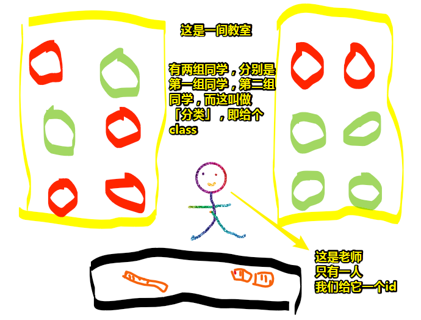
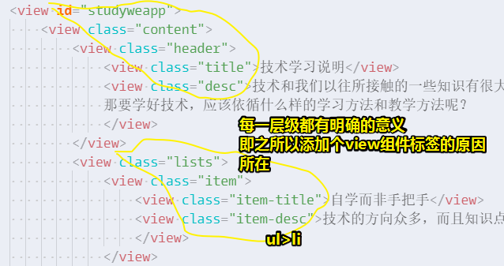
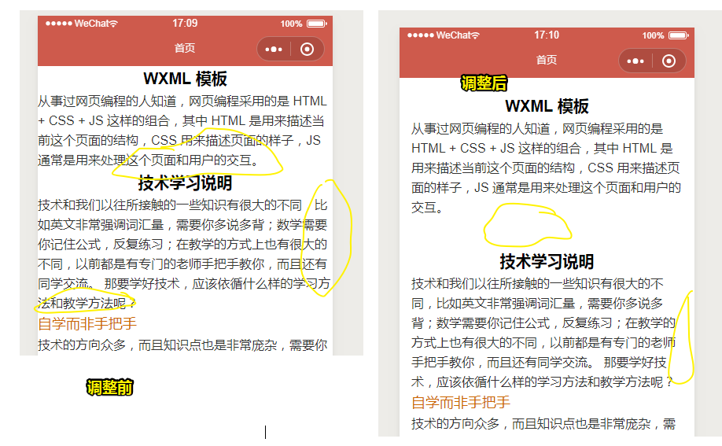

# WXML与WXSS

回顾之前学到了什么？

1. 对一个完整的小程序的文件结构有了一个大致的了解
2. 对小程序的开发者工具也有了一定的认识

接下来干啥？

> 动手写一下小程序的代码

## ★编辑WXML文件

WXML文件的作用等同于HTML文件的作用，但其里边的标签是小程序自己造的，比如，你打开 `home.wxml`，你就会看到一些自动生成的默认内容：

```html
<!--pages/home/home.wxml-->
<text>pages/home/home.wxml</text>
```

来分析一下这个内容：

1. 第一行，是个注释，即一句说明哈！这个内容可不会显示在小程序的前端
2. 第二行，是个 `text`组件，等同于 `span`标签

既然有了 `span`标签，那么 `div`标签怎么可能会少呢？

在小程序里边用 `view`组件来表示 `div`标签，而该组件在小程序里边广泛使用！具体样子如下：

```html
<view>
    <view>
        <view>WXML 模板</view>
        <view>从事过网页编程的人知道，网页编程采用的是 HTML + CSS + JS 这样的组合，其中 HTML 是用来描述当前这个页面的结构，CSS 用来描述页面的样子，JS 通常是用来处理这个页面和用户的交互。</view>
    </view>
</view>
```

结合上面的代码，来了解一下组件的基本写法：

1. `view`组件 和 `text`组件类似，它们都是成对出现的，说白了就是「有始有终」，而区分是「始」还是「终」则看标签里边有没有 `/`，有则为闭合标签，没有则为开始标签哈！
2. `view`组件之间可以嵌套来写。在 Vue 里边，自定义组件标签，能否嵌套其它内容，得看该组件标签是如何构造的！如是否有 `slot`标签的存在
3. 为了让视觉上更好看，写代码的时候要有缩进（虽然不缩进也不会有影响）

我们可以把这个页面写的更加复杂一点（往 `home.wxml`里边追加一段内容）：

```html
<view>
    <view>
        <view>
            <view>技术学习说明</view>
            <view>技术和我们以往所接触的一些知识有很大的不同，比如英文非常强调词汇量，需要你多说多背；数学需要你记住公式，反复练习；在教学的方式上也有很大的不同，以前都是有专门的老师手把手教你，而且还有同学交流。那要学好技术，应该依循什么样的学习方法和教学方法呢？
            </view>
        </view>
        <view>
            <view>
                <view>自学而非手把手</view>
                <view>技术的方向众多，而且知识点也是非常庞杂，需要你具备一定的自学能力，所谓自学能力就是要求你遇到问题能够勤于思考，擅于搜索，能够不断实践探索。在实际工作中，也要求你能根据技术文档可以迅速掌握前沿的技术，而同事不会有时间教你，如果没有自学能力，是很难胜任很多工作的。
                </view>
            </view>
            <view>
                <view>查阅文档而非死记知识点</view>
                <view>在高中一学期一门课只有很薄的一本书，老师会反复讲解知识点，强化你的记忆，考试也是闭卷；而技术一个很小的分支，内容就有几千页甚至更多，强记知识点显然不合适。学习技术要像查词典一样来查阅技术文档，你只需要掌握基本的语法和用法，在编程的时候随时查阅，就像你不需要背诵上万的单词也能知道它的意思用法一样，所以技术文档是学习技术最为重要的参考资料。
                </view>
            </view>
            <view>
                <view>实战而非不动手的看书</view>
                <view>技术是最强调结果的技能，你看了再多书，如果不知道技术成品是怎么写出来的，都是枉然。很多朋友有收集癖，下载了很多电子资源，收藏了很多高赞的技术文章，但是却没有动手去消化去理解，把时间和精力都浪费了。不动手在开发者工具里去写代码，不动手配置开发环境，缺乏实战的经验，都是阻碍你学好技术的坏习惯。
                </view>
            </view>
            <view>
                <view>搜索而非做伸手党</view>
                <view>在以前，我们遇到技术问题，我们可以问老师问同学，于是很多人把这种不良的习惯也带到了技术的学习当中，遇到问题也总喜欢求助于别人。技术的方向众多，环境复杂，问题也是很多，如果你总是依赖别人的解答，是很难学好技术的。一定要学会在网上通过搜索遇到的问题来找答案。
                </view>
            </view>
            <view>
                <view>团队协作，而非单打独斗</view>
                <view>一个产品涉及的技术非常多，需要很多人来一起配合才能开发好，所以学习技术的时候我们需要了解一些代码规范、工作的流程、项目管理等，在技术方面也会有API接口，接口文档这些，还要懂得如何和同职业的同事以及不同角色的人如设计师等一起配合，而不是自己一个人单打独斗。
                </view>
            </view>
            <view>
                <view>系统的指导而非茫然无序</view>
                <view>学好技术最依赖你自学，但是如果没有人指导你，你可能会像苍蝇一样陷入众多资料中茫然无序，抓不住一个技术的重点，也不清楚哪些技术才值得你深入学习，最好是有经验的人可以指点你应该看什么，学什么，什么才是重点，当然不是手把手教你。
                </view>
            </view>
        </view>
    </view>   
</view>
```

## ★WXSS选择器

在追加了上面所述的那一段代码后，该 `home.wxml` 小程序页面显得就贼鸡儿丑！

既然丑了，那就需要对该页面进行美化啊！然而，页面里边的 `view`组件也忒TM多了吧！**如果不对每个组件进行区分，那么就很难对每个组件进行美化了**！

### ◇id与class选择器

话说，选择器是什么东东？它又是用来干啥的？

顾名思义，即从名字里我们就可以看出来，就是**为了选择**。



更进一步描述这个图，我们要从班里12个同学里边，选择出其中的一人，那么我们可以给所有同学一个学号，而这个学号是唯一的，我们可以称这个学号为**id**，用于精准的选择。（类似老师点名，1号到了没？7号到了没？为啥8号的声音跟4号声音一样？8号同学你是不是冒充4号同学？）

有的时候我们需要对一群人进行分类选择，比如整个班级或者所有男生，这个班级、性别，我们可以称为**class**，用于分类选择。（类似于班级与班级之间的总体成绩较量……）

在wxss技术文档这里有关于选择器的描述。

**技术文档**：[WXSS技术文档](https://developers.weixin.qq.com/miniprogram/dev/framework/view/wxss.html)

> 目前支持的选择器有 `.class`、`#id`、`ele`、`ele,ele`、`::after`、`::before`，作用与CSS的一样！

### ◇给组件增加属性

由于 `home.wxml`里边 `view`组件实在是忒多了，**为了区分它们**，我们给它们加一些属性，这样我们就可以用选择器选择它们了。

> 假如不区分，直接写 `view {}`，那么样式就会乱套了，因为每一层级的 `view`都有特殊的语义，虽然都用了 `view`来标记内容，但不妨碍我们用属性来显示的区分它们！HTML有语义化标签，不知道小程序页面里边有没有？

于是，可有：

```html
<view id="wxmlinfo">
    <view class="content">
        <view class="title">WXML 模板</view>
        <view class="desc">从事过网页编程的人知道，网页编程采用的是 HTML + CSS + JS 这样的组合，其中 HTML 是用来描述当前这个页面的结构，CSS 用来描述页面的样子，JS 通常是用来处理这个页面和用户的交互。
        </view>
    </view>
</view>
```

保存代码后，可以看到给组件添加属性在外观上并不会有什么效果。

同理，给比较复杂的那段代码的 `view` 组件也加上属性：



> 注：大家在学习的过程中，要随时在开发者工具的模拟器上查看效果，也要经常用微信扫码**预览**所生成的二维码来查看效果，**千万不要只看教程怎么说**，而是自己要动手去实战。

可以思考一下，如果你不是在写小程序页面，而是在写HTML页面，那么你会用到哪些HTML标签来写上边的内容？

**➹：**[HTML5 标签列表 - Web 开发者指南 - MDN](https://developer.mozilla.org/zh-CN/docs/Web/Guide/HTML/HTML5/HTML5_element_list)

**➹：**[03HTML基础--列表标签 - 简书](https://www.jianshu.com/p/1e15d8059bb4)

## ★CSS参考手册

如何美化wxml文件里边的组件？

1. 给组件添加选择器（已完成）
2. 找到该文件对应的 `wxss`文件，像写CSS一样，添加样式即可！

总之，`wxss`文件的作用就是来美化组件的。

技术文档：[CSS参考手册](http://www.w3school.com.cn/cssref/index.asp)

目前，只需要了解CSS的**字体属性**、**文本属性**、**背景属性**、**边框属性**、**盒模型**

> CSS涉及的知识点非常多，现在大家也只需要知道有这些概念即可，学技术千万不要在**没有看到实际效果的情况下**来死记概念。概念没有记住一点关系都没有，因为大家可以随时来查文档。接下来我们也会有实际的例子让大家看到效果，大家想深入学习的时候可以回头再看这些文档。

说白了，不能用出来，那就不要看了，看再多，记再多也没用，毕竟这代码不是用来说的，而是用来写的！

## ★字体属性与文本属性

> 下面这些关于CSS的基础知识点，大家可以**结合我们是如何调整Word、PPT的样式的来理解**，比如我们是怎么调整文本的大小、颜色、粗细等等的，添加样式的时候要注意随手实战了解了效果再说。

How？

①`view.title`：对标题的字体进行加大、加粗以及居中处理

```css
.title{
  font-size: 20px; 
  font-weight: 600;
  text-align: center;
}
```

该样式只会作用到类class为 `title`的`view`组件上。

关于CSS的写法：

1. `font-size`等称为属性
2. 属性接着的冒号`:`后面称之为值，如 `20px`
3. `属性:值`这一整个东东，我们叫做声明
4. 有多个声明，那就需要用分号 `;`隔开

 这些概念不需要记住，知道是个什么东西就好了！如属性就是 长得像 `font:size`这样的东西

② `view.item-title`：该`view`组件里边的文字是一个列表的标题，所以我们希望它和其它文字的样式有所不同，即要比title的字体小一些，比其他文字更粗，但是比title更细；颜色我们可以添加一个彩色字体：

```css
.item-title{
  font-size:18px;
  font-weight:500;
  color: #c60;
}
```

我们希望描述类的文字颜色浅一点，不要那么黑，我们可以换一个浅一点的颜色：

```css
.desc,.item-desc{
  color: #333;
}
```

> 这里有两个选择器，一个是desc，一个是item-desc，当我们希望两个不同的选择器有相同的css代码时，可以简化一起写，然后用逗号`,`隔开

除了标题（class为title和item-title的 `view` 组件）我们都给他们加了字体大小，我们希望所有的文字大小、行间距有一个统一的设定。

```css
#wxmlinfo,#studyweapp{
  font-size:16px;
  font-family: -apple-system-font,Helvetica Neue,Helvetica,sans-serif;
  line-height: 1.6;
}
```

> 行高可继承呀！

Tip：

如何写样式？

1. 明确目前要对哪个元素、或者说是哪一类元素进行美化
2. 请用「我希望这个元素或者这类元素怎么怎么样」的言语，来对这个元素或这类元素写上相应的样式

常用的css技术：

|                           字体属性                           |                          |
| :----------------------------------------------------------: | ------------------------ |
| [font-family](http://www.w3school.com.cn/cssref/pr_font_font-family.asp) | 规定文本的字体系列。     |
| [font-size](http://www.w3school.com.cn/cssref/pr_font_font-size.asp) | 规定文本的字体尺寸。     |
| [font-weight](http://www.w3school.com.cn/cssref/pr_font_weight.asp) | 规定字体的粗细。         |
|                           文本属性                           |                          |
| [color](http://www.w3school.com.cn/cssref/pr_text_color.asp) | 设置文本的颜色。         |
| [line-height](http://www.w3school.com.cn/cssref/pr_dim_line-height.asp) | 设置行高。               |
| [text-align](http://www.w3school.com.cn/cssref/pr_text_text-align.asp) | 规定文本的水平对齐方式。 |

话说，字体属性和文本属性有何区别？

在CSS里边，用于样式文本的 CSS 属性通常可以分为两类：

- 字体样式：作用于字体的属性，会直接应用到文本中，比如使用哪种字体，字体的大小是怎样的，字体是粗体还是斜体，等等。
- 文本布局风格：作用于文本的间距以及其他布局功能的属性，比如，允许操纵行与字之间的空间，以及在内容框中，文本如何对齐。

所以说你要针对文本添加样式的话，那么字体属性和文本属性一般都会用到哈！

**➹：**[基本文本和字体样式 - 学习 Web 开发 - MDN](https://developer.mozilla.org/zh-CN/docs/Learn/CSS/%E4%B8%BA%E6%96%87%E6%9C%AC%E6%B7%BB%E5%8A%A0%E6%A0%B7%E5%BC%8F/Fundamentals)

## ★盒模型

或许，你已经发现了段落之间的距离、文字之间的距离，以及与边框之间的距离都比较拥挤？

这个时候就需要用到盒子模型啦。盒子模型就像一个长方形的盒子，它有长度、高度、也有边框，以及内边距与外边距。

给id为`wxmlinfo`和`studyweapp`的 `view` 组件加一个内部距；

```css
#wxmlinfo,#studyweapp{
  padding-top:20px;
  padding-right:15px;
  padding-bottom:20px;
  padding-left:15px;
}
```

> 可简写成 `padding:20px 15px`

效果如下：



> 这效果就像是，装有电器的箱子里边都有白色塑料泡沫填充物

class为title的view组件是标题，我们希望它和下面的文字距离大一点，我们可以添加以下样式：

```css
.title,.item-title{
  margin-bottom:0.9em;
}
```

话说，这里咋又冒出了一个em的单位，**em是相对于当前字体尺寸而言的单位**，如果当前你的字体大小为16px，那1em为16px；如果当前你的字体大小为18px，那1em为18px。

为了让class为item-title的 `view` 组件，也就是列表的标题更加突出，我们可以给它左边加一个边框：

```css
.item-title{
  border-left: 3px solid #c60;
  padding-left: 15px;
}
```

可见，添加了以上CSS代码之后，这篇文章的样式看起来还算可以接收！

为了便于大家查阅，我们也把盒子模型的三类属性整合在了一起

|                          内边距属性                          |                                                            |
| :----------------------------------------------------------: | ---------------------------------------------------------- |
| [padding](http://www.w3school.com.cn/cssref/pr_font_font-family.asp) | 在一个声明中设置所有内边距属性。                           |
| [padding-top](http://www.w3school.com.cn/cssref/pr_font_font-size.asp) | 设置元素的上内边距。                                       |
| [padding-right](http://www.w3school.com.cn/cssref/pr_font_weight.asp) | 设置元素的右内边距。                                       |
| [padding-bottom](http://www.w3school.com.cn/cssref/pr_font_weight.asp) | 设置元素的下内边距。                                       |
| [padding-left](http://www.w3school.com.cn/cssref/pr_font_weight.asp) | 设置元素的左内边距。                                       |
|                          外边距属性                          |                                                            |
|  [margin](http://www.w3school.com.cn/cssref/pr_margin.asp)   | 在一个声明中设置所有外边距属性。                           |
| [margin-top](http://www.w3school.com.cn/cssref/pr_margin-top.asp) | 设置元素的上外边距。                                       |
| [margin-right](http://www.w3school.com.cn/cssref/pr_margin-right.asp) | 设置元素的右外边距                                         |
| [margin-bottom](http://www.w3school.com.cn/cssref/pr_margin-bottom.asp) | 设置元素的下外边距。                                       |
| [margin-left](http://www.w3school.com.cn/cssref/pr_margin-left.asp) | 设置元素的左外边距。                                       |
|                           边框属性                           |                                                            |
|  [border](http://www.w3school.com.cn/cssref/pr_border.asp)   | 在一个声明中设置所有的边框属性。比如border:1px solid #ccc; |
| [border-top](http://www.w3school.com.cn/cssref/pr_border-top.asp) | 在一个声明中设置所有的上边框属性。                         |
| [border-right](http://www.w3school.com.cn/cssref/pr_border-right.asp) | 在一个声明中设置所有的右边框属性。                         |
| [border-bottom](http://www.w3school.com.cn/cssref/pr_border-bottom.asp) | 在一个声明中设置所有的下边框属性。                         |
| [border-left](http://www.w3school.com.cn/cssref/pr_border-left.asp) | 在一个声明中设置所有的左边框属性。                         |
| [border-width](http://www.w3school.com.cn/cssref/pr_border-width.asp) | 设置四条边框的宽度。                                       |
| [border-style](http://www.w3school.com.cn/cssref/pr_border-style.asp) | 设置四条边框的样式。                                       |
| [border-color](http://www.w3school.com.cn/cssref/pr_border-color.asp) | 设置四条边框的颜色。                                       |
| [border-radius](http://www.w3school.com.cn/cssref/pr_border-radius.asp) | 简写属性，设置所有四个 border-*-radius 属性。              |
| [box-shadow](http://www.w3school.com.cn/cssref/pr_box-shadow.asp) | 向方框添加一个或多个阴影。                                 |

更多的设计样式，大家可以根据上面的技术文档，在开发者工具里像做实验一样的来测试学习。

## ★总结

- 常用的组件标签：`view`和 `text`，可类比成 `div`和 `span`
- 小程序目前支持的选择器有 `.class`、`#id`、`ele`、`ele,ele`、`::after`、`::before`

- 如何写样式？
  1. 明确目前要对哪个元素、或者说是哪一类元素进行美化
  2. 请用「我希望这个元素或者这类元素怎么怎么样」的言语，来对这个元素或这类元素写上相应的样式

