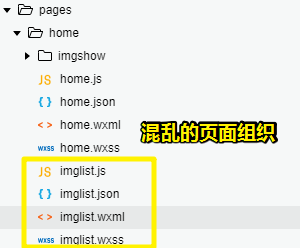
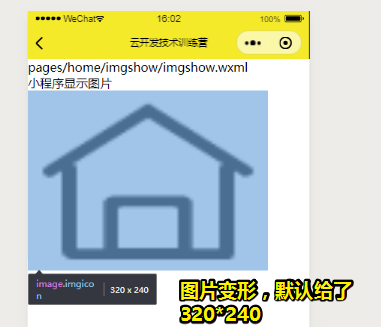
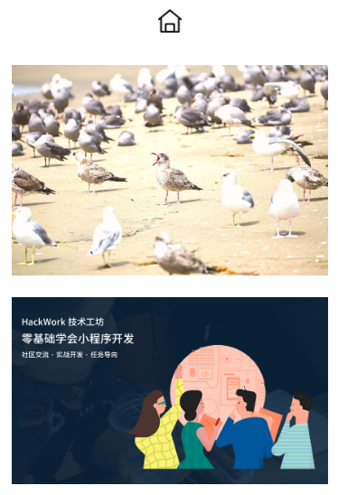
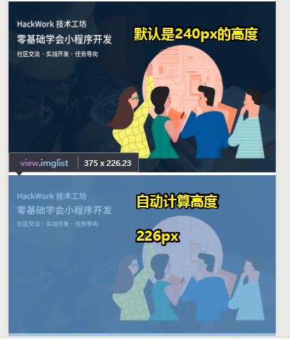
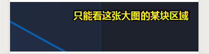
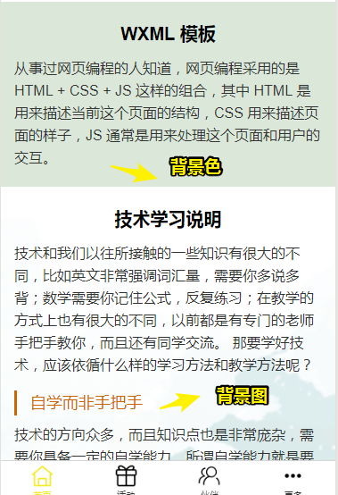
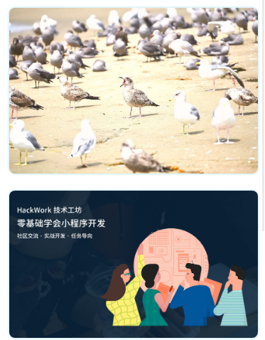
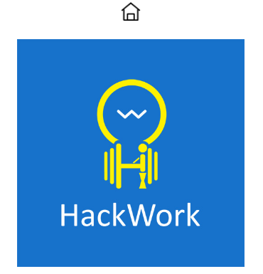
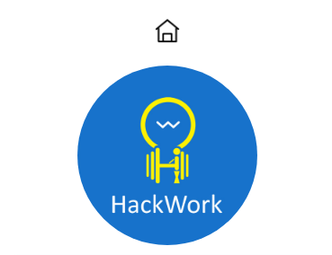
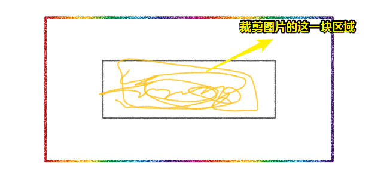

# 链接与图片

前几节的内容做了什么？

> 让我们的小程序有了文字，但小程序的内容形式还不够丰富，比如没有链接，没有图片等元素

那么如何才能有这些元素呢？——这些元素在小程序里也都是通过**组件**来实现的

## ★navigator组件

### ◇概述

在小程序里，我们是通过`navigator`组件来**给页面添加链接**的。有些页面在我们打开小程序的时候就可以看得到，还有些则需要我们通过点击链接进行页面切换才可以看得到，这些我们可以称之为二级页面。

**技术文档**：[navigator组件技术文档](https://developers.weixin.qq.com/miniprogram/dev/component/navigator.html)

### ◇二级页面

**如何搞个二级页面出来了？**

为了**让二级页面与tabBar的页面有更加清晰的结构关系**，我们可以在tabBar对应的页面文件夹下面新建要跳转的页面。比如我们的第一个tabBar是home，凡是home会跳转的二级页面，我们都建在home文件夹里。

因此，我们同样在pages配置项里新建一个页面imgshow，名称大家可以自定义~这样pages配置项的内容如下：

```
"pages/home/home",
"pages/home/imgshow/imgshow",
"pages/list/list",
"pages/partner/partner",
"pages/more/more"
```

然后我们再来在home页面的home.wxml加入以下代码：

```html
<view class="index-link">
  <navigator url="./../home/imgshow/imgshow" class="item-link">让小程序显示图片</navigator>
</view>
```

> 在上面的代码中，我们把navigator组件嵌套在view组件里，当然不嵌套也是可以的。要写一个非常复杂的页面，就会经常用到这种嵌套。

由于navigator组件没有添加样式，所以在视觉上看不出它是一个可以点击的链接，我们在home.wxss里给它添加一个样式：

```css
.item-link{
  margin: 20px;
  padding:10px 15px;
  background-color: #4ea6ec;
  color: #fff;
  border-radius: 4px;
}
```

url是页面跳转链接，大家注意这个路径的写法，我们也可以把上面的链接形式写成以下代码：

```
/pages/home/imgshow/imgshow
```

这两个路径都是指向imgshow页面。

Task：

为什么页面的路径有两个imgshow？比如把路径写成 `/pages/home/imglist`对应的是什么页面？在pages配置项添加一下看看效果。

> 就是 `imglist.wxml`页面啊！home目录里边居然两个页面，一个作为一级页面的`home`，另一个则是作为二级页面的 `imglist`：



这给我的启示是可：一级页面可以自己跳回到自己的一级页面：

```html
<!-- home页面 -->
<view class="index-link">
  <navigator url="/pages/home/home" class="item-link">让小程序显示图片</navigator>
</view>
```

效果类似于咩有效果，如果跳转到二级页面，那么tabBar也会消失！

## ★相对路径与绝对路径

为什么需要去了解路径？

> 那是因为要管理好图片资源、链接（页面）资源、音频资源、视频资源、wxss样式资源等等内部与外部资源，就一定要掌握路径方面的知识。

路径有相对和绝对之分，相对路径使用“`/`”字符作为目录的分隔字符，而我们之前使用的路径基本都是相对路径

- "./" 代表当前目录 ``等同于``
- “../” 代表上一级目录
-  "/"   **当前根目录**，是相对目录；``

> 如果你遇到一个表示的路径的字符串，它以 `/`开头，那么这个 `/`表示的是根路径，即这个项目的根目录，注意，这是相对路径，而不是绝对路径。可以把  `/pages/home/home` 理解成`root/pages/home/home`

那绝对路径呢？比如：

- 网络链接：

```
https://hackwork.oss-cn-shanghai.aliyuncs.com/lesson/weapp/4/weapp.jpg
```

- `C:\Windows\System32`

  这种从**盘符开始**的路径也是绝对路径

总之，通常来说，相对路径用的会比较多一些。

> 我以前认为用 `/`开头表示的是绝对路径，其实不是呀！还是相对路径呀！这是相对于根目录的路径呀！而绝对路径，我们一般是在发送AJAX请求，请求数据的时候有用到啊！

## ★image组件

没有图片的网页就像是水里边没有鱼一样的平淡无奇，说白了就是没有图片的网页并不好看！

那么在小程序里边，我们是如何添加图片的呢？——通过`image`组件的方式来添加

**技术文档**：[image组件技术文档](https://developers.weixin.qq.com/miniprogram/dev/component/image.html)

做法：

1. 把图片放到小程序的`image`目录里边
2. 在imgshow页面下的imgshow.wxml添加以下代码

```html
<view id="imgsection">
  <view class="title">小程序显示图片</view>
  <view class="imglist">
    <image class="imgicon" src="/image/icon-tab1.png"></image>
  </view>
</view>
```

效果（图片默认是64*64）：



> 如果我们不对图片的样式比如高度和宽度进行处理，图片显示就会变形。这是因为小程序会给图片增加一个默认的宽度和高度，宽度为300px，高度为225px。

官方文档给了`300*225`，然而我这里默认的是 `320*240`

虽然图片显示出来了，但是图片光显示出来还是不够的，很多时候我们会对图片**显示出来的大小有要求**，或者对它的**外边距有要求**；利用之前学到的知识，我们也可以给image组件加一些 css样式。比如我们在imgshow.wxss里面添加：

```css
.imglist{
  text-align: center;
}
.imglist .imgicon{
  width: 200px;
  height: 200px;
  margin: 20px;
}
```

## ★云存储

为什么需要图床？

> 我们可以把图片放在小程序的本地文件夹里，也可以把图片放在网上。那如何**把一张图片以链接的方式让其他人看到**呢？这个时候就需要一个专门的存储图片的服务器（图床）了。

**免费的图床：**[腾讯云对象存储COS](https://cloud.tencent.com/login)

做法：

1. 由于我们之前注册过小程序，可以**选择其他登录方式**里的**微信公众号**登录
2. 登录后点击右上角**控制台**，即可进入后台
3. 在工具栏里下拉**云产品**，找到**存储**下面的**对象存储**
4. 在左侧菜单存储桶列表**创建存储桶**（如叫`xly`），只需**注意将访问权限改为公有读私有写**，其他按说明自行操作
5. 创建好存储桶bucket之后，可以把图片上传到对象存储服务器里面，然后分享链接，在本地小程序页面里边测试

测试：

在`imgshow.wmxl`测试一下

```html
<view class="imglist">
    <image class="imgitem" src="https://hackwork.oss-cn-shanghai.aliyuncs.com/lesson/weapp/4/weapp.jpg"></image>
</view>
```

**Task：**

> 除了腾讯云存储以外，比较推荐的还有[七牛云对象存储](https://www.qiniu.com/products/kodo)、[阿里云对象存储OSS](https://www.aliyun.com/product/oss)。云储存除了可以上传图片外，还可以上传其他文件格式，试试看

*注：关于图片的名字最好没有中文*

## ★尺寸单位rpx

**为啥需要rpx单位？**

> 上面的网络图片是变形的，为了让图片不变形，那我们需要给图片添加一个wxss样式，这里就有一个问题，这张图片的宽度为1684px，高度为998px，而手机的宽度却没有这么高的像素。我们想让图片在手机里完整显示而不变形该怎么处理呢？方法之一是我们可以使用尺寸单位rpx。

*注：来iPhone6来说就是375×667*

**技术文档**：[尺寸单位rpx](https://developers.weixin.qq.com/miniprogram/dev/framework/view/wxss.html)

在小程序里，所有的手机屏幕的宽度都为750rpx，我们可以把图片等比缩小。比如给图片添加样式：

```css
.imglist .imgitem{
  width: 700rpx;
  height: 415rpx;
  margin: 20rpx;
}
```

*注：700÷415≈1684÷998，确定好图片的宽度，然后再计算得出图片的高度*

效果：



有了rpx这个尺寸单位，我们可以**确定一个元素在小程序里的精准位置和精准大小，**不过这个尺寸单位处理图片起来经常需要换算挺麻烦的，我们来看下面的处理方法。

## ★图片的裁剪

**为什么需要剪裁图片？**

> 由于我们的图片可能**尺寸大小不一**，或者由于iPhone、安卓手机的尺寸大小不一以及我们对图片显示的要求不一，为了**让我们的图片显示正常**，小程序需要对图片进行一些裁剪。

小程序是通过mode的方式来对图片进行裁剪的，大家可以去阅读一下image组件关于13种mode模式的说明。

> 可以把 `mode`理解成一个API，给`mode`指定不同的参数，就会让图片有不同的效果，如你指定它的参数为 `widthFix`，那么当你明确了图片的宽度，那么它的高度就是自动按图片默认大小比例进行计算的，说白了，就是我们不用计算图片的高度，就能拿到宽高比不变的图片了！

如果我们想处理好上面的图片，我们该怎么处理呢？按照技术文档，我们可以给image组件添加一个widthFix模式：**宽度不变，高度自动变化，保持原图宽高比不变。**

```html
<view class="imglist">
    <image class="imgitem" mode="widthFix" src="https://hackwork.oss-cn-shanghai.aliyuncs.com/lesson/weapp/4/weapp.jpg"></image>
</view>
```

接着，给图片添加wxss样式，明确它的宽度：

```css
.imglist .imgitem{
  width: 100%;
}
```



可以看到，设置图片的宽度为百分比样式，而高度则自动变化，保持原图宽高比不变。

> 百分比是网页、移动端等用来布局以及定义大小的一个非常重要的单位，大家要多学多练多分析哦~

当然，还会有这样一个要求：

> 我们希望图片全屏显示，但是设计师却只给图片预留了一个很小的高度

这样我们就必须对图片进行一定的裁剪了

如这样一张图：[background.png (3840×1000)](https://tcb-1251009918.cos.ap-guangzhou.myqcloud.com/background.png)

做法：

在imgshow.wxml这样写：

```html
<view class="imglist">
    <image class="imgfull" mode="center" src="https://tcb-1251009918.cos.ap-guangzhou.myqcloud.com/background.png"></image>
</view>
```

在imgshow.wxss里面添加一些样式:

```css
.imglist .imgfull{
  width: 100%;
  height: 100px;
}
```

*注：不指定高度，默认裁剪出来的图片就是240px的高度*

效果：



大家可以在开发者工具以及通过扫描开发者工具预览生成的二维码在手机上体验一下，并把这里的`mode=”center”`，换成其他12个模式来了解一下，不同的模式对图片裁剪的影响。

> 图片的处理是一个非常重要的知识点，需要大家多多实践，但是原理和核心知识点都在wxss的样式处理和小程序image组件里，大家可以根据实际需求来应用。

## ★背景属性

> image组件遇上背景图片之不二情书

背景属性也是属于CSS方面的知识，所谓背景属性就是**给组件添加一些颜色背景或者图片背景**。由于css的背景属性尤其是当我们想用一张图片作为组件的背景时，也会涉及到背景图片的位置与裁剪，**这个和小程序image组件的裁剪多少有一些相通之处**，所以我们就把CSS的背景属性放到这里来讲一下~

以下是我们经常会使用到的css背景属性以及相对应的技术文档，和之前我们强调的一样，技术文档是来翻阅和深入学习的，大家可以先用背景属性做出一些效果再说~

|                           背景属性                           |                                  |
| :----------------------------------------------------------: | -------------------------------- |
| [background](http://www.w3school.com.cn/cssref/pr_background.asp) | 在一个声明中设置所有的背景属性。 |
| [background-color](http://www.w3school.com.cn/cssref/pr_background-color.asp) | 设置元素的背景颜色。             |
| [background-image](http://www.w3school.com.cn/cssref/pr_background-image.asp) | 设置元素的背景图像。             |
| [background-size](http://www.w3school.com.cn/cssref/pr_background-size.asp) | 规定背景图片的尺寸。             |
| [background-repeat](http://www.w3school.com.cn/cssref/pr_background-repeat.asp) | 设置是否及如何重复背景图像。     |

比如我们可以给我们之前写好的home页面，id为wxmlinfo的view组件加一个背景颜色以及id为studyweapp的view组件添加一个背景图片：[bg.png (1920×1237)](https://hackwork.oss-cn-shanghai.aliyuncs.com/lesson/weapp/4/bg.png)

```css
#wxmlinfo{
  background-color: #dae7d9;
}
#studyweapp{
  background-image: url(https://hackwork.oss-cn-shanghai.aliyuncs.com/lesson/weapp/4/bg.png);
  background-size: cover;
  background-repeat: no-repeat;
}
```

效果：



> Me：你想要做什么效果？——那么你就边看着文档，边完成你想要的效果。有很多东西，你只有做了，才明白它到底是什么，而只靠自己去yy的话，一辈子都弄不明白它！

> 大家注意，写在wxss里的图片只能来自服务器或者图床，不能放在小程序的文件结构里，这是小程序的一个规定。

## ★图片的边框美化

我们经常在一些app里看到很多图片它有圆角或者阴影，那这个是怎么实现的呢？这些效果是通过css的边框属性来实现的。

大家可以在小程序的image文件夹添加一张深色背景的图片（如果小程序的背景是深色的，图片背景是白色也是可以的）。我们给之前添加的image组件加一个圆角和阴影样式，在imgshow.wxss添加以下代码：

```css
.imglist .img{
  border-radius: 8px;
  box-shadow: 5px 8px 30px rgba(53,178,225,0.26);
}
```

效果：



图片有了圆角，有了阴影就有了一些现代感啦（也就说现代的网页对图片的处理大都如此，总之就是有立体感）

> 这里用到了一个颜色就是rgba颜色值。RGB前面我们要求大家查过，RGBA(R,G,B,A)的R是红色值，G是绿色值，B是蓝色值，R,G,B的值取值范围是0~255，A是Alpha透明度，取值0~1之间，越靠近0越透明。

我们来重新回顾一下边框属[border-radius](http://www.w3school.com.cn/cssref/pr_border-radius.asp)和[box-shadow](http://www.w3school.com.cn/cssref/pr_box-shadow.asp)，大家可以点击链接查看技术文档的详情。

除了圆角，我们经常会有**把图片做成圆形的需求**，我们来看具体的例子。首先在wxml文件里输入以下代码，添加一个logo图片：[logo.jpg (500×500)](https://hackwork.oss-cn-shanghai.aliyuncs.com/lesson/weapp/4/logo.jpg)

```html
<view class="imglist">
    <image class="circle" mode="widthFix" src="https://hackwork.oss-cn-shanghai.aliyuncs.com/lesson/weapp/4/logo.jpg"></image>
</view>
```

此时效果如下：



在与之对应的wxss文件里添加相应的css样式：

```css
.imglist .circle{
  width: 200px;
  height: 200px;
  border-radius: 100%;
}
```

效果：



可见，我们只需要定义了图片长宽之后，再来定义一下`border-radius`为100%即可把图片做成圆形。

## ★view、navigator、image组件嵌套

前面我们学习了Navigator组件里添加一段文字，实现点击文字进行链接的跳转，Navigator组件还可以嵌套view组件，比如我们点击某块的内容会进行一个跳转。和view组件一样， Navigator组件也是可以嵌套的。

```html
<view class="event-list">
    <navigator url="/pages/home/imgshow/imgshow" class="event-link">        
        <view class="event-img">
            <image mode="widthFix" src="https://hackwork.oss-cn-shanghai.aliyuncs.com/lesson/weapp/4/weapp.jpg"></image>
        </view>
        <view class="event-content">
            <view class="event-title">零基础学会小程序开发</view>
            <view class="event-desc">通过两天集中的学习，你会循序渐进的开发出一些具有实际应用场景的小程序。 </view>
            <view class="event-box">
                <view class="event-address">深圳南山</view>
                <view class="event-time">2019年9月22日-23日</view>
            </view>
        </view>
    </navigator>
</view>
```

> HTML里边，a元素是不可以嵌套div的！

在home.wxss里输入以下样式：

```css
.event-list {
  background-color: #fafbfc;
  padding: 20px 0;
}

.event-link {
  margin: 10px;
  border-radius: 5px;
  background-color: #fff;
  box-shadow: 0 0 3px 1px rgba(53, 178, 225, 0.26);
  overflow: hidden;
}

.event-img image {
  width: 100%;
}

.event-content {
  padding: 25rpx;
}

.event-title {
  line-height: 1.7em;
}

.event-desc {
  font-size: 14px;
  color: #666;
  line-height: 1.5em;
  font-weight: 200;
}

.event-box {
  margin-top: 15px;
  overflow: hidden;
}

.event-address, .event-time {
  float: left;
  color: #cecece;
  font-size: 12px;
  padding-right: 15px;
}
```

效果：


## ★总结

> 资源：[链接与图片](https://tencentcloudbase.github.io/handbook/tcb03.html)

- 搞个二级页面

  - 是在`home`页面跳转来到二级页面的，那么这个二级页面的目录就写在那个home页面的目录里边，如这样  `"pages/home/home"` 、`“pages/home/imgshow/imgshow”`
  - 一般 `navigator`组件都会被嵌套在 `view`组件里边，尤其是当你需要写一个非常复杂的页面的时候！

- `navigator`组件的`url`属性值，可以使用相对路径，如拿 `home`页面举例， `./../home/imgshow/imgshow`、`./imgshow/imgshow`、`/pages/home/imgshow/imgshow`

- 图片不给大小，默认是按照 `300px*225px`来显示，所有你需要指定大小，不然图片是会变形的哈！

- 如何云存储图片？让他人都可以通过url来访问图片？——可以用[腾讯云对象存储COS](https://cloud.tencent.com/login)的图床服务，当然，这不只是存储图片，你还可以存储其它的，诸如音频、视频等！

- 关于 `rpx`单位，是 `responsive pixel`的简写，顾名思义，可以根据屏幕宽度进行自适应。不管，你用啥手机打开小程序，都规定屏幕宽为750rpx。如你用「iPhone6」，意味着你的屏幕宽度为 `375px`，该小程序里边的某个页面用了`750rpx`来表示一张图片的宽度，那么这张图片在每台手机上的效果，都是横向占满屏幕宽度的，如你在「iPhone6 Plus」 为`414px`的宽度打开该小程序看这图片，那么图片的宽度就是 `414px`啦！说白了，写小程序页面时，你用 `rpx`、`%`、`em`等这样的单位，会让你的页面，在所有手机上所看到的效果是一致的，相反你用 `px`这样的单位，你指定了图片是 `375px`，那么你在 「iPhone6」上浏览没有问题，但是在 「iPhone6 Plus」上就有问题了，因为它的宽度是 `414px`啊！

- 如何不人工计算，就能拿到等比的图片？如我这张高清大图是 `2000*1028`的，我明确知道这张大图在小程序页面里边是`375px`宽度的或者是  `100%`宽度，那它的高度呢？把`image`组件的 `mode`值 设为 `widthFix`即可，这样，你就不用在CSS里边写上对应的等比高度了！也不用理会小程序默认指定的 `240px`的高度！

- 关于裁剪图片，我们不想让图片变小，只想裁剪图片的某一部分内容，就像这样：

  

  要做到这样，需要用到`mode`的其它值，如 `center`、`top`等，每个不同的值意味着裁剪图片的位置不同，对了，你还得指定裁剪出来的图片大小！总之，`mode`的其它值，相当于是定一个点，然后指定的宽高就是裁剪的大小。[image - 微信开放文档](https://developers.weixin.qq.com/miniprogram/dev/component/image.html)

- 你把二级页面作为`pages`配置项的第一个元素，那么我们配置的 `tabBar`就看不见了！因此，如果你要显示 `tabBar`的话，那么 `pages`配置项的第一个元素一定是 `tabBar` 里边配置的最少2个页面或最多5个页面的其中一个页面路径才行，如果你用的是不包含在其中的其它一级页面，那么也是凉凉的！
- 你想要做什么效果？——那么你就边看着文档，边完成你想要的效果。有很多东西，你只有做了，才明白它到底是什么，而只靠自己去yy的话，一辈子都弄不明白它！
- 写在wxss里的图片只能来自服务器或者图床，不能放在小程序的文件结构里，这是小程序的一个规定。而`image`组件上的`src`属性即可以用绝对路径（url），也可以用相对路径（本地资源）！
- 理解元素的背景图片属性，可以借助image组件的mode属性来理解！
- 如何添加美化`image`组件的边框、阴影？以及如何把图片制作成一个圆形？
- navigator组件可以嵌套view组件、image组件等，而image组件则不能嵌套其它组件！在HTML里边a元素是不能嵌套div的！但小程序提供的navigator组件显然更加的强大！


## ★Q&A

### ①关于 `background-size: cover;`这个属性？

原图：


用了这 `cover` 之后，就会缩放背景图片以完全覆盖背景区，而且尽最大可能保证了背景图片不会被变形，所白了，就是保证了宽高比例，多余的会被裁剪掉！

**➹：**[background-size - CSS: Cascading Style Sheets - MDN](https://developer.mozilla.org/en-US/docs/Web/CSS/background-size)