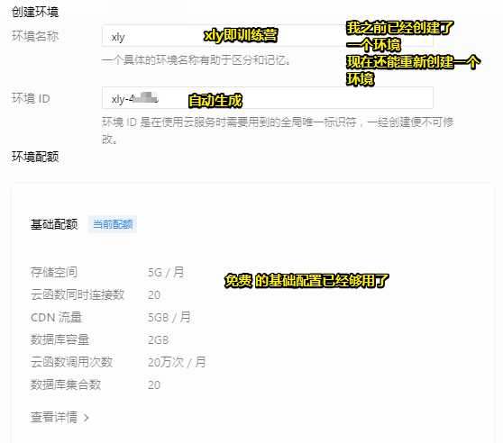
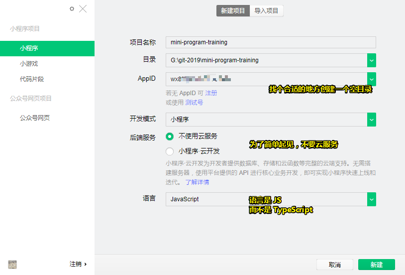
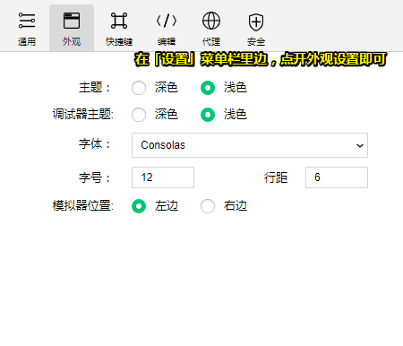
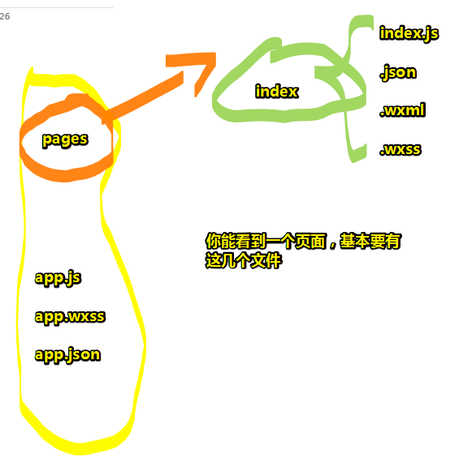
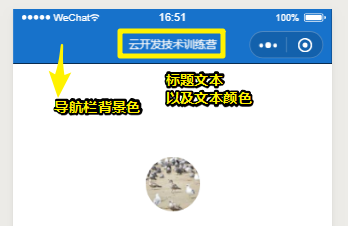
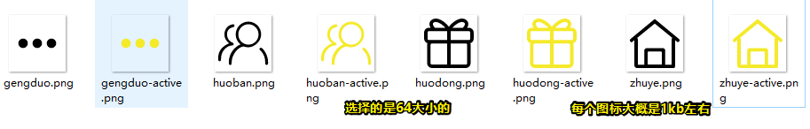
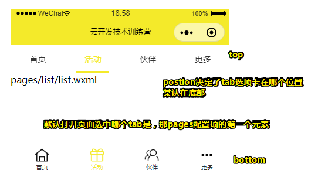
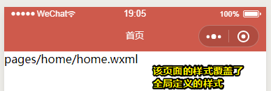

# 小程序开发入门

> 学习技术不要光看视频、教材，**一定要动手实践**。只有实战，技术才会变得简单。小程序相比其他编程语言来说，可以让我们**更快做出一些技术产品**。

## ★开始前准备

> 小程序的开发有两样东西必不可少

- [小程序开发的**技术文档**](https://developers.weixin.qq.com/miniprogram/dev/index.html)「**花五分钟左右的时间**了解大致的结构即可，接下来就根据训练营的教学内容来看即可，看完之后，再去看官网，而不是现在就一口气把官方文档给看完了，毕竟这很难抓重点呀！」
- [小程序的**开发者工具**](https://developers.weixin.qq.com/miniprogram/dev/devtools/download.html)

> **小程序的开发功能更新非常频繁**，很多网上的教程内容都比较过时，而只有技术文档才是同步最新的。无论你是初学者还是高手，技术文档都是我们技术开发的基础与落脚点，**常读常新**

## ★注册微信小程序

- [注册页面](https://mp.weixin.qq.com/wxopen/waregister?action=step1)（注册小程序时不能使用注册过微信公众号、微信开放平台的邮箱）
- [后台管理页面](https://mp.weixin.qq.com/cgi-bin/home?t=home/index&lang=zh_CN)（小程序和微信公众号的登录页都是同一个页面，他们会**根据你的不同的注册邮箱**来进行跳转）

如何找到**AppID(小程序ID)**？—— `小程序的后台管理页/开发/开发设置/开发者ID`，你可以看到小程序的ID（AppID）并不是我们所注册的邮箱和用户名。

## ★开通云开发服务

- **环境名称**和**环境ID**，建议前者叫 `xly`，而后者自动生成即可！



- 环境ID存在的意义？——当你的**云开发环境出现问题**的时候，你可以**提供你的环境ID**，云开发团队会有专人为你**解答**。

## ★新建一个模板小程序



项目名称可用中文。

点击「创建」，就来到了「开发者工具」的地盘了。如果你想改变它的外观，即主题，那么你可以这样做：



如果你想要在手机上查看这个小程序，你可点击 **工具栏**里的**预览**图标，然后就会弹出一个二维码，接着你使用你的手机微信扫描这个二维码就能在微信里看到这个小程序啦！

我们之后是如何开发的？——**新建一个如上所述的模板小程序，然后在这个的基础上修改开发**

注意：没有使用微信登录开发者工具，以及你的微信不是该小程序的开发者是没法预览这个小程序的！关于**Hello World模板小程序**，**虽然它非常简单，但是它的文件结构却是完整的**。总之，你可以放心大胆的使用这个模板来进行二次开发。

## ★文件结构与页面组成

> 什么叫实战学习的方法？——在了解以下知识时，大家只需要结合开发者工具的编辑器对照着介绍，一一展开文件夹、用编辑器查看文件的源代码，**大致浏览一下即可**，而这就是实战学习的方法（和看书、看视频的学习方法不同），千万不要死记硬背哦，你以后用多了自然就记住啦~



### ◇小程序的文件结构

小程序有必不可少的**三个主体文件**（app.js、app.json和app.wxss），而它们在小程序源文件的**根目录**（mini-program-training）下

> 可以理解为 JS 、CSS、JSON

大致了解一下小程序文件结构：

- **app.json**：小程序的**公共设置**，可以对小程序进行全局配置，决定页面文件的路径、窗口表现、设置多 tab 等；
- **app.wxss**：小程序的**公共样式表**，可以配置整个小程序的文字的字体、颜色、背景，图片的大小等**样式**；
- **app.js**：小程序的逻辑（这个可以先放着，不用管）
- **pages文件夹**：这里存放着小程序的所有页面，展开pages文件夹就可以看到有index和logs两个**页面文件夹**；

### ◇小程序的页面组成

在每一个页面文件夹里都有**四个文件**，这四个文件的名称都是一样的，它们分别为：

- **json文件**，和上面的app.json作用基本相同，只是app.json控制的是整个小程序的设置，而页面的json文件**只控制单个页面的配置**（因为**有时候全局配置就够用了，所以页面配置有时候是空的**）；
- **wxml文件**，小程序的页面结构，文字、图片、音乐、视频、地图、轮播等组件都会放在这里；
- **wxss文件**，小程序的页面样式，和app.wxss一样是控制样式，而页面的wxss文件是控制单个页面的样式；
- **js文件**，这个是控制小程序页面的逻辑（这个可以先放着，不用管）

## ★小程序的全局配置

话说，如何对整个小程序进行**全局配置**呢？

找到根目录下的 **app.json** 文件，然后根据 [小程序全局配置](https://developers.weixin.qq.com/miniprogram/dev/reference/configuration/app.html) 这个技术文档来配就好了！

### ◇json语法

> 只需要记住没有单引号，以及数据之间才有逗号即可！

- 大括号`{}`**保存对象**，你可以仔细看看看 app.json 里边的内容，如哪些地方用到了大括号`{}`，而`{}`里面就是对象啦；（括号里边应该是键值对才对吧！）
- 中括号`[]`保存数组，我们可以看到中括号`[]`里有`“pages/index/index”`等（这是小程序页面的路径），那这些页面路径就是数组啦；数组里的值都是平级的关系；
- 各个数据之间由**英文字符逗号,**隔开，注意这里的数据包括对象、数据、单条属性与值，大家可以结合app.json**仔细比对逗号,出现的位置**，**平级数据的最后一条数据不要加逗号,**，也就是**只有数据之间才有逗号**。
- 字段名称（**属性名**）与值之间用**冒号**`:`隔开，字段名称在前，字段的取值在后；
- 字段名称用**双引号** `“”` 给包着；

> 注意，这里所有的标点符号都需要是**英文状态**下的，也就是我们经常听说的全角半角里的半角状态，不然会报错哦。**很多之前没有接触过编程的童鞋经常会犯这样的错误，一定要多多注意！**当我们要输入编程里的标点符号时，一定要先确认一下，你的输入法是汉语形态，还是字母形态，如果输的是汉字形态，一定要切换哦~

### ◇设置小程序窗口表现

找到 **window** 字段，它的 Value 是个对象，而对象里边是一组数据的集合，而这集合里边包含着几条数据

```json
{
	"window": {
    "backgroundTextStyle": "light",
    "navigationBarBackgroundColor": "#fff",
    "navigationBarTitleText": "WeChat",
    "navigationBarTextStyle": "black"
  }
}
```

以上，就是**window配置项**啦，它可用于设置小程序的状态栏、导航条、标题、窗口背景色。

当然，这不止4条数据，还有其它的，具体请看：[全局配置 - 微信开放文档](https://developers.weixin.qq.com/miniprogram/dev/reference/configuration/app.html#window)

测试，CRM大法：

```json
{
  "window": {
    "backgroundTextStyle": "dark",   
    "navigationBarBackgroundColor": "#1772cb",
    "navigationBarTitleText": "云开发技术训练营", 
    "navigationBarTextStyle": "white"  
  }
}
```

> backgroundTextStyle只有在设置了下拉刷新样式时才会比较明显



问题：

1. 十六进制颜色值是啥？——[CSS 颜色十六进制值](https://www.w3school.com.cn/cssref/css_colorsfull.asp)，以 “`#`” 开头，由`0~9`、`A~F`（或`a~f`，**不区分大小写**）组成，格式为 `#RRGGBB`，其中：RR 代表红色，GG 代表绿色，BB 代表蓝色，所有值必须介于 0 和 FF 之间，即每种颜色的最小值为 0，最大值为 FF。每个值都一样时，可简写成一半，如 `#000000`，可简写成 `#000`。使用6位数可提供巨大数量的颜色变化，这也是为什么不用一位或二位来表示的原因所在，由于一个位可取16种值，而总共有6个位，所以可表示的可能颜色有1600万种，可见这颜色选择甚是丰富呀！
2. 取色工具怎么用？——使用 Snipaste 就好了
3. RGB颜色与十六进制颜色如何转换？—— [RGB颜色值与十六进制颜色码转换工具](https://www.sioe.cn/yingyong/yanse-rgb-16/)

## ★新建小程序页面

如何**新建小程序页面**呢？

有两种姿势：

1. 使用开发者工具在**pages文件夹**下新建
2. 通过app.json的pages配置项来新建（推荐使用）

### ◇通过app.json新建页面

page配置项是用来干嘛的呢？——它是用来设置页面路径的！而我们在小程序里写的每一个页面都需要填写在这里

测试：

> 在pages配置项里新建一个home页面（**页面名称可以是任意英文名**）

完pages字段里边添加一个元素即可：

```
"pages/home/home"
```

可以看到在pages目录里边自动生成了一个home目录，而且该目录还自动新建了四个页面文件

Task：

- 添加其它页面：如`list`、`partner`、`more`等（**页面名称**可以根据自己需要来命名）
- 新建的页面文件都在电脑上的什么位置？——开发者工具右键点击home文件夹或者home.wxml，然后选择「**在硬盘打开**」即可看到

### ◇小程序的首页

> 在[pages配置项](https://developers.weixin.qq.com/miniprogram/dev/reference/configuration/app.html#pages)的技术文档里有这样一句：“**数组的第一项代表小程序的初始页面**”，是什么意思呢？

说白了，就是你打开小程序所看到的第一个页面啦！

Task：

- 是用新建页面的第1种方法：右键 新建目录，输入目录名 为 post，然后右键该post目录，新建页面，同样输入 post，然后就会自动生成4个叫 post 的文件了，与此同时是`pages`配置项 多了一个元素 `"pages/post/post"`

### ◇了解配置项的书写方式

在前面我们已经了解了window配置项、pages配置项，在技术文档[小程序全局配置](https://developers.weixin.qq.com/miniprogram/dev/reference/configuration/app.html)了解到window、pages这些都是全局配置项的**属性**，全局配置项的属性还有tabBar、networkTimeout、usingComponents、permission等，大家可以在技术文档里了解每个属性的描述，大致了解他们的功能。

宏观了解一下配置项的书写语法：

- **每个配置项**比如pages、window都用**引号`“”`**包住，**冒号`:`**后面是配置项的属性与值；
- 每个配置项之间用**逗号,**隔开，最后一项**没有逗号**，**配置项是平级关系**，不要把tabBar配置项写到window配置项里面了；
- 配置项里面的数组或对象的最后一项**也没有逗号**
- 书写时注意缩进，**大括号{}、中括号[]都是成对书写**，即使是嵌套时也不能有遗漏}或]；

```json
{
  "pages": [
    "pages/list/list",
    "pages/home/home",
    "pages/partner/partner",
    "pages/more/more",
    "pages/post/post"
  ],
  "window": {
    "backgroundTextStyle": "dark",
    "navigationBarBackgroundColor": "#1772cb",
    "navigationBarTitleText": "云开发技术训练营",
    "navigationBarTextStyle": "white"
  },
  "tabBar": {
    "list": [
      {
        "pagePath": "pages/list/list",
        "text": "list"
      },
      {
        "pagePath": "pages/home/home",
        "text": "home"
      },
      {
        "pagePath": "pages/more/more",
        "text": "more"
      },
      {
        "pagePath": "pages/list/list",
        "text": "list"
      }
    ]
  },
  "networkTimeout": {
    "request": 10000,
    "downloadFile": 10000
  },
  "debug":true,
  "navigateToMiniProgramAppIdList": [
    "wxe5f52902cf4de896"
  ],
  "sitemapLocation": "sitemap.json"
}
```

debug这个配置项很有用啊！可以看到页面是怎么加载的；tabBar则是用了做底部的Tab切换的！

## ★配置tabBar配置项

> 在很多App的底部都有一个**带有小图标**的切换tab，比如手机微信App底部就有微信、通讯录、发现、我四个tab，这个小图标就是icon，整个呢就是tabBar，小程序也可以有，需要我们在app.json里配置tabBar配置项。

### ◇icon下载

在官方技术文档里我们了解到icon 大小限制为40kb，建议尺寸为81px * 81px（大一点是可以的），不懂设计icon的童鞋可以去矢量图标库去下载。（**注意下载的格式要是png哦**）

**icon资源：**[iconfont阿里巴巴矢量图标库](http://www.iconfont.cn/)

大家可以留意下手机微信的tabBar的**每一个icon其实是一组两个**，也就是**选中时的状态和没有选中时的状态**，他们的颜色也是不一样的，而在iconfont里大家除了选择图标还可以选择**不同的颜色**来下载哦。比如我们要让tabBar有四个切换tab，那么我们就需要下载4个icon的两种配色共8张图片。

使用开发者工具在**模板小程序的根目录下**新建一个image的文件夹，把命名好的icon都放在里面，这个时候你的文件夹结构如下：

```
小程序的根目录         
├── image  
│   ├── icon-tab1.png
│   ├── icon-tab1-active.png
├── pages 
├── utils 
├── app.js
├── app.json
├── app.wxss
├── project.config.json
├── sitemap.json
```

> icon的配色最好是一明一暗，而且与你的小程序的整体颜色风格保持一致，这样切换起来才不会突兀；选择的这4个icon的风格最好一致，不然tabBar就不会好看啦。icon的名称最好也一致，比如home对应的icon可以为home.icon和home-active.icon。

> 注意：图片的名称必须是英文，不要用中文。页面也好、文件也好、文件夹的名称也好，都要使用英文，里面的标点符号也必须是英文字符。

Task：

- 根据添加的页面，找到相应的语义化图标，然后批量去色，下载图标，修改图标名字，每个图标都得下载两次，一次是原色，一次是追加了颜色的色！文件格式为png



注：图标的icon名字，应该与页面的名字一致才对，不过我这里，就将就一下就好了。总之，理应是 `home.png`而不是 `zhuye.png`

### ◇配置tabBar配置项

通过tabBar配置项，可以设置tabBar的默认字体颜色、选中过的字体颜色、背景色等。

**技术文档：**[tabBar配置项](https://developers.weixin.qq.com/miniprogram/dev/reference/configuration/app.html#tabBar)

通过技术文档，我们先**大致了解**color、selectedColor、backgroundColor的意思。然后使用开发者工具打开app.json在window配置项后面新建一个tabBar配置项，代码如下：

```
{
 "tabBar": {
    "color": "#333",
    "selectedColor": "#f4ea2a",
    "backgroundColor": "#ffffff",
    "list": [
      {
        "pagePath": "pages/home/home",
        "iconPath": "image/zhuye.png",
        "selectedIconPath": "image/zhuye-active.png",
        "text": "首页"
      },
      {
        "pagePath": "pages/list/list",
        "iconPath": "image/huodong.png",
        "selectedIconPath": "image/huodong-active.png",
        "text": "活动"
      },
      {
        "pagePath": "pages/partner/partner",
        "iconPath": "image/huoban.png",
        "selectedIconPath": "image/huoban-active.png",
        "text": "伙伴"
      },
      {
        "pagePath": "pages/more/more",
        "iconPath": "image/gengduo.png",
        "selectedIconPath": "image/gengduo-active.png",
        "text": "更多"
      }
    ]
  }
}
```

这里有一个比较重要的属性就是list，它是一个**数组**，决定了tabBar上面的文字、icon、以及点击之后的跳转链接。

- pagePath**必须为**我们在pages配置项里建好的页面
- text是tab按钮上的文字
- iconPath、selectedIconPath分别为没有选中时的图片路径和选中时的图片路径。

Task：

> 你知道应该如何制作一个底部没有tabBar的小程序吗？要让tabBar没有icon，应该如何配置？给tabBar添加一个position属性，值为top，小程序在界面上会有什么变化？再给小程序新增几个页面（不添加到tabBar上），我们应该如何在模拟器看到页面的内容？



最后一个问题，难道使用导航条标签吗？

## ★小程序的页面配置

使用打开一个页面的页面json文件，比如home的home.json，在json里面新建一些配置信息，如下所示。

**技术文档：**[小程序页面配置](https://developers.weixin.qq.com/miniprogram/dev/reference/configuration/page.html)

```json
{
  "usingComponents": {},
  "navigationBarBackgroundColor": "#ce5a4c",
  "navigationBarTextStyle": "white",
  "navigationBarTitleText": "首页",
  "backgroundColor": "#eeeeee",
  "backgroundTextStyle": "light"
}
```

配置的属性与值的含义我们可以结合实际的效果以及技术文档来了解。



Task：

> 了解一下给小程序的页面配置前和配置后，页面哪些地方变动了？你是否对技术文档里“页面中配置项在当前页面会覆盖  `app.json` 的  `window` 中相同的配置项。”有了一定的认识？

window配置项是这样的：

```json
{
 "window": {
    "backgroundTextStyle": "dark",
    "navigationBarBackgroundColor": "#f4ea2a",
    "navigationBarTitleText": "云开发技术训练营",
    "navigationBarTextStyle": "black"
  }
}
```

可见，是直接重写相同的属性值，来进行覆盖的！

## ★总结

- 一些东西的叫法：
  - 开发工具最顶部的叫菜单栏
  - 菜单栏下边罗列很多的工具，即这是工具栏，说白了，之所以叫工具栏是因为，点击它们都具有某种实用价值
  - app.json里边的字段，叫配置项，如 `pages`配置项、 `tabBar`配置项
  - 一个对象里边的键值对，可以叫做一条数据！可以管对象叫做一组数据的集合！
- JOSN语法：没有单引号，数据之间才有逗号分隔
- 如何创建一个小程序项目？
  - 新建一个空目录，然后让开发者工具自动生成一些目录和文件，千万不要在 github 上创建了一个项目`xxx`，然后 再本地初始化了一个叫 `xxx`目录，而且其中存在诸如 `README.md`的文件。如果你这样做了，那么把这个 `xxx`项目当作是小程序项目引入的话，是没有自动生成的目录和文件的。总之，你就先在github上创建一个空仓库 `zzz`，然后再本地创建一个小程序项目 `zzz`，然后使用开发者工具初始化这个 `zzz` 项目为小程序项目，接着就是提交到远程的 `zzz` 项目里边即可
  - 基于这个模板小程序，开发我们的小程序项目
- 如何创建一个新的页面？
  1. 为`pages`配置项添加元素 
  2. 右击pages添加
- 如何处理小程序项目里边的icon？
  - 使用iconfont
  - 找到合适的语义化图标
  - 批量取色这些图标
  - 下载图标，每个图标下载2次，一次是有颜色的（`home-active.png`），一次时没有颜色的 （`home.png`）
  - 图标的名字，最后与要跳转的页面名字一致，由于存在一种图标存在两颜色，所以有颜色的添加 `active`后缀，而没有的那就算了。
  - 图标尺寸我选择64的！
- 如何搞一个 Tab 选择卡？就像是微信里边下发有4个Tab
  - 配置 tabBar 配置项即可。如果不会配，那就看官方文档呗！
- 页面想要覆盖全局配置的样式？——找到该页面的json文件，那后写上对应的属性即可！