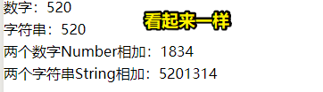
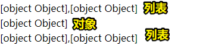
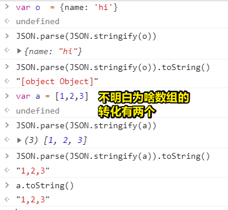

# 数据绑定

## ★概述

什么是数据绑定？

> 就是把 WXML 中的一些动态数据分离出来放到对应的js文件的 Page 的 data里

数据绑定这个概念其实很多学过网页开发的朋友也会比较困惑。大家可以不必执着于这个**深奥的**概念，而是**先来动手做一下了解是一个什么效果**。在潜移默化里，你会get到前端里一个非常了不得的技术知识哦

> 什么是动态的数据？显而易见的是这个数据是会动的，即不是一层不变的，你想让它变成啥数据就变成啥数据！

## ★把数据分离出来

如何体现数据分离？

1. wxml里边使用大胡子语法，即写个模板标签，如 `{\{hi}\}`
2. 在相应的js文件里边的data里边，添加个键值对，如`hi:'hi'`

## ★数据类型

WXML 中的**动态数据均来自对应 Page 的 data**。 data 是小程序的页面第一次渲染使用的**初始数据**。小程序的页面加载时， data 将会以 JSON字符串的形式由逻辑层传至渲染层，因此 data中的数据必须是可以转成 JSON的类型：字符串String，数字Number，布尔值Boolean，对象Object，数组Array。

- **字符串String**，用于存储和处理文本，可以结合Excel单元格格式里的文本格式来理解；
- **数字Number**，这个很好理解，比如233这个数，它的数字格式和文本格式是有很大不同的，学Excel一定不会陌生；
- **布尔值Boolean**，就是true和false，虽然只有两个值，但是它代表着两种选择，两种不同的条件，两种不同的结果；
- **对象Object**，结合之前所学，我们再来回顾一下：对象由大括号{}分隔，在大括号{}内部，对象的属性以名称和值对的形式 name : value来定义，属性由逗号,分隔
- **数组Array**，结合之前所学，我们再来回顾一下：数组由中括号[ ]来分割，有点类似于列表；

> 数据类型在编程语言里是一个非常重要的概念，大家可以先只需要知道是啥就可以，不必强行理解哦。就像我们把不同的人分为男、女、深圳人、程序员等不同类型一样**，数据类型就是一种对不同类型的数据进行了一个分类而已**，只是为了**区分它们**才有了不同的格式规范它们。

都是二进制数据0和1，但是就是有类型的区分，而不同的数据类型意味着程序的处理规则也会有所不同。

## ★组件属性的渲染

通过数据绑定，我们还可以把 style、class 、id等属性分离出来来控制组件的样式等信息。

如这样：

```html
<navigator id="item-{{id}}" class="{{itemclass}}" url="{{itemurl}}" >
  <image style="width: {{imagewidth}}" mode="{{imagemode}}" src="{{imagesrc}}"></image>
</navigator>
```

为啥要用数据绑定？

如果不用数据绑定，那么当面对有大量重复的组件时，那么得复制许多遍，如果其中有一个属性值需要改，那么所有组件都得改一次，可见这是很麻烦的，也容易犯错

而使用了数据绑定，那么就可以统一管理数据了！这样数据出错，那就直接改数据，而不是改视图！

总之：

> 用数据绑定的好处是为我们以后添加大量数据以及进行编程更新打下了基础。

## ★字符串与数字

数字Number与字符串String在Excel里是不同的，在小程序（也就是JavaScript）里也是不同的。

即它们的计算规则是不同的！如一个字符串+一个字符串，一个数值加一个数值

在 JS 里边，区分一个数据是不是字符串，得看你有没有加单引号或者是双引号

而在页面里边它们俩的呈现都长得一样！



## ★渲染数组里的单条数据

**pages配置项**就是小程序里所有页面的一个列表。数组Array是值的**有序**集合，每个值叫做一个元素，而每个元素在数组中有一个位置，以数字表示，称为**索引**。这个索引是从0开始的非负整数，也就是0，1，2，3，4，5…..

用法：

```
{\{xx[0]}\}
xx: ['hi','hiii']
```

在视图里边，即便用了 `xx[3]`也不会报错！

## ★渲染对象类型的数据

对象（object）是 JavaScript 语言的核心概念，也是**最重要的数据类型**。对象是一个包含相关数据和方法的集合（通常由一些变量和函数组成，我们称之为对象里面的**属性**和**方法**）。

有的时候一个对象有多个属性，就拿电影来说，就有电影名称，国家，发行时间、票价、评价等等无数个属性，我们该如何把这些呈现在页面上呢？

1. 确定一个对象名
2. 构造一个对象出来

拿到对象数据的姿势是「**对象的点表示法**」

## ★复杂的数据嵌套

对象是可以嵌套的，也就是一个对象可以作为另外一个对象的值，除了对象里套对象，数组里也可以套对象，对象里也可以套数组。把现实生活中的事物转化成错综复杂的数据，是非常重要的数据思维。

如：如何构造出豆瓣top5的数据出来？

1. 它是一个列表
2. 列表里边是一个个对象
3. 而一个个对象是一部部电影
4. 一部部电影都包含这样的属性：导演、编剧、演员、演员名单……
5. 而演员名单又是一个个列表
6. 而每个演员又有复杂的属性，比如姓名、出身年月、所获奖项（列表）…真的是子子孙孙无穷尽

简单的数据我们可以写在data里面，但如此复杂的数据就要使用到数据库了

千万不要渲染一个对象或者是一个数组到页面里边去，不然，结果就这样：



The default conversion from an object to string is `"[object Object]"`.

测试：



回顾HTML代码：

```html
<view>{{movies}}</view>
<view>{{movies[1]}}</view>
<view>{{movies[1].actor}}</view>
```

movies是一个列表，它有两个对象元素，因此它就有两个字符串化的对象！

以上我们只是输出了**数组里的单条数据，或者对象嵌套的数据里的单条数据**，如果是商品列表、电影列表、新闻列表这些我们应该如何渲染到页面呢？后面一节我们将会介绍**列表渲染和条件渲染。**

## ★总结

- 如何把一些东西抽象成一堆数据呢？——即我要用数据来表示一个东西！

- 如何在一堆东西里边找到结构一样的东西呢？——即我要找到模板！

- 一张表里边的每条数据就是一个个对象，而这张表可以看作是数组！

- 组件内容可以用大胡子语法渲染，组件属性也可以用大胡子语法渲染！

- data里边的键值对，你怎么写 JS ，那么你就怎么写它！

- WXML 中的动态数据均来自对应 Page 的 data。 data 是小程序的页面第一次渲染使用的**初始数据**。小程序的页面加载时， data 将会以 JSON字符串的形式由逻辑层传至渲染层，因此 data中的数据必须是可以转成 JSON的类型：字符串String，数字Number，布尔值Boolean，对象Object，数组Array。

  函数、undefined什么的都可以呀！只是这样用没啥意义！

- 能存储数据的，简单的字符串等，复杂的则是数组、对象

- 把现实生活中的事物转化成错综复杂的数据，是非常重要的数据思维。

- 何时用data？——数据简单。何时用数据库？——数据复杂。（很多级嵌套，数据量很大）


### ★Q&A

### ①元芳，你怎么看数据分离？

什么时候需要数据分离？

- 数据不是静态的，而是动态变化的

前端MVC思想！

**➹：**[如何理解web开发中的表现与数据分离？ - 知乎](https://www.zhihu.com/question/21338040)

### ②Web语义化？

**➹：**[如何理解 Web 语义化？ - 知乎](https://www.zhihu.com/question/20455165)

**➹：**[谈谈你对web语义化的理解 - running - CSDN博客](https://blog.csdn.net/u010543271/article/details/50855363)

