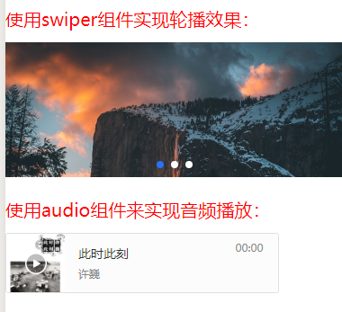
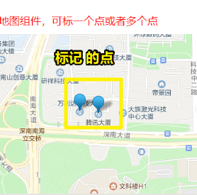

# 小程序组件

在前面我们已经接触过表示文本的 `<text>` 组件、表示图像的 `<image>` 组件、表示视图容器的 `<view>` 组件，表示链接的 `<navigator>` 组件，这些组件大大**丰富了小程序的结构布局和元素类型**，接下来我们还将介绍一些组件。

## ★组件的属性

前面我们已经通过实战的方式接触了一些组件，这个时候我们再回头理解一些基础的概念，那就是组件的属性。

公共属性是指小程序所有的组件都有的属性，比如id、class、style等，而不同属性的值就是数据，有数据就有数据类型。

**技术文档：**[小程序组件](https://developers.weixin.qq.com/miniprogram/dev/framework/view/component.html)

大家可以打开上面的技术文档，快速了解一下组件的公共属性有哪些，以及属性有哪些类型，各个类型的数据类型和取值说明。而不同的组件除了都有公共属性外，还有自己的特有属性。**查阅技术文档，大家能够理解多少是多少，不要去强行理解和记忆**。在实际开发中，很多属性我们不会用到

> 小任务：通过技术文档了解一下 `text` 组件、 `image` 组件、 `view` 组件、 `navigator` 组件有哪些私有属性

擅于查阅技术文档，是**任何方向的程序员必备的非常重要的能力**，就跟学英语查词典一样。在实际开发中，**一个新的技术方向你所能依赖的不再有老师这样的角色，因为没有人有义务教你**。技术文档和搜索能力是你最可信赖的依靠。

## ★其它组件

- 实现轮播效果的`swiper`组件，**技术文档：**[轮播组件swiper](https://developers.weixin.qq.com/miniprogram/dev/component/swiper.html)
- 实现音频的`audio`组件，**技术文档：**[audio组件技术文档](https://developers.weixin.qq.com/miniprogram/dev/component/audio.html)，可能由于audio组件使用的场景和频次都非常低，audio组件以后就要被抛弃了，需要用到小程序的API来创建音乐播放。

- 实现视频的`video`组件，**技术文档：**[video组件技术文档](https://developers.weixin.qq.com/miniprogram/dev/component/video.html)

  如何理解这些组件的一个个的属性？——结合实际效果和技术文档来理解，如添加或不要某些属性！

- cover效果：可以把view、图片组件覆盖在地图map或视频video组件之上。比如我们希望在视频的左上角显示视频的标题以及在右上角显示商家的logo，就可以使用cover效果。

  

- 地图组件：**技术文档：**[Map组件技术文档](https://developers.weixin.qq.com/miniprogram/dev/component/map.html)

  要想在地图上标记一个地点，首先我们需要知道该地点的经纬度，这个时候就需要使用到坐标拾取器的工具。

  **经纬度获取：**[腾讯地图坐标拾取器](https://lbs.qq.com/tool/getpoint/index.html)

  还可以**在地图上标记多个点**，通过 `markers`这个属性可以做到，它是个数组类型的属性，数组里边有多少个元素，那么地图上就有多少个标记！

  

## ★总结

> [小程序组件](https://tencentcloudbase.github.io/handbook/tcb08.html)

- 关于组件的属性，是有属性类型的，而所谓的类型指的就是它的值所表示的数据类型！属性有公共属性和特殊属性之分，前者大家都有，而后者则是几乎所有组件都有各自定义的属性！

  总之，属性是用来修饰这个组件的，属性的作用无外乎两个，一个是样式，一个是行为！

  属性是布尔类型的很常用，写上该属性就是true，不写就是false！如video组件的 `muted`属性，它表示是否静音播放。

## ★Q&A

### ①组件？

一个组件的概述：

➹：[基础组件 - 微信开放文档](https://developers.weixin.qq.com/miniprogram/dev/framework/view/component.html)

各名词区分：

➹：[怎样精确区分这些名词：库、插件、组件、控件、扩展？ - 知乎](https://www.zhihu.com/question/49536781)

