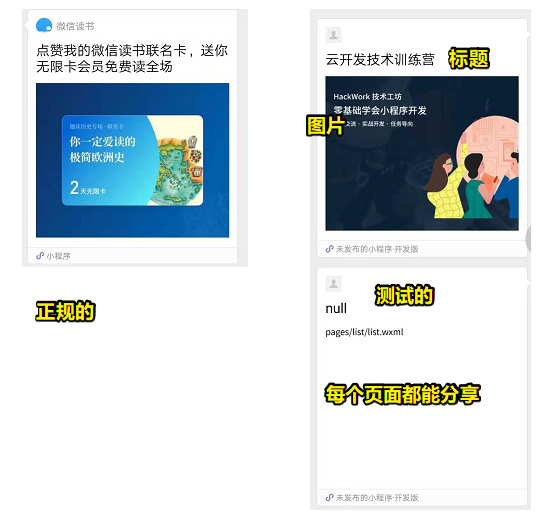
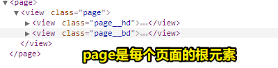
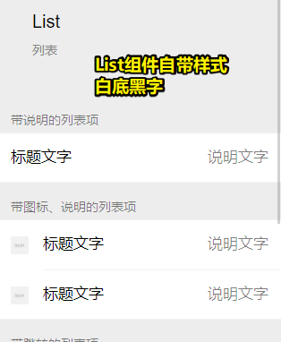
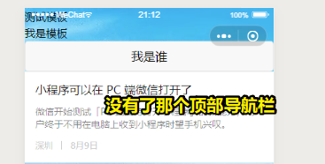
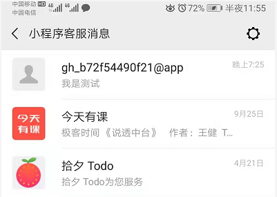

# 优化与部署上线

通过前面的实战学习，相信大家在写代码的过程中，遇到了很多问题，在不断解决问题的过程中也总结了一些经验。在这一部分会总结一些开发中的经验以及小程序的优化、部署、上线。

## ★开发着工具的使用

### **◇缩进与缩进设置**

缩进的意义：

> 缩进并不会对小程序的代码产生什么影响（Python才会严格强调缩进，不同的缩进也有不同的意义），但是为了代码的**可读性**，缩进是必不可少的。缩进除了美观，还可以体现逻辑上的层次关系，鼠标移到编辑器显示代码行数的地方，可以看到有**–**减号，点击即对代码进行折叠与展开，这一功能在开发上可以让我们更容易理清代码的层次、嵌套关系，避免出现少了闭合的情况。

哪些文件需要缩进？

> 小程序的wxml、js、json、wxss等不同的文件类型，开发时，在缩进的安排上也会有所不同。这个就需要大家自己去阅读其他优秀项目的源代码来领会

缩进的方式？

> 缩进有两种方式，一种是使用Tab键，还有一种是使用空格，建议大家使用Tab。小程序默认一个缩进=一个Tab=2个空格，通常前端开发是一个Tab=4个空格，你如果不习惯，可以在设置里进行设置。

我习惯是一个Tab，2个空格。而WeUI则是所有文件都是4空格。

经验之谈？——论代码可读性的意义

> **代码的可读、美观甚至优雅，是一个优秀的程序员应该去追求的**，缩进也只是其中很小的一环。代码可读性高，既提升自己的开发效率，也利于团队的分享与协作，后期的维护等等。

### ◇**快捷键**

#### 概述

微信开发者工具也有着和其他IDE和代码编辑器比较一致的快捷键，通过使用这些快捷键，可以大大提升我们编写代码的效率。Mac和Windows的快捷键组合略微会有所不同，大家可以自行阅读技术文档来了解。

**技术文档：**[微信开发者工具快捷键](https://developers.weixin.qq.com/miniprogram/dev/devtools/shortcut.html)

#### 目的

> 快捷键的目的是**为了自己编写代码的方便**，每个人的快捷键的使用习惯都会有所不同。当然最简单通用的Ctrl+C复制、Ctrl+V粘贴、Ctrl+X剪切、Ctrl+Z重做、Ctrl+S保存，Ctrl+F搜索等这些快捷键组合是非常通用的，建议大家都掌握。

凡是通用的快捷键都应该去掌握

#### 常用的快捷键（微信开发者工具）

微信开发者工具的快捷键组合里有几个值得大家多使用：

- 批量注释快捷键：windows 是Ctrl+/，Mac是Command+/
- 代码块的缩进：windows是代码左缩进ctrl + [、代码右缩进ctrl + ]，相应的Mac是⌘ + [ 和 ⌘ + ]
- 格式化代码：Windows为shift + alt + F、Mac为⇧ + ⌥ + F

#### 更多快捷键

> 官方快捷键文档写得很不全，建议大家参考下面Visual Studio Code的快捷键PDF来对快捷键有一个更全面的了解。[Mac快捷键](https://code.visualstudio.com/shortcuts/keyboard-shortcuts-macos.pdf)、[Windows快捷键](https://code.visualstudio.com/shortcuts/keyboard-shortcuts-windows.pdf)，使用快捷键的目的是为了提升开发的效率，一切还是以你的习惯为主，不要为了快捷键而快捷键。

即便是用鼠标点也行，你习惯就好！

### ◇**报错提醒**

- 开发者工具**调试器**里的**Console**：它会比较有效的指出代码的错误的信息、位置等，是日常开发**非常非常重要**的工具，堪称编程的指路明灯
- 你要去做的：大家**务必**要养成**查看错误Console的习惯**，也要**善于根据报错信息去搜索相关的解决方法**。
- 小程序的代码编辑器也会为我们提供一些错误信息，比如出现红色的 `~` ，这个时候就要注意啦，你是不是出现字符是中文，漏了标点符号等比较低级而小儿科的错误。

### ◇**wxml代码查看**

> 开发者工具**调试器**里除了有**Console**，还有一个wxml标签页（可能被折叠，需要你展开），它可以让我们了解当前小程序页面的wxml和wxss结构构成，可以用来调试组件的css样式等。不过这个工具目前体验还特别糟糕。

一般用来修改样式的！不过体验是真得辣鸡！

### ◇**自动补全与代码提示**

小程序开发者工具是提供一些代码自动补全与代码提示的，具体情况大家可以看一下[官方文档关于自动补全](https://developers.weixin.qq.com/miniprogram/dev/devtools/edit.html#自动补全)的内容。在平时开发的过程中也可以多留意与摸索。

## ★小程序的转发功能

我们只需要在小程序每个页面的js文件下的Page({ }） 里面，添加以下代码，我们的小程序就有转发功能了，这个可以通过点击开发者工具的预览用手机来体验哦

**技术文档：**[小程序的转发](https://developers.weixin.qq.com/miniprogram/dev/reference/api/Page.html#onShareAppMessage-Object-object)

```js
onShareAppMessage: function (res) {
        if (res.from === 'button') {
            // 来自页面内转发按钮
            console.log(res.target)
        }
        return {
            title: '云开发技术训练营',
            path: "pages/home/home,
            imageUrl:"https://hackwork.oss-cn-shanghai.aliyuncs.com/lesson/weapp/4/weapp.jpg",
            success: function (res) {
                // 转发成功
            },
            fail: function (res) {
                // 转发失败
            }
        }
    },
```

- title为转发的标题，如果不填，默认为当前小程序的名称；
- path为当前页面路径，也可以为其他页面的路径，如果路径写错的话会显示“当前页面不存在”哦。
- imageUrl为自定义图片路径，可以是本地文件路径或网络图片路径。支持PNG及JPG。显示图片长宽比是 5:4。如果不填写会取当前页面，从顶部开始，高度为 80% 屏幕宽度的图像作为转发图片

> 该功能的效果，就是他人分享一个小程序给你的那样所呈现的效果！



## ★小程序配置的细节

> 要做出专业的小程序，就需要在很多细微的地方做足功夫，在互联网的世界里有专门的UX用户体验设计师，所做的工作就是尽可能的以用户为中心，增强用户使用产品的体验，这背后有一整套的知识体系，大家可以拓展了解一下

### ◇**没有tabBar的小程序**

> 有时候我们不希望我们的小程序底部有tabBar，那我们该怎么处理呢？我们可以删掉app.json的tabBar配置项即可。

### ◇**下拉小程序不出现空白**

当我们下拉很多小程序的时候，都会出现一个白色的空白，很影响美观，但是如果我们在windows的配置项里把**backgroundColor**和**navigationBarBackgroundColor**的颜色配置成一样，下拉就不会有空白啦，比如：

```
"window":{
    "backgroundTextStyle":"light",
    "navigationBarBackgroundColor": "#1772cb",
    "navigationBarTitleText": "HackWork技术工坊",
    "navigationBarTextStyle":"white",
    "backgroundColor": "#1772cb"
  },
```


### ◇**让整个页面背景变色**

小程序的页面背景的颜色默认为为白色，我们希望整个小程序的页面背景变成其他颜色应该怎么处理呢？

我们可以可以通过直接设置page的样式来设置，在该页面的wxss文件里添加如下样式，如

```css
page{
  background-color: #1772cb;
}
```



> 我们发现小程序除了页面默认的背景色是白色，很多组件的默认背景色也是白色，组件里的文字的默认颜色是黑色，文字也有默认大小，很多组件虽然我们没有去定义它们的css样式，但是它们却自带一些css样式。



### ◇**禁止页面下拉**

有的时候我们的**页面做得比较短**，为了增强用户体验，不希望用户可以下拉页面，因为下拉页面会有种页面松动的感觉，可以在该页面的json文件里配置，比如

```json
{
  "window": {
    "disableScroll": true
  }
}
```

> 注意，不是app.json文件，而是页面的json文件，为什么不是app.json文件而是页面的json文件呢？大家可以思考一下，小程序这么处理的逻辑。

如果是全局的设置，那么所有页面都会起作用，然而，我们的页面一般来说都是比较长的，所以就不设置了！

## ★自定义顶部导航栏

官方默认的导航栏只能对背景颜色进行更改，对于想要在导航栏添加一些比较酷炫的效果则需要通过自定义导航栏实现。通过设置 app.json中页面配置的 navigationStyle(导航栏样式)配置项的值为 custom，即可实现自定义导航：

```json
"window":{
    "navigationStyle":"custom"
}
```

比如我们给小程序的页面配一个好看的壁纸，比如在home.wxss里添加以下样式：

```css
page{
    background-image: url(https://tcb-1251009918.cos.ap-guangzhou.myqcloud.com/background.jpg)
}
```

然后在手机上预览该页面，发现**小程序固有的带有页面标题的顶部导航栏就被背景图片取代**了。我们也还可以在顶部导航栏原有的位置上**设计一些更加酷炫的元素**，这些都是可以通过前面组件的知识来实现的。

效果：



## ★模板

有这样一个应用场景，我们希望**所有的页面**都有一个相同的底部版权信息，如果是每个页面都重复写这个版权信息就会很繁琐，如果可以定义好代码片段，然后在不同的地方调用就方便了很多，这就是模板的作用。

> 其实，可理解为组件化吧！

### ◇**静态的页面片段**

> 没有数据绑定

创建一个页面片段：

1. 在小程序的pages页面新建一个common文件夹
2. 在common里新建一个foot.wxml，并输入以下代码

```html
<template name="foot">
  <view class="page-foot">
    <view class="index-desc" style="text-align:center;font-size:12px;bottom:20rpx;position:absolute;bottom:20rpx;width:100%">云开发技术训练营</view>
  </view>
</template>
```

> 同vue那样，用到了template标签

使用一个页面片段：

1. 在要引入的页面比如home.wxml的顶部，使用**import**引入这个模板：

   ```html
   <import src="/pages/common/foot.wxml" />
   ```

2. 在要显示的地方调用比如home.wmxl页面代码的最底部来调用这个模板：

   ```html
   <template is="foot" />
   ```

`is`的值正是 `name="foot"`的 `foot`值

### ◇**动态的页面片段**

为啥需要它？

> 比如在页面的每一页都有一个相似的页面样式与结果，但是**不同的页面有着不同的标题以及页面描述**，用**数据绑定**就能很好的解决这个问题，不同的页面的js data里有不同的数据，而模板的wxml都是固定的框架。

同样创建页面片段：

在common里新建一个head.wxml，然后输入以下代码：

```html
<template name="head">
  <view class="page-head">
    <view class="page-head-title">{{title}}</view>
    <view class="page-head-line"></view>
    <view wx:if="{{desc}}" class="page-head-desc">{{desc}}</view>
  </view>
</template>
```

给每个页面的js里的data里添加不同的title和desc信息：

```js
 data: {
    head: {
      title: '测试模板',
      desc: '我是模板'
    },
 }  
```

使用（即调用模板）：

```html
<import src="/pages/common/head.wxml" />
<template is="head" data="{{...head}}" />
```

data这个属性值，里边的 `head`正是来自于 js 里边的`data`的head这个key！

➹：[模板 - 微信开放文档](https://developers.weixin.qq.com/miniprogram/dev/reference/wxml/template.html)

## ★小程序的客服

开发者在小程序内添加客服消息按钮组件，用户就可在小程序内唤起客服会话页面，给小程序发消息。而开发者（可绑定其他运营人员）也可以直接使用[微信公众平台网页版客服工具](https://mpkf.weixin.qq.com/)或者移动端小程序客服小助手进行客服消息回复，非常的方便。

只需要在wxml文件里添加如下代码，即可唤起客服会话页面：

```html
<button open-type="contact">我有话说</button>
```

button的样式大家可以根据之前学习的css知识修改一下。



## ★web-view

承载网页的容器。会自动铺满整个小程序页面，**个人类型的小程序暂不支持使用。**web-view组件可**打开关联的公众号的文章**，这个对很多自媒体用户就比较友好了，公众号文章可以使用第三方的工具比如秀米、135编辑器等制作得非常精美，这些文章可以在小程序里打开啦。

```html
<web-view src="https://mp.weixin.qq.com/cgi-bin/wx"></web-view>
```

web-view的也可以绑定备案好的域名，支持JSSDK的接口，因此很有小程序为了省开发成本，点击链接打开的都是网页，并没有做小程序的原生开发，这个就不再讨论范围之内了。

> 这个功能我无法测试哈！我大概yy了它的功能，就是可以在小程序里边看其它第三方的页面！

➹：[web-view - 微信开放文档](https://developers.weixin.qq.com/miniprogram/dev/component/web-view.html)