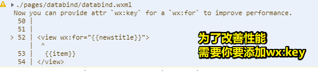
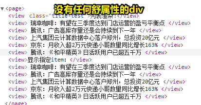
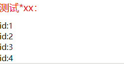
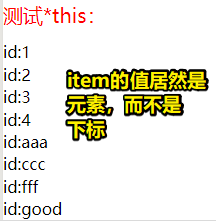

# 列表渲染与条件渲染

上一节学到了啥？

学习了如何渲染**数组类型**和**对象类型**的数据。

不过，我们只是输出了数组里或对象的数组里的**某一个数据**，如果是要输出整个列表呢？这个时候就需要用到列表渲染啦。

## ★渲染数组里的所有数据

### ◇**相同的结构是列表渲染的前提**

在实际的开发场景里，商品、新闻、股票、收藏、书架列表等都会有几千上万条的数据，他们都有一个共同的特征就是**数据的结构相同**，这也是我们可以**批量化渲染的前提**。

**技术文档：**[列表索引](https://developers.weixin.qq.com/miniprogram/dev/reference/wxml/list.html)

如何把整个列表都渲染出来呢？

这里涉及到JavaScript数组遍历的知识，JavaScript数组遍历的方法非常多，因此小程序数组的渲染也有很多方法，所以大家看技术文档的时候会有点混乱。

注意点：

> 默认数组的当前项的下标变量名默认为 index，数组当前项的变量名默认为 item；
> 使用 wx:for-item 可以指定数组当前元素的变量名，使用 wx:for-index 可以指定数组当前下标的变量名。

### ★电影列表页面

1. 把多部电影的数据抽象成一个个对象，然后放到一个数组里边作为一个个元素处理
2. 构建HTML模板
3. 使用 `wx:for`语句遍历数组实现列表渲染

注意，如果 你指定了`wx:for-item`的值，如 `xxx`， 那么在获取元素的属性值时，那就得 `xxx.img`这样

关于图片样式，使用了WeUI框架导致图片变形了，因此如何才能让图片不变形呢？

请回顾，技术文档：[image组件文档](https://developers.weixin.qq.com/miniprogram/dev/component/image.html)

> 在技术文档里，我们发现如果我们不写图片的模式mode，图片的模式**默认为scaleToFill**，也就是**不保持纵横比缩放图片**，使图片的宽高完全拉伸至填满 image 元素。
>
> 那我们希望图片保持宽度不变，高度自动变化，保持原图宽高比不变，那就需要用到**widthFix**的模式啦

添加完模式之后，发现图片比例显示正常了，但是image组件出现了溢出的现象

而这溢出是因为weui给class为`weui-media-box__hd_in-appmsg` 的组件定义了一个`height:60px`的css样式，也就是限制了高度

> 可以利用开发者工具，查看image组件之所以溢出的缘故

重置它的样式为 ` height:auto;`即可！

> css的覆盖原理是按照优先级来的，越是写在css文件后面的样式优先级越高，会把前面的给覆盖掉；在小程序里页面里的wxss的优先级比app.wxss的优先级更高，所以也可以覆盖掉。

## ★Grid九宫格样式参考

大家经常会在App里看到一些分类都是以九宫格的方式来布局的。

所以如何实现九宫格呢？

1. 在WeUI小程序里用模拟器找到基础组件下的grid
2. 看一下grid所呈现的样式
3. 参考WeUI小程序文件结构里example文件夹下grid页面文件grid.wxml里的代码，使用CRM大法！

注意点：

> 在WeUI的源代码里，我们看到有一个 `<block>` 的标签，这个标签主要是说明里面包含的是一个多节点的结构块，换成 `<view>` 组件也没有太大影响，就好像 `<text>` 换成 `<view>` 没有影响一样，用不同的组件主要是为了一个区分。

直白来说，就是语义化呗！你使用`block`就是不想嵌套多余的`div`

九宫格是一行三列的，如何让九宫格变成一行五列呢？

首先我们要知道**为什么这个九宫格会变成一行三列**，在weui.wxss里给weui-grid定义了一个`width:33.33333333%`的样式，我们可以在相应的样式文件里边添加一个样式来覆盖原有的宽度。

如这样：

```css
.weui-grid{
  width: 20%;
}
```

## ★List样式参考

1. 在开发者工具的模拟器里体验一下WeUI小程序表单下面的List的样式
2. 找到list样式所对应的wxml代码，如在开发者工具的文件目录的`example/list`目录下
3. 参考一下里面的代码，使用CRM大法

## ★总结

- 当你需要了解某个语法的时候，那就写一些demo吧！如为了体现这个语法，我需要怎样怎样，即想个需求出来！
- 如果你在搞列表渲染的时候，不指定 `wx:key="*this"`，如这样：

```html
<view wx:for="{{newstitle}}">
  {{item}}
</view>
```

那么就会报这样的错误：



因此正确的代码是这样的：

```html
<view wx:for="{{newstitle}}" wx:key="*this">
  {{item}}
</view>
```

`*this`（保留关键字）代表在 for 循环中的 item 本身，而大胡子里边的`item`是规定好的当前项的默认变量名，即它是代表的是数组里边的元素值！

当然，你也可以显示指定item的变量名：

```html
<view wx:for-items="{{newstitle}}" wx:for-item="title" wx:key="*this">
  {{title}}
</view>
```

以上的wx指令属性，不会在DOM里边呈现：



- `block`组件类似于`template`标签，参考 WeUI的grid组件，渲染出来的东西是咩有`block`这个元素的！
- 页面起名可以这样`list-if-render` ，之后每看一篇文章就添加个页面！
- 发觉学习小程序，也会反哺对vue的学习！

## ★Q&A

### ①`*this`是关键字，那么在指定 `wx:key`时，为啥可以用诸如 `*xx`这样的值？

举例来说，你是这样写的：

`wx:key="字符串"`

**这个”`字符串`”代表在 for 循环的 array 中 item 的某个“属性”该“属性” 的值需要是列表中唯一的字符串或数字，且不能动态改变。用于被遍历的组件需要多个属性的时候。**

```
  //test.js
      data: {
        input_data: [
          { id: 1, unique: "unique1" },
          { id: 2, unique: "unique2" },
          { id: 3, unique: "unique3" },
          { id: 4, unique: "unique4" },
        ]
      }
    //test.wxml
    <input value="id:{{item.id}}"   wx:for="{{input_data}}"  wx:key="unique"  />
```



而 `wx:key="*this"`

**保留关键字”`*this`”代表在 for 循环中的 item 本身，这种表示需要 item 本身是一个唯一的字符串或者数字用于组件仅需要一个属性，且属性值唯一。**

```
//test.js
  data: {
    numberArray: [1, 2, 3, 4],
    stringArray:['aaa','ccc','fff','good']
  }
//test.wxml
   <input value="id:{{ item }}"   wx:for="{{numberArray}}"  wx:key="*this"  />
   <input value="id:{{ item }}"   wx:for="{{stringArray}}"  wx:key="*this"  />
  },
```



**➹：**[最难点For的wx:key，您肯定不知道的！（框架细节十一）-微信小程序俱乐部 www.wxappclub.com](http://www.wxappclub.com/topic/536)

### ②真得需要添加 `wx:key`吗？

- 需要添加：
  1. **列表中项目的位置会动态改变或者有新的项目添加到列表中**
  2. **希望列表中的项目保持自己的特征和状态**
- 不需要添加：
  1. **如果明确知道该列表是静态，或者不必关注其顺序，可以不用加wx:key，忽略 ` wx:key` 提供的警告。**

效率对比：

| `wk:key` | 组件识别     | 渲染情况             | 状态情况             | for效率 |
| :------- | :----------- | :------------------- | :------------------- | :------ |
| 有       | 各组件可识别 | 渲染时仅改变组件顺序 | 保持组件之前原来状态 | 效率高  |
| 无       | 组件无法识别 | 渲染时重新创建各组件 | 重置组件的初始状态   | 效率低  |

总之，我们改变了在data里边的数组，如果有key的话，那么你添加或者移除数组元素时，那就是正确的选择。如果数组是一层不变的，那么就可以不用添加key了。

