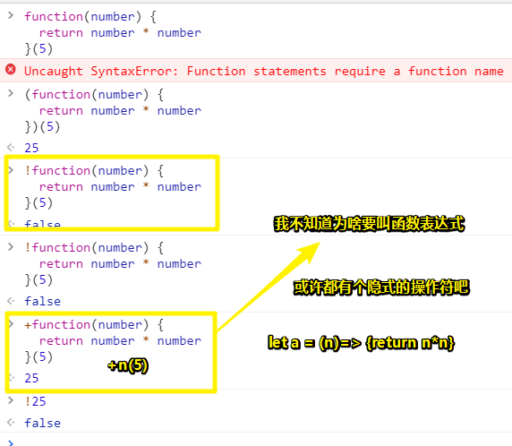
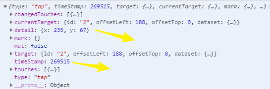

# 页面渲染

> 资源：[页面渲染](https://tencentcloudbase.github.io/handbook/tcb13.html)
>
> 在数据绑定章节，我们已经掌握如何把data里面的数据渲染到页面，这一部分我们会介绍如何通过点击组件绑定的事件处理函数来修改data里面的数据，如何把事件处理函数获取到的数据打印到页面。

为什么叫函数表达式呢？

表达式：操作数+操作符返回有值的东西！

我们可以用**函数表达式**创建一个匿名函数：

```js
let square = function(number) {
  return number * number
};
console.log(square(4))//使用console.log()输出变量square
```

这个函数表达式是有返回值的！或者说，能被称为函数表达式的，都有返回值！



```js
let a = n => n*n
a(5) //25
+a(5) //25
```

**JavaScript函数在对象里边的写法（具名与匿名）：**

可以这样：

```js
{
	a() {},
	b() {}
}
```

也可以这样：

```js
{
	a: function(){},
	b: function(){}
}
```

而这样的函数叫做对象的方法哈！

## ★总结

- 把`Page({})`的实参 `{}`看作是 Vue 里边的选项对象！

- 为啥要将变量值渲染到页面？因为每次用打log的方式到控制台里边查看该变量的值太麻烦了，还不如直接在页面里边看嘞！

- 把`setData`看做是对data的某个属性值的重复赋值，即修改值！

- 用眼睛直接看，看不懂！但你写上代码，就明白这代码在干嘛了。就是这么神奇哈！

- 元素的hidden属性可以决定一个元素是否可见！是个使用tab切换的小技巧！

- 当我们对字符串、Math对象、Date对象、数组对象、函数对象、事件对象所包含的信息不了解时，把他们打印出来即可。打印出来的结果基本都是字符串、列表、对象，而在前面我们已经掌握如何操作它们。通过实战，通过打印日志，既有利于我们调试代码，也加强我们对逻辑的理解。

- 当点击组件触发事件时，逻辑层绑定该事件的处理函数会收到一个事件对象，通过  event 对象可以获取事件触发时候的一些信息，比如时间戳、 detail 以及当前组件的一些属性值集合，尤其是事件源组件的id。

  

- JavaScript允许传入任意个参数而不影响调用，因此传入的参数可以比定义的参数多，但是不能少。也就是说实参的数量可以多于形参但是不能少于形参。

- this.setData和 this.data都用到了一个关键字 this。 this和中文里的“**这个的**”有类似的指代作用，在方法中， this 指代该方法所属的对象，比如这里的是Page对象， this.data就是指Page函数对象里的data对象。

- 如果在页面渲染某个变量值，是 `[object Object]`，那么你 `toString()`一下这个变量即可！