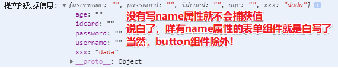
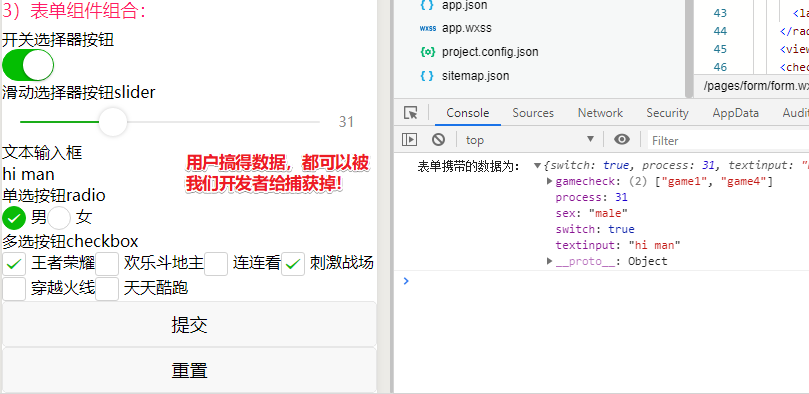
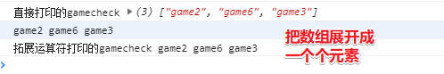
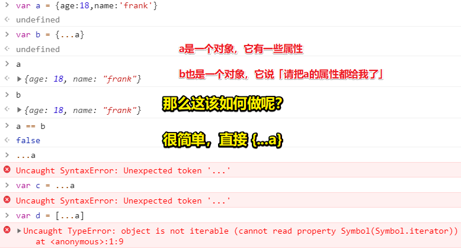
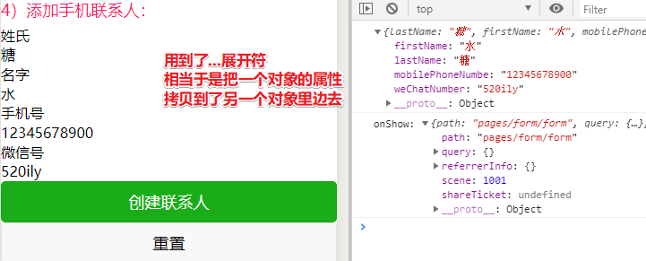
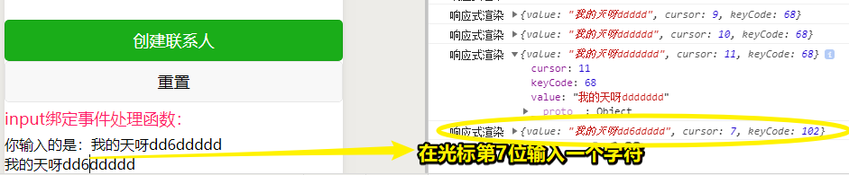
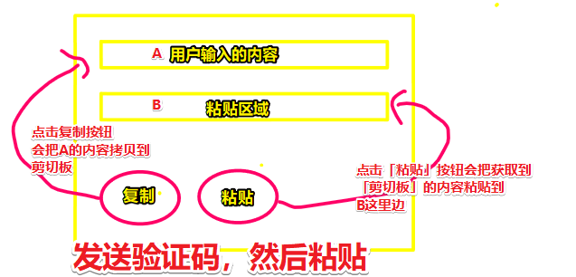
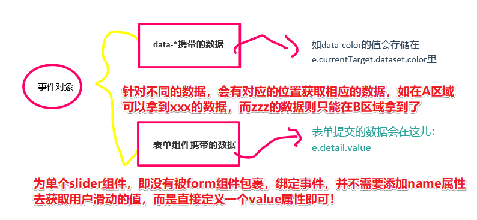
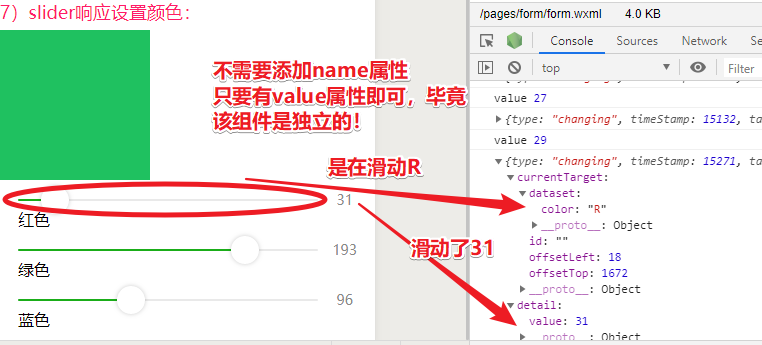
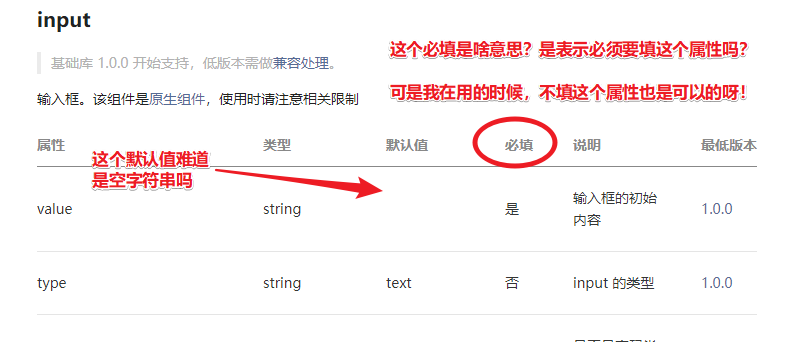

# 数据表单

## ★为什么讲这个？

> 在前面的章节所用到的数据大多都是我们在 js 的 data 里写好的，在这一节里，我们会来介绍如何让用户提交数据。无论是计算器、用户注册、表单收集、发表文章、评论等等，这些都是对用户提交数据的获取。 


## ★设置导航栏标题

如何设置？

>  只要给`wx.setNavigationBarTitle()`的 title 对象赋值，就能改变小程序页面的标题 。

接下来会使用多种方法来调用这个 API ，而这样做的目的是 让大家了解** API 调用方法有什么不同** 

**技术文档：**[wx.setNavigationBarTitle()](https://developers.weixin.qq.com/miniprogram/dev/api/ui/navigation-bar/wx.setNavigationBarTitle.html) 

### ◇onLoad 调用 API

思路： 在页面的**生命周期函数**里来调用 API 

做法如下：

1） 使用开发者工具新建一个 form 页面 

2） 在 form.js 里 onLoad 里添加代码 ：

```js
  onLoad: function (options) {
    wx.setNavigationBarTitle({
      title:"onLoad 触发修改的标题"
    })
  },
```

*注：`options`的值是空对象*

### ◇button 调用 API

思路： 通过点击 button 组件，触发**事件处理函数**来调用 API 

做法如下：

1） 在 form.wxml 里输入以下代码 ：

```js
<button type="primary" bindtap="buttonSetTitle">设置标题</button>
```

2） 在 js 里添加`buttonSetTitle`事件处理函数 

```js
buttonSetTitle(e) {
    console.log(e)
    wx.setNavigationBarTitle({
      title: "button 触发修改的标题"
    })
  }
```

3）测试，点击页面的「设置标题」button

4）查看打印出来的 `e`：


*注： 打印出来的事件对象 e，并没有发现有什么特别有用的信息*

### ◇使用表单修改标题

需求：我希望标题的内容可以根据用户提交的数据进行修改 

思路：

- 这涉及到表单的知识 ，毕竟这需要让用户输入数据哈！
- 小程序一个**完整的数据表单**收集通常包含**一个 form 组件**，**一个输入框或选择器组件**（比如 input 组件），**一个 button 组件**。 

技术预研：

 数据表单涉及到的组件多（**至少三个**），而且参数以及参数的类型也比较多 

- 表单最核心的在于表单组件`form`，输入框组件 input 和 button 组件要在`<form></form>`内，f**orm 也会收集内部组件提交的数据**；
- 绑定事件处理函数的不再是 button，而是 form，form 的`bindsubmit`与 button 的 `formType="submit"`是一对，点击 button，就会执行`bindsubmit`的事件处理函数；
- input 是输入框，用户可以在里面添加信息；`name`是 input 组件的名称，与表单数据一起提交。


> 关于 `input`组件的 `name`属性意义，因为在一个 `form`组件里边，其儿子可以有一个 `input`或多个 `input`哦！因此为了区分是哪一个`input`的数据，所以是很有必要添加`name`属性的！
>
> 如果不了解上边这个图，请先看下边的代码！
>
> 总之，点击 button 就会触发 form 上的 `submit`事件，而该事件的 callback 会拿到表单里边，如 input 等组件的数据，进而我们可以通过 ajax 什么的把数据上传到服务器里边！

---

**做法如下：**

1） 在 form.wxml 里输入以下代码： 

```html
<form bindsubmit="setNaivgationBarTitle">
   <input type="text" placeholder="请输入页面标题并点击设置即可" name="navtitle"></input> 
    <button type="primary" formType="submit">设置</button>
</form>
```

2） 在 form.js 里添加事件处理函数 setNaivgationBarTitle，同时我们把事件对象 e 给打印出来： 

```js
  setNaivgationBarTitle(e) {
    console.log(e)
    const navtitle = e.detail.value.navtitle
    wx.setNavigationBarTitle({
      title:navtitle
    })
  },
```

3）测试，编译之后，在页面的输入框里边输入任意文本，点击“设置”按钮，我们就会发现导航栏标题都会显示为我们刚刚输入的值 

4）看看打印的 `e`是啥？


可见， 事件对象的 type 属性为 submit（**以前的为 tap**），我们在 input 输入框填写的值就存储在** detail 对象的 value 属性的 name 名里**，这里就是 `detail.value.navtitle`。 

5）也可以把上面的事件处理函数写成如下这个样子：

```js
  setNaivgationBarTitle(e) {
    const title = e.detail.value.navtitle
    wx.setNavigationBarTitle({
      title   //等同于 title:title
    })
  },
```

>  让变量 title 与 setNavigationBarTitle 的**属性 title 同名**，这样 `title:title`可以简写成 title ，而这是 ES6 的新语法！这可不同于解析赋值哈！因为 `title` 是个字符串值，可不是一个对象哈！总之，形式上就是这样了，反正，其 JS 语法解释器就是这样规定的。

---

**回顾以上这个程序都干了什么：**

> 点击 button 组件会执行 form 绑定的事件处理函数`setNaivgationBarTitle`，打印事件对象`e`，然后把在 input 输入的值赋值给`navtitle`，最后传入`wx.setNavigationBarTitle()`，赋值给 title。 

需要注意的是， **有两个`setNaivgationBarTitle`，一个是事件处理函数，一个是 API，前者可以任意命名，后者小程序官方写死不可更改。** 

总之， 对数据表单来说，使用`console.log`打印事件对象可以让我们对**表单提交的数据**有一个非常清晰的了解；而使用赋值以及 setData 可以有效的把表单收集到的数据渲染到页面。 

## ★文本输入框 input

它是用来干嘛的？

>  小程序的输入框 input 主要用来处理**文本和数字**的输入，下面我们就来结合实战与技术文档，来了解一下文本输入框 input 的 type、name、placeholder 等属性。 

 **技术文档：**[input 技术文档](https://developers.weixin.qq.com/miniprogram/dev/component/input.html) 

---

**做法如下：**

1） 在 form.wxml 里输入以下代码 ：

```html
<form bindsubmit="inputSubmit">
  <input type="text" name="username" placeholder="请输入你的用户名"></input>
  <input password type="text" name="password" maxlength="6" placeholder="请输入 6 位数密码"  confirm-type="next" />
  <input type="idcard" name="idcard" placeholder="请输入你的身份证账号" />
  <input type="number" name="age" placeholder="请输入你的年龄" />
  <input type="digit" name="height" placeholder="请输入你身高多少米"/>
  <button form-type="submit">提交</button>
</form>
```

2） 在 form.js 里添加事件处理函数 inputSubmit，主要是为了打印 form 事件对象： 

```js
inputSubmit:function(e){
	console.log('提交的数据信息：',e.detail.value)
},
```

3）测试， input 输入框会因为属性的类型的不同，**手机键盘外观会有比较大的差异**，所以需要点击预览，用微信扫描二维码在手机上体验（也可以启用真机调试）。 

> 所谓的真机调试，就是你在手机里边操作页面，那么就会把 log 信息打印到 PC 的小程序开发者工具的控制台里边

可见， 在开发者工具的控制台我们可以看到打印的事件对象里的 value 对象，属性名即为 input 的 name 名，值即为我们输入的数据。可如果没有 name 属性的话，那么就无法拿到用户输入的值了！



---

**解释 input 的`type`属性和`placeholder`属性：**

- input 输入框支持的 type 值有文本输入 text、数字输入 number、身份证输入 idcard、小数点输入 digit，当 type 不同时，**注意手机键盘外观的不同**；
- placeholder: 输入框为空时的占位符（也就是默认值）；
- maxlength：最大输入长度；
- password 和 disabled 都是 boolean 值，使用方法和之前的 video 组件里面的 boolean 属性一样。

**任务：**

>  **小任务：**给 input 输入框配置 confirm-type，分别输入 send、search、next、go、done，然后点击预览，用微信扫描二维码体验，注意输入内容时，手机键盘显示的不同。 

键盘的键，有些是「发送」、「搜索」图标等等

## ★表单组件组合

除了可以拿到用户输入的内容，还可以拿到用户勾选或滑动的值：

>  一个完整的数据收集表单，除了可以提交 input 文本框里面的数据，还可以提交开关选择器按钮 switch、滑动选择器按钮 slider、单选按钮 radio、多选按钮 checkbox 等组件里面的数据。 

**技术文档：**[switch 开关选择](https://developers.weixin.qq.com/miniprogram/dev/component/switch.html)、[Slider 滑动选择](https://developers.weixin.qq.com/miniprogram/dev/component/slider.html)、[Radio 单选](https://developers.weixin.qq.com/miniprogram/dev/component/radio.html)、[checkbox 多选](https://developers.weixin.qq.com/miniprogram/dev/component/checkbox.html)、[form 表单](https://developers.weixin.qq.com/miniprogram/dev/component/form.html)

**技术预研：**

- **switch 属性：**记录 switch 开关选择的值，这是一个 boolean 值，ture 为开，false 为关；
- **sex 属性：**记录 name 名为 sex 的单选按钮的值，它只记录单选选择的那一项的值；
- **process 属性**：记录 name 名为 process 的滑动选择器的值，`show-value`为 boolean 值，在页面显示当前的 value 值，不然用户是看不见自己到底滑动了多少，而它数据类型为 number；
- **textinput 属性：**记录 name 名为 textinput 的 input 文本输入框的值；
- **gamecheck 属性：**记录 name 名为 gamecheck 的多选组件的值，**数据类型为数组 Array**。

---

**做法如下：**

1） 在 form.wxml 里添加以下代码，这些组件都是我们日常使用 App、页面等**经常会使用**到的场景： 

```html
<form bindsubmit="formSubmit" bindrest="formReset">
    <view>开关选择器按钮</view>
    <switch name="switch"/>
    <view>滑动选择器按钮 slider</view>
    <slider name="process" show-value ></slider>
    <view>文本输入框</view>
    <input name="textinput" placeholder="要输入的文本" />
    <view>单选按钮 radio</view>
    <radio-group name="sex">
      <label><radio value="male"/>男</label>
      <label><radio value="female"/>女</label>
    </radio-group>
    <view>多选按钮 checkbox</view>
    <checkbox-group name="gamecheck">
      <label><checkbox value="game1"/>王者荣耀</label>
      <label><checkbox value="game2"/>欢乐斗地主</label>
      <label><checkbox value="game3"/>连连看</label>
      <label><checkbox value="game4"/>刺激战场</label>
      <label><checkbox value="game5"/>穿越火线</label>
      <label><checkbox value="game6"/>天天酷跑</label>
    </checkbox-group>
    <button form-type="submit">提交</button>
    <button form-type="reset">重置</button>
</form>
```

2） 在 form.js 里添加 formSubmit 和 formReset 事件处理函数 ：

```js
  formSubmit: function (e) {
    console.log('表单携带的数据为：', e.detail.value)
  },
  formReset: function () {
    console.log('表单重置了')
  }
```

3）测试，在页面里边给「选择器组件」做出选择以及给「文本输入组件」添加一些值，然后点击**提交按钮** 

4） 在控制台 console，我们可以看到事件对象 e 的** value 对象**就记录了我们提交的数据。也就是说，表单组件提交的数据都存储在事件对象 e 的 detail 属性下的 value 里。 



5） 点击**重置按钮**，即会重置表单，并不需要 formReset 事件处理函数做额外的处理。 

---

**一些你忽视的细节：**

> 我们发现上面 button 属性，有时用的是`form-type`，有时用的是`formType`（注意两者的大小写），这两种写法都可以。我们也可以删掉重置的事件处理函数`formReset`，以及 form 组件的 `bindreset="formReset"`，只需要将 button 的 form-type 设置为`reset`，也就是
>
> ```html
> <button form-type="reset">重置</button>
> ```
>
> 就可以达到重置的效果，绑定事件处理函数`bindreset`

**小结：**

 只要我们知道 form 表单存储的数据在哪里，就能够结合前面的知识把数据取出来，不同的数据类型区别对待，所以**掌握如何使用 JavaScript 操作不同的数据类型**很重要。 

> 如果是布尔值，那么就可以用 `if……else……`去处理不同的逻辑哈！

还有一点，你需要注意的是：

>  在技术文档里有这样一句话“**当点击 form 表单中 form-type 为 submit 的 button 组件时，会将表单组件中的 value 值进行提交，需要在表单组件中加上 name 来作为 key**”。我们也发现 [Slider 滑动选择](https://developers.weixin.qq.com/miniprogram/dev/component/slider.html)、[Radio 单选](https://developers.weixin.qq.com/miniprogram/dev/component/radio.html)、[checkbox 多选](https://developers.weixin.qq.com/miniprogram/dev/component/checkbox.html) 等，都有自己的 value 值，也就是这些组件**单独使用时不需要`name`就可以在事件对象的 detail 里取到 value 值**，而**组合使用**时，则必须加 name 才能取到值，大家可以把 name 都取消掉，看看结果如何。 

如果把 `name` 删除掉，那么这显然是无法拿到用户输入的数据（这里的数据包括用户敲键盘输入的，以及用鼠标勾选、滑动选择的数据）

### ◇数组的扩展运算符

> 也叫展开运算符（ **Spread syntax** ）哈！

它的语法：

>  它的写法很简单，就是三个点 `...`。我们会用案例的方式让大家先了解它的作用，以后会经常用到的。 

何时使用它？

> 如 上边的`gamecheck`记录了我们勾选的多选项的 value 值，而它是一个**数组 Array**，那么我们 就可以使用它了。

---

做法如下：

1）在`formSubmit`事件处理函数把选项 value 值给打印出来，给上面的 formSubmit 函数添加以下语句：

```js
  formSubmit: function (e) {
    const gamecheck=e.detail.value.gamecheck
    console.log('直接打印的 gamecheck',gamecheck)
    console.log(...gamecheck)
    console.log('拓展运算符打印的 gamecheck',...gamecheck)
  },
```

2）测试， 填写表单提交数据 ，查看控制台：



从控制台可以看到直接打印`gamecheck`，它是一个数组 Array，中括号`[]`就可以看出来，展开也有`index`值。

而使用扩展运算符打印`gamecheck`，是**将数组里的值都遍历了出来**。这就是扩展运算符`…`的作用，大家可以先只了解即可。 

> 遍历，然后一个元素 push 出来！总之，形式就是如此啦！

---

## ★添加手机联系人

**Why？**

> 尽管我们提交了数据，但是当小程序重新编译之后，所有的数据都会被重置，也就是提交的数据并没有保存起来。而小程序存储数据有三种方式，一是保存在本地手机上；二是存储到缓存里；三是存储到数据库。
> 下面我们来介绍如何将数据存储到手机。

 **添加手机通讯录联系人：**[wx.addPhoneContact()](https://developers.weixin.qq.com/miniprogram/dev/api/device/contact/wx.addPhoneContact.html) 

**TPR？**



---

**How？**

1）在 form.wxml 添加以下代码，注意，**input 的`name`名要和`wx.addPhoneContact()`里的属性名对应且一致**，下面只举几个属性，更多属性都可以按照技术文档添加

``` html
<form bindsubmit="submitContact">
  <view>姓氏</view>
  <input name="lastName" />
  <view>名字</view>
  <input name="firstName" />
  <view>手机号</view>
  <input name="mobilePhoneNumbe" />
  <view>微信号</view>
  <input name="weChatNumber" />
  <button type="primary" form-type="submit">创建联系人</button>
  <button type="default" form-type="reset">重置</button>
</form>
```

> 关于 `name` 属性，它还有其它写死的值，如 `nickName`、`remark`……具体详情就看文档啦！

2）在 form.js 文件里面输入以下代码，（**注意添加手机联系人的 API 在手机上使用有奇效哦**）

``` js
  submitContact: function (e) {
    const formData = e.detail.value
    console.log(formData)
    wx.addPhoneContact({
      ...formData,
      success() {
        wx.showToast({
          title: '联系人创建成功'
        })
      },
      fail() {
        wx.showToast({
          title: '联系人创建失败'
        })
      }
    })
  },
```

> 所谓的奇效，即是可以让你根据用户所填的数据，然后在本地创建一个联系人。

3）测试，编译，微信扫描二维码，给以上 input 填充数据并点击创建联系人，就可以把数据存储到手机里了



---

**小结：**

1. 多写回调函数 success()、fail()，并在里面添加消息提示框`wx.showToast()`能够大大增强用户的体验。

2. 在编程时多写`console.log`，多写回调函数，可以让我们对程序的运行进行诊断，这一点非常重要。不过为了教学方便，我们后面会少写回调函数。

### ◇ 对象的扩展运算符

前边的认识：「了解了数组的拓展运算符」

接下来就来看看对象的扩展运算符

对象的扩展运算符 `...` 也有类似的作用，它可以取出对象里**所有可遍历的**属性，拷贝到新的对象中。为了可以看得更加清楚，我们可以进行打印对比：

``` js
  submitContact:function(e) {
    const formData = e.detail.value
    console.log('打印 formData 对象',formData)
    console.log('扩展运算符打印', { ...formData })
  },
```

尽管打印的结果好像并没有区别，但是`formData`是一个变量，我们把对象赋值给了它，打印它的结果就是一个对象了，而 `{ ...formData }`本身就是一个对象，相当于把`formData`对象里的属性和值给拷贝到了**新的对象**里面。

说白了，就是这个样子：


> **小任务：**把`wx.addPhoneContact()`里的`…formData`换成`formData`，看看什么结果？把`…formData`换成 lastName，又是什么结果？为什么写 lastName 会报错，而写 formData 不会报错？

1. `formData`之所以不报错，是因为上下文有这个变量，而 `lastName`则没有

2. 不写 `...formData`，意味着，`addPhoneContact({})`这个 API 拿不到用户填的数据，因为 选项对象 `{}` 里边，不存在`formData` 这个选项！那么它有哪些规定好的选项呢？——如 `firstName`等

## ★ input 绑定事件处理函数

**why?**

> 在 form 表单里，尽管表单里有 input 组件，但是绑定事件处理函数的是** form 组件**，input 组件只提供 value 值，而** input 文本输入组件本身也是可以绑定事件处理函数的**。
> 从技术文档里我们了解到 input 可以绑定事件处理函数的属性有`：bindinput`，键盘输入时触发；bindfocus，输入框聚焦时触发；bindblur，输入框失焦时触发等等，这里主要介绍一下 bindinput。

### ◇bindinput 响应式数据渲染

**How?**

1）在 form.wxml 里输入以下代码，这里使用 input 的 bindinput 绑定的事件处理函数 bindKeyInput（函数名可以自己命名）

``` html
<view>你输入的是：{{inputValue}}</view>
<input  bindinput="bindKeyInput" placeholder="输入的内容会同步到view中"/>
```

2）在Page的data里我们添加`inputValue`的初始值：

``` js
  data: {
    inputValue: '你还没输入内容呢'
  },
```

3）在form.js里给input绑定的事件处理函数`bindKeyInput`添加如下代码（声明一个和data里的属性相同的变量名`inputValue`，并赋值，setData可以简写，本节就有了解过哈）

``` js
bindKeyInput: function (e) {
  const inputValue = e.detail.value
  console.log('响应式渲染',e.detail)
  this.setData({
    inputValue
  })
},
```

4）测试，编译之后，我们再在input里面填写内容，注意此时我们写的内容会实时渲染到页面上，无论是添加内容还是删除内容，都可以做出**同步响应**。而在控制台Console，我们也可以看到每输入/删除一个字符，实时的打印结果，其中cursor是focus时的光标位置。



> 注意：回忆一下我们之前的数据渲染，有直接初始化写在Page的data里，有使用页面生命周期和button的方式来触发事件处理函数用setData改变数据来渲染，也有form表单数据收集，这些数据渲染都没有做到响应式，也就是在**不刷新页面的情况下**，数据会实时根据你的修改而渲染。

---

这一节说白了，是在做双向绑定哈！

### ◇剪贴板

**Why?**

> 之前了解到「添加手机联系人」是把收集到的数据存储到本地手机的**通讯录**里，而剪切板则是把数据存储到本地手机的**剪切板**里

 技术文档：[设置剪切板内容wx.setClipboardData()](https://developers.weixin.qq.com/miniprogram/dev/api/device/clipboard/wx.setClipboardData.html)、[获取剪切板内容wx.getClipboardData()](https://developers.weixin.qq.com/miniprogram/dev/api/device/clipboard/wx.getClipboardData.html) 

**需求：**



---

**How?**

1）在form.wxml输入以下代码：

``` html
<input type="text" name="copytext" value="{{initvalue}}" bindinput="valueChanged"></input>
<input type="text" value="{{pasted}}"></input>
<button type="primary" bindtap="copyText">复制</button>
<button bindtap="pasteText">粘贴</button>
```

2）在Page的data里我们添加`initvalue`、`pasted`的初始值：

``` js
  data: {
    initvalue: '填写内容复制',
    pasted: '这里会粘贴复制的内容',
  },
```

3）在form.js中添加input绑定的事件处理函数`valueChanged`、button组件绑定的两个事件处理函数`copyText`、`pasteText`：

``` js
  valueChanged(e) {
    this.setData({
      initvalue: e.detail.value
    })
  },
 
  copyText() {
    wx.setClipboardData({
      data: this.data.initvalue,
    })
  },
 
  pasteText() {
    const self = this
    wx.getClipboardData({
      success(res) {
        self.setData({
          pasted: res.data
        })
      }
    })
  },
```

4）测试：

1. 在input里面输入内容，内容会响应渲染到页面
2. 点击**复制**按钮，`copyText`事件处理函数会调用API把数据赋值给剪切板的data（注意这里的data不是page页面的data，是`wx.setClipboardData` API的属性）
3. 点击粘贴按钮，事件处理函数`pasteText`会调用接口，把回调函数`res`里面的数据赋值给Page页面data里的`pasted`，而且页面在没有刷新的情况下实时地把data里的`pasted`给渲染了出来

---

>  **小任务：**上面我们用到的是input的value属性，将value改成placeholder，对比一下两者有什么不同。前面我们说过，剪切板是把数据存储到了本地手机的剪切板里，使用预览在手机里打开小程序复制内容之后，**再到微信聊天界面**，使用**粘贴**看看效果。或者在手机上复制一段内容，然后打开小程序点击粘贴，看看有什么效果。 

``` html
<input type="text" name="copytext" placeholder="{{initvalue}}" bindinput="valueChanged"></input>
<input type="text" placeholder="{{pasted}}"></input>
<button type="primary" bindtap="copyText">复制</button>
<button bindtap="pasteText">粘贴</button>
```

1. 二者不同在于：往粘贴区域里边输入内容，那么刚刚粘贴的内容就会消失，毕竟这是我们把粘贴的内容交给 `placeholder` 这个属性去渲染了！而不是实打实的 `value`属性
2. 系统自带这样一个功能：长按一个内容会有「复制、粘贴」等提示，`placeholder`的内容是无法用「长按选择复制这个系统自带功能」复制的，而往input框输入的内容是可复制的！

**小结：**

1. 小程序可以拿到剪切板的值，既然拿到了值，那么这就意味着我们可以去做一些处理！

## ★slider响应设置颜色

slider滑动选择器也可以绑定事件处理函数，有：

1. `bindchange`完成一次拖动后触发的事件
2. `bindchanging`拖动过程中触发的事件

> 有 `ing` 显然是正在进行中，只有一点拖动，就会触发事件。当然，这到底有没有涉及到函数节流呢？

 **技术文档：**[滑动选择器slider](https://developers.weixin.qq.com/miniprogram/dev/component/slider.html) 

**TPR？**

在讲解这个知识点之前，先来回顾一下事件对象里「`data-*`携带的数据」和「表单组件携带的数据」：

首先组件`data-*`属性的数据会存储在事件对象里的`currentTarget`下的`dataset`里的属性名里，也就是`data-color`的值会存储在 `e.currentTarget.dataset.color`里；

而表单组件的数据则是存储在事件对象的`detail`里，也就是`e.detail.value`里。



> VI色：视觉识别设计（Visual Identity），简称VI设计，如网易红、腾讯蓝、美团黄……

**➹：**[VI设计 - 为什么会有网易红、腾讯蓝、美团黄？](https://www.canva.cn/learn/vi-design-color-brand/)

---

**How?**

1）在form.wxml里输入以下代码，这里会既涉及到`data-*`携带的数据，也会涉及到「表单组件」携带的数据：

``` html
<view style="background-color:rgb({{R}},{{G}},{{B}});width:300rpx;height:300rpx"></view>
<slider data-color="R" value='{{R}}' max="255" bindchanging='colorChanging'  show-value>红色</slider>
<slider data-color="G" value='{{G}}' max="255" bindchanging='colorChanging' show-value>绿色</slider>
<slider data-color="B" value='{{B}}' max="255" bindchanging='colorChanging' show-value>蓝色</slider>
```

2）在Page的data里我们添加R、G、B的初始值（不了解RGB颜色值的童鞋可以搜索一下，它们的取值在0~255之间），这里的R、G、B初始值既是background-color的三个颜色的初始值，也是滑动选择器的初始值，我们把它设置为绿色（小程序技术文档的VI色）

``` js
  data: {
    R:7,
    G:193,
    B:96,
  },
```

3）在form.js里添加slider组件绑定的事件处理函数`colorChanging`：

``` js
  colorChanging(e) {
    console.log(e)
    // 拿到用户是在slider哪个组件
    let color = e.currentTarget.dataset.color
    // 拿到用户slider的值
    let value = e.detail.value;
    // 数据响应式渲染
    this.setData({
      [color]: value
    })
  },
```

4）测试，编译之后，当我们滑动slider，view组件的背景颜色也会随之改变。当滑动slider时，`colorChanging`因为滑动的拖动会不断触发（类似于英文里的ing的状态，实时监听），也就会在控制台Console里打印多个值，e.detail.value为拖动的值，而`e.currentTarget.dataset.color`始终只会有三个结果R、G、B，而`[color]: value`就是把值赋值给R、G、B这三个值。



---

**小结：**

1. 单个组件的`e.detail.value` 的值是 Number类型的数值；如果爸爸是form组件的话，通过submit按钮触发`bindsubmit`事件的话，那么它的值就是对象了，即 `{}`，而这个时候我们得写上 `name`属性，因为这样一来，才会让表单组件显得有意义一点！

## ★picker组件

**picker滚动选择器**看起来样式非常复杂，不过小程序已经帮我们封装好了，我们只需要用几行简单的代码就可以做一个**非常复杂而且类别多样**的滚动选择器。

 **技术文档：**[滚动选择器picker](https://developers.weixin.qq.com/miniprogram/dev/component/picker.html) 

---

**How?**

1）在form.wxm里输入以下代码，只需要下面几行代码，就能从底部弹起一个日期的滚动选择器。而里面的文字可以任意填写，类似于button、navigator组件里的字，点击即可执行相应的事件。

``` html
<picker mode="date" value="{{pickerdate}}" start="2017-09-01" end="2022-09-01" bindchange="bindDateChange">
选择的日期为：{{pickerdate}}
</picker>
```

稍微解释一下：

- mode属性：滚动选择器有几种模式，不同的模式可以弹出不同类型的滚动选择器，这里的是date日期选择，其他模式大体相似；

- start和end属性：这是日期选择器特有的属性，为有效日期的开始和结束，我们可以滚动试下，超出这个范围就没法滚动了；

2）在Page的data里我们添加`pickerdate`的初始值：

``` js
  data: {
    pickerdate:"2019-8-31",
  },
```

3）在form.js中添加picker组件绑定的事件处理函数`bindDateChange`，不管做什么，我们都得先打印看看picker组件的事件对象：

``` js
  bindDateChange: function (e) {
    console.log('picker组件的value', e.detail.value)
    let value = e.detail.value
    this.setData({
      pickerdate: value
    })
  },
```

4）测试，编译之后，当我们弹起滚动选择器时，日期选择器默认会指向初始值2019年8月31日，而当我们滑动选择一个日期确定之后，可以在控制台console里看到选择的日期。这个日期是一个字符串。


_注意：只要你点了「确定」按钮，那么即便日期没有改变也会触发！_

---

>  **小任务：**那我们要如何把选择的日期比如2019-10-21，从这里取出年月日呢（也就是2019、10、21）？这个就涉及到字符串的操作了，还记得字符串的操作么？可以看[MDN技术文档之JavaScript标准库之String](https://developer.mozilla.org/zh-CN/docs/Web/JavaScript/Reference/Global_Objects/String)，取出具体数字的方法有很多种，你知道应该怎么处理吗？ 

可以这样：

``` js
var s = '2019-10-21'
s.split('-') // ["2019", "10", "21"]
```

## ★总结

> 在这个章节里，我们讲了数据可以存储到本地手机里，在后面的章节，我们还会讲数据存储的其他方式，比如缓存、数据库等。有没有感觉到编程就是逻辑处理、调用API和玩弄数据…

编程确实如此，如何让程序走出自己想要的效果，需要我们去设计逻辑，而逻辑是否能够用代码实现，那么这就得看你是如何去调用API以及如何去玩弄数据了，总之，这就像是搭积木一样！


##  ★Q&A

### ①关于 input 组件文档阅读问题？



在我看来，`name`属性、`type` 属性是必填的属性，其余的都可有可无！

之后，我测试了一下，即往一个咩有写 value 属性的 input 组件里边输入内容，然后到控制台里边查看 它的「Wxml」，发现它多了一个 value 属性，而这个 value 属性，其实我们所写的代码并没有体现出来，但在渲染的时候它是存在的，它的值默认是 空字符串 `“”`哈！

结论：

属性，「必填」为「是」，那么就表示该属性一定会有的，即便你的代码里边并没有写！或者你也可以认为没有这个属性的存在，那么它就不是 input 组件了！
