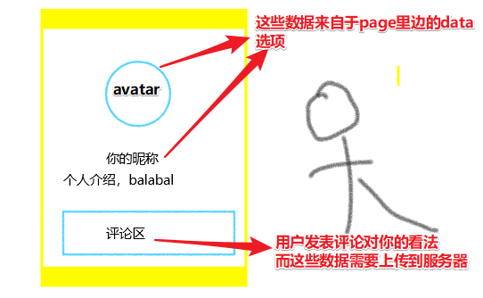
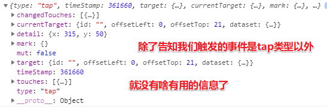
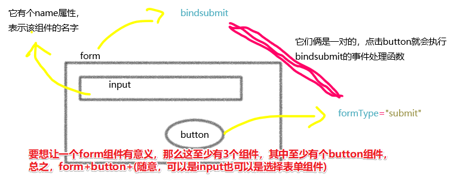
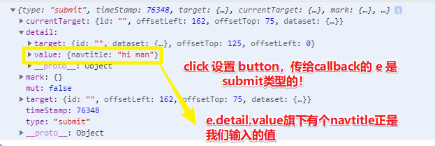

# 数据表单

## ★为什么讲这个？

> 在前面的章节所用到的数据大多都是我们在js的data里写好的，在这一节里，我们会来介绍如何让用户提交数据。无论是计算器、用户注册、表单收集、发表文章、评论等等，这些都是对用户提交数据的获取。 



## ★设置导航栏标题

如何设置？

>  只要给`wx.setNavigationBarTitle()`的title对象赋值，就能改变小程序页面的标题 。

接下来会使用多种方法来调用这个API ，而这样做的目的是 让大家了解**API调用方法有什么不同** 

**技术文档：**[wx.setNavigationBarTitle()](https://developers.weixin.qq.com/miniprogram/dev/api/ui/navigation-bar/wx.setNavigationBarTitle.html) 

### ◇onLoad调用API

思路： 在页面的**生命周期函数**里来调用API 

做法如下：

1） 使用开发者工具新建一个form页面 

2） 在form.js里onLoad里添加代码 ：

```js
  onLoad: function (options) {
    wx.setNavigationBarTitle({
      title:"onLoad触发修改的标题"
    })
  },
```

*注：`options`的值是空对象*

### ◇button调用API

思路： 通过点击button组件，触发**事件处理函数**来调用API 

做法如下：

1） 在form.wxml里输入以下代码 ：

```js
<button type="primary" bindtap="buttonSetTitle">设置标题</button>
```

2） 在js里添加`buttonSetTitle`事件处理函数 

```js
buttonSetTitle(e) {
    console.log(e)
    wx.setNavigationBarTitle({
      title: "button触发修改的标题"
    })
  }
```

3）测试，点击页面的「设置标题」button

4）查看打印出来的 `e`：



*注： 打印出来的事件对象e，并没有发现有什么特别有用的信息*

### ◇使用表单修改标题

需求：我希望标题的内容可以根据用户提交的数据进行修改 

思路：

- 这涉及到表单的知识 ，毕竟这需要让用户输入数据哈！
- 小程序一个**完整的数据表单**收集通常包含**一个form组件**，**一个输入框或选择器组件**（比如input组件），**一个button组件**。 

技术预研：

 数据表单涉及到的组件多（**至少三个**），而且参数以及参数的类型也比较多 

- 表单最核心的在于表单组件`form`，输入框组件input和button组件要在`<form></form>`内，f**orm也会收集内部组件提交的数据**；
- 绑定事件处理函数的不再是button，而是form，form的`bindsubmit`与button的 `formType="submit"`是一对，点击button，就会执行`bindsubmit`的事件处理函数；
- input是输入框，用户可以在里面添加信息；`name`是input组件的名称，与表单数据一起提交。



> 关于 `input`组件的 `name`属性意义，因为在一个 `form`组件里边，其儿子可以有一个 `input`或多个 `input`哦！因此为了区分是哪一个`input`的数据，所以是很有必要添加`name`属性的！
>
> 如果不了解上边这个图，请先看下边的代码！
>
> 总之，点击button就会触发form上的 `submit`事件，而该事件的callback会拿到表单里边，如input等组件的数据，进而我们可以通过ajax什么的把数据上传到服务器里边！

---

**做法如下：**

1） 在form.wxml里输入以下代码： 

```html
<form bindsubmit="setNaivgationBarTitle">
   <input type="text" placeholder="请输入页面标题并点击设置即可" name="navtitle"></input> 
    <button type="primary" formType="submit">设置</button>
</form>
```

2） 在form.js里添加事件处理函数setNaivgationBarTitle，同时我们把事件对象e给打印出来： 

```js
  setNaivgationBarTitle(e) {
    console.log(e)
    const navtitle = e.detail.value.navtitle
    wx.setNavigationBarTitle({
      title:navtitle
    })
  },
```

3）测试，编译之后，在页面的输入框里边输入任意文本，点击“设置”按钮，我们就会发现导航栏标题都会显示为我们刚刚输入的值 

4）看看打印的 `e`是啥？



可见， 事件对象的type属性为submit（**以前的为tap**），我们在input输入框填写的值就存储在**detail对象的value属性的name名里**，这里就是 `detail.value.navtitle`。 

5）也可以把上面的事件处理函数写成如下这个样子：

```js
  setNaivgationBarTitle(e) {
    const title = e.detail.value.navtitle
    wx.setNavigationBarTitle({
      title   //等同于title:title
    })
  },
```

>  让变量title与setNavigationBarTitle的**属性title同名**，这样 `title:title`可以简写成title ，而这是ES6的新语法！这可不同于解析赋值哈！因为 `title` 是个字符串值，可不是一个对象哈！总之，形式上就是这样了，反正，其JS 语法解释器就是这样规定的。

---

**回顾以上这个程序都干了什么：**

> 点击button组件会执行form绑定的事件处理函数`setNaivgationBarTitle`，打印事件对象`e`，然后把在input输入的值赋值给`navtitle`，最后传入`wx.setNavigationBarTitle()`，赋值给title。 

需要注意的是， **有两个`setNaivgationBarTitle`，一个是事件处理函数，一个是API，前者可以任意命名，后者小程序官方写死不可更改。** 

总之， 对数据表单来说，使用`console.log`打印事件对象可以让我们对**表单提交的数据**有一个非常清晰的了解；而使用赋值以及setData可以有效的把表单收集到的数据渲染到页面。 

## ★文本输入框input

