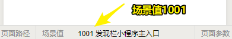
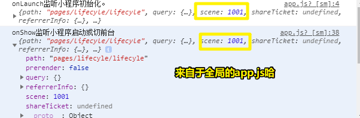
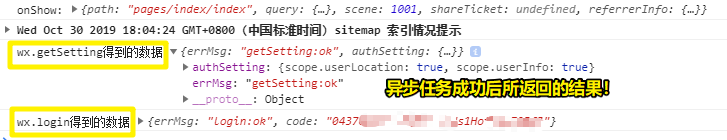
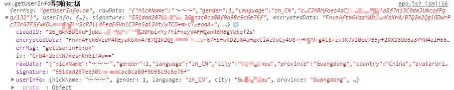
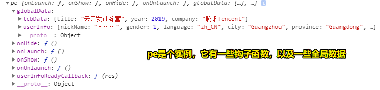
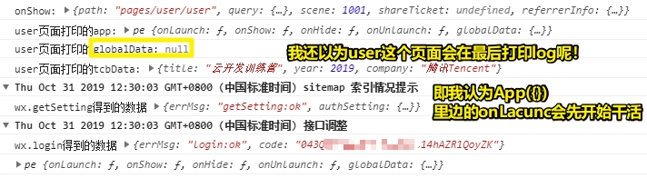
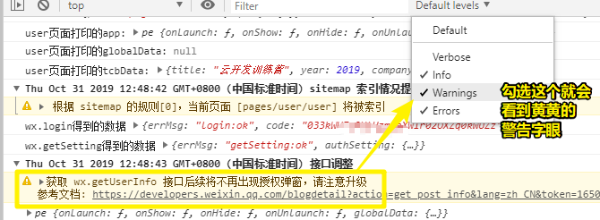
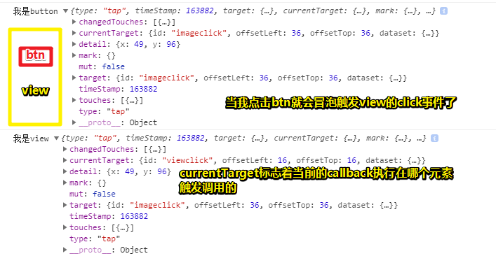
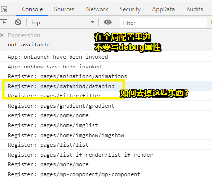
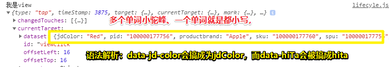

# 生命周期

> 资源：[生命周期](https://tencentcloudbase.github.io/handbook/tcb14.html)
>
> **➹：**[App(Object object) - 微信开放文档](https://developers.weixin.qq.com/miniprogram/dev/reference/api/App.html)
>
> **➹：**[生命周期 - 微信开放文档](https://developers.weixin.qq.com/miniprogram/dev/framework/app-service/page-life-cycle.html)

## ★小程序和页面的生命周期

以下是页面的生命周期，可不是小程序的生命周期！ 


 

* App()：
  + 该函数在哪儿？—— app.js
  + 调用它干嘛？——注册小程序
  + 需要给它传啥参数？——对象 Object 类型的参数
  + 该对象参数里边默认有啥东西？——一些生命周期函数和事件处理函数
  + 何时调用它？——App() 必须在 app.js 中调用，必须调用且只能调用一次。
  + 开发者针对这个参数能做什么？——开发者可以添加任意的函数或数据变量到 `Object` 参数中，而且可以用 `this` 来访问这个 `Object` 
* Page()：
  + 在哪儿？——你创建一个页面，那么就会自动生成 4 个文件，而该函数就在页面的 js 文件里边哈
  + 调用它干啥？—— 注册小程序中的一个页面
  + 其它使用操作同上

> 为什么我们在 App() 和 Page() 里边不能直接用等号=给变量赋值？你明白了吗？注意函数语句与对象属性与方法在写法上的不同。

关于 callback 的触发：

> 之前我们已经了解到，通过**点击事件**可以触发事件处理函数，也就是需要**用户来点击**某个组件才能触发；这里**页面的生命周期函数**也可以触发事件处理函数，它**不需要用户点击组件**，只需要用户打开小程序、打开某个页面，把小程序切后台等情况时就能触发里面的函数。

### ◇小程序打开场景值



如何获取这个场景直？

> 在 `App` 的 `onLaunch` 和 `onShow` 打印的对象里有一个 scene 为 1001，这个是场景值。



场景值有啥用？

> 场景值用来描述**用户进入小程序的路径方式**。用户进入你的小程序的方式有很多，比如有的是扫描二维码、有的是长按图片识别二维码，有的是通过微信群进入的小程序，有的是朋友单聊进入的小程序，有的是通过公众号进入的小程序等等，这些就是场景值，而具体的场景值，可以看技术文档，**场景值对产品、运营来说非常重要**。

 **技术文档：**[场景值列表](https://developers.weixin.qq.com/miniprogram/dev/reference/scene-list.html) 

### ◇ **onLaunch 与 onShow** 

`onLaunch` 是干嘛的？

> 它监听小程序的初始化，初始化完成时触发，**全局只会触发一次** 

该函数里边，我们一般用来执行获取「用户登录信息的函数等」一些非常核心的数据 

当然，如果 onLaunch 的函数过多，会影响小程序的启动速度。

> 何时触发？——小程序初始化完成时触发，而且全局只会触发一次
>
> 何时用它？——获取核心数据时用它！需要注意的是，不要在这个函数里边写过多的逻辑！

那么 `onShow` 呢？（这可不是页面里边的 `onShow` 哈！ ）

> 它是在小程序启动，或从后台进入前台显示时触发，也就是**它会触发很多次**，在这里就不大适合放获取用户登录信息的函数啦。 

## ★用户登录与信息获取

 小程序用户登录和获取用户信息相对来说比较复杂 的！

### ◇**了解 wx.login、wx.getSetting** 

> **了解一个函数一个 API，实战方面从打印日志开始，而理论方面从技术文档开始**。 

现在我们就实战用一（通过打 log 这些 API 的用法）下：

``` js
App({
  onLaunch: function() {
    wx.login({
      success(res) {
        console.log('wx.login 得到的数据', res)
      }
    })

    wx.getSetting({
      success(res) {
        console.log('wx.getSetting 得到的数据', res)
      }
    })
  },
  onShow(data) {
    console.log('onShow:', data)
  },
  onHide() {
    console.log('onHide 监听小程序切后台')
  },
  globalData: {
    userInfo: null
  }
})
```

结果：



* `wx.login` ： 得到 errMsg 和 code，这个 code 是**用户的登录凭证** 
* ` wx.getSetting ` : 得到 errMsg 和用户当前的 [权限设置 authSetting](https://developers.weixin.qq.com/miniprogram/dev/api/open-api/setting/AuthSetting.html)，包含是否允许获取用户信息，是否允许获取用户位置，是否允许使用手机相册等权限。 

 总之，我们可以根据打印的结果结合技术文档来深入理解这两个 API

 **技术文档：**[获取用户登录凭证 wx.login](https://developers.weixin.qq.com/miniprogram/dev/api/open-api/login/wx.login.html)、[获取用户当前权限设置 wx.getSetting](https://developers.weixin.qq.com/miniprogram/dev/api/open-api/setting/wx.getSetting.html) 

> 日常使用他人的小程序的时候，如果遇到一些权限设置的问题，那么可以想想这个 `wx.getSetting` API 是用在什么场景的！

> 如果要让小程序和自己的服务器账号打通，仅仅获取用户登录凭证是不够的，需要将这个 code 以及你的小程序 appid 和 appSecret 传回到你的开发服务器，然后在自己的服务器上调用 [auth.code2session](https://developers.weixin.qq.com/miniprogram/dev/api-backend/open-api/login/auth.code2Session.html) 接口，得到用户的 openid 和 session_key。由于 openid 是当前用户的唯一标识，可以用来判断该用户是否已经在自己的服务器上注册过，如果注册过，则根据 openid 生成自定义登录态并返回给小程序，整个过程非常复杂。而由于**云开发与微信登录鉴权无缝整合**，这些内容都不会涉及，所以这里不多介绍。 

### ◇ **获取用户信息 wx.getUserInfo** 

``` 
    wx.getSetting({
      success(res) {
        console.log('wx.getSetting 得到的数据', res)
        if (res.authSetting["scope.userInfo"]) {
          wx.getUserInfo({
            success(res) {
              console.log("wx.getUserInfo 得到的数据", res)
            }
          })
        }
      }
    })
```

我们要获取用户信息，首先需要判断用户是否允许，可以从 authSetting 对象里看 scope.userInfo 属性是否为 true，如果为 true，那我们可以调用 `wx.getUserInfo()` 接口来获取用户信息。 

结果：



或许你已经发现了 这行代码 `res.authSetting["scope.userInfo"]` 为啥要用 `['xxx']` 来读取一个对象的属性了：

> 由于 `scope.userInfo` 是一个属性名，无法使用点表示法 res.authSetting.scope.userInfo 来获取到它的值（会误认为是 authSetting 属性下的 scope 属性的 usrInfo 属性值），这里用到的是获取对象属性的另外一种表示方法，叫括号表示法，也就是用中括号 [] 围住属性名，属性名需用单引号或双引号围住。不然就是变量名了。

 在控制台 console 我们可以看到 [userInfo 对象](https://developers.weixin.qq.com/miniprogram/dev/api/open-api/user-info/UserInfo.html) 里包含着当前登录用户的昵称、头像、性别等信息。 

> 有了这些信息数据，那么这就意味着这是可编程的！
>
> 突然觉得「元素」、「CSS 属性以及其值」都是数据，都是可编程的！

### ◇ **globalData** 

 这个数据是在 app.js 里，和我们之前接触到的数据都在页面的 js 文件里有不同。而且这个用户信息的数据是所有页面都**通用的**，放在 app.js 里公用是应该的，但是我们要怎么才能调用到这个数据呢？ 

`globalData` 对象通常用来存放整个小程序都会使用到的数据，比如我们可以把用户信息赋值给 globalData 的**任意自定义属性**。模板小程序已经声明了一个 userInfo 属性，我们也可以自定义其他属性名，比如（后面我们会用到） ：

``` js
globalData: {
  userInfo: null,
  tcbData: {
    title: "云开发训练营",
    year: 2019,
    company: "腾讯 Tencent"
  }
}
```

 然后在上面的 wx.getUserInfo 的 success 回调函数里将获取到的 userInfo 对象赋值给 globalData 对象的 userInfo 属性。 

``` js
wx.getSetting({
  success: res => {
    console.log('wx.getSetting 得到的数据', res)
    if (res.authSetting["scope.userInfo"]) {
      wx.getUserInfo({
        success: res => {
          console.log(this)
          console.log("wx.getUserInfo 得到的数据", res)
          this.globalData.userInfo = res.userInfo
        }
      })
    }
  }
})
},
```

注意，在这里要用箭头函数呀！不然 `this` 的指向并不是 Page 的实例！

总之，在开发时， `this` 的值不明确，那就 log 出来吧！

而解决 `this` 的指向问题，有两种：

1. 使用箭头函数

2. 使用 `that` 指代，如 ：

``` js
    let that = this
    wx.getSetting({
      ............
    }) //为了便于你找位置
```

结果：



### ◇ **getApp()** 

在上个点里边，我们讲到了如何定义一个「公交车」数据，可是乘客如何才能上这趟车呢？即每个页面里边的 JS 里边，是如何调用 ` globalData ` 的？

那么这时候 就需要用到 `getApp()` 函数啦 

 **技术文档：**[getApp()](https://developers.weixin.qq.com/miniprogram/dev/reference/api/getApp.html) 

测试：

1. 新建一个 user 页面

2. 添加以下代码：

``` js
   // pages/user/user.js
   let app = getApp()
   console.log('user 页面打印的 app:', app)
   console.log('user 页面打印的 globalData:', app.globalData.userInfo)
   console.log('user 页面打印的 tcbData:', app.globalData.tcbData)
   Page({})
```

至此， 我们就能获取 app.js 里的 `globalData` 和自定义的属性了 

效果：



我测试了一下，app.js里边的`onLaunch`这个API要先于 `onShow`执行哈！而且之所以产生上边截图的log日志，那是因为：

>  `wx.getUserInfo`是异步获取的信息，这里涉及到的异步 ，之后会讲到！

所以这就是为啥 `user`页面拿到的`globalData`的值  为`null`值的原因所在了！

对了，不要看这个log `user页面打印的app:`哈！因为里边的数据是刷新好的，即你会发现 `globalData` 是有值的！

## ★通过button来获取用户信息

### ◇获取用户信息的另一种姿势（官方推荐）

不知道，你有没有发现这个黄色警告：



其实这个警告挺烦的！

那么这个警告换言之是啥意思呢？

当然，首先我们得明白，这个警告是如何产生的：

> 我们使用`wx.getUserInfo`的方式来获取用户信息，所以会产生这个警告！

那么这警告是啥意思呢？

> 它的意思是说「 小程序官方已经不建议开发者用wx.getUserInfo来获取用户信息了，而是**建议通过button的方式来获取**，对用户的体验更好，也就是用户只有点击了按钮，用户信息才会被获取。 」

因此，可有另一种方式获取用户信息，而且这是官方推荐的，做法如下：

1）在 user.wxml 里边，定义一个 `button`组件：

```html
<button open-type="getUserInfo" bindgetuserinfo="getUserInfomation"> 点击获取用户信息 </button>
```

我们要获取到用户信息，有两个必备条件：

1.  `open-type="getUserInfo"`，必须是这个值；
2. 绑定事件处理函数的属性名为`bindgetuserinfo`（类似于`bindtap`，但是属性名必须为`bindgetuserinfo`，至于事件处理函数的名称可以自定义） 

2）添加事件处理函数。（ 点击组件触发getUserInfomation，仍然会收到事件对象）

```js
	getUserInfomation: function (event) {
    console.log('getUserInfomation打印的事件对象', event)
    //做这一步前，得在data里初始化一个userInfo对象{}，用来接收数据
    this.setData({
      userInfo: event.detail.userInfo,
    })
  }
```

3）在页面里边渲染数据

```html
<view>{{userInfo.nickName}}</view>
<view>{{userInfo.country}}</view>
<image mode="widthFix" style="width:64px;height:64px" src="{{userInfo.avatarUrl}}"></image>
```

4）保存， 再次点击“**点击获取用户信息**”的`button`按钮后，数据就渲染出来了 

### ◇将用户信息写进app.js

由于以上这种方式只能在user页面才能获取到用户信息，限制非常大 ，因此， 我们要把获取到的用户信息写到app.js成为页面的公共信息，以后可以跨页面只需在user页面点击一次按钮即可 。

做法：

1） 在`getUserInfomation`将获取到的用户信息传给`globalData`的`userInfo`属性： 

```js
  getUserInfomation: function (event) {
    console.log('getUserInfomation打印的事件对象',event)
    app.globalData.userInfo = event.detail.userInfo
    this.setData({ 
      userInfo: event.detail.userInfo, 
    })
  }
```

2）要生成全局的用户信息只需要点击一下user页面的按钮即可！

 关于用户登录以及信息获取，这里我们只是梳理了一些比较核心的知识点，还有一些大家可以去参考模板小程序里的代码，这里有一套相对比较完整的案例。更具有实际开发意义的用户登录，之后会在云开发部分介绍。 

### ◇不写 JS 代码获取用户信息

>  获取用户信息还有一种方式，就是通过组件[open-data](https://developers.weixin.qq.com/miniprogram/dev/component/open-data.html)来展示，由于比较简单，这里就不多介绍啦。 

做法如下：

1）随便这个页面添加以下代码即可：

```js
<open-data type="groupName" open-gid="xxxxxx"></open-data>
<open-data type="userAvatarUrl"></open-data>
<open-data type="userGender" lang="zh_CN"></open-data>
```

> 把组件看做是一个函数，如这是个 `open-data`函数，然后其有 `type`、` lang ` 等这样的形参，而每个形参的合法值，如 **type 的合法值** 有 ` userNickName `、` userAvatarUrl `等这样的、 **lang 的合法值** 则有 ` en `、` zh_CN `等这样的！

## ★总结

* 事件有冒泡，Target 和 currentTarget 有区别：



* 在测试一些东西的时候，以下 log 信息甚是讨厌：



* 写在组件上的的 `data-` 数据，可以通过 `currentTarget` 或者 `target` 的 dataset 获取，后者一般不安全，因为如果发生冒泡，那么该 dataset 的值就是来自于源头的那个东西，而不是因为冒泡而触发事件执行的那个元素。

  



  假如有路由跳转，那么会执行事件源的那个事件的路由，即我点击图片，那就执行图片的路由，而不是它爸爸的路由！

* 小程序不支持 navigateTo 的外链跳转

* 小程序也支持给 `data-*` 属性添加 wxss 样式，比如我们可以给 `data-pid` 添加样式， `view[data-pid]{margin:30px;}` ， `data-*` 属性既可以类似于选择器一样的存在，也可以对它进行编程，是不是很强大？

* id、class、style 甚至点击事件都是组件携带的数据，都可以用来编程，总之，多利用事件对象获取组件上的数据来进行编程。

