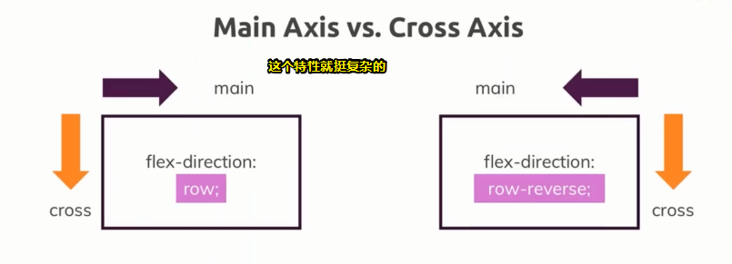
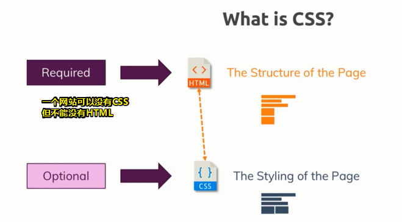
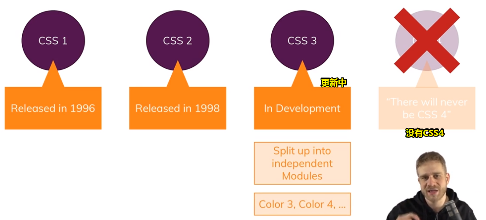
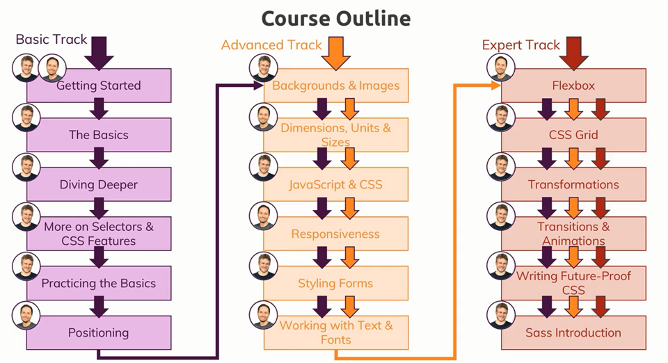
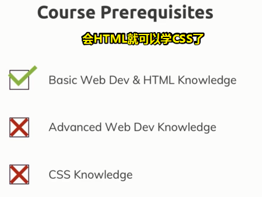
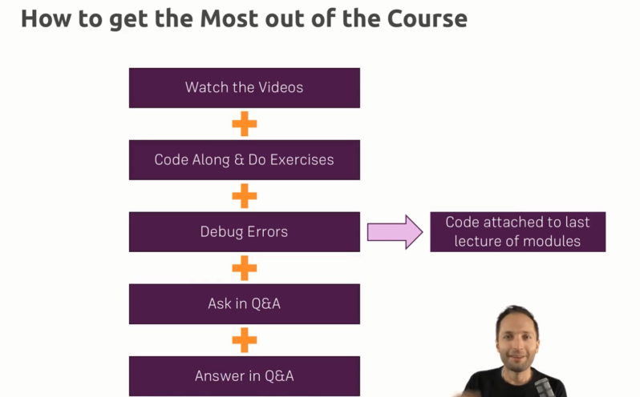

# 概述

## ★介绍

- CSS 入门不难，但是它也包含了大量简单或复杂的特性，当然，这也让CSS可以建起功能强大的网站

  

- 关于对CSS的学习，应用只是它的一方面，真正理解CSS背后不同的概念以及这样用的原因才是重中之重！

## ★什么是 CSS？

> 这是一个最重要的问题！

它是层叠样式表的缩写，至于，它为何被称为层叠式呢？——之后会说到！

CSS的**核心思想**就是**让你的网页更好看**，一般可以说网页是由HTML代码构成的，我们使用它来决定网页的结构，我们在网页里边添加HTML代码，并在浏览器显示这张网页的内容！

总之，HTML是**必要的**，所有网站都需要HTML！

而CSS则只是一个**可选项**，为啥这样说呢？

因为CSS不过是用于编辑HTML内容样式的，它让我们可以添加颜色和阴影等等各种视觉效果，以及将元素放在不同位置上

简而言之，CSS让我们可以把自己无趣的HTML网页变成精美的网站。所以如果你想让你的网页变得美美的，那就添加 CSS 这个可选项吧！

话又说回来，CSS到底能做些什么呢？

看一下这个例子你就知道了：[demo](./demo/01/css-in-action/)

可以看到页面不添加CSS时是很丑的，而添加之后，就漂亮起来了（请忽略那两个按钮）

页面之所以变得好看，那是CSS的成果，而这也正是我们使用CSS的原因所在！

至此，这个网页不仅有了基本的内容，而且也更加好看了！

接下来进一步来看看CSS到底是什么，以及它是从何而来的

## ★CSS 的过去、现在和未来？

目前我们大概知道了用CSS可以做什么，那么现在就来简单看看CSS的历史

- CSS第一版：1996年发布，这意味着历史上首次，终于有了改进网站外观的工具 
- CSS第二版：第一版发布之后，仅仅过了两年，第二版就发行了
- CSS第三版：这是最新版的CSS，而且目前仍在更新中

或许你会好奇，未来是否还会有第四版呢？

确定的告诉你，不会有第四版的CSS了，因为在第三版CSS时，CSS的更新升级方式改变了，CSS将不再更新版本，它被分割成了有不同特性的模组，比如控制文本颜色的模组、控制阴影的模组、控制动画的模组等等，而这些模组有不同的版本，而且以后还会不断有新的版本，甚至新的模组，这既是**为了适应现代的开发方式，也保持了CSS的活力**！

> 之前我一直把Modules翻译为模块，而模块组这个翻译即多个模块构成一组

W3C工作组：[Groups](https://www.w3.org/Consortium/activities)

CSS工作组和它们成果的概况表：[All Standards and Drafts - W3C](https://www.w3.org/TR/#tr_Cascading_Style_Sheets_%28CSS%29_Working_Group)，可见，它们在完善CSS的同时还在开发新的特性，我们不用把整个文档都看一遍，我们只需要知道这门课里边所深度讲解的那些重要的特性即可！

总之，我们要记住的就是CSS仍在不断发展，CSS仍在积极开发中，以后会有更加完善的新功能，而这也与网站开发本身不断发展进化的天性相合

## ★课程大纲（Course Outline）

有3条不同的学习路线：

- 基础路线（Basic Track）
- 高级路线
- 专家路线

为啥会这样划分呢？——因为不同的路线是根据观众的CSS能力提供了不同的起点，当然，不管你啥水平，你都可以从基础路线开始，一步步地扩充知识，假如你已经具备高级或专家级的知识，那么你也可以跳过一些课程，直接进入你感兴趣的章节

### ◇基础路线

1. 快速开始（差不多完成）
2. 学习CSS的基础（语法知识、怎么用等）
3. 深入一些CSS的基础知识，如讲解核心概念（比如选择器、盒模型）（真正理解是什么）
4. 深化基础知识，研究一些普遍的问题，比如使用ID还是类选择器（大家都行，为啥就要用你？何时用？）
5. 用学到的知识写一个项目（会用到全部的知识，让网站上的每个页面都有好看的样式）
6. 页面布局（改变页面上元素的位置，让元素处于正确的位置）

至此，基础路线就结束了，接下来就来到了高级路线。

### ◇高级路线

1. 背景和图片（如果你知道一些基础知识，那么你可以从这儿开始课程。这一节会学习背景和图片的样式，需要注意的是背景与图片是不同的概念）
2. 学习尺寸、大小、单位
3. 用 JS 控制网站 CSS 样式（做完这一步就基本完成了网站的核心内容）
4. 学习响应式设计（为啥要学习这个？——因为目前为止我们只有网站的桌面版，我们也希望用户使用手机这样的设备访问网站时，也能看到满意的效果）
5. 学习表单（有了响应式设计后，再学习表单，我们要做的就是为网站添加一个表单，并设计一个有趣的样式）
6. 学习文本和字体样式（这是高级路线的最后一章，虽然我们可以使用默认字体，但我们要做到更好）

高级路线学完之后，就会继续学习专家路线

### ◇专家路线

1. 弹性盒子（一个牛逼的工具或者说是概念，通过它，我们可以动态改变元素在网站上的显示位置）
2. CSS 网格布局（一个新的CSS特性，更重要的是，它不同于弹性盒子。我们会学习它的原理以及其与弹性盒子盒子的区别）
3. 学习CSS变形（为啥要学习它呢？——因为通过变形，我们可以旋转元素，所以我认为这是一个非常值得学习的特性）
4. 学习过渡和动画（因为这些特性可以增强用户反馈，并且还能为我们的网站带来更好的浏览体验。学习这一步，这个课程就基本完成了。还剩下最后两章）
5. 学习写不会过时的CSS代码（由于CSS是在不断进化的，所以我们要跟上潮流写不会过时的代码，说白了，就是过时的语法，就不要写了）
6. SASS（是CSS的一种，但更易使用）

至此，课程导览就此结束

现在有一个问题，那就是「如何顺利完成本课程？」

> 以上内容都了解过啊！不过对一些核心概念的认识，我觉得自己还停留在表面理解！

## ★先学要求

- 学习该课需要哪些要求？以及如何成功通过这门课？

  - 对HTML有基本的了解，这很重要，毕竟CSS是建立在它之上的。总之了解基础知识是必须的！
  - 除了上边提到的基础知识，其它高级的web知识就没有要求了，即不需要了解 JS 、Web开发框架（如 Vue 、 React 等）
  - 不需要了解 CSS 知识，毕竟我们要学的就是CSS啊！

  总之懂得基础的HTML，那就可以开始学CSS了

## ★本课应该怎么学？

学习课程的最佳方法：

1. 首先当然是认真看视频啦！（这个非常重要，在视频里边，老师会说明我们要做些什么，为什么要这样做，并介绍对应的概念「How、Why、What」）
2. 除了看视频以外，更重要的是独自写一些代码。利用这个机会，根据所学的知识来完成自己的项目。你能从视频里边学到基础概念，但是只有独自写代码，才能发现自己的欠缺，然后你再回顾视频，弥补不足。除了独自写一些代码以外，请一定要做做练习，该课程有大量的作业与习题，总之，请你最好做一做，并尽力完成，当然，老师也会提供答案，告诉你为何要那样做。总之，实践是学习CSS的重要一环，同理，网站开发也是如此！
3. 解决bug。虽然你可以看着老师的视频敲代码，但是你也可能会写出错误代码。因此在每一章的最后一课都附上了源代码，对比源码和自己的代码，然后尽量找到细微的错误。总之，解决bug是很重要的，毕竟认真检查代码，可以帮助理解并记住重要的概念，如果你尽力了，还是解决不了bug，那么你就在答疑版块提出你的问题，老师会尽力回答你所有的问题，为你答疑解惑。
4. 比提出问题更重要的是尽量在答疑环节里边帮助别人。因为我们知道提问很简单，而回答问题是很难的。回答问题可以让你重温学过的内容，而且更重的是，也帮助 了别人。不要担心答错问题，因为在知道了正确答案后，你也复习了一次，而这也是本课程的目的！

至此，你知道应该怎么学习本课程了吧！

在正式开始学习CSS之前，还有一个问题，那就是本课程会用到什么工具呢？

> 我觉得看所有视频的学习都是这样的方法，即认真看、实践、解决bug、实在解决不了的bug就提问、他人的提问你会的话也可能的回答一下，即便是错误的，毕竟错了之后意味着对此不熟悉，知道正确答案后，即相当于是复习了一次，并加深了对此的认识！更重要的是，我们帮助了别人！

## ★推荐的工具

一个好消息：主要使用的软件只有两个

- VS Code，当然，你也可以使用其它文本编辑器或者是IDE。之所以用 VS Code，是因为它真得很好用，并且非常强大，对于这门课程来说是很好的选择
- Chrome，使用Chrome作为浏览器，当然，你也可以自行选择其它浏览器，如QQ浏览器、火狐浏览器等。我们之所以选择Chrome是因为，它拥有强大的开发者工具，而在这门课里边也会深入研究开发者工具，总之，拥有强大的开发者工具是非常有帮助的，尤其是你想要理解CSS的核心逻辑，以及它如何与我们网站上的不同部分互动。

以上就是老师推荐使用的工具。

> 目前，我就是用这两个工具来进行前端开发的。

## ★总结

- 知道了学习CSS的大致路线，以及CSS3此刻处于什么状态
- 知道了看视频学习的方法论是啥！