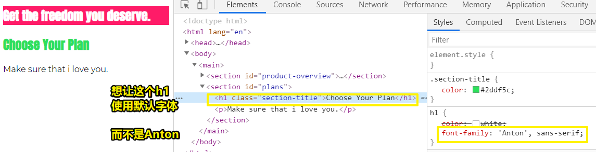
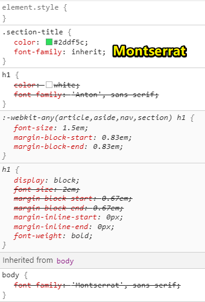
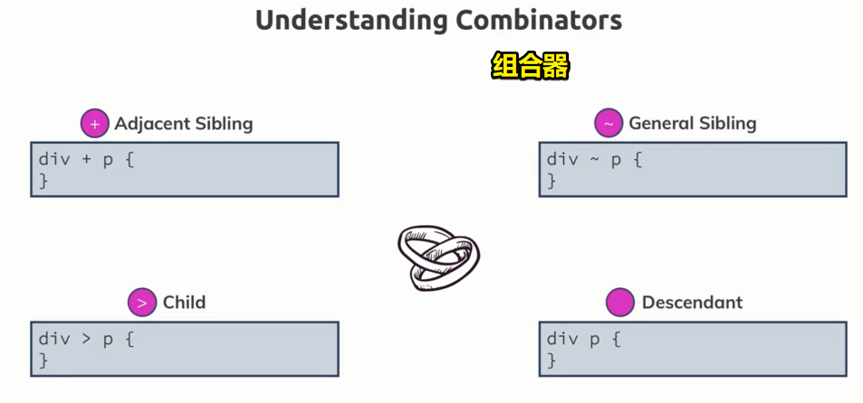
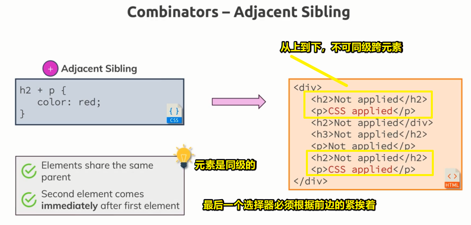
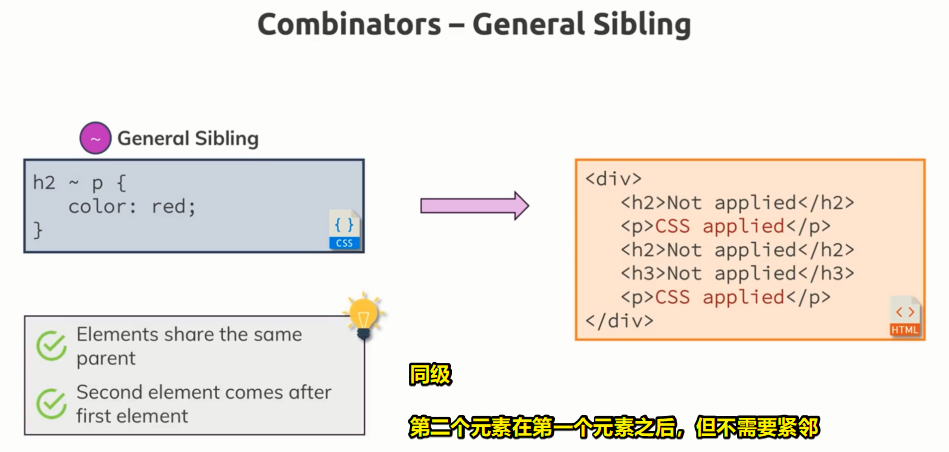
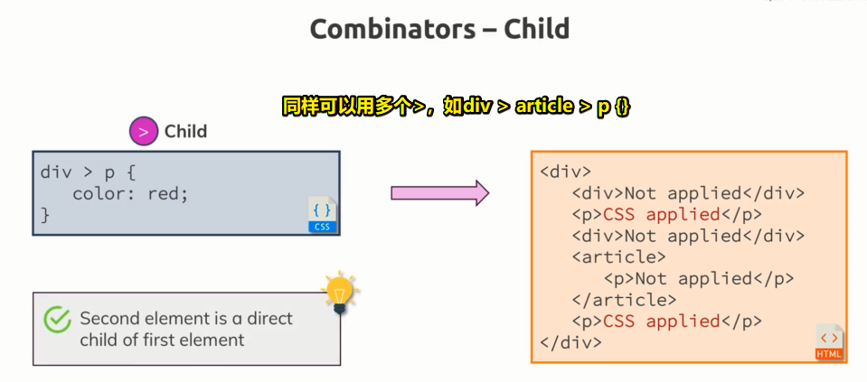
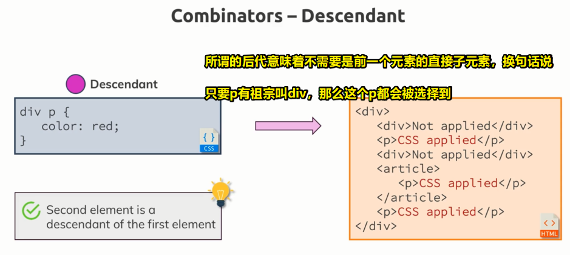

# 添加组合器、组合器是什么

## ★添加组合器

理解了样式继承的概念之后，就来看看「组合器」

### <mark>1）目前需求</mark>



要想使用默认字体，有两种方法可以实现

### <mark>2）inherit</mark>

h1 -> set font-family 的 value 为 `inherit` 

inherit -> 是一个特殊的关键字 -> 它表示「请使用继承样式」 -> 基本上，这可以理解为，它给予了这个font-family属性大于继承的优先级

``` html
<section id="product-overview">
  <h1>Get the freedom you deserve.</h1>
</section>
<section id="plans">
  <h1 class="section-title">Choose Your Plan</h1>
  <p>Make sure that i love you.</p>
</section>
```

``` css
body {
  font-family: 'Montserrat', sans-serif;
}

.section-title {
  color: #2ddf5c;
  font-family: inherit;
}

h1 {
  color: white;
  /* 这个字体我们只想让第一个section旗下的h1有效 */
  font-family: 'Anton', sans-serif;
}
```

结果：



虽然，body的font-family看上去没有被用上，但其实是用到了，因为我们用了 `inherit` 关键字

不过，这并不是最好的实现方式

比如说，如果还有另外一个h1标签，它可能有不同的类，但同样想要默认的字体，那么在它这个class选择器里边，同样需要添加 `font-family: inherit;` 

而且我们也很难猜测继承过来的是啥字体，毕竟有删除线划掉了body的样式

既然如此，我们是否可以反其道而行之，即让第一个section里边的h1成为唯一使用 `Anton` 这个字体的元素，而不是默认对所有h1标签都使用同样的字体样式

总之，与其在其它元素里边排除 `font-family: 'Anton', sans-serif;` 这个样式，还不如仅仅只作用于第一个h1标签

### <mark>3）为什么不用class和id来搞？</mark>

而做到这一点，有两种简单姿势：

1、h1 -> class -> 名字 -> first-section-title -> 这是一个很蠢的名字 -> 毕竟这这个名字不大可能会被重用 -> 所以 -> 添加class可能不是最好的选择 -> 毕竟假如追加了一个新的section，如这样：

``` html
<section>
  <h1></h1>
</section>
<section id="product-overview">
  <h1 class="first-section-title">Get the freedom you deserve.</h1>
</section>
```

那么，就得叫second-section-title了，不然就名不副实了

2、h1 -> id -> 使用id重用不是问题了 -> 不过我们section元素里边已经有了一个id了 -> 语义上，我们不想再添加一个id，况且命名问题依旧存在

这两种姿势，都不是我们想要的，所以我们该考虑使用所谓的「组合器」了

### <mark>4）组合器</mark>

组合器 -> 可以把多个选择器组合起来，以此来更精确地选择元素

给h1选择器添加一个组合器 -> 以此来缩小我们想选择的h1标签的范围

我们想让id为「product-overview」的元素的旗下所有的h1标签里边的文本都是 `Anton` 字体

做到这一点 -> 组合选择器 -> `#product-overview h1` -> 表示 -> `#product-overview` 旗下所有的h1元素都会被选择到 -> 注意，h1不需要是 `#product-overview` 的直接子元素，说白了h1与它之间还可以有其它元素，如这样：

``` html
<section id="product-overview">
  <div>
    <h1 class="first-section-title">Get the freedom you deserve.</h1>
  </div>
</section
```

### <mark>5）小结</mark>

- 所谓的组合器 -> 组合了多个选择器 -> 明确了更具体的元素 -> 有种给定了上下文的调调

- 使用组合器要注意的点 -> 组合器它创建了一个更高的优先级 -> 具体可通过开发者工具查看Styles里边样式规则应用的顺序 -> 说白了，组合器要比h1的优先级高得多，而这也意味着，在css文件里边书写样式规则无顺序可言

- `h1{}` vs `#product-overview h1 {}` -> 后者这条规则相对于前者拥有更多的信息 -> 毕竟后者缩小了想选的h1标签的范围 -> 总之，较多信息的规则优先于较少信息的规则 -> 而涉及到优先，也就意味着没有所谓的css书写顺序影响问题

- 越是具体详细的规则，优先级更高 -> 注意，不要把组合器跟样式继承给搞混淆了 -> 即不要认为 `#product-overview h1 {}`的意思是，h1继承了`#product-overview`的样式 -> 我们只是碰巧给 `#product-overview` 旗下所有的h1文本设置了样式 -> 总之 -> 这个组合器跟继承样式不同，因为 `#product-overview`不是自动传递下来样式给h1标签 -> 我们只是显示地、**有范围的**选择了h1标签

- 使用组合器 -> 可以让我们不用关注过多有关为class和id的命名问题

以上就是关于优先级最后的内容了，以及什么是组合器的内容

更多组合器的相关知识，请看下一节……

## ★理论课时间——组合器是什么

### <mark>1）前言</mark>

上一节，初步了解了「组合器」（combinators），当然，这仅仅只是了解了一种组合器，而这还有更多的组合器

确切地来说，有四种重要的组合器

组合器 -> 可以明确我们的规则 -> 通过向选择器传递更多的信息来实现对元素的选择



### <mark>2）相邻兄弟选择器（`+`）</mark>

`div+p {}` -> 可以不止两个选择器 -> `div+p+a {}` -> 选择与div元素和p元素相邻的a元素 -> 可怎样才算是相邻的呢？——之后会说到

### <mark>3）通用兄弟选择器（`~`）</mark>

使用波浪号连接你想要组合的选择器

### <mark>4）子选择器（`>`）</mark>

子组合器使用大于号连接

### <mark>5）后代选择器（` `）</mark>

后代组合器使用空格

### <mark>6）组合器的具体实现</mark>

1、相邻兄弟选择器：

特点 -> 直接相邻的兄弟关系 -> `+`



2、普通兄弟选择器：

特点 -> 大概同上，只不过要更灵活一点 -> 如`h2 ~ p` -> 只要满足有一个兄弟是h2，那么其余的即便不是相邻的p都会被应用上CSS样式 -> 说白了，只要h2与p同级，那么同级下的p都会被应用样式 -> 注意，这同样是朝下走的，即如果在h2上边有p，那么这个p不会被应用样式



> 第二个元素不需要紧跟其后

3、子选择器

特点 -> 每个元素都是前一个元素的直接子元素 -> 精确地选择你的目标子元素 -> 任何一个直接子元素 



4、后代组合器

特点 -> 具体是哪一级都咩有关系 -> 即元素是直接的或间接的都是可以的，只要在DOM里边存在前一个元素是在后一个元素之上就可以的了 -> 如`div p{}`，只要在DOM里边存在div在p之上，那么这些p都会被选择到 -> 这是最频繁使用地组合器



### <mark>7）小结</mark>

- 使用组合器的关键 -> 它能提高精确度

- 注意 -> 没有组合器的直接选择器，性能会更好一些 -> 当然，这也不是说，组合器多么的不好，总之，关键是看你组合的东西

- 组合器性能很好的示例 -> `#product-overview h1{}` -> 为什么说好呢？ -> 因为h1元素非常明确，如果换成是 `#product-overview *{}`这样只用`*`的话，那就很糟糕了，况且我们还使用了id选择器，而id选择器的性能是很好的，毕竟在一个页面里边它只出现一次哈，当然，class的性能也很好 

- id和class选择器的性能都很好 -> 所以有使用到它们的组合器，性能也不错 -> 总之，如`#product-overview h1{}`这样的组合器非常有用，而且也应用的最广，毕竟这样的组合器可以让我们准确地选择到元素并且也能快速调整APP中你想设置样式的部分


