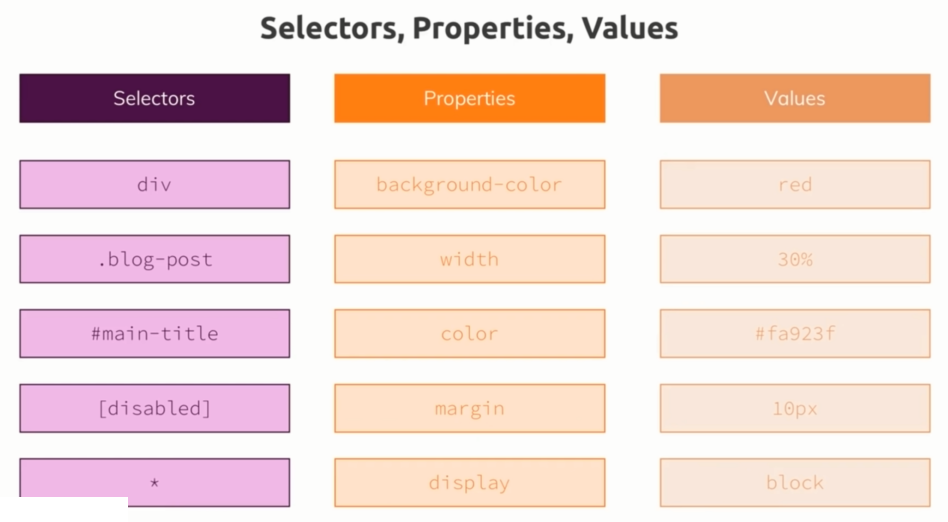
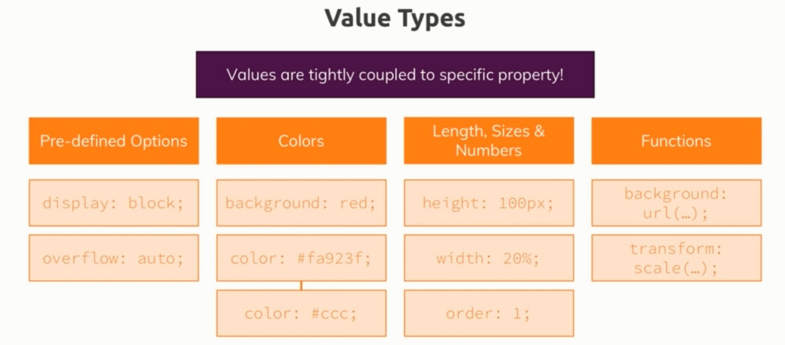

# 属性和选择器总结

> 本章重点讲解CSS的基础内容，并且结合了选择器、属性和值一起讲解

### <mark>1）回顾讲了什么</mark>



1、选择器有哪几种

2、属性有哪些 -> 如背景色与color、margin、display相关

3、CSS规则用到的数值 -> 如px、预设值（预先定义好的值）如block等

### <mark>2）如何确定哪些属性和值是存在的？</mark>

1、属性 -> 谷歌搜索「css mdn reference」

1. 通用CSS属性参考 -> [CSS Properties Reference - CSS: Cascading Style Sheets - MDN](https://developer.mozilla.org/en-US/docs/Web/CSS/CSS_Properties_Reference) -> 常用的CSS属性，以及在JS里边操作CSS属性的用法

2. 主要的CSS参考 -> [CSS reference - CSS: Cascading Style Sheets - MDN](https://developer.mozilla.org/en-US/docs/Web/CSS/Reference) -> 会了解到CSS基本的语法解释 -> 在关键词索引 -> 这是找到特定属性的一个好方法 -> 也是寻找属性的更多信息的好方法 -> 如你在Stack Overflow里边的解决方案里边找到的但没有理解透彻的属性

3. Mozilla CSS 扩展 -> [Mozilla CSS extensions - CSS: Cascading Style Sheets - MDN](https://developer.mozilla.org/en-US/docs/Web/CSS/Mozilla_Extensions) -> 还有Chrome CSS 扩展等

以上都是一些很好的参考内容，不过这不是你现在应该开始去学习的东西，总之，这些就是参考文档，对哪个属性不熟悉就去这些参考页面里边去查就好了，就像是查字典一样，你总不能把整本字典都背下来吧！

### <mark>3）记住一件你不应该做的事</mark>

1. 不要用心去记住这些属性，毕竟它忒多了，而且有一些属性，我们根本就不会使用到 -> 所以记住它们所有是很难的

2. 很多项目 -> 对于我们来说，一直在使用相同的一套属性 -> 也许有20个

### <mark>4）关于值的参考？</mark>

参照刚刚给出的参考表 -> 点击里边的某个属性 -> 可以看到怎样设定它的值 -> 毕竟值与特定属性紧密耦合的

### <mark>5）值的类型大致分为四类？</mark>

> 当然，还有其它的一些特殊情况 -> 即除了这四大类以外，还有一些不知道该归为什么类的值



1、`Pre-defined Options`：

使用的属性只是使用了预定义的选项 -> 即所谓的默认值哈，这一点在设计一个UI组件的时候，会经常用到的 -> 如很多元素默认就有个`display`属性，而且值为`block` -> 对display属性的理解 -> 只是一个不使用16进制值和数字的属性，而且它只接受几个预定义的值

2、`Colors`：

表示颜色的值 -> 关键字如red -> 颜色的16进制码 -> 16进制码的缩写形式 -> 后期会深入研究的特殊颜色函数

3、`Length、Sizes & Numbers`：

长度 -> px等、尺寸 -> 百分比、数字 -> 整数

4、`Functions`

url -> 在background里边设置多种颜色、scale变形函数 -> 用来缩放 or 旋转元素、更多的值 -> 都包含到参考表里边了

### <mark>6）小结</mark>

- 列出一些关于属性和值的参考列表，只是为了让大家知道在哪里找到属性以及其值的更多信息，并且如何应用它们

- Basic rule syntax（基础的规则语法）

```c++
style-rule ::=
    selectors-list {
      properties-list
    }


selectors-list ::=
    selector[:pseudo-class] [::pseudo-element]
    [, selectors-list]

properties-list ::= 
    [property : value] [; properties-list]
```

`::=`给我的赶脚就像是声明 `style-rule`是长啥样的

`[]` -> 表示`[]`里边的东东是可选的

如 ：

`selector-list` -> 可以有一个`selector`，也可以有多个以空格 ` ` 或逗号 `,`等划分的`selector`

`properties-list` -> 可以有一个「key+value」，也可以有多个以 `;`划分的「key+value」

对`list`这个单词的理解 -> 有重复的味道 -> 即重复那些格式一致的东西 -> 给我的启示 -> 抽离一样的东西出来 -> 如selector类、properties类 -> style-rule类


