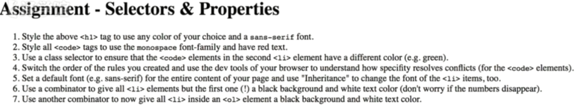
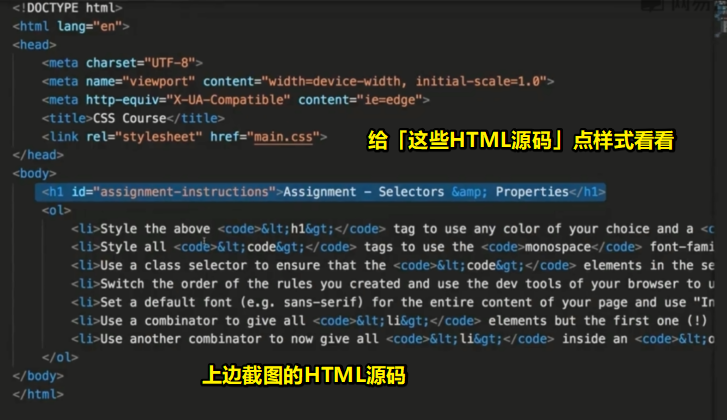

# 练习

在这一章里边，我们了解了选择器和属性，以及如何编写CSS规则来选择不同的内容

解下来，就是练习一下之前所学的内容了

练习题目如下：

要做什么（有以下几个练习）：

1. 对在最上边的h1标签搞个任意颜色，并且是「无衬线」字体 -> 这显然是针对英文文本的内容哈
2. style -> code标签  -> 有好几处 -> monospace字体 -> 红色文本
3. 更改练习2里边的一部分 -> class选择器 -> 选择第二个li标签里边的code元素，然后设置一个不一样的颜色，如green -> 这不是针对所有的code颜色，而是第二个li里边的code元素
4. 修改以上练习创建好的样式规则的顺序 -> 使用浏览器的dev tools来理解如何解决对code元素应用样式规则发生的冲突 -> 毕竟有两处代码设置了code标签的文本颜色 -> 总之，你需要理解为何选择了其中的一个颜色，以及，修改规则的顺序与之有什么关系
5. 对整个页面的内容set默认字体，如「sans-serif」 -> 通过学习过的继承概念来设置整个页面的内容 -> 还得通过继承修改第二个li标签的字体
6. 使用组合器来选择除了第一个li的所有li标签 -> set 黑色背景、白色文本 -> 如果左边数字消失了，这很正常，毕竟这是前景色和背景色的锅
7. 综合运用前面的知识，使用不同的组合器来选择所有ol标签里边的所有li标签 -> set 它们为黑色背景和白色字体 -> 有很多方法可以来选择所有的li标签 -> 总之，你要保证使用到了组合器

以上就是这章所有的练习内容了 -> 这些练习内容都是你在这章所学习到的所有内容 -> 在下个视频里边，你可以对比里边的答案，看看你的解决方案是否和老师的一样

测试代码：

直接干？——不用了，我已经在脑子里边做了一遍