# CSS基础入门

## ★本章介绍

> 直接从CSS基础开始学习

本章包含哪些内容？

1. how to add css to html (学习如何将CSS加到HTML页面里边去，以确保页面有较好的显示效果，而且还有学习添加CSS的几种的不同的写法)
2. 如何设置CSS规则（CSS Rules）?（学会如何往页面加入CSS之后，那么就得知道如何编写CSS代码，来改变页面的显示）
3. 深入学习选择器（selectors）、属性（properties）和值（value）。（为啥要深入学习这个呢？——因为这些内容对编写CSS规则很重要）
4. 除了学习跟之前的主题相关的一些内容，还会来看看如何解决样式冲突的问题（Conflicting Styles）

总之，有很多东西要学！

## ★理解课程项目配置

- demo目录：一个favicon.png、一个index.html
- 简单的HTML文件：一个声明，一个html标签，head和body标签，其中body的内容就是页面呈现的内容
- 没有CSS，页面也是完全可用的，即内容也是可阅读的（明白这一点很重要）！同样一个页面，在不同浏览器里边打开它会有所不同，毕竟为元素内置的默认样式可能会有所不同
- 如何让页面变得好看？——可以使用CSS来实现，下一节会学习如何使用CSS，我会用3种不同的方式给页面添加CSS代码

## ★用内联方式往我们的项目中添加CSS

我们希望给页面添加一些CSS样式，以此来让页面变得更好看点，那么这该如何添加呢？

有三种不同的方法可以添加CSS：

使用内联样式：如果你想给某个元素（如 `section`）添加样式，那么通过给它添加`style`属性即可做到：

``` html
<section style="color:red;">我是红色的</section>
```
`style`这个属性是普通的的TML属性，基本上可以添加在任何元素上！

`style`的值是一条条CSS语句，当然，你也可以认为把一条条CSS语句作为参数传入到双引号里边去！(就像是调用函数传参一样)

「我们想要给元素定什么样的样式，以及怎么展示该元素的样式」就是在做**CSS声明**的工作！

> 一条CSS声明就是一条CSS语句！

「我们想要给元素定什么样的样式，即为元素穿啥样的衣服」的潜台词就是要给元素设置啥样式属性，如background、color等等，而这也就类似于穿短裤、短袖、风衣、校服、牛仔裤什么的……

> 有个标准的[CSS属性表](https://developer.mozilla.org/en-US/docs/Web/CSS/Reference)，其中有很多CSS属性重用现象很明显，即它们是烂大街的CSS属性，而这些属性则是需要你去记忆的！需要注意的是，有些CSS属性是不可用的，即以前可用，现在不推荐使用了！

「我们可以给属性设置一个值」的潜台词就是说「值是用来定义怎么展示样式的」

> 一条CSS语句的语法是：「属性」+「:」+「值」。多条CSS语句以「;」隔开

总之，设置什么样的值取决于什么样的属性，如你要给元素定 `color`这样的属性，那么你可选的值就是类似「red」、「#fff」这样的值，而不能出现什么「100px」、「block」等这样的值！

我们输入`red`这样的值，就是在声明这个元素的字体颜色展示为红色这样的样式。（大家快来看啊！这个文本内容是红色的，可不是黑的黄的绿的白的……）

关于 `red`这个值，其实这样的值是内置的颜色，本质其实就是一些16进制颜色代码！

关于16进制颜色代码：你可以使用或者混合任何你所需要的样色！它以「#」开头，然后才是颜色的16进制值，有很多颜色可供我们选择，如 `#ff1b68`这个好看的红色系颜色！

通过 `color:#ff1b68`这行CSS代码，就可以改变一个元素的样式了！而 在这里我们是通过所谓的「内联样式」来实现的！

**总之，内联就是你在想添加样式的元素上直接使用style属性。**

不过，实际上并不推荐这种写法，因为：

1. 如果你要创建一个内容很多，而且需要添加很多样式的页面，那么这样代码的可读性就很差了（即HTML代码和CSS代码可读性很差！）
2. style属性总是要写在要改的元素上，如果你要改变样式， 那么你必须文档流里边找到那个style属性，可见这是很难调试的！
3. 如果你有多个样式声明，如有10个，那么style属性的内容就会非常长了，而且这样的代码显然也很难阅读！

> CSS规则=选择器+声明块。
> ➹：[How CSS is structured - 学习 Web 开发 - MDN](https://developer.mozilla.org/zh-CN/docs/Learn/CSS/First_steps/How_CSS_is_structured)

因此，CSS还有一种更好的写法，而这种写法需要用到所谓的「选择器」，接下来，会探讨剩余的两种引入CSS的姿势！

## ★理解 `style` 标签以及创建 `.css`文件

既然我们知道了内联样式有种种缺点，那么我们就找一个更好的替代品吧！

<mark>1）第一个替代品：</mark>

在head区域里边添加一个特殊的 `style` 标签，当然，这也是一个常见的HTML标签哈！

在style的开始标签和结束标签之间，我们可以编写所谓的「CSS规则」

一个与元素上写的style属性的相同点：

> 都是 `font-size:16px;`这样的CSS规则

一个不同点：

需要添加一个所谓的「选择器」，毕竟如果你直接这样写：

``` html
<head>
  <style>
    background： yellow;
  </style>
</head>
```

的话，CSS是不知道你会在哪里使用这个背景色的。

可既然如此，那我们该如何把这样式应用到某个元素上呢？

很简单，我们不需要像之前那样直接在元素上操作，如写个style属性之类的

我们只需要给个所谓的「选择器」，就能告诉CSS要搞在那个元素身上！

「选择器」只是一段额外的信息，它指明了DOM中的某一个元素，即在body这个区域的某一个元素（包括body自己哈！）

总之， `background： yellow;`是个声明，用于告诉CSS「我想改变谁的颜色」

``` css
<style> 
  section {
    background: yellow;
  }
</style>
```

- section：是个选择器，我们可以为页面里边的不同元素（如h1、p、div）添加多种选择器（如标签选择器，兄弟选择器等）

- `{}`：`{}`里边的是为选择器编写的声明，或者说是规则（其实整个「选择器+{}」才是一个规则）

标签选择器（不含大于号和小于号），如 `section`， 它会查找页面里边所有的section元素，style标签里边 CSS会自动在浏览器里边运行！

上边那个CSS规则的应用是这样子的：

1. 根据选择器找到元素
2. 应用样式声明

一图胜千言，规则集（通常简称为规则）


话说，浏览器是如何解析CSS的？或者说是浏览器拿到一个index.html文件，然后是如何去解析style属性的内容以及style标签里边的样式规则的？

> 一个认识很关键：那就是index.html里边的内容都是流，都是字符串！

➹：[探究 CSS 解析原理 - Jartto's blog](http://jartto.wang/2017/11/13/Exploring-the-principle-of-CSS-parsing/#about)

内联样式不好的原因之一：

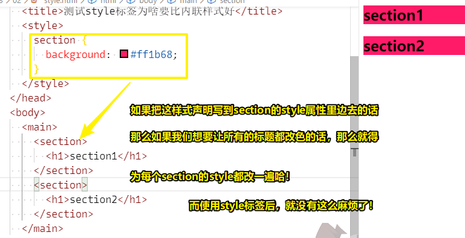

当然，还有另外一种添加样式的方法，那就是使用一个外部的CSS文件

关于CSS文件的名字，一般用main.css，因为这代表了网页的主页面，当然你也可以随便起哈！

既然有了一个css文件，那么我们就得把样式写到它里边去了

那么这该如何写呢？

很简单，把样式规则扔进去即可，不过，需要注意的是，这可不包含style标签哈，因为这不是HTML文件，所以不需要style标签！

为了让我们的main.css文件生效，我们需要在HTML文件里边声明需要使用main.css这个文件，如果咩有这个的话，那么浏览器根本就不知道这个页面居然还有对应的css文件，总之，浏览器并不会自动去扫描除这个HTML文件以外无关的东西！

因此，我们必须要在HTML文件里边显示地声明要使用main.css这个文件

做法：

1. 使用个link元素，跟我们使用favicon时那样添加个link元素
2. 设置rel属性的值为 `stylesheet`，表明我们要包含一个CSS文件
3. href属性是个超链接，告知应该指向哪一个文件，如果css文件，在某个子文件夹里边，那么可以 `xxx/main.css`，如果同级，那就直接 `main.css`即可

这种做法是最推荐的！因为使用外部的CSS文件时，你可以把HTML和CSS清晰地分离，尤其当你的CSS代码量越来越大，即head的开标签和闭标签的距离越来越大的时候，这会很有用，总之，谁也不想「头重脚轻」

还有一点就是，当你在多个页面使用CSS文件的时候，浏览器就会缓存CSS文件，这样一来就不必为每个页面重新下载CSS了

况且，如果你把样式放在了head区域，那么HTML文件的大小就会增加，而作为HTML文件的一部分，浏览器就得重新下载它们，由于每个页面都下载，导致加载更慢了

总之，就是要使用外部CSS文件，即便该CSS文件里边只有一个样式规则！


## ★应用扩展样式以及导入谷歌字体

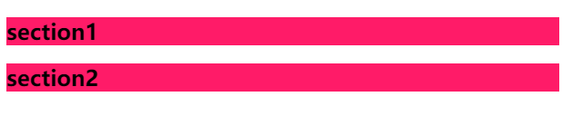

### <mark>1）我们要干的事儿——如何更改除了背景以外的其它东西</mark>

1、改变屏幕上网页的模样 -> 简单的样式 -> 变得有点好看 -> 但这算不上是美观 -> 所以我们需要添加不同的样式 -> 如字体（默认字体我认为不好看）、文本颜色、文本相对于周边区域的位置也许可以改一下

2、希望这两段文本的样式是不同的 -> 毕竟这两部分在网页里边会承担完全不同的职责

总之，更改背景中的或者是背景所在元素中的文本 -> 更改儿子和孙子……的文本样式 -> 为不同部分应用不同的样式

### <mark>2）添加不同的样式——效果立竿见影，所以先来</mark>

1、更改字体样式 -> h1里边的字体以及颜色 -> 要实现此目的 -> 往css文件里边搞个新的选择器 -> h1选择器+{} -> 改颜色和字体类型 

2、颜色 -> color属性 -> 改变文本颜色 -> 为啥通过这个属性就可以改变文本的颜色？ -> 这是经验哈，你经常用这一套属性慢慢就会了，若遇到不懂的，去查参考手册就好了 -> 调用（call）color属性，把color的参数设置为white -> 两个h1下的文本颜色都改了 -> 显然完全符合逻辑 -> 毕竟h1选择器选择了所有h1元素而不是一个 -> 这是要改动的第一处 -> 改动更多处

3、怎么改字体？ -> 更改font-family属性即可 -> 往h1选择器里边添加额外的属性——font-family -> 改动 -> h1标签里边的文本的字体样式 -> 浏览器有默认字体，查看浏览器的[设置 - 自定义字体](chrome://settings/fonts)即可 -> 不设定字体类型 -> 使用默认字体 -> 这个默认字体分为三大类 -> Serif 、Sans-serif、Fixed-width （也是关键字）-> 如果设定字体类型为Sans-serif，那么就会找到Sans-serif旗下的默认字体 -> 同理其它也是如此

4、并非仅能使用系统中已有的字体 -> 但衬线、非衬线、等宽字体都是不错的选择，毕竟它们都会调用浏览器默认字体 -> 关键字 -> 选择其中一种在某种程度上**一直符合**你要求的字体

5、需要某个特定的字体 -> 用户的电脑可能没有安装该字体 -> 调用一个非预装的字体 -> 使用工具——[Google Fonts](https://fonts.google.com/?subset=chinese-simplified) -> 这个字体工具网页里边有很多很牛逼的字体 -> 你可以很方便地把这些字体导入到任何网页里边去 -> 选择一种你想要到项目里边使用的字体 -> 如Anton -> 做法如下：

1. 搜索字体，找到字体
2. 点击「+」，弹出一个框框
3. 在head标签里边link一下（样式文件之前）：`<link href="https://fonts.googleapis.com/css?family=Anton&display=swap" rel="stylesheet">`
4. 在css里边应用该字体规则的代码：`font-family: 'Anton', sans-serif;`
5. 替换原先的字体类型样式声明

6、导入外部谷歌字体 -> 使用链接动态导入 -> 即该字体会被导入到任何用户的任何机器里边去

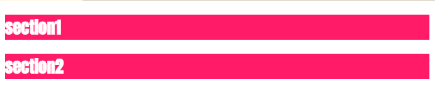

以上就是对颜色以及字体进行更改的方式了 -> 这样操作后网页更好看了 -> 当然，这两个section之间的内部空间再大一点或者把它们周围的空白去掉会更好一点 -> 另外如果这两个section的样式不同那就更好了 -> 毕竟之前说过，它们俩不应该看上去一样哈 -> 还有很多活儿要干  -> 接下来，从让两个section的样式变得不同开始


## ★理论课时间——选择器

### <mark>1）涉及到更改样式</mark>

1、为属性分配属性和值 -> 确保不在整个页面上使用相同的值 -> 有时想要所有h1标签里边的文本字体大小一样，但有时又不想要一样的 -> h1标签语义虽然相同，但我们想让它们看起来不一样 -> 页面出现相同的section和h1 -> 让它们的样式不同 -> 使用其它选择器

### <mark>2）有哪些选择器？</mark>

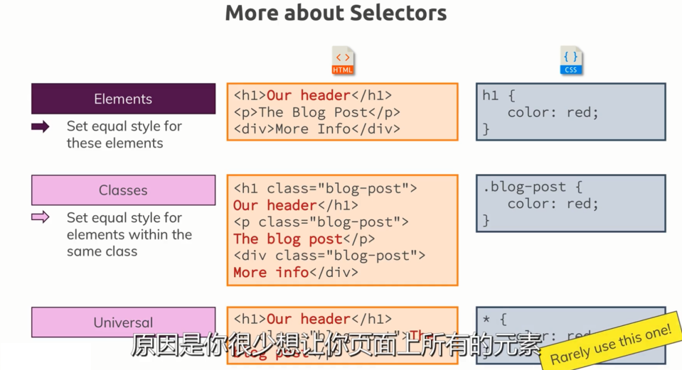

1、 元素或者标签选择器 -> 把这些元素都设置成相同的样式

2、Classes -> 它们一个与CSS紧密相连的概念 -> 通过类，可以指定一种样式 -> 把样式应用到具有相同类的所有元素上 -> 用法 -> 添加到HTML元素的class属性里边去 -> 关键读法「所有的xxx类」 -> 样式使用，需要我们自定义，浏览器可没有默认关于xxx类的样式 -> 「.xxx {}」

3、通用选择器 -> 何时用 -> 有时候，我们想要为整个页面里边的所有元素设置一个特定的样式 -> 用法：`* {}` -> 不过很少会使用到这个选择器 -> 原因是我们很少会让页面上所有的元素都使用相同的样式 -> 当然，除了一种特殊情况

### <mark>3）另外两种重要的选择器</mark>

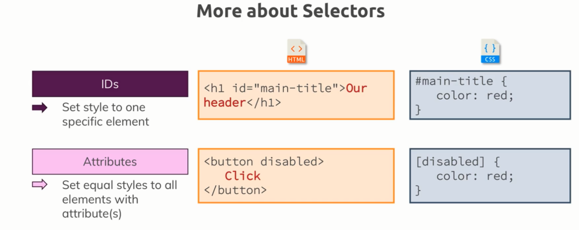

1、ID选择器 -> 根据ID选择元素 -> 何时用？ -> 将一个样式添加到一个特定的元素 -> 特点？ -> ID只会出现一次 -> 只会在那一个特定的元素上应用样式 -> 做法？ -> 选择任何你想要的ID名，如zzz -> `#zzz {}` -> 声明样式规则

2、属性选择器 -> 一个主要的选择器 -> 何时用？ -> 根据元素的属性来选择器HTML元素 -> 特点？ -> 可选择多个元素，不像ID选择器那样只能选择一个 -> 语法？ -> `[disabled] {}` -> 不管是button元素还是其它元素，只要有这个属性就会被样式选择到

以上就是理论部分啦，在整个课程里边都会看到它们的身影

只使用一个元素选择器，并不能完全解决设定样式的问题，因此，我们需要用上更多的选择器，才能让页面变得更加的好看起来


### <mark>4）设置不同的样式</mark>

``` html
<section>
  <h1>section1</h1>
</section>
<section>
  <h1>section2</h1>
</section>
```

可为这些section添加一个id -> 使用ids并不是只有当我们要给元素设置样式时才去添加一个属性 -> 有了id后 -> 你还可以在url后添加一个 `#`配上相应的id，如 `#xxx` -> 点击链接，浏览器会立即跳到页面里边那个id属性值为 `#xxx`的那个元素身上去 -> 当然，你也可以说滚动到该元素的位置 -> 不管怎样 -> id属性可用来设置样式，也可以用来作为锚点

class命名建议 -> 只有一个单词 -> 首字母大写 -> 多个单词，小写字母开头，多个单词用破折号连接，即所谓的烤串命名法 -> CSS不区分大小写

id vs class -> 有机会重复使用，class是一个不错的选择，否则id可能会更好

使用多个类 -> 用空格隔开它们 -> `class="xxx zzz"`

### <mark>5）小结</mark>

如何让HTML结构一模一样的家伙们看起来不一样？ -> 使用多种选择器来搞，如这三个非常重要的选择器 -> 标签选择器、id选择器、class选择器 -> 经常会在CSS代码里边看到它们三

规则 -> 选择器+{}+样式声明语句（一条或多条） 

规则集 -> 一个规则或N个规则

### <mark>6）代码</mark>

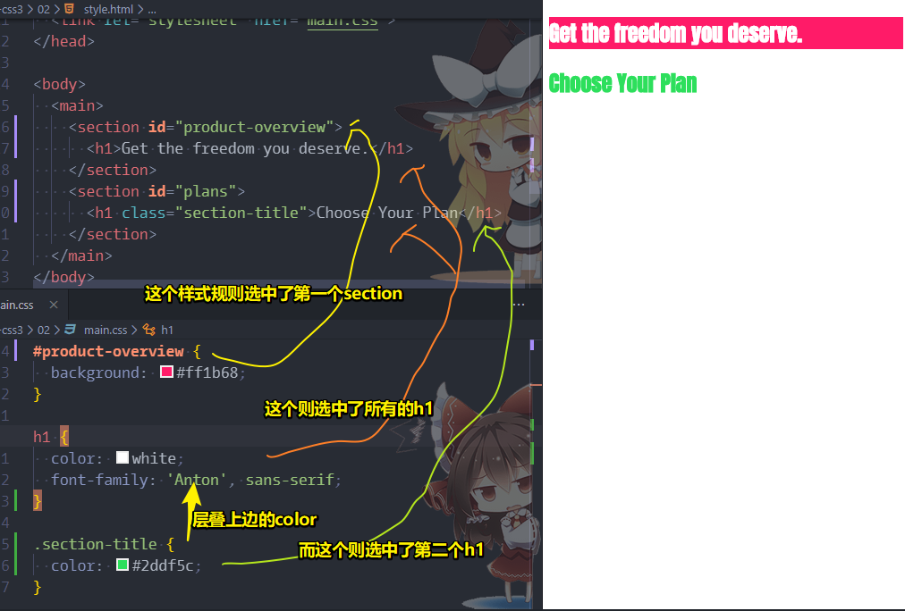

即便class选择器在h1前边，样式同样会被覆盖，毕竟class的优先级更屌，如果优先级一样，那么就是「长江后浪推前浪,前浪死在沙滩上」，即前边的样式被后边的样式给覆盖掉了

## ★理解CSS的优先级


## ★总结

- CSS布局主要是基于盒子模型的，因此，每个占用页面空间的块都有这样的属性：`padding`、`border`、`margin`。（可以把盒子看做是小木箱子，关于盒子模型，即把盒子抽象成页面的元素，而既然是模型，那么这就意味着有数据，而数据来自于元素的border、width等这样的属性！）

  ➹：[CSS basics - Learn web development - MDN](https://developer.mozilla.org/en-US/docs/Learn/Getting_started_with_the_web/CSS_basics)

- display: sets the display mode of an element。这给我的赶脚类似于webpack打包时是根据生产模式打包还是开发模式打包！

## ★Q&A

###  1、DOM和CSSOM到底是啥？

浏览器渲染页面前需要先构建DOM树和CSSOM树。

转换步骤： Bytes → characters → tokens → nodes → object model。

HTML标签被转换成文档对象模型（Document Object Model）。
CSS样式规则被转换成CSS对象模型（CSS Object Model）。

DOM和CSSOM是相互独立的数据结构。

``` html
<html>
  <head>
    <meta name="viewport" content="width=device-width,initial-scale=1">
    <link href="style.css" rel="stylesheet">
    <title>Critical Path</title>
  </head>
  <body>
    <p>Hello <span>web performance</span> students!</p>
    <div></div>
  </body>
</html>
```

上面的结构会被转换成如下DOM树:

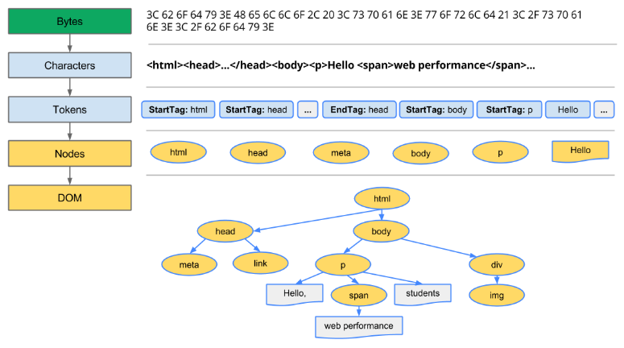

字节 -> 字符（根据文件的指定编码如utf8把字节转化成一个的字符串字符） -> 有标识的token（token化，即从一大串字符串里边挑出符合某种规则「 W3C HTML5 标准指定的规则」的东西出来，如看到`<html>`就搞成「`StartTag:html`」这种形式） -> 节点（词法分析这些token，然后产出定义了某种属性和规则的对象出来） -> DOM树（由于HTML定义了不同HTML标签之间的关系，如父子、兄弟关系，因此就把所创建的对象，即节点，搞到一颗叫「树」的数据结构上了，而该tree数据结构也捕获了在原始标签里边定义的父子关系、兄弟关系并映射出来）

> 每次浏览器处理 HTML 标记时，都会经历以上过程，而这个过程可能会花费一些时间，尤其是当我们需要处理大量的 HTML 时。如上边的HTML代码花了大约5毫秒才将一块 HTML 转换成 DOM 树！ 对于较大的页面，这个过程可能需要更长的时间。 而在创建流畅的动画时，如果浏览器不得不处理大量的 HTML，那么这很容易成为瓶颈（可能是性能方面，如用户很久才看到朴素的内容）。

Dom 树捕获到了文档标记的属性以及标记之间的关系，但是这个过程并没有告诉我们元素渲染（呈现）时的外观。 当然，这是 CSSOM 的责任哈！

CSSOM：

> 获取CSS变成浏览器可以操作的对象的过程，跟HTML差不多

当浏览器在构建我们这个简单页面的 DOM 时，它在文档的头部遇到了一个链接标记，该标记引用了外部 CSS 样式表: style.css。 考虑到它需要这个资源来渲染页面，那么它立即对这个资源发出请求，并返回以下内容:

``` css
body { font-size: 16px }
p { font-weight: bold }
span { color: red }
p span { display: none }
img { float: right }
```

当然，我们也可以直接在 HTML 标记(inline)中声明我们的样式，但是为了保持 「CSS 独立于 HTML」这样的理念，即这允许我们将内容和设计作为独立的关注点: 设计师可以处理 CSS，开发人员可以专注于 HTML，等等。因此，我们一般不会在HTML写上内联样式！

与 HTML 一样，我们需要将接收到的 CSS 规则转换成浏览器能够理解和使用的东西。 因此，我们重复 HTML 的过程，即用 CSS 代替 HTML即可:

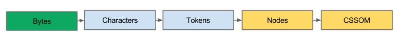

> CSS字节被转换成了字符，然后根据规则token(标记)一下字符，然后是节点化，最后它们被链接成了一个树结构，而这被称之为“ CSS 对象模型”(CSSOM) :

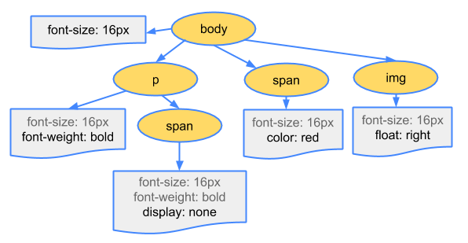

为什么 CSSOM 要有一个树结构呢？ 

因为当计算页面里边任何对象的最终样式集时，浏览器会从适用于该节点的最通用规则开始(例如，如果该节点它是 body 元素的子元素，那么则先应用所有从body哪里继承而来的样式) ，然后通过应用更具体的规则来递归地精炼计算得到的样式。说白了，这计算节点最终样式的规则就是「层层叠叠（cascade down）」（效果是你会发现，我们写的样式规则并不是完全一模一样的给到元素身上去的，而是不断地精炼，即咩有的会因为继承而被添加，原有的会被后来者覆盖，还有浏览器自身给了一些默认样式）

> 在Nodes这一步为节点添加样式规则，而HTML的这一步则是添加属性！

为了使上面的最终样式计算规则更具体点，以上面的 CSSOM 树为例。 

放置在 body 元素中里边的 span 标签里边包含的任何文本，字体大小为16像素，并且具有红色文本ーー font-size 指令是从 body 向下级联到 span的。 但是，如果 span 标签是 p 标签的子标签，那么就不显示其任何的内容。

> 级联这个词的特征：一对多。所以假如body有个可继承的样式声明，那么这个「1」就会影响到子孙后代这么多个元素的样式！

另外，请注意，上面的树并不是完整的 CSSOM 树，它只显示了我们决定在样式表里边重写的样式。 每个浏览器都提供了一组默认样式，而这也被称为“用户代理样式”(user agent styles)——我们没有提供任何自己所写的样式时所看到的样式——而我们所写的样式只是覆盖了这些默认样式罢了！

关于以上 CSS 处理了多长时间：

我们微不足道的样式表需要大约0.6 ms 来处理，而且影响了页面上的8个元素。

可这八个元素是从哪里来的呢？

不管怎样，CSSOM 和 DOM 都是特立的数据结构。

不过，事实证明，浏览器隐藏了重要的一步，即连接 DOM 和 CSSOM 的渲染树。（Render tree）

> 我纯属猜测，是因为有个span元素是display为none的缘故！

➹：[构建对象模型  -  Web  -  Google Developers](https://developers.google.com/web/fundamentals/performance/critical-rendering-path/constructing-the-object-model)


题外话，关于数学建模（我不知道编程建模和数学建模是不是可以看做同一个意思）：

> 数学建模是一帮数学家想利用数学知识去解决实际问题而研发出来的一种数学思考方法！

数学建模要解决的问题主要有五大类：

- 评价类：如面试新员工要对他们的综合能力做出一种评价
- 运筹类：如你要规划今日出行的路线
- 直接方程类：如你要研究人口增长的模式
- 预测类：如你要预测下一次下雨是什么日期
- 分析判别类：如你要用数据判断一个商品是正品还是次品

而要解决这些问题，或者说是模型，方法不只有一种，实现它的方法是多种多样的！而这里用到的方法，我们把它叫做算法！

如面前有两份大餐，小龙虾套餐、牛排套餐，而你身上的钱只能购买一份，那么选择哪一份好呢？

于是我们可以利用某种评价类算法来对这两样食物进行一个评价，然后选择一个得分较高的食物进行购买！如小龙虾评分高，那就选择小龙虾呗！

数学建模比赛主要有三个步骤：

1. 建模（整个比赛的基础，只有模型建得好，曲子变得好，才有发挥的余地）
2. 编程（相当于作词，是比赛重要的组成，只有编程能实现，填词做到位，才能把整个歌曲完成）
3. 写作（相当于歌唱，是比赛能否获奖的关键，只有论文表达得当，歌曲唱得圆满，才能吸引评委，得到高分）

如果我们把整个数学建模过程想象成编写一支歌曲，那就是

> 作曲（周杰伦）+词（方文山）+演唱者（周杰伦）

因此，「建模、编程、写作」三者在数学建模比赛中缺一不可，它们都是同样重要的！

个人一些认识：

建模（有各种类型的问题，分析问题，是否可编程解决问题，是否可把问题数据化）+编程 + 效果（是否达到预期情况）

搞了个DOM，是为了解决js操作元素的问题，有了DOM这个概念，需要编程搞一些解析器之类的东西，然后还有渲染之类的

我们输入一个HTML文件，浏览器就会处理这个HTML文件，而且浏览器会暴露一些所谓的DOM接口，然后来让我们JS有动态修改HTML文件的功能（源文件是不能修改的，但是解析文件生成的那颗DOM树是可以修改的）

在编程里边，分析问题解决问题的过程就是建模。如果把搞出来的模型（如加法模型）看做是一个函数的话，那么你输入1和1，得到2，还是3和3得到6，都能有你想要拿到的结果。

总之，建模是为了设计算法，编程是为了实现算法

> 提搞自己编程能力的本质是「学习算法和数据结构」，可不是你学到了多少新出来的框架，然后用到了这些框架做了哪些东西！

➹：[视频教学 第一辑 - 什么是数学建模？_哔哩哔哩 (゜-゜)つロ 干杯~-bilibili](https://www.bilibili.com/video/av23152833)

➹：[数学建模需要怎样的编程水平？ - 知乎](https://www.zhihu.com/question/61102199)

➹：[建模和编程的本质区别是什么](https://www.douban.com/group/topic/20198679/)

➹：[TY的日记](https://www.douban.com/people/flyingrobot/notes?start=50&type=note)

➹：[编程与建模_编程_四季风-CSDN博客](https://blog.csdn.net/u012987386/article/details/72552168)


### 2、what is raw bytes ?

问题缘由：

> The browser reads the **raw bytes** of HTML off the disk or network, and translates them to individual characters based on specified encoding of the file (for example, UTF-8).

解释：

有时添加形容词“raw”是为了强调单个字节，而不是代表整个值，你知道的，一个值，有时用一个字节就能表示出来了，但有时则是2个、3个、4个这样子

总之，有个raw强调的是「某个更大整体的一部分」

就来文件而言，它们总是由raw bytes组成的，而一些API提供把这些字节转化成字符的功能！

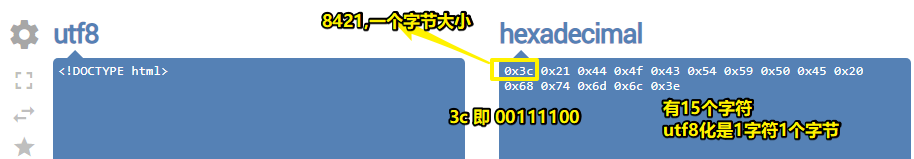

而中文字符则：

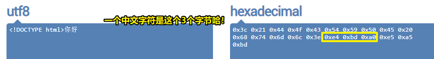


➹：[what is raw bytes ? (Beginning Java forum at Coderanch)](https://coderanch.com/t/522388/java/raw-bytes)

➹：[Convert UTF8 to Hexadecimal - Online UTF8 Tools](https://onlineutf8tools.com/convert-utf8-to-hexadecimal)


