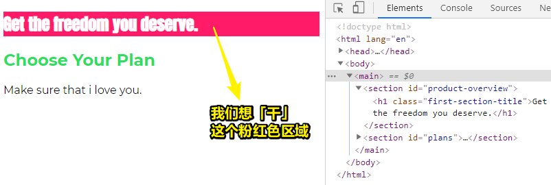
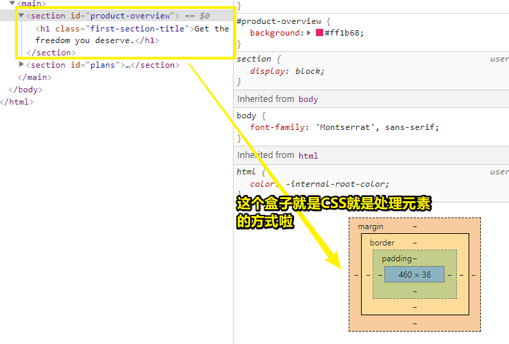
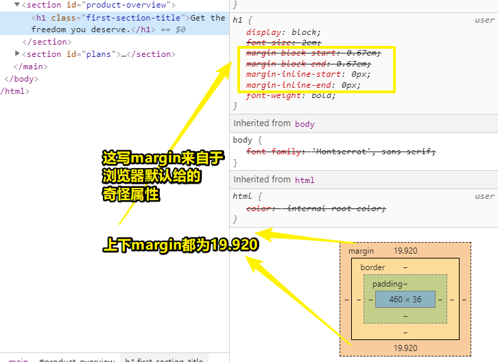
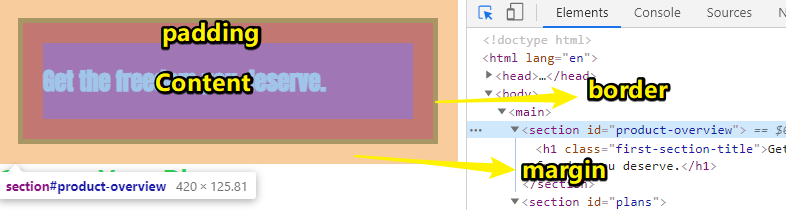
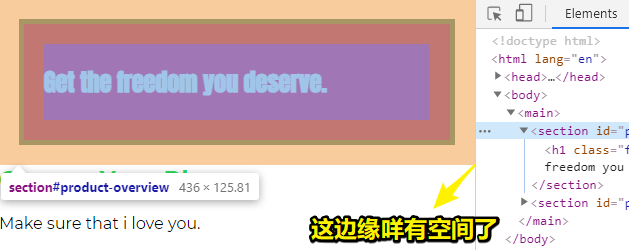
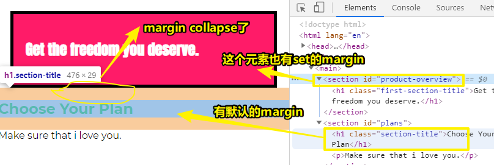
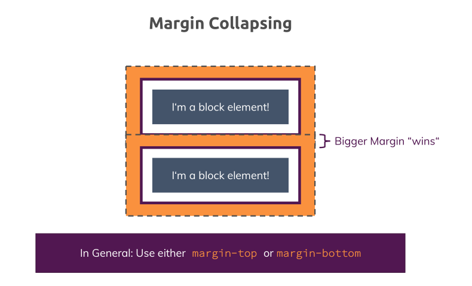
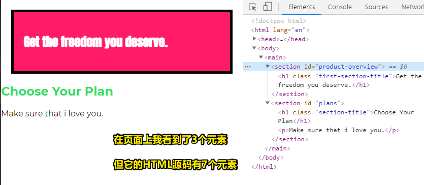

# CSS 盒子模型介绍、理解盒子模型 & margin collapsing 以及移除默认 margin

## ★CSS 盒子模型介绍

> 要理解的最重要概念之一是CSS与HTML里边的元素之间的交互方式或者说是相互作用。 这个概念称为盒子模型（box model），所以让我们看看是否可以在我们的项目中找到这样的盒子！

### <mark>1）目前页面情况</mark>



我们想要让这个粉红色区域：

1. 更大一些、更高一些 -> 还有在周围加一些空白会不会更好一些
2. 还想去掉它周围的白色区域

在添加导航栏之前，这个粉红色区域就是这个网页里边的第一个元素（指你在网页里边看到的，而不是在HTML源码里边看到的），而且在它周围是没有空白的

我们可以添加各种的样式规则，来控制此区域的样式以及它占用的空间

而做到这一点 -> 是通过操作CSS盒子模型来实现的

### <mark>2）话说，「CSS盒子模型」这是啥意思？</mark>

HTML里边的每一个元素都被CSS解释为一个盒子

使用Chrome的dev tools -> 检查元素 -> 你就会看到那个盒子 -> 你可以选择任何元素来查看这个元素所呈现出来的盒子 -> 如h1元素、section元素等都行



### <mark>3）CSS盒子模型里边有哪些东东？</mark>

1、每个元素都有内容 -> 蓝色区域 -> 表示元素内部的东西 -> 如对上图那个section来说，内容就是h1标签 -> 而对h1来说，内容就是它的文本 -> 总之，内容就是蓝色区域

2、我们对一个元素除了添加内容以外，还可以添加内边距 -> 上图的虚线表示 -> 现在没有内边距 -> 当然，我们是可以添加内边距的 -> 总之，它是元素的内部空间，表示section元素里边的内容与盒子模型的下一部分边框「border」之间的区域

3、border -> 我们可以为每个元素添加边框 -> 目前没有添加border，之后会添加 -> border围绕着元素

4、content之外是padding -> padding之外是border -> 有时我们只需要元素周围有一些空间 -> 那么这份活儿就是margin干的 -> margin它不是元素的一部分 -> 为啥这样说呢？ -> 因为元素是以border为界的（包含border），border之外的是margin -> margin它表示元素与相邻元素之间的空间 -> 如h1它一个默认的margin，而这是由浏览器默认设置的 -> 查看它的盒子模型 -> hover到它的盒子模型的margin区域 -> 你也可以看到已经加载好的页面的左上角的橙色区域也标识了这个h1元素的margin -> 正如你所看到的，margin会超出包含它的section，毕竟margin它不是这个元素内容的一部分哈 -> 既然**margin不是content的一部分** -> 那么**margin它也就不是section的一部分**



``` css
/* h1的默认样式 -> 浏览器默认给的样式规则 */
/* section旗下的h1样式与默认的h1样式是不同的，所以上图里边你才会看到样式被划掉的景象 */
:-webkit-any(article,aside,nav,section) h1 {
    font-size: 1.5em;
    margin-block-start: 0.83em;
    margin-block-end: 0.83em;
}
```

➹：[html - Why is size of H1 different inside a section element? - Stack Overflow](https://stackoverflow.com/questions/26290849/why-is-size-of-h1-different-inside-a-section-element)

➹：[:is() (:matches(), :any()) - CSS: Cascading Style Sheets - MDN](https://developer.mozilla.org/en-US/docs/Web/CSS/:is)

这就是所谓的「盒子模型」了 -> 它包括content、padding、border、margin

CSS里边的每个元素都被解释为这样的一个盒子

然而，有两种不同的元素 -> 块级元素和行内元素（之后会在本章讲解） -> 它们有一些地方不一样 -> 之后会学习到这两种不同的元素 -> 目前，简单地记住 -> 每个元素都有这些层次 -> content、padding、border、margin

注意 -> margin是盒子模型的一部分 -> 但它不是元素内容的一部分，也不是元素的一部分 -> 一个元素在页面里边所占据的区域从它的border开始（包括border）

## ★理解盒子模型

> Content, padding, border, margin——我们发现并理解了盒子模型的这些部分。现在让我们仔细看看它，并理解与「父元素和子元素」相关的box模型概念。

在上一节里边，我们已经从理论上了解了盒子模型，那么接下来就来实际操作一下：

### <mark>1）添加以下CSS</mark>

``` css
#product-overview {
  background: #ff1b68;
  padding: 20px;
  border: 5px solid black;
  margin: 20px;
}
```

效果：



### <mark>2）解释上边的CSS代码</mark>

1. px是一个在css里边规定的单位 -> 当然，这还有其它的单位，如百分比 `%`、字体相关的单位 -> 在这里使用px单位，是因为它很容易理解
2. padding -> h1标签的margin周围 -> section元素的内容可能是h1元素内容加上该h1元素可能包含的margin -> 毕竟padding与margin不应该重叠哈 -> 所以padding被添加在了子元素的margin周围
3. `border: 5px solid black;` -> 简写
4. 添加margin -> 才是意义上真正的一个盒子模型
5. 橙色区域周边存在一些空白 -> 之后会解释这个现象

我们在实践中看到了盒子模型的全部层次

关于盒子模型 -> 有几个特殊的东西需要了解以及还有网页默认的样式 -> 接下来跟着课程进一步学习吧

## ★理解外边距折叠以及移除默认外边距

> 为什么我们要观察两个元素之间的重叠（overlapping）margin ？ 让我们了解一下为什么margin collapsing会导致这种行为现象，以及如何从`<body>`中删除默认margin。

### <mark>1）必须要有什么属性，才能说这是一个盒子模型么？</mark>

目前，我们已经学习了盒子模型的基础 -> 这包括padding、border、margin -> 当然，这些属性都不是必须设定的 -> 如我们可以仅对内外边距进行设定或者也可以仅对border进行设定或者…… -> 总之，这些设定完全是按需使用的，就我们看到的结果来说，至少是这个样子的

### <mark>2）一些需要注意的点</mark>

这些点需要细致地学习一下

1、 body元素有一个默认的margin -> 8px -> 浏览器默认设置的 -> 如果要想删除这8px，可以对body元素set为`margin:0;` -> 在浏览器里边选中section元素可发现只剩下橙色边缘 -> 该section元素的外边距现在直接顶在网页边缘上了 -> 即二者之间咩有任何空间



2、一种现象 -> 折叠的margin



分析margin折叠：



有两个块元素 -> 都有盒子模型 -> margin是橙色区域 -> 何时触发？ -> 两个block元素相邻放置（页面上看到的情况，不用理会HTML源码是跨级的结构） -> 相邻的两个margin就会折叠成一个 -> 大号的margin会最终胜出 -> 这不是「漏洞」，而是故意设计成这样的 -> 这是由CSS强制执行的 -> 这个现象它确保了元素间的距离不会过大 -> 当然，你也可以反对这种现象，觉得这些应该由自己来决定哈 -> 可是，**CSS不是按你想象的方式运转的**，这一点我们必须要注意一下哈！ -> 当然，要绕过这个机制，使用 `margin-top` or `margin-bottom`命令是个好习惯 -> 如果你完全不用担心这种 collapsing，那么则是另一种情况了 -> 在我们的项目里边，有些地方会有些 collapsing，这并不是一个问题，因为这些元素间的距离刚刚好

> 这里关于对 collapsing 的处理 -> 不要对元素都搞上margin，而是只对上下相邻元素的一方set `margin-top` or `margin-bottom`

## ★总结

改变了我对CSS的看法 -> 页面上看到有多少个肉眼可看到的元素，那么就是有多少个元素，如页面上




