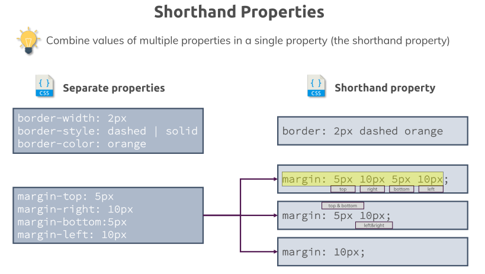
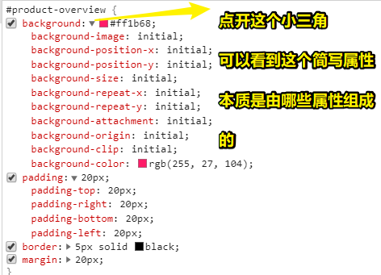

# Theory Time - Working with Shorthand Properties & Applying Shorthands in Practice

## ★Theory Time - Working with Shorthand Properties

> 理论时间！ 在整个课程中，我们已经应用了许多属性。 事实证明，我们可以使用简写形式来将多个属性组合到一个属性里边去。 让我们在此视频里边了解一下这些shorthand！

学习了一些盒子模型的知识 -> 同时间接了解了一点简写属性

### <mark>1）简写属性是什么？</mark>

将多个属性的属性值结合起来的常规属性 -> 这就是所谓的「简写属性」

### <mark>2）举个栗子？——没有简写</mark>

这儿有几个单独的属性：

1. `border-width`
2. `border-style` -> 虚线 or 实线 or 点划线…… -> 具体看MDN
3. `border-color`

以上这三个家伙是建立border所需要的单独属性 -> 如果你只set这三个里边的其中两个，然后另一个忽略 -> 那么这另一个就会被set为默认值 -> 而这样会导致border没有被显示出来 -> 总之，不明确的指出，那就会用默认值

在这里，它们三是可以使用简写的 -> 毕竟，如果每次这样set border的width、style、color就有点小麻烦了！

### <mark>3）简写姿势？——border</mark>

border属性的简写格式是这样子的：`border: 1px solid red;`

可见，border的 Shorthand用border来命名 -> 给不同的子属性赋值 -> 只要子属性使用不同类型的值，那么 **值顺序就不重要了** -> 这一点（值顺序）对于border来说是咩有问题的，当然，对其它简写属性可能会有 -> 当然，一旦出现「值顺序」问题，也会有姿势来避免这样的问题出现

总之，对于border来说 -> 我们可以以我们想要的顺序的任意方式来排列属性的值 -> 只要左侧开头是 `border` 属性就好了 -> 代码就会以相同的方式进行编译

### <mark>4）简写姿势？——margin</mark>

margin有几种简写格式：

1. `margin: 5px 10px 5px 10px；` -> 4个方向的值
2. `margin: 5px 10px;` -> 想让「上下」值、「左右」值相同 -> 第一个值是上下的值，同理，第二个值即是左右的值
3. `margin: 10px;` -> 想让4个方向上的值相同 -> 给一个值就好了 -> 这个值会同时赋值给margin的4个方向

以上就是所谓的简写属性了

### <mark>5）小结</mark>

- 在CSS里边 -> 我们会用很多简写属性 -> 如 `background`等
- 当有机会用到简写属性时，你就应当使用它 -> 毕竟它会使代码更短、更简洁 -> 当然，你也可以一直用复杂的格式
- 下一节会讲到 -> 由于简写属性的高灵活性 -> 所以可以对之间定义的属性进行覆盖 -> 如先简写用个全局 `border: 1px solid red;`，然后再单独写个别的覆盖之

## ★Applying Shorthands in Practice

> Shorthand 似乎让编写CSS代码变得容易多了。让我们试一试，并在我们的项目中实际练习里边应用一些！

### <mark>1）打开dev tools，看看简写属性的本质是啥？</mark>

我们要设置一个元素的border -> 用完整形式 -> 要写很多个属性，但值是单一的 -> 用简写形式 -> 只要写一个属性，但值可以是多个的……

点开dev tools -> 可以看到某个简写属性的完整形式是咋样的 -> 如 `background`属性，可以看到构成背景的所有属性 -> 可以看到这背景是一种非常复杂的方式

### <mark>2）小结</mark>

- 可以使用完整形式 -> 也可以使用简写形式 ，如`margin: 10px 0 0 0;` -> `margin-top:10px;` -> 当然，你也可以混合使用哈
- 注意 -> dev tools里边看到的才是最后渲染出来的属性

