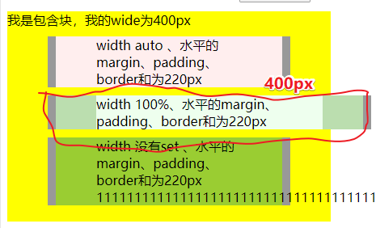
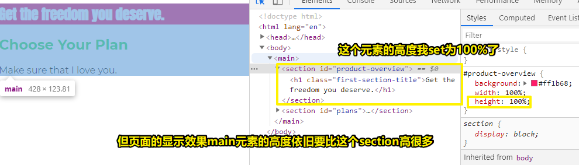
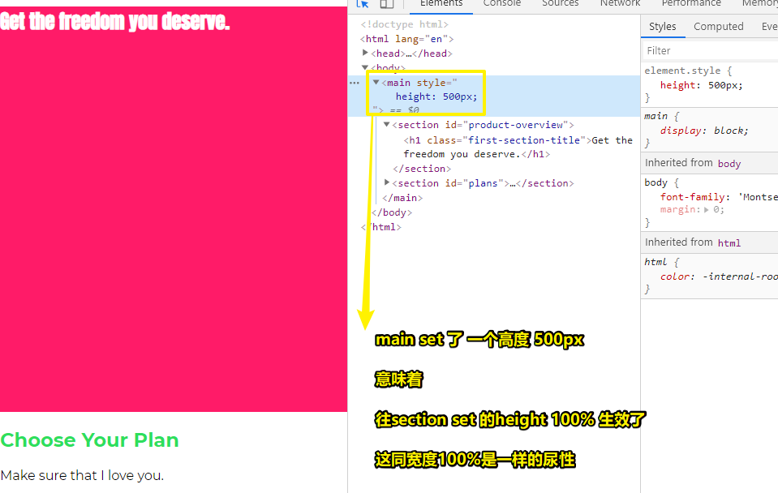
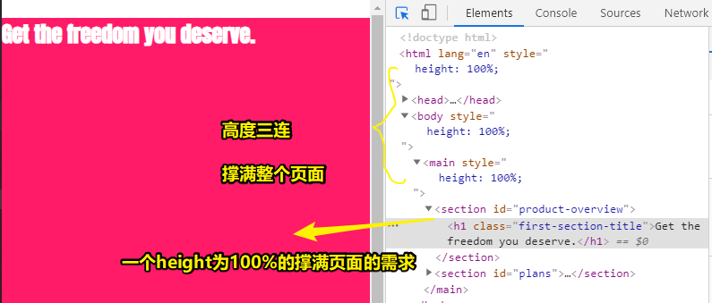
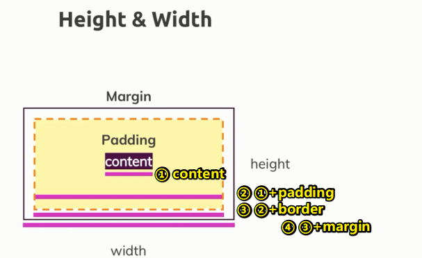
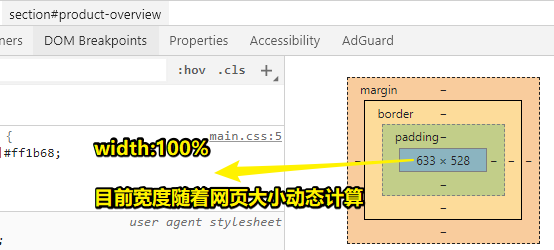
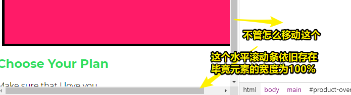
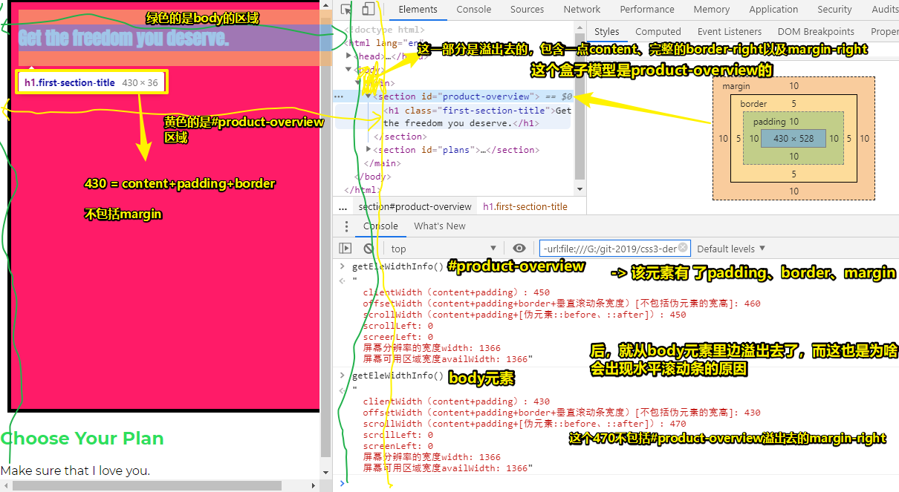
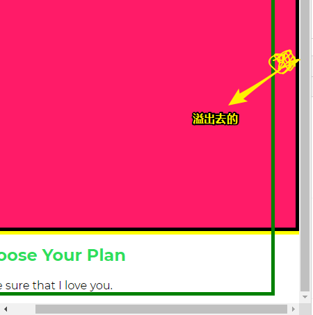
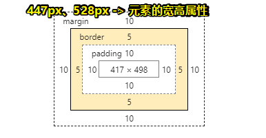

# Diving Into the Height & Width Properties 、 Understanding Box Sizing

## ★Diving Into the Height & Width Properties

> 设置我们网站的样式还需要定义元素的尺寸大小（size）。 在此视频里边，我们将应用“height”和“width”属性，并了解如何根据需要来更改这些属性。

### <mark>1）block元素的默认宽度？</mark>

``` css
#product-overview {
  background: #ff1b68;
}
```
设置`width:100%;` -> 这表示保持网页的宽度不变 -> 有了这个样式声明 -> 当你刷新页面，会发现没有任何变化 -> 为啥会没有变化呢？ -> 因为这就是block的默认状态 -> 除了像section这样的块以外，还有h1等 -> 注意这是HTML中的特性，与CSS无关 -> 说白了HTML规定了有block元素、inline-block元素，而block元素就会有 `width:100%;`这样的特性，而这一点并不是浏览器给的默认的CSS样式 -> 总之，记住块级元素和行内元素是不同的，如前者默认占据页面的全宽


关于 `width:auto;`也有同样的效果的出现，即

1. 不设置width
2. 设置width为100%
3. 设置witdh为auto

block元素的行为没有任何变化

然而，按正常逻辑来说，既然width可以有不同的值，这意味着设置不同的值会有不同的样式行为存在

搜索+自行测试得知：


1. block元素的initial width 是 auto的 -> 这意味着儿子基本上不会溢出父元素
2. set width 为 100% -> 有很大可能会溢出父元素

如果你改成这样了：

``` css
.two-two {
  width: 100%;
  background-color: #eeffee;
  box-sizing: border-box;
}
```

那么：



<a class="jsbin-embed" href="https://jsbin.com/kavecit/embed?html,css,output">JS Bin on jsbin.com</a><script src="https://static.jsbin.com/js/embed.min.js?4.1.7"></script>


➹：[html - difference between width auto and width 100 percent - Stack Overflow](https://stackoverflow.com/questions/17468733/difference-between-width-auto-and-width-100-percent)

➹：[html - Where is the default size of a div element defined or calculated? - Stack Overflow](https://stackoverflow.com/questions/35010655/where-is-the-default-size-of-a-div-element-defined-or-calculated)

➹：[The difference between width:auto and width:100% - 456 Berea Street](https://www.456bereastreet.com/archive/201112/the_difference_between_widthauto_and_width100/)

### <mark>2）% & px</mark>

儿子 width 50% -> 占据页面宽度的一半 -> 毕竟包含块占据页面的的全宽

px -> 在关注同一款设备的情况下，这是绝对的size，如在pc就是1：1，但在iPhone6就是1：2了，因此针对不同的设备，这又是相对的size了 -> 而%这样的单位是相对于包含块的size

**宽度的set对于我们的项目来说是非常重要的，毕竟，我们不希望所有元素都占满网页的全宽**

### <mark>3）height？</mark>

我们也可以set height -> 不过高度它就有些复杂了



1. height -> 100% -> 自以为元素的高度会撑满整个页面，但实际上并不是哈！即元素的噶度仅仅只是变大了一点 -> 那么100%表示什么呢？——父容器的最大高度
2. 如果元素没有set高度 -> 那么该元素的高度由其内部元素的高动态决定 -> 说白了，它内部的元素需要它有多高，那么它就得有多高

目前需求，我想要让section与main区域同高，然而，section的高度增大 -> main的高度增大 -> section高度看到main增大了，自己又增大 -> main看到section增大了，自己又增大…… -> 这样就形成了某种「无限循环」了 -> 所以 -> section的这个 100% height就咩有意义了！

如果我们想要让section的 height 100% 有效果？

那么我们还需要更改main区域的高



结论：

1. 如果main区域的高度是明确值时，如500px，若在其子对象里边使用「百分比」定高，那么这个百分比的基准就是main区域的高了，说白了，也就是和「宽度」的情况是一样的

话说，如果我们把main区域的高度set为100%呢？

那么，这个基准就是main的父对象，也就是body对象啦！

而body的高度同样是由需求决定的，即由其内部子元素的总高度决定，当然，除非我们把body的高度也搞为100%

如果body的高也搞为100%，同理，对html标签做同样的事儿，说白了，它是body的父对象也是按需定高的



我们要得到一个和页面一样大的红色区域 -> 很简单 -> `height:100%;`到html这个root元素为止 -> html元素的高度，拿我这电脑来说 -> 最终计算得出是665px -> 毕竟视口肯定是有一个确定值作为百分比单位的基准值 -> 有了基准值，就可计算

从html元素开始，也就是从整个视口开始，一级一级的元素的高度都被set为100%了，即我们将100%的这个相对高度级级传递给了这个section -> 即先从section开始向上找到确定值665px，然后再回到section，确定了自己的高度是665px

因此，如果我们要set一个相对于页面的元素的高，你需要创建这种联系（一级一级的set `height:100%;`）来把页高传递下去

在之后的尺寸&单位章节中，我们还会学到很多不同的新单位 -> 而这会让实现这一目的（让元素占满整个页面）变得很简单 -> 不过，浏览器对这些单位的支持不太好 -> vh

总之，就现在而言，我们需要记住这个关于如何把高度set为100%的有趣的小把戏（tricks）

### <mark>4）小结</mark>

1. width和height的设置，大体上就是这样设置的，即你可通过百分比、像素或者后续所讲到的其它单位来进行控制
2. 关于宽和高，我们还有一些要讲的，尤其是关于盒子模型那部分，下一节就讲这个内容

## ★Understanding Box Sizing

> 我们更改了“height”和“width”，但是这实际上发生了什么变化呢？ 让我们深入研究“`box-sizing`”属性，并学习如何使用此属性来更改“height”和“ width”属性的默认行为。

这节是 -> 理论时间

### <mark>1）Height & Width</mark>

通过height、width这两个属性，我们顺利的更改了盒子模型的高度和宽度，而这一点是毋庸置疑的！

但，我们究竟更改了什么呢？

当我们set width 和 height：

1. 更改的是 content 的宽和高吗？
2. content + padding？
3. content + padding + border？
4. content + padding + border + margin？



目前情况：

``` css
#product-overview {
  background: #ff1b68;
  width: 100%;
  height: 528px;
}
```



之所以动态计算是因为我们set了这个元素的width为100% -> 视口的宽度层层递进交给了这个元素 -> 而528px是我们在代码里边写的确定值

追加代码：

``` css
#product-overview {
  background: #ff1b68;
  width: 100%;
  height: 528px;
  padding:10px;
  border: 5px solid black;
  margin: 10px;
}
```

效果：



可见，出现一种奇怪的现象 -> 红色区域往右移出了页面 -> 而这无论我们怎样增加或减少页面宽度，这一现象都不会改变 -> 这种现象称作「元素定位错误」

因此，宽度的设置肯定是有问题的



从body容器溢出去的内容：



> 一个疑问：为啥元素的margin-right会消失了呢？难道被啥东西给吞并了？

所以，小结：

1. 元素的实际宽度 -> width+border+padding -> 元素的实际高度 -> height+border+padding
2. 我们对元素set的width&height -> 是不包括padding&border的
3. 出现「元素定位错误」的原因 -> 浏览器计算出来的结果 -> width&height不是xxx元素这个目标的实际高度和实际宽度 -> 所有元素在默认情况下，都有计算高度和宽度的方法 -> 而这种方法被称之为「content-box」

### <mark>2）box-sizing</mark>

通过给目标元素添加box-sizing属性，就可以把目标元素的行为调整成我们想要的

box-sizing的默认值 -> content-box -> 表示set width&height时 set的是content的width&height -> 不包括padding、border

如果set为boder-box -> 那么set width&height则包括padding+border -> 不包括margin，也无法包括（box-sizing没有哪个值可以包括margin来作为浏览器计算盒子实际宽高的一份子）



我们经常要重写所有元素的样式，如常把元素的box-sizing set 为 boder-box

而这样做的目的是为了方便计算元素的宽度和高度 -> 具体如上所示的不包括margin的整个盒子模型 -> 相比只计算content来说，显然要方便得多

改为border-box之后，就不会出现元素右移这种现象了！

### <mark>3）为啥这两种计算模式都不包含margin呢？</mark>

这是为了避免元素右移这个现象，只有去掉margin，才是比较合理的，如果你想要元素在边缘的定位是正确的，就不要给元素添加margin

总之，margin是不属于width&height的

> 不是很理解

➹：[聊聊CSS世界中的margin-box « 张鑫旭-鑫空间-鑫生活](https://www.zhangxinxu.com/wordpress/2016/09/talking-about-css-margin-box/)

### <mark>4）小结</mark>

1. set box-sizing 为 border-box 这一点是非常非常重要的 -> 它很有用也很重要
2. box-sizing属性是非继承的 -> 即你在body set 为border-box，后代是无法继承的 -> 你得用 `*`全局set（可重写继承，也可重写浏览器给的默认值），才能让所有元素改变它们默认的box-sizing
3. 这个课程里边的项目，都会用 border-box，因为在设置width&height的时候，始终需要定位content+padding+border -> 有了它之后，元素的content区域就是width-padding-border了 -> 总之，width表示在计算的时候，除了content以外，还包括padding、border

➹：[JavaScript学习笔记：视口宽高、位置与滚动高度_JavaScript, JavaScript学习笔记 教程_w3cplus](https://web.archive.org/web/20180923105335/https://www.w3cplus.com/javascript/offset-scroll-client.html)


