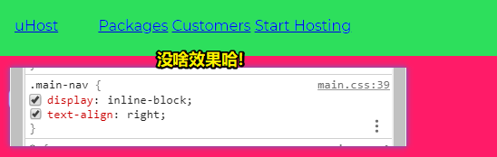
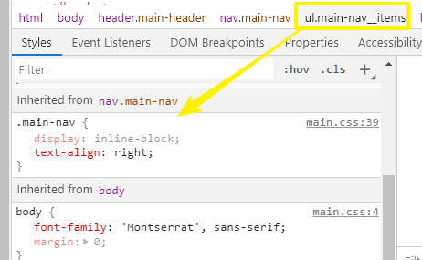
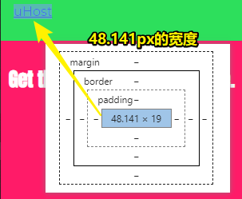
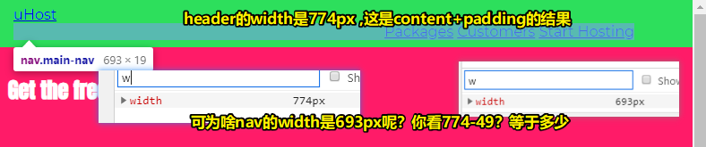
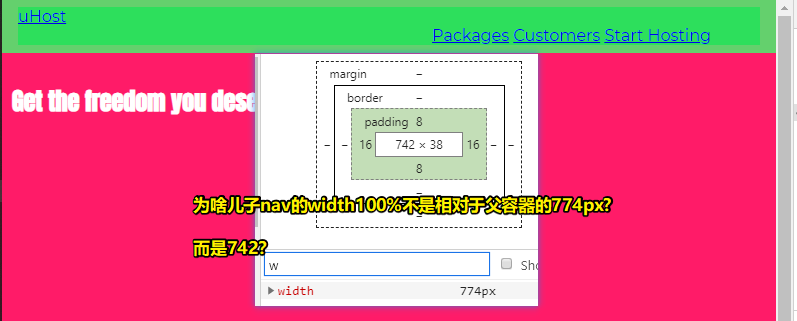
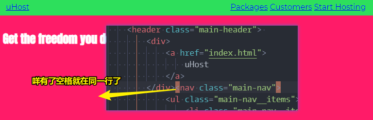
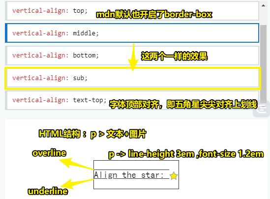
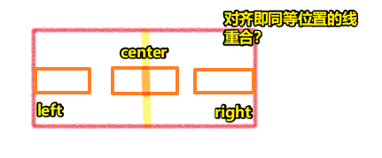
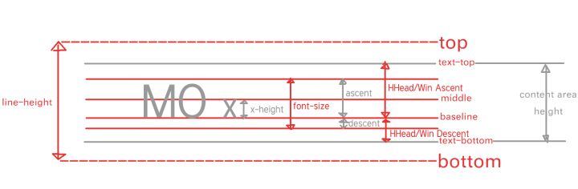

# display属性应用、美化导航条

## ★ Applying the Display Property & Styling our Navigation Bar

> 理解了“display”属性之后，现在就该设置导航栏（navigation bar）的样式了。为此，我们还将使用该属性的“inline-block”这个值的优点、特点（advantages）。

目前我们已经对display属性，尤其是inline-block元素有了一个初步的了解

### <mark>1）logo和nav不是在同一行的</mark>

原因：它们俩都是block元素，都是独占一行的

那么如何让它们俩显示在同一行呢？——很简单，logo是inline-block，nav也是inline-block就好了

``` css
.main-header>div {
  display: inline-block;
}

.main-nav {
  display: inline-block;
}
```


### <mark>2）关于选择器的书写顺序？</mark>

要符合从上到下浏览HTML文件的习惯 -> 选择器的位置摆放并不影响功能 -> 如 `.main-header {}` 、 `.main-header > div {}` 、 `.main-nav__item {}` 

class选择器 vs 子选择器 -> 两个都行，只是子选择器，一定要留意后续添加的代码是否嵌套了元素

### <mark>3）把nav里边的元素移动到右边去</mark>

目前HTML结构：

``` html
<header class="main-header">
  <div>
    <a href="index.html">
      uHost
    </a>
  </div>
  <nav class="main-nav">
    <ul class="main-nav__items">
      <li class="main-nav__item">
        <a href="packages/index.html">Packages</a>
      </li>
      <li class="main-nav__item">
        <a href="customers/index.html">Customers</a>
      </li>
      <li class="main-nav__item">
        <a href="start-hosting/index.html">Start Hosting</a>
      </li>
    </ul>
  </nav>
</header>
```

做法：

目前li元素都是inline-block元素，那么我们可以直接在main-nav里边使用 `text-align` 来将文本对齐至右侧，毕竟**inline-block元素会被视为文本哈！**

然而，没啥效果：



`text-align` 这个属性确实被应用上了，即这些元素确实被对齐在了右侧，可这似乎看起来没有用啊！

需要注意的是，该属性也是可以被继承的：



既然右对齐已经启用了，可为啥会没有效果呢？

我们知道li元素都是一个个inline-block元素，而nav元素也是inline-block元素，所以nav它的宽度并非是最大可用宽度，而是它的元素有多宽，它就又多宽


因此，文本右对齐就失效了

所以，我们需要设定宽度，而这个宽度就是「header元素的宽度」-「nav的兄弟元素div」的宽度

由于ul元素有额外的padding-left，甚至还有上下margin，所以我们要搞掉它

因此，在设定nav元素的宽度之前，还是先来重置ul元素的内外边距吧！

``` css
.main-nav__items {
  margin: 0;
  padding: 0;
  /* 消除item点，尽管padding为0也可以消除，但写上这个可以确保消除了item点 */
  list-style: none;
}
```


为nav设定宽度100%：


前边提到了，nav元素的宽是网页全宽减去左侧那个语义化为logo的盒子的宽（可以把这个logo当作是header元素的padding-left）

因此，我们要知道logo的宽度



上边读取到的这个值，是从渲染界面里边读取的数值，但这其实并不是最好的办法 -> 后边会提到有更强大的工具来做这件事，这样也就有了更简洁的方法了

### <mark>4）calc函数</mark>

如何对一个数值做计算呢？

很简单，使用calc函数即可！

calc函数 -> 能做减法，`calc(100%)`可以直接作为数值使用，也可以处理简单的计算 -> 注意，数字和符号之间是有空格的，而这是必须要有的

``` css
.main-nav {
  display: inline-block;
  text-align: right;
  width: calc(100% - 49px);
}
```


> 黄色乱线那坨大约等于uHost的宽

为啥还是没有在同一行呢？——这是inline-block元素所导致的

知道inline-block元素的这种特性是非常重要的，否则你将会花好几个小时来琢磨这到底发生了什么？

## ★ Understanding an Unexpected "inline-block" Behaviour

> “inline-block”是一个非常有用的值，但是有一种特殊的行为（specific behaviour）会在实践中引起问题。让我来告诉你这是哪一个问题，以及你如何能轻松地解决它。（Unexpected -> 意想不到的）

### <mark>1）一个疑问——width100%与border-box？</mark>



父容器header的盒子模型：



个人无厘头的理解：

如果真得按774px来计算，那么就得溢出父盒子了

我找到了这样一篇文章「[正确使用"width:100%" - 简书](https://www.jianshu.com/p/7d565f14f98e)」，其中结论说到：

1. 当设置"`box-sizing:content-box`"时，子元素设置宽度的百分比是指子元素内容区域相对于父元素内容区域；
2. 当设置"`box-sizing:border-box`"时，子元素设置宽度的百分比是指子元素整个盒子区域相对于父元素内容区域；
3. 如果想要正确使用"`width:100%`"这一属性，一定要设置"`box-sizing:border-box`",否则会造成子元素溢出。

➹：[What Does "width: 100%" Do in CSS? - Impressive Webs](https://www.impressivewebs.com/width-100-percent-css/)

老师的解释：

nav元素宽度的100%已经是header的width减去padding的结果了

### <mark>2）是什么造成了nav元素位于新的一行？</mark>

目前，nav元素的宽度是：`calc(100% - div的宽度)`

你可能会认为这是header的padding导致的，但是我们开启了border-box，所以padding的宽度已经考虑在内了

nav元素宽度的100%已经是header的width减去padding的结果了

因此，你这种假设是不成立的

相反，这种现象跟 `display:inline-block;` 有关

问题是HTML代码之间的空格导致的：


代码一格式化就会这样，而这个空格被看作为了一个字符

而这相当于加了一个多余的inline元素

因此，我们不仅要减去div的宽度，还得减去这个空格的宽度，当然，这个空格是很难测量的，毕竟在开发者工具里边是看不清空格的

因此，我们可以这样做：

1、在编辑器里边删掉空格：



可见，这两个元素都在同一条线上了，但是这一点都不好玩

我们想保持代码的结构，所以这更好的解决办法就是稍微多减去一点宽度就好了，如54px（把一个空格当作是5px）

该方法听上去很牵强（形容把没有关系或关系很远的事物十分生硬地拉扯在一起。）

当然，这确实很牵强，之后，会有更优雅的解决的方案

不管怎样，凭借这方法，确实能让两个元素都显示在同一行了，即使我们减少了浏览器视口的尺寸


之后，会讲到响应式设计 -> 解决页面减少到一定程度布局发生混乱的状况

好了，既然 `display:inline-block;`的问题已经解决了，那就继续设计这个页面吧！

## ★ Working with "text-decoration" & "vertical-align"

> 让我们继续我们项目中的工作——改进我们的导航（navigation）的样式。为此，我们将使用“text-decoration”来设计链接，并使用“vertical-align”（垂直对齐）来对齐元素

目前，导航栏已经有了雏形了，那么接下来，我们就来美化商标：


商标并不是很显眼

### <mark>1）改变商标的样式</mark>

1、添加class

a -> class -> `main-header__brand` or `brand`

2、我们要给商标啥样的样式？

1. 想要删掉默认自带的下划线
2. 想要改变字体的颜色，以及所有字体的粗细，如想把字体搞为加粗的字体

先从颜色开始 -> 深绿色 -> `#0e4f1f`

去掉下划线 -> `text-decoration:none;`（文本下划线样式重设）

字体加粗 -> `Montserrat`字体 -> 导入加粗版的`Montserrat`字体 或直接用 `bold`值 -> 不过这又会影响布局，即logo和nav不在同一行上了 -> 所以需要把54px改为55px

增加字体大小 -> 22px -> 再次调整55px为74px（此刻logo是69px，然后还得减去空格的5px）

> 为啥会按照上边这个顺序来添加样式？——个人猜测，是因为先完成不影响布局的样式，假如不这样来的话，你先加粗，然后改变字体大小，就会影响布局，而影响布局，又得修改其它元素的样式，这样你潜意识里就还有3个任务未完成了——修改nav元素的宽、添加logo的颜色以及去掉下划线。总之，先完成简单的且毫无相关性的、正交的任务，然后再去处理复杂的任务 -> 对比CSS来说，修改字体大小、粗细，就目前的样式来看，是不正交行为，因为影响到我们需要修改nav元素的宽，而字体颜色，下划线则是正交行为，即不会影响其它元素的样式


### <mark>2）处理两个`inline-block`元素之间的对齐问题</mark>


> uHost看起来像是垂直居中对齐了，毕竟它的字体大小22px，line-height接近父元素的高度

两个元素（div和nav）都需要 `vertical-align: middle;`居中一下


可见，目前div和nav都在各自的空间里边处于居中了

### <mark>3）`vertical-align`这个属性的简单理解</mark>

作用对象：inline, inline-block or table-cell box.



> 注：务必要把五角星看做是一个矩形盒子

回顾之前对div、nav的垂直对齐，middle值 -> 相对于父元素的baseline+x-height的一半高对齐 -> 上图中的五角星

> 一点疑惑：图中的五角星的对齐，这所谓的对齐指的是，如middle，是拿五角星的middle线与父元素里边的文本的middle线重合吗？类似的水平对，如居中对齐，就是子元素垂直中线与父元素的垂直中线重合，右对齐，就是子元素的最右的垂直线与父元素的最右的垂直线重合。注：`text-align` -> 行为像 vertical-align，但这是水平方向，作用对象是a block element or table-cell box -> 影响父元素里边的inline、inline-block的对齐方式

一图胜千言：



关于baseline：



➹：[vertical-align - CSS: Cascading Style Sheets - MDN](https://developer.mozilla.org/en-US/docs/Web/CSS/vertical-align)

➹：[text-align - CSS: Cascading Style Sheets - MDN](https://developer.mozilla.org/en-US/docs/Web/CSS/text-align)

➹：[深度剖析Css Baseline - 知乎](https://zhuanlan.zhihu.com/p/30169829)

➹：[CSS基线之道](https://www.qianduan.net/css-baseline-road/)

接下来为右边的链接添加样式


➹：[深入理解 CSS：字体度量、line-height 和 vertical-align - 知乎](https://zhuanlan.zhihu.com/p/25808995)


