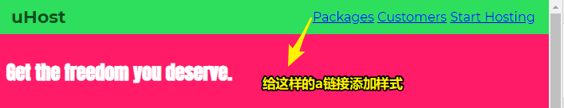
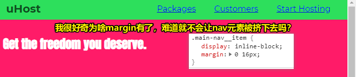
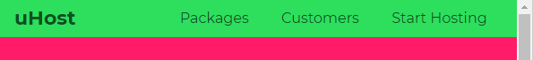
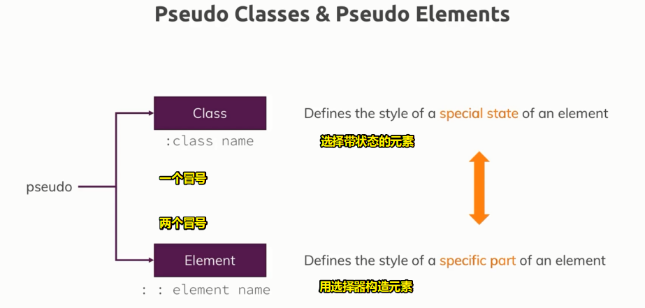
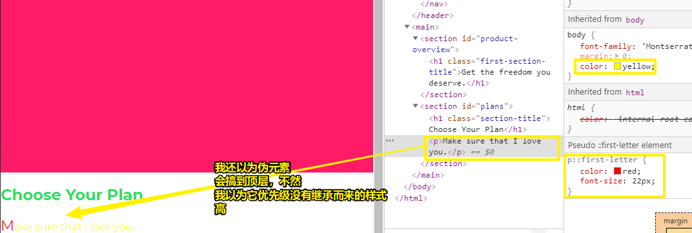
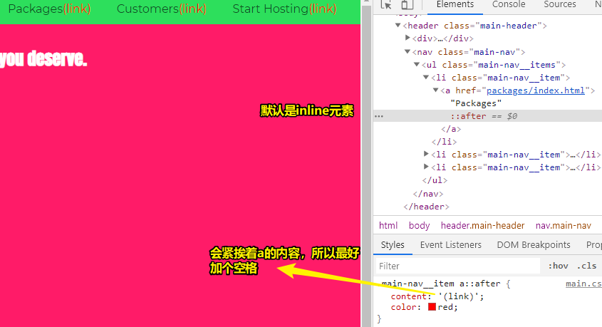
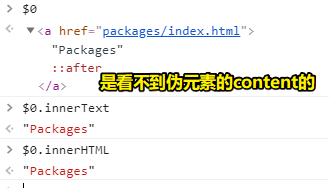

# 美化链接、深入了解伪类和伪元素

## ★ Styling Anchor Tags 

> 样式链接非常重要，因为每个网站都包含这样的链接。默认的样式并不是最漂亮的，所以让我们来看看如何改进它

### <mark>1）要做什么</mark>



1. 加大一点链接之间的距离，注意inline-block元素的margin-top和margin-bottom会有限制，而left和right就不用担心了（这不是inline元素的行为吗？又或者说老师的本意是说a这个元素？）
2. 保证list里边的a标签里边的文本是绿色的 -> 和品牌名的默认绿色是一样的 -> 咩有下划线

### <mark>2）做法</mark>

1、`main-nav__item` -> margin 0 16px -> 上下我们不需要 -> 没有出现换行 -> 因为margin不包含在width里边 -> a元素之间的距离增大了

``` css
.main-nav__item {
  display: inline-block;
  margin: 0 16px;
}
```



> li元素在content这块区域里边活着，有充足的content宽度空间给li


2、在li元素set`text-decoration: none;` -> 不起作用 -> 该属性可被继承 -> 但浏览器默认给a元素的优先级高于继承而来的 -> 所以我该咋办？ -> 给每个a元素一个class？使用组合器？ -> 加class？和嵌套选择器？哪种更好？ -> 从性能角度来说，用class会稍微快一点点，但实际上，除非你要写一个类似Facebook这样的大项目，这性能才会有所体现，不然，你几乎注意不到差别，尤其在一个class下有个直接a元素，如这样`main-nav__item a{}`，而这种写法也算是一种高性能的选择器写法了，总之，性能问题在这里没那么重要，况且通常没有必要为所有元素增加多余的class，当然，你也可以加上，你喜欢就好。总之，选中嵌套元素用这种写法 `.main-nav__item a{}`是很好的 -> 选中元素之后，就可以修改样式了

``` css
.main-nav__item a {
  text-decoration: none;
  color: #0e4f1f;
}
```



接下来，我想改变鼠标hover到链接时的样式

## ★ Adding Pseudo Classes 

> 伪类对改善我们网站的用户体验有很大帮助。为啥我们不趁机抓住这个机会，在我们的项目中应用一些伪类呢？

如何体现长时间 hover到链接，或者长时间按住button，如点击鼠标不松手，就像是一直触摸手机屏幕那样

如何实现这样的效果呢？

通过使用称之为「伪类」的选择器

### <mark>1）伪类的运行机制</mark>

伪类关键字 -> `:hover` -> `a:hover` -> 冒号之间咩有空格，不然就是一个后代选择器了 -> 表示选择已经被hover了的a元素 -> 这样获取到了有鼠标hover的a标签 -> 单个伪类关键字只有一种功能 -> 想要选择按住button不撒手那种状态的button，需要 `:active`这个关键字

``` css
.main-nav__item a:hover {
  color: white;
}
.main-nav__item a:active {
  color: white;
}
```

> 我们想要选择某种被交互了的元素 -> 所以需要用到伪类

### <mark>2）还存在哪些伪类选择器呢？以及伪类到底是啥意思？</mark>

## ★ Theory Time - Pseudo Classes & Pseudo Elements

> 是时候深入理论了。 我们已经应用了伪类，但是还有哪些可用的额外的值呢？伪类和伪元素之间有什么区别？ 让我们在此视频中找到答案！

### <mark>1）我们要区分伪类和伪元素</mark>

伪类 -> 指元素状态

伪元素 -> 指特殊的元素



### <mark>2）有哪些伪类？</mark>

MDN：[Pseudo-classes - CSS: Cascading Style Sheets - MDN](https://developer.mozilla.org/en-US/docs/Web/CSS/Pseudo-classes)

常用的：`:focus`、`:last-of-type` -> 知道它们可以用来做什么 -> 它们可以用来控制不同的状态（`:active`）或者更精确地选择我们想要选择的（如`first-child`、`first-of-type`）

### <mark>3）有哪些伪元素？</mark>

MDN：[Pseudo-elements - CSS: Cascading Style Sheets - MDN](https://developer.mozilla.org/en-US/docs/Web/CSS/Pseudo-elements)

伪元素 -> CSS中的伪元素选择器可被应用在当HTML内没有特定元素可以选择，且文档内容需应用样式的时候。举例来说，与其将每个段落的第一个字变成独立元素，你也可选择利用 `p::first-letter`的写法选择各段首字，这样就可以让首字母和其它文字样式不同了 -> 可见，伪元素可以减少不必要的元素嵌套

伪元素 -> `::first-letter`、`::first-line` -> 常用于博客，用于得到像报纸一样的样式

### <mark>4）`::first-letter`的用法</mark>



### <mark>5）`::after`、`::before`</mark>

这俩兄弟可以在CSS中渲染content属性 -> 有助于增添设计细节的内容，而不是增加关键页面内容（HTML内容，毕竟对于无障碍网页来说，你用伪元素的话，是无法识别内容的） -> 说白了，就是用于装饰内容的

应用 -> 清晰地标记链接 -> 用于告知用户这是链接

做法：

1、特殊的`content`属性 -> 其值是个字符串 -> 该content会在文档中看到，但不在DOM树里边 -> 设计content的样式



> 点击`(link)`也就是点击了a链接，hover上去`(link)`并不会变白色，因为优先级比伪类高，可这就与老师所讲的矛盾了呀！按照规范，伪类的优先级要比伪元素的优先级高才对啊！——无厘头猜测，虽然我们肉眼是可以看到网页上的文本内容的，但是伪元素的content是不存在于DOM中，所以浏览器直接忽略掉它，然后hover上去时就只看在DOM中有内容的文本



content在页面里边是可见的，但是内容不存在于DOM中，一般我们不会往content里边添加内容，毕竟基于样式与内容分离原则，如果样式能写纯文本内容的话，那么后期就不好维护了

`::after`和`::before`可以更好地渲染页面

伪元素可以控制元素的某一部分

伪类则可以控制你所选择的内容（第几个盒子……）或者元素的状态

以上就是对伪类和为元素的一点深入了解了

接下来只专注于hover和active，毕竟它们俩对于页面的设计非常有帮助哈，如hover链接或点击链接时能看到不同的样式，这样用户会认为自己对页面的交互是有反馈的

➹：[总结伪类与伪元素 - AlloyTeam](http://www.alloyteam.com/2016/05/summary-of-pseudo-classes-and-pseudo-elements/)


