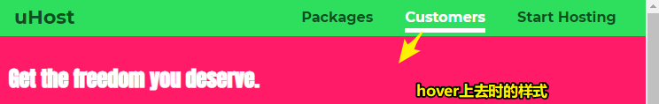
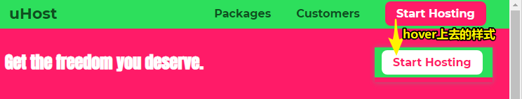
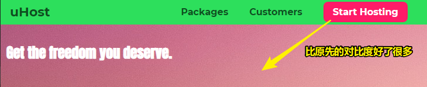

# Selector list是啥、设计个cta-button

## ★ Grouping Rules

> 有时，相同的规则应该会被应用于不同的选择器。但事实证明，我们可以通过对它们进行分组来避免一次又一次地重复这些规则。让我告诉你这是如何工作的。

我们了解了伪类和伪元素，那么接下来，让我们来深入其它东西吧！

### <mark>1）消除重复代码？</mark>

你知道下边这些代码的意义吗？

``` css
.main-nav__item a:hover {
  color: white;
}
.main-nav__item a:active {
  color: white;
}
```

如果忽略这些选择器，它们几乎一模一样，如果你遇到像上边这样的例子，那么你可以把它们组合在一起

为啥要这样做呢？

因为像这样重复的代码是不优雅的！简单来说，如果你要改变颜色，那么就得修改两处地方

### <mark>2）Selector list——选择所有匹配到的元素</mark>

语法 -> `E,F` -> 多元素选择器，同时匹配所有E元素或F元素，E和F之间用逗号分隔

解决什么问题？——要减小样式表的大小，可以将选择器组合到在以逗号分隔的列表中（关于list这个概念，类似于同类事物的集合，如都是选择器，都是li元素）

总之，我们这样做：

``` css
.main-nav__item a:hover,
.main-nav__item a:active {
  color: white;
}
```

就是用逗号把两个规则组合到一起

关于格式，你可以在同一行或者下一行添加下一个选择器，老师喜欢在下一行添加下一个选择器，因为这样做很容易理解哈！（可以添加任意多个选择器）

注意，这不是一个组合器，而是两个选择器、两个规则哈！只是它们共用一套规则罢了！

而这样一来，整体上看，就成了一条规则或者说是一条语句

总之，我们把样式放在了一组或者说一条规则里边去了

## ★ Working with "font-weight" & "border"

> 我们不断改善网站的外观，所以让我们使用“font-weight”来改变所选元素的默认字体样式。除此之外，是时候添加一些边框了。

### <mark>1）做什么？</mark>

目前我们的nav样式看起来还是阔以的，已经算是有很大的进展了，不过我们想要让鼠标hover到链接时会有不同的样式出现，如字体下方有个border，不hover时则是默认的粗体就好了

可以用 `text-decoration`来搞，不过，这下划线离文本太近了，所以，我们想要的是有padding的border

``` css
.main-nav__item a {
  text-decoration: none;
  color: #0e4f1f;
  font-weight:bold;
  /* 用于所有情况，不限于鼠标hover，避免 */
  /* 文字在网页加载时会诡异地跳一下 */
  /* 如果你写在a:hover里边，就会让a的布局抖动一下 */
  padding: 3px 0;
}

.main-nav__item a:hover {
  color: white;
  border-bottom: 5px solid white;
}
```



### <mark>2）让「Start Hosting」这个按钮或者说是链接看起来特别一点</mark>

为啥要特别一点呢？——这是因为该按钮应该体现「行为召唤（CTA）」这个设计理念

因此，我们要用特别的样式来突出显示

下一节，就来看看这个特别的样式

## ★ Adding & Styling a CTA-Button

> 到目前为止，我们的导航栏中只有列表项。如果有一个不同风格的特殊的CTA-Button，这不是会很好吗？我想会是这个样子的，所以我们在这个视频中添加一个。（CTA -> Call-to-Action）

Call to Action -> 行为召唤，就是吸引用户点击

### <mark>1）把最后一个列表项搞成为一个起到CTA效果的按钮</mark>

那么对这最后一个li元素设计怎样的样式，才能从其它链接里边凸显出来、清晰可见呢？

追加一个class -> 语法 `xxx yyy` -> 可为元素添加一个以上class -> `main-nav__item--cta` -> 该命名很奇怪，因为我们再一次遵循了BEM的命名方式 -> 为啥 `--cta`呢？——因为这表示这li元素它有特殊的状态哈，而这对应的是BEM的M，总之，cta是状态名称，表示行为召唤

选择这个`main-nav__item--cta`类设计样式

``` css
.main-nav__item a {
  text-decoration: none;
  color: #0e4f1f;
  font-weight:bold;
  padding: 3px 0;
}

.main-nav__item a:hover,
.main-nav__item a:active {
  color: white;
  border-bottom: 5px solid white;
}

/* 把li元素的链接作为目标 */
.main-nav__item--cta a {
  color: white;
  background-color: #ff1b68;
  padding: 8px 16px;
  border-radius: 8px;
}

.main-nav__item--cta a:hover,
.main-nav__item--cta a:active {
  color: #ff1b68;
  background-color: white;
  /* 解决了冲突——复写了之前hover状态下的border-bottom */
  border: none;
}
```

注意，为了重写样式，让最后一个li元素变得与众不同，我们用的组合器`.main-nav__item--cta a`的优先级与原先的`.main-nav__item a`是相同的，所以我们就得考虑这两条规则在文件中出现的顺序了，即要写在原先的后边去



没hover cta-button前，该button的底部颜色（那块「Get the……」区域）并不好看，当然，之后会用图片取代

关于颜色 -> 默认状态与hover状态，在这里只是把前景色和背景色交换了一下而已

不管样式怎么写，你始终谨记的一点是：

当选择器 or 组合器的优先级是相同的时候，顺序是很很重要的。

目前导航栏的样式就暂且告一段落了，之后还会回来修改之，如让它符合响应式设计（调整它的样式或位置），还有对cta-button添加背景图片，以便让画面颜色的反差不那么明显！

> 我没想过，自始至终，a元素的display一直为默认的inline，在以往自己写过的nav，都是让a元素搞为 `inline-block`，其实这并不需要哈！链接之间的间距交给li元素去做就好了

## ★ Adding a Background Image to our Project

> 背景为红色的块级元素看起来还算ok，但我认为一个真实的背景图片肯定会改善用户体验。让我们学习如何在这个视频中轻松添加这样的图像

### <mark>1）在粉红色的区域上加张背景图片</mark>

这张图片表示我们是杰出的虚拟主机提供商，可以为客户提供很多配置，然后可以自由选择 

当然，我们可以用它作为产品概览的背景图片

做法：

1、`url()` -> 可以让图片文件作为背景图片加载 -> 需要字符串参数（双引号），值为指向图片的本地路径文件，当然也可以是一个超链接，如`http://……`指向某服务器上的某个文件的链接 

``` css
#product-overview {
  /* 去掉了背景色，用图片替代之 */
  background: url("freedom.jpg");
  width: 100%;
  height: 528px;
  padding:10px;
}
```



目前背景图片忒大了，但暂时来说这样就可以了，毕竟跟之前的单一颜色相比，在对比度方面更好了

接下来会调整图片的位置 -> 这在背景图片章节里边 -> 在该章节里边，你会学习到很多关于如何让图片和背景图片变成你想要的样子，确切来说，你将会学习怎样使图片居中等一些很酷的东西

下一个目标，处理开始页面上剩余的部分……


