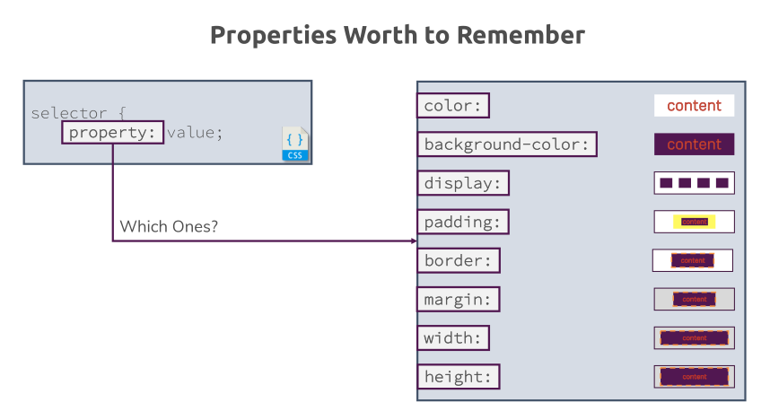
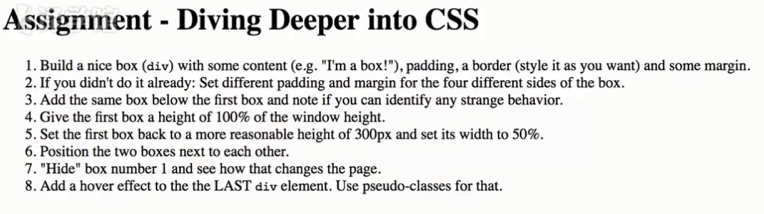
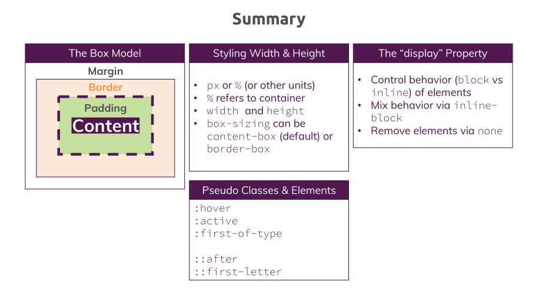

## ★ Properties Worth to Remember

> Puh（嗯），到目前为止我们研究了很多属性。当然，我们不需要记住每一个属性，但是你可能会经常用到一些属性。这个简短的列表将帮助你记住这些属性。

## <mark>1）值得记住的属性列表</mark>

请记住：

- 属性是冒号前的部分

在参考列表里边，有数量众多的属性，可我们常用的有哪些属性呢？

1. color：可以改变文字的颜色
2. background-color：改变盒子的背景色
3. display：改变元素的位置或行为
4. padding：用来增加content到border的距离
5. border：改变border的粗细
6. margin：给盒子的四周增加一些空间
7. width：设定宽度
8. height：设定高度

之后，我们还会遇到一些更重要的属性，有一些可能是很经常见到的或者是很少见到的

总之，目前，上图罗列的这些属性都是核心的属性，这些属性毫无疑问都需要你去记住的

之后，我们会接触到更多的知识，但是，我们是可以去学会它们的，只要用心去学，多用用就会了，注意，不要只是读它们，要运用这些知识，这样才可以真正帮助你真的记住了它们的用途，以及什么时候去运用它们

➹：[评价人做事学习很用心，这个“用心”是什么意思？ - 知乎](https://www.zhihu.com/question/20038181)

## ★Time to Practice - Diving Deeper into CSS 

> 目前，我们取得了良好的进展，是时候测试您在这个模块中获得的知识了

是时候练习一下我们在这一章当中学到的东西了

## <mark>1）有哪些任务呢？</mark>

完成这些任务所需要用到的知识，都是之前老师所讲过的

因此，这绝对的是一个非常棒的练习，需要注意的是，你务必自己动手去做一遍哈！

毕竟，在我们继续深入讲解其它内容之前， 你必须要理解这些核心内容

那么做啥呢？

1. 搞一个漂亮的box出来，如div -> content -> `I'm a box!` -> add padding、border、margin -> 选择任何你想要的size，如10px、20px都行 -> 目的 -> 训练盒子模型的概念 -> 通过开发者工具去理解盒子是如何构建出来的，以及这些不同的层是如何构成整个盒子的
2. 对box -> 使用不同的margin和padding
3. 在第一个box下边 -> 添加一个相同的box -> 在两个盒子之间并没有看出有啥奇怪的行为
4. 第一个盒子的高度 -> 匹配窗口的高度 -> 高度100%
5. 第一个box -> height 300px -> width 50%
6. 两个box -> 放在相邻位置
7. 盒子1 -> 隐藏 -> 不止有一种方法可以做到隐藏元素 -> 用这章学到的方法就好了
8. 盒子2 -> 悬浮效果 -> 伪类 -> 选择最后一个元素 -> 没有学过？ -> 查MDN

自己写一份答案 -> 对比老师的答案

## ★答案

- border的n种写法
- margin折叠 -> 上下两个box的margin -> 40px 30px 20px 10px -> 会看到margin折叠，这就是为啥要设定为40px……10px的margin，即为了看到margin折叠现象
- box1刚好占满整个高度 -> box-sizing -> border-box
- 注意HTML代码里边的空格，空格也是一个字符，所以也会有宽度，大概5px
- `visibility:hidden;` -> 让一个元素透明了，即元素还在文档流中，而 `display:none;`则是让元素从文档流中都移除了，当然，它们俩还在DOM树中，只是后者咩有在文档流这条传送带上了！ -> 添加响应式的边栏菜单时，配合JS，会使用到 `display:none;`
- 伪类 -> `:last-of-type` -> 在一组同级元素中选择最后一个元素，它们不一定是相邻的，只要在同一级，而且是同一类型的元素就可以了 -> 注意，它只对元素选择器管用，如`div:last-of-type {}` -> `div:last-of-type:hover {}` -> 这样的选择器不是很好用，，当然，偶尔使用是可以的，但请不要过度使用它们，通常会有一个更好的方式来选择最后一个元素，如添加一个合适的class or id，如果只是为了练习伪类，当然，这是可以使用的！ -> 总之，像这样 `div:last-of-type:hover`就是添加了很多选择器，而选择器多了，效率就会变低！

希望通过以上练习，可以帮助你理解核心概念，让你能够熟练使用这些属性

## ★ Wrap Up

> 让我总结一下这个模块，总结一下到目前为止你学到了什么

1. 盒子模型 -> 是CSS中的一个核心概念，每个元素都被当成一个盒子，无论它是行内元素还是块级元素，都被当作盒子来对待，唯一不同的就是，inline元素的上下margin是没有作用的，即便它们被设定了，也是会被忽略掉的，总之，除此之外，一切都是盒子 -> content、padding、border、margin是盒子模型的关键内容
2. width、height -> 单位 -> px or % or…… -> 改变宽度、高度的计算规则 -> box-sizing -> 默认 `content-box` -> `border-box`
3. display属性 -> 似乎和盒子模型也有点联系，但实际上并不是这样的 -> 通过display，你可以改变block元素或inline元素的行为，如设定block的行为为inline元素的行为，当然，也可以反过来设定 -> 还可以使用inline-block来让元素间位置上彼此相邻 -> none -> 可以从文档流中移除元素，注意这并不会从DOM树中移除，在开发者工具里边，你还是可以被设定了display为none的这个元素的，总之元素在normal flow，和我们所看到的这个页面里边被移除了
4. 伪类和伪元素 -> 它们的核心功能 -> 通过伪类可以装饰不同状态下的元素 or 选定元素的不同类型，如ul中的第一个li -> 通过伪元素，你可以选定元素的内容部分或者其它部分，如元素content的第一个字母，或者你定义的需要在一个元素之后添加的一些内容，然后对添加的这些内容给上样式

以上就是老师所教授的内容了，关键的是，你要练习运用这方面的知识，如果遇到有疑问的地儿，或者自己想再学一遍的话，那么你可以再听一遍这个章节