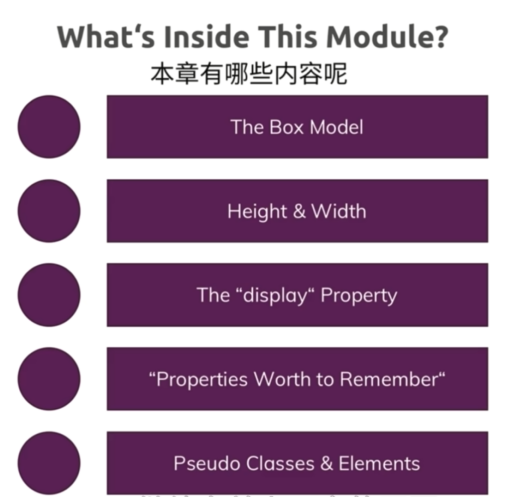

# 本章介绍

> 更深入学习CSS——了解盒子模型
> 
> 让我向您介绍该模块以及您将在其中学习的内容。

这一章要深入学习盒子模型 -> 而这是CSS的一个核心部分 -> 幸好它很容易理解，虽然很好理解，但这也很重要

## ★本章有哪些内容？

1. 盒子模型
2. 如何改变元素的高度和宽度？
3. 学习 `display`属性 -> 有助于我们在页面里边进行布局 -> 如「定位」元素到相邻位置
4. 深入学习一些需要掌握的属性 -> 关于属性和一些CSS特性（features）可以到MDN里边去看看 -> 想要更深入的学习，请随时查看参考文献 -> 当然也有一套常见的、你会经常使用的属性 -> 老师个人认为是最重要的属性
5. 学习伪类，以及伪元素 -> 学习它们是什么以及如何使用它们 -> 继续完善上一章的网页

