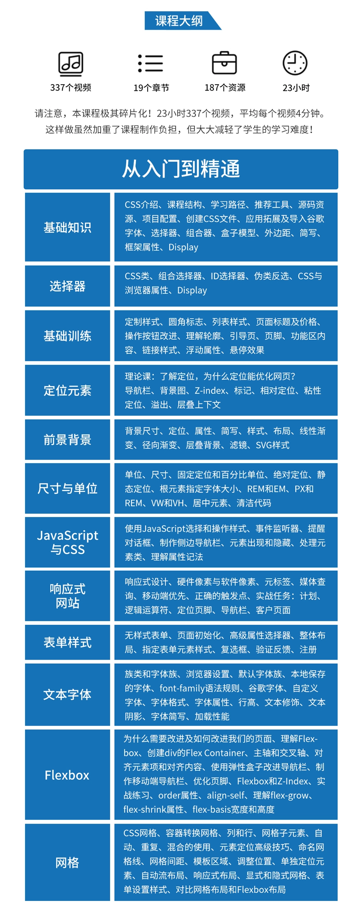
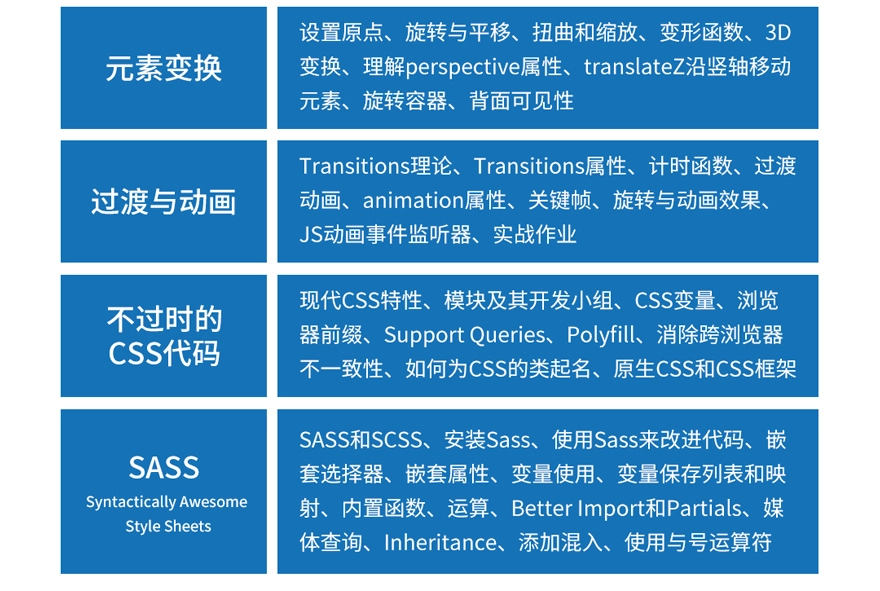

# README

## ★引子

我想重新学习CSS 3 或者说是 深入提高 CSS 技能！所以我就开始这门课了

为什么我打算提高呢？——因为我认为 CSS 真得是前端的核心竞争力呀！虽然 现在都有很多 UI 库，我们只需要稍微改一下样式即可弄出一个还算漂亮的网页，但如果自己想造个 UI 轮子的话，那么自己的CSS至少要有一定的水平才行啊！

## ★目录

- [01-概述](./01-概述)
- [02-CSS基础入门](./02-the-basics)
  - [02-1-CSS优先级、理解继承](./02-1.md)
  - [02-2-添加组合器、组合器是什么](./02-2.md)
  - [02-3-属性和选择器总结](./02-3.md)
  - [02-4-练习](./02-4.md)
  - [02-5-总结](./02-5.md)
- [03-深入了解CSS](./03.md)
  - [03-1-CSS盒子模型介绍、理解盒子模型&margin collapsing以及移除默认margin](./03-1.md)
  - [03-2-简写属性的使用、在练习里边应用简写](./03-2.md)
  - [03-3-深入学习高度和宽度属性、理解盒子尺寸](./03-3.md)
  - [03-4-为我们的项目添加页眉、理解Display属性](./03-4.md)
  - [03-5-display属性应用、美化导航条、理解inline-block的怪异行为、text-decoration & vertical-align](./03-5.md)
  - [03-6-美化链接、了解伪类与伪元素](./03-6.md)
  - [03-7-selector list、cta-button样式设计](./03-7.md)
  - [03-8-值得记住的CSS属性、练习、总结](./03-8.md)

## ★资源

➹：[德国Max的CSS 3终极前端开发指南 - 网易云课堂](https://study.163.com/course/introduction.htm?courseId=1208941848#/courseDetail?tab=1)

➹：[CSS完全开发指南（含Sass、Flexbox和Grid） – 译学馆](https://www.yxgapp.com/product/css-the-complete-guide-incl-flexbox-grid-and-sass/)

➹：[Get Started With CSS (Plus Flexbox, Grid, and Sass) - Udemy](https://www.udemy.com/course/css-the-complete-guide-incl-flexbox-grid-sass/)

➹： [demo](https://github.com/ppambler/CSS---The-Complete-Guide-incl.-Flexbox-Grid-and-Sass-)「GitHub搜索关键字：CSS The Complete Guide」

> 10.99$，不到78块钱（当前汇率7.090800）

## ★概述

德国大神MAX（样子有点像NBA里边的状元 格里芬）的经典之作。CSS入门不容错过的好课。

CSS是什么？—— **C**ascading **S**tyle **S**heets 的简写，它是一门 「编程语言」，用于把 「raw HTML pages」转变成真正漂亮的网站

课程讲解逻辑：从 简单的「What is CSS? How does it work? How do you use it？」入手，然后再逐渐深入对CSS的学习！最后以一个项目为终（该项目没有后台，是个存粹的前端项目）

## ★能学到什么

- 能搞个漂亮的网站出来，即网站内容6，样式也要6。总之，可以在自己的项目里边自信的应用CSS，而不是每写一个样式都得小心翼翼、如履薄冰……
- 能使用基本和高级CSS功能（features，特性）
- 能**真正**了解 CSS 背后的不同概念 和  理论，以及某些 CSS 功能（features）

## ★会有哪些内容

