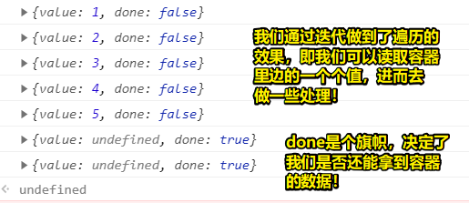
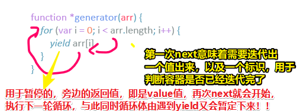
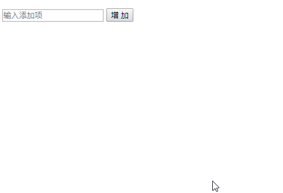
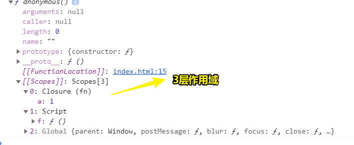
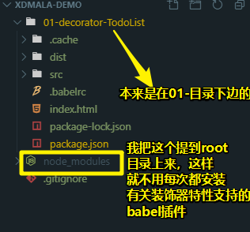

# 11~20

## 11、循环（Loops）、迭代（Iteration）、遍历（Traversal）的概念区分？

循环的目的：是为了将一个容器里边的东西，一次又一次连续的给拿出来。

Objet/Array/Map/Set……这些都是容器，那么这些容器为啥而存在呢？——我们知道任何一个事物都有相应的集合性，而「集合性」的存在是为了我们需要统一管理！总之，实际上，Object/Array等的存在，它们的必要性都是为了将数据统一给保管起来！说白了，Object等的本质属性就是容器哈！ 而循环就是从容器里边一次又一次连续不断地拿东西，直到拿完为止。
 
循环它只是一个手段，循环它要到达的目的是要**遍历整个容器**

很多人都不知道什么叫循环，什么叫遍历

循环和遍历不是一回事儿，循环它是操作数组等容器的一种手段，而操作的目的是把容器的数据给遍历出来，所谓的「遍历」就是在一个容器里边去观看，看到什么数据，就拿出什么数据出来！ 如在一个 `[1,2,3]`数组里边，**看到**一个`1`，那我就用「循环」的手段把它给拿出来，同理，**遍历到** `2` 和 `3`的时候，也用「循环」的手段把它们给拿出来！

总之，循环是一种手段，而遍历是一种结果！

或许，你会问「遍历必须要用到循环吗？」，换言之「遍历是不是一定要用循环的手段来实现呢？」

显然，这是不是的。循环和迭代都是实现遍历的一种手段

我们需往一个数据容器里边拿数据，或者说看看有哪些数据，说白了就是要遍历，那么我们可以用循环这种手段来做，也可以用迭代这种手段来做！

那么循环和迭代有啥区别呢？

区别在于循环是从容器里边一次又一次连续不断地拿元素，而迭代则是从容器里边一次又一次非要间断地拿元素

总之，要达到「遍历」这样的目的，可以用循环来做，也可以用迭代来做！
总之，「迭代」和「循环」实际上都是「遍历」的手段（方法/措施/技巧）！

在开发里边，哪些操作体现了「循环」呢？

如：for循环、forEach、map、filter、reduce……

那么「迭代」呢？

要做到「迭代」，需要给我们一个工具才行，毕竟要实现「迭代」或者说用「迭代」这种手段，总要有工具去实现它才行！而这个工具就是迭代器啦！不过，迭代器也不是平不无故就出现的（换言之，有一堆数据摆着，然后这堆数据突然就冒出一个迭代器出来，然后就去迭代这堆数据！显然这是不可能的！），我们需要根据数据产生一个生成器，然后这个生成器可以产出一个迭代器，说白了，「生成器」跟「迭代器」是一组东西！

至此，就有了「生成器」（generator）和「迭代器」（iterator）

那么如何用「迭代」的手段做到遍历呢？即如何根据数据搞一个生成器，进而产出一个迭代器呢？

目前有什么：

一个容器，里边有5个元素这样的数据：`[1,2,3,4,5]`

我们要这样的效果：

```js
next() // {value:1,done:false}
next() // {value:2,done:false}
next() // {value:3,done:false}
next() // {value:4,done:false}
next() // {value:5,done:false}
next() // {value:undefined,done:true}
next() // {value:undefined,done:true}
```

用ES5搞个生成器出来：

``` js
var arr = [1, 2, 3, 4, 5]

// 根据数据产生一个生成器
function generator(arr) {
    var i = 0

    return {
        next: function() {
            var done = (i >= arr.length)
              , value = !done ? arr[i++] : undefined

            return {
                value: value,
                done: done
            }
        }
    }
}

// 生成器生成一个迭代器：
var iterator = generator(arr)

console.log(iterator.next())
console.log(iterator.next())
console.log(iterator.next())
console.log(iterator.next())
console.log(iterator.next())
console.log(iterator.next())
console.log(iterator.next())

```

效果：



用ES6姿势搞个生成器出来：

``` js
// 等价于ES5的写法，log的结果同上！
function *generator(arr) {
    for (var i = 0; i < arr.length; i++) {
        yield arr[i]
    }

}
```

ES6的做法很简单，这是浏览器根据ES6规格文件自己实现的一个生成器功能，做法如上边的代码所示了，即：

1. 在函数名前边 `*`，而这就表明这是一个生成迭代器的函数
2. 函数体里边，只需要去遍历容器，然后 `yield` 容器的每一项即可！

只要在函数名前边打了 `*` ，那么就可以在函数体里边使用 `yield`了，那么 `yield`是什么呢？

很简单，你只需要知道它是一个打点的关键字即可！即一遇到 `yield` 就打个点，然后程序就停下来了，而最终所呈现的效果就是， `next()`一下，就迭代一次，如第一次迭代出一个 `1`来之后，就不能继续遍历了，总之，就是让每次循环暂停一下，只要调用`next`一下，那么循环就会启动，并且拿到这一次循环 遍历的结果！

总之，我们的 `next()`就是一个指令——让循环动就动，不动就不动，而且每次都能得到 `yield`旁边的返回值：



**➹：**[读懂 ECMAScript 规格 - 阮一峰的网络日志](http://www.ruanyifeng.com/blog/2015/11/ecmascript-specification.html)

---

## 12、当我们实现了一个生成器，进而产生了一个迭代器，那么这个迭代器的迭代功能有啥用呢？

> 程序的本质是为了解决问题，如果这程序不能解决问题，那么这程序毫无意义！

场景：底层封装「我们自己所写的框架时」会用到的一些东西，如**中间件**

关于「中间件」，我是从Node.js 里边了解到的，尤其是在koa2 express这两个框架里边都有中间件的说法！

那么「中间件」到底是什么？——很简单，举个栗子你就明白了，它没有想象中的那么难理解。栗子如下：

有这么一组函数，如这样：

``` js
function test1() {}
function test2() {}
function test3() {}
```

我们希望它从上往下按顺序执行，而且后边的函数是否执行，是根据前边的函数来决定的，因此我们需要追加一个`next`函数参数：

``` js
function test1(next) {next()}
function test2(next) {next()}
function test3(next) {}
function test4(next) {}
```

如果函数体里边咩有 `next()`，如 `test3`这个函数，`test3`之所以被执行，是因为在 `test2`的函数体里边有 `next()`，可见在上边的代码里边，`test3`执行完毕后，不会去执行 `test4`

那么以上这个函数执行流程形式，会用在什么具体业务场景呢？

举个简单的应用例子：

假如test1是用来 `checkToken`的，当你登录完后，后端会返回一个码，而这个码会保存在前端，用户打开一个页面，那么就需要判断这个用户是否可以在登录状态情况下打开页面，说白了，你打开掘金等网站的首页，是已登录的状态的！

那么这个过程的实现，就得检查客户是否保存了这个码，即这个Token，如果这个Token存在的话，那么我们就会经历第二个函数，即所谓的 `test2` 啦！

而这个test2用于提交token，即`submitToken`

那么为啥要提交这个token呢？——因为这个码是在客户端保存的，那么就存在会被篡改的情况，因此我们需要把这个码提交到后端里边去进行验证！

而验证完回来以后，那么这很有可能是通过的，假如是通过的，那么我们就 `loginSuccess` 一下，即让用户浏览的这个页面成为登录状态！同理，如果不通过，那么 `loginSuccess`就不会被执行！

如果我们用一个数组，把这三个函数保存起来，如这样 `[checkToken,submitToken,logonSuccess]`，那么这3个函数就会按照数组的下标顺序执行，而且我们还可以用 `next()` 这种姿势去中断往下执行这个流程！

简单的伪代码如下：

``` js
const middleware = [checkToken,submitToken,logonSuccess]
function checkToken(next) {
  // 如果token存在，就会执行下边的那个函数，即submitToken
  if(token) {
    next()
  }
  // 如果不存在，那就什么也不做，即下边的submitToken不会被执行！
}

function submitToken(next) {
  $.ajax({
    type: 'POST',
    url: url,
    data: token,
    success: (res)=>{
      next()
    },
    dataType: dataType
  })
}

function logonSuccess(next) {
  // 页面跳转
}
```

从伪代码可以看出，如果我们在真正的项目开发当中用这样代码，那么这代码将会更有架构感和逻辑感

总之，以上这种开发模式，在真正的前端开发里边，是很常见的，即用得非常多哈！

目前我们了解迭代功能有啥用，也设计好了使用迭代功能的API，那么接下来就来实现一下这个迭代功能：

[demo](./demo/02/01-中间件之迭代器实现/index.html)

以上就是如何在前端里边实现中间件的方式了，这种方式在项目里边是完全可以使用的，如你在验证一个用户输入的时候，也是可以用这种方法的，即第一个函数用来检测输入的长度，第二个函数用来检测是不是合法的输入，第三个提交到后端去验证是不是合适的输入，然后响应回来的结果，决定着是否要执行下边那个「登录成功」的函数！

通过以上代码，我想你应该了解到，**如何用自己学过的东西去把自己的思路打开，然后借此够写出更好的程序出来，这一点是非常关键的！** 就像下边所举的例子这样：

很多时候，我们都会看到这样的东西：

小程序每个页面都会有个 `Page({})`，那么这个 `Page({})`是什么呢？

显然，`Page`实际上一个function哈！即：

``` js
function Page(options) {
  this.data = options.data
  this.methods = options.methods
  //……
}
```

很多东西，其实都可以通过观察来知道这东西的架构到底是什么，如这 `Page({data:{},methods:{}})`

同理，Vue的架构也是如此，如我要实现下边这样的功能：

``` js
new Vue({
  el: '#app',
  data() {

  },
  methods: {

  }
})
```

那么我们就可以这样：

``` js
function Vue(options) {
  this.el = options.el
  this.data = options.data
  this.methods = options.methods
}

// 如果实现一些功能，那就在其原型上写上相应的功能即可
Vue.prototype.xxx = function xxx(a) {
  //……
}
```

当然，Vue实现了很多复杂的功能，但是逻辑和架构上基本上咩有什么不一样！如我们刚刚写的中间件，所接受的是一个函数数组，而不是一个普通对象

不管怎样，要对整个项目开发有个更深的研究，那么就需要有一定的理论支持（如为啥要传个选项对象和函数数组）。如果你一天到晚都在开发这样，那样的项目，没有对以上所提到的这种开发模式和开发思想，以及项目开发经验的输入的话，那么这是没有办法成为一个真正的前端工程师的！

> 中国只有10%的前端，剩下的前端都是代码的搬运工，即码农！

前端是江湖手艺（如厨师、理发等），也是一门技术，需要一个非常系统的学习才能真正成为工程师！即东凑一点，西凑一点的自学技术，很容易就会遇到技术瓶颈了！

总之，这个中间件程序代码往小的说就体现了程序的设计思想，往大的说就是整个项目的架构了！整个程序模块如何去设计，这是一种本事，如何养成这样一种本事，需要一个系统方案去培养才行！

> 程序 = 数据结构+算法+代码结构设计

**➹：**[前端开发中的中间件](http://zhenhua-lee.github.io/node/middleware.html)

## 13、TODO List？——如何在实际开发中用上装饰器

**1）TPR：**

- 一般会把document对象作为临时变量传到class里边的`constructor(doc)`

- 关于工具函数，它们都有公共性质，如去除输入框的里边输入的空格……那么为啥需要工具函数呢？——因为我们要给类进行扩展，说白了，我们定义了一个class，但是在写功能的时候需要用到一些辅助性质的功能（这样的功能是不确定的，我称它为「边角料功能」），如对input输入的东西需要去除空格，而这些边角料功能并不属于这个class的这个功能的，但是我们希望有这个边角料功能的时候，就可以为这个class加上这个功能，因此就需要用到装饰器这样一个功能来实现为class追加额外的功能

- 如何写一个装饰器？(用于扩展一个东西的功能，如为class添加静态方法)
  - 定义一个装饰器 `(target)=>{target.xxx = ()=>{}}`，`target`是一个class
  - 要装饰谁，那就在谁上边写上 `@xxx`，当然，这可以挂载多个！
  - 还可以给实例添加装饰器，即 `(target)=>{target.property.xx = ()=>{}}`

- 设计程序咩有那么简单，你要看到老师写的东西和你自己写的东西有什么区别，而找到区别以后，你才能提升自己，如果找不到区别，一直按照自己的方式写的话，那么你永远都无法提升！

- 跟老师学习的原因：打开自己的眼界，把自己的综合实力往上提升；要让老师把自己的那扇窗给推开，要有一个人站在窗边告诉自己，哪些东西应该看，哪些东西不应该看，哪些东西应该记在脑子里边，哪些东西应该不记在脑子里边，即应该摒弃掉！而这才是真正学习前端的一个过程！

- 你要想看懂一个人的代码架构设计或者说是思路，那么前提是你要有一定的基础知识！

- 高亮 `.tpl`文件？并且还有提示？——请安装 「Handlebars」 这个VS Code插件。（`.tpl`文件里边的内容是我们的HTML模板代码，当然这不需要加引号哈！）

- parcel 没有相关的对 `.tpl` 文件编译的[插件](https://www.jianshu.com/p/8f46119f74c6)，说白了，我们在使用webpack的时候有 `ejs-loader`插件，而该插件可以将EJS模板文件当做一个函数输出（写个类似ejs-loader这样的插件出来？）

2）How？

第一版：




## 14、函数的执行VO、AO过程？

> 函数解析执行 ：解析即函数预编译过程（VO），执行即函数体里边的代码正式执行（AO）！

``` js
function bar() {
  let num = 100
}
bar()
```

**1）函数的定义：**

1. 开辟一个堆内存，对应一个引用的空间地址
2. 把函数体中的代码当作字符串存储到堆内存里边
3. 把函数体的空间地址赋值给函数名

**2）函数的VO：**

> 定义了函数，但没有执行，是没有VO和AO过程的，还有一点需要注意的是，函数里边的代码执行是咩有什么优先级的说法的，一切都是按照JS引擎定义的规则去按顺序编译执行的！总之，函数被调用了就会引发VO、AO

1. 形成一个上下文的执行环境（栈内存，也就是所谓的 call stack ）

2. 初始化作用域链（）

3. 创建变量函数
  

4. 创建并初始化 `arguments` 对象，还有对参数声明并赋值

5. 扫描当前上下文里边的函数声明并且赋值

6. 如果函数名已经处在了，那么就会把第一次初始话的变量进行覆盖，说白了就是新的空间地址覆盖原来的空间地址

7. 扫描当前上下文里边的变量声明，并且初始值为 `undefined`
   
8. 如果变量名重复，那就直接跳过

9. 确定上下文里边的this指向

注：

变量提升，先找函数变量提升，然后再找var这些变量的提升，而且这些变量的提升只是声明并且给了一个 `undefined`值，而函数的提升，是声明了，并且定义函数所开辟的空间引用地址值的！

关于作用域，函数的上一级作用域跟函数在哪里定义的有关，在哪里定义的函数，那么该函数的上一级作用域就是谁！这一点你可以对函数名 `dir`一下，其结果会有一个叫 `[[Scopes]]`属性存在（表示有几层作用域）。函数执行时，会一级一级的往上找变量所对应的值，直到在window为止，如果window旗下也咩有的话，那么就会报`Uncaught ReferenceError: xxx is not defined` 这样的错误！

如：

``` js
function fn() {
  let a = 1 
  return function() {
    console.log(a)
  }
}

let f = fn()
f() //f 这个函数是在 fn执行的作用域中开辟的堆内存，那么f的上一级作用域就是fn执行形成的作用域了
```

最新的谷歌浏览器里边，`script`标签也作为一块作用域，最后才是所谓的 `Global`作用域




**3）函数的AO：**

1.  对代码从上到下开始执行！

**4）一些测试代码**

``` js
function fn(a) {
  console.log(a) //3
  var a = 1
  console.log(a) //1
}

fn(3)

function fx(x) {
  console.log(x) // 函数x
  function x() {
    console.log(x)
  }
}

fx(1)
```

**➹：**[【JS】什么是AO-VO - 倪晓磊的博客](https://blog.nixiaolei.com/2019/06/10/%E3%80%90JS%E3%80%91%E4%BB%80%E4%B9%88%E6%98%AFAO-VO-GO/)

## 15、在JS 里边，你写的哪些代码会导致内存泄漏？

什么叫内存泄漏？——数据咩有被使用的价值，而且在内存里边无法被回收，说白了，毫无使用价值的数据死皮耐脸的占据着内存空间，那么这就是内存泄漏问题了！

**1）全局的变量不能被回收，因为会放在window这个对象里边。**

如这样：

``` js
function fn() {
  this.obj = {} 
}
fn() //函数解析执行，this的指向是window，因此全局会有个obj变量。
```

解决方案：严格模式下执行函数！

``` js
function z() {
    "use strict";
    this.obj = {}
}
z() //ncaught TypeError: Cannot set property 'obj' of undefined，this是undefined值！
```

总之，少用全局变量，因为这除了解决内存泄漏问题，也解决了全局变量名污染的问题！

**2）闭包引发的内存泄漏**

> 闭包这种思想很重要，有好处有坏处，说白了，不要因为所谓的「内存泄漏」问题，就不用闭包了

``` js
function bar() {
  let a = 10 //会放到当前函数执行的环境中，即call stack里边
  return function () {
    a++
    console.log(a) //10
  }
}
let b = bar()
b()
```

b函数解析执行完毕后，其函数体里边`a`这个变量不会被销毁，或者说 `bar`这个函数执行完毕后，其内部的 `a`变量没有被销毁！

如果我们对a变量是有使用价值的，那么这所谓的内存泄漏并不算是内存泄漏，反之，咩有使用价值，那就是真正的内存泄漏了！

**3）对象中存在DOM的引用**

> DOM 元素存在两个引用：一个在 DOM 树中，另一个在对象里边

``` js
var elements = {
  button: document.getElementById('button'),
}

document.body.removeChild(document.getElementById('button'));
```

通过 `removeChild`这个API， button元素在页面里边已经看不见了，即不在DOM树里边了，但还保存 `elements.button`里边，因为 `removeChild`的返回值，正是被移除的button节点！

**4）被遗忘的定时器**

使用完定时器之后，别忘了 `clearTimeout(timeoutId)` 、`clearInterval(intervalId)`一下哈！


**➹：**[4类 JavaScript 内存泄漏及如何避免 - Alon's Blog](https://jinlong.github.io/2016/05/01/4-Types-of-Memory-Leaks-in-JavaScript-and-How-to-Get-Rid-Of-Them/)

**➹：**[JS 定时器的4种写法及介绍-前端开发博客](http://caibaojian.com/javascript-timer.html)

**➹：**[「每日一题」JS 中的闭包是什么？ - 知乎](https://zhuanlan.zhihu.com/p/22486908)

**➹：**[闭包真的会导致内存泄漏？ - IT程序猿](https://www.itcodemonkey.com/article/15339.html)


## 16、辣鸡回收机制？

为什么有「垃圾回收机制」？

> js 引擎为了解决内存泄漏问题，才有了垃圾回收机制，而该机制能够让 js 自动的管理内存，将内存中不在使用的变量回收掉，然后释放出内存空间。

该机制是怎样的？

> js 用了两种策略，一个是标记清除法，另一种是引用计数法，其实它俩的实现原理我们只明白一点即可，那就是都是通过**判断当前的变量是否被引用，如果没有被引用，就说明该变量应该被回收**，而怎么回收就是上边说得两种策略的事情了。

GC 辣鸡回收器：GC每隔一段时间就会执行一次

1）标记清除（谷歌、IE、火狐、opera大都采用这种方式，效率高，隔一段时间就检查一波看看是否有需要被垃圾回收的对象！）

1. 给每一个空间地址记上标记
2. 筛选过滤环境的变量或者对被引用的变量去除标记
3. 有标记的就被视为被删除的变量
4. 浏览器对有标记的进行辣鸡回收，释放内存


2）引用计数（循环引用时，这种方式就不好使了，所以这也是为啥大多数浏览器采用第一种策略的原因之一！）

1. 对变量被引用一次就会在这个变量计数+1
2. 如果不再引用，那么计数会默认-1
3. 当该变量计数为0时，那么浏览器要回收该块的内存！

总之，如果一个对象不再被使用，如 `var obj = {name: 'xxx'}`， 那么你就 `obj = null` 一下吧！即自己手动清除，而不是让浏览器自己去定时去回收处理！

**➹：**[闭包真的会导致内存泄漏？](https://mp.weixin.qq.com/s/rlzcBUAI0SP2TWpSCqNglQ)


## 17、函数闭包的实质？

``` js
function fn() {
  let a = 1 
  return function() {
    console.log(a)
  }
}

let f = fn()
f() 
```

我们知道函数执行会形成一个栈内存（执行上下文），即所谓的call stack
而且一般来说，该函数执行完成之后，就会立即回收，即栈内存中存储的值都会被回收掉

而上边fn的执行的这个栈内存是不回收的，因为一旦回收的话，a变量的值会被销毁，返回的匿名函数的存储空间也会被回收掉，由于在全局作用域里边还有个f在引用fn所返回的匿名函数，既然有引用，那么这个栈内存就会不会被回收了，即匿名函数不会被回收，而匿名函数里边有个 `a` 变量，那么该 `a`变量也不会被回收，而这就构成了一种闭包现象了！

如果，我们要回收fn这个执行栈，那么只能关页面或者关浏览器了！

## 18、`arguments[0]()` 的 `this` 指向？

``` js
let length = 0 //var也行
function foo() {
  console.log(this.length)
}

function bar(fn) {
    fn.call(obj) //2
    fn() //0
//   console.log(arguments[0])
//   console.log(arguments['0'])
//   console.log(arguments['length'])
//   console.log(arguments.length)
  fn.call(arguments) //1
  arguments[0]() //1
}

var obj = {
  length: 2,
  foo:foo
}

bar(obj.foo)
```

## 19、版本为 78.0.3904.108 的chrome浏览器不支持 ES2017 的装饰器特性？

为啥要使用装饰器特性？

> 一般可以用装饰器来封装基础库，而且效果还不错，代码的可读性和开发便捷性都有提升，更重要的是装饰器给js提供了一种比较“面向切面”的编程风格，可以扩展开发时的思路。

How？

1）全局安装parcel

``` bash
npm install -g parcel-bundler
```

我第一次用 `yarn` 全局安装它之后，测试代码就这报了这样的错误 `Unknown version 63 of opera`，于是我就 `yarn global remove parcel-bundler`了，然后用 `npm`来搞，结果没有报这样的错误了

> 为什么我要全局安装？——因为有很多测试代码！而这些测试代码或多或少会用到ES7等最新的特性！所以我把每份测试代码都看成是一个包，即需要添加 `package.json`



2）根据报错提示，需要安装依赖

``` bash
npm install --save-dev @babel/plugin-proposal-decorators
```

3）新建一个 `.bashrc`，并添加一下配置：

``` json
{
  "plugins": [
    ["@babel/plugin-proposal-decorators", { "legacy": true }],
    ["@babel/plugin-proposal-class-properties", { "loose" : true }]
  ]
}
```

4）测试 

``` bash
parcel index.html
```


> `**/node_modules/`：不要提交二级目录下的 `node_modules`

**➹：**[@babel/plugin-proposal-decorators · Babel](https://babeljs.io/docs/en/babel-plugin-proposal-decorators#installation)

**➹：**[往github 上传代码怎么忽略node_modules文件夹啊？ - SegmentFault 思否](https://segmentfault.com/q/1010000006924686)

**➹：**[javascript装饰器的正确打开方式 - 知乎](https://zhuanlan.zhihu.com/p/32856278)

我在使用这个语法的时候：

``` js
target.generator = function* (arr) {
    for (let item of arr) {
      yield item
    }
  }
```
居然报了这样的错误： `regeneratorRuntime is not defined`

于是我就google一下：

**➹：** <https://github.com/parcel-bundler/parcel/issues/2128#issuecomment-531321257>

**➹：**[解决：Uncaught ReferenceError: regeneratorRuntime is not defined - - SegmentFault 思否](https://segmentfault.com/a/1190000016384693)

最后的 `.bashrc`配置：

``` json
{
  "presets": [
    [
      "env",
      {
        "targets": {
          "browsers": [
            "last 2 Chrome versions"
          ]
        }
      }
    ]
  ],
  "plugins": [
    [
      "@babel/plugin-proposal-decorators",
      {
        "legacy": true
      }
    ],
    [
      "@babel/plugin-proposal-class-properties",
      {
        "loose": true
      }
    ]
  ]
}
```

安装的依赖：

``` json
{
  "devDependencies": {
    "@babel/core": "^7.7.4",
    "@babel/plugin-proposal-class-properties": "^7.7.4",
    "@babel/plugin-proposal-decorators": "^7.7.4",
    "babel-core": "^6.26.3",
    "babel-preset-env": "^1.7.0"
  },
}
```

> 我直接配置了 `.babelrc`，然后以上依赖在我 `parcel index.html` 的时候，`"devDependencies": {}`就变成以上那种多了5个字段对象了，说白了，可以不用在package.json里边添加要依赖的包，而是直接利用 `.babelrc`的配置，然后通过 `parcel index.html` 就可以自动安装5个依赖包了！


## 20、如何理解`var e = e || window.event`？

> 为了更好的兼容IE浏览器和非ie浏览器，说白了IE8 没有 e对象，直到ie9才有了e对象

类似的其它兼容性写法：

``` js
//跨浏览器获取滚动条位置
function getScroll(){
    return {
        top : document.documentElement.scrollTop || document.body.scrollTop,
        left : document.documentElement.scrollLeft || document.body.scrollLeft
    }
}

var nT = e.target || e.srcElement
```

总之，新打头，旧兜底！

**➹：**[javascript - 如何理解var e = e \|\| window.event？ - SegmentFault 思否](https://segmentfault.com/q/1010000005880084)

**➹：**[e=e\|\|window.event用法细节讨论 - 简书](https://www.jianshu.com/p/42349e49c1dc)


