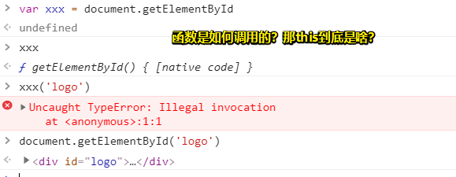
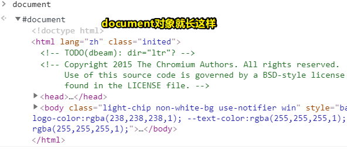

# 21~30

## 21、react和vue比，它的优势在哪？感觉react表单操作太繁琐，远没有vue爽快

其实两者各有优势，react单项数据流，更接近原生js，相比于vue更灵活一些 react 适合 oa系统，适合 大批量的数据展示、适合做大型应用。react对批量数据操作很厉害。

总之，针对不同的项目选用不同的框架

## 22、关于学习如何封装组件？

最好的学习方式就是看源码，这里推荐你可以参考一下 [element ui](https://element.eleme.cn/#/zh-CN/component/carousel)

## 23、用了mongoose就不需要使用原生的mongodb语句吗？

> mongoose是mongodb的ORM框架。可以使用mongoose轻松实现对于mongodb的操作，类似于javaee中的hibernate，大多数情况下不再需要使用mongodb，但是如果特别复杂的可能仍需使用。

## 24、关于ext.js这个框架？

> 需求：有一个早期项目需要把其中的一个流程功能用react重构，然后在重新嵌入到Ext框架中

就2019年说，一般用这个，都是在维护一些早期的项目。

如果仍然坚持使用extjs来维护，而且是接手别人的项目，估计这会让人很郁闷。公司如果仍然不考虑使用vue这种框架来重构，要么这个项目大到无法重构，要么没钱重构

搞extjs这个东西对自身业务经验上没啥帮助，除了可能会学到些它的代码设计思想，如「它的代码面向对象设计的非常好」

##  25、函数是如何调用的 跟 `this` 有啥关系？

`var xxx=document.getElementById`，把这个函数存在变量xxx中，那么当调用xxx的时候，xxx这个函数中的this指向了window，也就意味着`getElementById`对应的函数中的this是window。

要注意：获取元素是从document对象中获取，不在其他对象中。所以会抛出一个：`Illegal invocation`（非法调用）

> 获取每个元素时，通常会找到一个View（一个功能模块，即一个有很多儿子的DOM），然后把它作为局部容器，用于选择它的儿子，这样就不用全局检索整个document了，而这样一来性能就会提高一点！

<https://www.oschina.net/question/98011_53181?sort=default&p=1>

