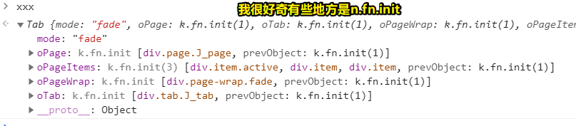
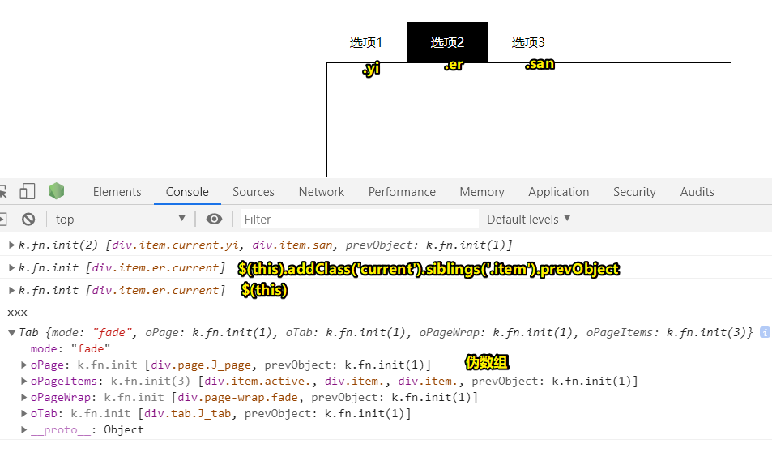

# 21~30

## 21、react和vue比，它的优势在哪？感觉react表单操作太繁琐，远没有vue爽快

其实两者各有优势，react单项数据流，更接近原生js，相比于vue更灵活一些 react 适合 oa系统，适合 大批量的数据展示、适合做大型应用。react对批量数据操作很厉害。

总之，针对不同的项目选用不同的框架

## 22、关于学习如何封装组件？

最好的学习方式就是看源码，这里推荐你可以参考一下 [element ui](https://element.eleme.cn/#/zh-CN/component/carousel)

## 23、用了mongoose就不需要使用原生的mongodb语句吗？

> mongoose是mongodb的ORM框架。可以使用mongoose轻松实现对于mongodb的操作，类似于javaee中的hibernate，大多数情况下不再需要使用mongodb，但是如果特别复杂的可能仍需使用。

## 24、关于ext.js这个框架？

> 需求：有一个早期项目需要把其中的一个流程功能用react重构，然后在重新嵌入到Ext框架中

就拿2019年说，一般用这个，都是在维护一些早期的项目。

如果仍然坚持使用extjs来维护，而且是接手别人的项目，估计这会让人很郁闷。公司如果仍然不考虑使用vue这种框架来重构，要么这个项目大到无法重构，要么没钱重构

搞extjs这个东西对自身业务经验上没啥帮助，除了可能会学到些它的代码设计思想，如「它的代码面向对象设计的非常好」

##  25、函数是如何调用的 跟 `this` 有啥关系？


`var xxx=document.getElementById`，把这个函数的地址存在变量xxx中，那么当调用xxx的时候，xxx这个函数中的this指向了window，也就意味着`getElementById`对应的函数中的this是window。

要注意：获取元素是从document对象中获取，不在其他对象中。所以会抛出一个：`Illegal invocation`（非法调用）


> 获取每个元素时，通常会找到一个View（一个功能模块，即一个有很多儿子的DOM），然后把它作为局部容器，用于选择它的儿子，这样就不用全局检索整个document了，而这样一来性能就会提高一点！

**➹：**[JS中的document.getElementById的一个小问题 - OSCHINA](https://www.oschina.net/question/98011_53181?sort=default&p=1)

## 26、`display:none;` 干了什么？

**1）`display:none;`：**

隐藏元素，不占网页中的任何空间，让这个元素彻底消失（**看不见也摸不着**）

> 想象一下你电脑桌上边放着的水杯，本来你能看见它，也能拿起它，但是设置了这个CSS样式之后，就看不见它了，也拿不起它了，即水杯这个位置成了空气！

**2）`overflow:hidden;`：**

让超出的元素隐藏，就是在设置该属性的时候他会根据你设置的宽高把多余的那部分剪掉

**3）`visibility:hidden;`：**

把元素隐藏了，也就是你看不到它的内容但是它内容所占据的空间还是存在的。（**看不见但摸得到**）

关于设置了以下样式，元素是否可点击的问题：

``` css
{ display: none; /* 不占据空间，无法点击 */ } 

{ visibility: hidden; /* 占据空间，无法点击 */ } 

{ height: 0; overflow: hidden; /* 不占据空间，无法点击 */ } 

{ position: absolute; top: -999em; /* 不占据空间，无法点击 */ } 

{ position: relative; top: -999em; /* 占据空间，无法点击 */ } 

{ position: absolute; visibility: hidden; /* 不占据空间，无法点击 */ } 

{ opacity: 0; filter:Alpha(opacity=0); /* 占据空间，可以点击 */ } 

{ position: absolute; opacity: 0; filter:Alpha(opacity=0); /* 不占据空间，可以点击 */ } 
```

关于 `filter:Alpha(opacity=0);`：

> 它相当于CSS3 opacity 透明，而filter属性是IE特有的，它还有很多其它滤镜效果，而`filter: alpha(opacity=0);` 兼容IE8及以下的IE浏览器， 而在支持CSS3 opacity 的浏览器中，可以 `opacity:0;`

于是有了这样的兼容性写法：

``` css
h1{
    filter: alpha(opacity=0);
    opacity: 0;
}
```

> 0是完全透明，即你完全看不见这个元素，我在IE8里边，打开百度首页，然后把「百度一下」这个按钮搞为`filter:alpha(opacity=0)`，结果该按钮是看不见的，但是可以点击它！即我点击后可以跳转到搜索结果页面！

**➹：**[display:none,overflow:hidden,visibility:hidden之间的区别 - 自_定义 - 博客园](https://www.cnblogs.com/yangjie-space/p/4857654.html)

**➹：**[CSS中filter：alpha（opacity=0）表示什么意思？ - SegmentFault 思否](https://segmentfault.com/q/1010000004394889)

## 27、jQuery的`on`方法，与事件委托，有啥关系？

``` html
$(el).on( events [, selector ] [, data ], handler(eventObject) )

```

如果on方法传递了selector参数（且不为null），只有当selector是el的子孙元素，且触发事件的元素是selector或者selector的子孙元素时，才会触发绑定在el上的事件处理函数。

> 取消用on绑定的事件处理函数的方法是off()，还有不管触发的是哪个元素的事件处理函数，函数中的this永远指向selector，因此如果我们需要指定 `this`的话，那么我们一般会用 `$.proxy()`来搞，而这类似于 `bind`

总之，假如有以下DOM结构（可看做是一个tab选项卡的切换item）：

``` html
<div class="tab J_tab">
  <div class="item current">选项1</div>
  <div class="item">选项2</div>
  <div class="item">选项3</div>
</div>
```
那么我们要写的事件委托：

``` js
$('.J_tab').on('click','.item',$.proxy(callback,this)) //我们显示指定this的值，类似于bind

// 不然如果你这样写的话，那么callback里边的this,就是每个item了，即  <div class="item">选项2</div> ……这样的DOM元素
$('.J_tab').on('click', '.item', callback) 
```

**➹：**[jquery on方法（事件委托） - soj - 博客园](https://www.cnblogs.com/sooj/p/3566718.html)

**➹：**[jquery on 方法 - 简书](https://www.jianshu.com/p/2885f2b0bba4)

## 28、jQuery里边的 `k.fn.init`？



**➹：**[jQuery选择器的结果是prevobject:e.fn.e.init [1]我怎么得到一个元素 - work hard - CSDN博客](https://blog.csdn.net/yintianqin/article/details/61917615)

**➹：**[jQuery源码中的“new jQuery.fn.init()”什么意思？ - SheilaSun - 博客园](https://www.cnblogs.com/SheilaSun/p/4779895.html)

## 29、关于jQuery里边的preObject？



**➹：**[jQuery的prevObject - 传不习乎](https://oychao.github.io/2017/07/13/javascript/29_jquery_prevobject/)

## 30、API接口到底是啥？

简单理解API接口：它就是电源插座，插座有一些小孔，即接口，我们用插头插上（插头的规格肯定得符合插座的小孔才能使用），就会让我们的电器动起来！那为啥会动呢？——显然是有电哈！

我们希望让电器动起来，那么我们显然需要用到电，可这电需要我们自行制作一个发电装置吗？——显然是不需要的，我们直接用别人提供给我们的电源插座就好了！

所以API接口，很简单很简单的来说，就是被人提供给我们用的东西，而我们要用这些东西，得按照这些东西给我们的规则来搞才行，不然，就不能够正确地使用它们了！

那么接口的意义是啥？——化他人的能力为我所用！即用人家提供的轮子，来实现我们的目的！说白了，用他人的双手来成就我们自己的梦想！


**➹：**[想问一下什么是API接口，具体是什么意思？ - BinarySTD的回答 - 知乎](https://www.zhihu.com/question/38594466/answer/788234007)

**➹：**[【官方双语】三明治夹心？API是什么#电子速谈_哔哩哔哩 (゜-゜)つロ 干杯~-bilibili](https://www.bilibili.com/video/av7042123?from=search&seid=12970425151312671127)

**➹：**[3分钟图解 程序员都知道的API 到底是什么?_哔哩哔哩 (゜-゜)つロ 干杯~-bilibili](https://www.bilibili.com/video/av22590708/?spm_id_from=333.788.videocard.2)

**➹：**[初学编程，遇到的API接口是什么意思？_哔哩哔哩 (゜-゜)つロ 干杯~-bilibili](https://www.bilibili.com/video/av16873749/?spm_id_from=333.788.videocard.1)


