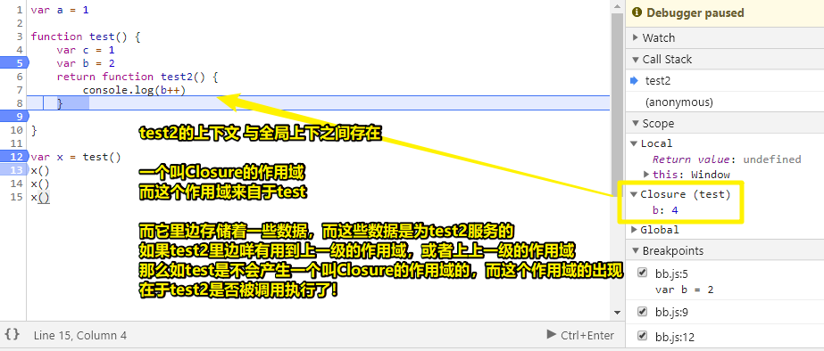
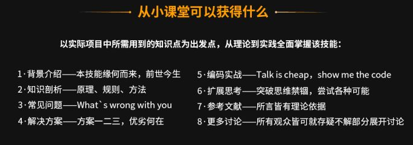

# 31~40

## 31、再次理解闭包？

测试代码如下：

``` js
var a = 1

function test() {
    var c = 1
    var b = 2
    return function test2() {
        console.log(b++)
    }    
   
}

var x = test()
x()
x()
x()
```

结果：



偶然看到小野老师解释闭包：

函数内部返回一个函数出去，其内部还带着一个变量出去，而这种函数就是闭包函数

如果咩有「一个函数携着一个变量出去」这种情况，那么一定不可能形成闭包

需要注意的是，闭包不是「是不是」的说法，而是「形不形成」的说法，总之，闭包是一种现象哈！因此我们一般不会去讨论这个是不是闭包，而是在什么条件下形成了闭包！

> 闭包给我的赶脚就像是CSS在某些条件下触发了BFC哈！
>
>关于「现象」这个词：事物在发展变化中表现出来的外部形态（跟「本质」相区别），如「打架斗殴的 现象时有发生」
>
>因此联系到闭包这种现象，那么就是在函数的执行过程当中表现出来的一种外部形态，如在 `Scope`里边多了一个叫 `Closure`的东东！

## 32、偶然对 `#app` 它的一个感性认识？

大众理解，`#app`在Vue里边就是一个挂载点哈！

而感性点理解就是：

`#app`给我的感觉就像是种树时圈个地，然后把构建好的组件树，直接种上去

## 33、关于事件捕获与冒泡的执行顺序？

``` html
<div id="div1">div1
  <div id="div2">div2
    <div id="div3">div3</div>
  </div>
</div>
```

``` css
#div1 {
  width: 300px;
  height: 300px;
  background-color: red;
}

#div2 {
  width: 200px;
  height: 200px;
  background-color: yellow;
}

#div3 {
  width: 100px;
  height: 100px;
  background-color: #12dada;
}
```

``` js
div1.addEventListener('click',function(e){
  alert('div1')
},true)

div2.addEventListener('click',function(e){
  alert('div2')
},true)

div3.addEventListener('click',function(e){
  alert('div3')
},false)
```

**➹：** <https://jsbin.com/fewihifuma/edit?html,css,js,output>

我点击div3，程序的执行是123，也就是捕获是大佬！冒泡是小弟，总之：

在假设点击孙子的情况下，

如果孙子是false，爷父都是true，那么会先执行爷，然后父，最后才是孙！

如果父是true，爷孙都是false，那么会先执行父，然后是孙，最后才是爷！

如果爷是true，父孙都是false，那么会先执行爷，然后是孙，最后才是父！

## 34、如何在基于Vue 的UI组件库进行二次开发？

> 公司最近要做框架移植，就是把我们自己框架的组件换成用VUE重构的组件，用vue 框架基于开源UI库二次开发，然后在自己的框架上引入使用，这个我应该从什么开始入手

 先捋清原有组件的逻辑与需求，需要支持什么样的具体业务，然后进行开发

## 35、什么叫hook？

问题缘由：

> The html-webpack-plugin provides **hooks** to extend it to your needs. There are already some really powerful plugins which can be integrated with zero configuration

这个「hooks」到底是啥意思？与此相关的还有React hooks

大白话：

> 从网上查阅资料时经常会遇到hook这个词，尤其是阅读源码的时候，感觉挺有意思的，百度翻译了一下是钩子的意思，当你如果还是一名学生的时候，word天呐，对说了这个词语的人真是崇拜至极，心里默念着牛逼，其实这是一名程序员应该懂的基本功。
> 
> 其实钩子来源于英文词Hook，在windows系统中，一切皆消息，比如按了一下键盘，也是一个消息，Hook的意思是勾住，也就是在消息过去之前，可以先把消息勾住，不让其传递，你可以优先处理，也即这项技术就是提供了一个入口，能够针对不同的消息或者API在执行前，先执行你的操作，你的操作也称为「钩子函数」。
> 
> 所以，有的时候程序员在讨论的时候，也经常会说，可以先hook住，在处理，也即在执行某某操作之前，优先处理一下
> 
> 好啦，这就是Hook的思想和原理，希望以后在和猿交流的过程中，听到这个词的时候，你能够自信的对程序员点点头

说白了，也就是在消息传递给真正的函数执行前，先用个钩子函数处理一下先！（可以简单理解为方法拦截处理，即钩子函数拦截消息，然后处理它，把处理之后的信息再传个大佬函数去处理！）

而React Hooks 的意思是，组件尽量写成纯函数，如果需要外部功能和副作用，就用钩子把外部代码"钩"进来。 React Hooks 就是那些钩子。

总之，你需要什么功能，就使用什么钩子，而所有的钩子都是为函数引入外部功能。


**➹：**[jantimon/html-webpack-plugin: Simplifies creation of HTML files to serve your webpack bundles](https://github.com/jantimon/html-webpack-plugin#events)

**➹：**[程序猿口中的Hook是什么意思？ - 简书](https://www.jianshu.com/p/0eeb3885b2e1)

**➹：**[React Hooks 入门教程 - 阮一峰的网络日志](https://www.ruanyifeng.com/blog/2019/09/react-hooks.html)

## 36、Beta版存在的意义？

Beta：

也是测试版，不过一般指公开或半公开测试版。这个阶段的版本可能还会一直加入新的功能。在 Alpha 版之后推出。现在很多软件直接就在 Beta 版上发布了，然后 Beta 一段时间就又变成下一个版本的 Beta 版，似乎就没有正式版了。估计一方面是因为现在各个软件都开始快速发布，来不及搞正式版了；另一方面，**以 Beta 测试版的名义发布，如果软件出了些纰漏，也可以推脱说是还在测试中吧。**


关于软件版本快速迭代的意义：

> 像Windows这类软件总是不断的推出新版本,比如Windows2.0,Windows3.0,这就意味着他们改进了产品,希望你购买更好的版本,换句话说,他们最开始卖给你的产品并不是完美的。虽然他们可能知道哪里有漏洞需要改进,但还是卖给了你。
> 
> 有些人错过了市场机遇,就是因为他们在不断地改进他们的产品。有些产品永远难以走向市场,就是因为它们一直都在被实验和完善当中。
> 
> 其实懂得将一种产品推向市场是一门艺术,也是一门科学。不要试图等着把产品做得完美,它永远都不会完美的。它只要能够 "足够好", 只要能被市场接受就没有问题。
> 
> Windows虽然带着那么多的蠕虫和缺陷,却大获成功。为什么会这样？ 
> 
> 因为它满足了市场需求,并且不比大家期望的差。微软发现了一扇开启的机会之窗,然后就开始营销。现在正在使用Windows的你们一定不会否认,如果微软等待产品完美了在推向市场,它就永远都不会在市场上出现。
> 
> 不过也要记住,如果一种产品差得根本无法满足其设计用途,或是无法达到市场的预期,甚至造成了麻烦,那么砸掉的牌子也很难再竖立起来。

**➹：**[为什么软件要发布 BETA 版，不直接发布正式版呢？ - 知乎](https://www.zhihu.com/question/20028437)

## 37、一种学习知识点的套路？



**➹：**[CSS 的 ID 和 Class 有什么区别？如何正确使用它们？ - 技能树IT修真院的回答 - 知乎](https://www.zhihu.com/question/19550864/answer/660405203)

