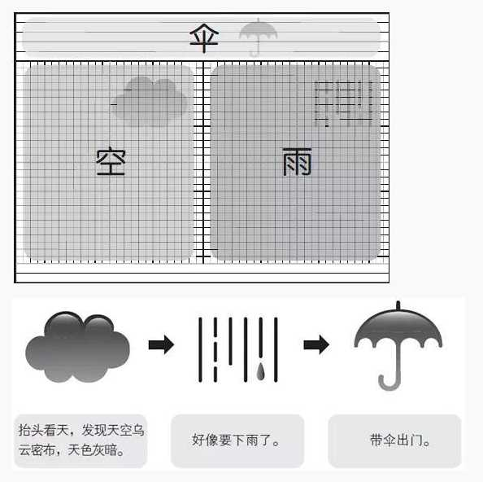
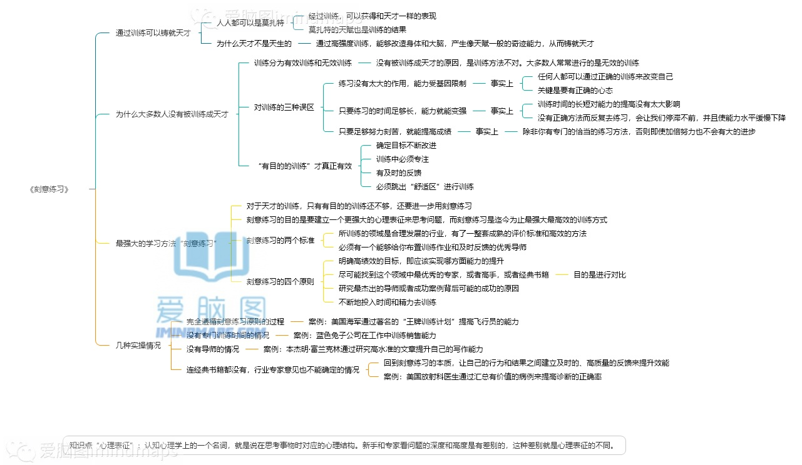
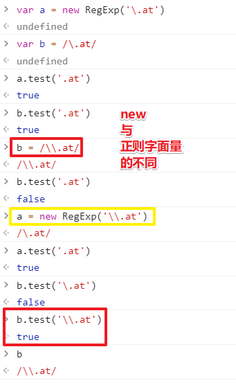

# 41~50

## 41、麦肯锡笔记法？

适用范围：**手写笔记&电子笔记**

麦肯锡笔记法，又名：空雨伞，分别代表了一页笔记的三元素：**现象、本质和选择**。



解释：

> 抬头一看天空，有乌云 ----现象
>
>然后分析觉得会下雨 ----本质
>
>最后不穿雨衣，带伞----选择

现象☞本质☞选择，这是一个递进的关系。

“空”，也就是现象，类似于传统的笔记，“雨”和“伞”，是你进一步的思考。

此法适用解决工作中各种问题，专注培养解决问题的关键性“思考”。

> 我觉得这方法尤其适用于编程

**➹：**[你有什么好的神笔记方法可以分享？ - 申壹的回答 - 知乎](https://www.zhihu.com/question/62737299/answer/890647386)

## 42、盒子模型、DOM（文档对象模型）……这其中的「模型」二字指示的是什么？

是把具体东西抽象化为数据吗？

有人说机器学习里边的模型是一个函数，数据输入到这个模型里边，就会得到我们想要的输出，而这个模型因为我们不断输入数据而进化，从而让我们得到更接近我们所期望的输出！

对了，还有个叫「CSSOM」的概念，翻译过来就是CSS对象模型，它是一组允许用JavaScript操纵CSS的API，它很像DOM，但是它是用于CSS而不是HTML。它允许用户动态地去读取和修改CSS样式。

**➹：**[谈谈「数据模型」是如何助力前端开发的 - 掘金](https://juejin.im/post/5d410e85f265da03dd3d4ee8)

**➹：**[什么是模型，什么是模式_漫游学海之旅-CSDN博客](https://blog.csdn.net/gdp12315_gu/article/details/50527069)

**➹：**[机器学习中的模型到底是指什么？ - 知乎](https://www.zhihu.com/question/285520177)

**➹：**[CSS Object Model (CSSOM) - Web APIs - MDN](https://developer.mozilla.org/en-US/docs/Web/API/CSS_Object_Model)


## 43、浏览器是如何工作的？

**➹：**[动画: 一个浏览器是如何工作的？](https://mp.weixin.qq.com/s/3GEoQ24yQl7qfrL3QPsamg)

**➹：**[渲染树的形成原理你真的很懂吗?](https://www.lagou.com/lgeduarticle/59076.html)

## 44、有人说MDN是忘记了什么就去查的文档？

如果只是查询API，那确实是这样，但如果理解某些概念，学习某些东西，其实看MDN学习是挺不错的选择！

总之，我想说的是MDN不仅仅只有API，它还有好多可深入阅读的东西！

知识点不是独立的碎片，很多时候都得从0到1这样分析这些知识点！

## 45、关于「刻意练习」？



**➹：**[为什么大神们都在讲《刻意练习》这本书？ - 赵铁柱的回答 - 知乎](https://www.zhihu.com/question/65785362/answer/433151047)

## 46、删除代码注释？

删除 java 注释 `/* */`：`/\*{1,2}[\s\S]*?\*/`

删除 java 注释 `//`：`//[\s\S]*?\n`

删除xml注释：`<!-[\s\S]*?-->`

删除空白行：`^\s*\n`

\n或者是\r\n  或者是\r 都可能是换行符，要看你的系统是windows还是Unix/Linux或者是mac的系统

有个bug：

> `//[\s\S]*?\n`，有问题的，我正常使用的字符串里面有这个`//`也被作为注释给干掉了。不科学！ 应该判断不是语句字符串！

**➹：**[正则表达式删除代码的注释_王鹏亮 的专栏-CSDN博客](https://blog.csdn.net/conquer0715/article/details/14446463)

## 47、关于 VS Code，如何修改它自带选中文本的颜色，以及默认的注释颜色？

``` json
{
  //设置用户选中代码段的颜色
  "workbench.colorCustomizations": {
      "editor.selectionBackground": "#3d593cc0"
  },
  // 自定义代码注释颜色
  "editor.tokenColorCustomizations": {
      "comments": "#82e0aa", // 注释
      "keywords": "#0a0", // 关键字
      "variables": "#f00", // 变量名
      "strings": "#e2d75d", // 字符串
      "functions": "#5b99fc", // 函数名
      "numbers": "#AE81FF" // 数字
  }
}
```

**➹：**[VSCode自定义配色方案 - garvenc - 博客园](https://www.cnblogs.com/garvenc/p/vscode_customize_color_theme.html)

**➹：**[依照十六進位搜尋顏色 - Adobe Color](https://color.adobe.com/zh/search?q=summer)

## 48、正则：转义字符、ASCII码表？

双重转义：



[A-z]的真实含义：

``` js
var c = /[A-z]/ 
c.test('a') //true
c.test('[') //true
c.test('^') //true
```

它不代表52个字母，而是根据ASCII的码值来算的，比如A-Z是65-90，a-z是97-122，其中91-96则是 `[/]^_、`

而且不能z-A这样颠倒顺序，因为这不符合语法规则！

**➹：**[ASCII码对照表](https://tool.oschina.net/commons?type=4)

## 49、安装npm包时，忘记写 `-D`了？

1. `yarn remove xxx`
2. `yarn add -D xxx`

## 50、如何查看这个代码是从哪里clone下来的？

``` bash
git remote -v
```


