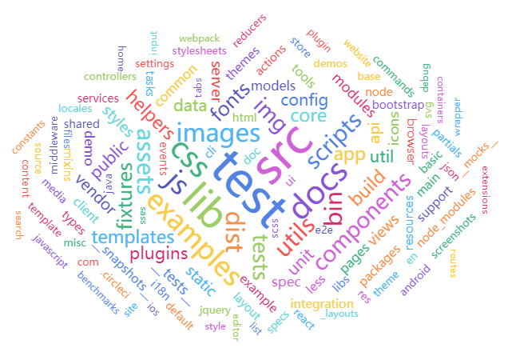

# 51~60

## 51、我想把这样格式「1）我是一个点」的字符串改成为高亮状态的？

```
1）我是一个点 -> ### <mark>1）我是一个点</mark>
```

做法：

```
(^\d+）[\s\S]*) -> 正则查找
### <mark>$1</mark> -> 替换
```

> 思路：开头是数字的（1位或多于1位），匹配一个「）」，任意字符（0位 or 多位），整体加括号，用于在替换时，使用「$1」表示这个要替换的字符串，说白了，我用圆括号就是为了让匹配字符串加上前缀和后缀

**➹：**[正则表达式 – 元字符 - 菜鸟教程](https://www.runoob.com/regexp/regexp-metachar.html)

**➹：**[使用VsCode正则表达式批量替换 - 简书](https://www.jianshu.com/p/7935fdcb17d0)

**➹：**[可以用在 VS Code 中的正则表达式小技巧 - 掘金](https://juejin.im/post/5cee4f6c518825332550cd9d)

## 52、为什么看不懂廖雪峰的Python学习教程？

> 这个问题的缘由来自于我觉得自己被廖雪峰割韭菜了，于是我想找一些黑他的回答。3年前，我买了他的java基础课程，花了799，而现在这个课程已经是99了……该课程我没有怎么看完，也没有给我带来任何实质性的价值……屯课不是一种好行为，当你基于一个人的背书去买他的课的时候，如果这个课并没有给你带你实质性的改变，而且这个课比免费的课还要渣的话，那我觉得真得是被割韭菜了……当然，廖雪峰这个Java课确实讲得还挺不错的，只是并不适合初学者，因为起初我看的时候，觉得他讲得太过于简洁暴力了，可以说是着重把JavaSE里边的重点进行讲解，而这样确实可以节省他人学习的大量时间……不过，我还是很讨厌他用的开发工具——Eclipse……

以下这个答案，让我意识到，只看一个人的课程一劳永逸是错的，是极大的错误，廖雪峰的java课程我之所以没有看完，是因为我转前端学习去了，因为我觉得学习是需要闭环的，如从前台到后台是一个过程，而且这顺序我认为是不可颠倒的，而这样一学前端，我发觉没时间去学Java了……我报了饥人谷的课程学习了前端，我基本上都是看芳芳的课程进行学习的，芳芳的课让我的自学能力上升了一个台阶，这是他的课给我带来的实质性改变，当然，只看芳芳的课并不能让我的前端学习变得更好，于是就去看了妙思维里小野老师的免费前端课，从他的课程里边我了解到程序是需要设计的，芳芳的课也讲到了程序是如何设计的，但并没有小野老师给我带来的那种强烈冲击感……

---

因为你试图用一劳永逸。

你试图使用一种教材弄懂所有问题，那是不行的。

虽然我们通常推荐新人学python，我也会推荐廖雪峰的新手引导做得很赞……

但是……

写代码不是这样子的事情……

**每个人基础不一样，认知不一样，脑力不一样，学习习惯不一样，**

**你怎么可能通过一份引导，让所有人都可以完全从零到一？**

**那不现实！不管什么事情，都不现实，不要说写代码了。**


我举个例子啊。你学windows的时候，新手教程有教你什么是鼠标吗？

你学鼠标的时候，有教你什么是ps/2串口吗？

你学ps/2串口的时候，有教你驱动怎么写吗？

这样下去，最后windows使用手册上是不是要把怎么生产cpu写进去？

所有的教程图书都会替你分割好知识的边界，但是这个边界不一定适合你。

**遇到你想要的边界外的知识你要发挥主观能动性，**

**遇到你不想要的边界内的知识你要把书页翻过去。**

你没有系统性地学习了解一样东西之前，

你当然会看不懂教程当中的一部分内容。

那么你怎么系统性地去了解呢？

我不知道。

这个问题值很多钱。

我只能跟你讲，你要一边写一边学一边google一边百度。

这很难我是知道的。

但我要反过来问你，

**要是写代码是你可以用一个人的教材一劳永逸的事情，你觉得还会那么“高薪”吗？**

**当年我照着用户手册啃gvbasic的时候，和你不一样的是，越觉得自己不懂，我越开心。**

**为什么呐？因为我越是弄不懂的事情，将来等我弄懂了，我就越可以用它来让自己牛逼。**

当年我还是读寄宿制的，乔布斯还不知道在哪个犄角旮旯里呆着，上网没有的，资料要付钱买的，还不是读者用户手册，别人的代码啃着啃着入了门？不懂？不懂是好事啊，自己多试试，多改改，然后不就能弄懂了嘛。

**➹：**[为什么看不懂廖雪峰的Python学习教程？ - 温酒的回答 - 知乎](https://www.zhihu.com/question/51536745/answer/255860911) 

## 53、下边这张图是用什么生成的？



echarts -> 词云

## 54、有人问到「原型链、继承那块有必要完全弄明白吗？」

简单点来说：

> 当然，这个是JS 的基础，后续的面向对象，模块化开发，组件化，只要涉及到对象相关，都是需要的

深层次来说：

> revi理论基础学习完成并不代表掌握，理论是为应用服务的，正向学习理论的同时，要用应用反向来证明理论的意义。科学技术的学习研究与应用都是这样的过程，很多同学学不好，有三点值得注意：1是自我欺骗，往往很多同学觉得自己会了，实际上只是似是而非，往往在着急就业或者跳槽的同学学习上由为明显，2是遗忘，很多同学在学习理论的时候感觉很通透，到越学到后面，越模糊，这是人的生理正常的表现，对于技术而言，理论大部分是靠理解的，而不是靠浅记忆的，需要大量应用去巩固才可能深度记忆，实际上基础的es只有4个重点，1函数相关，2作用域预编译闭包，3原型原型链继承，4数组对象的操作，其他知识大部分都和这四部分相关或者衍生出来的，所以从应用层面巩固这些知识点是由为重要的。3是学习不完整不系统，技术类的理论都是有串联性的，当你学到一个阶段时，可能跟模糊，而进一步学习到另一个阶段，就会觉得前一个阶段更加容易理解了，还有就是系统化的学习，任何技术都是由浅入深，由理论到应用的学习过程，还是那句话，扎实的基础是为应用服务的，那么夯实基础就需要有针对性的应用去反证理论的存在意义，基础和应用一定是一个系统的相辅相成的关系，同学们在学习任何一门技术都等同于诸如学习剃头修脚厨师，必须有一个系统的方案针对于就业深度学习，而不是3年以后拿剪刀的姿势都是错的，拿刀都是挫的，垫勺都嫌重，你必须有一个规范化完整的科学的学习方案才可能练就一个成熟的前端工程师。JS++能帮你的绝对不仅仅是就业问题，而是助你成为一个成熟的工程师，架构师，项目负责人。把握今年的春天招聘，你会回来感谢我的，不要问我为什么。系统学习前端请加微信jsppxiaoye。

revi -> 复习、温习、温故知新

正向 -> 复习 -> 理论基础知识 -> 代表掌握吗？ -> 非也 -> 反向 -> 你还得证明理论的意义 -> 即应用 -> 不断「正向+反向」 -> 掌握

## 55、从芳芳和小野老师那里学到的两个习惯？

- 芳芳 -> 画图 -> 把一些难以用文字描述的东西用图给画出来
- 小野 -> 箭头「 -> 」 -> 这个箭头虽然就两个字符，但它提升了我看视频的速率 -> 箭头的存在让我清清楚楚地感受到了「顺序」的存在 -> 没有箭头之前，我一般用的是「首先，然后，然后，最后，总之……」等这样的词来表示顺序，但这样很不简洁，尤其是看视频时描述老师怎么写一个东西的时候这种不简洁就像是意大利面条似的 -> 而使用箭头就可以把意大利面条搞成像方便面这样一块一块的 -> 总之，用箭头「 -> 」可描述伪代码、可描述过程顺序等等 -> 当然，最重要的是极大的提升了我看视频的效率

如果能力可量化的话，那么一个小习惯，就能对一个的能力增加好几个点 -> 我开始意识到模仿能力强的人的习惯和行为，对一个菜鸡的我来说，会有极其巨大的提升 -> 当然，我只copy自己能做到的，而且不依赖任何环境的事儿 -> 说白了，就是copy大佬们的一些「可复制」、「实用性强」的习惯和行为

## 56、英语翻译 & 看视频说一句写一句？

英文翻译 -> 尝试理解作者的意思，而不是翻译

看视频学习 -> 尝试理解老师在表达什么意思，而不是完全把老师的原话给抄下来

**➹：**[如何阅读英文原版书？ - 旧时微风拂晓城的回答 - 知乎](https://www.zhihu.com/question/21043780/answer/978964800)


